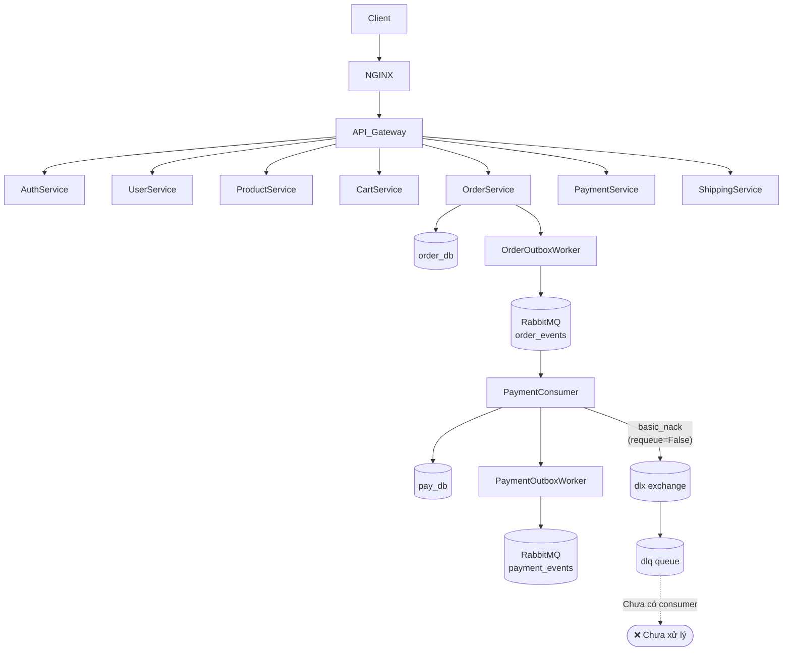
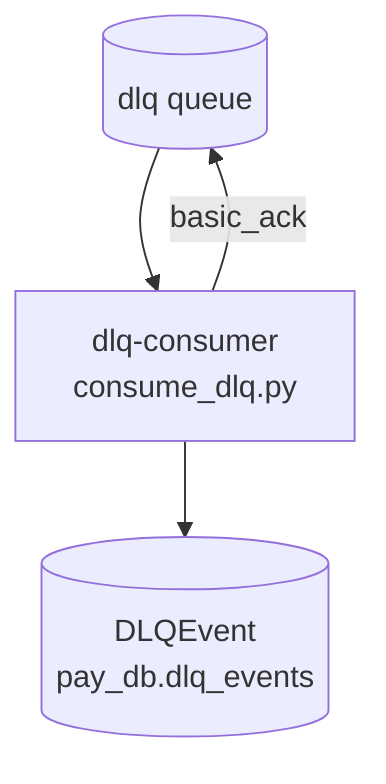
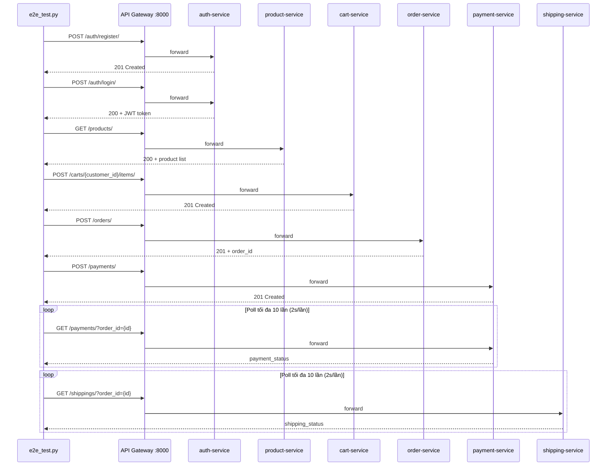

# Tài liệu Thiết kế: saga-improvements

## Overview

Tài liệu này mô tả thiết kế kỹ thuật cho 4 nhiệm vụ cải tiến hệ thống thương mại điện tử microservices:

1. **Sửa Seed Script** – Thay thế `setval` cứng bằng `COALESCE` động trong tất cả 12 file SQL seed.
2. **Git Commit** – Stage và commit các thay đổi chưa lưu liên quan đến Saga Orchestration + Outbox Pattern.
3. **DLQ Consumer** – Thêm consumer cho Dead Letter Queue, lưu message thất bại vào model `DLQEvent`.
4. **E2E Test Script** – Tạo script Python kiểm thử end-to-end toàn bộ luồng mua hàng.

Hệ thống hiện tại đã có sẵn cơ sở hạ tầng DLQ (`dlx` exchange, `dlq` queue khai báo trong `common/common/events.py`), Outbox Pattern (`AbstractOutboxEvent` trong `common/common/outbox.py`), và `payment-consumer` đã thực hiện `basic_nack(requeue=False)` khi lỗi để đẩy message vào DLQ.

---

## Architecture

### Kiến trúc tổng thể hiện tại



### Kiến trúc sau khi cải tiến (Task 3)



### Luồng E2E Test (Task 4)



---

## Components and Interfaces

### Task 1: Seed Script

**Thành phần bị ảnh hưởng:** 12 file SQL trong `scripts/sql/`

**Pattern thay thế:**
```sql
-- Trước (cứng):
SELECT setval(pg_get_serial_sequence('orders', 'id'), 3);

-- Sau (động):
SELECT setval(pg_get_serial_sequence('orders', 'id'), COALESCE((SELECT MAX(id) FROM orders), 1));
```

**Danh sách file và bảng cần cập nhật:**

| File | Bảng |
|------|------|
| `13_user_db_seed.sql` | `users`, `customer_profiles`, `staff_profiles`, `web_addresses` |
| `06_order_db_seed.sql` | `discounts`, `orders`, `order_items`, `order_discounts`, `invoices`, `coupons` |
| `07_pay_db_seed.sql` | `payment_methods`, `payments`, `transactions`, `customer_payment_methods` |
| `08_ship_db_seed.sql` | `shipping_methods`, `shippings` |
| `12_product_db_seed.sql` | `categories`, `products` |
| `02_catalog_db_seed.sql` | `authors`, `categories`, `genres`, `publishers` |
| `03_book_db_seed.sql` | `books` |
| `04_staff_db_seed.sql` | `staff_users`, `inventory_staff` |
| `05_cart_db_seed.sql` | `carts`, `cart_items` |
| `09_manager_db_seed.sql` | `warehouses`, `suppliers`, `purchase_orders` |
| `10_comment_rate_db_seed.sql` | `book_reviews` |
| `11_recommender_db_seed.sql` | `recommendation_logs` |

**Lưu ý `seed_all.sh`:** File này đã có pattern COALESCE cho các service chính (auth, user, product, order, payment, shipping). Cần xác minh rằng `auth_users` sequence được xử lý đúng (đã có trong case `auth-service`).

---

### Task 2: Git Commit

**Thành phần:** Git repository tại root của project.

**Quy trình:**
1. `git add` từng file/thư mục trong danh sách được chỉ định.
2. `git commit -m "feat: implement saga orchestration with outbox pattern"`

**Danh sách file cần stage:**
```
docker-compose.yml
api-gateway/gateway/views.py
api-gateway/templates/
common/common/client.py
order-service/entrypoint.sh
order-service/order/models.py
order-service/requirements.txt
order-service/order/migrations/0002_orderoutbox.py
order-service/order/migrations/0003_orderoutbox_index.py
payment-service/payment/management/commands/consume_orders.py
payment-service/requirements.txt
product-service/product/models.py
product-service/requirements.txt
product-service/product/migrations/0003_product_image_url.py
recommender-ai-service/app/management/commands/seed_mock.py
scripts/init_databases.sql
scripts/sql/06_order_db_seed.sql
scripts/sql/12_product_db_seed.sql
scripts/sql/13_user_db_seed.sql
api-gateway/static/product-images/
```

---

### Task 3: DLQ Consumer

#### 3.1 Model `DLQEvent`

**File:** `payment-service/payment/models.py` (thêm vào cuối)

```python
class DLQEvent(models.Model):
    queue_name    = models.CharField(max_length=255)
    exchange      = models.CharField(max_length=255, blank=True)
    routing_key   = models.CharField(max_length=255, blank=True)
    body          = models.JSONField()
    error_message = models.TextField(blank=True)
    received_at   = models.DateTimeField(auto_now_add=True)
    replayed      = models.BooleanField(default=False)

    class Meta:
        db_table = "dlq_events"

    def __str__(self):
        return f"DLQEvent(queue={self.queue_name}, received={self.received_at})"
```

#### 3.2 Management Command `consume_dlq.py`

**File:** `payment-service/payment/management/commands/consume_dlq.py`

**Logic chính:**
- Lấy channel từ `EventPublisher.get_channel()` (đã setup topology DLQ).
- Khai báo lại `dlq` queue (idempotent) để đảm bảo tồn tại.
- Đăng ký callback `on_dlq_message`.
- Trong callback:
  1. Parse `body` từ bytes → JSON (nếu lỗi, dùng raw string).
  2. Trích xuất `event_type`, `order_id` từ payload (nếu có).
  3. Trích xuất `exchange` và `routing_key` từ `method` (delivery info).
  4. Ghi log với đầy đủ thông tin.
  5. Tạo `DLQEvent` trong DB.
  6. Gửi `basic_ack`.

```python
import json
import logging
from django.core.management.base import BaseCommand
from payment.models import DLQEvent
from common.events import EventPublisher

logger = logging.getLogger(__name__)

class Command(BaseCommand):
    help = "Consume messages from the Dead Letter Queue (dlq)"

    def handle(self, *args, **options):
        self.stdout.write(self.style.WARNING("Starting DLQ Consumer..."))
        channel = EventPublisher.get_channel()

        # Idempotent re-declare
        channel.queue_declare(queue='dlq', durable=True)

        def on_dlq_message(ch, method, properties, body):
            raw = body.decode('utf-8', errors='replace')
            try:
                payload = json.loads(raw)
            except json.JSONDecodeError:
                payload = {"_raw": raw}

            event_type = payload.get("event_type", "unknown")
            order_id   = payload.get("data", {}).get("order_id", "unknown")
            exchange   = method.exchange or ""
            routing_key = method.routing_key or ""

            logger.error(
                "DLQ message received",
                extra={
                    "event_type": event_type,
                    "order_id": order_id,
                    "exchange": exchange,
                    "routing_key": routing_key,
                    "body": payload,
                }
            )

            DLQEvent.objects.create(
                queue_name="dlq",
                exchange=exchange,
                routing_key=routing_key,
                body=payload,
                error_message=f"event_type={event_type}, order_id={order_id}",
            )

            ch.basic_ack(delivery_tag=method.delivery_tag)

        channel.basic_consume(queue='dlq', on_message_callback=on_dlq_message)
        self.stdout.write(self.style.SUCCESS("DLQ Consumer listening on 'dlq'..."))
        try:
            channel.start_consuming()
        except KeyboardInterrupt:
            channel.stop_consuming()
```

#### 3.3 Migration

**File:** `payment-service/payment/migrations/000X_add_dlqevent.py`

Tạo bằng lệnh: `python manage.py makemigrations payment --name add_dlqevent`

#### 3.4 Docker Compose – Service `dlq-consumer`

Thêm vào `docker-compose.yml` trong section Workers & Consumers:

```yaml
dlq-consumer:
  build: ./payment-service
  command: ["python", "manage.py", "consume_dlq"]
  environment:
    - SECRET_KEY=${SECRET_KEY_PAY:-pay-service-dev-key}
    - DB_NAME=${DB_NAME_PAY:-pay_db}
    - DB_USER=${POSTGRES_USER:-postgres}
    - DB_PASSWORD=${POSTGRES_PASSWORD:-postgres}
    - DB_HOST=payment-db
    - DB_PORT=${DB_PORT:-5432}
    - RABBITMQ_HOST=rabbitmq
    - RABBITMQ_USER=${RABBITMQ_USER:-user}
    - RABBITMQ_PASS=${RABBITMQ_PASS:-password}
    - PYTHONPATH=/app/common
    - SERVICE_NAME=dlq-consumer
  depends_on:
    payment-db:
      condition: service_healthy
    rabbitmq:
      condition: service_healthy
  networks:
    - bookstore-net
  restart: unless-stopped
  volumes:
    - ./common:/app/common
```

---

### Task 4: E2E Test Script

**File:** `scripts/e2e_test.py`

**Cấu trúc module:**

```
e2e_test.py
├── Hằng số: BASE_URL, ANSI colors, MAX_POLL, POLL_INTERVAL
├── class StepResult(NamedTuple): name, passed, duration, detail
├── def print_step(result): in PASS/FAIL với màu ANSI
├── def print_summary(results): in bảng tổng kết
├── def random_user(): sinh username/email ngẫu nhiên
├── def step_register(session, dry_run) -> StepResult
├── def step_login(session, username, password, dry_run) -> StepResult
├── def step_get_products(session, dry_run) -> StepResult
├── def step_add_to_cart(session, customer_id, product_id, dry_run) -> StepResult
├── def step_checkout(session, customer_id, product_id, dry_run) -> StepResult
├── def step_pay(session, order_id, dry_run) -> StepResult
├── def step_poll_payment(session, order_id, dry_run) -> StepResult
├── def step_poll_shipping(session, order_id, dry_run) -> StepResult
└── def main(): parse args, chạy các bước, in summary, sys.exit
```

**Xử lý màu ANSI:**
```python
GREEN = "\033[92m"
RED   = "\033[91m"
RESET = "\033[0m"
BOLD  = "\033[1m"
```

**Logic poll:**
```python
for attempt in range(MAX_POLL):  # MAX_POLL = 10
    resp = session.get(f"{BASE_URL}/payments/?order_id={order_id}", ...)
    status = resp.json()[0].get("payment_status")
    if status == "completed":
        return StepResult(passed=True, ...)
    time.sleep(POLL_INTERVAL)  # POLL_INTERVAL = 2
return StepResult(passed=False, detail="Timeout after 10 attempts")
```

**Dry-run mode:**
```python
if dry_run:
    print(f"  [DRY-RUN] Would POST {BASE_URL}/auth/register/")
    return StepResult(name="Register", passed=True, duration=0, detail="dry-run")
```

---

## Data Models

### DLQEvent (mới – Task 3)

| Trường | Kiểu | Mô tả |
|--------|------|-------|
| `id` | AutoField (PK) | Khóa chính tự tăng |
| `queue_name` | CharField(255) | Tên hàng đợi nguồn (luôn là `"dlq"`) |
| `exchange` | CharField(255) | Exchange nguồn (có thể rỗng) |
| `routing_key` | CharField(255) | Routing key (có thể rỗng) |
| `body` | JSONField | Nội dung message (parsed JSON hoặc `{"_raw": "..."}`) |
| `error_message` | TextField | Thông tin lỗi tóm tắt |
| `received_at` | DateTimeField | Thời điểm nhận (auto_now_add) |
| `replayed` | BooleanField | Đã phát lại chưa (default False) |

**Bảng DB:** `dlq_events` trong `pay_db`

### Không có thay đổi schema cho Task 1, 2, 4

---

## Correctness Properties

*Một thuộc tính là đặc điểm hoặc hành vi phải đúng trong mọi lần thực thi hợp lệ của hệ thống – về cơ bản là một phát biểu hình thức về những gì hệ thống phải làm. Các thuộc tính đóng vai trò cầu nối giữa đặc tả dạng ngôn ngữ tự nhiên và đảm bảo tính đúng đắn có thể kiểm chứng tự động.*

Sau khi phân tích prework, feature này chủ yếu bao gồm các tác vụ infrastructure (SQL seed, git, Docker Compose) và integration (RabbitMQ consumer, HTTP E2E). Chỉ có một phần nhỏ – logic lưu `DLQEvent` từ message – phù hợp với property-based testing.

### Property 1: DLQEvent phản ánh đúng nội dung message

*Với bất kỳ* message hợp lệ nào nhận được từ hàng đợi `dlq` (có thể có bất kỳ cấu trúc JSON nào), `DLQEvent` được tạo ra phải có trường `body` chứa đúng nội dung đã parse từ message đó, và trường `queue_name` luôn là `"dlq"`.

**Validates: Requirements 3.3**

---

## Error Handling

### Task 1 – Seed Script
- Nếu bảng không tồn tại khi chạy `setval`, PostgreSQL sẽ báo lỗi. Đây là lỗi cấu hình môi trường, không cần xử lý trong script.
- `COALESCE(..., 1)` đảm bảo không bao giờ trả về NULL, tránh lỗi `setval` với NULL.

### Task 3 – DLQ Consumer
- **JSON parse error:** Bắt `json.JSONDecodeError`, lưu `{"_raw": raw_string}` vào `body`.
- **DB error khi tạo DLQEvent:** Log lỗi, vẫn gửi `basic_ack` để tránh message bị requeue vô hạn (DLQ không nên có DLQ của chính nó).
- **RabbitMQ connection lost:** `pika` sẽ raise exception, container sẽ crash và Docker `restart: unless-stopped` sẽ khởi động lại.

### Task 4 – E2E Test Script
- **HTTP timeout:** Dùng `timeout=10` cho mỗi request.
- **Non-2xx response:** Bắt lỗi, đánh dấu bước FAIL, in status code và response body.
- **Poll timeout:** Sau 10 lần thử, đánh dấu FAIL với message "Timeout after 10 attempts".
- **Unexpected exception:** Bắt `Exception` tổng quát, đánh dấu bước FAIL với traceback.

---

## Testing Strategy

### Đánh giá PBT

Feature này chủ yếu là infrastructure và integration. PBT chỉ áp dụng cho một phần nhỏ:

| Task | Loại test phù hợp |
|------|-------------------|
| Task 1 – Seed SQL | Kiểm tra cấu trúc file (regex/grep), integration test với DB |
| Task 2 – Git commit | Smoke test (git log, git show) |
| Task 3 – DLQ Consumer | **Property test** cho logic lưu DLQEvent; example test cho ack/nack; integration test với RabbitMQ |
| Task 4 – E2E Script | Integration test với hệ thống thực; example test cho dry-run, exit codes |

### Unit Tests

**Task 1:**
- Kiểm tra mỗi file SQL không còn pattern `setval(..., [0-9]+)` (regex scan).
- Kiểm tra pattern `COALESCE` xuất hiện đúng số lần bằng số bảng cần cập nhật.

**Task 3:**
- Test `DLQEvent` model fields và `db_table`.
- Test callback với message JSON hợp lệ → `basic_ack` được gọi, `DLQEvent` được tạo.
- Test callback với message không phải JSON → `body = {"_raw": ...}`, không raise exception.
- Test callback với message thiếu `event_type` → vẫn tạo `DLQEvent` thành công.

**Task 4:**
- Test `--dry-run` flag: không có HTTP call, exit code 0.
- Test exit code 0 khi tất cả bước pass (mock HTTP).
- Test exit code 1 khi một bước fail (mock HTTP).
- Test poll timeout: mock luôn trả về `pending`, kiểm tra FAIL sau 10 lần.
- Test output chứa ANSI color codes.

### Property-Based Tests

Dùng thư viện `hypothesis` (Python):

**Property 1: DLQEvent phản ánh đúng nội dung message**
```python
# Feature: saga-improvements, Property 1: DLQEvent body matches message content
@given(st.dictionaries(st.text(), st.text() | st.integers() | st.none()))
@settings(max_examples=100)
def test_dlq_event_body_matches_message(payload):
    raw = json.dumps(payload).encode()
    # Simulate callback logic
    parsed = json.loads(raw.decode('utf-8'))
    event = DLQEvent(queue_name="dlq", body=parsed, ...)
    assert event.body == parsed
    assert event.queue_name == "dlq"
```

### Integration Tests

- **Task 3:** Chạy `dlq-consumer` với RabbitMQ thực (Docker Compose), publish một message vào `dlq`, kiểm tra `DLQEvent` được tạo trong DB.
- **Task 4:** Chạy `e2e_test.py` với toàn bộ hệ thống đang chạy (`docker compose up`), kiểm tra exit code 0.

### Cấu hình Property Test

- Minimum 100 iterations mỗi property test.
- Tag format: `# Feature: saga-improvements, Property {N}: {property_text}`
