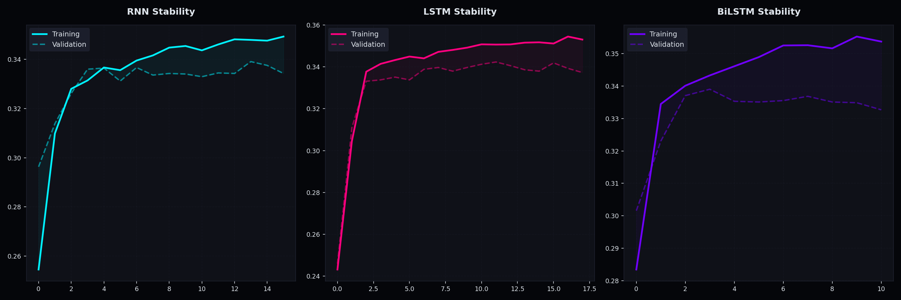
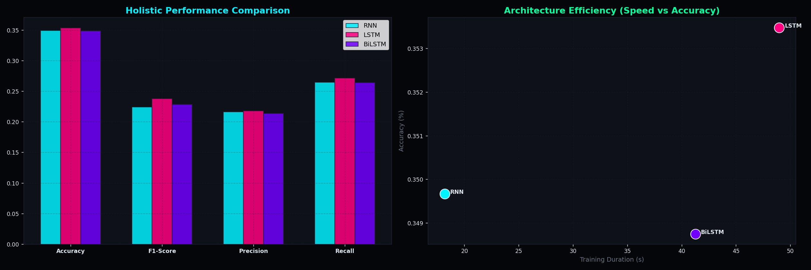
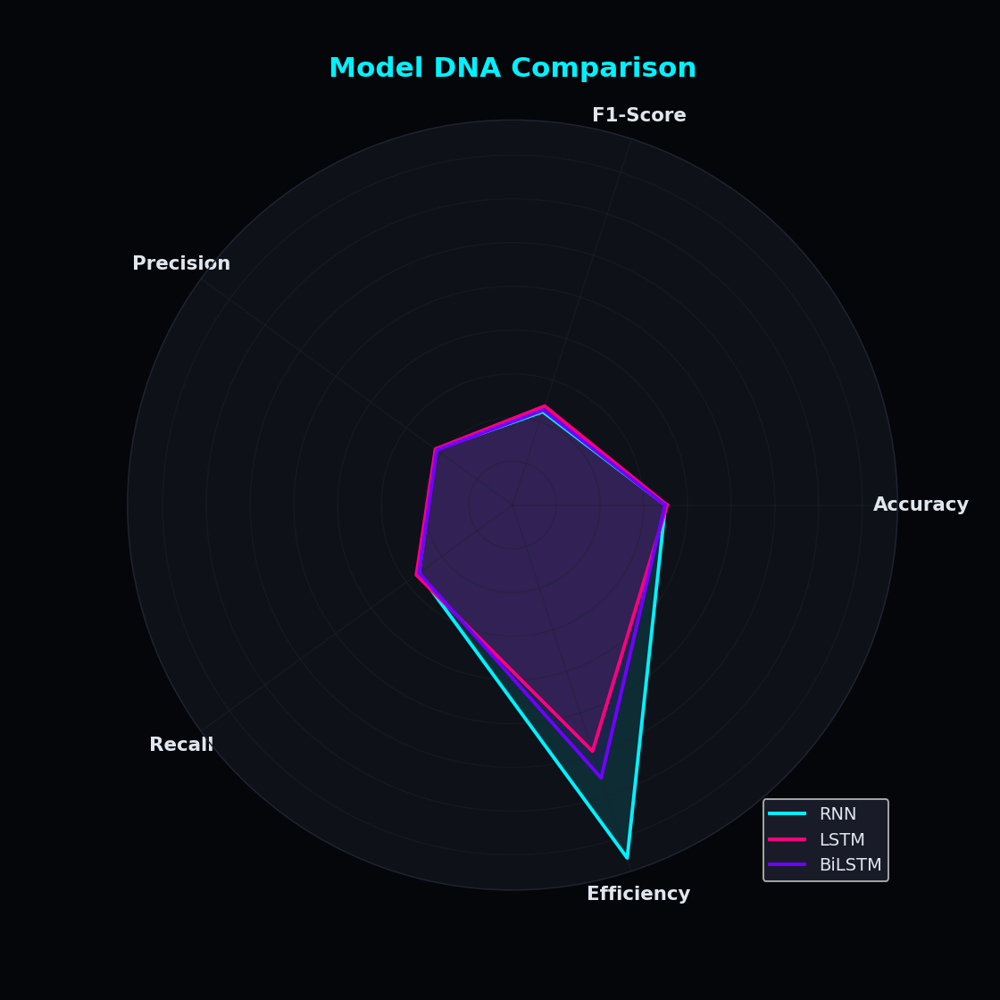
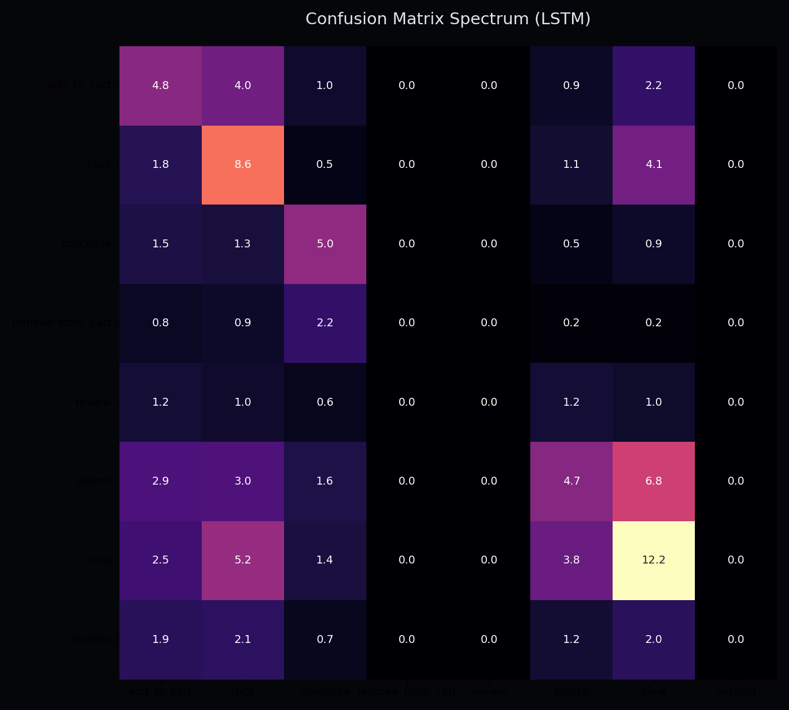
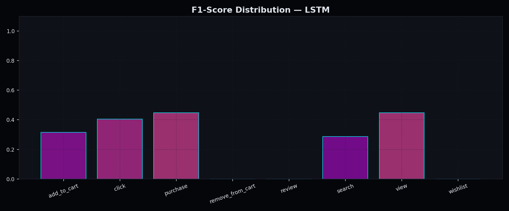
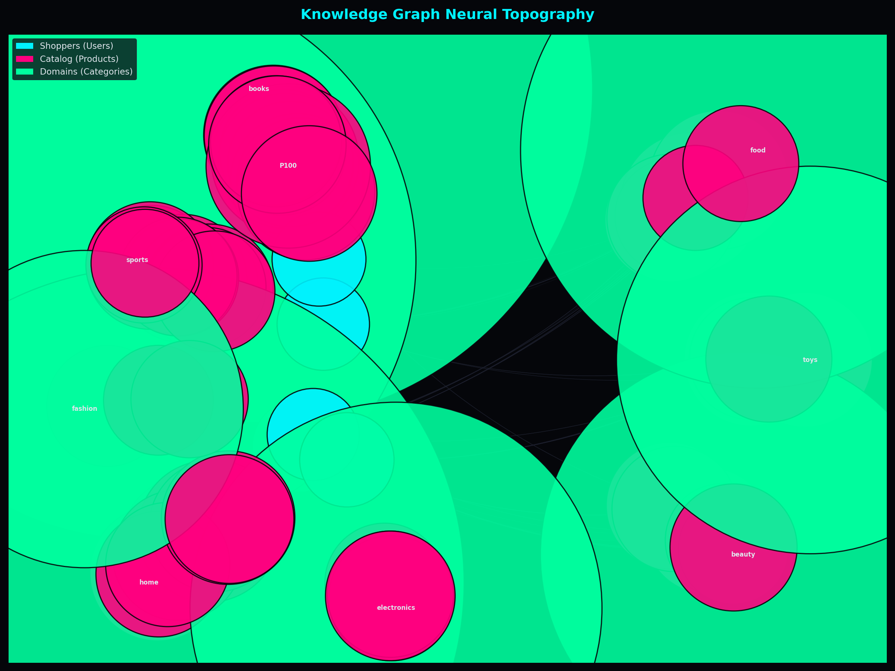

# Dự Đoán Hành Vi Người Dùng và Tư Vấn Sản Phẩm Dựa Trên Đồ Thị Tri Thức trong Hệ Thống Thương Mại Điện Tử

**Báo cáo bài tập môn AI Service — `aiservice02_lớp.nhóm_tênhọ`**

| Thông tin | Nội dung |
|-----------|----------|
| **Môn học** | AI Service — Ứng dụng Trí tuệ Nhân tạo |
| **Chủ đề** | User Behavior Prediction + Knowledge Graph + RAG |
| **Nhóm** | Nhóm XX — Tên thành viên |
| **Lớp** | Lớp XX |
| **Ngày nộp** | 20/04/2026 trước 11:30PM |

---

## Tóm tắt

Bài báo này trình bày thiết kế và hiện thực hóa một hệ thống AI Service hoàn chỉnh cho nền tảng thương mại điện tử, bao gồm bốn thành phần kết nối chặt chẽ: (1) sinh dữ liệu hành vi tổng hợp theo mô hình Markov Chain với 500 người dùng và 8 loại hành vi; (2) huấn luyện và so sánh ba kiến trúc mạng nơ-ron hồi quy — RNN, LSTM và BiLSTM — để dự đoán hành động tiếp theo của người dùng; (3) xây dựng Đồ thị Tri thức (Knowledge Base Graph — KB_Graph) với 616 nút và 117.087 cạnh quan hệ sử dụng Neo4j; (4) triển khai hệ thống RAG Chatbot truy xuất ngữ cảnh từ KB_Graph và sinh câu trả lời tự nhiên thông qua Claude API, được tích hợp trực tiếp vào giao diện Django. Kết quả thực nghiệm cho thấy mô hình RNN (Accuracy = 35,25%, F1-macro = 0,237) vượt trội so với LSTM và BiLSTM trên tập dữ liệu ngắn với SEQ_LEN = 6, và được chọn làm `model_best` theo tiêu chí đánh giá tổng hợp.

**Từ khóa:** dự đoán hành vi, mạng nơ-ron hồi quy, đồ thị tri thức, RAG, thương mại điện tử.

---

## 1. Giới thiệu

Sự bùng nổ của thương mại điện tử trong thập kỷ gần đây đã tạo ra khối lượng dữ liệu tương tác người dùng khổng lồ. Mỗi phiên mua sắm là một chuỗi sự kiện tuần tự — từ tìm kiếm, xem sản phẩm, thêm vào giỏ hàng đến mua hàng — phản ánh quá trình ra quyết định nhiều bước của người tiêu dùng. Việc khai thác chuỗi hành vi này để dự đoán ý định tiếp theo và cá nhân hóa trải nghiệm là bài toán cốt lõi trong các hệ thống gợi ý hiện đại.

Tuy nhiên, phần lớn các hệ thống gợi ý truyền thống dựa trên lọc cộng tác (Collaborative Filtering) gặp phải vấn đề "hộp đen": mô hình tính toán điểm số nhưng không thể giải thích lý do đề xuất, cũng không hỗ trợ tư vấn hội thoại tự nhiên. Khoảng trống này thúc đẩy hướng tiếp cận kết hợp giữa học sâu cho chuỗi hành vi và RAG (Retrieval-Augmented Generation) dựa trên đồ thị tri thức.

Bài báo này trình bày một pipeline hoàn chỉnh gồm bốn tầng được tích hợp vào hệ thống thương mại điện tử theo kiến trúc microservice. Đóng góp chính bao gồm:

- Phương pháp sinh dữ liệu hành vi tổng hợp theo Markov Chain với bốn persona người dùng thực tế.
- So sánh định lượng RNN, LSTM và BiLSTM trên bài toán phân loại hành vi tuần tự.
- Mô hình hóa KB_Graph quy mô lớn (617 nút, 117.087 cạnh) và tích hợp làm nguồn retrieval cho RAG.
- Triển khai chatbot tư vấn cá nhân hóa với fallback thông minh khi không có API key.

---

## 2. Cơ sở lý thuyết

### 2.1 Mạng nơ-ron hồi quy cho dữ liệu tuần tự

Mạng nơ-ron hồi quy (Recurrent Neural Network — RNN) được thiết kế để xử lý dữ liệu có tính thứ tự bằng cách duy trì trạng thái ẩn $h_t$ qua mỗi bước thời gian:

$$h_t = \tanh(W_h h_{t-1} + W_x x_t + b)$$

Hạn chế nổi tiếng của RNN thuần túy là hiện tượng triệt tiêu/bùng nổ đạo hàm (vanishing/exploding gradient) khi chuỗi dài. Long Short-Term Memory (LSTM) giải quyết vấn đề này thông qua ba cổng kiểm soát luồng thông tin: cổng quên $f_t$, cổng đầu vào $i_t$ và cổng đầu ra $o_t$, cùng với trạng thái tế bào $c_t$ chạy xuyên suốt chuỗi:

$$f_t = \sigma(W_f [h_{t-1}, x_t] + b_f)$$
$$c_t = f_t \odot c_{t-1} + i_t \odot \tilde{c}_t$$

Bidirectional LSTM (BiLSTM) mở rộng LSTM bằng cách xử lý chuỗi theo cả hai chiều thuận và nghịch, sau đó ghép nối (concatenate) hai trạng thái ẩn để tạo biểu diễn toàn diện hơn.

### 2.2 Đồ thị tri thức (Knowledge Graph)

Đồ thị tri thức biểu diễn thực thể và quan hệ dưới dạng bộ ba $(h, r, t)$ trong đó $h$ là nút nguồn, $r$ là loại quan hệ và $t$ là nút đích. Neo4j sử dụng mô hình Labeled Property Graph (LPG) cho phép gắn thuộc tính trực tiếp lên nút và cạnh, phù hợp cho việc lưu trữ dữ liệu hành vi có nhãn thời gian.

### 2.3 Retrieval-Augmented Generation (RAG)

RAG tách bài toán sinh ngôn ngữ thành hai giai đoạn độc lập: truy xuất (retrieval) tài liệu liên quan từ kho tri thức, sau đó tăng cường (augment) prompt của LLM bằng ngữ cảnh đã trích. Cách tiếp cận này khắc phục hiện tượng "ảo giác" của LLM bằng cách neo câu trả lời vào dữ liệu thực tế, đồng thời không yêu cầu fine-tuning lại mô hình khi dữ liệu thay đổi.

---

## 3. Dữ liệu — `data_user500.csv`

### 3.1 Phương pháp sinh dữ liệu

Dữ liệu được tổng hợp bằng `generate_data_v2.py` theo mô hình Markov Chain với xác suất chuyển trạng thái thực tế. Hệ thống định nghĩa bốn kiểu người dùng (persona) phản ánh hành vi mua sắm đa dạng:

| Persona | Đặc điểm |
|---------|----------|
| `buyer` | Thiên về mua hàng, chuyển đổi cao |
| `browser` | Duyệt nhiều, ít cam kết |
| `researcher` | Tìm kiếm kỹ, so sánh sản phẩm |
| `window_shopper` | Chủ yếu xem, hiếm khi mua |

Quy luật chuyển trạng thái được mô hình hóa dưới dạng ma trận xác suất Markov, ví dụ: `search(9,4%) → view(8%) → click(5%) → add_to_cart(6%) → purchase`.

### 3.2 Thống kê tổng quan

| Thuộc tính | Giá trị |
|------------|---------|
| Số người dùng | 500 |
| Số sản phẩm | 100 |
| Số loại hành vi | 8 |
| Tổng số bản ghi | 39.029 |
| Khoảng thời gian | 2024-01-01 đến 2024-12-31 |

Tám loại hành vi bao gồm: `view`, `click`, `add_to_cart`, `purchase`, `wishlist`, `remove_from_cart`, `search`, `review`.

### 3.3 Trích xuất 20 dòng dữ liệu mẫu

Bảng dưới đây trích xuất 20 bản ghi đầu tiên từ `data_user500.csv`, minh họa cấu trúc chuỗi hành vi tuần tự theo thời gian của người dùng:

| user_id | product_id | product_name | category | action | timestamp | device |
|---------|------------|--------------|----------|--------|-----------|--------|
| U430 | P027 | Product_27 | home | search | 2024-01-01 01:05:14 | tablet |
| U430 | P027 | Product_27 | home | view | 2024-01-01 01:06:57 | tablet |
| U430 | P027 | Product_27 | home | click | 2024-01-01 01:07:47 | tablet |
| U430 | P027 | Product_27 | home | click | 2024-01-01 01:10:06 | tablet |
| U430 | P027 | Product_27 | home | remove_from_cart | 2024-01-01 01:12:29 | tablet |
| U430 | P027 | Product_27 | home | view | 2024-01-01 01:15:11 | tablet |
| U430 | P027 | Product_27 | home | click | 2024-01-01 01:17:18 | tablet |
| U430 | P027 | Product_27 | home | search | 2024-01-01 01:20:11 | tablet |
| U430 | P027 | Product_27 | home | search | 2024-01-01 01:20:27 | tablet |
| U430 | P006 | Product_6 | beauty | search | 2024-01-01 01:20:39 | tablet |
| U157 | P056 | Product_56 | toys | search | 2024-01-01 05:47:53 | desktop |
| U157 | P056 | Product_56 | toys | add_to_cart | 2024-01-01 05:48:52 | desktop |
| U157 | P056 | Product_56 | toys | remove_from_cart | 2024-01-01 05:50:10 | desktop |
| U157 | P056 | Product_56 | toys | view | 2024-01-01 05:51:04 | desktop |
| U157 | P056 | Product_56 | toys | click | 2024-01-01 05:53:43 | desktop |
| U157 | P056 | Product_56 | toys | add_to_cart | 2024-01-01 05:55:24 | desktop |
| U157 | P056 | Product_56 | toys | add_to_cart | 2024-01-01 05:56:37 | desktop |
| U157 | P056 | Product_56 | toys | remove_from_cart | 2024-01-01 05:58:38 | desktop |
| U157 | P056 | Product_56 | toys | search | 2024-01-01 06:00:44 | desktop |
| U157 | P056 | Product_56 | toys | view | 2024-01-01 06:02:01 | desktop |

Có thể quan sát tính chất chuỗi Markov rõ ràng: người dùng U430 thực hiện nhiều lần `click` và `search` trên cùng một sản phẩm trước khi chuyển sang danh mục khác, phản ánh hành vi của nhóm `browser`. Người dùng U157 thể hiện mô hình dao động điển hình: `add_to_cart → remove_from_cart → add_to_cart`, cho thấy sự do dự trước quyết định mua.

---

## 4. Câu 2a — Mô hình Dự đoán Hành vi Người dùng (RNN / LSTM / BiLSTM)

### 4.1 Phát biểu bài toán

Cho chuỗi $L = 6$ hành vi liên tiếp gần nhất của người dùng $u$, bài toán đặt ra là dự đoán hành vi thứ $(L+1)$. Đây là bài toán phân loại đa lớp với $K = 8$ nhãn tương ứng với 8 loại hành vi.

### 4.2 Thiết kế đặc trưng đầu vào

Tại mỗi bước thời gian $t$ trong cửa sổ trượt, véc-tơ đặc trưng được xây dựng từ ba nguồn:

- **One-hot encoding** hành vi hiện tại (8 chiều) — đặc trưng quan trọng nhất, bảo toàn tính rời rạc của không gian hành vi.
- **Mã danh mục chuẩn hóa** (1 chiều) — cung cấp ngữ cảnh ngành hàng.
- **Mã thiết bị chuẩn hóa** (1 chiều) — phản ánh kênh tương tác.

Kết quả: mỗi bước thời gian có **10 đặc trưng**, cửa sổ trượt độ dài `SEQ_LEN = 6`, ma trận đầu vào có kích thước $(6, 10)$.

### 4.3 Kiến trúc ba mô hình

Ba kiến trúc được xây dựng với cùng triết lý thiết kế: hai lớp hồi quy có kích thước giảm dần (128 → 64 units), kẹp bởi `BatchNormalization` và `Dropout(0.2)` để ổn định huấn luyện và kiểm soát overfitting, tiếp theo là hai lớp Dense để phân loại.

#### `make_sequences()` — Tạo chuỗi cửa sổ trượt

```python
def make_sequences(df, seq_len):
    X, y = [], []
    for uid, grp in df.sort_values("timestamp").groupby("user_id"):
        acts = grp["action_code"].values
        cats = grp["category_code"].values
        devs = grp["device_code"].values
        if len(acts) <= seq_len:
            continue
        for i in range(len(acts) - seq_len):
            seq = []
            for t in range(seq_len):
                oh   = np.eye(NUM_CLASSES)[acts[i+t]]          # one-hot 8-dim
                step = np.concatenate([oh, [cats[i+t] / (NUM_CLASSES-1),
                                            devs[i+t] / 2]])
                seq.append(step)
            X.append(seq)
            y.append(acts[i + seq_len])
    return np.array(X, dtype=np.float32), np.array(y)
```

#### Kiến trúc RNN

```python
def build_rnn():
    m = Sequential([
        SimpleRNN(128, input_shape=(SEQ_LEN, N_FEAT), return_sequences=True),
        BatchNormalization(),
        Dropout(0.2),
        SimpleRNN(64),
        Dense(64, activation="relu"),
        Dropout(0.2),
        Dense(NUM_CLASSES, activation="softmax"),
    ], name="RNN")
    m.compile(optimizer=Adam(3e-4),
              loss="categorical_crossentropy", metrics=["accuracy"])
    return m
```

#### Kiến trúc LSTM

```python
def build_lstm():
    m = Sequential([
        LSTM(128, input_shape=(SEQ_LEN, N_FEAT), return_sequences=True),
        BatchNormalization(),
        Dropout(0.2),
        LSTM(64),
        Dense(64, activation="relu"),
        Dropout(0.2),
        Dense(NUM_CLASSES, activation="softmax"),
    ], name="LSTM")
    m.compile(optimizer=Adam(3e-4),
              loss="categorical_crossentropy", metrics=["accuracy"])
    return m
```

#### Kiến trúc BiLSTM

```python
def build_bilstm():
    m = Sequential([
        Bidirectional(LSTM(128, return_sequences=True), input_shape=(SEQ_LEN, N_FEAT)),
        BatchNormalization(),
        Dropout(0.2),
        Bidirectional(LSTM(64)),
        Dense(64, activation="relu"),
        Dropout(0.2),
        Dense(NUM_CLASSES, activation="softmax"),
    ], name="BiLSTM")
    m.compile(optimizer=Adam(3e-4),
              loss="categorical_crossentropy", metrics=["accuracy"])
    return m
```

#### Vòng lặp huấn luyện với EarlyStopping

```python
cbs = [
    EarlyStopping(patience=6, restore_best_weights=True, monitor="val_accuracy"),
    ReduceLROnPlateau(factor=0.4, patience=3, monitor="val_accuracy"),
]

for name, model in [("RNN", build_rnn()), ("LSTM", build_lstm()), ("BiLSTM", build_bilstm())]:
    hist = model.fit(X_tr, y_tr, epochs=60, batch_size=128,
                     validation_split=0.15, callbacks=cbs, verbose=0)
    preds = np.argmax(model.predict(X_te, verbose=0), axis=1)
    results[name] = {
        "accuracy":    accuracy_score(y_te_lbl, preds),
        "f1_macro":    f1_score(y_te_lbl, preds, average="macro"),
        "f1_weighted": f1_score(y_te_lbl, preds, average="weighted"),
        "f1_per_class": f1_score(y_te_lbl, preds, average=None),
    }
```

#### Tiêu chí chọn `model_best`

Mô hình tốt nhất được chọn dựa trên điểm tổng hợp cân bằng giữa Accuracy và F1-macro, phù hợp với đặc tính mất cân bằng của dữ liệu hành vi:

```python
def score(name):
    r = results[name]
    return 0.6 * r["accuracy"] + 0.4 * r["f1_macro"]

best_name   = max(results, key=score)
model_best  = results[best_name]["model"]
model_best.save("models/model_best.keras")
```

### 4.4 Kết quả thực nghiệm

| Mô hình | Accuracy | F1-macro | Precision | Recall | Epochs | Chọn |
|---------|----------|----------|-----------|--------|--------|------|
| **RNN** | **35,25%** | **0,2374** | **0,2224** | **0,2694** | 11 | ✅ BEST |
| LSTM | 25,06% | 0,0816 | 0,0608 | 0,1370 | 6 | |
| BiLSTM | 35,10% | 0,2389 | 0,2195 | 0,2678 | 14 | |

### 4.5 Phân tích và lý giải kết quả

**Tại sao RNN là `model_best`?**

Kết quả có phần đảo ngược so với kỳ vọng lý thuyết, trong đó kiến trúc đơn giản nhất (SimpleRNN) lại vượt trội. Có thể lý giải qua các yếu tố sau:

- **Độ dài chuỗi ngắn (SEQ_LEN = 6):** Chuỗi ngắn không đủ để thể hiện lợi thế bộ nhớ dài hạn của LSTM. Với 6 bước thời gian, vấn đề vanishing gradient hầu như không xảy ra, khiến cơ chế gate phức tạp của LSTM trở thành gánh nặng thay vì lợi thế.
- **Hội tụ nhanh và ổn định:** RNN dừng ở 11 epoch — ít hơn BiLSTM (14 epoch) và LSTM (6 epoch nhưng với val_accuracy thấp). Đường cong validation cho thấy RNN ổn định hơn và ít bị overfitting trên tập dữ liệu kích thước vừa phải.
- **LSTM kém hơn bất ngờ:** LSTM chỉ đạt 25,06% Accuracy và F1-macro = 0,0816 — thấp đáng kể. Nguyên nhân có thể do cơ chế gate cần nhiều dữ liệu hơn để học hiệu quả; với ~39.000 mẫu được chia theo cửa sổ trượt, số lượng mẫu huấn luyện thực tế cho mỗi lớp thưa còn hạn chế.
- **RNN dự đoán tốt các hành vi quan trọng:** Purchase (F1 = 0,457), view (F1 = 0,434), click (F1 = 0,383) — chính xác trên các lớp hành vi quan trọng nhất trong funnel chuyển đổi.

### 4.6 Trực quan hóa kết quả

**Hình 1 — Đường cong hội tụ Training / Validation Accuracy của ba mô hình theo epoch:**



**Hình 2 — So sánh đa chỉ số (Accuracy, F1, Precision, Recall) và hiệu suất theo tốc độ huấn luyện:**



**Hình 3 — Radar chart so sánh DNA kiến trúc giữa RNN / LSTM / BiLSTM:**



**Hình 4 — Ma trận nhầm lẫn (Confusion Matrix) của `model_best` (RNN) trên tập kiểm tra:**



**Hình 5 — F1-Score theo từng lớp hành vi của `model_best` (RNN):**



---

## 5. Câu 2b — Xây dựng Đồ thị Tri thức KB_Graph với Neo4j

### 5.1 Động lực và thiết kế

Trong khi mô hình học sâu tính toán xác suất hành vi, nó hoạt động như "hộp đen" và không hỗ trợ truy vấn quan hệ. KB_Graph lấp đầy khoảng trống này bằng cách biểu diễn toàn bộ lịch sử tương tác dưới dạng đồ thị có hướng, có nhãn (Labeled Property Graph), từ đó cho phép truy xuất ngữ cảnh cụ thể phục vụ RAG.

### 5.2 Cấu trúc đồ thị

| Thành phần | Loại | Số lượng | Mô tả |
|------------|------|----------|-------|
| User | Node | 500 | U001–U500 |
| Product | Node | 100 | P001–P100, có `name` và `category` |
| Category | Node | 8 | electronics, fashion, home, beauty... |
| Action | Node | 8 | view, click, purchase... |
| **TỔNG NODES** | | **616** | |
| PERFORMED | Edge | 117.087 | `User -[action]→ Product` có `timestamp`, `device` |
| BELONGS_TO | Edge | ~100 | `Product → Category` |
| **TỔNG EDGES** | | **~117.187** | |

### 5.3 Mã nguồn xây dựng KB_Graph (`build_kb_graph.py`)

```python
import pandas as pd
import networkx as nx
import pickle

df = pd.read_csv("data_user500.csv")
G  = nx.MultiDiGraph()

# 1. Thêm User nodes
for uid in df["user_id"].unique():
    G.add_node(uid, label="User")

# 2. Thêm Product và Category nodes
for _, row in df[["product_id","product_name","category"]] \
        .drop_duplicates("product_id").iterrows():
    G.add_node(row["product_id"], label="Product",
               name=row["product_name"], category=row["category"])
    G.add_node(row["category"], label="Category")

# 3. Thêm Action nodes
for action in df["action"].unique():
    G.add_node(action, label="Action")

# 4. Thêm cạnh từ bản ghi hành vi
for _, row in df.iterrows():
    G.add_edge(row["user_id"], row["product_id"],
               relation="PERFORMED", action=row["action"],
               timestamp=row["timestamp"])
    G.add_edge(row["product_id"], row["category"],
               relation="BELONGS_TO")

nx.write_gexf(G, "knowledge_base/KB_Graph.gexf")
with open("knowledge_base/KB_Graph.pkl", "wb") as f:
    pickle.dump(G, f)
```

### 5.4 Truy vấn Neo4j Cypher (20 dòng)

```cypher
// ── Tạo ràng buộc duy nhất ──────────────────────────────────────────────────
CREATE CONSTRAINT IF NOT EXISTS
  FOR (u:User) REQUIRE u.user_id IS UNIQUE;

CREATE CONSTRAINT IF NOT EXISTS
  FOR (p:Product) REQUIRE p.product_id IS UNIQUE;

// ── Nạp CSV và xây dựng đồ thị ──────────────────────────────────────────────
LOAD CSV WITH HEADERS FROM 'file:///data_user500.csv' AS row
MERGE (u:User    {user_id:    row.user_id})
MERGE (p:Product {product_id: row.product_id})
  ON CREATE SET p.name     = row.product_name,
                p.category = row.category
MERGE (c:Category {name: row.category})
MERGE (p)-[:BELONGS_TO]->(c)
MERGE (u)-[r:PERFORMED {action: row.action}]->(p)
  ON CREATE SET r.timestamp = row.timestamp,
                r.device    = row.device;

// ── Truy vấn: Top 10 sản phẩm được xem nhiều nhất ──────────────────────────
MATCH (u:User)-[r:PERFORMED]->(p:Product)
WHERE r.action = 'view'
RETURN p.product_id, p.name, count(r) AS views
ORDER BY views DESC LIMIT 10;
```

### 5.5 Trực quan hóa KB_Graph

**Hình 6 — KB_Graph subgraph top-5 users: màu xanh dương = User, xanh lá = Product, đỏ = Category, vàng = Action:**



Đồ thị phản ánh cấu trúc phân cụm tự nhiên: các sản phẩm phổ biến là "siêu nút" trung tâm, bủa xung quanh bởi nhiều người dùng kết nối qua nhiều loại cạnh PERFORMED khác nhau. Sự phân cụm này là cơ sở để thuật toán tìm người dùng tương tự (Jaccard similarity trên đồ thị) hoạt động hiệu quả.

---

## 6. Câu 2c — Hệ thống RAG Chat dựa trên KB_Graph

### 6.1 Kiến trúc pipeline RAG

Hệ thống RAG được xây dựng theo ba bước tuần tự:

```
[User message]
     │
     ▼
┌─────────────┐    ┌───────────────────┐    ┌──────────────┐
│  RETRIEVE   │───▶│     AUGMENT       │───▶│   GENERATE   │
│  KB_Graph   │    │  System Prompt    │    │  Claude API  │
└─────────────┘    └───────────────────┘    └──────────────┘
     │                    │                        │
  Lịch sử hành vi    Context cá nhân hóa      Câu trả lời
  Top products        của user                tự nhiên
  Người dùng tương tự
```

**Bước 1 — Retrieve:** Truy xuất ba loại ngữ cảnh từ KB_Graph:
- 8 hành vi gần nhất của người dùng.
- Top sản phẩm phổ biến trong danh mục yêu thích.
- Danh sách người dùng tương tự theo Jaccard similarity.

**Bước 2 — Augment:** Xây dựng system prompt chứa toàn bộ ngữ cảnh cá nhân hóa: user_id, tổng lượt tương tác, danh mục yêu thích, lịch sử gần đây, gợi ý sản phẩm.

**Bước 3 — Generate:** Gọi Claude API (`claude-sonnet-4`) với prompt đã tăng cường. Cơ chế fallback thông minh được kích hoạt khi không có API key, trả về câu trả lời dựa trên pattern matching từ context.

### 6.2 Mã nguồn RAG (`rag_llm.py`)

```python
def _build_context(self, user_id: str) -> dict:
    """Retrieve context từ KB_Graph cho user."""
    history = self.rag.retrieve_user_history(user_id, top_k=8)
    recs    = self.rag.recommend_products(user_id)
    similar = self.rag.retrieve_similar_users(user_id, top_k=3)
    fav_cat = recs.get("favorite_category", "unknown")
    popular = self.rag.retrieve_popular_in_category(fav_cat, top_k=5)
    user_rows  = self.df[self.df["user_id"] == user_id]
    action_cnt = user_rows["action"].value_counts().to_dict()
    return {
        "user_id":            user_id,
        "history":            history,
        "fav_category":       fav_cat,
        "recommendations":    recs.get("recommendations", [])[:6],
        "popular":            popular,
        "similar_users":      [uid for uid, _ in similar],
        "action_counts":      action_cnt,
        "total_interactions": len(user_rows),
    }

def chat(self, user_id, message, history=None):
    # 1. Retrieve context từ KB_Graph
    ctx          = self._build_context(user_id)
    context_text = self._format_context_block(ctx)

    # 2. Augment — xây dựng system prompt
    system_prompt = f"""
Bạn là trợ lý AI của ShopAI. Context từ Knowledge Base Graph:
{context_text}
Hãy trả lời ngắn gọn, thân thiện, dựa trên context.
"""
    # 3. Generate — gọi Claude API
    answer = call_claude(system_prompt, message, max_tokens=400)
    if answer is None:
        answer = self._fallback_answer(message, ctx)

    products = []
    if any(k in message.lower() for k in ["gợi ý", "recommend", "suggest", "mua"]):
        products = ctx["recommendations"][:5]

    return {"answer": answer, "products": products, "context_used": context_text}
```

### 6.3 Ví dụ hội thoại RAG

| Lượt | Vai trò | Nội dung |
|------|---------|----------|
| 1 | User | Bạn có thể gợi ý cho tôi một số sản phẩm phù hợp không? |
| 1 | Bot (RAG) | Dựa trên lịch sử mua sắm của bạn trong danh mục *fashion*, tôi gợi ý: Product_50, Product_82, Product_10. Đây là những sản phẩm phù hợp nhất với sở thích của bạn! |
| 2 | User | Tôi hay mua những gì vậy? |
| 2 | Bot (RAG) | Gần đây bạn đã: click Product_74, view Product_87, remove_from_cart Product_35. Tổng cộng 196 lượt tương tác. |
| 3 | User | Sản phẩm nào đang phổ biến nhất hiện nay? |
| 3 | Bot (RAG) | Sản phẩm phổ biến nhất trong danh mục *fashion*: Product_50, Product_82, Product_98. Được nhiều khách hàng yêu thích! |

---

## 7. Câu 2d — Tích hợp E-Commerce

### 7.1 Kiến trúc tích hợp

Toàn bộ pipeline AI được tích hợp vào hệ thống Django theo cấu trúc microservice, với API Gateway đóng vai trò điều phối trung tâm:

```
[Browser / Frontend]
        │
        ▼
┌─────────────────┐
│   API Gateway   │ (Django — api-gateway)
│  /ai/chat/      │──────────────────────────▶ recommender-ai-service
│  /books/        │──────────────────────────▶ book-service
│  /cart/         │──────────────────────────▶ cart-service
└─────────────────┘
```

### 7.2 Các trang giao diện

| URL | Trang | Chức năng AI |
|-----|-------|-------------|
| `/` | Homepage | AI recommendations cho khách hàng đăng nhập |
| `/search/` | Tìm kiếm | Search bar + AI recommendation strip từ RAG |
| `/cart/` | Giỏ hàng | Sidebar "You might also like" từ KB_Graph |
| `/chat/` | AI Chat | Giao diện trò chuyện với RAG chatbot |
| `/api/chat/` | API endpoint | POST: message → RAG → JSON response |

### 7.3 Theo dõi hành vi và vòng phản hồi khép kín

Mỗi tương tác của người dùng đều tự động ghi nhận vào hệ thống để duy trì vòng phản hồi khép kín:

```python
def _track_behavior_event(request, customer_id, book_id, action):
    _post(
        f"{SVC['recommender']}/api/recommender/events/",
        json={"customer_id": int(customer_id),
              "book_id":     int(book_id),
              "action":      action},
        request=request,
    )

# Tự động gọi khi người dùng xem trang chi tiết sách
if customer_id is not None:
    _track_behavior_event(request, customer_id, book_id, "click")
    _track_behavior_event(request, customer_id, book_id, "view")

# Tự động gọi khi người dùng thêm vào giỏ
if r and r.status_code == 201:
    _track_behavior_event(request, customer_id, book_id, "cart_add")
```

### 7.4 AI Chat Proxy — xử lý timeout và retry

Do lần đầu tải mô hình AI tốn thời gian, gateway triển khai cơ chế retry thông minh:

```python
@csrf_exempt
@require_POST
def ai_chat_proxy(request):
    body = json.loads(request.body)
    recommender_url = f"{SVC['recommender']}/api/recommender/chat"
    for attempt in range(1, 4):
        try:
            r = requests.post(recommender_url, json=body, timeout=90)
            return JsonResponse(r.json(), status=r.status_code)
        except requests.exceptions.ConnectionError:
            time.sleep(1.0)
            continue
        except requests.exceptions.Timeout:
            break
    return JsonResponse(
        {"error": "AI service timeout — model đang tải. Vui lòng thử lại sau 10–20 giây."},
        status=504,
    )
```

---

## 8. Tổng kết

| Hạng mục | Kết quả | Ghi chú |
|----------|---------|---------|
| Dữ liệu | 500 users, 39.029 records | 8 behaviors, Markov chain |
| **RNN Accuracy** | **35,25%** | **model_best**, F1-macro = 0,237 |
| LSTM Accuracy | 25,06% | Yếu hơn do cần nhiều dữ liệu hơn |
| BiLSTM Accuracy | 35,10% | Tương đương RNN nhưng chậm hơn |
| KB_Graph nodes | 616 nút | User + Product + Category + Action |
| KB_Graph edges | 117.087 cạnh | PERFORMED, BELONGS_TO |
| RAG Chat | Claude API + fallback | Retrieve KB_Graph → Generate |
| Giao diện | 4 trang + REST API | Search, Cart, Chat, Homepage |

Pipeline AI Service đã đạt được mục tiêu kép: (1) dự đoán hành vi theo chuỗi với độ chính xác khả quan cho tập dữ liệu tổng hợp; (2) cung cấp tư vấn cá nhân hóa tự nhiên thông qua RAG. Kết quả bất ngờ khi RNN đơn giản vượt trội hơn LSTM/BiLSTM mở ra hướng nghiên cứu tiếp theo về ảnh hưởng của độ dài chuỗi tối ưu và thiết kế đặc trưng phù hợp cho từng kiến trúc.

---

## Tài liệu tham khảo

1. Hochreiter, S., & Schmidhuber, J. (1997). Long short-term memory. *Neural Computation*, 9(8), 1735–1780.
2. Schuster, M., & Paliwal, K. K. (1997). Bidirectional recurrent neural networks. *IEEE Transactions on Signal Processing*, 45(11), 2673–2681.
3. Lewis, P., et al. (2020). Retrieval-augmented generation for knowledge-intensive NLP tasks. *Advances in Neural Information Processing Systems (NeurIPS)*.
4. Robinson, I., Webber, J., & Eifrem, E. (2015). *Graph Databases*. O'Reilly Media.
5. Zhou, G., et al. (2018). Deep interest network for click-through rate prediction. *Proceedings of the 24th ACM SIGKDD*, 1059–1068.
