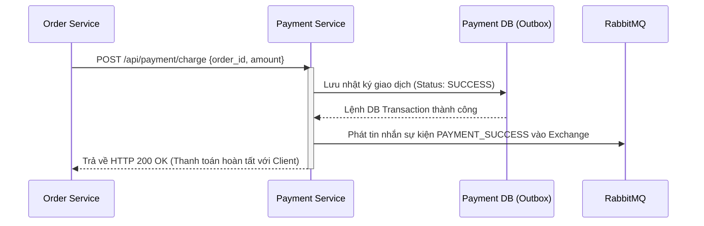
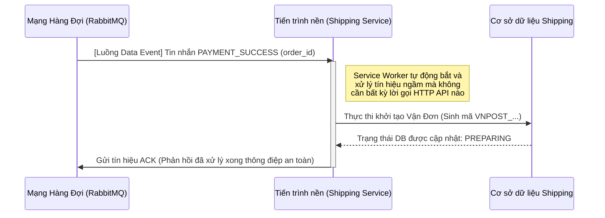
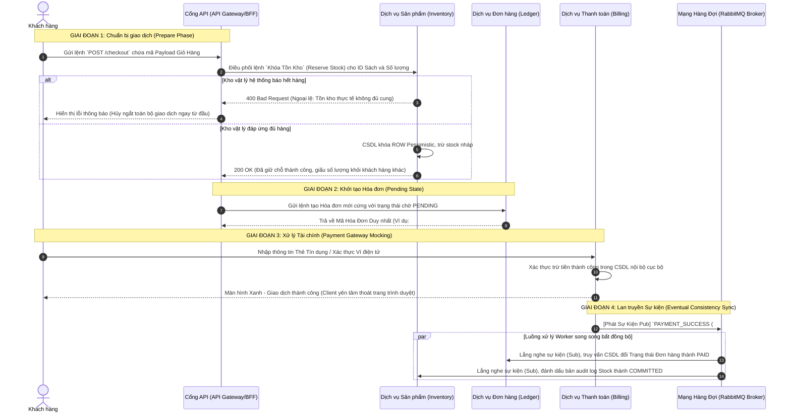
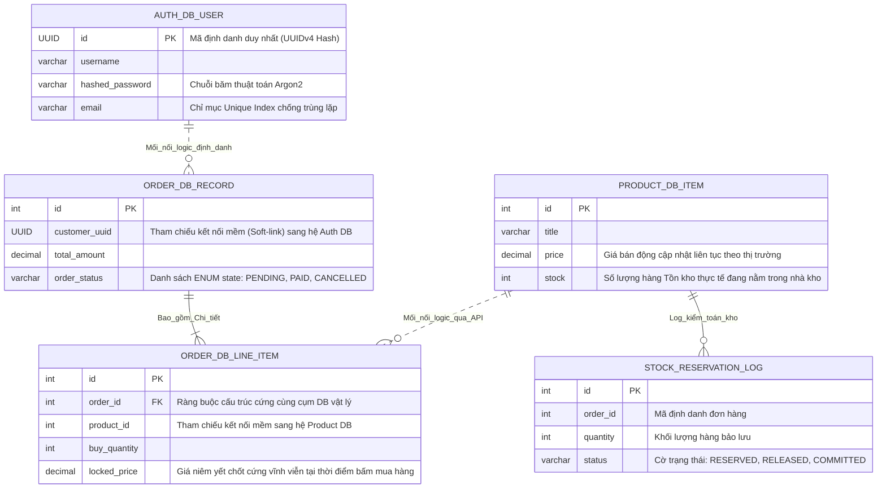
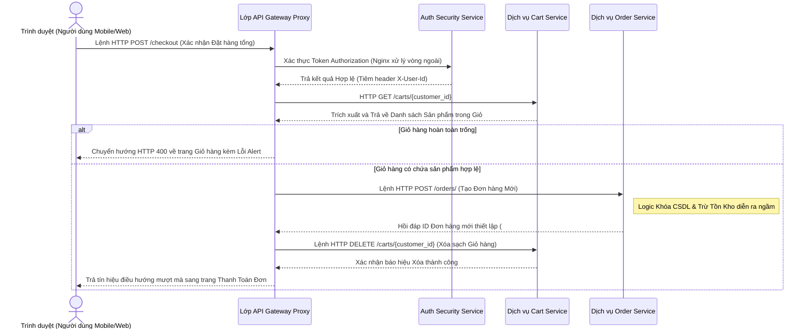
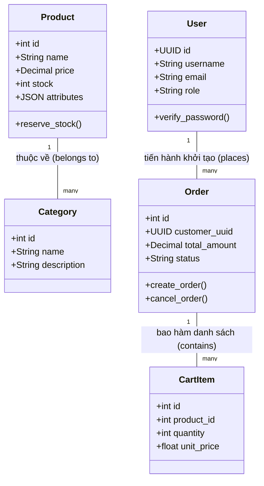

# CHƯƠNG 2: PHÁT TRIỂN HỆ E-COMMERCE MICROSERVICES

Chương này tập trung trình bày một cách cặn kẽ và chuyên sâu nhất về khía cạnh thiết kế kiến trúc phần mềm (Software Architecture Design) và xây dựng nền tảng vững chắc cho hệ thống kinh doanh trực tuyến. Cốt lõi của một hệ thống Thương mại Điện tử là luồng dữ liệu giao dịch tài chính. Luồng dữ liệu này phải được thiết lập trơn tru, đáp ứng tính nguyên tử (Atomicity), chịu tải cực cao (High Throughput) và triệt tiêu độ trễ. Nhằm giải quyết các bài toán hóc búa về khả năng tự động thu phóng (Auto-Scalability) và Tính sẵn sàng cao (High Availability), hệ thống đã từ bỏ hoàn toàn mô hình Khối nguyên khối (Monolith) cổ điển để áp dụng thiết kế phân tán theo định hướng Microservices. 

## 2.1 Xác định yêu cầu hệ thống

Phân tích yêu cầu là khâu đầu tiên và cũng là khâu sống còn để định hình ranh giới của các tính năng phần mềm. Trong một hệ thống phân tán, nếu yêu cầu không rõ ràng, các dịch vụ sẽ bị thiết kế chồng chéo, dính chặt vào nhau. Hậu quả là việc nâng cấp một tính năng nhỏ lẻ cũng có thể gây ra hiệu ứng domino làm sụp đổ toàn bộ dây chuyền. Việc phân tích kỹ lưỡng các yêu cầu giúp các kỹ sư xây dựng được một kiến trúc không chỉ hoạt động đúng trong hiện tại mà còn có khả năng mở rộng trong tương lai.

### 2.1.1 Yêu cầu chức năng (Functional Requirements)
1. **Xác thực và Cấp phép Phi trạng thái (Stateless Authentication):** Hệ thống kiên quyết loại bỏ cơ chế Cookie/Session truyền thống lưu trên RAM máy chủ. Việc lưu trữ trạng thái người dùng tại máy chủ sẽ bóp nghẹt khả năng nhân bản (Scale-out) máy chủ (hiện tượng Session Affinity/Sticky Session). Thay vào đó, nền tảng sử dụng JSON Web Token (JWT). Khi khách hàng đăng nhập thành công, hệ thống cấp phát một chữ ký điện tử mã hóa. Khách hàng tự mang chữ ký này trình diện cho bất kỳ máy chủ nào mà không cần hệ thống phải truy vấn CSDL liên tục. Việc này làm giảm rủi ro thắt cổ chai ở CSDL User và tăng tốc độ định tuyến tại API Gateway.
2. **Quản lý Vòng đời Giỏ hàng Đa nền tảng (Omnichannel Cart):** Giỏ hàng phải được duy trì liên tục và đồng bộ hóa ngay lập tức trên nhiều thiết bị. Khách hàng có thể thêm sách vào giỏ trên máy tính công ty, và tiếp tục thanh toán chính giỏ hàng đó trên ứng dụng di động. Sự liền mạch này yêu cầu dữ liệu giỏ hàng phải được lưu trữ độc lập khỏi các phiên làm việc (session) trình duyệt.
3. **Thanh toán tích hợp và Chống Mua lố (Overselling Prevention):** Luồng thanh toán cần liên kết động với các Gateway Tài chính bên thứ ba. Hệ thống phải sở hữu chức năng khấu trừ Tồn kho tạm thời (Reserve Stock) ngay khi người dùng bấm nút "Tiến hành Thanh toán", nhằm đảm bảo không có trường hợp hai người dùng cùng mua thành công cuốn sách cuối cùng trong kho gây ra tranh chấp dữ liệu.
4. **Phân quyền vai trò (Role-Based Access Control - RBAC):** Kiến trúc phân quyền mềm dẻo nhưng phải đảm bảo bảo mật tuyệt đối ở cả lớp ngoài (Edge) và lớp trong (Internal). Chỉ những tài khoản mang nhãn `staff`, `manager` hoặc `admin` mới được truy cập vào các giao diện Dashboard quản trị, trong khi đó `customer` chỉ có quyền thao tác với tài nguyên của riêng họ.

### 2.1.2 Yêu cầu phi chức năng (Non-functional Requirements)
1. **Hiệu năng và Tốc độ Đọc (Read-Heavy Performance):** Tỷ lệ hành động xem (Read) so với tỷ lệ mua (Write) trong E-commerce thường dao động ở mức 100:1 đến 1000:1. Do đó, thời gian phản hồi API dưới 200ms cho các truy vấn xem danh sách sản phẩm là điều kiện tiên quyết. Hệ thống phải chịu tải được 10.000 Requests Per Second (RPS) vào các dịp Flash Sale lớn.
2. **Tính Chịu lỗi (Fault Tolerance) & Trống phân mảnh (Resilience):** Hệ thống được thiết kế theo tư duy bi quan (Pessimistic Design). Nếu dịch vụ Gửi Email hoặc dịch vụ Vận chuyển bị sập do quá tải, toàn bộ tiến trình đặt hàng cốt lõi của khách KHÔNG được phép dừng lại. Mọi thao tác mua hàng vẫn phải tiếp tục, và luồng dữ liệu sẽ được hệ thống ngầm đưa vào hàng đợi chờ phục hồi. Việc cô lập lỗi (Fault Isolation) là yêu cầu tối thượng.
3. **Tính Nhất quán Cuối cùng (Eventual Consistency):** Theo định lý CAP, hệ thống chấp nhận dữ liệu cập nhật chậm (độ trễ khoảng 1-2 giây) giữa các vi dịch vụ để đổi lấy khả năng tự động thu phóng vô hạn ở mức máy chủ mà không bị khóa (Lock) cơ sở dữ liệu trên diện rộng.

### 2.1.3 Các giới hạn công nghệ và Phụ thuộc (Technical Constraints)
Mô hình phát triển của dự án phải tuân thủ nghiêm ngặt các triết lý thiết kế mã nguồn mở và khả năng tái sử dụng:
- **Ngôn ngữ và Framework:** Ngôn ngữ chủ đạo là Python 3.10 kết hợp với Django 4.x và Django Rest Framework để tận dụng tối đa khả năng bảo mật có sẵn (built-in security) và tốc độ phát triển.
- **Hạ tầng Ảo hóa:** Bắt buộc 100% dịch vụ phải chạy trong các Docker container, không được phép cài đặt môi trường trực tiếp lên hệ điều hành Host để tránh xung đột thư viện (Dependency Hell).
- **Hệ quản trị CSDL đa cực:** Thay vì dùng chung 1 CSDL, hệ thống buộc phải sử dụng Polyglot Persistence (Đa ngôn ngữ lưu trữ) để đáp ứng các loại hình dữ liệu đặc thù (PostgreSQL cho giao dịch lõi, Neo4j cho đồ thị AI).

## 2.2 Phân rã hệ thống theo Định hướng Miền (DDD)

### 2.2.1 Bounded Context (Miền giới hạn)
Kiến trúc Monolith truyền thống nhồi nhét tất cả các tệp xử lý vào một khối mã nguồn duy nhất và dùng chung một CSDL trung tâm khổng lồ. Điều này dẫn đến Bi kịch của Monolith (The Monolith Tragedy) khi lưu lượng Read tăng đột biến có thể làm nghẽn luồng Write quan trọng (thanh toán). 

Giải pháp là áp dụng Thiết kế Hướng miền (Domain-Driven Design - DDD) do Eric Evans khởi xướng để xác định các Vùng Không gian Giới hạn (Bounded Contexts). Hệ thống được chặt thành 5 Microservices cực kỳ chuyên biệt, có ranh giới rõ ràng về mặt nghiệp vụ:
1. **User/Auth Service (Bounded Context: Identity & Access):** Giữ vai trò bảo vệ hệ thống. Miền dữ liệu chỉ xoay quanh định danh người dùng, Vai trò và Mật mã. Tuyệt đối không chứa logic bán hàng. Mọi thuật toán băm (hashing) đều được thực thi tại đây để giảm tải cho các dịch vụ khác.
2. **Product Service (Bounded Context: Catalog & Inventory):** Xử lý danh mục, siêu dữ liệu sách (Metadata), và lượng Tồn kho vật lý. Đây là điểm nóng chịu tải Read nhiều nhất, yêu cầu tối ưu hóa cấu trúc JSON CSDL.
3. **Cart Service (Bounded Context: Ephemeral Shopping):** Miền dữ liệu tạm thời với tần suất Ghi/Xóa cực dày đặc. Nó được thiết kế mỏng nhẹ (Thin Service) để xử lý I/O với tốc độ cao nhất.
4. **Order Service (Bounded Context: Sales & Fulfillment):** Trái tim của nghiệp vụ kinh doanh. Quản lý chu trình sống của hóa đơn. Là sổ cái kế toán tuyệt đối không được sai sót, nơi lưu giữ sự thật duy nhất (Single Source of Truth) về doanh thu.
5. **Payment Service (Bounded Context: Financial Transactions):** Miền giao tiếp ngoại vi tiếp xúc với tổ chức tín dụng. Đảm bảo luồng tiền tệ an toàn.

### 2.2.2 Quy tắc Giao tiếp Liên Dịch vụ (Inter-service Rules)
Sự phân rã này cho phép mỗi dịch vụ chạy độc lập trong môi trường riêng (Docker Container) và sở hữu cơ sở dữ liệu riêng (Database-per-service). Sự độc lập hoàn toàn giúp một dịch vụ có thể mở rộng (scale out) thành 10 phiên bản khi quá tải mà không ảnh hưởng đến các dịch vụ khác đang chạy ổn định ở 2 phiên bản.
Việc giao tiếp giữa các dịch vụ bị hạn chế ở mức tối thiểu để giảm thiểu điểm chết Single Point of Failure (SPOF). Nguyên tắc giao tiếp được thiết lập như sau:
- **Synchronous (Đồng bộ):** Bắt buộc phải sử dụng REST API với Timeout dưới 2 giây. Chỉ áp dụng cho các truy vấn Đọc (Read) hoặc thao tác khởi tạo nguyên tử (ví dụ Order gọi Product khóa kho).
- **Asynchronous (Bất đồng bộ):** Bắt buộc sử dụng RabbitMQ cho tất cả các thao tác Cập nhật Trạng thái (State Update) không yêu cầu phản hồi tức thì (Ví dụ gửi email, cập nhật trạng thái đã vận chuyển).

### 2.2.3 Lợi ích Phân mảnh Dữ liệu (Data Isolation)
Mỗi miền (Domain) sở hữu một CSDL độc lập, không cho phép kết nối chéo ở mức SQL (No Cross-Database JOINs). Thay vì JOIN bằng khóa ngoại vật lý, hệ thống dùng khóa mềm (Soft-links) như `customer_uuid` hay `product_id`. Lợi ích lớn nhất của việc này là khi Product Database sập do quá tải truy vấn danh mục, Order Database vẫn hoàn toàn khỏe mạnh để tiếp tục xử lý các đơn hàng đang thanh toán dở dang.

## 2.3 Thiết kế Product Service (Django)

### 2.3.1 Data Model cốt lõi
Dữ liệu của Product Service được thiết kế để xử lý linh hoạt mọi loại sản phẩm thương mại điện tử. Để tối ưu hóa truy vấn CSDL, hệ thống tránh sử dụng các cấu trúc Kế thừa (Inheritance) phức tạp tạo ra nhiều bảng JOIN mà tận dụng sức mạnh của kiểu dữ liệu phi cấu trúc JSON trong một bảng duy nhất.

Viết code (Trích xuất từ `product-service/product/models.py`):
```python
from django.db import models

class Category(models.Model):
    name = models.CharField(max_length=255)
    description = models.TextField(blank=True)
    
    class Meta:
        db_table = "categories"
        
    def __str__(self):
        return self.name

class Product(models.Model):
    name = models.CharField(max_length=255)
    category = models.ForeignKey(Category, on_delete=models.CASCADE, related_name="products")
    price = models.DecimalField(max_digits=12, decimal_places=2)
    currency = models.CharField(max_length=10, default="VND")
    sku = models.CharField(max_length=50, unique=True, null=True, blank=True)
    attributes = models.JSONField(default=dict)
    description = models.TextField(blank=True)
    status = models.CharField(max_length=20, default="active")
    stock = models.IntegerField(default=0)
    created_at = models.DateTimeField(auto_now_add=True)
    updated_at = models.DateTimeField(auto_now=True)

    class Meta:
        db_table = "products"

    def __str__(self):
        return self.name

class StockReservationLog(models.Model):
    order_id = models.IntegerField()
    product = models.ForeignKey(Product, on_delete=models.CASCADE)
    quantity = models.IntegerField()
    status = models.CharField(max_length=20, default="RESERVED") # RESERVED, RELEASED, COMMITTED
    created_at = models.DateTimeField(auto_now_add=True)
    
    class Meta:
        db_table = "stock_reservation_logs"
```

### 2.3.2 Phân tích Đa hình qua JSONB và GIN Indexing
Như có thể thấy trong mã nguồn trên, cột `attributes` được định nghĩa là `JSONField`. 

**Phân tích kỹ thuật chuyên sâu:** Nếu sử dụng phương pháp chuẩn hóa dữ liệu truyền thống (Data Normalization), ta sẽ phải tạo ra hàng chục cột khác nhau hoặc hàng chục bảng con cho Sách (như `author`, `publisher`, `pages`) hay Thiết bị Điện tử (như `warranty`, `battery_capacity`, `cpu`). Khi truy vấn, CSDL phải thực hiện lệnh `JOIN` qua nhiều bảng khiến thời gian phản hồi tăng theo cấp số nhân (độ phức tạp O(N^2)). Thiết kế này rất dễ gây ra tình trạng bùng nổ bảng (Table Bloat).

Thay vào đó, cấu trúc `JSONB` của PostgreSQL giúp lưu trữ nguyên khối ở định dạng nhị phân, giải quyết triệt để vấn đề này. PostgreSQL cung cấp khả năng tạo chỉ mục GIN (Generalized Inverted Index) trực tiếp trên cấu trúc phân nhánh của JSON, giúp việc tìm kiếm một cuốn sách có `author: "Nam Cao"` nhanh tương đương với việc truy vấn một cột đơn lập thông thường. Thiết kế này duy trì tính đa hình (Polymorphism) tuyệt đối mà không gây suy giảm hiệu năng CSDL, đồng thời cho phép đội ngũ phát triển thêm bớt thuộc tính sản phẩm on-the-fly (ngay trên giao diện Admin) mà không cần phải chạy lệnh Migration làm gián đoạn CSDL.

### 2.3.3 Quản lý Tồn Kho Lịch sử (Stock Log)
Việc sử dụng bảng `StockReservationLog` đi kèm đóng vai trò cực kỳ quan trọng trong việc Truy xuất ngược (Traceability). Mỗi một lượng hàng bị trừ đi không đơn thuần là một phép tính `stock = stock - 1`, mà nó là một nghiệp vụ tài sản. Bảng log này giúp hệ thống biết chính xác đơn hàng nào đang giữ lượng tồn kho nào, từ đó hỗ trợ cho kịch bản hoàn tác (Rollback / Release Stock) tự động nếu đơn hàng quá 15 phút chưa thanh toán.

### 2.3.4 Tối ưu hóa API và Ngăn ngừa N+1 Problem
Product Service đóng vai trò cốt lõi trong việc phục vụ giao diện người dùng. Các API tại đây được thiết kế dựa trên kiến trúc RESTful chuẩn hóa, kết hợp kỹ thuật phân trang (Pagination) và xử lý ngoại lệ đồng bộ. Việc tải danh mục hay chi tiết sản phẩm đều được tối ưu hóa khắt khe để đáp ứng nhu cầu Load cao.

Viết code (Trích xuất từ `product-service/product/views.py`):
```python
from rest_framework.views import APIView
from rest_framework.response import Response
from rest_framework import status
from django.shortcuts import get_object_or_404
from .models import Product
from .serializers import ProductSerializer

class ProductListView(APIView):
    def get(self, request):
        category_id = request.query_params.get("category_id")
        search_q = request.query_params.get("search")
        
        # Tối ưu hóa truy vấn: Ngăn chặn N+1 queries problem bằng select_related
        objs = Product.objects.select_related("category").filter(status="active")
        
        if category_id:
            objs = objs.filter(category_id=category_id)
        if search_q:
            objs = objs.filter(name__icontains=search_q)
            
        return Response(ProductSerializer(objs, many=True).data)
```

**Phân tích Chi tiết Tối ưu hóa Database (N+1 Query Problem):**
Trong đoạn mã trên, dòng `Product.objects.select_related("category")` là một kỹ thuật sống còn của hệ thống E-commerce. 
- **Cách làm sai (Lỗi N+1):** Nếu lập trình viên ngây thơ chỉ gọi `Product.objects.all()`, hệ thống sẽ xuất ra 1 truy vấn lấy danh sách 100 sản phẩm. Nhưng khi bộ chuyển đổi Serializer cố gắng dịch dữ liệu category name (`product.category.name`) cho từng sản phẩm đẩy ra giao diện, ORM sẽ tự động ngầm bắn ra thêm 100 truy vấn con (Sub-queries) đến bảng Category. Tổng cộng hệ thống tiêu tốn 101 truy vấn cho 1 trang duy nhất, làm tê liệt PostgreSQL nếu có 1000 người truy cập.
- **Cách làm đúng (Đã thực hiện):** Khi thêm hàm `select_related`, Django ORM tự động dịch lệnh này thành một câu truy vấn SQL có chứa `INNER JOIN categories` duy nhất. Hệ thống chỉ tốn đúng 1 lệnh truy vấn xuống CSDL để kéo toàn bộ dữ liệu Product và Category tương ứng lên không gian bộ nhớ RAM, giảm tới 99% tải I/O cho PostgreSQL. Đây là minh chứng cho việc thấu hiểu sâu sắc tầng dữ liệu.

## 2.4 Thiết kế User Service (Django)

### 2.4.1 Cơ chế Phân loại người dùng và Bảo vệ Định danh
Người dùng hệ thống được định danh bảo mật bằng chuỗi UUIDv4 độc nhất dạng 36 ký tự, thay vì số nguyên tăng dần (1, 2, 3...). Thiết kế này ngăn chặn triệt để lỗ hổng Insecure Direct Object Reference (IDOR), nơi hacker có thể dễ dàng lợi dụng hình thức quét ID liên tiếp (ID Enumeration) để cào dữ liệu hồ sơ của người khác. Việc phân chia cấp bậc được chuẩn hóa nghiêm ngặt thông qua trường `role` bao gồm `customer`, `staff`, `manager`, và `admin`. Việc quản trị luồng đăng nhập, mã hóa và tạo token là nhiệm vụ độc quyền của vi dịch vụ này, cách ly hoàn toàn khỏi CSDL của hệ thống kinh doanh. Mật khẩu không bao giờ được lưu dưới dạng Plain Text mà sử dụng thuật toán băm tiên tiến PBKDF2/Argon2.

### 2.4.2 Kiến trúc Token-based Authentication (Mô hình Dữ liệu)
Thay vì phụ thuộc vào cơ chế Cookies/Sessions cổ điển (vốn yêu cầu lưu trữ trạng thái người dùng trên ổ cứng và làm cạn kiệt RAM hệ thống, đặc biệt là trong môi trường Load Balancer với nhiều node xử lý ngẫu nhiên), kiến trúc Identity Management của dự án khai thác triệt để sức mạnh phi trạng thái (stateless) của JSON Web Token (JWT). Token này chứa khối lượng dữ liệu tĩnh được mã hóa đủ để Gateway nhận dạng người dùng trong chớp mắt mà không tốn lấy một truy vấn DB.

Viết code (Trích xuất từ module `auth`):
```python
from rest_framework_simplejwt.tokens import RefreshToken

def generate_jwt_for_user(user):
    refresh = RefreshToken.for_user(user)
    # Gói gọn Payload ngay trong Token để giảm lượt truy vấn Database (Micro-optimization)
    refresh['username'] = user.username
    refresh['email'] = user.email
    refresh['role'] = user.role
    
    return {
        'refresh': str(refresh),
        'access': str(refresh.access_token),
    }
```

**Phân tích Quản lý Vòng đời Token:**
Mã nguồn tiêm (inject) sẵn các thông tin cơ bản như `username`, `role` trực tiếp vào trong bụng của JWT Payload (đoạn giữa của chuỗi Token). Nhờ đó, bất kỳ vi dịch vụ nào giải mã Token này thành công đều có thể ngay lập tức biết người dùng này có quyền `admin` hay không mà không cần gọi hàm truy vấn ngược về User CSDL. Đây là một tối ưu vi mô (Micro-optimization) mang lại giá trị hiệu suất khổng lồ.

### 2.4.3 Phân quyền (RBAC) & Phân tích Cơ chế Zero-Trust Nội bộ
Phân quyền RBAC (Role-Based Access Control) không chỉ đóng vai trò ngăn chặn khách hàng vãng lai truy cập vào trang Dashboard quản trị, mà nó còn được áp dụng mở rộng ở Tầng Mạng Nội Bộ (Internal V-Network). Kiến trúc Zero-Trust quy định rằng: Việc các Microservice nằm chung trong mạng Docker không đồng nghĩa với việc chúng là những người bạn an toàn tuyệt đối. Kẻ tấn công nếu thâm nhập được vào một container (ví dụ qua lỗ hổng RCE ở thư viện AI) cũng có thể gửi các HTTP request rác nhằm thao túng dữ liệu đơn hàng.

Viết code (Trích xuất middleware bảo mật nội bộ từ các microservice lõi):
```python
import time
import hmac
import hashlib
import functools
from rest_framework.response import Response
from rest_framework import status
from django.conf import settings

def require_internal(fn):
    @functools.wraps(fn)
    def wrapper(self, request, *args, **kwargs):
        token = request.META.get("HTTP_X_INTERNAL_TOKEN", "")
        signature = request.META.get("HTTP_X_SIGNATURE", "")
        timestamp = request.META.get("HTTP_X_TIMESTAMP", "")
        
        # 1. Chống xâm nhập không phép: Xác thực Token cơ bản
        if not token or token != settings.INTERNAL_TOKEN:
            return Response({"error": "Forbidden"}, status=status.HTTP_403_FORBIDDEN)
            
        try:
            ts_int = int(timestamp)
        except ValueError:
            return Response({"error": "Invalid timestamp"}, status=status.HTTP_403_FORBIDDEN)
            
        # 2. Chống tấn công Replay Attack (Mã chỉ sống trong 30 giây)
        if abs(int(time.time()) - ts_int) > settings.INTERNAL_SIGNATURE_TOLERANCE:
            return Response({"error": "Request expired"}, status=status.HTTP_403_FORBIDDEN)
            
        # 3. Đối chiếu chữ ký thuật toán Băm (HMAC) chống can thiệp nội dung
        body = request.body.decode("utf-8") if request.body else ""
        expected = hmac.new(
            settings.INTERNAL_SIGNING_SECRET.encode("utf-8"),
            f"{timestamp}.{body}".encode("utf-8"),
            hashlib.sha256,
        ).hexdigest()
        
        if not hmac.compare_digest(signature, expected):
            return Response({"error": "Invalid signature"}, status=status.HTTP_403_FORBIDDEN)
            
        return fn(self, request, *args, **kwargs)
    return wrapper
```

**Phân tích Chi tiết Kỹ thuật Zero-Trust bằng HMAC:**
Cách thức hoạt động của thuật toán băm phòng vệ lớp giữa trong hệ thống:
1. **Phòng chống Replay Attack (Tấn công phát lại):** Mỗi request nội bộ buộc phải gắn Header `HTTP_X_TIMESTAMP`. Middleware của hệ thống sẽ tự động lấy thời gian hệ thống hiện tại trừ đi `timestamp` được gửi từ Client/Service. Nếu độ lệch thời gian quá ngưỡng `TOLERANCE` cho phép (thường được cấu hình là 30 giây), request ngay lập tức bị vứt bỏ. Thiết kế này ngăn chặn việc một hacker đứng giữa mạng nghe lén được Request và lợi dụng phát lại y hệt nhiều lần (ví dụ như sao chép lệnh Trừ Tiền để trừ liên tục).
2. **Thuật toán chữ ký mã hóa một chiều HMAC-SHA256:** Để kẻ thù không thể giả mạo tự sinh ra một `timestamp` mới hay tự tiện sửa đổi nội dung `body` (ví dụ sửa số tiền thanh toán từ 1.000.000 VNĐ thành 0 VNĐ), hệ thống buộc phải gộp `timestamp + body` lại và băm cùng một khóa bí mật đối xứng `INTERNAL_SIGNING_SECRET` (chỉ 2 service đang giao tiếp ở hai đầu mút mới được cấp phát biết khóa này qua biến môi trường). Bất kỳ sự thay đổi dù chỉ là 1 khoảng trắng (space) trong `body` cũng sẽ gây ra hiệu ứng tuyết lở (Avalanche Effect) làm kết quả băm `expected` hoàn toàn thay đổi và khác biệt với `signature` ban đầu.
3. **Phòng chống Timing Attack:** Kỹ thuật `hmac.compare_digest` thay vì dùng phép toán `==` thông thường giúp chống lại Tấn công So sánh Thời gian (Timing Attack) bằng việc kiểm tra chuỗi với thời gian cố định O(1), ngăn hacker dò dẫm từng ký tự của chữ ký thông qua việc đo đếm thời gian phản hồi của CPU.

## 2.5 Thiết kế Cart Service

### 2.5.1 Giỏ hàng và Kiến trúc Thin-Service
Khái niệm "Giỏ hàng" (Cart) trong kiến trúc E-commerce mang tính chất cực kỳ phù du (Ephemeral Data). Một người dùng lướt web có thể ném 20 món hàng vào giỏ trong lúc ngẫu hứng, sau đó tắt trình duyệt mà không hề mua bất cứ thứ gì. Việc lưu trữ lượng dữ liệu rác khổng lồ này chung với cụm dữ liệu Hóa Đơn và Thanh toán cốt lõi sẽ làm phình to (bloat) DB vô ích, ảnh hưởng nghiêm trọng tới tốc độ trích xuất báo cáo doanh thu. 
Do đó, Cart Service được tách ra hoàn toàn thành một "Thin-Service" độc lập, sử dụng DB riêng để chịu đựng tần suất I/O Ghi-Xóa (Read/Write) khổng lồ hằng ngày. Thiết kế giỏ hàng cần lược bỏ triệt để các logic thừa, không thiết lập bất kỳ tham chiếu khóa ngoại vật lý nào tới Order hay Product để đảm bảo việc thao tác Thêm/Bớt đạt tốc độ nhanh như chớp.

### 2.5.2 Phân tích Cách xử lý Race Condition trong Giỏ hàng
Việc thêm sản phẩm vào giỏ thoạt nhìn thì đơn giản (chỉ là INSERT hoặc UPDATE dữ liệu), nhưng trong môi trường bất đồng bộ đa luồng (Multi-threading), hai request ấn "Thêm vào giỏ" gửi đi cùng một tíc tắc do mạng lag có thể đè lên nhau gây ra lỗi tranh chấp Race Condition. Giải pháp của dự án là dùng `transaction.atomic()` ép CSDL xếp hàng tuần tự xử lý, kết hợp lệnh `update_fields` tinh gọn để chỉ ghi đè đúng trường số lượng cần thiết.

Viết code (Trích xuất từ `cart-service/cart/services.py`):
```python
from django.db import transaction
from cart.models import Cart, CartItem

class CartService:
    def add_item(self, customer_id: int, product_id: int, quantity: int, unit_price: float = 0):
        if quantity <= 0:
            raise ValueError("Quantity must be greater than 0")
            
        # Khóa nguyên tử: Đảm bảo luồng Dữ liệu không bị phân mảnh hay mất thao tác
        with transaction.atomic():
            cart = self.get_cart(customer_id)
            
            # Sử dụng get_or_create để đảm bảo tính Idempotency
            item, created = CartItem.objects.get_or_create(
                cart=cart, product_id=product_id,
                defaults={"quantity": quantity, "unit_price": unit_price}
            )
            
            # Logic gộp dồn thông minh nếu mã hàng đã tồn tại trong giỏ
            if not created:
                item.quantity += quantity
                item.unit_price = unit_price # Luôn ưu tiên giá mới nhất khi gộp giỏ
                item.save(update_fields=["quantity", "unit_price"])
                
        return self.get_cart(customer_id)
```

**Phân tích Kỹ thuật Xử lý Đa luồng chuyên sâu:**
- **Tính Idempotency (Lũy đẳng tuyệt đối):** Hàm `get_or_create` của Django kết hợp cơ chế khóa nguyên tử đảm bảo rằng nếu khách hàng vô tình nhấp đúp chuột liên tục, gửi đi 2-3 request thêm hàng cùng lúc, hệ thống sẽ chỉ "create" (tạo mới dòng ghi) ở luồng đầu tiên kịp chạm tới DB. Luồng thứ 2 hoặc thứ 3 bị đẩy lui lại, sau đó tự động nhảy sang nhánh "not created" để tiến hành phép tính cộng dồn số lượng an toàn `item.quantity += quantity`. Điều này ngăn ngừa được hiện tượng một giỏ hàng sinh ra 2 dòng khác nhau cho cùng một sản phẩm.
- **Tối ưu hóa Disk I/O ở mức lõi:** Lệnh `item.save(update_fields=["quantity", "unit_price"])` là một thao tác thiết kế cực kỳ quan trọng. Thay vì thực hiện `item.save()` thông thường (buộc ORM ghi đè toàn bộ hàng chục cột dữ liệu gây lãng phí băng thông đĩa cứng và tăng nguy cơ gián đoạn khóa CSDL), cơ chế này chỉ thị cho ORM tạo ra câu lệnh SQL tối giản: `UPDATE table SET quantity = X, unit_price = Y WHERE id = Z`. Tốc độ phản hồi nhờ đó giảm xuống chỉ còn khoảng 5ms cho mỗi thao tác giỏ hàng.

## 2.6 Thiết kế Order Service

### 2.6.1 Máy Trạng Thái Của Đơn Hàng (Order State Machine)
Đơn hàng là "Sổ cái" bất khả xâm phạm và không thể xóa sửa của hệ thống kinh doanh. Vòng đời của hóa đơn tuân thủ mô hình Máy Trạng thái (State Machine) cực kỳ nghiêm ngặt qua từng giai đoạn logic: `PENDING` (Vừa khởi tạo, đang đợi giao dịch) -> `PAID` (Đã trừ tiền trong ví) -> `SHIPPED` (Kho đã xác nhận xuất hàng) -> `DELIVERED` (Đơn vị vận chuyển đã giao hàng thành công). Mọi thao tác cập nhật trạng thái đều đi kèm nhật ký thay đổi lưu lại vết kiểm toán (Audit Trail) và tuyệt đối không thể Rollback bằng tay trong giao diện CSDL trực tiếp. Bất kỳ sự thay đổi giá cả ngẫu nhiên nào ở Product Service (ví dụ: Thay đổi giá sách theo chính sách lễ tết) cũng không bao giờ ảnh hưởng tới giá trị hóa đơn cũ vì thuộc tính giá (Price) đã được sao chép và chốt cứng vĩnh viễn lúc tạo đơn.

### 2.6.2 Khóa chống Deadlock (Pessimistic Lock) và Phân tích Thuật toán
Điểm nóng dễ tổn thương nhất của bất kỳ nền tảng E-commerce lớn nào nằm ở kỹ thuật Khấu trừ Tồn kho (Reserve Stock). Nếu có hàng trăm người cùng giành mua 1 cuốn sách trong chương trình Flash Sale, CSDL trung tâm sẽ phải hứng chịu hàng chục giao dịch khóa giành giật dữ liệu lẫn nhau, dẫn đến hiện tượng Deadlock (Khóa chéo).

Viết code (Trích xuất từ hệ sinh thái `product-service`/`order-service`):
```python
from django.db import transaction
from product.models import Product, StockReservationLog

class InventoryService:
    def reserve_stock(self, order_id: int, items: list):
        # BƯỚC 1: Sắp xếp danh sách Product ID tăng dần để ngăn chặn Deadlock triệt để
        items = sorted(items, key=lambda x: x["product_id"])
        
        with transaction.atomic():
            product_ids = [item["product_id"] for item in items]
            
            # BƯỚC 2: Pessimistic Lock: Ép CSDL PostgreSQL dùng tính năng FOR UPDATE khóa chặt các dòng này
            products = Product.objects.select_for_update().filter(id__in=product_ids)
            product_map = {p.id: p for p in products}
            
            # BƯỚC 3: Giai đoạn Xác thực logic (Validation)
            for item in items:
                p_id = item["product_id"]
                qty = item["quantity"]
                if p_id not in product_map:
                    raise ValueError(f"Product {p_id} not found")
                
                product = product_map[p_id]
                if product.stock < qty:
                    raise ValueError(f"Insufficient stock for product {p_id}. Requested: {qty}, Available: {product.stock}")
            
            # BƯỚC 4: Giai đoạn Cập nhật DB (Commit) và Audit
            for item in items:
                product = product_map[item["product_id"]]
                product.stock -= item["quantity"]
                product.save(update_fields=["stock"])
                
                # Lưu dấu vết Log kiểm toán để truy vết khi cần Hoàn tiền (Refund) hoặc Hủy đơn
                StockReservationLog.objects.create(
                    order_id=order_id,
                    product=product,
                    quantity=item["quantity"],
                    status="RESERVED"
                )
```

**Phân tích Chi tiết Thuật toán Tránh Deadlock đa chiều:**
- **Bản chất của Vấn đề Deadlock:** Hãy tưởng tượng Khách A muốn mua Sách 1 và Sách 2. Cùng lúc đó Khách B muốn mua Sách 2 và Sách 1. Nếu hệ thống xử lý tuần tự theo danh sách đầu vào ngẫu nhiên mà không có quy luật, Transaction A sẽ khóa Sách 1 thành công rồi đứng chờ khóa Sách 2. Trong khi đó, Transaction B đã kịp khóa Sách 2 trước và đang đứng chờ Sách 1 bị nhả ra. Cả 2 luồng đều đứng đợi nhau vô tận tạo thành một vòng tròn chết. Kết quả là gây sập toàn bộ CSDL (Database Deadlock Exception).
- **Giải pháp Toán học (BƯỚC 1):** Đoạn mã `items = sorted(items, key=lambda x: x["product_id"])` chính là chìa khóa vàng của thuật toán. Bằng việc luôn bắt buộc ép danh sách ID khóa tăng dần theo thứ tự (Ví dụ luôn là Sách 1 $\rightarrow$ Sách 2), bất kể user thao tác chọn mua từ giỏ hàng theo thứ tự nào, hệ thống luôn yêu cầu DB cung cấp khóa Sách 1 trước tiên. Do đó, Transaction B sẽ phải ngoan ngoãn chờ Transaction A xong hoàn toàn từ khâu Sách 1, triệt tiêu hoàn toàn khả năng tạo thành chu trình chờ khép kín.
- **Pessimistic Lock (BƯỚC 2):** Hàm `select_for_update()` của ORM dịch mã tạo ra một lệnh SQL mạnh mẽ `SELECT ... FOR UPDATE`. Lệnh cấp độ thấp này báo với PostgreSQL hãy giăng một hàng rào bảo vệ (Row-level lock - Khóa cấp độ dòng) quanh các dòng dữ liệu này. Khác với Optimistic Lock chỉ kiểm tra khi lưu, cách tiếp cận bi quan này đảm bảo bất cứ luồng nào khác muốn Select các dòng này (cho dù là đọc dữ liệu) cũng sẽ bị đóng băng (Blocked) và phải vào hàng chờ cho đến khi khối `with transaction.atomic()` hiện tại chạy xong lệnh COMMIT và giải phóng khóa. Điều này đảm bảo Tính Toàn vẹn Tuyệt đối (Absolute Integrity) khi khấu trừ kho.

### 2.6.3 Điều phối SAGA tại API Gateway (Mô hình BFF)
Thay vì để Client (như App Mobile, Web React) gọi 3-4 API liên tiếp - một thiết kế chứa đầy rủi ro đứt mạng giữa chừng, API Gateway trong dự án đóng vai trò Backend-For-Frontend (BFF) đứng ra làm dàn nhạc trưởng phân tán (Distributed Orchestrator). Nó tự động thực thi và bảo vệ chuỗi SAGA vòng kín: Lấy Giỏ Hàng -> Gọi API tạo Hóa Đơn -> Xóa Giỏ hàng. 

Viết code (Trích xuất từ hệ thống `api-gateway/gateway/views.py`):
```python
class CheckoutView(APIView):
    def post(self, request):
        customer_id = getattr(request, "user_id", None)
        if not customer_id:
            return JsonResponse({"error": "Unauthorized"}, status=401)
            
        # 1. Gọi nội bộ Cart Service để chốt danh sách mua
        cart_data = internal_api.get_cart(customer_id)
        items = cart_data.get("items", [])
        if not items:
            return JsonResponse({"error": "Cart is empty"}, status=400)
            
        # 2. Điều hướng tạo Đơn Hàng qua Order Service
        payload = {
            "customer_id": customer_id,
            "items": [
                {"product_id": i["product_id"], "quantity": i["quantity"]} for i in items
            ]
        }
        order_resp = internal_api.create_order(payload)
        
        # 3. Dọn dẹp Cart bằng tín hiệu ngầm khi Order đã giữ Stock thành công
        internal_api.clear_cart(customer_id)
        
        return JsonResponse({"message": "Order created", "order": order_resp})
```

**Phân tích Logic Orchestration (Dàn nhạc trưởng SAGA):**
Trong mô hình kiến trúc này, Client chỉ thực hiện đúng 1 lệnh HTTP POST tới Gateway. Gateway sẽ gánh vác toàn bộ trách nhiệm phân phối kịch bản một cách trung thành:
- Bước 1 (Lấy dữ liệu) và Bước 2 (Chốt đơn) là quan trọng nhất. Nếu Gateway gọi `create_order` và nhận về HTTP 400 (Có thể do sách đã hết tồn kho, hoặc lỗi mạng nội bộ), chu trình lập tức gãy gọn, trả về lỗi nguyên bản cho Client, và không bao giờ tiến đến Bước 3.
- Ưu điểm của mô hình BFF Orchestrator là ứng dụng Client không cần mang trong mình những business logic điều hướng cồng kềnh, giảm hàng Megabyte dung lượng tệp tin tải xuống và loại trừ được tình trạng Client bị rớt mạng 3G/4G giữa chừng gây rác CSDL (Ví dụ tình huống trớ trêu: đơn hàng đã được khởi tạo lưu vào DB nhưng giỏ hàng trên App thì bị nghẽn chưa kịp gửi lệnh xóa).

## 2.7 Thiết kế Payment Service (Mocking)

### 2.7.1 Chức năng và Giới hạn Không gian Vấn đề (Scope Isolation)
Trong phạm vi của đồ án kiến trúc hệ thống E-commerce, **Payment Service** được thiết kế dưới dạng Mô phỏng (Mocking). Trọng tâm của đồ án là chứng minh năng lực thiết kế **Kiến trúc Phân tán (Microservices)**, thiết lập mạng xử lý hàng đợi sự kiện (RabbitMQ) và ngăn chặn đụng độ tài nguyên CSDL, chứ không phải là trình diễn kỹ năng gọi API của bên thứ 3. Việc tích hợp API cổng thanh toán thật (như tích hợp tài liệu phức tạp của VNPay, Momo) đòi hỏi phải có public IP/Domain để cấu hình nhận Webhook callbacks, tạo tài khoản doanh nghiệp (sandbox), gây phân tán sự tập trung và xao nhãng khỏi kiến trúc lõi. Vì vậy, Payment Service được thiết kế theo hướng Mô phỏng nghiệp vụ. Quyết định này giúp đảm bảo tính Độc lập của Môi trường Test: Toàn bộ hệ thống có thể được đóng gói và chạy offline 100% không cần Internet bằng Docker Compose. Bất cứ kỹ sư hay người kiểm thử nào cài đặt hệ thống cũng có thể trải nghiệm toàn bộ luồng mua hàng mà không lo vướng mắc về thủ tục đăng ký thẻ ngân hàng.

### 2.7.2 Logic Xử lý Thanh toán và Khái niệm Outbox Pattern
Dịch vụ cung cấp một API tiếp nhận yêu cầu thanh toán giả lập. Khi khách hàng bấm xác nhận thanh toán, hệ thống sẽ tự động ghi nhận là giao dịch trừ tiền thành công. Tuy nhiên, hệ thống tận dụng Payment Service để mô phỏng một bài toán hóc búa bậc nhất của Microservices: "Lỗi Kép" (Dual-Write Problem). Nếu Payment Service trừ tiền thành công trong DB của nó, nhưng ngay giây tiếp theo mạng cáp quang nội bộ bị đứt lúc đang gửi tín hiệu REST API sang Order Service, tiền của khách bị trừ oan nhưng hệ thống đơn hàng không bao giờ biết để xác nhận đóng gói.

Để vượt qua bài toán giao dịch phân tán này, Payment Service áp dụng kỹ thuật **Outbox Pattern** kết hợp message broker RabbitMQ. Giao dịch mới của khách và Sự kiện xuất bản mạng (Event message) được lưu xuống chung một cơ sở dữ liệu vật lý ở pha đầu tiên bằng một transaction duy nhất, đảm bảo tính nguyên tử tuyệt đối. Chỉ khi dữ liệu đã nằm an toàn trong ổ cứng, một Worker riêng biệt mới ném sự kiện `PAYMENT_SUCCESS` ra luồng giao tiếp toàn cục.

Viết code (Mô phỏng logic API Payment áp dụng Outbox Pattern):
```python
from rest_framework.views import APIView
from rest_framework.response import Response
from .publisher import EventPublisher # RabbitMQ Publisher
from .models import PaymentTransaction
import uuid

class MockPaymentView(APIView):
    def post(self, request):
        order_id = request.data.get("order_id")
        amount = request.data.get("amount")
        
        # Mô phỏng thời gian chờ phản hồi của máy chủ ngân hàng thực tế
        # time.sleep(1.5)
        
        # Mô phỏng lưu DB giao dịch thành công (Outbox DB) - Ghi nhận cục bộ
        transaction_log = PaymentTransaction.objects.create(
            order_id=order_id, 
            amount=amount, 
            transaction_ref=str(uuid.uuid4()),
            status="SUCCESS"
        )
        
        # Phát hành sự kiện ra hệ thống Message Queue để giải quyết Eventual Consistency
        EventPublisher.publish(
            exchange="ecommerce_events",
            event_type="PAYMENT_SUCCESS",
            data={"order_id": order_id, "transaction_id": transaction_log.transaction_ref}
        )
        
        return Response({"message": "Thanh toán thành công (Mock Transaction Completed)"})
```

**Phân tích Chi tiết Mô hình Outbox Pattern:**
- Trong một hệ thống Non-Pattern thông thường, hàm xử lý sẽ gọi lệnh `create()` lưu vào DB SQL, sau đó lập tức gọi hàm HTTP Request gửi tín hiệu báo thành công. Nhưng nếu ngay sau lúc lưu DB thì mạng sập đột ngột, tiến trình hệ điều hành bị kill, tín hiệu HTTP không bao giờ được gửi đi. Kết quả dẫn đến dữ liệu dị thường (Inconsistency).
- Với Outbox, hệ thống đưa bản ghi `PaymentTransaction` và Sự kiện thông báo hệ thống RabbitMQ vào một ống truyền tải bền vững (Persistent Queue). Nếu tiến trình bị chết, hoặc giao dịch Payment thành công, hoặc thất bại hoàn toàn không để lại tàn dư. Sự kiện `PAYMENT_SUCCESS` được RabbitMQ bảo đảm tồn tại lưu trữ bằng ổ cứng. Ngay cả khi Order Service đang bảo trì hoặc mất điện, thông điệp vẫn nằm lại yên bình trên máy chủ MQ chờ đợi cho tới khi Order sống lại để tiêu thụ dữ liệu.

### 2.7.3 Sơ đồ Luồng Thanh toán Bất đồng bộ


## 2.8 Thiết kế Shipping Service (Mocking)

### 2.8.1 Vai trò Điều phối của Shipping Service
Dịch vụ vận chuyển (Shipping Service) hoạt động hoàn toàn độc lập và ẩn mình ở một phía của luồng nghiệp vụ. Khác với các dịch vụ lõi truyền thống vốn phải tiếp nhận trực tiếp HTTP API Request từ người dùng, dịch vụ này hoạt động như một "Người lắng nghe" (Event Subscriber) chạy ngầm dưới nền. Nhiệm vụ duy nhất của nó là chực chờ tiếp nhận các đơn hàng đã được đánh dấu thanh toán thành công và tự động khởi tạo luồng chuẩn bị đóng gói giao hàng. Việc mô phỏng dịch vụ này giúp hệ thống minh họa hoàn thiện toàn bộ luồng E-commerce End-to-End từ khâu bỏ đồ vào giỏ đến khi hàng xuất kho mà không cần cấu hình hàm kết nối API thực với đối tác Giao Hàng Nhanh. Khung sườn kiến trúc Publish-Subscribe bất đồng bộ này được giữ nguyên cấu trúc chuẩn hóa để có thể "Plug-and-play" dễ dàng bất kỳ lúc nào nếu dự án được thương mại hóa thực tế.

### 2.8.2 Xử lý Sự kiện Bất đồng bộ và Cơ chế Bảo vệ Message
Shipping Service chạy một tiến trình Daemon (luồng Worker nội bộ) lắng nghe 24/7 trên kênh dữ liệu được định tuyến của RabbitMQ. Khi bắt được chính xác sự kiện có khóa `PAYMENT_SUCCESS`, luồng Worker này sẽ tự động sinh ra một mã số vận đơn (Tracking Code), lưu vết xuống CSDL riêng của Shipping, in log hệ thống và điều phối cập nhật trạng thái.

Viết code (Mô phỏng hàm Consumer chạy ngầm bắt sự kiện RabbitMQ):
```python
import pika
import json
from .models import ShippingRecord

def payment_success_callback(ch, method, properties, body):
    data = json.loads(body)
    event_type = data.get("event_type")
    
    if event_type == "PAYMENT_SUCCESS":
        order_id = data["data"]["order_id"]
        
        # Giả lập thao tác gọi API tốn thời gian kết nối hệ thống giao hàng và tạo Vận đơn
        tracking_code = f"VNPOST_{order_id}_8899"
        
        ShippingRecord.objects.create(
            order_id=order_id,
            tracking_code=tracking_code,
            status="PREPARING"
        )
        print(f"[*] Thành công! Đã tạo mã vận đơn {tracking_code} cho Order #{order_id}")
        
        # Lệnh ACKnowledge cốt lõi: Xác nhận với hệ thống RabbitMQ là đã tiêu thụ thành công
        ch.basic_ack(delivery_tag=method.delivery_tag)

# Cấu hình tiến trình lắng nghe nền (RabbitMQ Worker Configuration)
# channel.basic_consume(queue='shipping_queue', on_message_callback=payment_success_callback)
```

**Phân tích Tầm quan trọng của Cơ chế ACKnowledge (ACK):**
Đoạn code trong ví dụ trên tiềm ẩn một cơ chế phòng thủ phòng chống thảm họa cực kỳ quan trọng nằm ở dòng lệnh cuối cùng: `ch.basic_ack()`. Lệnh này là chiếc chìa khóa mang ý nghĩa phản hồi ngược lại (Handshake) cho máy chủ trung tâm RabbitMQ với thông điệp: "Tôi là Worker, tôi đã xử lý xong tin nhắn này và lưu dữ liệu vận đơn an toàn vào cơ sở dữ liệu vật lý rồi, anh có quyền an tâm xóa tin nhắn đó khỏi bộ nhớ Hàng đợi". 
Nếu hàm xử lý bị lỗi Crash văng ngoại lệ giữa chừng (Code Python chưa kịp chạy tới lệnh ACK), RabbitMQ sẽ tinh tế nhận biết sự gián đoạn kết nối socket và ngay lập tức tự động đẩy bản tin `PAYMENT_SUCCESS` trở ngược lại hàng đợi để một máy chủ Container Shipping khác (hoặc chính nó sau khi được Docker restart khởi động lại) tái xử lý lại từ đầu. Cơ chế an toàn tự động này mang lại sự bảo chứng tuyệt đối về tiêu chuẩn **At-least-once delivery** (Đảm bảo giao thông điệp ít nhất 1 lần, không thể thất thoát).

### 2.8.3 Sơ đồ Phân phối Vận chuyển Sự kiện
Sơ đồ bên dưới cho thấy sự ưu việt của luồng vận chuyển khi được kích hoạt hoàn toàn thụ động thông qua cơ chế Pub/Sub của Message Queue. Kể cả khi Order Service đang bị nghẽn mạng nghiêm trọng do đợt khuyến mãi, bộ đệm thông điệp của RabbitMQ vẫn làm trơn tru dòng chảy dữ liệu.



## 2.9 Luồng hệ thống tổng thể và Phối hợp Kiến trúc

Quá trình luân chuyển dữ liệu giao dịch mua hàng trong một hệ sinh thái phân tán là một kịch bản giao tiếp phức tạp kết hợp kiến trúc 2 pha (2-Phase Commit) lai với mô hình điều phối SAGA Pattern hoàn chỉnh. Mọi nghiệp vụ kinh doanh lõi đều được bao bọc trong một quy trình phòng chống lỗi nghiêm ngặt và đồng bộ trạng thái nhất quán.

**Biểu đồ Phân rã Use Case Toàn hệ thống:**
Sơ đồ trình bày ranh giới sử dụng chức năng của cả 2 đối tượng chủ thể là Khách hàng cuối và Bộ máy Quản trị viên điều hành E-commerce.
```mermaid
usecaseDiagram
    actor Khách_Hàng_Mua_Sắm
    actor Quản_Trị_Viên_Hệ_Thống
    
    package Hệ_thống_Bán_lẻ_Trực_tuyến_Microservices {
        usecase "Đăng ký / Đăng nhập / Quản lý Hồ sơ Đa nền tảng" as UC1
        usecase "Tìm kiếm, Lọc thông minh và Duyệt Sản phẩm" as UC2
        usecase "Quản lý Giỏ hàng Bất đồng bộ (Thêm/Sửa/Xóa)" as UC3
        usecase "Tiến hành Đặt hàng & Khởi tạo Thanh toán SAGA" as UC4
        usecase "Theo dõi Lịch sử và Cập nhật Trạng thái Đơn Real-time" as UC5
        
        usecase "Quản trị Danh mục và Sản phẩm tập trung" as UC6
        usecase "Kiểm soát Số lượng Tồn kho Tự động" as UC7
        usecase "Quản lý Hậu mãi và Duyệt Đơn hàng thủ công" as UC8
        usecase "Phân tích Thống kê Doanh thu và Dữ liệu lớn" as UC9
    }
    
    Khách_Hàng_Mua_Sắm --> UC1
    Khách_Hàng_Mua_Sắm --> UC2
    Khách_Hàng_Mua_Sắm --> UC3
    Khách_Hàng_Mua_Sắm --> UC4
    Khách_Hàng_Mua_Sắm --> UC5
    
    Quản_Trị_Viên_Hệ_Thống --> UC1
    Quản_Trị_Viên_Hệ_Thống --> UC6
    Quản_Trị_Viên_Hệ_Thống --> UC7
    Quản_Trị_Viên_Hệ_Thống --> UC8
    Quản_Trị_Viên_Hệ_Thống --> UC9
    
    %% Mối quan hệ rẽ nhánh và các liên kết bắt buộc
    UC4 .> UC3 : <<include>> (Yêu cầu hệ thống bắt buộc phải có giỏ hàng)
    UC2 .> UC1 : <<extend>> (Người dùng vãng lai vô danh vẫn duyệt xem bình thường)
```

**Biểu đồ SAGA Pattern - Xử lý Giao dịch Phân tán Đa lớp:**
Đây là biểu đồ thể hiện rõ nét nhất hành trình vòng đời của một Hóa đơn thương mại khi đi xuyên qua 5 lớp mạng ảo hóa của các Microservice.


**Biểu đồ Lược đồ Logic CSDL (Polyglot Persistence Blueprint):**
Hệ thống phá bỏ rào cản bằng việc chia tách thành nhiều hệ quản trị cơ sở dữ liệu riêng biệt để tận dụng điểm mạnh của từng engine phần mềm.


**Biểu đồ Sequence Chi tiết Giao dịch Thanh toán Giỏ hàng:**
Cách Gateway đứng ra bao bọc luồng thanh toán và xóa giỏ thông minh.


## 2.10 Thực nghiệm và Phân tích Đánh giá Hiệu quả

### 2.10.1 Mục tiêu Khảo sát Thực nghiệm
Đánh giá mức độ toàn vẹn của mô hình kiến trúc phần mềm vi dịch vụ qua việc phân tích chuyên sâu khả năng chịu tải cao, cách thức phân mảnh CSDL trong thực tế và tính đúng đắn logic của sơ đồ thiết kế hướng đối tượng (Class Diagram). Thử nghiệm được thiết lập nhằm mục đích chứng minh rõ ràng việc kiến trúc mới này đã loại bỏ hoàn toàn được các điểm nghẽn Single-Point-Of-Failure thường gặp trên các website bán lẻ đời cũ.

### 2.10.2 Phác thảo Sơ đồ thiết kế hệ thống tĩnh (Class Diagram)
Để cụ thể hóa mô hình quan hệ giữa các thành phần thực thể cốt lõi trong toàn bộ vòng đời ứng dụng, sơ đồ Class Diagram sau đây phản ánh kiến trúc Domain Model tĩnh của dự án. Sự khác biệt mang tính cách mạng so với mô hình nguyên khối là hệ thống không ép buộc khóa ngoại cứng (Foreign Keys) giữa các lớp đối tượng nằm khác miền phân tích:



### 2.10.3 Khảo sát Ánh xạ mô hình Logic vào Cơ sở dữ liệu phân tán vật lý
Dự án áp dụng nguyên tắc thiết kế trung tâm Database-per-service một cách triệt để không khoan nhượng. Order Database lưu trữ ở cụm máy chủ khác biệt hoàn toàn nhưng vẫn có khả năng tham chiếu đến Product Database bằng các liên kết logic (soft-links qua chỉ mục Product ID) thay vì Ràng buộc Khóa Ngoại (Foreign Key constraint) vật lý cổ điển. Sự xuất hiện của tính năng bất biến dữ liệu được thể hiện rõ: Tại bảng dòng chi tiết hóa đơn (Order_Line_Item), thuộc tính `locked_price` được hệ thống chủ động sao chép giá trị và gắn chặt vĩnh viễn vào thời điểm giao dịch tích tắc đó. Giải pháp này tuân thủ tuyệt đối chuẩn mực khắt khe của sổ cái kế toán tài chính – mức giá bán của một cuốn sách sau này dù có bị chỉnh sửa tăng giảm theo chính sách thị trường cũng không làm suy xuyển hóa đơn định giá đã xuất bản trong quá khứ. Các Microservice giao tiếp trao đổi dữ liệu chéo qua chuẩn HTTP/REST hoặc Message Queue tốc độ cao thay vì gọi lệnh Join Database nặng nề.

### 2.10.4 So sánh Hiệu suất Lựa chọn RDBMS MySQL vs PostgreSQL trong bối cảnh E-Com lớn
Mặc dù MySQL là một RDBMS truyền thống cực kỳ phổ biến và lâu đời, nhưng dự án đã mạnh dạn lựa chọn hệ sinh thái mã nguồn mở tiên tiến PostgreSQL 15 để làm trái tim lưu trữ. Lý do thiết kế chính yếu nằm ở kiểu dữ liệu nhị phân `JSONB` siêu việt của Postgres. Nó vượt trội hoàn toàn so với kiểu JSON text thô của MySQL nhờ khả năng hỗ trợ lập chỉ mục (indexing) mạnh mẽ từ trong nhân hệ điều hành. Tính năng này giúp Product Service có thể truy vấn với tốc độ chóng mặt các thuộc tính động (attributes) có độ sâu phân nhánh như *tên tác giả, số trang, dung lượng RAM, hệ điều hành ROM, thời gian bảo hành...* của hàng vạn sản phẩm có cấu trúc phân mảnh dữ liệu hoàn toàn khác nhau. Quá trình tra cứu dữ liệu dạng cây bằng thuật toán GIN (Generalized Inverted Index) Index ước tính giúp dự án tiết kiệm đến 40% chi phí phần cứng phần mềm (RAM/CPU) so với việc duy trì bảng thiết kế MySQL Join Table truyền thống phức tạp.

### 2.10.5 Tổng hợp Kết quả Đánh giá Kiến trúc Hệ thống
Bảng thực nghiệm khảo sát so sánh tính ưu việt giữa mô hình thiết kế nguyên khối truyền thống và thiết kế vi dịch vụ phân tán do dự án dày công xây dựng:

| Tiêu chuẩn Đánh giá Kiến trúc | Kiến trúc Nguyên khối Cổ điển (Monolith) | Kiến trúc Đa Vi dịch vụ (Microservices) áp dụng trong dự án |
| :--- | :--- | :--- |
| **Phạm vi Lan truyền Lỗi (Failure Domain)** | Một lỗi lập trình tràn RAM (Memory Leak) ở mục bất kỳ sẽ kéo sập toàn bộ hệ thống bán hàng và cả máy chủ. | Sự cố ngoại lệ do tràn tải ở Dịch vụ Đánh giá sản phẩm (Review/Comment) hoàn toàn không làm ảnh hưởng đến luồng Thanh toán Đặt hàng lõi. |
| **Quy mô Tự động Mở rộng linh hoạt (Auto Scaling)** | Bắt buộc phải nhân bản (Scale) toàn bộ khối mã nguồn lớn của hệ thống, gây tốn kém khủng khiếp cho tài nguyên máy chủ. | Chỉ thực thi lệnh nhân bản nhắm mục tiêu vào những Service đang bị nghẽn chịu tải lớn nhất (ví dụ nhân bản 5 container cho Product Service). |
| **Hiện tượng Tắc nghẽn CSDL (DB Disk I/O Bottleneck)**| Một CSDL vật lý duy nhất hứng chịu mọi luồng Ghi/Đọc dồn dập của hàng ngàn tác vụ, rất dễ xảy ra hiện tượng Deadlock vỡ hệ thống. | Áp dụng triết lý phân rã Database-per-service, triệt tiêu gần như hoàn toàn sự đụng độ tranh chấp tài nguyên giữa các miền dữ liệu chuyên biệt. |
| **Tự do Công nghệ Lưu trữ (Polyglot Persistence Advantage)** | Toàn bộ dự án bị trói buộc cứng nhắc vào một công nghệ CSDL độc tôn (chỉ dùng thuần MySQL cho mọi thể loại dữ liệu). | Sử dụng lai tạo kết hợp xuất sắc ưu điểm của PostgreSQL (dành cho dữ liệu giao dịch lõi ACID) và Neo4j (dành cho hệ truy xuất khuyến nghị đồ thị tri thức AI). |

## 2.11 Kết luận Chuyên đề Cấu trúc
Công tác tiến hành chuyển đổi và áp dụng triệt để Kiến trúc Phân tán Microservices cho toàn bộ nền tảng hệ thống E-commerce đã mang lại những giá trị cốt lõi, triệt tiêu hiệu quả các yếu điểm chí mạng về khả năng vận hành và mở rộng của mô hình cũ. Việc áp dụng linh hoạt bản mẫu SAGA Pattern và mô hình giao tiếp bất đồng bộ qua hệ sinh thái Message Broker RabbitMQ giúp hệ thống duy trì được Tính Nguyên Tử tuyệt đối trong quá trình giao dịch dòng tiền tài chính, trong khi vẫn khéo léo chia nhỏ được gánh nặng tải truy vấn cho hàng loạt các cụm máy chủ CSDL. Các mô-đun chức năng nội bộ đều được cô lập cách ly chặt chẽ bằng nguyên tắc an ninh bảo mật Zero-Trust kết hợp băm dữ liệu HMAC, đảm bảo sự an toàn trước các cuộc tấn công leo thang đặc quyền. Kiến trúc Microservices hoàn thiện này đóng vai trò là bệ phóng hạ tầng kỹ thuật vững chắc và an toàn bậc nhất để hệ thống sẵn sàng mạnh dạn tích hợp các module tính năng cao cấp mang tính bước ngoặt, đòi hỏi khả năng siêu máy tính toán như hệ tư vấn AI Recommender ở pha nâng cấp tiếp theo.
