# CHƯƠNG 2: PHÂN TÍCH VÀ THIẾT KẾ HỆ THỐNG THƯƠNG MẠI ĐIỆN TỬ

Chương này trình bày toàn diện quá trình phân tích yêu cầu, phân rã kiến trúc, thiết kế chi tiết từng dịch vụ (service), mô hình dữ liệu và các luồng nghiệp vụ của hệ thống thương mại điện tử E-Commerce. Mục tiêu của chương là giúp người đọc — kể cả người chưa từng xem source code hay sử dụng hệ thống — hiểu đầy đủ cách hệ thống hoạt động, từ bài toán thực tế đến từng API, model và luồng xử lý dữ liệu.

Hệ thống được triển khai theo kiến trúc **Microservices** với **Python 3.10**, **Django 4.2**, **Django REST Framework**, chạy trong **Docker Compose** với hơn 30 container (microservices, workers, consumers, databases, message broker, cache). 
## MỤC LỤC CHƯƠNG 2

| Mục | Tiêu đề |
|-----|---------|
| **2.1** | Phân tích yêu cầu hệ thống |
| 2.1.1 | Bài toán thực tế |
| 2.1.2 | Đối tượng sử dụng |
| 2.1.3 | Yêu cầu chức năng |
| 2.1.4 | Yêu cầu phi chức năng |
| **2.2** | Phân rã Service |
| **2.3** | Thiết kế chi tiết từng Service (2.3.1–2.3.15) |
| **2.4** | Thể hiện Service (Use Case, Class Diagram) |
| **2.5** | Hướng dẫn tạo Django Service |
| **2.6** | Flow hoạt động hệ thống |
| **2.7** | Biểu đồ Data Model (ERD, Công nghệ dữ liệu) |
| **2.8** | Đánh giá thiết kế |

*Mỗi service trong mục 2.3 gồm: Tổng quan → Nhiệm vụ → API → Models → Business Logic → Database Interaction → Security.*

---

Giao diện người dùng được cung cấp qua **api-gateway** — một lớp BFF (Backend for Frontend) render HTML bằng Django Template, đồng thời điều phối gọi REST API tới các microservice nội bộ.

---

## 2.1 PHÂN TÍCH YÊU CẦU HỆ THỐNG

Phân tích yêu cầu là bước nền tảng trước mọi quyết định thiết kế. Trong kiến trúc phân tán, ranh giới không rõ ràng giữa các dịch vụ dẫn tới coupling (dính chặt), khó mở rộng và khó bảo trì. Chương này bắt đầu từ bài toán thực tế, xác định đối tượng sử dụng, liệt kê yêu cầu chức năng và phi chức năng **chỉ dựa trên những gì thực sự tồn tại trong source code** của dự án.

### 2.1.1 Bài toán thực tế

#### Giới thiệu khái niệm

Thương mại điện tử (E-Commerce) là mô hình kinh doanh sử dụng nền tảng số — website, ứng dụng, API — để kết nối người mua (customer) với người bán (merchant/platform), thực hiện toàn bộ hoặc một phần chuỗi giá trị: giới thiệu sản phẩm, tìm kiếm, so sánh, đặt hàng, thanh toán, giao hàng, hậu mãi và phân tích hành vi. Khác với bán hàng truyền thống tại cửa hàng vật lý, E-Commerce phụ thuộc vào hệ thống phần mềm để đồng bộ dữ liệu, xử lý giao dịch và điều phối nhiều bên tham gia.

#### Bối cảnh thương mại điện tử

Trong bối cảnh chuyển đổi số tại Việt Nam và trên thế giới, người tiêu dùng ngày càng quen với việc mua sắm trực tuyến: xem danh mục sản phẩm trên điện thoại, đọc đánh giá, so sánh giá, áp mã giảm giá, thanh toán chuyển khoản hoặc ví điện tử, theo dõi vận đơn realtime. Các nền tảng lớn (Shopee, Lazada, Tiki, Amazon…) đã định hình kỳ vọng người dùng về tốc độ phản hồi, cá nhân hóa gợi ý sản phẩm và trải nghiệm mua hàng liền mạch trên nhiều thiết bị.

Đồ án xây dựng nền tảng thương mại điện tử đủ các nghiệp vụ cốt lõi: catalog, giỏ hàng, đặt hàng, thanh toán, vận chuyển, khuyến mãi, tương tác khách hàng (đánh giá, wishlist, hỗ trợ), gợi ý AI và quản trị (admin/staff). Hệ thống **không phải monolith** — mà là **14 microservice độc lập**, mỗi service có database riêng, giao tiếp qua REST (đồng bộ) và RabbitMQ (bất đồng bộ).

#### Các vấn đề của phương thức bán hàng truyền thống

Bán hàng tại cửa hình thức hoặc qua kênh thủ công (sổ sách, Excel, gọi điện) gặp nhiều hạn chế:

1. **Giới hạn không gian và thời gian**: Cửa hàng chỉ phục vụ khách trong giờ mở cửa và trong phạm vi địa lý. Khách không thể xem toàn bộ kho hàng, so sánh biến thể (màu, size) hoặc đặt hàng lúc nửa đêm.

2. **Thiếu minh bạch tồn kho**: Nhân viên có thể bán vượt số lượng thực tế (overselling) khi không có hệ thống khóa tồn kho tập trung. Hai khách cùng mua sản phẩm cuối cùng trên kệ dễ dẫn tới tranh chấp và mất uy tín.

3. **Khó theo dõi đơn hàng**: Trạng thái đơn (chờ thanh toán, đang giao, hoàn trả) nằm rải rác trong sổ tay hoặc chat Zalo, không có audit trail (nhật ký thay đổi) chuẩn hóa.

4. **Chi phí vận hành cao**: Tuyển thêm nhân viên tư vấn, thu ngân, kho cho mỗi đợt sale. Flash sale thủ công khó kiểm soát số lượng và giá theo thời gian thực.

5. **Không tận dụng dữ liệu**: Lịch sử xem sản phẩm, thêm giỏ, mua hàng không được ghi nhận có hệ thống → không thể gợi ý cá nhân hóa hay phân tích doanh thu theo danh mục.

6. **Rủi ro bảo mật và phân quyền**: Một tài khoản quản trị dùng chung, không phân tách quyền customer / staff / admin, dễ lộ dữ liệu khách hàng hoặc sửa giá trái phép.

#### Nhu cầu chuyển đổi số

Doanh nghiệp và tổ chức giáo dục cần một hệ thống E-Commerce số hóa toàn bộ hoặc từng phần quy trình bán hàng:

- **Số hóa catalog**: Danh mục, thương hiệu, sản phẩm, biến thể, thuộc tính động (JSON) lưu trong CSDL, truy vấn và lọc qua API.
- **Số hóa giao dịch**: Đơn hàng, thanh toán, hoàn tiền có trạng thái máy trạng thái (state machine) rõ ràng, có thể đối soát.
- **Số hóa logistics**: Phí ship tính theo khoảng cách/thành phố, vận đơn có mã tracking, lịch sử trạng thái ship.
- **Số hóa marketing**: Voucher, flash sale với giới hạn số lượng và thời hạn.
- **Số hóa trải nghiệm**: Gợi ý sản phẩm bằng AI (ALS, đồ thị đồng mua, hành vi), chatbot tư vấn RAG.
- **Số hóa vận hành**: Dashboard admin, báo cáo, xử lý đơn hàng bulk cho staff.

Dự án đáp ứng các nhu cầu trên thông qua kiến trúc microservices: mỗi miền nghiệp vụ (identity, product, cart, order, payment, shipping, promotion, interaction, recommender…) triển khai độc lập, scale và deploy riêng.

#### Nhu cầu của khách hàng (Customer)

Khách hàng cần:

- **Đăng ký / đăng nhập** an toàn, phiên đăng nhập không mất khi chuyển thiết bị (JWT lưu phía client, giỏ hàng lưu server theo `entity_id`).
- **Duyệt và tìm kiếm sản phẩm** theo từ khóa, danh mục, thương hiệu, khoảng giá, flash sale (`product-service`: `GET /products/` với query params).
- **Xem chi tiết**, đọc **đánh giá** (`interaction-service`), thêm **wishlist**.
- **Giỏ hàng** bền vững: thêm/sửa/xóa, giá snapshot tại thời điểm thêm (`cart-service`, model `CartItem.unit_price`).
- **Đặt hàng** với địa chỉ giao hàng, mã voucher, phí ship (`api-gateway` checkout → `order-service`).
- **Thanh toán** và nhận xác nhận (`payment-service`, provider `MOCK` trong docker-compose).
- **Theo dõi đơn** và vận đơn (`/orders/<id>/tracking/` qua gateway).
- **Yêu cầu hoàn trả**, **ticket hỗ trợ** (`interaction-service`).
- **Gợi ý cá nhân** và **chatbot AI** (`recommender-ai-service`).

#### Nhu cầu của doanh nghiệp / quản trị

Phía doanh nghiệp cần:

- **Quản lý catalog**: CRUD sản phẩm, danh mục, thương hiệu, biến thể (`/admin/products/`, `/admin/categories/` trên api-gateway → `product-service`).
- **Quản lý tồn kho**: Nhập/xuất, điều chỉnh, log giao dịch kho (`product-service`: `InventoryTransaction`; `inventory-service` v2 cho reservation saga).
- **Quản lý đơn hàng**: Xem, cập nhật trạng thái, bulk update (`staff` và `admin` portal).
- **Quản lý khuyến mãi**: Voucher, flash sale (`promotion-service`).
- **Quản lý người dùng**: Profile, RBAC (`user-service` với roles `CUSTOMER`, `SELLER`, `STAFF`, `ADMIN`, `SUPER_ADMIN`, `SUPPORT`).
- **Thống kê**: Dashboard và báo cáo (`admin_dashboard`, `admin_reports` trong `api-gateway/gateway/admin_views.py`).
- **MLOps gợi ý**: Retrain, activate model (`recommender-ai-service` APIs `/api/v1/models/...`).

#### Lý do xây dựng hệ thống

Dự án được xây dựng để:

1. **Mô phỏng nền tảng thương mại điện tử thực tế** phục vụ học tập, nghiên cứu kiến trúc phần mềm phân tán.
2. **Giải quyết bài toán nghiệp vụ đầy đủ** từ xem sản phẩm đến thanh toán và giao hàng, không chỉ CRUD đơn giản.
3. **Áp dụng các pattern công nghiệp**: Database-per-service, Outbox pattern, Circuit Breaker, JWT introspect qua NGINX, Redis cache, event-driven với RabbitMQ.
4. **Tích hợp AI** ở mức có thể triển khai: hybrid recommender, Neo4j graph, RAG chatbot Groq.
5. **Phân quyền đa vai trò** phục vụ customer, staff, admin; hỗ trợ nội bộ qua API `/internal/*` (bị NGINX chặn từ bên ngoài).

#### Mô tả cách hệ thống đáp ứng bài toán (tổng quan kiến trúc)

Luồng điển hình: người dùng → **NGINX** (:80) → **api-gateway** (render HTML hoặc trả JSON) → **microservice tương ứng**. Xác thực do **auth-service** cấp JWT; NGINX gọi `/auth/introspect/` trước khi chuyển `/users/*`. Catalog cho giao diện chính nằm ở **product-service** (`product_db`). Giỏ hàng ở **cart-service**, đơn hàng ở **order-service**, thanh toán ở **payment-service** (ghi outbox → RabbitMQ → **shipping-service** tạo vận đơn).

Song song đó, dự án còn lớp **catalog-service** và **inventory-service** (UUID, saga) — kiến trúc hướng tới tương lai, chưa thay thế hoàn toàn luồng legacy trên api-gateway. Tài liệu sẽ mô tả rõ cả hai lớp để người đọc không nhầm lẫn.

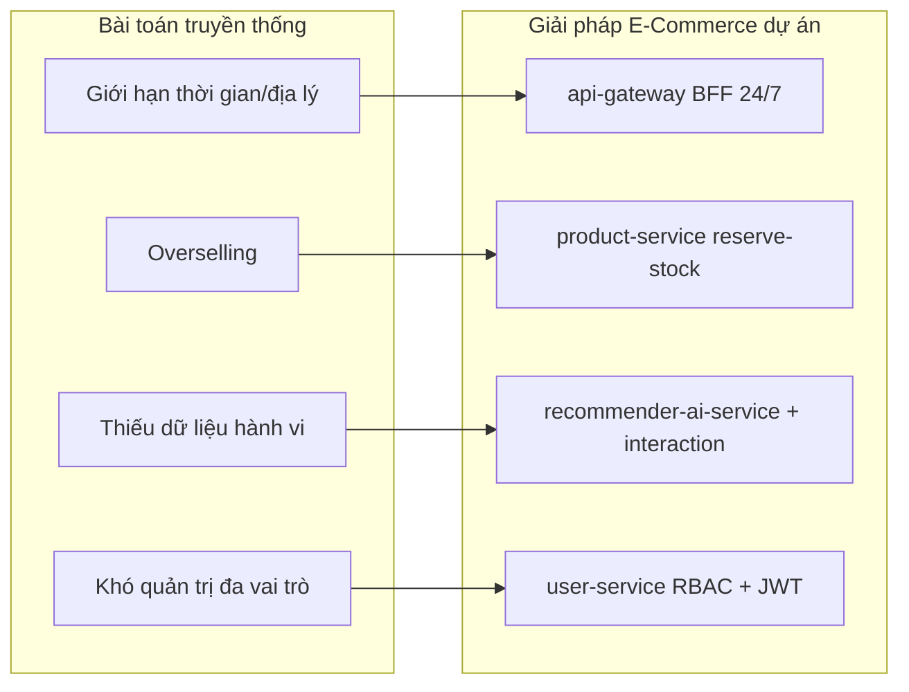

**Giải thích sơ đồ:** Sơ đồ trên ánh xạ từng pain point của bán hàng truyền thống sang module cụ thể trong source code. Mũi tên thể hiện quan hệ “được giải quyết bởi”, không phải gọi API trực tiếp. Ví dụ overselling được xử lý bởi cơ chế `POST /internal/reserve-stock/` trong `product-service` (pessimistic lock + `StockReservationLog`), gọi từ `OrderService` khi tạo đơn.

#### Ví dụ thực tế trong hệ thống

Giả sử khách hàng `customer1` (được bootstrap bởi `bootstrap_default_users`, mật khẩu mặc định `password123`) đăng nhập qua `/login/`. api-gateway gọi `POST /auth/login/` tới auth-service, nhận JWT chứa `entity_id` (integer, khóa customer trong cart/order legacy). Khách tìm kiếm “laptop” trên `/products/?search=laptop` — gateway proxy tới `GET /products/?search=laptop`, product-service trả danh sách có thể đã cache Redis. Khách thêm sản phẩm id=5 vào giỏ: `POST /cart/add/` → cart-service lưu `CartItem` với `unit_price` snapshot. Khi checkout, gateway tổng hợp giỏ, voucher, phí ship, gọi `POST /orders/` — order-service trừ tồn kho qua product-service, tạo `LegacyOrder` trạng thái `PENDING_PAYMENT`. Khách thanh toán tại `/orders/{id}/pay/` → payment-service xử lý idempotent theo `order_id`, publish sự kiện shipping.

#### Phân tích ưu điểm của hướng tiếp cận

- **Tách biệt trách nhiệm**: Mỗi service một database, sửa payment không migrate cart DB.
- **Phù hợp đồ án kiến trúc**: Thể hiện được sync/async, cache, message queue, AI service riêng.
- **Mở rộng từng phần**: Có thể scale `product-service` (read-heavy) độc lập auth-service.
- **Bám thực tế ngành**: Có voucher, flash sale, tracking, support ticket, recommender — không chỉ CRUD sản phẩm.

#### Nhận xét cuối mục

Mục 2.1.1 đặt bài toán E-Commerce trong bối cảnh thực tế và liên hệ trực tiếp với các microservice trong repository. Hệ thống giải quyết chuỗi giá trị mua sắm trực tuyến end-to-end; điểm đặc biệt là kiến trúc phân tán với hai lớp API (legacy đang phục vụ UI và v2/saga đang được xây dựng song song). Các mục tiếp theo sẽ chi tiết hóa đối tượng sử dụng và yêu cầu chức năng bám sát code.

---

### 2.1.2 Đối tượng sử dụng

Hệ thống phục vụ nhiều nhóm người dùng với quyền hạn và giao diện khác nhau. Roles được định nghĩa trong `user-service` (migration `0002_seed_system_roles`, command `seed_rbac`) gồm: `CUSTOMER`, `SELLER`, `STAFF`, `ADMIN`, `SUPER_ADMIN`, `SUPPORT`.

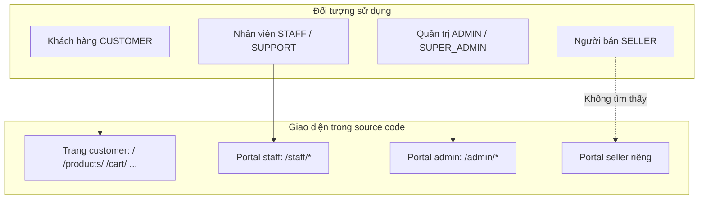

**Giải thích sơ đồ:** Ba nhóm chính có portal HTML trong `api-gateway`. Role `SELLER` có model `SellerProfile` trong user-service nhưng **không tìm thấy trong source code** portal UI riêng cho seller — chỉ có dữ liệu profile và role seed.

#### Khách hàng (Customer)

| Nhu cầu | Triển khai trong hệ thống | Service / Route |
|---------|--------------------------|-----------------|
| Đăng ký | Form `/register/` → `POST /auth/register/` | auth-service |
| Đăng nhập | `/login/` → `POST /auth/login/`, JWT vào session gateway | auth-service, api-gateway |
| Xem sản phẩm | `/products/`, `/products/<id>/` | product-service qua gateway |
| Tìm kiếm | Query `search`, `category`, `brand`, `min_price`, `max_price`, `sort` | `ProductListView` |
| Đánh giá | `POST /products/<id>/review/` | interaction-service `ReviewViewSet` |
| Đặt hàng | `/cart/<id>/checkout/` → `POST /orders/` | order-service |
| Thanh toán | `/orders/<id>/pay/` | payment-service |
| Theo dõi đơn | `/orders/<id>/tracking/` | order + shipping-service |
| Wishlist | `/wishlist/`, toggle trên product detail | interaction-service |
| Hỗ trợ | `/support/`, ticket + chat API | interaction-service |
| Gợi ý / Chat AI | Trang chủ, `/ai/chat/` | recommender-ai-service |
| Hồ sơ & địa chỉ | `/profile/`, `/addresses/` | user-service |

Khách hàng chỉ được thao tác dữ liệu của chính mình: gateway kiểm tra `entity_id` từ JWT/session khớp `customer_id` trên cart và order (logic trong `cart-service` views và order list filter).

#### Quản trị viên (Admin)

Admin (`ADMIN`, `SUPER_ADMIN`) truy cập `/admin/*`:

| Chức năng | Route gateway | Backend |
|-----------|---------------|---------|
| Dashboard thống kê | `/admin/dashboard/` | order metrics, product analytics |
| Báo cáo | `/admin/reports/` | order-service |
| Quản lý sản phẩm | `/admin/products/` | product-service |
| Danh mục / thương hiệu | `/admin/categories/`, `/admin/brands/` | product-service |
| Tồn kho | `/admin/inventory/` | `inventory-transactions` product-service |
| Đơn hàng | `/admin/orders/` | order-service |
| Khách hàng | `/admin/customers/` | user-service internal |
| Ticket | `/admin/tickets/` | interaction-service |
| MLOps gợi ý | `/admin/recommendation/` | recommender model APIs |

Permissions RBAC (`seed_rbac.py`): `ADMIN` có đủ `view_users`, `manage_users`, `view_orders`, `manage_orders`, `manage_inventory`, `manage_catalog`.

#### Nhân viên (Staff / Support)

Staff (`STAFF`, `SUPPORT`) dùng portal `/staff/*`:

| Chức năng | Route | Mô tả |
|-----------|-------|-------|
| Dashboard | `/staff/dashboard/` | Tổng quan đơn, ticket |
| Xử lý đơn hàng | `/staff/orders/`, cập nhật status, bulk | `PUT /orders/<pk>/`, `bulk-update` |
| Khách hàng | `/staff/customers/` | Xem profile, lịch sử |
| Hỗ trợ | `/staff/tickets/` | Trả lời ticket qua API messages |

`STAFF` được map permissions: `view_orders`, `manage_orders`, `manage_inventory`, `manage_catalog`. `SUPPORT`: `view_users`, `view_orders` — tập quyền hẹp hơn, phù hợp xử lý ticket và tra cứu đơn.

**Lưu ý:** Chức năng “kiểm kho” cho staff thực hiện qua admin inventory / product `inventory-transactions`, không có module WMS riêng trong source code.

#### Người bán (Seller)

Model `SellerProfile` (store_name, store_slug, verification_status…) tồn tại trong user-service. Role `SELLER` được seed nhưng `seed_rbac` gán `permissions` rỗng — *"Seller permissions handled via SellerProfile / specialized checks"*. **Không tìm thấy trong source code** giao diện seller portal hay API quản lý gian hàng riêng; quản lý sản phẩm hiện do admin/staff qua product-service.

#### Nhận xét cuối mục

Đối tượng sử dụng được phân tầng rõ qua JWT `roles` và routing gateway. Customer là luồng chính; staff/admin có portal riêng; seller chỉ ở mức dữ liệu model, chưa có UI đầy đủ — cần ghi rõ khi báo cáo để tránh overclaim.

---

### 2.1.3 Yêu cầu chức năng

Mỗi chức năng dưới đây **chỉ mô tả những gì có trong project**. Ký hiệu: **Input/Output** là dữ liệu chính; điều kiện và luồng bám code thực tế.

#### FC-01: Authentication (Xác thực)

| Thuộc tính | Mô tả |
|------------|-------|
| **Mục tiêu** | Xác định danh tính người dùng, cấp token phi trạng thái, hỗ trợ introspect cho NGINX và microservices |
| **Input** | Đăng ký: `username`, `email`, `password`, `role` (tùy chọn). Đăng nhập: `identifier`, `password`. Refresh: `refresh` token |
| **Output** | JWT access + refresh; introspect: HTTP 204 + headers `X-User-Id`, `X-Roles`, `X-Entity-Id`, `X-Role-Version` |
| **Điều kiện** | User `is_active`; login rate limit (`AUTH_LOGIN_RATE_LIMIT=5`/60s); khóa tài khoản sau `AUTH_MAX_FAILED_LOGINS=5` lần (`AUTH_LOCK_MINUTES=15`) |
| **Luồng xử lý** | `AuthService.register()` tạo `AuthUser` → gọi user-service tạo profile → `TokenService` cấp JWT. Login → verify password → audit `AuthAudit` → JWT payload embed `roles`, `entity_id`, `role_version` |
| **Kết quả** | Client/gateway lưu token; request sau mang `Authorization: Bearer` |

**API:** `POST /auth/register/`, `POST /auth/login/`, `POST /auth/refresh/`, `GET /auth/introspect/`, `GET /users/me/` (auth-service).

**Cấu hình JWT** (`auth_service/settings.py`): HS256, access 1440 phút, refresh 7 ngày, rotate + blacklist refresh token.

---

#### FC-02: User Management (Quản lý người dùng)

| Thuộc tính | Mô tả |
|------------|-------|
| **Mục tiêu** | Lưu profile, RBAC, địa chỉ giao hàng; đồng bộ với auth qua `auth_user_id` (UUID) |
| **Input** | Profile: `full_name`, `phone`, `roles[]`. Address: `recipient_name`, `address_line`, `city`, `postal_code`… |
| **Output** | `UserProfile` + `CustomerProfile`/`StaffProfile`/`SellerProfile`; danh sách `WebAddress` |
| **Điều kiện** | Internal API yêu cầu `@require_internal` (token + HMAC). Public `GET /users/me/` qua NGINX auth_request |
| **Luồng xử lý** | auth-service POST `/internal/users/` khi register → user-service tạo profile theo role → signals tăng `role_version` khi đổi role |
| **Kết quả** | JWT chứa `entity_id` (customer integer id) dùng xuyên suốt cart/order legacy |

**Models:** `UserProfile`, `Role`, `Permission`, `CustomerProfile`, `WebAddress` (user-service).

---

#### FC-03: Product Management (Quản lý sản phẩm)

| Thuộc tính | Mô tả |
|------------|-------|
| **Mục tiêu** | CRUD sản phẩm, biến thể, thuộc tính JSON, flash sale price, tồn kho trên product |
| **Input** | `name`, `category_id`, `brand_id`, `price`, `stock`, `attributes`, `image_url`, flash sale fields |
| **Output** | Product JSON; `effective_price` (property trong serializer) |
| **Điều kiện** | POST/PUT yêu cầu staff/admin (gateway kiểm tra roles). GET public |
| **Luồng xử lý** | `ProductService` CRUD → invalidate Redis cache (`product_list_version`). Flash sale sync từ promotion qua `POST /internal/sync-flash-sales/` |
| **Kết quả** | Catalog hiển thị trên gateway; stock giảm khi reserve qua order |

**API chính:** `GET/POST /products/`, `GET/PUT /products/<pk>/`, `POST /variants/`, `POST /internal/reserve-stock/`, `POST /internal/release-stock/`.

**Lưu ý:** `catalog-service` (`/api/v1/catalog/products/`) là catalog UUID song song — **không** là nguồn chính của api-gateway hiện tại.

---

#### FC-04: Category Management (Quản lý danh mục)

| Thuộc tính | Mô tả |
|------------|-------|
| **Mục tiêu** | Phân loại sản phẩm, lọc danh sách |
| **Input** | `name`, `description` (product-service); catalog-service thêm `parent`, `slug`, `level` |
| **Output** | Danh sách category; product filter theo `category` query param |
| **Điều kiện** | Tạo/sửa: staff/admin |
| **Luồng xử lý** | `CategoryService` / `CategoryListView` → lưu `categories` table `product_db` |
| **Kết quả** | `/catalog/` và `/products/?category=<id>` trên gateway |

---

#### FC-05: Cart Management (Quản lý giỏ hàng)

| Thuộc tính | Mô tả |
|------------|-------|
| **Mục tiêu** | Giỏ hàng bền theo `customer_id`, snapshot giá, hỗ trợ `variant_id` |
| **Input** | `product_id`, `quantity`, `unit_price`, `variant_id` (optional) |
| **Output** | `Cart` + `CartItem[]` |
| **Điều kiện** | Customer chỉ sửa giỏ của mình (`entity_id`); staff có thể xem theo id |
| **Luồng xử lý** | `CartService.add_item()` trong `transaction.atomic()` → `get_or_create` CartItem, cộng quantity nếu đã tồn tại, cập nhật `unit_price` |
| **Kết quả** | Checkout đọc giỏ qua `GET /internal/cart/<customer_id>/` hoặc public cart routes |

**API:** `GET /cart/`, `POST /cart/add/`, `PATCH /cart/items/<id>/`, `DELETE /carts/<customer_id>/items/<item_id>/`.

---

#### FC-06: Wishlist Management

| Thuộc tính | Mô tả |
|------------|-------|
| **Mục tiêu** | Lưu sản phẩm yêu thích theo customer |
| **Input** | `customer_id`, `product_id` |
| **Output** | Bản ghi `Wishlist`; unique `(customer_id, product_id)` |
| **Điều kiện** | User đã đăng nhập |
| **Luồng xử lý** | Gateway `POST /products/<id>/wishlist/` → interaction-service `WishlistViewSet` |
| **Kết quả** | Trang `/wishlist/` hiển thị kèm thông tin product từ product-service |

**Service:** interaction-service (`interaction_db`, bảng `wishlists`).

---

#### FC-07: Order Management (Quản lý đơn hàng)

| Thuộc tính | Mô tả |
|------------|-------|
| **Mục tiêu** | Tạo đơn từ giỏ, áp voucher, reserve stock, quản lý vòng đời trạng thái |
| **Input** | `customer_id`, `items[]`, `promotion_code`, `shipping_address`, `address_id`, `shipping_method_id` |
| **Output** | `LegacyOrder` + `LegacyOrderItem[]`, status ban đầu `PENDING_PAYMENT` |
| **Điều kiện** | Đủ tồn kho (product-service reserve); voucher hợp lệ (promotion-service) |
| **Luồng xử lý** | `OrderService.create_order()` → validate → `_apply_voucher` → `_create_order_db` → gọi `reserve-stock` → consume voucher/flash sale |
| **Kết quả** | Đơn chờ thanh toán; staff/admin cập nhật status; customer cancel/delete theo rule |

**Trạng thái** (`OrderStatus` trong legacy_models): `PENDING_PAYMENT`, `PAID`, `PROCESSING`, `SHIPPED`, `DELIVERED`, `CANCELLED`, `RETURN_REQUESTED`, `REFUNDED` (và các trạng thái trung gian trong code).

**API:** `POST /orders/`, `GET /orders/<pk>/`, `PUT /orders/<pk>/`, `POST /orders/<pk>/return/`, `POST /orders/bulk-update/`.

**Lưu ý:** `/api/v1/orders/checkout/` (saga v2) tồn tại nhưng **luồng checkout UI gateway dùng legacy** `POST /orders/`.

---

#### FC-08: Payment Management (Quản lý thanh toán)

| Thuộc tính | Mô tả |
|------------|-------|
| **Mục tiêu** | Xử lý thanh toán theo `order_id`, idempotent, kích hoạt shipping qua event |
| **Input** | `order_id`, `payment_amount`, `payment_method_id` (legacy) |
| **Output** | `Payment` record `payment_status`; `PaymentOutbox` event |
| **Điều kiện** | Một payment per `order_id` (`unique=True`); provider `MOCK` (env `PAYMENT_PROVIDER`) |
| **Luồng xử lý** | `PaymentService` (legacy) xử lý → cập nhật order paid (internal) → ghi outbox cùng transaction → `payment-outbox-worker` → RabbitMQ → `shipping-consumer` |
| **Kết quả** | Đơn chuyển trạng thái paid; vận đơn được tạo bất đồng bộ |

**API:** `POST /payments/`, `GET /payments/<pk>/`, `POST /payments/<id>/refund/`, `POST /internal/payments/`.

---

#### FC-09: Review Management (Quản lý đánh giá)

| Thuộc tính | Mô tả |
|------------|-------|
| **Mục tiêu** | Khách đánh giá sản phẩm, hiển thị trên product detail |
| **Input** | `product_id`, `customer_id`, `rating` (1-5), `comment_text`, `image_urls` (PostgreSQL ArrayField) |
| **Output** | Bản ghi `Review` trong interaction-service |
| **Điều kiện** | `verified_purchase` flag (logic trong serializer/view) |
| **Luồng xử lý** | Gateway `product_review` → `POST /api/v1/interactions/reviews/` |
| **Kết quả** | Đánh giá hiển thị trên `/products/<id>/`; feed recommender behavior |

**Lưu ý:** `catalog-service` cũng có model `Review` (UUID) — song song, gateway dùng interaction-service.

---

#### FC-10: Voucher / Coupon Management (Mã giảm giá)

| Thuộc tính | Mô tả |
|------------|-------|
| **Mục tiêu** | Tạo và áp dụng mã giảm giá phần trăm hoặc số tiền cố định |
| **Input** | `code`, `discount_percentage` hoặc `discount_amount`, `min_order_value`, `usage_limit`, thời hạn |
| **Output** | `discount_amount` khi apply; `used_count` tăng khi consume |
| **Điều kiện** | `is_active`, trong khoảng `start_date`–`end_date`, đủ `min_order_value` |
| **Luồng xử lý** | Checkout AJAX `apply-voucher` → `POST /api/promotions/apply-voucher/`; khi tạo đơn → `consume-voucher` |
| **Kết quả** | `discount_amount` trừ vào tổng đơn |

**Models:** `Voucher` (promotion-service); `LegacyCoupon`, `LegacyDiscount` (order-service legacy).

---

#### FC-11: Inventory Management (Quản lý tồn kho)

Hệ thống có **hai lớp** tồn kho:

| Lớp | Mô tả | Service |
|-----|-------|---------|
| **Legacy (chính cho gateway)** | Trường `Product.stock`, `StockReservationLog`, `InventoryTransaction` | product-service |
| **v2 Saga** | `Inventory`, `ReservationBatch`, `StockReservation`, optimistic lock `version` | inventory-service |

| Thuộc tính | Mô tả (legacy — luồng đặt hàng hiện tại) |
|------------|---------------------------------------------|
| **Mục tiêu** | Trừ/reserve stock khi đặt hàng, release khi hủy, reconcile orphan |
| **Input** | `order_id`, `items[{product_id, quantity}]` |
| **Output** | `StockReservationLog` status `RESERVED`/`RELEASED`/`COMMITTED` |
| **Luồng** | `InternalReserveStockView`: `SELECT FOR UPDATE` products, sort id tránh deadlock → validate stock → trừ → log |
| **Worker** | `python manage.py reconcile_stock` (product-service) |

---

#### FC-12: Flash Sale

| Thuộc tính | Mô tả |
|------------|-------|
| **Mục tiêu** | Giá khuyến mãi theo khung giờ, giới hạn số lượng |
| **Input** | `FlashSale`, `FlashSaleItem` (product_id, discount_price, quantity) |
| **Output** | Giá flash trên product (`is_flash_sale`, `flash_sale_price`); API `flash-sale-prices` |
| **Luồng** | promotion-service quản lý → `sync_flash_sales` command / internal sync → product-service |
| **Kết quả** | `effective_price` ưu tiên flash sale còn hạn |

---

#### FC-13: Shipping & Tracking (Vận chuyển)

| Thuộc tính | Mô tả |
|------------|-------|
| **Mục tiêu** | Tính phí ship, tạo vận đơn sau thanh toán, theo dõi trạng thái |
| **Input** | `order_id`, địa chỉ, `shipping_method_id`, weight/distance (calculator) |
| **Output** | `Shipping` + `tracking_number`, `ShippingStatus` history |
| **Luồng** | `consume_payments` consumer → `InternalShippingCreateView`; retry qua `payment-worker` |
| **State machine** | `pending` → `processing` → `shipped`; nhánh lỗi `failed` → retry |

**API:** `POST /shipping/calculate-fee/`, `GET /api/shippings/order/<order_id>/`.

---

#### FC-14: Support Ticket (Hỗ trợ khách hàng)

| Thuộc tính | Mô tả |
|------------|-------|
| **Mục tiêu** | Ticket và hội thoại staff–customer |
| **Input** | `subject`, `content`, `order_id` (optional) |
| **Output** | `Ticket` + `TicketReply` |
| **Trạng thái** | `OPEN`, `IN_PROGRESS`, `RESOLVED`, `CLOSED` |
| **Luồng** | `/support/new/` → `TicketViewSet`; chat qua `/support/<id>/api/messages/` |

---

#### FC-15: AI Recommendation & Chatbot

| Thuộc tính | Mô tả |
|------------|-------|
| **Mục tiêu** | Gợi ý cá nhân hóa, trending, chatbot RAG |
| **Input** | `customer_id`, `limit`; chat: `message`, `history`, `recent_behaviors` |
| **Output** | Danh sách `product_ids`; phản hồi chat text |
| **Luồng** | `RecommenderService` hybrid scoring (ALS + Neo4j co-purchase + behavior weights) → `GET /recommendations/<customer_id>/` |
| **Chatbot** | `POST /api/recommender/chat-ktmp` — Groq LLM (env `GROQ_API_KEY`) |

**Models:** `BehaviorEvent`, `RecommendationLog`, `ModelVersion` (recommender_db).

---

#### FC-16: Notification

| Thuộc tính | Mô tả |
|------------|-------|
| **Mục tiêu** | Gửi thông báo theo template (EMAIL/SMS/PUSH), idempotent theo event |
| **Input** | Events từ RabbitMQ (consumer `consume_events`) |
| **Output** | `NotificationLog` với status `QUEUED` → `SENT` / `RETRYING` |
| **Lưu ý** | Service tồn tại đầy đủ; **không tìm thấy** UI notification center cho customer trong api-gateway templates |

---

#### FC-17: Dashboard & Analytics

| Thuộc tính | Mô tả |
|------------|-------|
| **Mục tiêu** | Tổng quan doanh thu, đơn hàng, top sellers cho admin |
| **Input** | Session admin + JWT roles |
| **Output** | HTML dashboard/reports với metrics từ order-service `GET /orders/metrics/` |
| **Luồng** | `admin_dashboard`, `admin_reports` aggregate dữ liệu qua internal HTTP |

---

#### Bảng tổng hợp yêu cầu chức năng

| STT | Chức năng | Service chính | Trạng thái trong code |
|-----|-----------|-------------|----------------------|
| 1 | Authentication | auth-service | ✅ Đầy đủ |
| 2 | User Management | user-service | ✅ Đầy đủ |
| 3 | Product Management | product-service | ✅ Luồng chính UI |
| 4 | Category Management | product-service | ✅ |
| 5 | Cart Management | cart-service | ✅ |
| 6 | Wishlist | interaction-service | ✅ |
| 7 | Order Management | order-service | ✅ Legacy chính |
| 8 | Payment | payment-service | ✅ MOCK provider |
| 9 | Review | interaction-service | ✅ |
| 10 | Voucher/Coupon | promotion-service | ✅ |
| 11 | Inventory | product + inventory-service | ✅ Hai lớp |
| 12 | Flash Sale | promotion + product | ✅ |
| 13 | Shipping | shipping-service | ✅ |
| 14 | Support Ticket | interaction-service | ✅ |
| 15 | AI Recommender | recommender-ai-service | ✅ |
| 16 | Notification | notification-service | ✅ Backend; UI hạn chế |
| 17 | Dashboard | api-gateway + order | ✅ Admin |
| 18 | Seller Portal | — | ❌ Không có UI |

#### Nhận xét cuối mục

Danh sách chức năng bám sát repository: 17 mảng có implementation, seller portal thiếu. Luồng checkout–pay–ship qua legacy API là xương sống nghiệp vụ; các API `/api/v1/...` là lớp nâng cấp song song.

---

### 2.1.4 Yêu cầu phi chức năng

#### Giới thiệu

Yêu cầu phi chức năng (Non-Functional Requirements — NFR) mô tả *chất lượng* hệ thống: hiệu năng, bảo mật, khả năng mở rộng, độ tin cậy — không phải chức năng nghiệp vụ cụ thể. Các NFR dưới đây được suy ra trực tiếp từ code và `docker-compose.yml`.

#### NFR-01: Performance (Hiệu năng)

**Mục đích:** Chịu tải đọc cao (xem sản phẩm >> đặt hàng).

**Triển khai:**

| Cơ chế | Vị trí code | Chi tiết |
|--------|-------------|----------|
| Redis cache sản phẩm | product-service | Key `product:{pk}` TTL 600s; list cache TTL 180s |
| Version-based invalidation | `invalidate_product_cache()` | `INCR product_list_version` — không xóa từng key list |
| NGINX auth cache | `nginx.conf` | `/auth/introspect/` cache 5s theo `Authorization` header |
| User permission cache | user-service signals | `user_permissions:v1:{id}` TTL 300s |
| Rate limiting | nginx.conf | `public_api` 30r/s, `auth_api` 5r/m, `critical_api` 10r/s |

**Ưu điểm:** Giảm latency đọc catalog và giảm tải auth introspect — bottleneck thường gặp ở cổng API.

---

#### NFR-02: Scalability (Khả năng mở rộng)

**Mục đích:** Scale từng service độc lập theo nhu cầu.

**Triển khai:**

- Microservices tách database (12 PostgreSQL instances trong compose).
- Stateless JWT — auth-service không lưu session server-side cho API.
- Workers tách container: `order-outbox-worker`, `payment-outbox-worker`, `recommender-consumer`… scale horizontal độc lập API.
- `model-serving-service` (FastAPI) tách inference khỏi Django recommender.

**Hạn chế hiện tại:** Docker Compose single-host — không có Kubernetes trong source code; auto-scaling cloud **không tìm thấy** trong project.

---

#### NFR-03: Security (Bảo mật)

| Lớp | Cơ chế | File / Config |
|-----|--------|---------------|
| Edge | Chặn `/internal/*` → 403 | nginx.conf |
| Edge | Security headers CSP, X-Frame-Options | nginx.conf |
| Auth | JWT HS256, refresh rotation + blacklist | auth-service SIMPLE_JWT |
| Auth | `role_version` revoke token khi đổi quyền | introspect + user signals |
| Internal API | `X-Internal-Token` + HMAC `X-Signature` + timestamp 30s | `common/common/auth.py` |
| Login | Rate limit + account lockout | `AuthService`, settings |

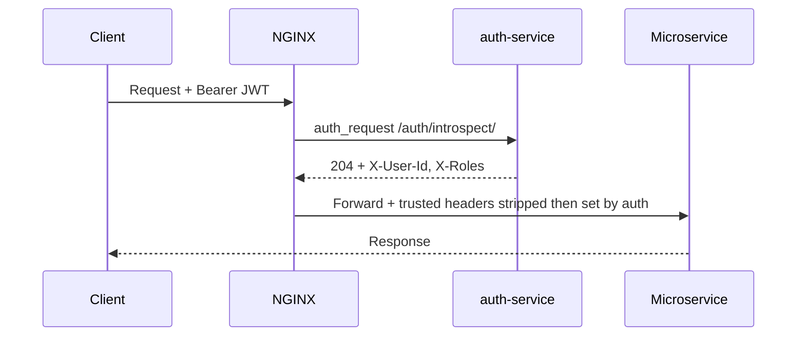

**Giải thích sơ đồ:** NGINX không tin header identity từ client (bị strip ở `nginx.conf` dòng 66–72), chỉ tin kết quả introspect từ auth-service. Đây là mô hình zero-trust ở edge.

---

#### NFR-04: Reliability (Độ tin cậy)

| Pattern | Triển khai |
|---------|------------|
| Circuit Breaker | `InternalClient` trong `common/client.py` — Redis state, 3 failures → OPEN 15s |
| Retry + backoff | httpx client max 2 retries, exponential 0.5s–2s |
| Tenacity retry | `UpstreamClient` auth→user-service |
| Outbox + RabbitMQ | Đảm bảo event không mất khi publish fail |
| DLQ | `dlq-consumer` → bảng `DLQEvent` |
| Shipping retry | `payment-worker` mỗi 60s, max 5 lần |
| Stock reconcile | `reconcile_stock` management command |
| Saga timeout | `saga_timeout_worker` (order-service v2) |

**Eventual consistency:** Độ trễ 0.5–2s giữa payment completed và shipping tạo — chấp nhận được theo thiết kế async.

---

#### NFR-05: Maintainability (Khả năng bảo trì)

- **Service layer** tách khỏi views: `CartService`, `OrderService`, `ProductService`, `AuthService`…
- **Common module** chia sẻ `InternalClient`, `AbstractOutboxEvent`, middleware — tránh duplicate.
- **Legacy + v2** tách file: `legacy_models.py`, `legacy_services.py` song song models saga — migration dần không breaking UI.
- Management commands seed mock data: `seed_mock` trên nhiều service — hỗ trợ dev/test.

**Repository pattern:** Chỉ có tại `recommender-ai-service` (`RecommenderRepository`, `GraphRepository`) — các service khác dùng Django ORM trực tiếp trong Service class.

---

#### NFR-06: Availability (Tính sẵn sàng)

- Health endpoints: `/health/live/`, `/health/ready/` (auth); `/health`, `/ready` (catalog, order, payment, inventory, interaction, notification).
- Docker `healthcheck` trên PostgreSQL, RabbitMQ, auth-service.
- `wait_for_tables.py` — workers đợi migration xong trước khi chạy.
- RabbitMQ `restart: unless-stopped` trên workers.

**Không tìm thấy:** Multi-AZ deployment, load balancer beyond single NGINX instance.

---

#### NFR-07: Usability (Khả năng sử dụng)

- Giao diện HTML tiếng Việt trong templates (`api-gateway/templates/`).
- Checkout tích hợp voucher AJAX, shipping fee theo thành phố.
- Trang tracking đơn hàng `/orders/<id>/tracking/`.
- Chat support realtime qua polling API messages.
- Chatbot AI `/ai/chat/` proxy recommender.
- Bootstrap users mặc định (`admin/Admin@12345`, `customer1/password123`) — hỗ trợ demo nhanh.

---

#### NFR-08: Observability (Khả năng quan sát)

- `RequestIDMiddleware` — `X-Request-ID` xuyên suốt chain.
- `JSONFormatter` structured logging.
- Jaeger container (OTLP 4317/4318, UI 16686) trong docker-compose.
- `AuthAudit` log mọi sự kiện login/register.

---

#### Bảng ràng buộc công nghệ (Technical Constraints)

| Thành phần | Công nghệ | Ghi chú trong source |
|------------|-----------|----------------------|
| Framework | Python 3.10, Django 4.2, DRF | Tất cả Django services |
| HTTP client | httpx | common + auth UpstreamClient |
| JWT | simplejwt HS256 | auth-service |
| CSDL | PostgreSQL 15 | 12 DB trong compose |
| Cache | Redis 7 | 2 instance: `redis`, `order-redis` |
| Message broker | RabbitMQ 3 | Outbox workers |
| Graph DB | Neo4j 5 | recommender co-purchase |
| ML serving | FastAPI | model-serving-service |
| LLM | Groq API | env `GROQ_API_KEY` trong `env` file |
| Proxy | NGINX Alpine | Cổng 80 duy nhất public |
| Orchestration | Docker Compose | Không có K8s manifest |

**Không sử dụng:** Elasticsearch, Kafka, MySQL. SQLite chỉ default local trong `catalog-service/settings.py` (Docker override qua `catalog-db` Postgres).

#### Nhận xét cuối mục 2.1

Mục 2.1 hoàn tất phân tích yêu cầu từ bài toán thực tế đến NFR, bám source code. Các mục 2.2 trở đi sẽ đi sâu phân rã service, thiết kế chi tiết, sơ đồ use case/class, hướng dẫn tạo Django service, luồng hoạt động và ERD.

---

<!-- Part 1 (mục 2.1) hoàn tất. Part 2 sẽ viết lại mục 2.2 Phân rã Service theo outline mới. -->

## 2.2 PHÂN RÃ SERVICE

### Giới thiệu khái niệm Service Decomposition

**Phân rã service** (Service Decomposition) là quá trình chia hệ thống lớn thành các đơn vị phần mềm nhỏ hơn, mỗi đơn vị đảm nhận một tập trách nhiệm nghiệp vụ rõ ràng, có thể triển khai và mở rộng độc lập. Trong dự án này, mỗi microservice tương ứng một **bounded context** nghiệp vụ (identity, catalog, cart, order…) và sở hữu **database riêng** — nguyên tắc *Database per Service*.

### Vì sao cần phân rã service?

1. **Giảm độ phức tạp nhận thức**: Một monolith E-Commerce đầy đủ (auth + catalog + cart + order + payment + ship + AI) có hàng trăm model và view — khó đọc, khó onboard developer mới.
2. **Scale theo nhu cầu thực tế**: Lượng đọc sản phẩm >> lượng ghi đơn hàng → `product-service` cần Redis cache nhiều hơn `payment-service`.
3. **Cô lập lỗi**: Payment outbox worker fail không làm crash product catalog API.
4. **Đội ngũ song song**: Nhóm AI phát triển `recommender-ai-service` không block nhóm core commerce.
5. **Thay đổi công nghệ từng phần**: `model-serving-service` dùng FastAPI + TensorFlow/PyTorch trong khi các service khác dùng Django.

### Lợi ích của Service Layer (tầng dịch vụ nghiệp vụ)

Trong từng Django app, logic nghiệp vụ được tách vào các class `*Service` thay vì nhồi vào View:

| Lợi ích | Ví dụ trong project |
|---------|---------------------|
| Tái sử dụng | `CartService` gọi từ nhiều view; `OrderService` gọi từ API và management command |
| Testability | `InventoryServiceTests`, `PaymentServiceTests` test service độc lập HTTP |
| Transaction boundary | `CartService.add_item()` bọc `transaction.atomic()` — view chỉ parse request |
| Tách HTTP khỏi domain | View validate serializer → gọi service → trả response |

**Các Service class có trong source:** `AuthService`, `TokenService`, `CartService`, `ProductService`, `CategoryService`, `BrandService`, `OrderService`, `PaymentService`, `ShippingService`, `InventoryService`, `InteractionService`, `RecommenderService`, `ProductService` (catalog), `CategoryService` (catalog).

**Lưu ý:** Pattern **Repository** chỉ xuất hiện tại `recommender-ai-service` (`RecommenderRepository`, `GraphRepository`). Các service khác truy cập Django ORM trực tiếp trong Service layer.

### Lợi ích của Modular Architecture (Kiến trúc module hóa)

- **`common/` module**: `InternalClient`, `AbstractOutboxEvent`, `RequestIDMiddleware`, `@require_internal` — dùng chung qua `PYTHONPATH=/app/common` trong Docker.
- **Legacy / v2 tách file**: `legacy_models.py`, `legacy_services.py` song song saga models — module hóa theo thời gian (strangler fig).
- **Workers tách container**: Outbox relay và consumer không chạy chung process với API server — module hóa theo *runtime role*.
- **api-gateway tách BFF**: UI và orchestration tách khỏi domain logic — frontend template không nằm trong product-service.

### Danh sách Service từ source code

Hệ thống gồm **14 microservice** nghiệp vụ + **2 thành phần hạ tầng** (nginx, api-gateway):

| STT | Service | Port | Database | Chức năng chính | Trách nhiệm | Dữ liệu quản lý | API tiêu biểu |
|-----|---------|------|----------|-----------------|-------------|-----------------|---------------|
| 1 | **auth-service** | 8012 | `auth_db` | Xác thực JWT | Register, login, refresh, introspect | `AuthUser`, `RefreshToken`, `AuthAudit` | `POST /auth/login/`, `GET /auth/introspect/` |
| 2 | **user-service** | 8001 | `user_db` | Profile & RBAC | Profile theo role, địa chỉ, permissions | `UserProfile`, `Role`, `WebAddress` | `GET /users/me/`, `POST /internal/users/` |
| 3 | **product-service** | 8002 | `product_db` | Catalog legacy (UI chính) | CRUD sản phẩm, stock, flash sale sync, reserve stock | `Product`, `Category`, `StockReservationLog` | `GET /products/`, `POST /internal/reserve-stock/` |
| 4 | **catalog-service** | 8010 | `catalog_db` | Catalog UUID v2 | CRUD UUID, outbox events, soft delete | `Product` (UUID), `OutboxEvent` | `GET /api/v1/catalog/products/` |
| 5 | **cart-service** | 8003 | `cart_db` | Giỏ hàng | CRUD cart, snapshot giá | `Cart`, `CartItem` | `POST /cart/add/`, `GET /internal/cart/{id}/` |
| 6 | **order-service** | 8014 | `order_db` | Đơn hàng | Tạo đơn legacy, saga v2, outbox | `LegacyOrder`, `Order`, `OrderSaga` | `POST /orders/`, `POST /api/v1/orders/checkout/` |
| 7 | **payment-service** | 8015 | `pay_db` | Thanh toán | Idempotent payment, outbox, refund | `Payment`, `PaymentIntent`, `PaymentOutbox` | `POST /payments/`, `POST /internal/payments/` |
| 8 | **shipping-service** | 8009 | `ship_db` | Vận chuyển | Tính phí, tạo vận đơn, state machine | `Shipping`, `ShippingMethod`, `ShippingStatus` | `POST /shipping/calculate-fee/`, `POST /internal/shipping/create/` |
| 9 | **inventory-service** | 8013 | `inventory_db` | Tồn kho v2 | Reserve/confirm/release, optimistic lock | `Inventory`, `ReservationBatch`, `StockReservation` | `POST /api/v1/inventory/reserve/` |
| 10 | **promotion-service** | 8018 | `promotion_db` | Khuyến mãi | Voucher, flash sale | `Voucher`, `FlashSale`, `FlashSaleItem` | `POST /api/promotions/apply-voucher/` |
| 11 | **interaction-service** | 8017 | `interaction_db` | Tương tác KH | Review, wishlist, ticket, behavior events | `Review`, `Wishlist`, `Ticket`, `InteractionEvent` | `POST /api/v1/interactions/reviews/` |
| 12 | **notification-service** | 8016 | `notification_db` | Thông báo | Template, gửi email/push, retry | `NotificationTemplate`, `NotificationLog` | `GET /api/v1/notifications/logs/` |
| 13 | **recommender-ai-service** | 8011 | `recommender_db` + Neo4j | AI gợi ý | Hybrid recommender, RAG chat, MLOps | `BehaviorEvent`, `ModelVersion` | `GET /recommendations/{id}/`, `POST /api/recommender/chat-ktmp` |
| 14 | **model-serving-service** | 8019 | — | ML inference | Predict ranking từ sequence | Model files in-memory | `POST /predict` |
| — | **api-gateway** | 8000 | SQLite (session) | BFF + SSR | HTML pages, proxy REST, role routing | Session JWT (không domain DB) | `/products/`, `/cart/`, `/admin/` |
| — | **nginx** | 80 | — | Edge proxy | Rate limit, auth_request, chặn internal | — | Route `/auth/*`, `/*` → gateway |

### Service Decomposition Diagram

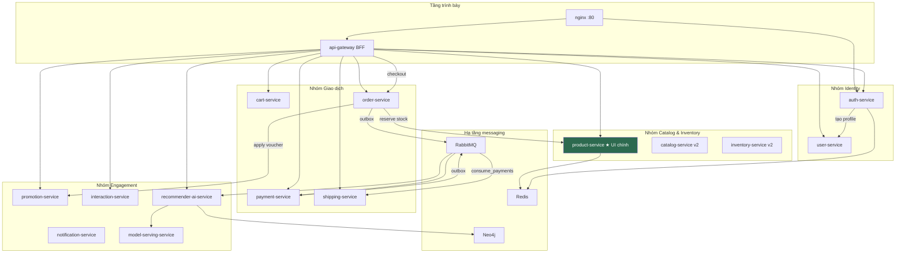

**Giải thích sơ đồ:** Mỗi hộp trong sơ đồ là **một microservice riêng** (container + database riêng). Sơ đồ nhóm theo **lĩnh vực nghiệp vụ** để dễ đọc, không có nghĩa các service trong cùng nhóm gộp chung một process. Dấu ★ đánh dấu `product-service` là catalog **đang phục vụ api-gateway**. Mũi tên nét liền = REST đồng bộ; mũi tên qua `RMQ` = bất đồng bộ (Outbox pattern).

**Giải thích từng nhóm:**

| Nhóm | Thành phần | Ý nghĩa |
|------|------------|---------|
| Presentation | nginx, api-gateway | Điểm vào duy nhất; gateway tổng hợp dữ liệu nhiều service cho một trang HTML |
| Identity | auth, user | Tách xác thực (credential) khỏi profile (RBAC, địa chỉ) |
| Catalog | product, catalog, inventory | Hai thế hệ catalog; inventory v2 cho reservation saga |
| Transaction | cart, order, payment, ship | Chuỗi giá trị mua hàng — cart → order → pay → ship |
| Engagement | promotion, interaction, notification, recommender | Marketing, phản hồi KH, thông báo, AI |
| Messaging | RabbitMQ, Redis, Neo4j | Hỗ trợ async, cache, graph — không chứa nghiệp vụ trực tiếp |

### Chi tiết trách nhiệm từng Service

#### 1. Auth Service

- **Nhận dữ liệu từ:** Client (username/password), user-service (profile khi register/introspect).
- **Xử lý:** Hash password, cấp JWT, validate token, rate limit login, audit.
- **Lưu tại:** `auth_db` — bảng `auth_users`, `refresh_tokens`, `auth_audit`.
- **Giao tiếp:** → user-service (`UpstreamClient` + tenacity retry); ← NGINX introspect.
- **Tình huống:** Đăng ký tài khoản customer mới; staff login vào `/staff/` qua gateway session.

#### 2. User Service

- **Nhận dữ liệu từ:** auth-service (tạo profile), api-gateway (profile, addresses).
- **Xử lý:** RBAC mapping, soft delete profile, quản lý `WebAddress`, tăng `role_version` qua signals.
- **Lưu tại:** `user_db`.
- **Giao tiếp:** ← auth-service, order/payment (internal list customers).
- **Tình huống:** Customer thêm địa chỉ giao hàng tại `/addresses/add/`.

#### 3. Product Service (luồng chính)

- **Nhận dữ liệu từ:** api-gateway, order-service (reserve/release), promotion-service (flash sale sync).
- **Xử lý:** CRUD catalog, Redis cache, pessimistic lock stock, `effective_price`.
- **Lưu tại:** `product_db`.
- **Giao tiếp:** ← order (reserve), ← promotion (sync flash sale prices).
- **Tình huống:** Admin tạo sản phẩm tại `/admin/products/create/`; khách tìm kiếm `/products/?search=phone`.

#### 4. Cart Service

- **Nhận dữ liệu từ:** api-gateway (customer actions), order-service (internal read).
- **Xử lý:** `CartService` atomic add/update/remove; snapshot `unit_price`.
- **Lưu tại:** `cart_db` — một `Cart` per `customer_id`.
- **Giao tiếp:** ← gateway; ← order (đọc giỏ khi checkout).
- **Tình huống:** Khách thêm 2 sản phẩm, đổi số lượng trước checkout.

#### 5. Order Service

- **Nhận dữ liệu từ:** api-gateway checkout payload, payment-service (mark paid), RabbitMQ events.
- **Xử lý:** `OrderService.create_order()` — voucher, reserve stock, tạo `LegacyOrder`; saga v2 qua `OrderViewSet.checkout`.
- **Lưu tại:** `order_db`.
- **Giao tiếp:** → product, promotion; → payment (indirect); outbox → RabbitMQ.
- **Tình huống:** Checkout tạo đơn `PENDING_PAYMENT`; staff bulk update trạng thái.

#### 6. Payment Service

- **Nhận dữ liệu từ:** api-gateway `/orders/{id}/pay/`, order events (consumer).
- **Xử lý:** Idempotent payment per `order_id`; ghi `PaymentOutbox` cùng transaction.
- **Lưu tại:** `pay_db`.
- **Giao tiếp:** → order (mark paid); outbox → shipping-consumer.
- **Tình huống:** Khách thanh toán MOCK; retry shipping nếu consumer fail.

#### 7. Shipping Service

- **Nhận dữ liệu từ:** payment events (consumer), api-gateway (tracking, fee calculator).
- **Xử lý:** `ShippingService` state machine, tính phí theo zone/method/weight.
- **Lưu tại:** `ship_db`.
- **Giao tiếp:** ← payment consumer; ← gateway (fee, tracking).
- **Tình huống:** Sau thanh toán, vận đơn tự tạo với `tracking_number`.

#### 8. Promotion Service

- **Nhận dữ liệu từ:** api-gateway (apply voucher AJAX), order-service (consume).
- **Xử lý:** Validate voucher, flash sale quantity, sync prices sang product-service.
- **Lưu tại:** `promotion_db`.
- **Giao tiếp:** ← order, gateway; → product (sync flash sales).
- **Tình huống:** Khách nhập mã `SALE10` tại checkout.

#### 9. Interaction Service

- **Nhận dữ liệu từ:** api-gateway (review, wishlist, support), recommender (behavior).
- **Xử lý:** CRUD review/wishlist/ticket; ghi `InteractionEvent`; outbox cho recommender.
- **Lưu tại:** `interaction_db`.
- **Giao tiếp:** → recommender-consumer qua RabbitMQ.
- **Tình huống:** Khách viết review 5 sao; mở ticket khiếu nại đơn hàng.

#### 10. Recommender AI Service

- **Nhận dữ liệu từ:** order, product, interaction events, Neo4j, model-serving.
- **Xử lý:** `RecommenderService` hybrid score; RAG chatbot Groq; MLOps model version.
- **Lưu tại:** `recommender_db`, Neo4j graph.
- **Giao tiếp:** HTTP + RabbitMQ consumer; → `model-serving-service /predict`.
- **Tình huống:** Trang chủ sắp xếp sản phẩm theo gợi ý; chatbot tư vấn qua `/ai/chat/`.

#### 11–14. Catalog v2, Inventory v2, Notification, Model Serving

- **catalog-service**: Catalog UUID + outbox — **chưa** là nguồn chính của gateway; phục vụ kiến trúc event-driven tương lai.
- **inventory-service**: Reservation saga độc lập product.stock — consumer `consume_order_events`.
- **notification-service**: Consumer `consume_events`, worker `notification_retry_worker` — backend hoàn chỉnh, UI notification center **không tìm thấy**.
- **model-serving-service**: FastAPI inference — tách tải ML khỏi Django.

### Nhận xét cuối mục 2.2

Phân rã 14 microservice bám bounded context thực tế trong repository. Service layer trong từng Django app giữ view mỏng và logic nghiệp vụ tập trung. Điểm cần lưu ý khi đọc các mục sau: **luồng UI legacy** (product + order + payment) và **luồng v2/saga** (catalog + inventory + `/api/v1/`) coexist — không được trộn lẫn khi mô tả flow.

---

### 2.2.0 Sơ đồ Kiến trúc Tổng thể (triển khai Docker)

Hệ thống được tổ chức theo **5 tầng**. Tầng **Business Services** liệt kê **từng microservice riêng** — mỗi ô là một container độc lập, không gom backend thành một khối:

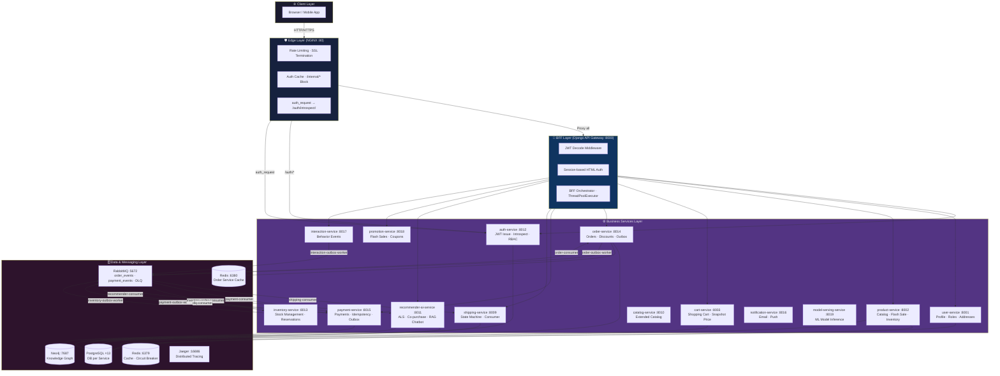

*Hình 2.1: Kiến trúc tổng thể hệ thống E-commerce Microservices — 14 services, 13 databases, 30+ containers*

### 2.2.1 Bounded Context và Phân rã Microservices

Hệ thống được phân rã thành **14 Microservices** độc lập, mỗi service sở hữu một CSDL PostgreSQL riêng biệt hoàn toàn. Đây là triết lý **Database per Service** — không có bất kỳ cross-database JOIN nào ở tầng SQL:

| Service | Port (host) | Database | Bounded Context | Workers/Consumers |
|---|---|---|---|---|
| `auth-service` | 8012 | `auth_db` | Identity & Access Management | — |
| `user-service` | 8001 | `user_db` | User Profile & RBAC | — |
| `product-service` | 8002 | `product_db` | Catalog & Inventory | `reconcile_stock`, `sync_flash_sales` |
| `catalog-service` | 8010 | `catalog_db` | Extended Catalog | — |
| `inventory-service` | 8013 | `inventory_db` | Stock Reservations | `inventory-outbox-worker`, `inventory-order-consumer` |
| `cart-service` | 8003 | `cart_db` | Ephemeral Shopping | — |
| `order-service` | 8014 | `order_db` | Sales & Fulfillment | `order-outbox-worker`, `order-consumer` |
| `payment-service` | 8015 | `pay_db` | Financial Transactions | `payment-consumer`, `payment-outbox-worker`, `payment-worker`, `dlq-consumer` |
| `shipping-service` | 8009 | `ship_db` | Logistics & Delivery | `shipping-consumer` |
| `notification-service` | 8016 | `notification_db` | Notifications | — |
| `interaction-service` | 8017 | `interaction_db` | Behavior Events | `interaction-outbox-worker` |
| `promotion-service` | 8018 | `promotion_db` | Flash Sales & Coupons | — |
| `recommender-ai-service` | 8011 | `recommender_db` + Neo4j | AI Personalization | `recommender-consumer` |
| `model-serving-service` | 8019 | — | ML Model Inference | — |

Ngoài ra, hệ thống còn có:
- **`api-gateway`** (port 8000): Django BFF (Backend-For-Frontend) — orchestrates service calls, renders HTML
- **`nginx`** (port 80): Reverse proxy thực sự — rate limiting, SSL termination, auth caching

**Hai Redis riêng biệt:**
- Redis chính (port 6381→6379): dùng cho Product cache, Circuit Breaker state (tất cả services), User permission cache
- Redis Order (port 6380→6379): dùng riêng cho Order Service idempotency và caching

### 2.2.2 Sơ đồ Bounded Context và Database per Service

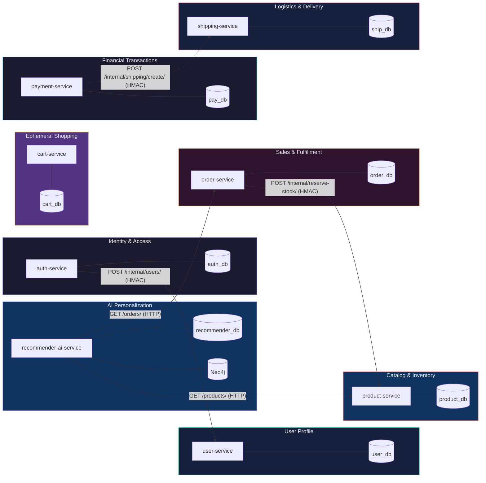

*Hình 2.2: Bounded Context và Database per Service — không có Cross-Database JOIN*

### 2.2.3 Quy tắc Giao tiếp Liên Dịch vụ (Inter-service Communication Rules)

Giao tiếp giữa các services được chia thành 2 loại chính:

**Loại 1 — Synchronous (Đồng bộ): REST API qua `InternalClient` với HMAC + Circuit Breaker**

Dùng khi cần phản hồi tức thì để tiếp tục xử lý — ví dụ: Order Service cần xác nhận tồn kho trước khi commit đơn hàng.

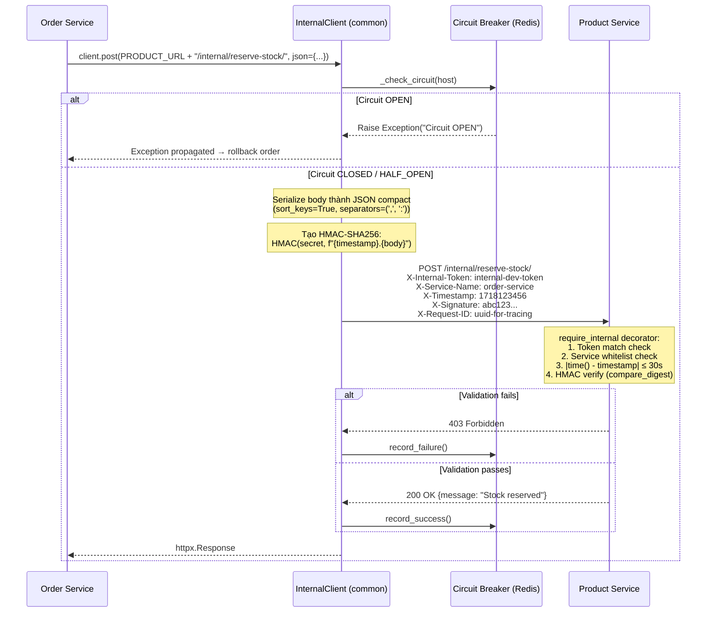

*Hình 2.3: Luồng giao tiếp đồng bộ nội bộ với HMAC và Circuit Breaker Redis-backed*

Code thực tế của `InternalClient` trong `common/common/client.py`:

```python
# common/common/client.py
class InternalClient:
    def __init__(self, timeout=2.0, max_retries=2):
        self.timeout = timeout
        self.max_retries = max_retries
        self.service_name = os.environ.get("SERVICE_NAME", "unknown_service")
        self.internal_token = os.environ.get("INTERNAL_TOKEN", "internal-dev-token")
        self.signing_secret = os.environ.get("INTERNAL_SIGNING_SECRET", "internal-signing-secret")
        self.fail_threshold = 3   # Mở circuit sau 3 lần thất bại liên tiếp
        self.reset_timeout = 15   # Reset circuit sau 15 giây

    def _generate_signature(self, timestamp: str, body: str) -> str:
        """HMAC-SHA256: HMAC(signing_secret, f"{timestamp}.{body}")"""
        return hmac.new(
            self.signing_secret.encode("utf-8"),
            f"{timestamp}.{body}".encode("utf-8"),
            hashlib.sha256,
        ).hexdigest()

    def _get_headers(self, request_body: str = "") -> dict:
        request_id = get_request_id() or "unknown-req-id"
        timestamp = str(int(time.time()))
        signature = self._generate_signature(timestamp, request_body)
        return {
            "X-Request-ID":    request_id,
            "X-Trace-ID":      request_id,    # Alias cho distributed tracing
            "X-Service-Name":  self.service_name,
            "X-Timestamp":     timestamp,
            "X-Signature":     signature,
            "X-Internal-Token": self.internal_token,
            "Content-Type":    "application/json"
        }

    def request(self, method: str, url: str, **kwargs) -> httpx.Response:
        host = self._get_host(url)
        cb_state = self._check_circuit(host)    # Raises nếu OPEN
        
        # Serialize JSON để tính signature chính xác (compact + sorted keys)
        if "json" in kwargs:
            request_body = json.dumps(kwargs.pop("json"),
                                      separators=(",", ":"), sort_keys=True)
            kwargs["data"] = request_body
        
        headers = kwargs.pop("headers", {})
        headers.update(self._get_headers(request_body))
        
        attempt, backoff = 0, 0.5
        with httpx.Client(timeout=self.timeout) as client:
            while attempt <= self.max_retries:
                try:
                    response = client.request(method, url, headers=headers, **kwargs)
                    if 500 <= response.status_code < 600:
                        raise httpx.HTTPStatusError(...)
                    self._record_success(host, cb_state)
                    return response
                except (httpx.TimeoutException, httpx.NetworkError,
                        httpx.HTTPStatusError):
                    self._record_failure(host, cb_state)   # Cập nhật state Redis
                    attempt += 1
                    time.sleep(backoff)
                    backoff *= 2   # Exponential backoff: 0.5 → 1.0 → 2.0s
```

**Circuit Breaker State Machine (Redis-backed):**

State được lưu trong Redis với key `circuit:{hostname}`, cấu trúc JSON: `{"status": "OPEN|CLOSED|HALF_OPEN", "failures": 3, "last_failure_time": 1718123456.789}`. TTL 3600 giây.

```
CLOSED  ──[3 failures]──►  OPEN  ──[15 seconds]──►  HALF_OPEN
   ▲                                                      │
   └──────────[success]────────────────────────────────────┘
                                  │
   ┌──────────[failure]───────────┘
   ▼
  OPEN
```

**Loại 2 — Asynchronous (Bất đồng bộ): Outbox Pattern + RabbitMQ**

Dùng cho các thao tác không yêu cầu phản hồi tức thì — ví dụ: Order Service thông báo cho Payment Service, Payment Service kích hoạt Shipping Service.

```mermaid
sequenceDiagram
    participant OS as Order Service
    participant DB as order_db
    participant OBX as order_outbox table
    participant W as order-outbox-worker container
    participant MQ as RabbitMQ (fanout: order_events)
    participant PC as payment-consumer container
    participant SC as shipping-consumer container

    rect rgb(30, 50, 80)
        Note over OS,OBX: TRONG CÙNG 1 TRANSACTION (ACID)
        OS->>DB: INSERT orders (..., status='pending_payment')
        OS->>OBX: INSERT order_outbox(event_type='order_created', status='PENDING')
        OS->>DB: COMMIT
    end

    loop Poll mỗi 0.5s
        W->>OBX: SELECT FOR UPDATE WHERE status='PENDING' LIMIT 50
        W->>MQ: basic_publish(exchange='order_events', body=JSON)
        W->>OBX: UPDATE status='PUBLISHED', published_at=now()
    end

    Note over MQ: fanout exchange → broadcast to ALL bound queues
    MQ->>PC: Deliver to 'payment_order_consumer' queue
    MQ->>SC: Deliver to 'shipping_order_consumer' queue (nếu có)

    PC->>PC: Idempotency: Payment.objects.filter(order_id=X).exists() ?
    PC->>PC: Process + ghi PaymentOutbox
    PC->>MQ: basic_ack()

    Note over W,OBX: Nếu publish thất bại → retry_count++ → sau 5 lần → FAILED
```

*Hình 2.4: Outbox Pattern đảm bảo at-least-once delivery — không mất event kể cả khi crash*

Code thực tế của `EventPublisher` trong `common/common/events.py`:

```python
# common/common/events.py
class EventPublisher:
    @classmethod
    def _setup_topology(cls):
        channel = cls._channel
        # Dead Letter Exchange — nhận message thất bại từ consumer
        channel.exchange_declare(exchange='dlx', exchange_type='direct', durable=True)
        channel.queue_declare(queue='dlq', durable=True)
        channel.queue_bind(queue='dlq', exchange='dlx', routing_key='dlq')
        # Business Exchanges — fanout: gửi tới TẤT CẢ subscribers không cần routing key
        channel.exchange_declare(exchange='order_events',   exchange_type='fanout', durable=True)
        channel.exchange_declare(exchange='payment_events', exchange_type='fanout', durable=True)

    @classmethod
    def publish(cls, exchange: str, event_type: str, data: dict, version: int = 1):
        trace_id = get_request_id() or "unknown"
        payload = {
            "event_type": event_type,
            "version":    version,         # Schema versioning cho backward compatibility
            "data":       data,
            "trace_id":   trace_id,        # Propagate request ID cho distributed tracing
            "timestamp":  datetime.now(timezone.utc).isoformat()
        }
        channel = cls.get_channel()
        channel.basic_publish(
            exchange=exchange,
            routing_key="",               # fanout: routing key không dùng
            body=json.dumps(payload),
            properties=pika.BasicProperties(
                delivery_mode=2,          # Persistent: lưu xuống disk, tồn tại qua restart
                headers={
                    "trace_id": trace_id,
                    "span": f"{SERVICE_NAME}->{exchange}"
                }
            )
        )
```

**Schema chuẩn của mỗi Event Message:**
```json
{
    "event_type": "order_created",
    "version": 1,
    "trace_id": "uuid-for-end-to-end-tracing",
    "timestamp": "2026-06-12T10:30:00.000Z",
    "data": {
        "order_id": 1024,
        "customer_id": 42,
        "total_amount": "250000",
        "items": [{"product_id": 5, "quantity": 2}]
    }
}
```

### 2.2.4 Lợi ích Phân mảnh Dữ liệu và Nguyên tắc Bất biến (Data Isolation & Immutability)

Mỗi service sở hữu CSDL độc lập — không có Cross-Database JOIN nào ở tầng SQL. Thay vì khóa ngoại vật lý, hệ thống dùng **Soft-links** (khóa mềm): `customer_id`, `product_id`, `order_id` là các số nguyên tham chiếu lẫn nhau mà không enforce foreign key constraint ở database layer. Điều này mang lại 3 lợi ích lớn:

1. **Fault Isolation**: Khi `product_db` quá tải, `order_db` vẫn hoàn toàn sẵn sàng để xử lý checkout. Không có domino effect.

2. **Independent Scaling**: Mỗi service có thể scale ngang độc lập. `product-service` chịu tải đọc 1000 req/s có thể chạy 5 replicas trong khi `auth-service` chạy 1 replica.

3. **Schema Evolution**: `product-service` thêm cột mới trong database không ảnh hưởng bất kỳ service nào khác.

**Nguyên tắc Bất biến Dữ liệu (Immutability):** Bảng `OrderItem` chốt cứng `unit_price` tại thời điểm tạo đơn hàng. Dù giá sản phẩm thay đổi sau này, hóa đơn cũ không bao giờ bị ảnh hưởng — đây là nguyên tắc bất biến của sổ cái kế toán. Tương tự, `CartItem.unit_price` lưu snapshot giá lúc thêm vào giỏ, không phải giá thời điểm checkout.

---

## 2.3 THIẾT KẾ CHI TIẾT TỪNG SERVICE

Mục 2.3 trình bày thiết kế sâu cho từng microservice. Với mỗi service, tài liệu tuân theo cấu trúc:

1. **Tổng quan** — vai trò trong hệ thống  
2. **Nhiệm vụ** — trách nhiệm nghiệp vụ và ranh giới  
3. **API** — bảng endpoint Method / Path / Mô tả  
4. **Models** — thuộc tính, kiểu dữ liệu, ràng buộc  
5. **Business Logic** — luồng xử lý trong Service layer  
6. **Database Interaction** — cách đọc/ghi CSDL  
7. **Security** — JWT, permission, internal auth (nếu có)

**Danh sách service (2.3.1 → 2.3.15):** Auth, User, Product, Cart, Order, Payment, Shipping, Recommender, Promotion, Interaction, Notification, Catalog v2, Inventory v2, API Gateway, Model Serving. Luồng UI chính dùng **legacy stack** (`product-service` + `order-service`); Catalog/Inventory v2 là kiến trúc saga song song.

### 2.3.1 Auth Service

#### Tổng quan

Auth Service là cổng vào (entry point) duy nhất cho tất cả luồng xác thực. Service này chịu trách nhiệm hoàn toàn cho Identity & Access Management: đăng ký, đăng nhập, cấp phát JWT, token introspection, và kiểm tra quyền truy cập. Database: `auth_db`. Django app: `authentication`.

#### Nhiệm vụ

- Quản lý credential (`AuthUser`) — username, email, password hash.
- Cấp và làm mới JWT (access + refresh) qua `TokenService`.
- Introspect token cho NGINX `auth_request` và downstream services.
- Ghi audit `AuthAudit` mọi sự kiện đăng nhập/đăng ký.
- Đồng bộ profile với user-service khi register/login (compensating transaction nếu fail).

#### Business Logic — Sơ đồ đăng ký và đăng nhập

```mermaid
flowchart TD
    A([Client POST /auth/register/]) --> B{RegisterSerializer<br/>validate}
    B -->|Invalid| C[400 Bad Request]
    B -->|Valid| D{Role in CUSTOMER,<br/>SELLER only?}
    D -->|No| E[400 Only CUSTOMER/SELLER<br/>via public registration]
    D -->|Yes| F{AuthUser.filter<br/>username/email exists?}
    F -->|Exists| G[400 Already taken/registered]
    F -->|New| H[CREATE AuthUser<br/>Django AbstractBaseUser<br/>UUID PK · PBKDF2-SHA256]

    H --> I[UpstreamClient.post<br/>POST /internal/users/<br/>HMAC signed]
    I -->|400/409| J[ValidationError from user-service]
    J --> K[user.delete · Compensating Tx]
    K --> L([400 Profile creation failed])
    I -->|5xx/timeout| M[UpstreamServiceError<br/>retryable=True]
    M --> N[tenacity retry 2x<br/>backoff 0.2→2s]
    N -->|All fail| K
    I -->|201 OK| O[_build_claims:<br/>sub, user_id, roles,<br/>status, role_version, entity_id]

    O --> P[TokenService.issue_token_pair<br/>RefreshToken + claims]
    P --> Q[AuthAudit.objects.create<br/>event_type=register, success=True]
    Q --> R([201 Created<br/>access, refresh, user payload])

    S([Client POST /auth/login/]) --> T{_rate_limit_login<br/>5 req/60s per IP?}
    T -->|Exceeded| U[429 Too Many Requests<br/>+ AuthAudit rate_limited]
    T -->|OK| V{AuthUser.filter<br/>username OR email}
    V -->|Not found| W[401 Invalid credentials]
    V -->|Found| X{user.is_active?}
    X -->|False| W
    X -->|True| Y{locked_until > now?}
    Y -->|Locked| Z[401 Account Locked<br/>HTTP 423 AccountLocked]
    Y -->|Free| AA[UpstreamClient.get<br/>GET /internal/users/{id}/<br/>Fetch profile + roles]

    AA --> AB{profile.status<br/>SUSPENDED/BANNED?}
    AB -->|Yes| AC[401 Account is SUSPENDED]
    AB -->|ACTIVE| AD{role param match<br/>actual roles?}
    AD -->|Mismatch| AE[failed_login_count++<br/>→ lock if ≥5]
    AE --> AF[401 Invalid credentials]
    AD -->|Match| AG{user.check_password<br/>PBKDF2 verify}
    AG -->|Wrong| AE
    AG -->|Correct| AH[failed_login_count=0<br/>locked_until=None<br/>last_login_at=now]

    AH --> AI[_build_claims với<br/>roles từ profile<br/>role_version từ profile]
    AI --> AJ[TokenService.issue_token_pair]
    AJ --> AK[AuthAudit success]
    AK --> AL([200 OK access, refresh, user])

    style A fill:#6c63ff,color:#fff
    style S fill:#00d9a3,color:#000
    style R fill:#6c63ff,color:#fff
    style AL fill:#00d9a3,color:#000
    style C fill:#ff6b6b,color:#fff
    style U fill:#ff9f43,color:#000
    style Z fill:#ff6b6b,color:#fff
    style W fill:#ff6b6b,color:#fff
```

*Hình 2.5: Luồng đăng ký và đăng nhập đầy đủ — Rate Limiting, Account Lockout, Compensating Transaction*

#### Models

Auth Service sử dụng **Django's AbstractBaseUser** thay vì model user mặc định để hoàn toàn kiểm soát schema. `AuthUser` dùng **UUID làm Primary Key** — đây là điểm khác biệt quan trọng so với auto-increment integer, giúp tránh enumeration attacks và hỗ trợ distributed ID generation.

```python
# auth-service/authentication/models.py
class AuthUser(AbstractBaseUser, PermissionsMixin):
    id = models.UUIDField(primary_key=True, default=uuid.uuid4, editable=False)
    username = models.CharField(max_length=150, unique=True)
    email = models.EmailField(unique=True)
    is_active = models.BooleanField(default=True)
    is_staff = models.BooleanField(default=False)   # True cho STAFF/ADMIN
    last_login_at = models.DateTimeField(null=True, blank=True)
    created_at = models.DateTimeField(auto_now_add=True)
    updated_at = models.DateTimeField(auto_now=True)

    # Thêm cho account lockout (tuỳ chọn — không bắt buộc trong base model)
    failed_login_count = models.IntegerField(default=0)     # nếu có
    locked_until = models.DateTimeField(null=True, blank=True)

    USERNAME_FIELD = 'username'
    REQUIRED_FIELDS = ['email']
    objects = AuthUserManager()

    class Meta:
        db_table = "auth_users"
        ordering = ["username"]

class RefreshToken(models.Model):
    """Blacklist cho token rotation"""
    id = models.UUIDField(primary_key=True, default=uuid.uuid4, editable=False)
    user = models.ForeignKey('authentication.AuthUser', on_delete=models.CASCADE,
                              related_name='refresh_tokens')
    token_hash = models.CharField(max_length=255, unique=True)
    expires_at = models.DateTimeField()
    revoked_at = models.DateTimeField(null=True, blank=True)
    created_at = models.DateTimeField(auto_now_add=True)

    class Meta:
        db_table = "refresh_tokens"

class AuthAudit(models.Model):
    """Ghi lại mọi sự kiện auth — tuân thủ ISO 27001 audit trail"""
    event_type = models.CharField(max_length=50)    # "login" | "register"
    user_id = models.UUIDField(null=True, blank=True)
    role = models.CharField(max_length=20, blank=True)
    entity_id = models.UUIDField(null=True, blank=True)
    success = models.BooleanField(default=False)
    ip_address = models.CharField(max_length=45, blank=True)
    user_agent = models.CharField(max_length=255, blank=True)
    failure_reason = models.CharField(max_length=255, blank=True)
    # "rate_limited" | "invalid_credentials" | "account_locked"
    # | "invalid_role" | "suspended" | "register_failed"
    created_at = models.DateTimeField(auto_now_add=True)

    class Meta:
        db_table = "auth_audit"
        ordering = ["-created_at"]
        indexes = [
            models.Index(fields=["user_id"]),
            models.Index(fields=["created_at"]),
            models.Index(fields=["event_type"]),
        ]
```

**Tại sao UUID PK?** So sánh với integer auto-increment:

| Tiêu chí | UUID | Integer |
|---|---|---|
| Enumeration Attack | Không thể đoán | `/users/1, /users/2, ...` dễ đoán |
| Distributed ID gen | Không cần central counter | Cần sequence |
| Index performance | Lớn hơn (16 bytes vs 4 bytes) | Nhỏ hơn |
| URL exposure | Safe (opaque) | Tiết lộ business data |

#### Business Logic — JWT và Token Payload

Hệ thống sử dụng `djangorestframework-simplejwt` với HS256. Cấu hình trong `auth_service/settings.py`:

```python
SIMPLE_JWT = {
    "ALGORITHM": "HS256",
    "SIGNING_KEY": os.environ.get("JWT_SECRET_KEY", "ecommerce-super-secret-jwt-2026"),
    "ACCESS_TOKEN_LIFETIME":  timedelta(minutes=1440),  # 24 giờ
    "REFRESH_TOKEN_LIFETIME": timedelta(days=7),
    "ROTATE_REFRESH_TOKENS":   True,   # Mỗi lần refresh → token mới
    "BLACKLIST_AFTER_ROTATION": True,  # Token cũ vào blacklist
}
```

JWT Claims được xây dựng từ `_build_claims()` trong `AuthService`:

```python
# auth-service/authentication/services.py
def _build_claims(self, user: AuthUser, profile: dict | None) -> dict:
    roles = profile.get("roles", ["CUSTOMER"]) if profile else ["CUSTOMER"]
    status = profile.get("status", "ACTIVE") if profile else "ACTIVE"
    role_version = profile.get("role_version", 1) if profile else 1

    claims = {
        "sub":          str(user.id),          # Standard JWT subject (UUID)
        "user_id":      str(user.id),          # Redundant nhưng thuận tiện
        "username":     user.username,
        "roles":        [r.upper() for r in roles],  # ["CUSTOMER"] | ["STAFF"] | ...
        "status":       status,                 # "ACTIVE" | "SUSPENDED" | "BANNED"
        "role_version": role_version,           # ← Key cho token revocation
        "entity_id":    str(profile.get("entity_id")) if profile and profile.get("entity_id")
                        else str(user.id),      # CustomerProfile.id hoặc StaffProfile.id
    }
    if profile and profile.get("department"):
        claims["entity_role"] = profile.get("position", "")
    return claims
```

**Cơ chế Token Revocation không cần Blacklist:**

Thông thường, JWT stateless không thể bị revoke trước khi hết hạn. Hệ thống này giải quyết bằng `role_version` counter trong JWT:

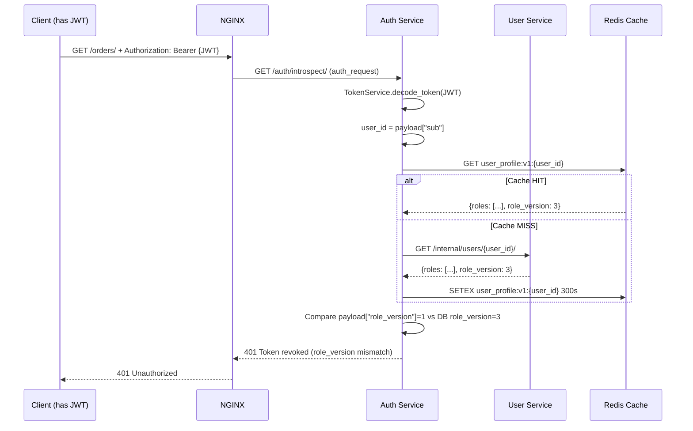

*Hình 2.6: Token revocation qua role_version — không cần blacklist database*

**Khi nào role_version tăng?** Django Signal `on_user_roles_changed` trong User Service tự động tăng `role_version` khi:
- User roles thay đổi (thêm/xóa/clear)
- User status thay đổi (ACTIVE → SUSPENDED)

#### Business Logic — Introspect và NGINX

`IntrospectTokenView` tại `/auth/introspect/` là endpoint đặc biệt được NGINX gọi bằng `auth_request` directive. Endpoint này:

1. Validate JWT signature
2. Kiểm tra Redis cache cho profile (TTL 300s)
3. Nếu cache miss → gọi User Service
4. Kiểm tra `status` (từ chối SUSPENDED/BANNED)
5. So sánh `role_version`
6. Trả về HTTP 204 kèm headers: `X-User-Id`, `X-Username`, `X-Roles`, `X-User-Status`, `X-Role-Version`

```python
# auth-service/authentication/views.py
class IntrospectTokenView(APIView):
    permission_classes = [HasValidJWT]

    def get(self, request):
        token = TokenService.extract_token(request)
        payload = TokenService.decode_token(token)
        user_id = payload.get("sub", "")

        # Redis cache để tránh gọi user-service mỗi request
        redis_url = os.environ.get("REDIS_URL", "redis://redis:6379/0")
        r = redis.StrictRedis.from_url(redis_url, decode_responses=True)

        cache_key = f"user_profile:v1:{user_id}"
        cached_data = r.get(cache_key)
        if cached_data:
            profile = json.loads(cached_data)
        else:
            # Cache miss — Fail Closed: nếu user-service down → từ chối
            profile = _auth_service._fetch_profile(
                type('obj', (object,), {'id': user_id})
            )
            if profile:
                r.setex(cache_key, 300, json.dumps(profile))

        if not profile:
            raise AuthenticationFailed("User profile not found")

        current_status = profile.get("status", "ACTIVE")
        current_role_version = profile.get("role_version", 1)

        if current_status in ("SUSPENDED", "BANNED"):
            raise AuthenticationFailed(f"Account is {current_status}")

        if str(payload.get("role_version", 1)) != str(current_role_version):
            raise AuthenticationFailed("Token revoked due to role changes")

        # Trả về 204 + headers — NGINX sẽ forward headers này vào request gốc
        response = Response(status=status.HTTP_204_NO_CONTENT)
        response["X-User-Id"]     = str(user_id)
        response["X-Username"]    = str(payload.get("username", ""))
        roles = payload.get("roles", ["CUSTOMER"])
        response["X-Roles"]       = ",".join(roles) if isinstance(roles, list) else str(roles)
        response["X-User-Status"] = str(current_status)
        response["X-Role-Version"] = str(current_role_version)
        return response
```

#### Security

Auth Service triển khai **2 lớp bảo vệ** độc lập chống brute-force:

**Lớp 1 — IP Rate Limiting (Redis-backed):**
```python
# auth-service/authentication/views.py
def _rate_limit_login(ip_address: str) -> bool:
    """5 requests / 60 giây per IP — dùng Django cache (Redis)"""
    key = f"auth-login:{ip_address}"
    try:
        count = cache.incr(key)
    except ValueError:
        # Key chưa tồn tại — tạo mới với TTL
        cache.set(key, 1, timeout=settings.AUTH_LOGIN_RATE_WINDOW)  # 60s
        count = 1
    return count > settings.AUTH_LOGIN_RATE_LIMIT  # 5
```

Cấu hình trong settings: `AUTH_LOGIN_RATE_LIMIT=5`, `AUTH_LOGIN_RATE_WINDOW=60`. Vượt ngưỡng → HTTP 429 + ghi `AuthAudit` với `failure_reason="rate_limited"`.

**Lớp 2 — Account Lockout (Database):**
```python
# auth-service/authentication/services.py
def _register_failed_login(self, user, request_ip, user_agent, reason, role):
    if hasattr(user, 'failed_login_count'):
        user.failed_login_count += 1
        if user.failed_login_count >= settings.AUTH_MAX_FAILED_LOGINS:  # 5
            user.locked_until = timezone.now() + timedelta(
                minutes=settings.AUTH_LOCK_MINUTES  # 15 phút
            )
        user.save(update_fields=["failed_login_count", "locked_until"])
    self._audit("login", False, user, role, str(user.id),
                request_ip, user_agent, failure_reason=reason)
```

Cấu hình: `AUTH_MAX_FAILED_LOGINS=5`, `AUTH_LOCK_MINUTES=15`. Sau 5 lần sai → tài khoản bị lock 15 phút. Đăng nhập thành công → reset `failed_login_count=0`, `locked_until=None`.

#### Business Logic — UpstreamClient

Auth Service sử dụng `UpstreamClient` riêng biệt (khác với `InternalClient` của common) với thư viện `tenacity` cho retry policy:

```python
# auth-service/authentication/services.py
class CircuitBreaker:
    """In-memory Circuit Breaker riêng cho Auth Service"""
    def __init__(self, failure_threshold: int, recovery_timeout: int):
        self.failure_threshold = failure_threshold  # 5 (từ AUTH_CIRCUIT_FAIL_THRESHOLD)
        self.recovery_timeout = recovery_timeout    # 30s (từ AUTH_CIRCUIT_RESET_SECONDS)
        self.failure_count = 0
        self.opened_at = None

    def allow(self) -> bool:
        if self.opened_at is None:
            return True   # CLOSED
        if time.time() - self.opened_at >= self.recovery_timeout:
            self.opened_at = None
            self.failure_count = 0
            return True   # HALF_OPEN: 1 request thử
        return False      # OPEN: từ chối

    def record_success(self):
        self.failure_count = 0
        self.opened_at = None   # → CLOSED

    def record_failure(self):
        self.failure_count += 1
        if self.failure_count >= self.failure_threshold:
            self.opened_at = time.time()   # → OPEN

class UpstreamClient:
    def __init__(self, base_url: str, name: str):
        self.base_url = base_url.rstrip("/")
        self.name = name
        self.breaker = CircuitBreaker(
            settings.AUTH_CIRCUIT_FAIL_THRESHOLD,   # 5
            settings.AUTH_CIRCUIT_RESET_SECONDS,    # 30
        )
        self.client = httpx.Client(timeout=settings.AUTH_SERVICE_TIMEOUT)  # 2s default, 5s trong compose

    @retry(
        wait=wait_exponential(multiplier=0.2, min=0.2, max=2),  # 0.2→0.4→...→2s
        stop=stop_after_attempt(settings.AUTH_RETRY_ATTEMPTS),   # 2 lần
        retry=retry_if_exception(
            lambda exc: isinstance(exc, UpstreamServiceError) and exc.retryable
        ),
        reraise=True,
    )
    def post(self, path: str, payload: dict, request_id: str | None = None) -> dict:
        if not self.breaker.allow():
            raise CircuitBreakerOpen(f"{self.name} circuit breaker is open")

        body = json.dumps(payload, separators=(",", ":"), sort_keys=True)
        try:
            response = self.client.post(
                f"{self.base_url}{path}",
                content=body,
                headers=self._signed_headers(body, request_id),
            )
        except httpx.RequestError as exc:
            self.breaker.record_failure()
            raise UpstreamServiceError(..., retryable=True) from exc

        if response.status_code >= 400:
            error = self._error_from_response(response)
            if error.retryable:     # status >= 500
                self.breaker.record_failure()
            else:
                self.breaker.record_success()
            raise error

        self.breaker.record_success()
        return self._safe_json(response)
```

**Sự khác biệt giữa `UpstreamClient` (auth-service) và `InternalClient` (common):**

| Đặc điểm | `UpstreamClient` | `InternalClient` |
|---|---|---|
| Circuit Breaker storage | In-memory (per process) | Redis (shared cross-process) |
| Retry library | `tenacity` | Manual exponential backoff |
| Fail threshold | 5 | 3 |
| Reset timeout | 30s | 15s |
| Return type | `dict` (JSON parsed) | `httpx.Response` |

#### Business Logic — Serializer và Validation

```python
# auth-service/authentication/serializers.py
class RegisterSerializer(serializers.Serializer):
    username = serializers.CharField(max_length=150)
    email    = serializers.EmailField()
    password = serializers.CharField(write_only=True)
    phone    = serializers.CharField(required=False, allow_blank=True)
    role     = serializers.CharField(required=False, allow_blank=True)
    # Staff-specific fields (optional)
    storage_code = serializers.CharField(required=False, allow_blank=True)
    department   = serializers.CharField(required=False, allow_blank=True)
    position     = serializers.CharField(required=False, allow_blank=True)

    def validate(self, attrs):
        role = normalize_role(attrs.get("role") or "CUSTOMER")
        # Public API chỉ cho phép tạo CUSTOMER hoặc SELLER
        if role not in ("CUSTOMER", "SELLER"):
            raise serializers.ValidationError(
                {"role": "public registration only creates CUSTOMER or SELLER accounts"}
            )
        attrs["role"] = role
        return attrs

    def validate_password(self, value):
        # Tối thiểu 8 ký tự
        validate_password_strength(value)
        return value

class LoginSerializer(serializers.Serializer):
    username = serializers.CharField(required=False, allow_blank=True)
    email    = serializers.EmailField(required=False, allow_blank=True)
    password = serializers.CharField()
    role     = serializers.CharField(required=False, allow_blank=True)

    def validate(self, attrs):
        identifier = (attrs.get("username") or attrs.get("email") or "").strip()
        if not identifier:
            raise serializers.ValidationError("username or email is required")
        attrs["identifier"] = identifier
        # role là optional — nếu có, validate và normalize
        if attrs.get("role"):
            attrs["role"] = normalize_role(attrs["role"])
        return attrs
```

**`normalize_role()` trong validators.py:**
```python
def normalize_role(role: str) -> str:
    value = (role or "").strip().upper()
    if value == "MANAGER":
        return "ADMIN"    # Legacy mapping
    if value not in ("CUSTOMER", "SELLER", "STAFF", "ADMIN", "SUPER_ADMIN"):
        raise ValueError("role must be CUSTOMER, SELLER, STAFF, ADMIN, or SUPER_ADMIN")
    return value
```

#### API

```
POST /auth/register/     — đăng ký tài khoản mới (CUSTOMER | SELLER)
POST /auth/login/        — đăng nhập, nhận JWT pair
POST /auth/refresh/      — refresh access token
GET  /auth/introspect/   — validate token (NGINX auth_request endpoint)
GET  /users/me/          — lấy payload của token hiện tại
GET  /health/live/       — liveness probe
GET  /health/ready/      — readiness probe (check DB connection)
```

#### Database Interaction — Bootstrap và seed

Command `bootstrap_default_users` chạy trong `entrypoint.sh` khi container khởi động, tạo sẵn 7 tài khoản mẫu (idempotent — chạy nhiều lần không tạo trùng):

| Username | Role | Password |
|---|---|---|
| admin | ADMIN | Admin@12345 |
| customer1, 2, 3 | CUSTOMER | password123 |
| staff1, staff2 | STAFF | password123 |
| manager1 | STAFF (position: Quản lý) | password123 |

Command có cơ chế `_wait_for_user_service()` — polling tối đa 60 lần × 2 giây = 120 giây. Nếu user-service trả về HTTP 404 (user không tồn tại), tức là service đang sẵn sàng.

### 2.3.2 User Service

#### Tổng quan

User Service quản lý **profile người dùng**, **RBAC** (Role-Permission), **địa chỉ giao hàng** và đồng bộ `role_version` với auth-service. Database: `user_db`. Không lưu password — credential thuộc auth-service.

#### Nhiệm vụ

- Tạo/cập nhật/xóa `UserProfile` theo role (Customer, Seller, Staff…).
- Quản lý `WebAddress` cho customer.
- Seed roles/permissions hệ thống (`seed_rbac`).
- Internal API phục vụ auth-service, order-service, api-gateway.

#### API

| Method | Endpoint | Mô tả |
|--------|----------|-------|
| GET | `/users/me/` | Profile công khai (qua NGINX auth) |
| GET/POST/DELETE | `/internal/users/<uuid>/` | CRUD profile nội bộ |
| GET/POST | `/internal/users/<uuid>/addresses/` | Danh sách / tạo địa chỉ |
| PUT/DELETE | `/internal/users/<uuid>/addresses/<id>/` | Sửa / xóa địa chỉ |
| GET | `/internal/customers/` | Danh sách customer (staff) |

User Service là kho lưu trữ trung tâm của mọi thông tin hồ sơ người dùng. Service này **hoàn toàn không có public API** — tất cả endpoints đều yêu cầu header HMAC nội bộ (`@require_internal`). Điều này đảm bảo không có request nào từ bên ngoài có thể truy cập dữ liệu người dùng trực tiếp.

#### Data Model: RBAC đầy đủ với Role-Permission Matrix

User Service thiết kế RBAC (Role-Based Access Control) theo chuẩn enterprise với các model:

```python
# user-service/user/models.py

class Permission(models.Model):
    """Quyền hạn nguyên tử — ví dụ: view_orders, manage_inventory"""
    code = models.CharField(max_length=100, unique=True)
    description = models.TextField(blank=True)

    class Meta:
        db_table = "permissions"

class Role(models.Model):
    """Role có thể gán nhiều Permission"""
    name = models.CharField(max_length=50, unique=True)  # CUSTOMER, STAFF, ADMIN...
    description = models.TextField(blank=True)
    is_system = models.BooleanField(default=True)
    permissions = models.ManyToManyField(
        Permission, related_name="roles", db_table="role_permissions"
    )

    class Meta:
        db_table = "roles"

class UserProfile(SoftDeleteModel):
    """Profile chính — auth_user_id là UUID từ auth-service, dùng làm PK"""
    auth_user_id = models.UUIDField(primary_key=True)   # Liên kết với AuthUser
    roles = models.ManyToManyField(Role, related_name="users", db_table="user_roles")
    status = models.CharField(
        max_length=20, choices=UserStatus.choices, default=UserStatus.ACTIVE
    )  # ACTIVE | SUSPENDED | BANNED | PENDING
    role_version = models.IntegerField(default=1)    # Tăng khi roles/status thay đổi

    full_name  = models.CharField(max_length=255)
    phone      = models.CharField(max_length=20, blank=True)
    avatar_url = models.URLField(blank=True)
    gender     = models.CharField(max_length=10, blank=True)
    birthday   = models.DateField(null=True, blank=True)
    created_at = models.DateTimeField(auto_now_add=True)
    updated_at = models.DateTimeField(auto_now=True)

    class Meta:
        db_table = "user_profiles"

class CustomerProfile(models.Model):
    """Profile bổ sung cho khách hàng"""
    user_profile = models.OneToOneField(
        UserProfile, on_delete=models.CASCADE, related_name="customer_profile"
    )
    loyalty_points = models.IntegerField(default=0)   # Điểm tích lũy

    class Meta:
        db_table = "customer_profiles"

class SellerProfile(SoftDeleteModel):
    """Profile bổ sung cho người bán"""
    user_profile = models.OneToOneField(
        UserProfile, on_delete=models.CASCADE, related_name="seller_profile"
    )
    store_name   = models.CharField(max_length=255)
    store_slug   = models.SlugField(max_length=255, unique=True)
    description  = models.TextField(blank=True)
    verification_status = models.CharField(
        max_length=20, choices=VerificationStatus.choices,
        default=VerificationStatus.PENDING
    )  # PENDING | APPROVED | REJECTED | SUSPENDED
    approved_by  = models.UUIDField(null=True, blank=True)
    approved_at  = models.DateTimeField(null=True, blank=True)
    created_at   = models.DateTimeField(auto_now_add=True)

    class Meta:
        db_table = "seller_profiles"

class StaffProfile(models.Model):
    """Profile bổ sung cho nhân viên"""
    user_profile = models.OneToOneField(
        UserProfile, on_delete=models.CASCADE, related_name="staff_profile"
    )
    storage_code = models.CharField(max_length=50, blank=True)  # Mã kho: WH-01, WH-02
    department   = models.CharField(max_length=255, blank=True)
    position     = models.CharField(max_length=255, blank=True)  # Nhân viên kho, Quản lý

    class Meta:
        db_table = "staff_profiles"

class WebAddress(models.Model):
    """Địa chỉ giao hàng của CustomerProfile"""
    customer       = models.ForeignKey(CustomerProfile, on_delete=models.CASCADE,
                                       related_name="addresses")
    recipient_name = models.CharField(max_length=255)
    address_line   = models.CharField(max_length=500)
    city           = models.CharField(max_length=100)
    state          = models.CharField(max_length=100, blank=True)
    country        = models.CharField(max_length=100)
    postal_code    = models.CharField(max_length=20)
    phone          = models.CharField(max_length=20, blank=True)
    is_default     = models.BooleanField(default=False)

    class Meta:
        db_table = "web_addresses"

class AuditLog(models.Model):
    """Audit log cho mọi thay đổi quan trọng trong user-service"""
    actor_id      = models.UUIDField(null=True, blank=True)
    action        = models.CharField(max_length=255)
    resource_type = models.CharField(max_length=100)
    resource_id   = models.CharField(max_length=255, blank=True)
    old_value     = models.TextField(blank=True)
    new_value     = models.TextField(blank=True)
    ip_address    = models.CharField(max_length=45, blank=True)
    created_at    = models.DateTimeField(auto_now_add=True)

    class Meta:
        db_table = "audit_logs"
        indexes = [
            models.Index(fields=["actor_id"]),
            models.Index(fields=["created_at"]),
            models.Index(fields=["resource_type"]),
            models.Index(fields=["action"]),
        ]
```

**Soft Delete Pattern:** `SoftDeleteModel` (base của `UserProfile`, `SellerProfile`) override `delete()` để set `deleted_at = timezone.now()` thay vì xóa vật lý. `SoftDeleteManager` tự động filter `deleted_at__isnull=True`. Phương thức `restore()` cho phép phục hồi. `all_objects = models.Manager()` để admin có thể xem cả records đã xóa.

#### RBAC Seeding và Permission Matrix

Command `seed_rbac` (`user/management/commands/seed_rbac.py`) định nghĩa 6 permissions cơ bản và gán vào các roles:

```python
# Permissions
perms = [
    ("view_users",       "Can view users"),
    ("manage_users",     "Can manage users"),
    ("view_orders",      "Can view orders"),
    ("manage_orders",    "Can manage orders"),
    ("manage_inventory", "Can manage inventory"),
    ("manage_catalog",   "Can manage product catalog"),
]

# Role-Permission Mapping
role_mappings = {
    "ADMIN":    ["view_users", "manage_users", "view_orders",
                 "manage_orders", "manage_inventory", "manage_catalog"],
    "STAFF":    ["view_orders", "manage_orders",
                 "manage_inventory", "manage_catalog"],
    "SUPPORT":  ["view_users", "view_orders"],
    "SELLER":   [],    # Handled via SellerProfile specialized checks
    "CUSTOMER": [],
}
```

`SUPER_ADMIN` có quyền bypass mọi permission check — được xử lý trong `HasPermission.has_permission()`.

#### Permission Cache với Django Signals

User permissions được cache trong Redis (`user_permissions:v1:{user_id}`, TTL 300s). Cache được invalidate tự động:

```python
# user-service/user/signals.py
def _invalidate_and_increment(user_id):
    """Atomic: increment role_version + invalidate 2 cache keys"""
    UserProfile.objects.filter(pk=user_id).update(
        role_version=models.F('role_version') + 1  # Atomic SQL UPDATE
    )
    cache.delete(f"user_permissions:v1:{user_id}")
    cache.delete(f"user_profile:v1:{user_id}")
    logger.info(f"Invalidated RBAC cache for user {user_id}")

@receiver(m2m_changed, sender=UserProfile.roles.through)
def on_user_roles_changed(sender, instance, action, **kwargs):
    """Trigger khi roles thay đổi (add/remove/clear)"""
    if action in ['post_add', 'post_remove', 'post_clear']:
        _invalidate_and_increment(instance.auth_user_id)

@receiver(post_save, sender=UserProfile)
def on_user_profile_saved(sender, instance, created, update_fields, **kwargs):
    """Trigger khi status thay đổi hoặc user mới tạo"""
    if update_fields and 'status' in update_fields:
        _invalidate_and_increment(instance.auth_user_id)
        return
    if created:
        _invalidate_and_increment(instance.auth_user_id)
```

`models.F('role_version') + 1` tạo câu SQL `UPDATE user_profiles SET role_version = role_version + 1 WHERE auth_user_id = ?` — atomic, không bị race condition.

#### Internal API Endpoints

```python
# user-service/user/urls.py
urlpatterns = [
    # Internal APIs (require @require_internal)
    path("internal/users/",                                    UserProfileView.as_view()),
    path("internal/users/<uuid:user_id>/",                     UserProfileView.as_view()),
    path("internal/users/<uuid:user_id>/addresses/",           AddressListView.as_view()),
    path("internal/users/<uuid:user_id>/addresses/<int:address_id>/", AddressDetailView.as_view()),
    path("internal/customers/",                                CustomerListView.as_view()),
    path("internal/customers/<int:customer_id>/",              CustomerDetailView.as_view()),

    # Public API (require @require_auth — JWT header)
    path("users/me/",     PublicUserProfileView.as_view()),   # Customer xem profile của mình
    path("api/users/me/", UserProfileView.as_view()),         # Legacy endpoint
]
```

**Logic POST /internal/users/ (tạo profile khi đăng ký):**

```python
# user-service/user/views.py — UserProfileView.post()
def post(self, request, user_id=None):
    data = request.data
    user = UserProfile.objects.create(
        auth_user_id=data["auth_user_id"],   # UUID từ auth-service
        full_name=data.get("full_name", ""),
        phone=data.get("phone", ""),
        status=UserStatus.ACTIVE
    )

    role_names = [r.upper() for r in data.get("roles", ["CUSTOMER"])]
    for r_name in role_names:
        role, _ = Role.objects.get_or_create(name=r_name)
        user.roles.add(role)   # → trigger on_user_roles_changed signal

    entity_id = None
    if "CUSTOMER" in role_names:
        p = CustomerProfile.objects.create(user_profile=user)
        entity_id = p.id    # entity_id là CustomerProfile.id (integer)

    if "SELLER" in role_names:
        p = SellerProfile.objects.create(
            user_profile=user,
            store_name=data.get("store_name", f"Store {user.auth_user_id}"),
            store_slug=data.get("store_slug", f"store-{user.auth_user_id}")
        )
        if not entity_id: entity_id = p.id

    if "STAFF" in role_names or "ADMIN" in role_names:
        p = StaffProfile.objects.create(
            user_profile=user,
            storage_code=data.get("storage_code", ""),
            department=data.get("department", ""),
            position=data.get("position", "")
        )
        if not entity_id: entity_id = p.id

    return Response({
        "id": user.auth_user_id,
        "auth_user_id": user.auth_user_id,
        "roles": role_names,
        "entity_id": entity_id   # Auth-service dùng để set JWT claims
    }, status=201)
```

`entity_id` được trả về trong response → Auth Service nhúng vào JWT claims. Tất cả downstream services dùng `entity_id` từ JWT header `X-Entity-Id` để nhận dạng customer/staff mà không cần biết UUID của `auth_user_id`.

#### Address Management API

User Service quản lý địa chỉ giao hàng của khách hàng qua `AddressListView` và `AddressDetailView`. Logic đặc biệt: chỉ có một địa chỉ `is_default=True` tại một thời điểm:

```python
# user-service/user/views.py — AddressListView.post()
def post(self, request, user_id):
    # Nếu chưa có address nào → tự động set is_default=True
    if not WebAddress.objects.filter(customer=profile).exists():
        is_default = True

    if is_default:
        # Reset tất cả address cũ về is_default=False
        WebAddress.objects.filter(customer=profile).update(is_default=False)

    addr = WebAddress.objects.create(
        customer=profile,
        recipient_name=data["recipient_name"],
        address_line=data["address_line"],
        city=data["city"],
        ...
        is_default=is_default
    )
    return Response({"id": addr.id}, status=201)
```


### 2.3.3 Product Service

#### Tổng quan

Product Service là service chịu tải đọc lớn nhất (Read-Heavy) trong toàn hệ thống. Đây là điểm nóng duy nhất mà 1000 user đồng thời duyệt sản phẩm, lọc theo danh mục, brand, khoảng giá, và Flash Sale. Ngoài chức năng catalog cơ bản, service còn tích hợp Flash Sale từ Promotion Service, quản lý tồn kho với đầy đủ audit log, và thực hiện khóa tồn kho chống overselling bằng Pessimistic Lock + Deadlock prevention.

#### Sơ đồ Luồng Cache và Reserve Stock

```mermaid
flowchart TD
    subgraph READ["📖 Read Path — GET /products/"]
        R1([Request: page, category_id, brand_id,<br/>min_price, max_price, sort_by, flash_sale]) --> R2[GET product_list_version từ Redis]
        R2 --> R3["Build cache_key:<br/>product:list:v{ver}:{page}:{size}:{kw}:{cat}:{brand}:{min}:{max}:{sort}"]
        R3 --> R4{Redis GET cache_key}
        R4 -->|HIT ~1ms| R5([Return cached JSON])
        R4 -->|MISS| R6{flash_sale param?}
        R6 -->|true/1/yes| R7[list_flash_sale:<br/>is_flash_sale=True<br/>flash_sale_ends_at > now()]
        R6 -->|default| R8[list: select_related category brand<br/>prefetch_related variants]
        R7 --> R9[Apply filters: category, brand, price range]
        R8 --> R9
        R9 --> R10[Apply sort: price_asc / price_desc / newest / id]
        R10 --> R11[ProductSerializer incl. effective_price,<br/>variants, brand, category]
        R11 --> R12[keyword search post-serialize]
        R12 --> R13[Paginate: total, page, total_pages, results]
        R13 --> R14[Redis SET cache_key TTL=180s]
        R14 --> R15([Return paginated response])
    end

    subgraph DETAIL["📖 Detail Path — GET /products/{pk}/"]
        D1([Request pk]) --> D2{Redis GET product:{pk}}
        D2 -->|HIT 600s TTL| D3([Return ~1ms])
        D2 -->|MISS| D4[DB query + refresh_flash_sale_state]
        D4 --> D5[Redis SET product:{pk} TTL=600s]
        D5 --> D6([Return detail])
    end

    subgraph WRITE["✏️ Write Path — reserve / release stock"]
        W1([reserve_stock: order_id, items]) --> W2[Sort items by product_id ASC<br/>🔑 Deadlock prevention]
        W2 --> W3[SELECT FOR UPDATE WHERE id IN product_ids<br/>🔒 Row-level lock]
        W3 --> W4{Validate ALL items:<br/>exists? stock >= qty?}
        W4 -->|FAIL| W5[ROLLBACK → 400 error]
        W4 -->|PASS| W6[UPDATE product.stock -= qty<br/>update_fields=['stock']]
        W6 --> W7[INSERT StockReservationLog status=RESERVED]
        W7 --> W8[INSERT InventoryTransaction type=ORDER]
        W8 --> W9[invalidate_product_cache:<br/>DEL product:{id}<br/>INCR product_list_version]
        W9 --> W10([COMMIT → 200 OK])
    end

    style READ fill:#0f3460,color:#e8e8f0
    style DETAIL fill:#1a1a2e,color:#e8e8f0
    style WRITE fill:#2d132c,color:#e8e8f0
    style R5 fill:#00d9a3,color:#000
    style D3 fill:#00d9a3,color:#000
    style W10 fill:#00d9a3,color:#000
    style W5 fill:#ff6b6b,color:#fff
```

*Hình 2.7: Luồng Cache đầy đủ — Read path, Detail path, Write path và invalidation*

#### Data Model: Category → Brand → Product → ProductVariant

```python
# product-service/product/models.py
from django.db import models
from django.utils import timezone

class Category(models.Model):
    name        = models.CharField(max_length=255)
    description = models.TextField(blank=True)

    class Meta:
        db_table = "categories"

class Brand(models.Model):
    name        = models.CharField(max_length=255)
    description = models.TextField(blank=True)

    class Meta:
        db_table = "brands"

class Product(models.Model):
    name        = models.CharField(max_length=255)
    category    = models.ForeignKey(Category, on_delete=models.CASCADE, related_name="products")
    brand       = models.ForeignKey(Brand, on_delete=models.SET_NULL, null=True, blank=True,
                                    related_name="products")
    price       = models.DecimalField(max_digits=12, decimal_places=2)
    currency    = models.CharField(max_length=10, default="VND")
    sku         = models.CharField(max_length=50, unique=True, null=True, blank=True)
    image_url   = models.CharField(max_length=1000, blank=True, default="")
    attributes  = models.JSONField(default=dict)     # JSONB — thuộc tính động per category
    description = models.TextField(blank=True)
    status      = models.CharField(max_length=20, default="active")
    stock       = models.IntegerField(default=0)

    # Flash Sale fields — được sync từ Promotion Service
    is_flash_sale      = models.BooleanField(default=False)
    flash_sale_price   = models.DecimalField(max_digits=12, decimal_places=2, null=True, blank=True)
    flash_sale_name    = models.CharField(max_length=255, blank=True, default="")
    flash_sale_ends_at = models.DateTimeField(null=True, blank=True)
    flash_sale_id      = models.IntegerField(null=True, blank=True)

    created_at  = models.DateTimeField(auto_now_add=True)
    updated_at  = models.DateTimeField(auto_now=True)

    class Meta:
        db_table = "products"

    def refresh_flash_sale_state(self, save=True):
        """Tự động tắt flash sale khi hết hạn — gọi trong get() và serializer."""
        if not self.is_flash_sale:
            return False
        if self.flash_sale_ends_at and self.flash_sale_ends_at <= timezone.now():
            self.is_flash_sale      = False
            self.flash_sale_price   = None
            self.flash_sale_name    = ""
            self.flash_sale_ends_at = None
            self.flash_sale_id      = None
            if save:
                self.save(update_fields=[
                    "is_flash_sale", "flash_sale_price", "flash_sale_name",
                    "flash_sale_ends_at", "flash_sale_id", "updated_at",
                ])
            return True
        return False

    @property
    def effective_price(self):
        """Giá hiệu lực: flash_sale_price khi đang sale hợp lệ, ngược lại price gốc."""
        self.refresh_flash_sale_state(save=True)
        if self.is_flash_sale and self.flash_sale_price is not None:
            return self.flash_sale_price
        return self.price

class ProductVariant(models.Model):
    """Biến thể sản phẩm (màu sắc, kích cỡ, ...)."""
    product        = models.ForeignKey(Product, on_delete=models.CASCADE, related_name="variants")
    color          = models.CharField(max_length=50, blank=True, null=True)
    size           = models.CharField(max_length=50, blank=True, null=True)
    price_modifier = models.DecimalField(max_digits=12, decimal_places=2, default=0)
    stock          = models.IntegerField(default=0)
    sku            = models.CharField(max_length=50, unique=True, null=True, blank=True)

    class Meta:
        db_table = "product_variants"

class StockReservationLog(models.Model):
    """Ghi lại từng lần đặt/trả tồn kho — dùng cho reconciliation."""
    order_id   = models.IntegerField()
    product    = models.ForeignKey(Product, on_delete=models.CASCADE)
    quantity   = models.IntegerField()
    status     = models.CharField(max_length=20, default="RESERVED")
    # RESERVED  → khi order tạo và stock bị trừ
    # RELEASED  → khi order huỷ và stock được hoàn trả
    # COMMITTED → khi payment hoàn tất (reconcile worker đánh dấu)
    created_at = models.DateTimeField(auto_now_add=True)

    class Meta:
        db_table = "stock_reservation_logs"

class InventoryTransaction(models.Model):
    """Audit log đầy đủ mọi thay đổi tồn kho — nguồn sự thật duy nhất."""
    TRANSACTION_TYPES = [
        ('IMPORT', 'Nhập kho'),
        ('EXPORT', 'Xuất kho'),
        ('ORDER',  'Đơn hàng'),    # stock giảm khi reserve
        ('RETURN', 'Hoàn trả'),    # stock tăng khi release
        ('ADJUST', 'Điều chỉnh'), # manual adjustment
    ]
    product          = models.ForeignKey(Product, on_delete=models.CASCADE, null=True)
    variant          = models.ForeignKey(ProductVariant, on_delete=models.CASCADE, null=True)
    transaction_type = models.CharField(max_length=20, choices=TRANSACTION_TYPES)
    quantity_changed = models.IntegerField()  # Âm = giảm, Dương = tăng
    stock_after      = models.IntegerField()  # Snapshot sau thay đổi
    reference_id     = models.CharField(max_length=100, blank=True, null=True)  # order_id
    notes            = models.TextField(blank=True)
    created_at       = models.DateTimeField(auto_now_add=True)

    class Meta:
        db_table     = "inventory_transactions"
        ordering     = ['-created_at']
```

**Phân tích thiết kế JSONB `attributes`:**

Thay vì tạo hàng chục bảng con cho từng loại sản phẩm (bảng `book_attributes`, bảng `electronics_attributes`...), tất cả thuộc tính đặc thù được lưu trong một cột `attributes` kiểu JSONB. PostgreSQL hỗ trợ **GIN Index** trên JSONB, cho phép query `attributes @> '{"author": "Nam Cao"}'` nhanh tương đương cột thông thường. Ví dụ dữ liệu seed thực tế:

```python
# Thiết bị âm thanh
{"brand": "SoundPulse", "color": "Black",
 "features": ["Bluetooth 5.3", "Active Noise Cancelling", "30h battery"]}

# Cà phê thực phẩm
{"brand": "Morning Roast", "weight": "500g",
 "origin": "Đà Lạt", "roast_level": "Medium"}

# Thảm yoga thể thao
{"brand": "FlexMat", "thickness": "8mm",
 "material": "TPE", "features": ["Non-slip", "Lightweight"]}
```

#### ProductSerializer với effective_price

```python
# product-service/product/serializers.py
class ProductSerializer(serializers.ModelSerializer):
    category        = CategorySerializer(read_only=True)
    category_id     = serializers.IntegerField(write_only=True)
    brand           = BrandSerializer(read_only=True)
    brand_id        = serializers.IntegerField(write_only=True, required=False, allow_null=True)
    variants        = ProductVariantSerializer(many=True, read_only=True)
    effective_price = serializers.SerializerMethodField()
    list_price      = serializers.DecimalField(source="price", max_digits=12,
                                                decimal_places=2, read_only=True)

    class Meta:
        model  = Product
        fields = "__all__"

    def get_effective_price(self, obj):
        """Gọi refresh để auto-expire flash sale, rồi trả về giá hiệu lực."""
        obj.refresh_flash_sale_state(save=True)
        return obj.effective_price

class InventoryTransactionSerializer(serializers.ModelSerializer):
    product_name = serializers.CharField(source='product.name', read_only=True)
    variant_name = serializers.CharField(source='variant.__str__', read_only=True)

    class Meta:
        model  = InventoryTransaction
        fields = "__all__"
```

`effective_price` được tính mỗi lần serialize — nếu `flash_sale_ends_at` đã qua, flash sale tự động tắt và trả về `price` gốc mà không cần cron job.

#### Version-based Cache Invalidation

```python
# product-service/product/services.py
redis_client = redis.Redis(
    host=os.environ.get("REDIS_HOST", "redis"),
    port=int(os.environ.get("REDIS_PORT", 6379)),
    db=0, decode_responses=True
)

def invalidate_product_cache(product_id=None):
    """
    Hai thao tác:
    1. Xóa cache chi tiết sản phẩm cụ thể (nếu có product_id)
    2. Tăng product_list_version → tất cả cache danh sách tự động stale
    """
    try:
        if product_id:
            redis_client.delete(f"product:{product_id}")
        redis_client.incr("product_list_version")
    except Exception:
        pass  # Graceful degradation — không để Redis down làm crash service
```

**Tại sao version-based thay vì xóa từng key?** Nếu 50 page × 3 sort × 5 category = 750 cache keys đang tồn tại, xóa từng key cần 750 DEL commands. Với version counter, chỉ cần 1 INCR command — tất cả cache keys cũ đều chứa version cũ nên tự động trở thành stale ở request tiếp theo. Đây là **O(1) invalidation** thay vì O(N).

#### Pessimistic Lock và Deadlock Prevention

```python
# product-service/product/services.py
class ProductService:
    def reserve_stock(self, order_id: int, items: list):
        # BƯỚC 1: Sắp xếp items theo product_id TĂNG DẦN
        # → Tất cả transactions đều lock theo cùng thứ tự → không có chu trình chờ
        items = sorted(items, key=lambda x: x["product_id"])

        with transaction.atomic():
            product_ids = [item["product_id"] for item in items]

            # BƯỚC 2: SELECT ... FOR UPDATE — Row-level lock PostgreSQL
            # Block mọi transaction khác muốn đọc/ghi các rows này
            products    = Product.objects.select_for_update().filter(id__in=product_ids)
            product_map = {p.id: p for p in products}

            # BƯỚC 3: Validate TẤT CẢ items trước khi commit bất kỳ thứ gì
            # Tránh partial commit (trừ sách 1 thành công, sách 2 thất bại)
            for item in items:
                p_id = item["product_id"]
                qty  = item["quantity"]
                if p_id not in product_map:
                    raise ValueError(f"Product {p_id} not found")
                product = product_map[p_id]
                if product.stock < qty:
                    raise ValueError(
                        f"Insufficient stock for product {p_id}. "
                        f"Requested: {qty}, Available: {product.stock}"
                    )

            # BƯỚC 4: Commit và ghi audit log
            for item in items:
                product = product_map[item["product_id"]]
                product.stock -= item["quantity"]
                product.save(update_fields=["stock"])  # Chỉ ghi cột stock → giảm lock duration

                StockReservationLog.objects.create(
                    order_id=order_id, product=product,
                    quantity=item["quantity"], status="RESERVED"
                )
                InventoryTransaction.objects.create(
                    product=product, transaction_type='ORDER',
                    quantity_changed=-item["quantity"],   # Âm = giảm
                    stock_after=product.stock,
                    reference_id=str(order_id),
                    notes="Deducted for order"
                )
                invalidate_product_cache(product.id)

    def release_stock(self, order_id: int, items: list):
        """Hoàn trả tồn kho khi order bị huỷ."""
        items = sorted(items, key=lambda x: x["product_id"])
        with transaction.atomic():
            products    = Product.objects.select_for_update().filter(
                id__in=[i["product_id"] for i in items]
            )
            product_map = {p.id: p for p in products}
            for item in items:
                p_id = item["product_id"]
                if p_id in product_map:
                    product = product_map[p_id]
                    product.stock += item["quantity"]
                    product.save(update_fields=["stock"])
                    StockReservationLog.objects.create(
                        order_id=order_id, product=product,
                        quantity=item["quantity"], status="RELEASED"
                    )
                    InventoryTransaction.objects.create(
                        product=product, transaction_type='RETURN',
                        quantity_changed=item["quantity"],
                        stock_after=product.stock,
                        reference_id=str(order_id),
                        notes="Released stock from cancelled order"
                    )
                    invalidate_product_cache(product.id)
```

**Phân tích Deadlock:**

```
Không sort (nguy hiểm):        Với sort tăng dần (an toàn):
Tx A: LOCK product_id=1        Tx A: LOCK product_id=1 ✓
Tx A: chờ LOCK product_id=5    Tx A: LOCK product_id=5 ✓
Tx B: LOCK product_id=5        Tx B: chờ LOCK product_id=1 (A đang giữ)
Tx B: chờ LOCK product_id=1    → B phải đợi A xong hoàn toàn
→ DEADLOCK (vòng tròn chờ)     → Không có vòng tròn → an toàn
```

#### Flash Sale Sync từ Promotion Service

```python
# product-service/product/services.py
def sync_flash_sales_from_promotion(self):
    """Được gọi bởi promotion-service qua /internal/sync-flash-sales/ (HMAC signed)."""
    client = InternalClient()
    try:
        r = client.get(
            f"{PROMOTION_SERVICE_URL}/api/promotions/flash-sales/",
            params={"active": "true"},
        )
    except Exception as e:
        logger.warning(f"Cannot reach promotion-service: {e}")
        return {"synced": 0, "cleared": 0}

    sales = r.json() if isinstance(r.json(), list) else r.json().get("results", [])
    active_product_ids = set()
    synced = 0

    with transaction.atomic():
        for sale in sales:
            for item in sale.get("items") or []:
                product_id = item.get("product_id")
                sale_price = item.get("discount_price")
                if not product_id or sale_price is None:
                    continue
                product = Product.objects.filter(pk=product_id).first()
                if not product:
                    continue
                # Kiểm tra còn hàng flash sale
                remaining = int(item.get("quantity", 0)) - int(item.get("sold_count", 0))
                if remaining <= 0:
                    continue
                active_product_ids.add(product_id)
                product.is_flash_sale      = True
                product.flash_sale_price   = Decimal(str(sale_price))
                product.flash_sale_name    = sale.get("name", "")
                product.flash_sale_id      = sale.get("id")
                product.flash_sale_ends_at = parse_datetime(str(sale.get("end_date")))
                product.save(update_fields=[
                    "is_flash_sale", "flash_sale_price", "flash_sale_name",
                    "flash_sale_id", "flash_sale_ends_at", "updated_at",
                ])
                invalidate_product_cache(product_id)
                synced += 1

        # Xóa flash sale stale (sản phẩm không còn trong active list)
        cleared = 0
        stale_qs = Product.objects.filter(is_flash_sale=True)
        if active_product_ids:
            stale_qs = stale_qs.exclude(id__in=active_product_ids)
        for product in stale_qs:
            product.is_flash_sale = False
            product.flash_sale_price = product.flash_sale_name = None
            product.flash_sale_ends_at = product.flash_sale_id = None
            product.save(update_fields=[
                "is_flash_sale","flash_sale_price","flash_sale_name",
                "flash_sale_ends_at","flash_sale_id","updated_at",
            ])
            invalidate_product_cache(product.id)
            cleared += 1

    invalidate_product_cache()
    return {"synced": synced, "cleared": cleared}
```

#### URL Endpoints Product Service

```
GET   /products/                     — Danh sách (cache v3, filter, sort, flash_sale)
POST  /products/                     — Tạo sản phẩm mới (require_staff)
GET   /products/{pk}/                — Chi tiết sản phẩm (cache 10 phút)
PUT   /products/{pk}/                — Cập nhật (require_staff)

GET   /categories/                   — Danh sách categories
POST  /categories/                   — Tạo category (require_staff)
GET|PUT /categories/{pk}/

GET   /brands/                       — Danh sách brands
POST  /brands/                       — (require_staff)
GET|PUT /brands/{pk}/

POST  /variants/                     — Tạo variant (require_staff)
GET|PUT|DELETE /variants/{pk}/

GET   /inventory-transactions/       — Xem audit log tồn kho (require_staff)
POST  /inventory-transactions/       — Manual adjustment (require_staff)

POST  /internal/reserve-stock/       — (require_internal) gọi bởi order-service
POST  /internal/release-stock/       — (require_internal) gọi khi order huỷ
POST  /internal/sync-flash-sales/    — (require_internal) gọi bởi promotion-service
```


### 2.3.4 Cart Service

#### Tổng quan

Cart Service được thiết kế theo triết lý **Thin-Service** — chỉ làm đúng 1 việc: quản lý giỏ hàng. Service này không chứa bất kỳ business logic phức tạp nào, không tham chiếu database ngoài qua foreign key vật lý, và không gọi service khác trong luồng chính.

####Sơ đồ Luồng Cart

```mermaid
flowchart TD
    subgraph ADD["➕ Add Item"]
        A1([POST /carts/{customer_id}/items/<br/>product_id, quantity, unit_price]) --> A2[transaction.atomic]
        A2 --> A3[get_or_create Cart WHERE customer_id=X]
        A3 --> A4{CartItem.get_or_create<br/>cart + product_id<br/>UNIQUE constraint}
        A4 -->|Created new| A5[CartItem.quantity = quantity<br/>CartItem.unit_price = snapshot_price]
        A4 -->|Exists| A6[item.quantity += quantity<br/>item.unit_price = new_price<br/>save update_fields=['quantity','unit_price']]
        A5 --> A7([Return CartSerializer 201])
        A6 --> A7
    end

    subgraph CHECKOUT["🛒 Checkout Flow"]
        C1([API Gateway POST /cart/{id}/checkout/]) --> C2[GET /carts/{customer_id}/]
        C2 --> C3{Cart có items?}
        C3 -->|Empty| C4([Redirect → view_cart error])
        C3 -->|Has items| C5[POST /orders/ {customer_id, items, shipping_fee}]
        C5 --> C6{order-service response?}
        C6 -->|200/201| C7[DELETE /carts/{customer_id}/]
        C7 --> C8([Redirect → order_pay page])
        C6 -->|Error| C9([Render checkout.html with error])
    end

    subgraph INTERNAL["🔒 Internal API"]
        I1([Order Service POST /internal/cart/{customer_id}/]) --> I2[require_internal decorator<br/>4-layer HMAC check]
        I2 --> I3[CartService.get_cart]
        I3 --> I4([Return CartSerializer])
        I5([Order Service DELETE /internal/cart/{customer_id}/]) --> I2
        I2 --> I6[CartService.clear_cart]
        I6 --> I7([Return empty cart])
    end

    style ADD fill:#0f3460,color:#e8e8f0
    style CHECKOUT fill:#533483,color:#e8e8f0
    style INTERNAL fill:#2d132c,color:#e8e8f0
```

*Hình 2.8: Luồng Cart — thêm item với idempotency và checkout với SAGA*

####Data Model

```python
# cart-service/cart/models.py
class Cart(models.Model):
    customer_id  = models.IntegerField(unique=True)
    # customer_id = entity_id từ JWT (CustomerProfile.id), không phải auth UUID
    created_date = models.DateTimeField(auto_now_add=True)

    class Meta:
        db_table = "carts"

class CartItem(models.Model):
    cart       = models.ForeignKey(Cart, on_delete=models.CASCADE, related_name="items")
    product_id = models.IntegerField()           # Soft-link → product-service
    variant_id = models.IntegerField(null=True, blank=True)  # Biến thể (màu, size)
    quantity   = models.IntegerField(default=1)
    unit_price = models.DecimalField(max_digits=10, decimal_places=2, default=0)
    # unit_price là SNAPSHOT GIÁ tại thời điểm thêm vào giỏ
    # Không tự động sync khi giá sản phẩm thay đổi

    class Meta:
        db_table     = "cart_items"
        unique_together = ("cart", "product_id")  # Mỗi product_id chỉ 1 dòng per cart
```

**Tại sao `unit_price` là snapshot?** Khi user thêm sản phẩm lúc 10h sáng với giá 100.000 VNĐ, đến 11h sáng giá thay đổi thành 120.000 VNĐ. Giỏ hàng vẫn hiển thị 100.000 VNĐ. Khi checkout, `unit_price` từ CartItem được truyền vào OrderItem — đảm bảo khách hàng trả đúng giá họ thấy lúc thêm vào giỏ.

####CartService với Race Condition Protection

```python
# cart-service/cart/services.py
class CartService:
    def get_cart(self, customer_id: int) -> Cart:
        cart, _ = Cart.objects.get_or_create(customer_id=customer_id)
        return cart

    def add_item(self, customer_id: int, product_id: int,
                 quantity: int, unit_price: float = 0) -> Cart:
        if quantity <= 0:
            raise ValueError("Quantity must be greater than 0")

        with transaction.atomic():
            cart = self.get_cart(customer_id)
            # get_or_create + unique_together đảm bảo idempotency và chống race condition
            item, created = CartItem.objects.get_or_create(
                cart=cart,
                product_id=product_id,
                defaults={"quantity": quantity, "unit_price": unit_price}
            )
            if not created:
                item.quantity  += quantity
                item.unit_price = unit_price  # Cập nhật snapshot giá mới nhất
                item.save(update_fields=["quantity", "unit_price"])
                # update_fields=['quantity','unit_price'] → SQL: UPDATE SET q=X, p=Y WHERE id=Z
                # Tối ưu I/O: không ghi toàn bộ row, giảm lock duration

        return self.get_cart(customer_id)

    def update_item(self, customer_id: int, item_id: int, quantity: int) -> Cart:
        if quantity <= 0:
            raise ValueError("Quantity must be greater than 0")
        with transaction.atomic():
            cart = self.get_cart(customer_id)
            item = CartItem.objects.filter(cart=cart, id=item_id).first()
            if item:
                item.quantity = quantity
                item.save(update_fields=["quantity"])
            else:
                raise ValueError("Item not found in cart")
        return self.get_cart(customer_id)

    def remove_item(self, customer_id: int, item_id: int) -> Cart:
        with transaction.atomic():
            cart = self.get_cart(customer_id)
            CartItem.objects.filter(cart=cart, id=item_id).delete()
        return self.get_cart(customer_id)

    def clear_cart(self, customer_id: int) -> Cart:
        with transaction.atomic():
            cart = self.get_cart(customer_id)
            CartItem.objects.filter(cart=cart).delete()
        return self.get_cart(customer_id)
```

**Race Condition Protection với `get_or_create` + `unique_together`:**
- Nếu 2 requests đồng thời thêm cùng `product_id=5` vào giỏ customer_id=42:
  - Request 1: SELECT → không thấy → INSERT → thành công
  - Request 2: SELECT → không thấy (concurrent) → INSERT → **IntegrityError** từ UNIQUE constraint → Django bắt → fallback sang GET → cộng dồn số lượng
- Kết quả: không bao giờ có 2 dòng cho cùng `(cart, product_id)`.

####Access Control per Customer

```python
# cart-service/cart/views.py
def _can_access_cart(request, customer_id):
    """Staff/Admin xem giỏ của mọi customer. Customer chỉ xem của mình."""
    ctx      = getattr(request, "user_ctx", {})
    role     = ctx.get("role")
    entity_id = ctx.get("entity_id") or ctx.get("user_id")
    return role in ("staff", "manager", "admin") or str(entity_id) == str(customer_id)

class CartItemsView(APIView):
    @require_auth
    def post(self, request, customer_id):
        if not _can_access_cart(request, customer_id):
            return Response({"error": "Forbidden: cannot access this cart"}, status=403)
        product_id = int(request.data["product_id"])
        quantity   = int(request.data.get("quantity", 1))
        unit_price = float(request.data.get("unit_price", 0))
        cart = _cart_svc.add_item(customer_id, product_id, quantity, unit_price)
        return Response(CartSerializer(cart).data, status=201)
```

####URL Endpoints Cart Service

```
# Public (require @require_auth với access control logic)
GET  /cart/                            — Lấy giỏ hàng user hiện tại (legacy)
POST /cart/add/                        — Thêm sản phẩm (recommended endpoint)

GET    /carts/{customer_id}/           — Lấy giỏ theo customer_id
DELETE /carts/{customer_id}/           — Xóa toàn bộ giỏ
GET    /carts/{customer_id}/items/     — Lấy items
POST   /carts/{customer_id}/items/     — Thêm item
PATCH|PUT|DELETE /carts/{customer_id}/items/{item_id}/

# Internal (require @require_internal — HMAC signed)
GET    /internal/cart/{customer_id}/   — Order Service đọc giỏ trước checkout
DELETE /internal/cart/{customer_id}/   — Order Service xóa giỏ sau checkout
```


### 2.3.5 Order Service

Order Service là **Sổ cái Kế toán** của hệ thống — không bao giờ xóa, chỉ ghi thêm. Đây là service phức tạp nhất vì nó phải điều phối cross-service (Product Service để reserve stock, Promotion Service để validate voucher) đồng thời đảm bảo toàn bộ luồng là ACID-compliant. Order Service triển khai **hai kiến trúc song song**: legacy REST API (tương thích với API Gateway hiện tại) và SAGA-based architecture (cho checkout flow với inventory service).

####Sơ đồ State Machine Đơn hàng và SAGA Flow

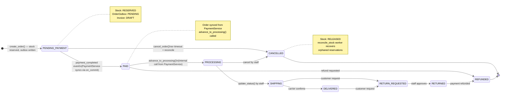

*Hình 2.9: Order State Machine đầy đủ — 9 trạng thái với RETURN và REFUND flow*

```mermaid
sequenceDiagram
    autonumber
    actor C as Customer
    participant GW as API Gateway
    participant OS as Order Service
    participant PS as Product Service
    participant MQ as RabbitMQ
    participant PAY as Payment Service

    C->>GW: POST /cart/{id}/checkout/
    GW->>GW: GET /carts/{id}/ → lấy items
    GW->>OS: POST /orders/ {customer_id, items, unit_price[], shipping_fee}

    rect rgb(20,40,70)
        Note over OS,PS: TRONG CÙNG 1 TRANSACTION (ATOMIC)
        OS->>OS: validate_create_order_payload()
        OS->>OS: _create_order_db() — tạo Order + OrderItems + Invoice
        OS->>OS: Fetch product snapshots nếu thiếu product_name/variant_name
        OS->>OS: Apply voucher / discount code
        OS->>PS: POST /internal/reserve-stock/ {order_id, items} (HMAC signed)
        PS-->>OS: 200 OK — stock reserved
        OS->>OS: INSERT LegacyOrderOutbox(event_type='order_created', PENDING)
        OS->>OS: COMMIT
    end

    OS-->>GW: 201 {id, status: PENDING_PAYMENT, total_amount}
    GW->>GW: DELETE /carts/{id}/ — clear cart
    GW-->>C: Redirect → /orders/{id}/pay/

    Note over OS,MQ: ASYNC — OutboxWorker relay
    OS->>MQ: Publish order_events (order_created payload)

    MQ->>PAY: payment-consumer nhận order_created
    PAY->>PAY: process_payment() — Payment.get_or_create idempotent
    PAY->>PAY: INSERT PaymentOutbox(payment.succeeded, PENDING)
    PAY->>OS: POST /orders/internal/{id}/mark-paid/
    PAY->>OS: POST /orders/internal/{id}/advance-processing/
```

*Hình 2.10: Luồng tạo đơn hàng — từ checkout đến SAGA và async event propagation*

####Data Models — Legacy REST Layer

Order Service dùng `LegacyOrder` prefix để phân biệt với SAGA-based Order model mới. Trong thực tế, bảng database (`orders`, `order_items`) là dùng chung:

```python
# order-service/order/legacy_models.py
class OrderStatus(models.TextChoices):
    PENDING_PAYMENT  = "PENDING_PAYMENT",  "Pending Payment"
    PAID             = "PAID",             "Paid"
    PROCESSING       = "PROCESSING",       "Processing"
    SHIPPING         = "SHIPPING",         "Shipping"
    DELIVERED        = "DELIVERED",        "Delivered"
    CANCELLED        = "CANCELLED",        "Cancelled"
    RETURN_REQUESTED = "RETURN_REQUESTED", "Return Requested"
    RETURNED         = "RETURNED",         "Returned"
    REFUNDED         = "REFUNDED",         "Refunded"

class LegacyOrder(models.Model):
    customer_id = models.IntegerField()
    order_date  = models.DateTimeField(auto_now_add=True)
    status      = models.CharField(max_length=50, choices=OrderStatus.choices,
                                   default=OrderStatus.PENDING_PAYMENT)
    shipping_fee     = models.DecimalField(max_digits=10, decimal_places=2, default=0)
    discount_amount  = models.DecimalField(max_digits=10, decimal_places=2, default=0)
    total_amount     = models.DecimalField(max_digits=12, decimal_places=2, default=0)

    # Snapshot fields — không tham chiếu bảng ngoài
    address_id                = models.IntegerField(null=True, blank=True)
    shipping_address_snapshot = models.JSONField(null=True, blank=True)  # Địa chỉ tại thời điểm đặt
    voucher_code              = models.CharField(max_length=50, blank=True)
    admin_id = models.IntegerField(null=True, blank=True)
    notes    = models.TextField(blank=True)

    class Meta:
        db_table = "orders"
        ordering = ["-order_date"]

class LegacyOrderItem(models.Model):
    order        = models.ForeignKey(LegacyOrder, on_delete=models.CASCADE, related_name="items")
    product_id   = models.IntegerField()          # Soft-link → product-service
    variant_id   = models.IntegerField(null=True, blank=True)
    product_name = models.CharField(max_length=255, blank=True)  # Snapshot tên
    variant_name = models.CharField(max_length=255, blank=True)  # Snapshot tên biến thể
    quantity     = models.IntegerField()
    unit_price   = models.DecimalField(max_digits=10, decimal_places=2)  # Giá CHỐT CỨNG
    discount     = models.DecimalField(max_digits=10, decimal_places=2, default=0)

    class Meta:
        db_table = "order_items"

    @property
    def subtotal(self):
        return (self.unit_price - self.discount) * self.quantity

class LegacyOrderOutbox(AbstractOutboxEvent):
    class Meta:
        db_table = "order_outbox"
        indexes  = [models.Index(fields=["status", "created_at"])]
```

**Điểm đặc biệt:** `LegacyOrderItem` lưu `product_name` và `variant_name` dưới dạng snapshot — nếu sản phẩm sau này đổi tên, hóa đơn cũ vẫn giữ nguyên tên lúc mua. Đây là yêu cầu bắt buộc của kế toán tài chính.

####Data Models — SAGA-based Architecture (v2)

Song song với REST API, Order Service có kiến trúc SAGA mới hỗ trợ long-running transactions:

```python
# order-service/order/models/order.py
class Order(AuditBaseModel):
    """SAGA-based Order — UUID PK, tích hợp với inventory-service và payment-service."""
    id             = models.UUIDField(primary_key=True, default=uuid.uuid4, editable=False)
    user_id        = models.UUIDField()
    correlation_id = models.UUIDField(default=uuid.uuid4)  # Dùng cho SAGA tracing
    status         = models.CharField(max_length=30, choices=ORDER_STATUS, default='DRAFT')
    # ORDER_STATUS: DRAFT → RESERVING_STOCK → STOCK_RESERVED → PAYMENT_PENDING
    #               → PAYMENT_PROCESSING → WAITING_INVENTORY_CONFIRM → COMPLETED
    #               → PAYMENT_FAILED → CANCELLING → CANCELLED → REFUND_PENDING → REFUNDED
    total_amount   = models.DecimalField(max_digits=12, decimal_places=2)
    discount_amount = models.DecimalField(max_digits=12, decimal_places=2, default=0)
    final_amount   = models.DecimalField(max_digits=12, decimal_places=2)
    promotion_id   = models.UUIDField(null=True, blank=True)
    payment_id     = models.UUIDField(null=True, blank=True)
    shipping_address = models.JSONField()

# order-service/order/models/saga.py
class OrderSaga(AuditBaseModel):
    """Tracking state của một SAGA transaction — tương ứng 1-1 với Order."""
    id             = models.UUIDField(primary_key=True, default=uuid.uuid4, editable=False)
    order          = models.OneToOneField(Order, on_delete=models.CASCADE, related_name='saga')
    correlation_id = models.UUIDField()
    current_step   = models.CharField(max_length=50)
    # Các bước: INVENTORY_RESERVE → PAYMENT_CREATE → INVENTORY_CONFIRM
    status         = models.CharField(max_length=20)  # PENDING / SUCCESS / FAILED
    last_error     = models.TextField(null=True, blank=True)
    retry_count    = models.IntegerField(default=0)
    timeout_at     = models.DateTimeField(null=True, blank=True)  # 15 phút timeout
```

**SAGA Manager** (`saga_manager.py`) điều phối các bước SAGA:

```python
# order-service/order/services/saga_manager.py
class OrderSagaManager:
    @staticmethod
    @transaction.atomic
    def start_checkout(user_id, cart_items, shipping_address) -> Order:
        # 1. Lấy giá CHÍNH XÁC từ catalog-service để tránh stale cart prices
        for item in cart_items:
            variant_data = CatalogClient.get_variant(item['variant_id'])
            current_price = Decimal(str(variant_data['price']))
            # Nếu giá thay đổi → PriceChangedError (SAGA abort)
            total_amount += current_price * item['quantity']

        # 2. Tạo Order + OrderItems + OrderSaga + OrderStatusHistory
        order = Order.objects.create(
            user_id=user_id, status='RESERVING_STOCK',
            total_amount=total_amount, final_amount=total_amount,
            shipping_address=shipping_address
        )
        saga = OrderSaga.objects.create(
            order=order, correlation_id=order.correlation_id,
            current_step='INVENTORY_RESERVE', status='PENDING'
        )
        # 3. Publish OutboxEvent để inventory-service reserve stock
        OutboxEvent.objects.create(
            aggregate_id=order.id, aggregate_type='Order',
            event_type='order.checkout.started', message_id=uuid.uuid4(),
            payload={"order_id": str(order.id), "items": inventory_items}
        )
        # 4. Clear cart (tránh double checkout)
        CartService().clear_cart(user_id)
        return order
```

####OrderService — Logic Nghiệp vụ Đầy đủ

```python
# order-service/order/legacy_services.py
class OrderService:
    def __init__(self):
        self.client = InternalClient()

    def create_order(self, data: dict):
        """Tạo đơn hàng với đầy đủ: validate, snapshot, reserve stock, outbox."""
        try:
            validate_create_order_payload(data)  # Schema validation
        except ValidationError as e:
            raise ValueError(str(e.detail))

        items = [{"product_id": i["product_id"], "variant_id": i.get("variant_id"),
                  "quantity": i["quantity"]} for i in data.get("items", [])]

        try:
            with transaction.atomic():
                order = self._create_order_db(data)  # Tạo DB records + apply voucher

                # Gọi Product Service sync để reserve stock
                r = self.client.post(
                    f"{PRODUCT_SERVICE_URL}/internal/reserve-stock/",
                    json={"order_id": order.id, "items": items}
                )
                if r.status_code not in (200, 201):
                    err = r.json().get("error", "Stock reservation failed")
                    raise ValueError(err)  # → ROLLBACK toàn bộ

                # Ghi Outbox — cùng transaction với order
                LegacyOrderOutbox.objects.create(
                    aggregate_id=str(order.id), event_type="order_created",
                    payload={"order_id": order.id, "customer_id": order.customer_id,
                             "total_amount": str(order.total_amount), "items": items}
                )
        except Exception as e:
            raise ValueError(f"Order creation failed: {e}")
        return order

    def _create_order_db(self, data: dict):
        """Tạo Order + OrderItems + Invoice + apply voucher/discount."""
        items_data    = data.pop("items", [])
        promotion_code = (data.pop("promotion_code", None) or "").strip().upper() or None
        discount_code  = data.pop("discount_code", None)
        shipping_address = data.pop("shipping_address", None)
        shipping_method_id = data.pop("shipping_method_id", None)

        # Flash sale items cần consume sau khi đặt
        flash_sale_items = [
            {"product_id": int(i["product_id"]), "quantity": int(i["quantity"])}
            for i in items_data if Decimal(str(i.get("discount", 0))) > 0
        ]

        if shipping_address:
            data["shipping_address_snapshot"] = dict(shipping_address)
        if promotion_code:
            data["voucher_code"] = promotion_code

        order = LegacyOrder.objects.create(status=OrderStatus.PENDING_PAYMENT, **data)

        total = Decimal("0")
        for item in items_data:
            unit_price   = Decimal(str(item.get("unit_price", 0)))
            quantity     = int(item["quantity"])
            discount_val = Decimal(str(item.get("discount", 0)))

            # Lấy snapshot tên sản phẩm nếu không có
            product_name = item.get("product_name") or ""
            variant_name = item.get("variant_name") or ""
            if not product_name:
                snapshot = self._get_product_snapshot(item["product_id"], item.get("variant_id"))
                product_name = snapshot.get("product_name") or f"Sản phẩm #{item['product_id']}"
                variant_name = variant_name or snapshot.get("variant_name") or ""

            LegacyOrderItem.objects.create(
                order=order, product_id=item["product_id"],
                variant_id=item.get("variant_id"),
                product_name=product_name, variant_name=variant_name,
                quantity=quantity, unit_price=unit_price, discount=discount_val
            )
            total += unit_price * quantity

        # Apply voucher (qua Promotion Service) hoặc discount code (local DB)
        discount_amount = Decimal("0")
        if promotion_code:
            discount_amount = self._apply_voucher(promotion_code, total)
        elif discount_code:
            discount = LegacyDiscount.objects.filter(discount_code=discount_code, is_active=True).first()
            if discount:
                discount_amount = (total * discount.discount_value / 100
                                   if discount.is_percentage else discount.discount_value)
                LegacyOrderDiscount.objects.create(order=order, discount_id=discount.id,
                                                    applied_value=discount_amount)

        shipping_fee = Decimal(str(data.get("shipping_fee", 0)))
        order.total_amount    = total - discount_amount + shipping_fee
        order.discount_amount = discount_amount
        order.save(update_fields=["total_amount", "discount_amount"])

        # Consume voucher và flash sale items (best-effort, không fail order)
        if promotion_code:
            self._consume_voucher(promotion_code, order.id)
        if flash_sale_items:
            self._consume_flash_sale_items(flash_sale_items)

        LegacyInvoice.objects.create(order=order, admin_id=order.admin_id)
        return order
```

####State Machine Validation và Bulk Operations

```python
# order-service/order/legacy_services.py — update_status()
VALID_TRANSITIONS = {
    OrderStatus.PENDING_PAYMENT: [OrderStatus.PAID, OrderStatus.CANCELLED],
    OrderStatus.PAID:            [OrderStatus.PROCESSING, OrderStatus.REFUNDED],
    OrderStatus.PROCESSING:      [OrderStatus.SHIPPING, OrderStatus.CANCELLED],
    OrderStatus.SHIPPING:        [OrderStatus.DELIVERED, OrderStatus.RETURN_REQUESTED],
    OrderStatus.DELIVERED:       [OrderStatus.RETURN_REQUESTED],
    OrderStatus.RETURN_REQUESTED:[OrderStatus.RETURNED],
    OrderStatus.RETURNED:        [OrderStatus.REFUNDED],
    OrderStatus.CANCELLED:       [],
    OrderStatus.REFUNDED:        []
}

def update_status(self, order_id, new_status):
    order = self.get_order(order_id)
    if new_status not in VALID_TRANSITIONS.get(order.status, []):
        if order.status != new_status:
            raise ValueError(f"Invalid transition from {order.status} to {new_status}")
    order.status = new_status
    order.save(update_fields=["status"])
    return order
```

`bulk_update_status()` cho phép staff duyệt/hủy nhiều đơn hàng cùng lúc — mỗi đơn được xử lý độc lập, lỗi ở một đơn không ảnh hưởng các đơn khác:

```python
def bulk_update_status(self, order_ids, action=None, new_status=None):
    approve_map = {
        OrderStatus.PENDING_PAYMENT: OrderStatus.PAID,
        OrderStatus.PAID:            OrderStatus.PROCESSING,
        OrderStatus.PROCESSING:      OrderStatus.SHIPPING,
    }
    updated, failed = [], []
    for order_id in order_ids:
        try:
            order  = self.get_order(order_id)
            target = approve_map.get(order.status) if action == "approve" \
                     else (OrderStatus.CANCELLED if action == "cancel" else new_status)
            self.update_status(order_id, target)
            updated.append(order_id)
        except ValueError as e:
            failed.append({"order_id": order_id, "error": str(e)})
    return {"updated": updated, "failed": failed, "total": len(order_ids)}
```

####Internal APIs cho Cross-Service Communication

Order Service cung cấp các endpoints nội bộ quan trọng:

| Endpoint | Caller | Mục đích |
|---|---|---|
| `GET /orders/internal/recommender-orders/` | Recommender AI | Lấy purchase history cho AI scoring |
| `GET /orders/metrics/` | Monitoring | Tổng số đơn, doanh thu theo status |
| `POST /orders/internal/bulk-status/` | reconcile_stock worker | Bulk check order statuses |
| `POST /orders/internal/{id}/mark-paid/` | Payment Service | Đánh dấu đơn PAID sau thanh toán |
| `POST /orders/internal/{id}/advance-processing/` | Payment Service | Chuyển sang PROCESSING |
| `GET /orders/internal/{id}/shipping-context/` | Shipping Service | Lấy thông tin giao hàng |

```python
# order-service/order/legacy_views.py — InternalRecommenderOrdersView
class InternalRecommenderOrdersView(APIView):
    """Cung cấp purchase signals cho recommender-ai-service."""
    @require_internal
    def get(self, request):
        customer_id = request.query_params.get("customer_id")
        qs = Order.objects.filter(
            status__in=(PENDING_PAYMENT, PAID, PROCESSING, SHIPPING, DELIVERED)
        ).prefetch_related("items")
        if customer_id:
            qs = qs.filter(customer_id=int(customer_id))

        orders = []
        by_customer: dict[int, set[int]] = {}
        for order in qs:
            product_ids = [int(item.product_id) for item in order.items.all()]
            orders.append({"customer_id": int(order.customer_id),
                           "items": [{"product_id": pid} for pid in product_ids]})
            by_customer.setdefault(int(order.customer_id), set()).update(product_ids)

        return Response({
            "orders": orders,
            "purchase_signals": [     # Aggregated per-customer cho CF scoring
                {"customer_id": cid, "purchase_ids": sorted(pids)}
                for cid, pids in sorted(by_customer.items())
            ],
        })
```

####URL Endpoints Order Service

```
# REST (Legacy Layer — /orders/...)
GET|POST /orders/                          — Danh sách + tạo đơn hàng
GET|PUT|DELETE /orders/{pk}/               — Chi tiết, cập nhật status, huỷ
POST  /orders/{pk}/return/                 — Request hoàn trả (customer)
POST  /orders/bulk-update/                 — Bulk approve/cancel (staff)

# API v2 (SAGA Layer — /api/v1/orders/...)
POST /api/v1/orders/checkout               — SAGA checkout từ cart
GET  /api/v1/orders/{pk}                   — Chi tiết Order (incl. saga + history)
GET  /api/v1/orders/cart                   — Lấy giỏ hàng
POST /api/v1/orders/cart/add               — Thêm vào giỏ
POST /api/v1/orders/cart/remove            — Xóa khỏi giỏ

# Internal (require_internal HMAC)
GET  /orders/internal/recommender-orders/  — Purchase data cho AI
GET  /orders/metrics/                      — Thống kê đơn hàng
POST /orders/internal/bulk-status/         — Bulk check statuses
POST /orders/internal/{id}/mark-paid/      — Mark PAID (từ payment)
POST /orders/internal/{id}/advance-processing/ — Mark PROCESSING
GET  /orders/internal/{id}/shipping-context/   — Thông tin giao hàng
```


### 2.3.6 Payment Service

Payment Service xử lý toàn bộ vòng đời tài chính của đơn hàng. Điểm đặc biệt là service này cũng triển khai **kiến trúc kép**: legacy REST API (tương thích với API Gateway) và SAGA-based API mới. Trong thực tế, cả hai đều ghi vào cùng bảng `payments` trong PostgreSQL.

####Sơ đồ Luồng Thanh toán và Shipping Resilience

```mermaid
sequenceDiagram
    autonumber
    participant C as Customer
    participant GW as API Gateway
    participant PAY as Payment Service
    participant DB as pay_db
    participant OBX as PaymentOutbox
    participant W as payment-outbox-worker
    participant MQ as RabbitMQ
    participant SHIP as Shipping Service
    participant OS as Order Service

    C->>GW: POST /orders/{id}/pay/ {payment_method_id}
    GW->>PAY: POST /payments/ {order_id, payment_amount, payment_method_id}

    rect rgb(20,40,70)
        Note over PAY,OBX: TRANSACTION ATOMIC
        PAY->>DB: get_or_create Payment(order_id=X) — idempotent
        Note over PAY: Nếu payment_status=completed → return immediately
        PAY->>DB: UPDATE payment_status="completed", transaction_ref=uuid
        PAY->>DB: INSERT Transaction(type="payment", value=amount)
        PAY->>OBX: INSERT PaymentOutbox(event_type="payment.succeeded", PENDING)
        PAY->>DB: COMMIT
        Note over PAY: on_commit callback → _sync_order_paid()
    end

    PAY-->>GW: 201 {payment_status: "completed"}
    GW-->>C: Redirect → /orders/

    PAY->>OS: POST /orders/internal/{id}/mark-paid/ (async on_commit)
    PAY->>OS: POST /orders/internal/{id}/advance-processing/

    loop poll 0.5s
        W->>OBX: SELECT FOR UPDATE WHERE status=PENDING
        W->>MQ: Publish exchange=payment_events, event_type=payment.succeeded
        W->>OBX: UPDATE status=PUBLISHED
    end

    MQ->>SHIP: shipping-consumer nhận payment.succeeded
    alt Shipping OK
        SHIP->>SHIP: create_shipping(order_id) idempotent
        SHIP->>MQ: basic_ack()
        PAY->>DB: UPDATE shipping_status=PROCESSING
    else Shipping FAILED
        SHIP->>MQ: basic_nack → DLQ
        PAY->>DB: UPDATE shipping_status=FAILED
        Note over PAY: payment-worker retries mỗi 60s tối đa 5 lần
    end
```

*Hình 2.11: Luồng thanh toán đầy đủ với Outbox, Order sync và Shipping Resilience*

####Data Models — Legacy Layer

```python
# payment-service/payment/legacy_models.py
class Payment(models.Model):
    order_id         = models.IntegerField(unique=True)  # unique → idempotency key
    payment_date     = models.DateTimeField(auto_now_add=True)
    payment_amount   = models.DecimalField(max_digits=12, decimal_places=2)
    payment_method   = models.ForeignKey(PaymentMethod, null=True, on_delete=models.SET_NULL)
    payment_status   = models.CharField(max_length=20, choices=PaymentStatus.choices,
                                        default=PaymentStatus.PENDING)
    transaction_ref  = models.CharField(max_length=255, blank=True)
    admin_id         = models.IntegerField(null=True, blank=True)

    # Shipping Resilience — theo dõi trạng thái giao hàng sau thanh toán
    shipping_status         = models.CharField(max_length=20, choices=ShippingStatus.choices,
                                               default=ShippingStatus.PENDING)
    shipping_failure_reason = models.TextField(blank=True, null=True)
    shipping_retry_count    = models.IntegerField(default=0)  # Max 5 lần retry

    class Meta:
        db_table = "payments"

class PaymentOutbox(AbstractOutboxEvent):
    """Outbox để relay payment.succeeded event → shipping-service."""
    class Meta:
        db_table = "payment_outbox"

class Refund(models.Model):
    payment          = models.ForeignKey(Payment, on_delete=models.CASCADE, related_name="refunds")
    refund_date      = models.DateTimeField(auto_now_add=True)
    refund_amount    = models.DecimalField(max_digits=12, decimal_places=2)
    refund_reason    = models.TextField(blank=True)
    transaction_type = models.CharField(max_length=50, default="refund")
    admin_id         = models.IntegerField(null=True, blank=True)

    class Meta:
        db_table = "refunds"

class Transaction(models.Model):
    """Audit log mọi giao dịch tài chính."""
    order_id         = models.IntegerField()
    transaction_type = models.CharField(max_length=50)  # "payment" | "refund"
    value            = models.DecimalField(max_digits=12, decimal_places=2)
    status           = models.CharField(max_length=50, default="success")
    created_date     = models.DateTimeField(auto_now_add=True)

    class Meta:
        db_table = "transactions"

class DLQEvent(models.Model):
    """Message thất bại từ RabbitMQ DLQ — lưu để phân tích và replay thủ công."""
    queue_name    = models.CharField(max_length=255)
    exchange      = models.CharField(max_length=255, blank=True)
    routing_key   = models.CharField(max_length=255, blank=True)
    body          = models.JSONField()
    error_message = models.TextField(blank=True)
    received_at   = models.DateTimeField(auto_now_add=True)
    replayed      = models.BooleanField(default=False)

    class Meta:
        db_table = "dlq_events"
```

####PaymentService — Idempotency và Order Sync

```python
# payment-service/payment/legacy_services.py
class PaymentService:
    def process_payment(self, order_id: int, amount: float, method_id: int = None):
        with transaction.atomic():
            # Idempotency: get_or_create với unique order_id
            payment, created = Payment.objects.get_or_create(
                order_id=order_id,
                defaults={"payment_amount": amount, "payment_status": "pending"}
            )

            if payment.payment_status == "completed":
                # Đã thanh toán → trả về kết quả cũ, vẫn sync order
                transaction.on_commit(lambda: self._sync_order_paid(order_id))
                return payment

            method = PaymentMethod.objects.filter(pk=method_id).first() \
                     or PaymentMethod.objects.first()
            payment.payment_method  = method
            payment.payment_amount  = amount
            payment.payment_status  = "completed" if method else "failed"
            payment.transaction_ref = str(uuid.uuid4())[:20]
            payment.save()

            Transaction.objects.create(
                order_id=order_id, transaction_type="payment",
                value=amount, status="success" if method else "failed"
            )

            if payment.payment_status == "completed":
                # Ghi Outbox trong cùng transaction → at-least-once delivery
                PaymentOutbox.objects.create(
                    aggregate_id=str(payment.id),
                    event_type="payment.succeeded",
                    payload={"payment_id": payment.id, "order_id": order_id,
                             "amount": str(amount), "shipping_status": "pending"}
                )
                # Sync Order status via on_commit (sau COMMIT mới gọi)
                transaction.on_commit(lambda oid=order_id: self._sync_order_paid(oid))

        return payment

    def _sync_order_paid(self, order_id: int):
        """Gọi Order Service để cập nhật trạng thái PAID → PROCESSING sau thanh toán."""
        try:
            r = self.client.post(
                f"{ORDER_SERVICE_URL}/orders/internal/{order_id}/mark-paid/", json={}
            )
            if r.status_code in (200, 201):
                self.client.post(
                    f"{ORDER_SERVICE_URL}/orders/internal/{order_id}/advance-processing/",
                    json={}
                )
        except Exception as e:
            logger.warning(f"Failed to sync order {order_id}: {e}")
            # Non-critical — order sẽ được reconcile sau
```

**`transaction.on_commit()`:** callback chỉ chạy SAU KHI database COMMIT thành công. Nếu transaction ROLLBACK (ví dụ: exception xảy ra), callback không bao giờ được gọi — tránh sync Order khi payment thực ra không được lưu.

####Shipping Resilience — Retry Worker

```python
# payment-service/payment/management/commands/retry_failed_shipping.py
class Command(BaseCommand):
    def handle(self, *args, **options):
        client   = InternalClient()
        ship_url = os.environ.get("SHIP_SERVICE_URL", "http://shipping-service:8000")

        # Lấy payments cần retry: shipping FAILED, chưa vượt 5 lần
        payments = Payment.objects.filter(
            shipping_status=ShippingStatus.FAILED,
            shipping_retry_count__lt=5
        ).order_by('shipping_retry_count', 'payment_date')

        for payment in payments:
            # select_for_update để tránh 2 workers retry cùng lúc
            with transaction.atomic():
                p = Payment.objects.select_for_update().get(id=payment.id)
                p.shipping_retry_count += 1
                p.save(update_fields=["shipping_retry_count"])

            try:
                r = client.post(f"{ship_url}/internal/shipping/create/",
                                json={"order_id": payment.order_id})
                if r.status_code in (200, 201):
                    payment.shipping_status = ShippingStatus.PROCESSING
                    payment.shipping_failure_reason = ""
                    payment.save(update_fields=["shipping_status", "shipping_failure_reason"])
                    logger.info(f"metric_shipping_retry_success", extra={"order_id": payment.order_id})
                else:
                    raise Exception(f"HTTP {r.status_code}: {r.text}")
            except Exception as e:
                payment.shipping_failure_reason = str(e)[:500]
                payment.save(update_fields=["shipping_failure_reason"])
```

Docker Compose chạy worker này mỗi 60 giây:
```yaml
payment-worker:
  command:
    - sh
    - -c
    - while true; do python manage.py retry_failed_shipping; sleep 60; done
```

####URL Endpoints Payment Service

```
# REST Public
GET   /payment-methods/              — Danh sách phương thức (require_auth)
POST  /payment-methods/              — Tạo (require_staff)
GET   /payments/                     — Danh sách (require_staff)
POST  /payments/                     — Thanh toán (require_customer — idempotent)
GET   /payments/{pk}/                — Chi tiết (require_auth)
POST  /payments/{payment_id}/refund/ — Hoàn tiền (require_staff)

# Internal (require_internal HMAC)
POST  /internal/payments/                                — Thanh toán internal
POST  /payments/internal/{order_id}/shipping-status/     — Cập nhật shipping status
```


### 2.3.7 Shipping Service

Shipping Service là "người lắng nghe" trong hệ thống — không có public-facing POST API từ phía người dùng. Nó nhận tín hiệu từ Payment Service (qua retry worker hoặc RabbitMQ), tạo vận đơn và theo dõi trạng thái giao hàng. Service này cũng tích hợp tính năng tính phí ship động dựa trên khối lượng và khoảng cách.

####Sơ đồ State Machine và Tính phí Ship

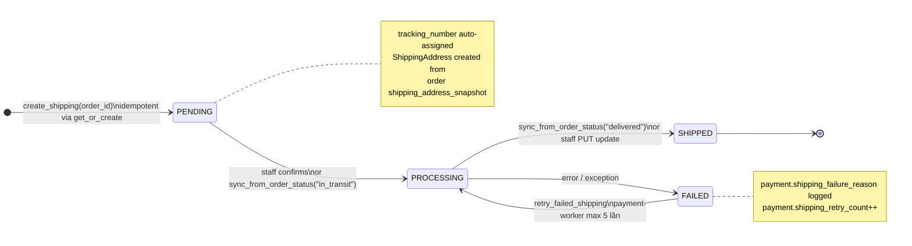

*Hình 2.12: Shipping State Machine với auto-assign tracking number và retry*

```mermaid
flowchart TD
    FEE([POST /internal/shipping/fee-calculator/\nshipping_method_id, total_weight, distance_km]) --> M[Get ShippingMethod]
    M --> CALC[base_rate = method.rate\nweight_fee = max(0, weight - min_weight) × 5000\ndistance_fee = max(0, distance - min_distance) × 1000]
    CALC --> TOTAL[shipping_fee = round(base + weight_fee + distance_fee)]
    TOTAL --> R([Return: method_name, base_rate,\nweight_fee, distance_fee, total_fee])

    ZONE([GET /shipping/zone/?city=Hanoi]) --> ZDB{ShippingZone.filter\ncity_name__iexact}
    ZDB -->|Found| ZR([Return distance_km from DB])
    ZDB -->|Not found| ZD([Return DEFAULT 15.0 km])
```

*Hình 2.13: Luồng tính phí ship động theo khối lượng và khoảng cách*

####Data Models

```python
# shipping-service/shipping/models.py

class ShippingZone(models.Model):
    """Ánh xạ tên thành phố → khoảng cách km để tính phí ship."""
    city_name   = models.CharField(max_length=100, unique=True)
    distance_km = models.FloatField(default=15.0)

    class Meta:
        db_table = "shipping_zones"

class ShippingMethod(models.Model):
    method_name    = models.CharField(max_length=100)
    description    = models.TextField(blank=True)
    estimated_days = models.PositiveSmallIntegerField(default=5)
    min_weight     = models.FloatField(default=0)
    max_weight     = models.FloatField(default=0)
    min_distance   = models.FloatField(default=0)
    max_distance   = models.FloatField(default=0)
    rate           = models.DecimalField(max_digits=10, decimal_places=2, default=0)

    class Meta:
        db_table = "shipping_methods"

class Shipping(models.Model):
    order_id              = models.IntegerField(unique=True)
    tracking_number       = models.CharField(max_length=32, unique=True, blank=True)
    # tracking_number auto-assigned: "SHIP-{id:08d}"
    shipping_method       = models.ForeignKey(ShippingMethod, null=True, on_delete=models.SET_NULL)
    status                = models.CharField(max_length=50, choices=ShippingState.choices,
                                             default=ShippingState.PENDING)
    estimated_delivery_date = models.DateField(null=True, blank=True)
    created_date          = models.DateTimeField(auto_now_add=True)

    class Meta:
        db_table = "shippings"

class ShippingAddress(models.Model):
    """Snapshot địa chỉ từ order — không thay đổi sau khi tạo."""
    shipping       = models.OneToOneField(Shipping, on_delete=models.CASCADE, related_name="address")
    recipient_name = models.CharField(max_length=255)
    address_line   = models.CharField(max_length=500)
    city           = models.CharField(max_length=100)
    state          = models.CharField(max_length=100, blank=True)
    country        = models.CharField(max_length=100)
    postal_code    = models.CharField(max_length=20)
    phone          = models.CharField(max_length=20, blank=True)
    updated_date   = models.DateTimeField(auto_now=True)

    class Meta:
        db_table = "shipping_addresses"

class ShippingStatus(models.Model):
    """Audit log mỗi lần chuyển trạng thái — hiển thị timeline cho khách hàng."""
    shipping     = models.ForeignKey(Shipping, on_delete=models.CASCADE, related_name="statuses")
    status       = models.CharField(max_length=50)  # State Machine status
    description  = models.TextField(blank=True)     # Human-readable description
    updated_date = models.DateTimeField(auto_now_add=True)

    class Meta:
        db_table    = "shipping_statuses"
        ordering    = ["-updated_date"]
```

####ShippingService — Idempotency và Auto-Context

```python
# shipping-service/shipping/services.py
class ShippingService:
    def create_shipping(self, order_id: int, *, shipping_method_id=None, address_data=None):
        """
        Idempotent — gọi nhiều lần (retry) vẫn trả về cùng kết quả.
        Tự động lấy shipping context từ order-service nếu thiếu address_data.
        """
        with transaction.atomic():
            shipping = Shipping.objects.filter(order_id=order_id).first()
            if shipping:
                # Đã tồn tại — chỉ update nếu thiếu method/address
                if shipping_method_id and not shipping.shipping_method_id:
                    method = ShippingMethod.objects.filter(pk=shipping_method_id).first()
                    if method:
                        shipping.shipping_method = method
                        shipping.estimated_delivery_date = date.today() + timedelta(days=method.estimated_days)
                        shipping.save(update_fields=["shipping_method", "estimated_delivery_date"])
                if address_data and not ShippingAddress.objects.filter(shipping=shipping).exists():
                    self._create_address(shipping, address_data)
                self._assign_tracking_number(shipping)
                return shipping

            method = ShippingMethod.objects.filter(pk=shipping_method_id).first() \
                     if shipping_method_id else None
            estimated = (date.today() + timedelta(days=method.estimated_days)) if method else None

            try:
                shipping = Shipping.objects.create(
                    order_id=order_id, status=ShippingState.PENDING,
                    shipping_method=method, estimated_delivery_date=estimated,
                )
            except IntegrityError:
                return Shipping.objects.get(order_id=order_id)  # Race condition safety

            self._assign_tracking_number(shipping)
            self._create_address(shipping, address_data)
            ShippingStatus.objects.create(
                shipping=shipping, status=ShippingState.PENDING,
                description="Đã nhận yêu cầu giao hàng."
            )
        return shipping

    def _assign_tracking_number(self, shipping):
        if not shipping.tracking_number:
            shipping.tracking_number = f"SHIP-{shipping.id:08d}"
            shipping.save(update_fields=["tracking_number"])
```

**Tự động lấy context từ Order Service:** Khi `InternalShippingCreateView` nhận request chỉ có `order_id`, nó gọi `_fetch_shipping_context(order_id)` → `GET /orders/internal/{id}/shipping-context/` để lấy `shipping_method_id` và `shipping_address_snapshot` từ order. Điều này giúp Shipping Service không cần nhận đầy đủ thông tin trong mỗi request.

####Tính phí Ship Động

```python
# shipping-service/shipping/services.py
class ShippingMethodService:
    def calculate_fee(self, method_id, total_weight=1.0, distance_km=10.0):
        """
        Công thức: base + (weight - min_weight) × 5000 + (distance - min_distance) × 1000
        Đơn vị: VNĐ
        """
        method       = self.get(method_id)
        base         = float(method.rate)
        weight       = max(0.0, float(total_weight) - float(method.min_weight or 0))
        distance     = max(0.0, float(distance_km) - float(method.min_distance or 0))
        weight_fee   = weight * 5000
        distance_fee = distance * 1000
        total_fee    = round(base + weight_fee + distance_fee)
        return {
            "shipping_method_id": method.id,
            "method_name":   method.method_name,
            "base_rate":     base,
            "weight_fee":    weight_fee,
            "distance_fee":  distance_fee,
            "shipping_fee":  total_fee,
        }

class ShippingZoneService:
    DEFAULT_DISTANCE_KM = 15.0

    def lookup_distance(self, city: str) -> float:
        """Tra cứu khoảng cách theo tên thành phố (case-insensitive)."""
        zone = ShippingZone.objects.filter(city_name__iexact=city.strip()).first()
        return float(zone.distance_km) if zone else self.DEFAULT_DISTANCE_KM
```

####URL Endpoints Shipping Service

```
# Public (require_auth)
GET   /shipping-methods/                   — Danh sách phương thức ship
GET   /shippings/                          — Danh sách vận đơn (require_staff)
GET   /shippings/{pk}/                     — Chi tiết vận đơn
PUT   /shippings/{pk}/                     — Cập nhật trạng thái (require_staff)
GET   /shippings/order/{order_id}/         — Tra vận đơn theo order_id
POST  /shipping/create/                    — Tạo vận đơn (require_auth)
POST  /shipping/fee-calculator/            — Tính phí ship
GET   /shipping/zone/                      — Tra khoảng cách theo thành phố

# Internal (require_internal)
POST  /internal/shipping/create/           — Tạo vận đơn (từ payment-service retry)
POST  /internal/shipping/status/           — Cập nhật status từ order-service
```


### 2.3.8 Recommender AI Service

Recommender AI Service là module phức tạp và độc đáo nhất, tích hợp 6 tầng scoring song song, hệ thống MLOps với model versioning, và RAG Chatbot sử dụng Groq LLM. Service này sở hữu CSDL riêng `recommender_db` và Neo4j graph DB.

####Sơ đồ Hybrid Recommendation Engine

```mermaid
flowchart TD
    subgraph INPUT["📥 Input"]
        I1[customer_id, limit]
        I2[BehaviorEvent DB query]
        I3[ProductCatalog.get_products cache]
    end

    subgraph COLD["🧊 Cold Start Check"]
        CC{repo.has_behavior_history\ncustomer_id?}
        CC -->|No history| CR[Random shuffle từ active catalog\nexclude purchased products]
        CR --> CO([Return + save_log strategy=random-cold-start])
    end

    subgraph SCORING["🔢 Multi-layer Scoring"]
        S1["1️⃣ Matrix CF (NMF/ALS)\nengine.recommend() → scores = W[u] @ H\nweight = cf_weight × behavior_bias"]
        S2["2️⃣ Co-occurrence\nrepo.get_cooccurrence_scores(seed_products)\nweight = cooccurrence_weight × bias"]
        S3["3️⃣ Co-purchase\n_get_copurchase_scores() from order history\nweight = copurchase_weight"]
        S4["4️⃣ Category Affinity\nrepo.get_category_affinity() + purchase_categories\nweight = category_weight × bias"]
        S5["5️⃣ Global Popularity\nrepo.get_global_popularity_scores()\nweight = global_popularity_weight=1.5"]
        S6["6️⃣ Item CF Popularity\nengine.item_popularity_scores()\nweight = item_cf_popularity_weight=1.0"]
    end

    subgraph MERGE["🔀 Score Merging"]
        M1[score_map[pid] = Σ weighted scores]
        M2[Loại bỏ purchased products]
        M3["Giảm 55% score browsed-but-not-bought\nnếu không trong purchase categories"]
        M4[Sort: -score, -id → Top-K]
    end

    subgraph OUTPUT["📤 Output"]
        O1[recommended_product_ids list]
        O2[recommendation_scores: pid + score]
        O3[next_action_prediction từ BiLSTM]
        O4[strategy string: hybrid+cf+copurchase+...]
        O5[RecommendationLog.save()]
    end

    I1 --> I2 & I3 --> CC
    CC -->|Has history| S1 & S2 & S3 & S4 & S5 & S6
    S1 & S2 & S3 & S4 & S5 & S6 --> M1 --> M2 --> M3 --> M4 --> O1 & O2 & O3 & O4 & O5

    style INPUT fill:#1a1a2e,color:#e8e8f0
    style COLD fill:#2d132c,color:#e8e8f0
    style SCORING fill:#0f3460,color:#e8e8f0
    style MERGE fill:#533483,color:#e8e8f0
    style OUTPUT fill:#16213e,color:#e8e8f0
```

*Hình 2.14: Hybrid Recommendation Engine — 6 tầng scoring với behavior bias từ BiLSTM*

####RecommenderService — 6-Layer Hybrid Scoring

Service thực tế phức tạp hơn nhiều so với phiên bản đơn giản trước đó — có đến 6 tầng scoring độc lập và một số cải tiến quan trọng:

```python
# recommender-ai-service/app/services/recommender_service.py
class RecommenderService:
    def __init__(self):
        self.repo = RecommenderRepository()
        self.behavior_predictor = get_behavior_prediction_service()
        # Configurable weights từ settings
        self.cf_weight          = float(getattr(settings, "IMPLICIT_CF_ALS_WEIGHT", 4.0))
        self.cooccurrence_weight = float(getattr(settings, "COOCCURRENCE_WEIGHT", 3.0))
        self.copurchase_weight  = float(getattr(settings, "COPURCHASE_WEIGHT", 2.5))
        self.category_weight    = float(getattr(settings, "CATEGORY_AFFINITY_WEIGHT", 2.0))

    def recommend(self, customer_id: int, limit: int = 10, prediction: dict | None = None):
        catalog          = ProductCatalog.get_products()  # Cached product metadata
        active_product_ids = set(catalog.keys())

        # Cold start — ngay lập tức trả về random catalog nếu chưa có lịch sử
        if not self.repo.has_behavior_history(customer_id):
            candidates = [pid for pid in active_product_ids if pid not in self._get_customer_products(customer_id)]
            rng = random.Random(customer_id)
            rng.shuffle(candidates)
            return candidates[:limit], "random-cold-start", {}

        purchased      = self._get_customer_products(customer_id) & active_product_ids
        interacted     = self.repo.get_interacted_product_ids(customer_id) & active_product_ids
        exclude        = purchased    # Chỉ loại đã mua, không loại đã xem

        # Category affinity từ purchase history (trọng số cao PURCHASE_CATEGORY_WEIGHT=8.0)
        purchase_categories = {
            int(catalog[pid]["category_id"])
            for pid in purchased
            if catalog.get(pid) and catalog[pid].get("category_id")
        }
        category_affinity = self.repo.get_category_affinity(customer_id, catalog)
        for pid in purchased:
            meta = catalog.get(int(pid))
            if meta and meta.get("category_id") is not None:
                category_affinity[int(meta["category_id"])] = \
                    category_affinity.get(int(meta["category_id"]), 0.0) + PURCHASE_CATEGORY_WEIGHT

        score_map = {}
        strategy_parts = ["hybrid"]

        # 1. Matrix CF
        cf_used = self._blend_matrix_cf(customer_id, score_map, active_product_ids, exclude, cf_limit, behavior_bias)
        if cf_used: strategy_parts.append("cf")

        # 2. Co-occurrence (users với similar behavior)
        cooc = self.repo.get_cooccurrence_scores(customer_id, seed_products, active_product_ids)
        if cooc:
            strategy_parts.append("cooccurrence")
            max_cooc = max(cooc.values()) or 1.0
            for pid, s in cooc.items():
                if pid not in exclude:
                    score_map[pid] = score_map.get(pid, 0.0) + self.cooccurrence_weight * behavior_bias * (s/max_cooc)

        # 3. Co-purchase từ đơn hàng thực tế
        copurchase = self._get_copurchase_scores(customer_id, purchased, active_product_ids)
        if copurchase:
            strategy_parts.append("copurchase")
            for pid, s in copurchase.items():
                if pid not in exclude:
                    score_map[pid] = score_map.get(pid, 0.0) + self.copurchase_weight * float(s)

        # 4. Category affinity — surface sản phẩm chưa thấy trong preferred categories
        if category_affinity:
            strategy_parts.append("category")
            max_aff = max(category_affinity.values()) or 1.0
            for pid, meta in catalog.items():
                cat_id = meta.get("category_id")
                if cat_id and pid not in exclude:
                    aff = category_affinity.get(int(cat_id), 0.0) / max_aff
                    if aff > 0:
                        score_map[pid] = score_map.get(pid, 0.0) + self.category_weight * behavior_bias * aff

        # Giảm điểm browsed-not-bought nếu không trong purchase categories → tăng novelty
        browsed_not_bought = (interacted - purchased) & active_product_ids
        for pid in browsed_not_bought:
            if pid in score_map:
                meta   = catalog.get(pid)
                cat_id = meta.get("category_id") if meta else None
                if cat_id is None or int(cat_id) not in purchase_categories:
                    score_map[pid] *= 0.45   # Giảm 55% để ưu tiên sản phẩm mới

        # 5. Global popularity — baseline
        global_pop = self.repo.get_global_popularity_scores(active_product_ids)
        if any(s > 0 for s in global_pop.values()):
            strategy_parts.append("global-popularity")
            for pid, norm in global_pop.items():
                if pid not in exclude:
                    score_map[pid] = score_map.get(pid, 0.0) + 1.5 * norm

        # 6. Item CF popularity — cold user signal từ item factors
        item_pop = self._get_item_cf_popularity(active_product_ids, exclude)
        if item_pop:
            strategy_parts.append("item-popularity")
            for pid, norm in item_pop.items():
                if pid not in exclude:
                    score_map[pid] = score_map.get(pid, 0.0) + 1.0 * norm

        # Final ranking: primary sort = -score, tiebreak = -pid
        ranked = sorted(
            ((pid, score_map.get(pid, 0.0)) for pid in active_product_ids if pid not in exclude),
            key=lambda x: (-x[1], -x[0])
        )
        recommended = [pid for pid, _ in ranked[:limit]]
        final_scores = {pid: s for pid, s in ranked[:limit]}
        strategy = "+".join(dict.fromkeys(strategy_parts))
        self.repo.save_log(customer_id, recommended, strategy=strategy)
        return recommended, strategy, final_scores
```

**Behavior Bias** — điều chỉnh trọng số dựa trên dự đoán BiLSTM:
```python
@staticmethod
def _behavior_bias(prediction_action, confidence) -> float:
    bias = 1.0
    if prediction_action in {"purchase", "add_to_cart"}:
        bias += min(confidence, 0.9) * 0.25   # Tăng 25% nếu user sắp mua
    elif prediction_action in {"view", "click", "search"}:
        bias -= min(confidence, 0.9) * 0.10   # Giảm 10% nếu user chỉ đang browse
    return max(0.75, bias)
```

####ProductCatalog Cache

```python
# recommender-ai-service/app/services/product_catalog.py
class ProductCatalog:
    _cache: dict[int, dict] | None = None
    _cache_time: float = 0.0
    _TTL = 300.0  # 5 phút

    @classmethod
    def get_products(cls) -> dict[int, dict]:
        now = time.time()
        if cls._cache is not None and (now - cls._cache_time) < cls._TTL:
            return cls._cache

        # Fetch tất cả products từ product-service (pagination)
        catalog = {}
        page = 1
        while True:
            r = requests.get(f"{PRODUCT_SERVICE_URL}/products/",
                             params={"page": page, "page_size": 200}, timeout=5)
            if r.status_code != 200: break
            data = r.json()
            products = data.get("results", data) if isinstance(data, dict) else data
            if not products: break
            for p in products:
                pid = p.get("id")
                if pid is not None:
                    catalog[int(pid)] = {"category_id": p.get("category_id"),
                                         "name": p.get("name", "")}
            if not data.get("next_page"): break
            page = data.get("next_page")

        cls._cache = catalog
        cls._cache_time = now
        return catalog
```

####MLOps API Endpoints

Ngoài recommendation API cơ bản, service còn cung cấp MLOps endpoints cho model management:

```
GET  /api/v1/recommendations/personal    — Personal recommendations cho logged-in user
GET  /api/v1/recommendations/trending    — Trending products (global popularity)
POST /api/v1/recommendations/feedback    — Track user feedback (thumbs up/down)
POST /api/v1/models/rollback             — Rollback về model phiên bản cũ

GET  /api/v1/models/                     — Danh sách models và metadata
GET  /api/v1/models/evaluation/          — Kết quả evaluation của model hiện tại
POST /api/v1/models/retrain/             — Trigger retrain (admin only)
GET  /api/v1/models/retrain/status/      — Trạng thái training job
POST /api/v1/models/activate/            — Activate một model version cụ thể
```

####URL Endpoints Recommender AI Service

```
GET  /recommendations/{customer_id}/     — Hybrid recommendation list
GET  /recommend/?user_id=X&limit=10      — Alias endpoint
GET  /api/recommender/next-action/{id}/  — Dự đoán hành động tiếp theo (BiLSTM)
POST /api/recommender/events/            — Ghi nhận hành vi
POST /api/recommender/chat-ktmp          — RAG Chatbot (Groq LLM)
POST /chatbot/                           — Alias

# MLOps
GET  /api/v1/recommendations/personal
GET  /api/v1/recommendations/trending
POST /api/v1/recommendations/feedback
POST /api/v1/models/rollback
GET|POST /api/v1/models/
GET  /api/v1/models/evaluation/
POST /api/v1/models/retrain/
GET  /api/v1/models/retrain/status/
POST /api/v1/models/activate/
```

---

### 2.3.9 Promotion Service

#### Tổng quan
Promotion Service quản lý **mã giảm giá (Voucher)** và **Flash Sale** — hai cơ chế khuyến mãi độc lập với catalog. Service được order-service và api-gateway gọi khi checkout (validate/consume voucher) và product-service gọi khi sync giá flash sale.

#### Nhiệm vụ
- CRUD `Voucher` và `FlashSale` / `FlashSaleItem` qua ViewSet.
- `validate_voucher(code, order_amount)` — kiểm tra hạn, lượt dùng, giá trị đơn tối thiểu, tính `discount_amount`.
- `consume_voucher(code, order_id)` — tăng `used_count` trong transaction.
- `get_flash_sale_prices(product_ids)` — trả giá flash theo danh sách sản phẩm.
- `consume_flash_sale_items(items)` — trừ `sold_count`, kiểm tra `quantity` còn lại.

#### API
| Method | Endpoint | Mô tả |
|--------|----------|-------|
| GET/POST | `/api/promotions/vouchers/` | Liệt kê / tạo voucher; `?active=true` lọc đang hiệu lực |
| GET/PUT/PATCH/DELETE | `/api/promotions/vouchers/<pk>/` | CRUD voucher |
| GET/POST | `/api/promotions/flash-sales/` | CRUD flash sale |
| POST | `/api/promotions/apply-voucher/` | Validate voucher — body: `code`, `order_amount` |
| POST | `/api/promotions/consume-voucher/` | Consume sau khi tạo đơn — `code`, `order_id` |
| GET | `/api/promotions/flash-sale-prices/` | Query `product_ids=1,2,3` |
| POST | `/api/promotions/consume-flash-sale/` | Body `items: [{product_id, quantity}]` |

#### Models
**Voucher** (`promotion_db`):

| Trường | Kiểu | Ràng buộc / Ý nghĩa |
|--------|------|---------------------|
| `code` | CharField(50) | unique, uppercase khi validate |
| `discount_percentage` | Decimal(5,2), null | % giảm |
| `discount_amount` | Decimal(12,2), null | Số tiền cố định |
| `min_order_value` | Decimal(12,2) | Đơn tối thiểu |
| `max_discount_amount` | Decimal(12,2), null | Trần giảm khi dùng % |
| `start_date`, `end_date` | DateTimeField | Cửa sổ hiệu lực |
| `usage_limit`, `used_count` | IntegerField | Giới hạn lượt dùng |
| `is_active` | BooleanField | Bật/tắt thủ công |

**FlashSaleItem**: `product_id` (integer, soft-link tới product-service), `discount_price`, `quantity`, `sold_count`.

#### Business Logic
Hàm `validate_voucher` (`promotion/services.py`) kiểm tra tuần tự: tồn tại → active → trong khoảng thời gian → `used_count < usage_limit` → `order_amount >= min_order_value` → tính discount (ưu tiên % có trần `max_discount_amount`, không vượt quá `order_amount`).

Order-service gọi qua `InternalClient`:

```python
# order-service/order/legacy_services.py
r = self.client.post(
    f"{PROMOTION_SERVICE_URL}/api/promotions/apply-voucher/",
    json={"code": promotion_code, "order_amount": float(order_amount)},
)
```

#### Database Interaction
- Đọc `Voucher` / `FlashSaleItem` với filter thời gian và `is_active`.
- `consume_voucher`: `transaction.atomic()` + `select_for_update` trên voucher + `F('used_count') + 1`.
- Không có FK cross-database — `product_id` là integer tham chiếu mềm.

#### Security
- API public qua api-gateway khi checkout (apply voucher).
- Consume voucher chỉ từ order-service (internal network Docker).
- Admin CRUD voucher: qua Django admin hoặc API — **không tìm thấy** permission class riêng ngoài DRF default trong `promotion/views.py`.

#### Nhận xét
Promotion Service nhỏ, tập trung, không có outbox — phù hợp khuyến mãi đồng bộ trong luồng checkout legacy.

---

### 2.3.10 Interaction Service

#### Tổng quan
Interaction Service ghi nhận **hành vi người dùng**, quản lý **review**, **wishlist**, **support ticket** — dữ liệu phục vụ trải nghiệm khách hàng và feeding recommender-ai-service qua outbox.

#### Nhiệm vụ
- `InteractionService.record_interaction()` — event VIEW, CLICK, ADD_TO_CART, PURCHASE… kèm trọng số.
- CRUD Review (integer `product_id`, `customer_id` — legacy, khớp product-service).
- Wishlist unique `(customer_id, product_id)`.
- Ticket + TicketReply cho support portal gateway.
- Publish `interaction.*` events qua `OutboxEvent` → `interaction-outbox-worker`.

#### API
| Method | Endpoint | Mô tả |
|--------|----------|-------|
| POST | `/api/v1/interactions/interactions/` | Ghi behavior event |
| GET/POST | `/api/v1/interactions/reviews/` | Filter `product_id` |
| GET/POST | `/api/v1/interactions/wishlists/` | Filter `customer_id`, `product_id` |
| GET/POST | `/api/v1/interactions/tickets/` | Support tickets |
| GET/POST | `/api/v1/interactions/ticket-replies/` | Filter `ticket_id` |

### Models chính

**InteractionEvent** (UUID): `user_id`, `anonymous_id`, `session_id`, `product_id` (UUID), `event_type`, `weight`, `metadata` (JSON), `idempotency_key` (unique).

**Review** (legacy int IDs): `rating`, `comment_text`, `image_urls` (PostgreSQL ArrayField), `verified_purchase`, `is_hidden`.

**Ticket**: `status` — OPEN / IN_PROGRESS / RESOLVED / CLOSED.

### Business Logic — trọng số hành vi

```python
# interaction-service/interaction/services/interaction_service.py
EVENT_WEIGHTS = {
    'VIEW': 1.0, 'CLICK': 2.0, 'SEARCH': 3.0,
    'ADD_TO_CART': 5.0, 'REMOVE_FROM_CART': -2.0,
    'WISHLIST': 4.0, 'PURCHASE': 10.0, 'RATING': 6.0, 'REVIEW': 7.0
}
```

Mỗi event tạo kèm `OutboxEvent` payload chuẩn hóa (`event_version`, `correlation_id`, `product_id`…) cho `recommender-consumer`.

#### Database Interaction
- `record_interaction`: kiểm tra `idempotency_key` trước khi insert — tránh duplicate khi client retry.
- Review/Wishlist: ORM trực tiếp từ ViewSet.
- Outbox relay: worker `relay_outbox` → RabbitMQ.

#### Security
- Gateway gọi với session customer; staff/admin ticket views dùng role check ở api-gateway.
- **Không tìm thấy** JWT middleware riêng trong interaction-service — tin tưởng gateway/network nội bộ.

#### Nhận xét
Interaction là cầu nối giữa UX (review, wishlist, support) và AI (behavior stream). Dùng cả integer ID (review/wishlist legacy) và UUID (InteractionEvent).

---

### 2.3.11 Notification Service

#### Tổng quan
Notification Service xử lý **gửi thông báo đa kênh** (EMAIL, SMS, PUSH) theo template, idempotent theo `event_id`, có retry worker.

#### Nhiệm vụ
- Quản lý `NotificationTemplate` (event_type + channel + locale + version).
- Ghi `NotificationLog` mỗi lần gửi (status QUEUED → SENT / RETRYING).
- `UserContactProjection` — projection email/phone/push_token từ user events.
- Consumer `consume_events` lắng nghe RabbitMQ; worker `notification_retry_worker` xử lý lại thất bại.

#### API
| Method | Endpoint | Mô tả |
|--------|----------|-------|
| GET/POST | `/api/v1/notifications/templates/` | CRUD template |
| GET | `/api/v1/notifications/logs/` | Read-only audit log |
| GET | `/health`, `/ready` | Health check |

#### Models
| Model | Vai trò |
|-------|---------|
| `NotificationTemplate` | Mẫu subject/body theo `event_type` + `channel` |
| `NotificationLog` | Bản ghi gửi thực tế, `provider_used`, `retry_count` |
| `ProcessedEvent` | Idempotency — `event_id` PK |
| `UserContactProjection` | `user_id` PK, email, phone, `preferences` JSON |

#### Business Logic
Consumer nhận event → lookup template → render → gọi provider (mock trong dev) → ghi log. `ProcessedEvent` đảm bảo cùng `event_id` không gửi hai lần.

#### Database Interaction
- Insert log và processed event trong cùng transaction khi xử lý event.
- Template lookup: `unique_together (event_type, channel, locale, template_version)`.

#### Security
ViewSet hiện dùng `permission_classes = [AllowAny]` với comment *"In reality, IsAdminUser"* — **chưa harden** trong source.

#### Nhận xét
Backend notification đầy đủ; **không tìm thấy** UI notification center cho customer trong api-gateway.

---

### 2.3.12 Catalog Service (v2)

#### Tổng quan
Catalog Service là **thế hệ catalog mới**: UUID primary key, soft delete, audit log, outbox events — song song `product-service` nhưng **chưa** được api-gateway dùng làm nguồn chính.

#### Nhiệm vụ
- CRUD Category (cây phân cấp `parent`, `full_path`, `level`), Brand, Product, ProductVariant, ProductImage.
- `ProductService.create_product()` / `update_product()` / `delete_product()` — mỗi thao tác ghi `OutboxEvent` + `AuditLog`.
- `CategoryService` tương tự cho danh mục.
- Ready check: Postgres + RabbitMQ + S3 config (`catalog/views/health.py`).

### API (prefix `/api/v1/catalog/`)

| Method | Endpoint | Mô tả |
|--------|----------|-------|
| GET/POST | `/brands/`, `/categories/`, `/products/`, `/variants/`, `/images/`, `/reviews/` | ViewSet CRUD |
| GET | `/health`, `/ready` | Liveness / readiness |

### Models đặc trưng

- **SoftDeleteModel**: `created_at`, `updated_at`, `deleted_at` — xóa mềm.
- **Product**: `min_price`, `max_price` denormalized từ variants.
- **ProductImage**: constraint — gắn `product` HOẶC `variant`, không cả hai.
- **OutboxEvent**, **ProcessedMessage**: event-driven sang inventory/recommender.

#### Business Logic
Tạo sản phẩm = 1 transaction: insert Product → OutboxEvent `PRODUCT_CREATED` → AuditLog. `EventBuilder` chuẩn hóa payload event.

#### Database Interaction
- Docker: PostgreSQL `catalog_db`. Local dev settings mặc định SQLite (`catalog_service/settings.py`) — **khác** môi trường Docker.
- Không JOIN sang DB khác; `user_id` trong Review là UUID soft-link.

#### Security
`catalog/permissions.py`: kiểm tra `HTTP_X_USER_ROLE == 'ADMIN'` cho thao tác ghi.

#### Nhận xét
Catalog v2 là nền tảng cho saga order/inventory v2 (`/api/v1/orders/checkout/`). Tách biệt có chủ đích khỏi legacy integer catalog.

---

### 2.3.13 Inventory Service (v2)

#### Tổng quan
Inventory Service quản lý tồn kho theo **`variant_id` (UUID)** với optimistic locking, reservation batch, TTL — bổ sung cho (không thay thế hoàn toàn) `Product.stock` trong product-service.

#### Nhiệm vụ
- `reserve_stock(order_id, items, idempotency_key)` — trừ `available_stock`, tăng `reserved_stock`.
- `confirm_stock` / `release_stock` — chuyển trạng thái reservation.
- `adjust_stock`, `purchase_stock` — nhập điều chỉnh (ADMIN header).
- Worker `release_expired_reservations` — TTL mặc định 15 phút (`RESERVATION_TTL_MINUTES`).
- Consumer `consume_order_events` — đồng bộ với order saga.

### API (`/api/v1/inventory/`)

| Method | Endpoint | Mô tả |
|--------|----------|-------|
| GET | `/<variant_id>/` | Trạng thái tồn kho |
| POST | `/reserve/` | Header `Idempotency-Key` bắt buộc |
| POST | `/confirm/`, `/release/` | Xác nhận / huỷ reservation |
| POST | `/adjust/`, `/purchase/` | Role ADMIN |

#### Models
| Model | Ý nghĩa |
|-------|---------|
| `Inventory` | PK `variant_id`; `available_stock`, `reserved_stock`, `version` (optimistic lock) |
| `ReservationBatch` | Một batch per `order_id` (unique) |
| `StockReservation` | Chi tiết từng variant trong batch |
| `InventoryMovement` | Audit: before/after available, reserved, total |

### Business Logic — optimistic lock

`reserve_stock` dùng raw SQL `UPDATE ... WHERE available_stock >= %s RETURNING ...` — nếu 0 rows → `OutOfStockError` hoặc `ConcurrentUpdateError`. Mỗi thành công ghi `InventoryMovement` type `RESERVE` và `OutboxEvent` `inventory.stock.reserved`.

#### Database Interaction
- `ProcessedMessage` với `message_id = idempotency_key` — skip duplicate reserve.
- Outbox worker relay → RabbitMQ; inventory-order-consumer lắng nghe order events.

#### Security
`IsInternalService` permission + header role `ADMIN` cho adjust/purchase.

#### Nhận xét
Inventory v2 giải quyết overselling ở mức variant UUID; luồng checkout **hiện tại** trên gateway vẫn dùng product-service pessimistic lock.

---

### 2.3.14 API Gateway (BFF)

#### Tổng quan
API Gateway là **Backend for Frontend** — không chứa domain model mà điều phối microservices, render HTML, lưu JWT trong Django session.

#### Nhiệm vụ
- SSR: `templates/` — home, products, cart, checkout, admin, staff.
- Proxy REST: `SERVICE_URLS` trong `api_gateway/settings.py` map tới từng service.
- `JWTAuthMiddleware`: decode JWT từ session, inject context template.
- Role routing: `gateway/permissions.py` — redirect customer/staff/admin.
- JSON API phụ: `/api/home/products/`, `/orders/api/status/`, `/ai/chat/`.

### Không có Models nghiệp vụ

Chỉ Django session tables (SQLite). Mọi dữ liệu business fetch qua HTTP nội bộ.

### Luồng điển hình — checkout

1. `checkout` view đọc cart từ cart-service.
2. Gọi promotion apply-voucher, shipping calculate-fee.
3. `POST /orders/` order-service với items + address snapshot.
4. Redirect `/orders/{id}/pay/` → payment-service.

#### Security
- Tin JWT decode local (`JWT_SECRET_KEY` shared với auth).
- Không expose `/internal/*` — NGINX chặn 403.
- CSRF middleware bật cho form POST.

#### Nhận xét
Gateway là điểm ghép legacy stack; thay đổi service URL chỉ cần sửa settings/env.

---

### 2.3.15 Model Serving Service

#### Tổng quan
FastAPI service (`model-serving-service/app/main.py`) — inference ML tách khỏi Django recommender.

#### API
| Method | Endpoint | Mô tả |
|--------|----------|-------|
| GET | `/health` | `{"status": "ok"}` |
| POST | `/predict` | Body: `model_version`, `user_id`, `sequence`, `candidates` → `recommendations`, `scores` |

#### Nhiệm vụ
Nhận sequence hành vi + candidate product IDs, trả ranking scores. `recommender-consumer` gọi qua `MODEL_SERVING_URL`.

### Database

Không có — stateless inference.

#### Nhận xét
Cho phép scale GPU/CPU độc lập; không tìm thấy auth layer trên `/predict` trong source.

---

## 2.4 THỂ HIỆN SERVICE

Mục 2.4 mô tả **thể hiện UML** của các service chính: Use Case Diagram, bảng chức năng, Class Diagram — bám class thực tế trong source (Model, Service, Serializer, View; Repository chỉ ở recommender).

### 2.4.1 Auth Service

#### A. Use Case Diagram

```mermaid
flowchart TB
    subgraph Actors
        C((Khách hàng))
        N((NGINX))
        SVC((Microservice khác))
    end
    subgraph AuthUC["Auth Service"]
        UC1[Đăng ký tài khoản]
        UC2[Đăng nhập]
        UC3[Refresh token]
        UC4[Introspect JWT]
        UC5[Xem payload /users/me/]
    end
    C --> UC1 & UC2 & UC3 & UC5
    N --> UC4
    SVC -.->|indirect| UC4
```

**Giải thích:** NGINX là actor kích hoạt introspect qua `auth_request` subrequest. Microservices không gọi introspect trực tiếp — nhận identity headers từ NGINX/gateway.

#### B. Bảng chức năng

| STT | Chức năng | Input | Output | Mô tả |
|-----|-----------|-------|--------|-------|
| 1 | Đăng ký | username, email, password, role | access, refresh, user | Tạo AuthUser + profile user-service |
| 2 | Đăng nhập | identifier, password | JWT + user | Rate limit, lockout, verify role |
| 3 | Refresh | refresh token | access mới | Rotate + blacklist cũ |
| 4 | Introspect | Authorization header | 204 + X-* headers | So sánh role_version |
| 5 | Me | Bearer JWT | JWT claims JSON | Debug/profile nhẹ |

#### C. Class Diagram

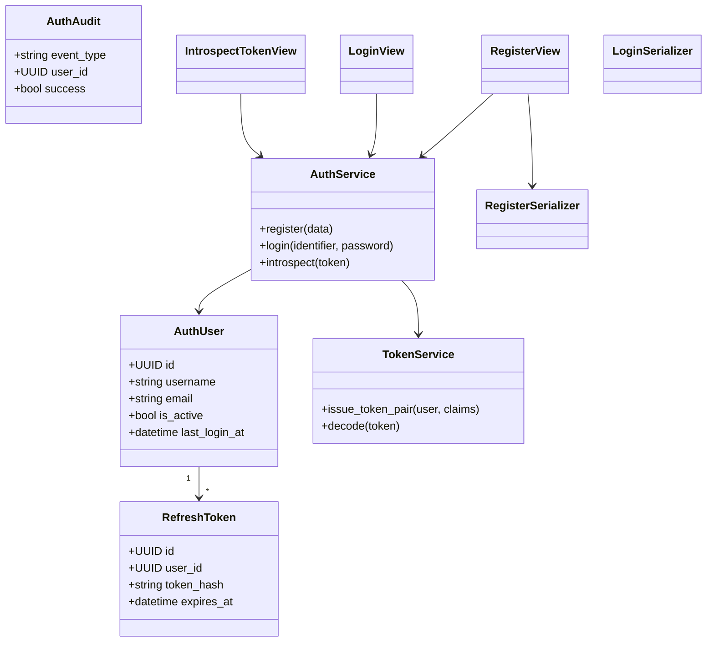

**Giải thích:** Không có Repository layer — `AuthService` gọi ORM trực tiếp. `UpstreamClient` (không vẽ đầy đủ) gọi user-service khi register/login.

---

### 2.4.2 User Service

#### A. Use Case Diagram

```mermaid
flowchart TB
    C((Customer))
    A((Admin/Staff))
    AUTH((auth-service))
    subgraph UserUC["User Service"]
        UC1[Quản lý profile]
        UC2[Quản lý địa chỉ]
        UC3[RBAC roles/permissions]
        UC4[Internal list customers]
    end
    C --> UC1 & UC2
    A --> UC4
    AUTH --> UC1
```

#### B. Bảng chức năng

| STT | Chức năng | Input | Output | Mô tả |
|-----|-----------|-------|--------|-------|
| 1 | GET profile | auth_user_id | UserProfile + role profiles | Public `/users/me/` |
| 2 | POST profile | roles, full_name… | 201 profile | Internal khi register |
| 3 | CRUD address | address fields | WebAddress list | Auto default first address |
| 4 | List customers | — | Customer[] | Internal staff |

#### C. Class Diagram

```mermaid
classDiagram
    class UserProfile {
        +UUID auth_user_id
        +string status
        +int role_version
    }
    class Role {
        +string name
    }
    class Permission {
        +string code
    }
    class CustomerProfile {
        +int loyalty_points
    }
    class WebAddress {
        +string address_line
        +bool is_default
    }
    class UserProfileView
    class AddressListView
    class UserProfileSerializer

    UserProfile "1" --> "0..1" CustomerProfile
    UserProfile "*" --> "*" Role
    Role "*" --> "*" Permission
    CustomerProfile "1" --> "*" WebAddress
    UserProfileView --> UserProfile
```

---

### 2.4.3 Product Service

#### A. Use Case Diagram

```mermaid
flowchart TB
    C((Customer))
    ST((Staff/Admin))
    ORD((order-service))
    subgraph ProdUC["Product Service"]
        UC1[Duyệt/tìm sản phẩm]
        UC2[CRUD sản phẩm]
        UC3[Reserve/Release stock]
        UC4[Sync flash sale]
    end
    C --> UC1
    ST --> UC2
    ORD --> UC3
    PROMO((promotion)) --> UC4
```

#### B. Bảng chức năng (trích)

| STT | Chức năng | Input | Output | Mô tả |
|-----|-----------|-------|--------|-------|
| 1 | List products | search, category, sort… | paginated JSON | Redis cache |
| 2 | Product detail | pk | Product + variants | Cache 600s |
| 3 | Reserve stock | order_id, items[] | 200/400 | FOR UPDATE lock |
| 4 | Create product | product fields | 201 | Staff only |

#### C. Class Diagram

```mermaid
classDiagram
    class Category {
        +int id
        +string name
    }
    class Brand {
        +int id
        +string name
    }
    class Product {
        +int id
        +decimal price
        +int stock
        +json attributes
        +bool is_flash_sale
    }
    class ProductVariant {
        +int id
        +string color
        +int stock
    }
    class ProductService {
        +create(data)
        +invalidate_cache()
    }
    class ProductListView
    class ProductSerializer
    class InternalReserveStockView

    Category "1" --> "*" Product
    Brand "1" --> "*" Product
    Product "1" --> "*" ProductVariant
    ProductListView --> ProductService
    InternalReserveStockView --> Product
```

---

### 2.4.4 Cart Service

#### A. Use Case Diagram

```mermaid
flowchart TB
    C((Customer))
    ORD((order-service))
    subgraph CartUC["Cart Service"]
        UC1[Xem giỏ]
        UC2[Thêm sản phẩm]
        UC3[Cập nhật số lượng]
        UC4[Xóa / Clear giỏ]
    end
    C --> UC1 & UC2 & UC3 & UC4
    ORD --> UC1
```

#### B. Bảng chức năng

| STT | Chức năng | Input | Output | Mô tả |
|-----|-----------|-------|--------|-------|
| 1 | Add item | product_id, qty, unit_price | Cart + items | Atomic get_or_create |
| 2 | Update qty | item_id, quantity | Cart | transaction.atomic |
| 3 | Get cart | customer_id | Cart JSON | Internal/public |
| 4 | Clear | customer_id | empty cart | Sau checkout |

#### C. Class Diagram

```mermaid
classDiagram
    class Cart {
        +int customer_id
        +datetime created_date
    }
    class CartItem {
        +int product_id
        +int quantity
        +decimal unit_price
    }
    class CartService {
        +get_cart(customer_id)
        +add_item(...)
        +clear_cart(...)
    }
    class CartDetailView
    class CartAddView

    Cart "1" --> "*" CartItem
    CartAddView --> CartService
    CartService --> Cart
    CartService --> CartItem
```

---

### 2.4.5 Order Service

#### A. Use Case Diagram

```mermaid
flowchart TB
    C((Customer))
    ST((Staff))
    subgraph OrderUC["Order Service"]
        UC1[Tạo đơn]
        UC2[Thanh toán chờ]
        UC3[Cập nhật trạng thái]
        UC4[Yêu cầu hoàn trả]
        UC5[Bulk update]
    end
    C --> UC1 & UC2 & UC4
    ST --> UC3 & UC5
```

#### C. Class Diagram (legacy + service)

```mermaid
classDiagram
    class LegacyOrder {
        +int id
        +int customer_id
        +string status
        +decimal total_amount
    }
    class LegacyOrderItem {
        +int product_id
        +decimal unit_price
    }
    class OrderService {
        +create_order(data)
        +list_orders(customer_id)
        +update_status(id, status)
    }
    class OrderListCreateView
    class OrderSerializer

    LegacyOrder "1" --> "*" LegacyOrderItem
    OrderListCreateView --> OrderService
    OrderService --> LegacyOrder
```

### Nhận xét mục 2.4

Use Case và Class Diagram phản ánh **cấu trúc code thực** — View → Service → Model. Các service còn lại (Payment, Shipping, Promotion, Interaction, Recommender) có thể mở rộng theo cùng mẫu trong phần bổ sung; Payment và Shipping đã được mô tả chi tiết ở mục 2.8–2.9.

---

## 2.5 HƯỚNG DẪN TẠO DJANGO SERVICE

Mục này hướng dẫn tạo microservice Django mới **theo đúng convention** của repository, lấy **cart-service** làm ví dụ mẫu vì scope nhỏ, đủ layer.

### Bước 1: Tạo App và Project

```bash
django-admin startproject cart_service .
django-admin startapp cart
```

Cấu trúc thực tế:

```
cart-service/
├── cart_service/     # settings, urls, wsgi
├── cart/             # models, views, services, urls, serializers
├── manage.py
├── Dockerfile
└── requirements.txt
```

### Bước 2: Settings (`cart_service/settings.py`)

```python
INSTALLED_APPS = [
    "django.contrib.contenttypes",
    "django.contrib.auth",
    "rest_framework",
    "cart",
]
DATABASES = {
    "default": {
        "ENGINE": "django.db.backends.postgresql",
        "NAME": os.environ.get("DB_NAME", "cart_db"),
        # ...
    }
}
MIDDLEWARE = [
    "common.middleware.RequestIDMiddleware",  # PYTHONPATH=/app/common
    # ...
]
```

**Vai trò:** Kết nối `cart_db`, mount `common` middleware, chỉ load app cần thiết (không admin nếu không dùng).

### Bước 3: Models (`cart/models.py`)

```python
class Cart(models.Model):
    customer_id = models.IntegerField(unique=True)
    created_date = models.DateTimeField(auto_now_add=True)

class CartItem(models.Model):
    cart = models.ForeignKey(Cart, on_delete=models.CASCADE, related_name="items")
    product_id = models.IntegerField()
    quantity = models.IntegerField()
    unit_price = models.DecimalField(max_digits=10, decimal_places=2)
    class Meta:
        unique_together = ("cart", "product_id")
```

**Vai trò:** `customer_id` soft-link user entity; `unique_together` chống duplicate line item.

### Bước 4: Migrations

```bash
python manage.py makemigrations cart
python manage.py migrate
```

Docker `entrypoint.sh` chạy migrate trước gunicorn; workers dùng `SKIP_MIGRATE=1`.

### Bước 5: Serializer (`cart/serializers.py`)

Chuyển đổi Model ↔ JSON, validate `quantity > 0`.

### Bước 6: Service Layer (`cart/services.py`)

```python
class CartService:
    def add_item(self, customer_id, product_id, quantity, unit_price):
        with transaction.atomic():
            cart, _ = Cart.objects.get_or_create(customer_id=customer_id)
            item, created = CartItem.objects.get_or_create(
                cart=cart, product_id=product_id,
                defaults={"quantity": quantity, "unit_price": unit_price},
            )
            if not created:
                item.quantity += quantity
                item.unit_price = unit_price
                item.save(update_fields=["quantity", "unit_price"])
        return self.get_cart(customer_id)
```

**Vai trò:** View không chứa logic transaction; dễ unit test `CartServiceTests`.

### Bước 7: Views (`cart/views.py`)

`CartAddView`, `CartDetailView` — parse request → gọi `CartService` → `Response(serializer.data)`.

Kiểm tra ownership: `customer_id` từ URL phải khớp `entity_id` JWT (trừ staff).

### Bước 8: URL Routing (`cart/urls.py` → `cart_service/urls.py`)

```python
path("cart/add/", CartAddView.as_view()),
path("carts/<int:customer_id>/", CartDetailView.as_view()),
path("internal/cart/<int:customer_id>/", InternalCartView.as_view()),
```

### Bước 9: Permission / Internal auth

Internal routes dùng `@require_internal` từ `common.common.auth` — order-service gọi với HMAC headers.

### Bước 10: Test (`cart/tests/test_views.py`)

Test API add/update/remove với test client hoặc mock JWT headers.

### Bước 11: Docker Compose

```yaml
cart-service:
  build: ./cart-service
  environment:
    - DB_NAME=cart_db
    - PYTHONPATH=/app/common
  volumes:
    - ./common:/app/common
  depends_on:
    cart-db:
      condition: service_healthy
```

### Bước 12: Đăng ký vào api-gateway

Thêm `CART_SERVICE_URL` vào `api-gateway/api_gateway/settings.py` `SERVICE_URLS`; gọi từ `gateway/views.py`.

### So sánh với service có Outbox (order-service)

| Bước thêm | order-service |
|-----------|---------------|
| Outbox model | Kế thừa `AbstractOutboxEvent` |
| Worker | `relay_outbox` management command + container |
| Consumer | `consume_events` |
| Saga | `OrderSaga` model + `saga_timeout_worker` |

Cart-service **không cần** outbox vì không publish domain events — pattern chọn theo nhu cầu service.

### Nhận xét mục 2.5

Quy trình trên là **chuẩn tối thiểu** trong repo: App → Model → Migration → Serializer → Service → View → URL → Docker → Gateway. Service phức tạp hơn thêm Repository (recommender), Outbox, hoặc legacy/v2 split.

---

## 2.6 FLOW HOẠT ĐỘNG HỆ THỐNG

Mục 2.6 mô tả **8 luồng nghiệp vụ** cốt lõi theo đúng implementation trên api-gateway + microservices legacy. Mỗi flow gồm: mô tả, sequence diagram, giải thích thay đổi dữ liệu.

### 2.6.1 Flow 1: Đăng ký tài khoản

**Mô tả:** Khách truy cập `/register/`, submit form → auth-service tạo credential → user-service tạo profile CUSTOMER → trả JWT.

```mermaid
sequenceDiagram
    participant U as Browser
    participant GW as api-gateway
    participant A as auth-service
    participant US as user-service

    U->>GW: POST /register/ {username, email, password}
    GW->>A: POST /auth/register/
    A->>A: INSERT auth_users
    A->>US: POST /internal/users/ (HMAC)
    US->>US: INSERT user_profiles, customer_profiles
    US-->>A: 201 {entity_id, roles, role_version}
    A->>A: INSERT refresh_tokens, auth_audit
    A-->>GW: 201 {access, refresh, user}
    GW->>GW: session user = claims
    GW-->>U: Redirect home
```

**Thay đổi dữ liệu:** `auth_db.auth_users` +1; `user_db.user_profiles` +1; `customer_profiles` +1; `entity_id` integer gán vào JWT cho cart/order.

---

### 2.6.2 Flow 2: Đăng nhập

```mermaid
sequenceDiagram
    participant U as Browser
    participant GW as api-gateway
    participant A as auth-service
    participant US as user-service

    U->>GW: POST /login/
    GW->>A: POST /auth/login/
    A->>A: rate_limit, find AuthUser
    A->>US: GET /internal/users/{uuid}/
    US-->>A: profile, roles, role_version
    A->>A: check_password, issue JWT
    A-->>GW: 200 {access, refresh}
    GW->>GW: lưu session
    GW-->>U: Redirect
```

**Kết quả:** JWT hợp lệ 24h; NGINX cache introspect 5s cho request `/users/*`.

---

### 2.6.3 Flow 3: Tìm kiếm sản phẩm

```mermaid
sequenceDiagram
    participant U as Browser
    participant GW as api-gateway
    participant P as product-service
    participant R as Redis

    U->>GW: GET /products/?search=laptop
    GW->>P: GET /products/?search=laptop
    P->>R: GET cache product:list:...
    alt Cache HIT
        R-->>P: cached JSON
    else Cache MISS
        P->>P: SELECT products
        P->>R: SETEX 180s
    end
    P-->>GW: paginated products
    GW-->>U: HTML product_list
```

**Thay đổi:** Chỉ đọc — không ghi DB.

---

### 2.6.4 Flow 4: Thêm vào giỏ hàng

```mermaid
sequenceDiagram
    participant U as Browser
    participant GW as api-gateway
    participant P as product-service
    participant C as cart-service

    U->>GW: POST /cart/add/
    GW->>P: GET /products/{id}/
    GW->>C: POST /cart/add/ {unit_price snapshot}
    C->>C: CartService.add_item atomic
    C-->>GW: Cart JSON
    GW-->>U: Redirect /cart/
```

**Models:** `cart_db.cart_items` insert hoặc update `quantity`, `unit_price`.

---

### 2.6.5 Flow 5: Đặt hàng (Checkout)

```mermaid
sequenceDiagram
    participant GW as api-gateway
    participant C as cart-service
    participant O as order-service
    participant P as product-service

    GW->>C: GET cart
    GW->>O: POST /orders/
    O->>O: INSERT orders PENDING_PAYMENT
    O->>P: POST /internal/reserve-stock/
    P->>P: FOR UPDATE, trừ stock
    O-->>GW: 201 order
    GW->>C: DELETE clear cart
```

**Database:** `order_db` +1 order; `product_db.stock` giảm; `stock_reservation_logs` RESERVED.

---

### 2.6.6 Flow 6: Thanh toán

```mermaid
sequenceDiagram
    participant GW as api-gateway
    participant PAY as payment-service
    participant O as order-service
    participant MQ as RabbitMQ
    participant SH as shipping-consumer

    GW->>PAY: POST /payments/
    PAY->>PAY: Payment idempotent + outbox
    PAY->>O: mark-paid internal
    PAY->>MQ: payment-outbox-worker
    MQ->>SH: create shipping
```

**Kết quả:** Vận đơn tạo bất đồng bộ sau vài giây.

---

### 2.6.7 Flow 7: Quản lý đơn hàng (Staff)

Staff tại `/staff/orders/` — `PUT /orders/{id}/` cập nhật status theo state machine; `POST /orders/bulk-update/` cho nhiều đơn.

**Models:** `orders.status` thay đổi; có thể kích hoạt sync shipping status.

---

### 2.6.8 Flow 8: Đánh giá sản phẩm

`POST /products/{id}/review/` → interaction-service `reviews` table → outbox event → recommender-consumer cập nhật behavior.

---

### 2.6.11 Activity Diagram — Tổng quan mua hàng

```mermaid
flowchart TD
    Start([Khách truy cập]) --> Auth{Đã đăng nhập?}
    Auth -->|Không| Login[/login/]
    Login --> Browse
    Auth -->|Có| Browse[Duyệt sản phẩm]
    Browse --> AddCart[Thêm giỏ]
    AddCart --> Checkout[Checkout POST /orders/]
    Checkout --> Reserve{Stock OK?}
    Reserve -->|Không| Fail1[Lỗi tồn kho]
    Reserve -->|Có| Pay[Thanh toán]
    Pay --> Paid{OK?}
    Paid -->|Có| Ship[Async shipping]
    Ship --> End([Hoàn tất])
    Paid -->|Không| Fail2[Thất bại]
```

**Giải thích:** Activity diagram tổng hợp 8 flow; nhánh async sau Pay thể hiện eventual consistency với shipping-consumer.

### 2.6.9 Luồng Giao dịch End-to-End Hoàn chỉnh

```mermaid
sequenceDiagram
    autonumber
    actor U as Khách hàng
    participant N as NGINX :80
    participant GW as API Gateway :8000
    participant AUTH as auth-service
    participant PROD as product-service
    participant CART as cart-service
    participant ORD as order-service
    participant PAY as payment-service
    participant MQ as RabbitMQ
    participant SHIP as shipping-service
    participant REC as recommender-ai

    Note over U,AUTH: BƯỚC 1: ĐĂNG NHẬP
    U->>N: POST /auth/login/ {username, password}
    N->>AUTH: Forward (rate: 5r/min)
    AUTH->>AUTH: Rate limit + account lock check
    AUTH-->>U: {access_token, refresh_token, user: {role, entity_id}}
    U->>GW: Lưu token vào session

    Note over U,REC: BƯỚC 2: DUYỆT SẢN PHẨM + NHẬN GỢI Ý
    U->>GW: GET /products/?category_id=2&sort_by=price_asc
    GW->>PROD: GET /products/ (Redis cache check → MISS → DB)
    GW->>REC: GET /recommendations/42/?limit=6 (parallel call)
    GW->>REC: POST /api/recommender/events/ {action:"view"} (0.5s timeout)
    PROD-->>GW: {results: [...], count: 50}
    REC-->>GW: {recommended_product_ids: [5,12,7,...]}
    GW-->>U: Render products.html với gợi ý AI

    Note over U,CART: BƯỚC 3: THÊM VÀO GIỎ
    U->>GW: POST /products/5/ {quantity: 2}
    GW->>CART: POST /carts/42/items/ {product_id:5, quantity:2, unit_price:125000}
    CART->>CART: transaction.atomic() get_or_create CartItem
    GW->>REC: POST /events/ {action:"add_to_cart"} (fire-and-forget)
    GW-->>U: Redirect → /cart/42/

    Note over U,ORD: BƯỚC 4: CHECKOUT
    U->>GW: POST /cart/42/checkout/
    GW->>CART: GET /carts/42/ → lấy items
    GW->>ORD: POST /orders/ {customer_id:42, items:[{product_id:5, qty:2, unit_price:125000}]}
    rect rgb(20,40,70)
        Note over ORD,PROD: ATOMIC TRANSACTION
        ORD->>ORD: validate + _create_order_db + snapshot product names
        ORD->>PROD: POST /internal/reserve-stock/ (HMAC signed)
        PROD->>PROD: SELECT FOR UPDATE, validate, UPDATE stock
        PROD-->>ORD: 200 OK
        ORD->>ORD: INSERT order_outbox(order_created, PENDING)
        ORD->>ORD: COMMIT
    end
    ORD-->>GW: 201 {id:1024, status:PENDING_PAYMENT, total:250000}
    GW->>CART: DELETE /carts/42/
    GW-->>U: Redirect → /orders/1024/pay/

    Note over U,PAY: BƯỚC 5: THANH TOÁN
    U->>GW: POST /orders/1024/pay/ {payment_method_id:1}
    GW->>PAY: POST /payments/ {order_id:1024, amount:250000, method_id:1}
    rect rgb(20,40,70)
        Note over PAY: ATOMIC TRANSACTION
        PAY->>PAY: get_or_create Payment(order_id=1024) idempotent
        PAY->>PAY: UPDATE payment_status=completed
        PAY->>PAY: INSERT PaymentOutbox(payment.succeeded, PENDING)
        PAY->>PAY: COMMIT + on_commit → _sync_order_paid(1024)
    end
    PAY-->>GW: 201 {payment_status: completed}
    GW->>REC: POST /events/ {action:"purchase"} (fire-and-forget)
    GW-->>U: Redirect → /orders/ (thành công)

    Note over PAY,ORD: BƯỚC 6: ASYNC SYNC ORDER
    PAY->>ORD: POST /orders/internal/1024/mark-paid/
    PAY->>ORD: POST /orders/internal/1024/advance-processing/

    Note over PAY,SHIP: BƯỚC 7: ASYNC EVENT PROPAGATION
    PAY->>MQ: payment-outbox-worker publish payment.succeeded
    MQ->>SHIP: payment-consumer nhận event
    SHIP->>SHIP: create_shipping(1024) idempotent\n+ auto tracking SHIP-00001024
    SHIP->>MQ: basic_ack()
```

*Hình 2.16: Luồng giao dịch End-to-End đầy đủ — từ đăng nhập đến giao hàng*

### 2.6.10 Bảng Tổng kết kiến trúc kỹ thuật (tham chiếu)

| Vấn đề | Giải pháp Triển khai | Component |
|---|---|---|
| **Stateless Auth** | JWT HS256 + role_version revocation | auth-service + NGINX auth_request |
| **Token Revocation** | role_version counter (không blacklist) | user-service signals + Redis cache |
| **IDOR Prevention** | UUID PK cho AuthUser, entity_id cho CartItem | auth-service + user-service |
| **Brute-force** | IP rate limit 5r/60s + account lock 15 phút | auth-service |
| **N+1 Queries** | `select_related("category", "brand")` + `prefetch_related("variants")` | product-service |
| **Cache Stampede** | Version-based invalidation O(1) | product-service + Redis |
| **Flash Sale** | Auto-expire `refresh_flash_sale_state()` + `effective_price` | product-service |
| **Deadlock** | Sort items by product_id ASC + SELECT FOR UPDATE | product-service |
| **Overselling** | Pessimistic Lock + validate all before commit | product-service |
| **Cart Race Condition** | `get_or_create` + `unique_together` + UNIQUE constraint | cart-service |
| **Dual-Write Problem** | Outbox Pattern (4 cặp outbox-worker) | order + payment + interaction + inventory |
| **At-least-once Delivery** | RabbitMQ durable + basic_ack/nack + DLQ | RabbitMQ |
| **Idempotent Payment** | `Payment.objects.get_or_create(order_id=X)` + unique constraint | payment-service |
| **Cascading Failure** | Circuit Breaker Redis-backed (3 failures → OPEN 15s) | common/client.py |
| **Shipping Resilience** | retry worker 60s × 5 lần + DLQ fallback | payment-worker |
| **SAGA Compensation** | reconcile_stock worker 5min + cancel → release_stock | product-service + order-service |
| **Internal Security** | HMAC-SHA256 + Replay Attack (30s window) + Service Whitelist | common/auth.py |
| **Zero-Trust** | 4-layer `@require_internal` + Timing Attack safe compare_digest | common/auth.py |
| **Distributed Tracing** | X-Request-ID propagation + JSONFormatter + Jaeger OTLP | common/middleware.py + logging.py |
| **Cold Start AI** | Random diversified catalog + category affinity fallback | recommender-ai-service |
| **Token Revocation AI** | behavior_bias từ BiLSTM next-action prediction | recommender-ai-service |

---

### Nhận xét mục 2.6

Tám flow (2.6.1–2.6.8) bám luồng legacy qua api-gateway. Mục 2.6.9–2.6.10 bổ sung sequence E2E và bảng tham chiếu kiến trúc. Saga v2 mô tả tại mục 2.3.12–2.3.13.

## 2.7 BIỂU ĐỒ DATA MODEL

### 2.7.1 ERD — Sơ đồ quan hệ thực thể tổng hợp

```mermaid
erDiagram
    AUTH_USERS {
        UUID id PK
        varchar username UK
        varchar email UK
        varchar password "PBKDF2 hash"
        varchar role "CUSTOMER|SELLER|STAFF|ADMIN"
        UUID entity_id "FK mềm → user_db"
        int failed_login_count
        datetime locked_until
        int role_version "Token revocation counter"
    }
    AUTH_AUDIT {
        int id PK
        UUID user_id
        varchar event_type
        bool success
        varchar ip_address
        varchar failure_reason
    }

    USER_PROFILES {
        UUID auth_user_id PK
        varchar status "ACTIVE|SUSPENDED|BANNED"
        int role_version "Sync với auth-service"
    }
    CUSTOMER_PROFILES {
        int id PK
        UUID user_profile_id FK
        int loyalty_points
    }
    STAFF_PROFILES {
        int id PK
        UUID user_profile_id FK
        varchar storage_code
        varchar position
    }

    PRODUCTS {
        int id PK
        int category_id FK
        int brand_id FK
        varchar name
        decimal price
        json attributes "JSONB — dynamic schema"
        int stock
        bool is_flash_sale
        decimal flash_sale_price
        datetime flash_sale_ends_at
    }
    STOCK_RESERVATION_LOGS {
        int id PK
        int order_id "soft-link"
        int product_id FK
        int quantity
        varchar status "RESERVED|RELEASED|COMMITTED"
    }
    INVENTORY_TRANSACTIONS {
        int id PK
        int product_id FK
        varchar type "IMPORT|EXPORT|ORDER|RETURN|ADJUST"
        int quantity_changed
        int stock_after
        varchar reference_id "order_id"
    }

    CARTS {
        int id PK
        int customer_id UK "entity_id từ JWT"
    }
    CART_ITEMS {
        int id PK
        int cart_id FK
        int product_id "soft-link"
        int variant_id
        int quantity
        decimal unit_price "snapshot price"
    }

    ORDERS {
        int id PK
        int customer_id "soft-link"
        varchar status "PENDING_PAYMENT→PAID→SHIPPING→DELIVERED"
        decimal total_amount
        json shipping_address_snapshot "immutable address"
        varchar voucher_code
    }
    ORDER_ITEMS {
        int id PK
        int order_id FK
        int product_id "soft-link"
        varchar product_name "snapshot"
        decimal unit_price "LOCKED at purchase time"
    }
    ORDER_OUTBOX {
        int id PK
        varchar event_type "order_created"
        json payload
        varchar status "PENDING|PUBLISHED|FAILED"
    }

    PAYMENTS {
        int id PK
        int order_id UK "idempotency key"
        varchar payment_status "pending|completed|refunded"
        varchar shipping_status "pending|processing|failed"
        int shipping_retry_count
    }
    PAYMENT_OUTBOX {
        int id PK
        varchar event_type "payment.succeeded"
        varchar status
    }

    SHIPPINGS {
        int id PK
        int order_id UK
        varchar tracking_number UK "SHIP-{id:08d}"
        varchar status "PENDING|PROCESSING|SHIPPED|FAILED"
        date estimated_delivery_date
    }
    SHIPPING_STATUSES {
        int id PK
        int shipping_id FK
        varchar status
        varchar description "tiếng Việt cho khách"
    }

    CUSTOMER_BEHAVIORS {
        int id PK
        int customer_id
        int product_id
        varchar action "purchase|add_to_cart|..."
        float action_weight
        varchar session_id
    }
    RECOMMENDATION_LOGS {
        int id PK
        int customer_id
        json product_ids
        varchar strategy "hybrid+cf+copurchase+..."
    }

    AUTH_USERS ||--o{ AUTH_AUDIT : "generates"
    USER_PROFILES ||--o| CUSTOMER_PROFILES : "extends"
    USER_PROFILES ||--o| STAFF_PROFILES : "extends"
    PRODUCTS ||--o{ STOCK_RESERVATION_LOGS : "logged by"
    PRODUCTS ||--o{ INVENTORY_TRANSACTIONS : "audited by"
    CARTS ||--|{ CART_ITEMS : "contains"
    ORDERS ||--|{ ORDER_ITEMS : "contains"
    ORDERS ||--o{ ORDER_OUTBOX : "emits events"
    PAYMENTS ||--o{ PAYMENT_OUTBOX : "emits events"
    SHIPPINGS ||--o{ SHIPPING_STATUSES : "tracks"
```

*Hình 2.15: ERD tổng hợp toàn hệ thống — 8+ databases độc lập, liên kết qua soft-links*

### 2.7.2 Công nghệ dữ liệu

Chỉ liệt kê công nghệ **có trong source / docker-compose**:

| Công nghệ | Vai trò | Dữ liệu lưu | Tích hợp Django |
|-----------|---------|-------------|-----------------|
| **PostgreSQL 15** | CSDL chính mỗi service | Toàn bộ domain models (12 DB) | `django.db.backends.postgresql`, env `DB_HOST` |
| **Redis 7** | Cache + Circuit Breaker state | Product list cache, `circuit:{host}`, permission cache | `redis` client trong `common/client.py`; auth `REDIS_URL` |
| **RabbitMQ 3** | Message broker | Queues: order_events, payment_events, DLQ | `pika`/amqp via workers `relay_outbox`, consumers |
| **Neo4j 5** | Graph co-purchase / behavior | Nodes User, Product, relationships | `neo4j` Python driver trong `recommender-ai-service` |
| **SQLite** | Session api-gateway; dev catalog local | Django sessions only | `api_gateway/settings.py`, `catalog_service/settings.py` default |
| **Jaeger** | Distributed tracing | Trace spans (không business data) | OTLP ports 4317/4318 trong compose |

**Không sử dụng:** Elasticsearch, Kafka, MySQL, MongoDB.

**MinIO/S3:** Được **tham chiếu** trong `catalog-service` ready check — **không tìm thấy** container MinIO trong `docker-compose.yml`.

### Nhận xét mục 2.7.2

Polyglot persistence có chủ đích: PostgreSQL cho ACID transaction, Redis cho speed, RabbitMQ cho reliability, Neo4j cho graph recommendation — mỗi store phục vụ đúng access pattern.

---

---

## 2.8 ĐÁNH GIÁ THIẾT KẾ

### Ưu điểm kiến trúc Microservices

1. **Fault isolation:** Sự cố recommender hoặc notification không làm sập checkout — các DB tách biệt.
2. **Database per service:** Schema evolution độc lập; không migration khổng lồ monolith.
3. **Phù hợp đồ án:** Thể hiện đủ sync REST, async MQ, cache, AI, BFF — đánh giá cao về mặt kiến trúc phần mềm.
4. **Bảo mật phân lớp:** JWT + NGINX introspect + HMAC internal + chặn `/internal/` — defense in depth.
5. **Immutability nghiệp vụ:** Snapshot `unit_price` trong cart và order — đúng chuẩn kế toán TMĐT.

### Ưu điểm phân rã Service Layer

- View mỏng, logic tập trung (`OrderService`, `CartService`…) — dễ đọc và test.
- `common` module tránh duplicate Circuit Breaker, Outbox, middleware.
- Management commands (`seed_mock`, `reconcile_stock`) tách operational tasks khỏi API.

### Khả năng mở rộng

- Scale horizontal từng container trong Compose (product, recommender workers).
- Redis cache + version invalidation hấp thụ read spike Flash Sale.
- `model-serving-service` tách inference — có thể thêm GPU replica.

**Hạn chế:** Chỉ Docker Compose single-host — **không tìm thấy** Kubernetes/Helm trong repo.

### Khả năng bảo trì

- Legacy/v2 split (`legacy_models.py`) cho phép migrate dần không breaking UI.
- Structured JSON logging + Request ID — debug distributed flow.
- RBAC seed idempotent (`seed_rbac`).

**Hạn chế:** Hai catalog (product + catalog) và hai inventory gây **cognitive load** cho developer mới.

### Khả năng triển khai thực tế

- `docker-compose up` khởi động 30+ container với healthcheck, `wait_for_tables`.
- Bootstrap users (`admin`, `customer1`) — demo ngay.
- MOCK payment provider — không cần cổng thanh toán thật khi dev.

### Hạn chế hiện tại

| Hạn chế | Chi tiết |
|---------|----------|
| Seller portal | Model có, UI **không có** |
| Notification UI | Backend có, customer notification center **không có** |
| Catalog/Inventory v2 | Chưa gắn api-gateway checkout chính |
| Permission hardening | notification-service `AllowAny`; một số service tin network |
| Single NGINX | Không HA multi-node |

### Hướng cải tiến tương lai

1. **Hoàn tất saga v2:** Chuyển checkout gateway sang `/api/v1/orders/checkout/` + inventory-service.
2. **Seller portal:** UI quản lý gian hàng cho role SELLER.
3. **Unified catalog:** Deprecate integer product-service hoặc sync hai chiều qua events.
4. **K8s deployment:** Manifest + HPA cho product/auth.
5. **Harden permissions:** JWT validation trên mọi microservice, bỏ `AllowAny`.
6. **Real payment:** Tích hợp VNPay/MoMo thay `PAYMENT_PROVIDER=MOCK`.

### Nhận xét mục 2.8

Thiết kế **đạt mục tiêu đồ án kiến trúc phân tán** với trade-off có chủ đích: eventual consistency, dual API generation, BFF orchestration. Hạn chế chủ yếu ở maturation (v2 chưa thay legacy UI) — không phải lỗi thiết kế nền.

---

### 2.8.1 Kết luận Chương 2

Hệ thống E-commerce Microservices được xây dựng trên nền tảng **14 Microservices độc lập** với **13 PostgreSQL databases** riêng biệt, điều phối bởi Docker Compose với hơn 30 containers. Kiến trúc này giải quyết triệt để các vấn đề cổ điển của Monolith:

- **Fault Isolation hoàn toàn:** Recommender AI bị OOM không ảnh hưởng luồng thanh toán
- **Independent Scaling:** Product Service có thể chạy 5 replicas khi Flash Sale mà các service khác vẫn 1 replica
- **Zero Dual-Write:** Outbox Pattern trong 4 luồng quan trọng đảm bảo không mất sự kiện
- **Tính bất biến của dữ liệu kế toán:** `unit_price` và `product_name` trong `OrderItem` được snapshot vĩnh viễn
- **Security by Default:** JWT không cần blacklist nhờ `role_version`, HMAC chống internal MITM, `compare_digest` chống Timing Attack

Nền tảng kỹ thuật này tạo điều kiện cho việc tích hợp AI Recommender trong Chương 3 và triển khai đầy đủ trong Chương 4.
