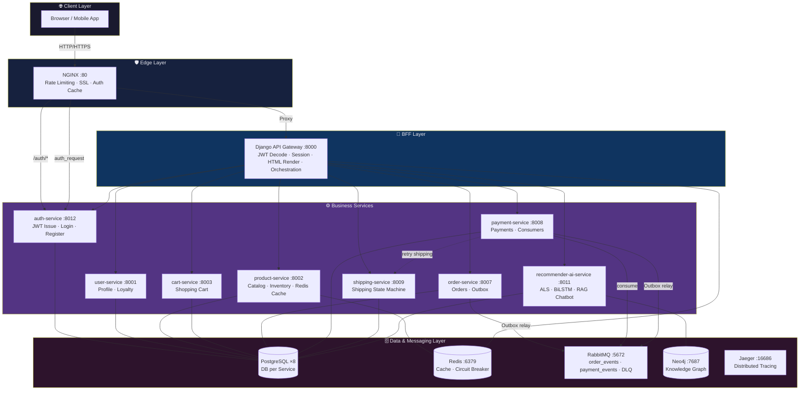
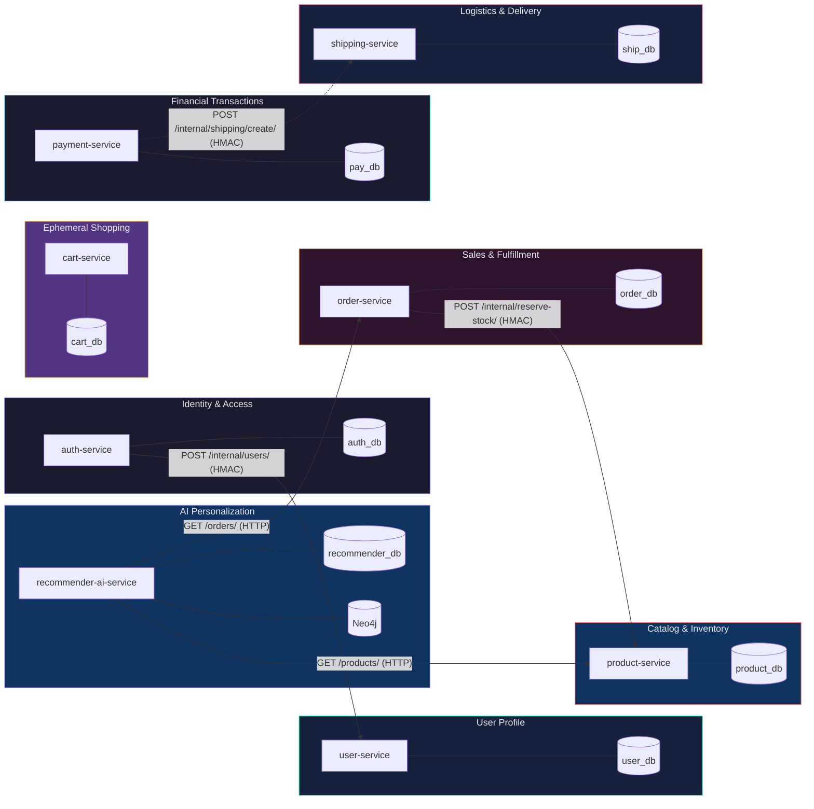
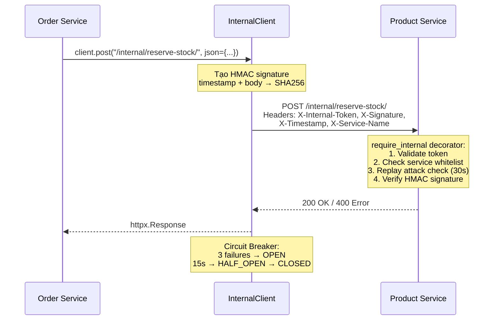
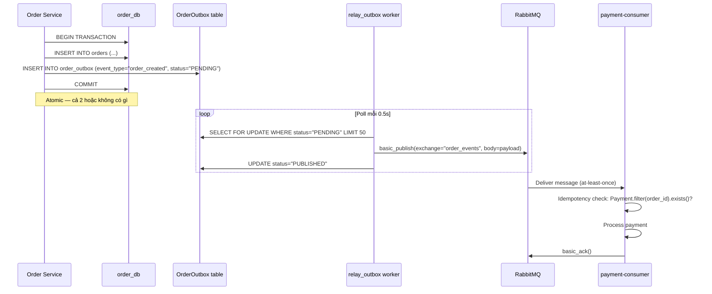
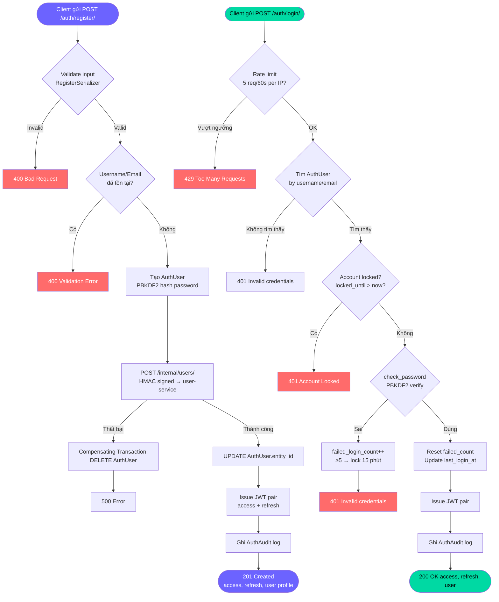
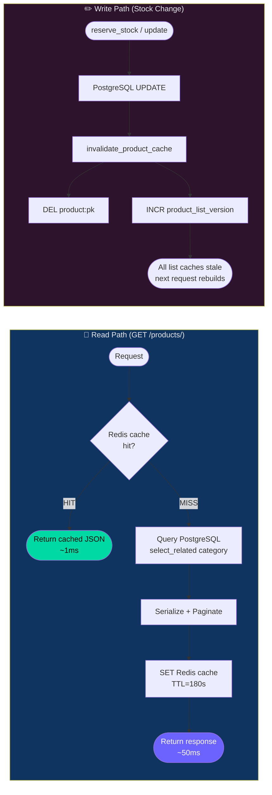
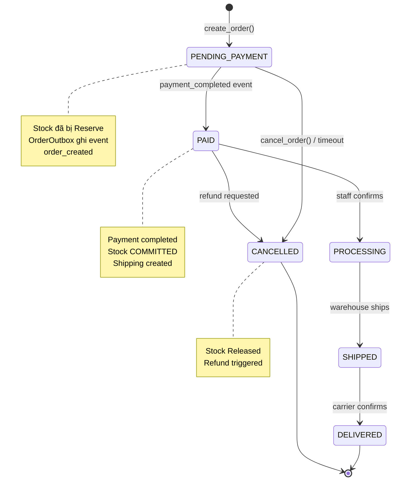
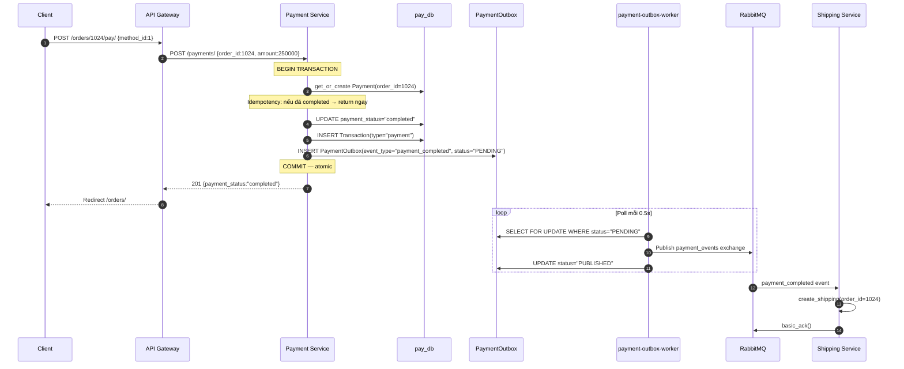
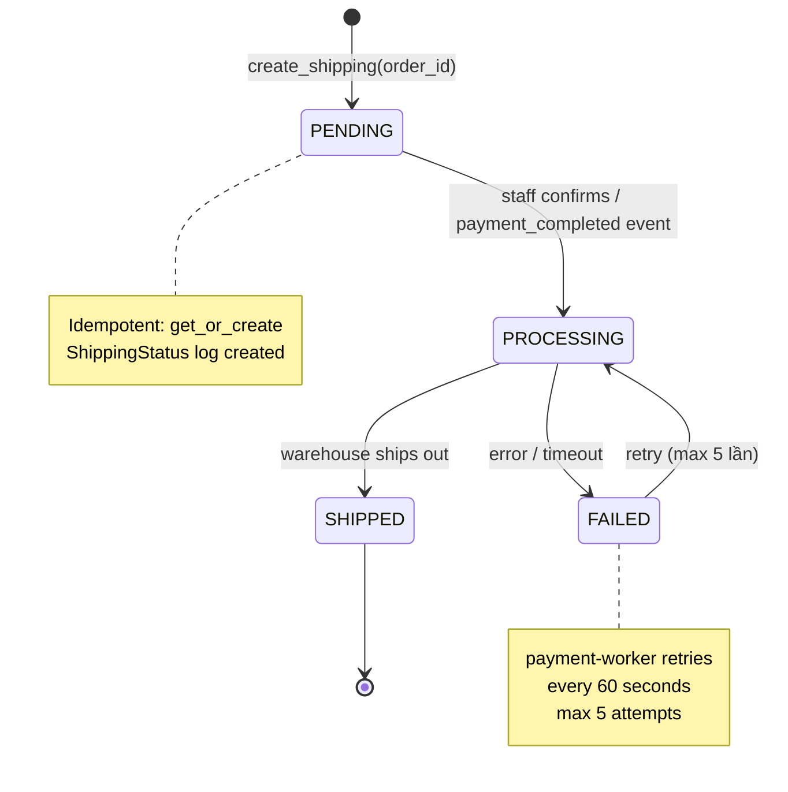

# CHƯƠNG 2: PHÁT TRIỂN HỆ THỐNG E-COMMERCE MICROSERVICES

Chương này trình bày chi tiết và chuyên sâu về thiết kế kiến trúc phần mềm (Software Architecture Design) và quá trình xây dựng nền tảng hệ thống thương mại điện tử. Cốt lõi của hệ thống là luồng dữ liệu giao dịch tài chính phải đảm bảo tính nguyên tử (Atomicity), chịu tải cao (High Throughput) và độ trễ thấp. Để giải quyết bài toán tự động thu phóng (Auto-Scalability) và Tính sẵn sàng cao (High Availability), hệ thống từ bỏ hoàn toàn mô hình Monolith cổ điển để áp dụng kiến trúc phân tán Microservices.

## 2.1 Xác định yêu cầu hệ thống

Phân tích yêu cầu là khâu đầu tiên và sống còn để định hình ranh giới các tính năng phần mềm. Trong hệ thống phân tán, nếu yêu cầu không rõ ràng, các dịch vụ sẽ bị thiết kế chồng chéo, dính chặt vào nhau. Hậu quả là việc nâng cấp một tính năng nhỏ cũng có thể gây ra hiệu ứng domino làm sụp đổ toàn bộ dây chuyền.

### 2.1.1 Yêu cầu chức năng (Functional Requirements)

1. **Xác thực và Cấp phép Phi trạng thái (Stateless Authentication):** Hệ thống loại bỏ hoàn toàn cơ chế Cookie/Session truyền thống lưu trên RAM máy chủ. Thay vào đó, nền tảng sử dụng JSON Web Token (JWT) với thuật toán HS256. Khi khách hàng đăng nhập thành công, hệ thống cấp phát một chữ ký điện tử mã hóa chứa sẵn `user_id`, `username`, `email`, `role`, `entity_id`. Khách hàng tự mang chữ ký này trình diện cho bất kỳ máy chủ nào mà không cần truy vấn CSDL liên tục.

2. **Quản lý Vòng đời Giỏ hàng Đa nền tảng (Omnichannel Cart):** Giỏ hàng được duy trì liên tục và đồng bộ hóa ngay lập tức trên nhiều thiết bị. Dữ liệu giỏ hàng được lưu trữ độc lập khỏi các phiên làm việc (session) trình duyệt, sử dụng `customer_id` làm khóa định danh duy nhất.

3. **Thanh toán và Chống Mua lố (Overselling Prevention):** Luồng thanh toán sử dụng Pessimistic Lock (`SELECT FOR UPDATE`) kết hợp sắp xếp `product_id` tăng dần để ngăn chặn Deadlock. Hệ thống khấu trừ tồn kho tạm thời (Reserve Stock) ngay khi tạo đơn hàng, đảm bảo không có trường hợp hai người dùng cùng mua thành công sản phẩm cuối cùng trong kho.

4. **Phân quyền vai trò (Role-Based Access Control - RBAC):** Kiến trúc phân quyền mềm dẻo với 4 vai trò: `customer`, `staff`, `manager`, `admin`. Chỉ tài khoản `staff`, `manager`, `admin` mới được truy cập giao diện Dashboard quản trị. `customer` chỉ có quyền thao tác với tài nguyên của riêng họ.

5. **Hệ thống Gợi ý AI Hybrid (AI Recommender):** Hệ thống tích hợp engine gợi ý sản phẩm kết hợp 3 tầng: Matrix Factorization (NMF/ALS offline), Co-purchase scoring, và Behavior scoring. Kết hợp thêm RAG Chatbot (Groq LLM llama-3.1-8b-instant) để tư vấn mua sắm cá nhân hóa.


### 2.1.2 Yêu cầu phi chức năng (Non-functional Requirements)

1. **Hiệu năng và Tốc độ Đọc (Read-Heavy Performance):** Tỷ lệ hành động xem (Read) so với tỷ lệ mua (Write) trong E-commerce thường dao động ở mức 100:1 đến 1000:1. Hệ thống sử dụng Redis cache 2 tầng: cache danh sách sản phẩm 3 phút (`product:list:v{version}:{page}:{page_size}:{keyword}`) và cache chi tiết sản phẩm 10 phút (`product:{pk}`). Cơ chế cache invalidation tự động khi có thay đổi dữ liệu thông qua `product_list_version` counter.

2. **Tính Chịu lỗi (Fault Tolerance) & Resilience:** Hệ thống áp dụng Circuit Breaker Pattern được lưu trạng thái trên Redis với 3 trạng thái: `CLOSED`, `OPEN`, `HALF_OPEN`. Ngưỡng mở circuit là 3 lần thất bại liên tiếp, thời gian reset 15 giây. Nếu Shipping Service bị sập, Payment Service ghi nhận `shipping_status=FAILED` và worker `retry_failed_shipping` sẽ tự động thử lại tối đa 5 lần.

3. **Tính Nhất quán Cuối cùng (Eventual Consistency):** Hệ thống chấp nhận độ trễ cập nhật 1-2 giây giữa các vi dịch vụ thông qua Outbox Pattern + RabbitMQ. Mọi sự kiện quan trọng (order_created, payment_completed) đều được lưu vào bảng Outbox trước khi publish lên Message Queue, đảm bảo không mất dữ liệu kể cả khi service bị crash.

4. **Khả năng Truy vết Phân tán (Distributed Tracing):** Mỗi request được gán một `X-Request-ID` duy nhất (UUID) và truyền xuyên suốt qua tất cả services thông qua `RequestIDMiddleware`. Hệ thống tích hợp Jaeger (port 16686) để thu thập và hiển thị distributed traces.

### 2.1.3 Các giới hạn công nghệ và Phụ thuộc (Technical Constraints)

- **Ngôn ngữ và Framework:** Python 3.10 + Django 4.x + Django Rest Framework cho tất cả services.
- **Hạ tầng Ảo hóa:** 100% dịch vụ chạy trong Docker container, quản lý bằng Docker Compose với 20+ services.
- **Hệ quản trị CSDL đa cực (Polyglot Persistence):** PostgreSQL 15 cho tất cả services giao dịch (mỗi service một DB riêng biệt), Neo4j 5 cho đồ thị tri thức AI, Redis 7 cho cache và Circuit Breaker state.
- **Message Broker:** RabbitMQ 3 với management UI (port 15672), sử dụng fanout exchange và Dead Letter Queue.
- **AI/LLM:** Groq API (llama-3.1-8b-instant) cho RAG chatbot, NMF matrix factorization cho Collaborative Filtering, Keras model cho behavior prediction.


## 2.2 Phân rã hệ thống theo Định hướng Miền (DDD)

### 2.2.0 Sơ đồ Kiến trúc Tổng thể



*Hình 2.1: Kiến trúc tổng thể hệ thống E-commerce Microservices*

### 2.2.1 Bounded Context (Miền giới hạn)

Hệ thống được phân rã thành **8 Microservices** độc lập, mỗi service sở hữu một CSDL PostgreSQL riêng biệt hoàn toàn:

| Service | Port | Database | Bounded Context |
|---|---|---|---|
| `auth-service` | 8012 | `auth_db` | Identity & Access Management |
| `user-service` | 8001 | `user_db` | User Profile & Loyalty |
| `product-service` | 8002 | `product_db` | Catalog & Inventory |
| `cart-service` | 8003 | `cart_db` | Ephemeral Shopping |
| `order-service` | 8007 | `order_db` | Sales & Fulfillment |
| `payment-service` | 8008 | `pay_db` | Financial Transactions |
| `shipping-service` | 8009 | `ship_db` | Logistics & Delivery |
| `recommender-ai-service` | 8011 | `recommender_db` | AI Personalization |

Ngoài ra, hệ thống còn có `api-gateway` (port 8000) đóng vai trò BFF (Backend-For-Frontend) và NGINX (port 80) đóng vai trò reverse proxy thực sự.

### 2.2.2 Sơ đồ Bounded Context và Database per Service



*Hình 2.2: Bounded Context và Database per Service — không có Cross-Database JOIN*

### 2.2.3 Quy tắc Giao tiếp Liên Dịch vụ (Inter-service Communication Rules)

Giao tiếp giữa các services được chia thành 2 loại:

**Synchronous (Đồng bộ) — REST API qua `InternalClient`:**



*Hình 2.3: Luồng giao tiếp đồng bộ nội bộ với HMAC và Circuit Breaker*

**Asynchronous (Bất đồng bộ) — RabbitMQ qua Outbox Pattern:**



*Hình 2.4: Outbox Pattern đảm bảo at-least-once delivery không mất dữ liệu* `InternalClient` trong `common/client.py` tích hợp Circuit Breaker (Redis-backed), retry với exponential backoff, và HMAC signature để xác thực.

```python
# common/client.py — InternalClient với Circuit Breaker
class InternalClient:
    def __init__(self, timeout=2.0, max_retries=2):
        self.timeout = timeout
        self.max_retries = max_retries
        self.service_name = os.environ.get("SERVICE_NAME", "unknown_service")
        self.internal_token = os.environ.get("INTERNAL_TOKEN", "internal-dev-token")
        self.signing_secret = os.environ.get("INTERNAL_SIGNING_SECRET", "internal-signing-secret")
        self.fail_threshold = 3   # Mở circuit sau 3 lần thất bại
        self.reset_timeout = 15   # Reset sau 15 giây

    def _generate_signature(self, timestamp: str, body: str) -> str:
        return hmac.new(
            self.signing_secret.encode("utf-8"),
            f"{timestamp}.{body}".encode("utf-8"),
            hashlib.sha256,
        ).hexdigest()

    def _get_headers(self, request_body: str = "") -> dict:
        request_id = get_request_id() or "unknown-req-id"
        timestamp = str(int(time.time()))
        signature = self._generate_signature(timestamp, request_body)
        return {
            "X-Request-ID": request_id,
            "X-Trace-ID": request_id,       # Distributed tracing alias
            "X-Service-Name": self.service_name,
            "X-Timestamp": timestamp,
            "X-Signature": signature,
            "X-Internal-Token": self.internal_token,
            "Content-Type": "application/json"
        }
```

**Asynchronous (Bất đồng bộ) — RabbitMQ qua Outbox Pattern:**
Được sử dụng cho các thao tác không yêu cầu phản hồi tức thì như thông báo thanh toán thành công, kích hoạt vận chuyển. Sử dụng fanout exchange `order_events` và `payment_events` với Dead Letter Queue (DLQ) để xử lý thất bại.


```python
# common/events.py — EventPublisher với DLQ topology
class EventPublisher:
    @classmethod
    def _setup_topology(cls):
        channel = cls._channel
        # Dead Letter Exchange
        channel.exchange_declare(exchange='dlx', exchange_type='direct', durable=True)
        channel.queue_declare(queue='dlq', durable=True)
        channel.queue_bind(queue='dlq', exchange='dlx', routing_key='dlq')
        # Main Business Exchanges (fanout — broadcast tới tất cả subscribers)
        channel.exchange_declare(exchange='order_events', exchange_type='fanout', durable=True)
        channel.exchange_declare(exchange='payment_events', exchange_type='fanout', durable=True)

    @classmethod
    def publish(cls, exchange: str, event_type: str, data: dict, version: int = 1):
        trace_id = get_request_id() or "unknown"
        payload = {
            "event_type": event_type,
            "version": version,
            "data": data,
            "trace_id": trace_id,
            "timestamp": datetime.now(timezone.utc).isoformat()
        }
        channel = cls.get_channel()
        channel.basic_publish(
            exchange=exchange,
            routing_key="",  # fanout — không cần routing key
            body=json.dumps(payload),
            properties=pika.BasicProperties(
                delivery_mode=2,  # Persistent — lưu vào disk
                headers={"trace_id": trace_id}
            )
        )
```

### 2.2.3 Lợi ích Phân mảnh Dữ liệu (Data Isolation)

Mỗi service sở hữu CSDL độc lập, không cho phép kết nối chéo ở mức SQL (No Cross-Database JOINs). Thay vì JOIN bằng khóa ngoại vật lý, hệ thống dùng khóa mềm (Soft-links) như `customer_id`, `product_id`, `order_id`. Khi Product Database bị quá tải, Order Database vẫn hoàn toàn khỏe mạnh để tiếp tục xử lý các đơn hàng đang thanh toán.

Một điểm đặc biệt quan trọng: tại bảng `OrderItem`, trường `unit_price` được **chốt cứng vĩnh viễn** tại thời điểm tạo đơn hàng. Dù giá sản phẩm sau này thay đổi, hóa đơn cũ không bao giờ bị ảnh hưởng — đây là nguyên tắc bất biến dữ liệu (Immutability) của sổ cái kế toán.

## 2.3 Thiết kế Auth Service

### 2.3.0 Sơ đồ Luồng Đăng ký và Đăng nhập



*Hình 2.5: Luồng đăng ký và đăng nhập với Rate Limiting, Account Lockout và Compensating Transaction*

### 2.3.1 Kiến trúc Tách biệt Auth và User Profile

Hệ thống tách biệt hoàn toàn 2 concerns:
- **`auth-service`**: Quản lý thông tin xác thực (credentials) — username, email, password hash, role, JWT tokens. Sử dụng CSDL `auth_db` riêng.
- **`user-service`**: Quản lý thông tin hồ sơ (profile) — loyalty points, địa chỉ, thông tin nhân viên. Sử dụng CSDL `user_db` riêng.

Khi đăng ký, `auth-service` tạo `AuthUser` trong `auth_db`, sau đó gọi `user-service` qua `InternalClient` để tạo profile tương ứng. Nếu việc tạo profile thất bại, hệ thống thực hiện **Compensating Transaction** — xóa `AuthUser` vừa tạo để đảm bảo tính nhất quán.

```python
# auth-service/authentication/models.py
class AuthUser(models.Model):
    username = models.CharField(max_length=150, unique=True)
    email = models.EmailField(unique=True)
    password = models.CharField(max_length=255)  # PBKDF2 hash
    phone = models.CharField(max_length=20, blank=True)
    role = models.CharField(max_length=20, choices=ROLE_CHOICES)
    entity_role = models.CharField(max_length=20, blank=True)
    entity_id = models.IntegerField(null=True, blank=True)  # FK mềm sang user-service
    is_active = models.BooleanField(default=True)
    failed_login_count = models.IntegerField(default=0)
    locked_until = models.DateTimeField(null=True, blank=True)
    last_login_at = models.DateTimeField(null=True, blank=True)
    created_at = models.DateTimeField(auto_now_add=True)
    updated_at = models.DateTimeField(auto_now=True)

    class Meta:
        db_table = "auth_users"

    def set_password(self, raw_password: str) -> None:
        self.password = make_password(raw_password)  # Django PBKDF2

    def check_password(self, raw_password: str) -> bool:
        return check_password(raw_password, self.password)

class AuthAudit(models.Model):
    event_type = models.CharField(max_length=50)   # "login" | "register"
    user_id = models.IntegerField(null=True, blank=True)
    role = models.CharField(max_length=20, blank=True)
    entity_id = models.IntegerField(null=True, blank=True)
    success = models.BooleanField(default=False)
    ip_address = models.CharField(max_length=45, blank=True)
    user_agent = models.CharField(max_length=255, blank=True)
    failure_reason = models.CharField(max_length=255, blank=True)
    created_at = models.DateTimeField(auto_now_add=True)

    class Meta:
        db_table = "auth_audit"
```


### 2.3.2 Kiến trúc JWT Token và Payload

Hệ thống sử dụng `djangorestframework-simplejwt` với thuật toán HS256. Access token có thời hạn 1440 phút (24 giờ), Refresh token 7 ngày. Điểm đặc biệt là JWT Payload được nhúng sẵn các thông tin cần thiết để downstream services không cần truy vấn ngược về CSDL:

```python
# auth-service/authentication/services.py
class TokenService:
    @staticmethod
    def issue_token_pair(claims: dict) -> dict:
        refresh = RefreshToken()
        for key, value in claims.items():
            refresh[key] = value
        return {
            "access": str(refresh.access_token),
            "refresh": str(refresh),
        }

class AuthService:
    def _build_claims(self, user: AuthUser) -> dict:
        claims = {
            "user_id": user.id,
            "username": user.username,
            "email": user.email,
            "role": user.role,
            "entity_id": user.entity_id,  # ID trong user-service (customer_id hoặc staff_id)
        }
        if user.entity_role:
            claims["entity_role"] = user.entity_role
        return claims
```

**Phân tích JWT Payload:** Trường `entity_id` là khóa quan trọng nhất — đây là ID của người dùng trong `user-service` (không phải ID trong `auth-service`). Khi API Gateway decode token, nó trích xuất `entity_id` và truyền xuống các services qua header `X-Entity-Id`. Cart Service dùng `entity_id` làm `customer_id`, Order Service dùng làm `customer_id` trong đơn hàng.

### 2.3.3 Bảo mật Đăng nhập: Rate Limiting và Account Lockout

Auth Service triển khai 2 lớp bảo vệ chống brute-force:

```python
# auth-service/authentication/views.py
def _rate_limit_login(ip_address: str) -> bool:
    """Rate limit: 5 requests / 60 giây per IP"""
    key = f"auth-login:{ip_address}"
    try:
        count = cache.incr(key)
    except ValueError:
        cache.set(key, 1, timeout=settings.AUTH_LOGIN_RATE_WINDOW)  # 60s
        count = 1
    return count > settings.AUTH_LOGIN_RATE_LIMIT  # 5

# auth-service/authentication/services.py
def _register_failed_login(self, user, request_ip, user_agent, reason):
    user.failed_login_count += 1
    if user.failed_login_count >= settings.AUTH_MAX_FAILED_LOGINS:  # 5
        user.locked_until = timezone.now() + timedelta(minutes=settings.AUTH_LOCK_MINUTES)  # 15 phút
    user.save(update_fields=["failed_login_count", "locked_until"])
    self._audit("login", False, user, user.role, user.entity_id, request_ip, user_agent, failure_reason=reason)
```

**Lớp 1 — IP Rate Limiting:** Giới hạn 5 request đăng nhập / 60 giây per IP address, sử dụng Django cache (Redis). Vượt ngưỡng trả về HTTP 429.

**Lớp 2 — Account Lockout:** Sau 5 lần nhập sai mật khẩu, tài khoản bị khóa 15 phút. Mọi sự kiện đăng nhập (thành công/thất bại) đều được ghi vào bảng `AuthAudit` để phục vụ kiểm toán bảo mật.

### 2.3.4 Circuit Breaker trong UpstreamClient

Auth Service giao tiếp với User Service qua `UpstreamClient` — một HTTP client tích hợp Circuit Breaker và retry logic sử dụng thư viện `tenacity`:

```python
# auth-service/authentication/services.py
class CircuitBreaker:
    def __init__(self, failure_threshold: int, recovery_timeout: int):
        self.failure_threshold = failure_threshold  # 5
        self.recovery_timeout = recovery_timeout    # 30 giây
        self.failure_count = 0
        self.opened_at = None

    def allow(self) -> bool:
        if self.opened_at is None:
            return True
        if time.time() - self.opened_at >= self.recovery_timeout:
            self.opened_at = None
            self.failure_count = 0
            return True  # HALF_OPEN: cho phép 1 request thử
        return False  # OPEN: từ chối tất cả

class UpstreamClient:
    @retry(
        wait=wait_exponential(multiplier=0.2, min=0.2, max=2),
        stop=stop_after_attempt(settings.AUTH_RETRY_ATTEMPTS),  # 2 lần
        retry=retry_if_exception(lambda exc: isinstance(exc, UpstreamServiceError) and exc.retryable),
        reraise=True,
    )
    def post(self, path: str, payload: dict, request_id: str | None = None) -> dict:
        if not self.breaker.allow():
            raise CircuitBreakerOpen(f"{self.name} circuit breaker is open")
        # ... gọi HTTP với HMAC signed headers
```


### 2.3.5 Phân quyền RBAC và Zero-Trust Nội bộ

Phân quyền RBAC không chỉ ngăn khách hàng truy cập Dashboard quản trị mà còn được áp dụng ở tầng mạng nội bộ. Decorator `require_internal` trong `common/auth.py` thực hiện 3 lớp kiểm tra:

```python
# common/auth.py
def require_internal(fn):
    @functools.wraps(fn)
    def wrapper(self, request, *args, **kwargs):
        token = request.META.get("HTTP_X_INTERNAL_TOKEN", "")
        service_name = request.META.get("HTTP_X_SERVICE_NAME", "")
        signature = request.META.get("HTTP_X_SIGNATURE", "")
        timestamp = request.META.get("HTTP_X_TIMESTAMP", "")

        # Lớp 1: Xác thực token cơ bản
        if not token or token != INTERNAL_TOKEN:
            return Response({"error": "Forbidden - Invalid Token"}, status=403)

        # Lớp 2: Kiểm tra service có trong whitelist không
        if service_name not in INTERNAL_ALLOWED_SERVICES:
            return Response({"error": f"Forbidden - Service {service_name} not allowed"}, status=403)

        # Lớp 3: Chống Replay Attack — request chỉ sống trong 30 giây
        try:
            ts_int = int(timestamp)
        except ValueError:
            return Response({"error": "Forbidden - Invalid timestamp"}, status=403)

        if abs(int(time.time()) - ts_int) > INTERNAL_SIGNATURE_TOLERANCE:  # 30s
            return Response({"error": "Forbidden - Request expired"}, status=403)

        # Lớp 4: Xác thực chữ ký HMAC-SHA256
        body = request.body.decode("utf-8") if request.body else ""
        expected = hmac.new(
            INTERNAL_SIGNING_SECRET.encode("utf-8"),
            f"{timestamp}.{body}".encode("utf-8"),
            hashlib.sha256,
        ).hexdigest()

        # Dùng compare_digest thay vì == để chống Timing Attack
        if not hmac.compare_digest(signature, expected):
            return Response({"error": "Forbidden - Invalid signature"}, status=403)

        return fn(self, request, *args, **kwargs)
    return wrapper
```

**Phân tích Chi tiết Kỹ thuật Zero-Trust:**

1. **Chống Replay Attack:** Mỗi request nội bộ gắn `X-Timestamp`. Nếu độ lệch thời gian > 30 giây, request bị từ chối. Điều này ngăn hacker nghe lén và phát lại request (ví dụ: sao chép lệnh trừ tiền để trừ nhiều lần).

2. **HMAC-SHA256 Signature:** `timestamp + body` được băm cùng `INTERNAL_SIGNING_SECRET`. Bất kỳ thay đổi nào trong body (dù chỉ 1 ký tự) sẽ gây Avalanche Effect làm chữ ký hoàn toàn khác.

3. **Timing Attack Prevention:** `hmac.compare_digest()` so sánh chuỗi với thời gian cố định O(1), ngăn hacker dò từng ký tự của chữ ký qua thời gian phản hồi CPU.

4. **Service Whitelist:** Chỉ các service trong `INTERNAL_ALLOWED_SERVICES` mới được gọi internal API, ngăn chặn lateral movement nếu một container bị xâm phạm.

## 2.4 Thiết kế User Service

### 2.4.1 Mô hình Dữ liệu Người dùng

User Service quản lý hồ sơ người dùng với thiết kế phân tách rõ ràng giữa Customer và Staff:

```python
# user-service/user/models.py
class User(models.Model):
    username = models.CharField(max_length=150, unique=True)
    email = models.EmailField(unique=True)
    password = models.CharField(max_length=255)
    phone = models.CharField(max_length=20, blank=True)
    role = models.CharField(max_length=20, choices=UserRole.choices, default=UserRole.CUSTOMER)
    is_active = models.BooleanField(default=True)
    created_date = models.DateTimeField(auto_now_add=True)

    class Meta:
        db_table = "users"

class CustomerProfile(models.Model):
    user = models.OneToOneField(User, on_delete=models.CASCADE, related_name="customer_profile")
    loyalty_points = models.IntegerField(default=0)  # Điểm tích lũy

    class Meta:
        db_table = "customer_profiles"

class StaffProfile(models.Model):
    user = models.OneToOneField(User, on_delete=models.CASCADE, related_name="staff_profile")
    storage_code = models.CharField(max_length=50, blank=True)  # Mã kho hàng
    department = models.CharField(max_length=255, blank=True)
    position = models.CharField(max_length=255, blank=True)

    class Meta:
        db_table = "staff_profiles"

class WebAddress(models.Model):
    customer = models.ForeignKey(CustomerProfile, on_delete=models.CASCADE, related_name="addresses")
    recipient_name = models.CharField(max_length=255)
    address_line = models.CharField(max_length=500)
    city = models.CharField(max_length=100)
    country = models.CharField(max_length=100)
    postal_code = models.CharField(max_length=20)
    is_default = models.BooleanField(default=False)

    class Meta:
        db_table = "web_addresses"
```


### 2.4.2 Internal API và Bảo mật

User Service chỉ expose internal API (không có public API trực tiếp), tất cả đều được bảo vệ bởi `@require_internal`:

```python
# user-service/user/views.py
class UserProfileView(APIView):
    @require_internal
    def get(self, request, user_id=None):
        """Lấy thông tin profile — chỉ dành cho internal services"""
        try:
            user = User.objects.get(id=user_id)
            data = {"id": user.id, "email": user.email, "role": user.role,
                    "username": user.username, "phone": user.phone}
            if user.role == "customer":
                profile = CustomerProfile.objects.filter(user=user).first()
                if profile:
                    data["loyalty_points"] = profile.loyalty_points
            else:
                profile = StaffProfile.objects.filter(user=user).first()
                if profile:
                    data["department"] = profile.department
                    data["position"] = profile.position
            return Response(data)
        except User.DoesNotExist:
            return Response({"error": "User not found"}, status=404)

    @require_internal
    def post(self, request, user_id=None):
        """Tạo profile mới — được gọi bởi auth-service khi đăng ký"""
        data = request.data
        user = User.objects.create(
            id=data["id"],  # Dùng cùng ID với auth-service
            username=data["username"],
            email=data["email"],
            phone=data.get("phone", ""),
            role=data.get("role", "customer")
        )
        if user.role == "customer":
            CustomerProfile.objects.create(user=user)
        else:
            StaffProfile.objects.create(
                user=user,
                storage_code=data.get("storage_code", ""),
                department=data.get("department", ""),
                position=data.get("position", "")
            )
        return Response({"id": user.id}, status=201)
```

**URL Routes của User Service:**
```
/internal/users/              — POST: tạo profile mới (auth-service gọi khi đăng ký)
/internal/users/<id>/         — GET: lấy profile, DELETE: xóa profile (compensating transaction)
/users/me/                    — GET: public endpoint cho user đã đăng nhập
```

## 2.5 Thiết kế Product Service

### 2.5.0 Sơ đồ Luồng Cache và Reserve Stock



*Hình 2.6: Chiến lược Redis Cache 2 tầng với version-based invalidation*

```mermaid
flowchart TD
    A([POST /internal/reserve-stock/<br/>order_id, items]) --> B[Sort items by product_id ASC<br/>🔑 Chống Deadlock]
    B --> C[BEGIN TRANSACTION]
    C --> D["SELECT * FROM products<br/>WHERE id IN (...)<br/>FOR UPDATE<br/>🔒 Row-level lock"]
    D --> E{Validate tất cả items:<br/>product tồn tại?<br/>stock >= quantity?}
    E -->|Validation fail| F[ROLLBACK]
    F --> G([400 Insufficient stock])
    E -->|All valid| H[Loop: UPDATE products<br/>SET stock = stock - qty<br/>update_fields=['stock']]
    H --> I[INSERT StockReservationLog<br/>status='RESERVED']
    I --> J[invalidate_product_cache]
    J --> K[COMMIT]
    K --> L([200 OK Stock reserved])

    style A fill:#6c63ff,color:#fff
    style D fill:#ff9f43,color:#000
    style B fill:#f0c040,color:#000
    style G fill:#ff6b6b,color:#fff
    style L fill:#00d9a3,color:#000
```

*Hình 2.7: Thuật toán Reserve Stock với Pessimistic Lock và Deadlock Prevention*

### 2.5.1 Data Model cốt lõi

Product Service quản lý danh mục sản phẩm với thiết kế linh hoạt sử dụng `JSONField` cho thuộc tính động:

```python
# product-service/product/models.py
class Category(models.Model):
    name = models.CharField(max_length=255)
    description = models.TextField(blank=True)

    class Meta:
        db_table = "categories"

class Product(models.Model):
    name = models.CharField(max_length=255)
    category = models.ForeignKey(Category, on_delete=models.CASCADE, related_name="products")
    price = models.DecimalField(max_digits=12, decimal_places=2)
    currency = models.CharField(max_length=10, default="VND")
    sku = models.CharField(max_length=50, unique=True, null=True, blank=True)
    image_url = models.CharField(max_length=1000, blank=True, default="")
    attributes = models.JSONField(default=dict)  # Thuộc tính động: author, pages, warranty...
    description = models.TextField(blank=True)
    status = models.CharField(max_length=20, default="active")
    stock = models.IntegerField(default=0)
    created_at = models.DateTimeField(auto_now_add=True)
    updated_at = models.DateTimeField(auto_now=True)

    class Meta:
        db_table = "products"

class StockReservationLog(models.Model):
    order_id = models.IntegerField()
    product = models.ForeignKey(Product, on_delete=models.CASCADE)
    quantity = models.IntegerField()
    status = models.CharField(max_length=20, default="RESERVED")  # RESERVED, RELEASED, COMMITTED
    created_at = models.DateTimeField(auto_now_add=True)

    class Meta:
        db_table = "stock_reservation_logs"
```

**Phân tích kỹ thuật JSONB và GIN Indexing:** Cột `attributes` lưu trữ các thuộc tính đặc thù của từng loại sản phẩm (sách: `author`, `publisher`, `pages`; điện tử: `warranty`, `battery_capacity`). PostgreSQL lưu JSONB ở định dạng nhị phân và hỗ trợ GIN Index để tìm kiếm nhanh trong cấu trúc JSON phân nhánh, tránh phải tạo hàng chục bảng con và JOIN phức tạp.


### 2.5.2 Redis Cache 2 Tầng cho Product API

Product Service là điểm nóng chịu tải Read nhiều nhất. Hệ thống triển khai Redis cache 2 tầng với cơ chế invalidation thông minh:

```python
# product-service/product/views.py
class ProductListView(APIView):
    def get(self, request):
        page = _parse_positive_int(request.query_params.get("page"), 1)
        page_size = min(_parse_positive_int(request.query_params.get("page_size"), 10), 200)
        keyword = (request.query_params.get("search") or "").strip().lower()

        # Cache key bao gồm version để invalidation tức thì khi có thay đổi
        try:
            version = redis_client.get("product_list_version") or "1"
            cache_key = f"product:list:v{version}:{page}:{page_size}:{keyword or 'all'}"
            cached_data = redis_client.get(cache_key)
            if cached_data:
                return Response(json.loads(cached_data))
        except Exception:
            pass  # Graceful degradation nếu Redis down

        # Tối ưu hóa N+1: select_related để JOIN category trong 1 query
        objs = _prod_svc.list().order_by("id")  # ProductService.list() dùng select_related("category")
        data = list(ProductSerializer(objs, many=True).data)

        # ... phân trang và lọc ...

        response_data = {"count": total, "page": page, "page_size": page_size,
                         "total_pages": total_pages, "results": data[start:end]}

        # Cache 3 phút
        try:
            redis_client.set(cache_key, json.dumps(response_data), ex=180)
        except Exception:
            pass

        return Response(response_data)

class ProductDetailView(APIView):
    def get(self, request, pk):
        # Cache chi tiết sản phẩm 10 phút
        cache_key = f"product:{pk}"
        try:
            cached_data = redis_client.get(cache_key)
            if cached_data:
                return Response(json.loads(cached_data))
        except Exception:
            pass

        p = _prod_svc.get(pk)
        data = ProductSerializer(p).data
        try:
            redis_client.set(cache_key, json.dumps(data), ex=600)  # 10 phút
        except Exception:
            pass
        return Response(data)
```

**Cơ chế Cache Invalidation:** Khi có thay đổi sản phẩm (tạo mới, cập nhật, thay đổi tồn kho), hàm `invalidate_product_cache()` tăng counter `product_list_version` lên 1. Tất cả cache key danh sách sản phẩm đều chứa version này, nên tự động trở nên stale và sẽ được rebuild ở request tiếp theo.

```python
# product-service/product/services.py
def invalidate_product_cache(product_id=None):
    try:
        if product_id:
            redis_client.delete(f"product:{product_id}")  # Xóa cache chi tiết
        redis_client.incr("product_list_version")  # Invalidate tất cả cache danh sách
    except Exception:
        pass  # Không để lỗi Redis ảnh hưởng đến luồng chính
```

### 2.5.3 Khóa Tồn kho Chống Deadlock (Pessimistic Lock)

Đây là điểm nóng dễ tổn thương nhất của hệ thống E-commerce. Khi hàng trăm người cùng mua 1 sản phẩm trong Flash Sale, CSDL phải xử lý hàng chục giao dịch khóa giành giật dữ liệu lẫn nhau:

```python
# product-service/product/services.py
class ProductService:
    def reserve_stock(self, order_id: int, items: list):
        # BƯỚC 1: Sắp xếp product_id tăng dần — chìa khóa vàng chống Deadlock
        items = sorted(items, key=lambda x: x["product_id"])

        with transaction.atomic():
            product_ids = [item["product_id"] for item in items]

            # BƯỚC 2: Pessimistic Lock — SELECT ... FOR UPDATE
            # Khóa cấp độ dòng (Row-level lock), chặn mọi transaction khác
            products = Product.objects.select_for_update().filter(id__in=product_ids)
            product_map = {p.id: p for p in products}

            # BƯỚC 3: Validation — kiểm tra tồn kho trước khi commit
            for item in items:
                p_id = item["product_id"]
                qty = item["quantity"]
                if p_id not in product_map:
                    raise ValueError(f"Product {p_id} not found")
                product = product_map[p_id]
                if product.stock < qty:
                    raise ValueError(
                        f"Insufficient stock for product {p_id}. "
                        f"Requested: {qty}, Available: {product.stock}"
                    )

            # BƯỚC 4: Commit và ghi Audit Log
            for item in items:
                product = product_map[item["product_id"]]
                product.stock -= item["quantity"]
                product.save(update_fields=["stock"])  # Chỉ update cột stock

                StockReservationLog.objects.create(
                    order_id=order_id,
                    product=product,
                    quantity=item["quantity"],
                    status="RESERVED"
                )
                invalidate_product_cache(product.id)
```

**Phân tích Thuật toán Tránh Deadlock:**

- **Bản chất Deadlock:** Khách A mua Sách 1 + Sách 2, Khách B mua Sách 2 + Sách 1. Transaction A khóa Sách 1 rồi chờ Sách 2. Transaction B khóa Sách 2 rồi chờ Sách 1. Cả 2 chờ nhau vô tận → Database Deadlock Exception.

- **Giải pháp (BƯỚC 1):** `sorted(items, key=lambda x: x["product_id"])` đảm bảo mọi transaction luôn yêu cầu khóa theo thứ tự tăng dần. Transaction B sẽ phải chờ Transaction A xong hoàn toàn, triệt tiêu chu trình chờ khép kín.

- **`select_for_update()` (BƯỚC 2):** Tạo `SELECT ... FOR UPDATE` — khóa cấp độ dòng PostgreSQL. Mọi transaction khác muốn đọc/ghi các dòng này đều bị block cho đến khi transaction hiện tại COMMIT.

- **`update_fields=["stock"]` (BƯỚC 4):** Chỉ ghi đúng cột cần thiết, tránh ghi đè toàn bộ hàng, giảm I/O và nguy cơ gián đoạn khóa.


## 2.6 Thiết kế Cart Service

### 2.6.1 Kiến trúc Thin-Service

Cart Service được thiết kế mỏng nhẹ (Thin-Service) với CSDL riêng `cart_db`, không có bất kỳ tham chiếu khóa ngoại vật lý nào tới Order hay Product:

```python
# cart-service/cart/models.py
class Cart(models.Model):
    customer_id = models.IntegerField(unique=True)  # Soft-link sang user-service
    created_date = models.DateTimeField(auto_now_add=True)

    class Meta:
        db_table = "carts"

class CartItem(models.Model):
    cart = models.ForeignKey(Cart, on_delete=models.CASCADE, related_name="items")
    product_id = models.IntegerField()  # Soft-link sang product-service
    quantity = models.IntegerField(default=1)
    unit_price = models.DecimalField(max_digits=10, decimal_places=2, default=0)  # Snapshot giá

    class Meta:
        db_table = "cart_items"
        unique_together = ("cart", "product_id")  # Mỗi sản phẩm chỉ 1 dòng trong giỏ
```

### 2.6.2 Xử lý Race Condition và Idempotency

```python
# cart-service/cart/services.py
class CartService:
    def get_cart(self, customer_id: int):
        cart, created = Cart.objects.get_or_create(customer_id=customer_id)
        return cart

    def add_item(self, customer_id: int, product_id: int, quantity: int, unit_price: float = 0):
        if quantity <= 0:
            raise ValueError("Quantity must be greater than 0")

        with transaction.atomic():
            cart = self.get_cart(customer_id)

            # get_or_create đảm bảo Idempotency — không tạo 2 dòng cho cùng 1 sản phẩm
            item, created = CartItem.objects.get_or_create(
                cart=cart, product_id=product_id,
                defaults={"quantity": quantity, "unit_price": unit_price}
            )

            if not created:
                item.quantity += quantity
                item.unit_price = unit_price  # Luôn cập nhật giá mới nhất
                # Chỉ ghi 2 cột cần thiết — tối ưu Disk I/O
                item.save(update_fields=["quantity", "unit_price"])

        return self.get_cart(customer_id)

    def remove_item(self, customer_id: int, product_id: int):
        with transaction.atomic():
            cart = self.get_cart(customer_id)
            CartItem.objects.filter(cart=cart, product_id=product_id).delete()
        return self.get_cart(customer_id)

    def clear_cart(self, customer_id: int):
        with transaction.atomic():
            cart = self.get_cart(customer_id)
            CartItem.objects.filter(cart=cart).delete()
        return self.get_cart(customer_id)
```

**Phân tích Kỹ thuật:**

- **Idempotency qua `get_or_create`:** Nếu khách hàng nhấp đúp chuột gửi 2 request thêm hàng cùng lúc, chỉ 1 dòng `CartItem` được tạo. Request thứ 2 nhảy vào nhánh `not created` và cộng dồn số lượng an toàn.

- **`unique_together = ("cart", "product_id")`:** Ràng buộc ở tầng CSDL đảm bảo không bao giờ có 2 dòng cho cùng 1 sản phẩm trong cùng 1 giỏ, kể cả trong điều kiện race condition cực đoan.

- **`update_fields=["quantity", "unit_price"]`:** Tạo câu SQL tối giản `UPDATE cart_items SET quantity=X, unit_price=Y WHERE id=Z`, giảm ~90% băng thông I/O so với `save()` thông thường.

### 2.6.3 Serializer với Computed Fields

```python
# cart-service/cart/serializers.py
class CartItemSerializer(serializers.ModelSerializer):
    line_total = serializers.SerializerMethodField()

    class Meta:
        model = CartItem
        fields = ["id", "cart", "product_id", "quantity", "unit_price", "line_total"]
        read_only_fields = ["cart"]

    def get_line_total(self, obj):
        return float(obj.unit_price * obj.quantity)  # Tính tổng tiền từng dòng

class CartSerializer(serializers.ModelSerializer):
    items = CartItemSerializer(many=True, read_only=True)
    total_price = serializers.SerializerMethodField()

    class Meta:
        model = Cart
        fields = ["id", "customer_id", "created_date", "items", "total_price"]

    def get_total_price(self, obj):
        return float(sum(item.unit_price * item.quantity for item in obj.items.all()))
```


## 2.7 Thiết kế Order Service

### 2.7.0 Sơ đồ State Machine Đơn hàng



*Hình 2.8: Order State Machine — mọi transition đều có audit trail*

### 2.7.1 Máy Trạng Thái Đơn Hàng (Order State Machine)

Đơn hàng là "Sổ cái" bất khả xâm phạm của hệ thống kinh doanh. Vòng đời tuân thủ State Machine nghiêm ngặt:

```python
# order-service/order/models.py
class OrderStatus(models.TextChoices):
    PENDING = "pending", "Pending"
    CONFIRMED = "confirmed", "Confirmed"
    PROCESSING = "processing", "Processing"
    SHIPPED = "shipped", "Shipped"
    DELIVERED = "delivered", "Delivered"
    CANCELLED = "cancelled", "Cancelled"
    PENDING_PAYMENT = "pending_payment", "Pending Payment"
    PAID = "paid", "Paid"
    FAILED_PAYMENT = "failed_payment", "Failed Payment"

class Order(models.Model):
    customer_id = models.IntegerField()  # Soft-link sang user-service
    order_date = models.DateTimeField(auto_now_add=True)
    status = models.CharField(max_length=20, choices=OrderStatus.choices,
                               default=OrderStatus.PENDING_PAYMENT)
    shipping_fee = models.DecimalField(max_digits=10, decimal_places=2, default=0)
    discount_amount = models.DecimalField(max_digits=10, decimal_places=2, default=0)
    total_amount = models.DecimalField(max_digits=12, decimal_places=2, default=0)
    notes = models.TextField(blank=True)

    class Meta:
        db_table = "orders"
        ordering = ["-order_date"]

class OrderItem(models.Model):
    order = models.ForeignKey(Order, on_delete=models.CASCADE, related_name="items")
    product_id = models.IntegerField()  # Soft-link sang product-service
    quantity = models.IntegerField()
    unit_price = models.DecimalField(max_digits=10, decimal_places=2)  # Giá chốt cứng
    discount = models.DecimalField(max_digits=10, decimal_places=2, default=0)

    class Meta:
        db_table = "order_items"

    @property
    def subtotal(self):
        return (self.unit_price - self.discount) * self.quantity

class Invoice(models.Model):
    order = models.OneToOneField(Order, on_delete=models.CASCADE, related_name="invoice")
    created_date = models.DateTimeField(auto_now_add=True)
    status = models.CharField(max_length=20, choices=InvoiceStatus.choices,
                               default=InvoiceStatus.DRAFT)

    class Meta:
        db_table = "invoices"

# Outbox Pattern — đảm bảo at-least-once delivery
class OrderOutbox(AbstractOutboxEvent):
    class Meta:
        db_table = "order_outbox"
        indexes = [
            models.Index(fields=["status", "created_at"]),
        ]
```

### 2.7.2 Luồng Tạo Đơn Hàng với Outbox Pattern

```python
# order-service/order/services.py
class OrderService:
    def __init__(self):
        self.client = InternalClient()  # Circuit Breaker + HMAC

    def create_order(self, data: dict):
        items = [{"product_id": item["product_id"], "quantity": item["quantity"]}
                 for item in data.get("items", [])]
        if not items:
            raise ValueError("Order must contain items")

        try:
            with transaction.atomic():
                # Bước 1: Tạo Order và OrderItems trong DB
                order = self._create_order_db(data)

                # Bước 2: Gọi Product Service khóa tồn kho (synchronous — cần phản hồi ngay)
                r = self.client.post(
                    f"{PRODUCT_SERVICE_URL}/internal/reserve-stock/",
                    json={"order_id": order.id, "items": items}
                )
                if r.status_code not in (200, 201):
                    err = r.json().get("error", "Stock reservation failed")
                    raise ValueError(err)  # Rollback toàn bộ transaction

                # Bước 3: Ghi vào Outbox thay vì gọi Payment Service trực tiếp
                # Đảm bảo atomicity: Order + Outbox event trong cùng 1 transaction
                outbox_payload = {
                    "order_id": order.id,
                    "customer_id": order.customer_id,
                    "total_amount": str(order.total_amount),
                    "items": items
                }
                OrderOutbox.objects.create(
                    aggregate_id=str(order.id),
                    event_type="order_created",
                    payload=outbox_payload
                )
        except Exception as e:
            raise ValueError(f"Order creation failed: {e}")

        return order
```

**Phân tích Outbox Pattern:** Thay vì gọi Payment Service trực tiếp sau khi tạo Order (dễ gây Dual-Write Problem nếu mạng đứt), hệ thống ghi `OrderOutbox` trong cùng transaction với Order. Worker `relay_outbox` sẽ đọc Outbox và publish lên RabbitMQ. Nếu worker crash, Outbox vẫn còn trong DB và sẽ được xử lý khi restart.


### 2.7.3 Order Outbox Relay Worker

```python
# order-service/order/management/commands/relay_outbox.py
class Command(BaseCommand):
    help = "Relay OrderOutbox events to RabbitMQ"

    def handle(self, *args, **options):
        while True:
            # Poll 50 events PENDING mỗi 0.5 giây
            events = OrderOutbox.objects.filter(status="PENDING").order_by("created_at")[:50]

            if not events:
                time.sleep(2)
                continue

            for event in events:
                with transaction.atomic():
                    # Lock row để tránh 2 worker xử lý cùng 1 event
                    e = OrderOutbox.objects.select_for_update().get(id=event.id)

                    if e.status != "PENDING":
                        continue  # Đã được xử lý bởi worker khác

                    try:
                        EventPublisher.publish(
                            exchange="order_events",
                            event_type=e.event_type,
                            data=e.payload,
                            version=1
                        )
                        e.status = "PUBLISHED"
                        e.published_at = now()
                        e.save(update_fields=["status", "published_at"])
                    except Exception as err:
                        e.retry_count += 1
                        e.error_message = str(err)[:500]
                        if e.retry_count >= 5:
                            e.status = "FAILED"  # Sau 5 lần thất bại → đánh dấu FAILED
                        e.save(update_fields=["retry_count", "error_message", "status"])

            time.sleep(0.5)
```

### 2.7.4 Hệ thống Discount và Invoice

Order Service còn quản lý hệ thống mã giảm giá và hóa đơn:

```python
# order-service/order/models.py
class Discount(models.Model):
    discount_code = models.CharField(max_length=50, unique=True)
    discount_name = models.CharField(max_length=255)
    start_date = models.DateField()
    end_date = models.DateField()
    discount_value = models.DecimalField(max_digits=10, decimal_places=2)
    is_percentage = models.BooleanField(default=True)  # True: %, False: số tiền cố định
    is_active = models.BooleanField(default=True)

    class Meta:
        db_table = "discounts"

class Coupon(models.Model):
    customer_id = models.IntegerField()
    coupon_code = models.CharField(max_length=50, unique=True)
    discount_value = models.DecimalField(max_digits=10, decimal_places=2)
    is_percentage = models.BooleanField(default=True)
    expiry_date = models.DateField()
    status = models.CharField(max_length=20, choices=CouponStatus.choices,
                               default=CouponStatus.ACTIVE)

    class Meta:
        db_table = "coupons"
```

Logic tính giảm giá trong `_create_order_db`:
```python
def _create_order_db(self, data: dict):
    # ... tạo Order và OrderItems ...
    discount_amount = Decimal("0")
    if discount_code:
        discount = Discount.objects.filter(discount_code=discount_code, is_active=True).first()
        if discount:
            if discount.is_percentage:
                discount_amount = total * discount.discount_value / Decimal("100")
            else:
                discount_amount = discount.discount_value
            OrderDiscount.objects.create(order=order, discount_id=discount.id,
                                          applied_value=discount_amount)

    shipping_fee = Decimal(str(data.get("shipping_fee", 0)))
    final_total = total - discount_amount + shipping_fee
    order.total_amount = final_total
    order.discount_amount = discount_amount
    order.save(update_fields=["total_amount", "discount_amount"])

    Invoice.objects.create(order=order, admin_id=order.admin_id)
    return order
```


## 2.8 Thiết kế Payment Service

### 2.8.0 Sơ đồ Luồng Thanh toán và Outbox



*Hình 2.9: Luồng thanh toán với Outbox Pattern — không mất event kể cả khi crash*

### 2.8.1 Mô hình Dữ liệu và Idempotency

Payment Service quản lý toàn bộ vòng đời thanh toán với cơ chế idempotency để tránh thanh toán trùng lặp:

```python
# payment-service/payment/models.py
class Payment(models.Model):
    order_id = models.IntegerField(unique=True)  # unique=True đảm bảo idempotency
    payment_date = models.DateTimeField(auto_now_add=True)
    payment_amount = models.DecimalField(max_digits=12, decimal_places=2)
    payment_method = models.ForeignKey(PaymentMethod, null=True, on_delete=models.SET_NULL)
    payment_status = models.CharField(max_length=20, choices=PaymentStatus.choices,
                                       default=PaymentStatus.PENDING)
    transaction_ref = models.CharField(max_length=255, blank=True)

    # Shipping Resilience — theo dõi trạng thái giao hàng
    shipping_status = models.CharField(max_length=20, choices=ShippingStatus.choices,
                                        default=ShippingStatus.PENDING)
    shipping_failure_reason = models.TextField(blank=True, null=True)
    shipping_retry_count = models.IntegerField(default=0)

    class Meta:
        db_table = "payments"

class PaymentOutbox(AbstractOutboxEvent):
    class Meta:
        db_table = "payment_outbox"

class Refund(models.Model):
    payment = models.ForeignKey(Payment, on_delete=models.CASCADE, related_name="refunds")
    refund_date = models.DateTimeField(auto_now_add=True)
    refund_amount = models.DecimalField(max_digits=12, decimal_places=2)
    refund_reason = models.TextField(blank=True)

    class Meta:
        db_table = "refunds"

class Transaction(models.Model):
    order_id = models.IntegerField()
    transaction_type = models.CharField(max_length=50)  # "payment" | "refund"
    value = models.DecimalField(max_digits=12, decimal_places=2)
    status = models.CharField(max_length=50, default="success")
    created_date = models.DateTimeField(auto_now_add=True)

    class Meta:
        db_table = "transactions"

class DLQEvent(models.Model):
    """Lưu trữ các message thất bại từ Dead Letter Queue"""
    queue_name = models.CharField(max_length=255)
    exchange = models.CharField(max_length=255, blank=True)
    body = models.JSONField()
    error_message = models.TextField(blank=True)
    received_at = models.DateTimeField(auto_now_add=True)
    replayed = models.BooleanField(default=False)

    class Meta:
        db_table = "dlq_events"
```

### 2.8.2 Luồng Xử lý Thanh toán với Outbox Pattern

```python
# payment-service/payment/services.py
class PaymentService:
    def process_payment(self, order_id: int, amount: float, method_id: int = None):
        with transaction.atomic():
            # Idempotency: get_or_create đảm bảo không tạo 2 Payment cho cùng 1 Order
            payment, created = Payment.objects.get_or_create(
                order_id=order_id,
                defaults={"payment_amount": amount, "payment_status": "pending"}
            )

            if payment.payment_status == "completed":
                # Đã thanh toán rồi — trả về kết quả cũ (idempotent)
                return payment

            method = PaymentMethod.objects.filter(pk=method_id).first() \
                     or PaymentMethod.objects.first()

            payment.payment_method = method
            payment.payment_amount = amount
            payment.payment_status = "completed"
            payment.transaction_ref = str(uuid.uuid4())[:20]
            payment.save()

            # Ghi Transaction log
            Transaction.objects.create(
                order_id=order_id,
                transaction_type="payment",
                value=amount,
                status="success"
            )

            # Ghi Outbox thay vì gọi Shipping Service trực tiếp
            # Đảm bảo atomicity: Payment + Outbox trong cùng 1 transaction
            PaymentOutbox.objects.create(
                aggregate_id=str(payment.id),
                event_type="payment_completed",
                payload={
                    "payment_id": payment.id,
                    "order_id": order_id,
                    "amount": str(amount),
                    "shipping_status": "pending"
                }
            )

        return payment
```


### 2.8.3 Payment Consumer — Xử lý Sự kiện Bất đồng bộ

Payment Service chạy một consumer lắng nghe sự kiện `order_created` từ RabbitMQ exchange `order_events`. Đây là luồng tự động hóa thanh toán khi đơn hàng được tạo:

```python
# payment-service/payment/management/commands/consume_orders.py
class Command(BaseCommand):
    help = "Consume order_events to process payments"

    def handle(self, *args, **options):
        channel = EventPublisher.get_channel()

        # Khai báo queue với Dead Letter Exchange để xử lý thất bại
        queue_name = 'payment_order_consumer'
        channel.queue_declare(queue=queue_name, durable=True, arguments={
            'x-dead-letter-exchange': 'dlx',
            'x-dead-letter-routing-key': 'dlq'
        })
        channel.queue_bind(queue=queue_name, exchange='order_events', routing_key='')

        def callback(ch, method, properties, body):
            try:
                payload = json.loads(body)
                event_type = payload.get("event_type")

                if event_type == "order_created":
                    data = payload.get("data", {})
                    order_id = data.get("order_id")
                    amount = float(data.get("total_amount", 0))

                    # Idempotency Check — tránh xử lý 2 lần
                    if Payment.objects.filter(order_id=order_id).exists():
                        ch.basic_ack(delivery_tag=method.delivery_tag)
                        return

                    with transaction.atomic():
                        payment = Payment.objects.create(
                            order_id=order_id,
                            payment_amount=amount,
                            payment_status=PaymentStatus.COMPLETED,
                            shipping_status=ShippingStatus.PENDING
                        )
                        PaymentOutbox.objects.create(
                            aggregate_id=str(payment.id),
                            event_type="payment_completed",
                            payload={"payment_id": payment.id, "order_id": order_id,
                                     "amount": str(amount), "shipping_status": payment.shipping_status}
                        )

                # ACK — báo RabbitMQ đã xử lý thành công, có thể xóa message
                ch.basic_ack(delivery_tag=method.delivery_tag)

            except Exception as e:
                logger.error(f"Error processing order event: {e}")
                # NACK + requeue=False → message vào DLQ
                ch.basic_nack(delivery_tag=method.delivery_tag, requeue=False)

        channel.basic_consume(queue=queue_name, on_message_callback=callback)
        channel.start_consuming()
```

**Tầm quan trọng của ACK/NACK:** Lệnh `ch.basic_ack()` báo RabbitMQ rằng message đã được xử lý thành công và có thể xóa khỏi queue. Nếu consumer crash trước khi ACK, RabbitMQ tự động đẩy message trở lại queue để consumer khác xử lý — đảm bảo **At-least-once delivery**. Khi xử lý thất bại, `basic_nack(requeue=False)` đẩy message vào Dead Letter Queue (DLQ) để phân tích sau.

### 2.8.4 Cơ chế Retry Shipping Thất bại

Payment Service có một worker riêng `retry_failed_shipping` chạy định kỳ để thử lại các đơn hàng mà Shipping Service chưa nhận được:

```python
# payment-service/payment/management/commands/retry_failed_shipping.py
class Command(BaseCommand):
    def handle(self, *args, **options):
        client = InternalClient()
        ship_url = os.environ.get("SHIP_SERVICE_URL", "http://shipping-service:8000")

        # Lấy các payment có shipping thất bại, chưa vượt quá 5 lần retry
        payments = Payment.objects.filter(
            shipping_status=ShippingStatus.FAILED,
            shipping_retry_count__lt=5
        ).order_by('shipping_retry_count', 'payment_date')

        for payment in payments:
            with transaction.atomic():
                p = Payment.objects.select_for_update().get(id=payment.id)
                p.shipping_retry_count += 1
                p.save(update_fields=["shipping_retry_count"])

            try:
                r = client.post(f"{ship_url}/internal/shipping/create/",
                                json={"order_id": payment.order_id})
                if r.status_code in (200, 201):
                    payment.shipping_status = ShippingStatus.PROCESSING
                    payment.shipping_failure_reason = ""
                    payment.save(update_fields=["shipping_status", "shipping_failure_reason"])
                else:
                    raise Exception(f"Status {r.status_code}: {r.text}")
            except Exception as e:
                payment.shipping_failure_reason = str(e)[:500]
                payment.save(update_fields=["shipping_failure_reason"])
```

Worker này chạy trong container `payment-worker` theo vòng lặp `while true; do python manage.py retry_failed_shipping; sleep 60; done` — tức là cứ 60 giây thử lại một lần.


## 2.9 Thiết kế Shipping Service

### 2.9.0 Sơ đồ State Machine Vận chuyển



*Hình 2.10: Shipping State Machine với retry mechanism*

### 2.9.1 State Machine Vận chuyển

Shipping Service triển khai State Machine nghiêm ngặt để kiểm soát vòng đời vận đơn:

```
PENDING → PROCESSING → SHIPPED
                    ↘ FAILED → PROCESSING (retry)
```

```python
# shipping-service/shipping/models.py
class ShippingState(models.TextChoices):
    PENDING = "pending", "Pending"
    PROCESSING = "processing", "Processing"
    SHIPPED = "shipped", "Shipped"
    FAILED = "failed", "Failed"

class Shipping(models.Model):
    order_id = models.IntegerField(unique=True)  # Idempotency key
    shipping_method = models.ForeignKey(ShippingMethod, null=True, on_delete=models.SET_NULL)
    status = models.CharField(max_length=50, choices=ShippingState.choices,
                               default=ShippingState.PENDING)
    estimated_delivery_date = models.DateField(null=True, blank=True)
    created_date = models.DateTimeField(auto_now_add=True)

    class Meta:
        db_table = "shippings"

class ShippingStatus(models.Model):
    """Audit log mỗi lần thay đổi trạng thái"""
    shipping = models.ForeignKey(Shipping, on_delete=models.CASCADE, related_name="statuses")
    status = models.CharField(max_length=50)
    description = models.TextField(blank=True)
    updated_date = models.DateTimeField(auto_now_add=True)

    class Meta:
        db_table = "shipping_statuses"
        ordering = ["-updated_date"]
```

```python
# shipping-service/shipping/services.py
class ShippingService:
    def create_shipping(self, order_id: int):
        """Idempotent — gọi nhiều lần vẫn trả về cùng kết quả"""
        with transaction.atomic():
            try:
                shipping, created = Shipping.objects.get_or_create(
                    order_id=order_id,
                    defaults={"status": ShippingState.PENDING}
                )
            except IntegrityError:
                shipping = Shipping.objects.get(order_id=order_id)
                created = False

            if not created:
                return shipping  # Đã tồn tại — trả về ngay

            ShippingStatus.objects.create(
                shipping=shipping,
                status=ShippingState.PENDING,
                description="Shipping request received."
            )
        return shipping

    def update_shipping_status(self, shipping_id: int, new_status: str, description: str = ""):
        """Enforce State Machine — chỉ cho phép các transition hợp lệ"""
        with transaction.atomic():
            shipping = self.get(shipping_id)
            current_status = shipping.status

            allowed = False
            if current_status == ShippingState.PENDING and new_status == ShippingState.PROCESSING:
                allowed = True
            elif current_status == ShippingState.PROCESSING and \
                 new_status in (ShippingState.SHIPPED, ShippingState.FAILED):
                allowed = True
            elif current_status == ShippingState.FAILED and \
                 new_status == ShippingState.PROCESSING:
                allowed = True  # Cho phép retry

            if not allowed:
                raise InvalidShippingTransition(
                    f"Invalid transition from {current_status} to {new_status}"
                )

            shipping.status = new_status
            shipping.save(update_fields=["status"])

            # Ghi audit log mỗi lần thay đổi trạng thái
            ShippingStatus.objects.create(
                shipping=shipping,
                status=new_status,
                description=description
            )
        return shipping
```

### 2.9.2 Internal API và Phân quyền

Shipping Service expose cả internal API (cho Payment Service gọi) và public API (cho staff quản lý):

```python
# shipping-service/shipping/views.py
class InternalShippingCreateView(APIView):
    @require_internal  # Chỉ internal services mới gọi được
    def post(self, request):
        try:
            order_id = int(request.data["order_id"])
            shipping = _ship_svc.create_shipping(order_id)
            return Response(ShippingSerializer(shipping).data, status=201)
        except (KeyError, ValueError) as e:
            return Response({"error": str(e)}, status=400)

class ShippingDetailView(APIView):
    @require_auth
    def get(self, request, pk):
        """Khách hàng xem trạng thái vận đơn của mình"""
        try:
            return Response(ShippingSerializer(_ship_svc.get(pk)).data)
        except ValueError as e:
            return Response({"error": str(e)}, status=404)

    @require_staff
    def put(self, request, pk):
        """Staff cập nhật trạng thái vận đơn"""
        new_status = request.data.get("status")
        description = request.data.get("description", "")
        try:
            shipping = _ship_svc.update_shipping_status(pk, new_status, description)
            return Response(ShippingSerializer(shipping).data)
        except ValueError as e:
            return Response({"error": str(e)}, status=400)
```


## 2.10 Thiết kế API Gateway (BFF Layer)

### 2.10.0 Sơ đồ Luồng Request qua Gateway


*Hình 2.11: Luồng xử lý request qua NGINX và Django API Gateway*

### 2.10.1 Kiến trúc 2 Tầng Gateway

Hệ thống sử dụng kiến trúc 2 tầng gateway độc đáo:

- **Tầng 1 — NGINX (port 80):** Reverse proxy thực sự. Xử lý rate limiting, SSL termination, auth caching, và block toàn bộ `/internal/` routes từ bên ngoài.
- **Tầng 2 — Django API Gateway (port 8000):** BFF (Backend-For-Frontend) layer. Xử lý session-based auth cho HTML browser, orchestrate các service calls, render HTML templates.

```
Client Browser/App
       ↓
   NGINX :80
   ├── Rate limiting (auth: 5r/m, critical: 10r/s, public: 30r/s)
   ├── Block /internal/* → 403
   ├── auth_request /auth_verify → cache 5s
   └── Proxy → Django API Gateway :8000
                    ↓
         JWTAuthMiddleware (decode JWT)
                    ↓
         Views (BFF Orchestrator)
         ├── product-service :8002
         ├── cart-service :8003
         ├── order-service :8007
         ├── payment-service :8008
         ├── shipping-service :8009
         └── recommender-ai-service :8011
```

### 2.10.2 NGINX Configuration — Rate Limiting và Security

```nginx
# nginx/nginx.conf
http {
    # Rate limit zones
    limit_req_zone $binary_remote_addr zone=public_api:10m rate=30r/s;
    limit_req_zone $binary_remote_addr zone=auth_api:10m rate=5r/m;   # Siết chặt auth
    limit_req_zone $binary_remote_addr zone=critical_api:10m rate=10r/s;

    # Cache kết quả xác thực token 5 giây — giảm tải auth-service
    proxy_cache_path /var/cache/nginx levels=1:2 keys_zone=auth_cache:10m
                     max_size=100m inactive=60m use_temp_path=off;

    server {
        listen 80;

        # Security headers
        add_header X-Content-Type-Options nosniff;
        add_header X-Frame-Options DENY;
        add_header X-XSS-Protection "1; mode=block";

        # Chặn hoàn toàn internal routes từ bên ngoài
        location ~* /internal/ {
            return 403;
        }

        # Internal auth verification endpoint (chỉ NGINX gọi được)
        location = /auth_verify {
            internal;
            proxy_pass http://auth-service:8000/auth/introspect/;
            proxy_pass_request_body off;
            proxy_set_header Content-Length "";
            proxy_set_header Authorization $http_authorization;
            # Cache auth result 5 giây per token
            proxy_cache auth_cache;
            proxy_cache_valid 200 204 5s;
            proxy_cache_key "$http_authorization";
        }

        # Auth APIs — rate limit cực chặt
        location ~* ^/auth/ {
            limit_req zone=auth_api burst=5 nodelay;
            proxy_pass http://auth-service:8000;
            # ... proxy headers ...
        }

        # Critical APIs (orders, payment, checkout)
        location ~* ^/(orders|payment|checkout)/ {
            limit_req zone=critical_api burst=20 nodelay;
            proxy_pass http://api_gateway_upstream;
            # ... proxy headers ...
        }

        # Public APIs (products, categories)
        location ~* ^/(products|categories)/ {
            limit_req zone=public_api burst=50 nodelay;
            proxy_pass http://api_gateway_upstream;
            # ... proxy headers ...
        }
    }
}
```

### 2.10.3 JWT Auth Middleware

```python
# api-gateway/gateway/middleware.py
class JWTAuthMiddleware:
    """
    Decode JWT từ Bearer header hoặc session cookie.
    Inject jwt_payload vào request để views sử dụng.
    """
    def __call__(self, request):
        token = None
        auth_header = request.META.get("HTTP_AUTHORIZATION", "")
        if auth_header.startswith("Bearer "):
            token = auth_header[7:]
        elif "access_token" in request.session:
            token = request.session["access_token"]  # HTML browser dùng session

        payload = _decode(token) if token else None
        request.jwt_payload = payload  # None nếu chưa đăng nhập / token hết hạn

        # Guard protected routes — chỉ redirect HTML requests
        accepts_html = "text/html" in request.META.get("HTTP_ACCEPT", "")
        if not payload and not _is_public(request.path) and accepts_html:
            return redirect("login")

        return self.get_response(request)
```


### 2.10.4 BFF Orchestrator — Checkout Flow

API Gateway đóng vai trò dàn nhạc trưởng (Orchestrator) cho luồng checkout, thay vì để client gọi nhiều API riêng lẻ:

```python
# api-gateway/gateway/views.py
@require_customer_or_staff
@customer_can_only_own("customer_id")
def checkout(request, customer_id):
    """GET: xác nhận đơn từ giỏ. POST: tạo đơn → redirect thanh toán."""
    cart = _get(f"{SVC['cart']}/carts/{customer_id}/", request)
    items = (cart or {}).get("items") if isinstance(cart, dict) else []

    if not cart or not items:
        if request.method == "POST":
            return redirect("view_cart", customer_id=customer_id)
        return render(request, "checkout.html", {
            "customer_id": customer_id, "cart": cart or {},
            "cart_items": [], "error": "Giỏ hàng trống.",
        })

    if request.method == "POST":
        payload = {
            "customer_id": customer_id,
            "items": [{"product_id": it["product_id"], "quantity": it["quantity"],
                       "unit_price": float(it.get("unit_price", 0))} for it in items],
            "shipping_fee": 0,
        }
        # Bước 1: Tạo đơn hàng (bao gồm reserve stock)
        r = _post(f"{SVC['order']}/orders/", json=payload, request=request)
        if r is not None and r.status_code in (200, 201):
            data = r.json()
            order_id = data.get("id")
            # Bước 2: Xóa giỏ hàng sau khi đơn đã được tạo thành công
            _delete(f"{SVC['cart']}/carts/{customer_id}/", request)
            return redirect("order_pay", order_id=order_id)

        err_payload = _response_error(r, "order-service không phản hồi")
        err = err_payload.get("error") if isinstance(err_payload, dict) else err_payload
        return render(request, "checkout.html", {
            "customer_id": customer_id, "cart": cart, "cart_items": items, "error": err,
        })

    return render(request, "checkout.html", {
        "customer_id": customer_id, "cart": cart, "cart_items": items,
    })
```

**Phân tích Logic Orchestration:** Client chỉ thực hiện 1 HTTP POST. Gateway gánh vác toàn bộ:
- Nếu `create_order` trả về lỗi (hết hàng, lỗi mạng nội bộ), luồng dừng ngay, không xóa giỏ hàng.
- Chỉ khi Order tạo thành công mới xóa Cart — tránh tình huống đơn hàng đã tạo nhưng giỏ hàng chưa xóa do client mất kết nối.

### 2.10.5 Parallel Service Calls với ThreadPoolExecutor

API Gateway tối ưu latency bằng cách gọi song song các services không phụ thuộc nhau:

```python
# api-gateway/gateway/views.py
def _parallel_call(func_calls, max_workers=8):
    """Thực thi danh sách (func, args, kwargs) song song."""
    results = [None] * len(func_calls)
    with ThreadPoolExecutor(max_workers=max_workers) as ex:
        future_to_index = {}
        for idx, (fn, args, kwargs) in enumerate(func_calls):
            future = ex.submit(fn, *args, **(kwargs or {}))
            future_to_index[future] = idx
        for fut in as_completed(future_to_index):
            idx = future_to_index[fut]
            try:
                results[idx] = fut.result()
            except Exception:
                results[idx] = None
    return results

def product_list(request):
    # Gọi song song products và categories — giảm latency từ 2x xuống 1x
    calls = [
        (_get, (f"{SVC['product']}/products/", request),
         {"params": _list_query_params(request), "cache_ttl": 10}),
        (_get, (f"{SVC['product']}/categories/", request),
         {"params": {"page_size": 100}, "cache_ttl": 300}),
    ]
    products_payload, categories_payload = _parallel_call(calls, max_workers=2)
    # ...
```

### 2.10.6 Behavior Tracking tích hợp vào Gateway

Mỗi hành động của khách hàng (xem sản phẩm, thêm vào giỏ, mua hàng) được ghi nhận bất đồng bộ vào Recommender Service với timeout 0.5 giây để không ảnh hưởng UX:

```python
# api-gateway/gateway/views.py
def _track_behavior_event(request, customer_id, product_id, action):
    if customer_id is None:
        return
    if not request.session.session_key:
        request.session.create()
    try:
        requests.post(
            f"{SVC['recommender']}/api/recommender/events/",
            json={
                "customer_id": int(customer_id),
                "product_id": int(product_id),
                "action": action,
                "session_id": request.session.session_key,
                "device": _client_device(request),  # "mobile" | "tablet" | "desktop"
                "persona": _role(request) or "anonymous",
            },
            timeout=0.5,  # Fire-and-forget — không chờ response
        )
    except (TypeError, ValueError, requests.exceptions.RequestException):
        pass  # Không để lỗi tracking ảnh hưởng luồng chính

def product_detail(request, product_id):
    # ...
    if customer_id is not None:
        _track_behavior_event(request, customer_id, product_id, "click")
        _track_behavior_event(request, customer_id, product_id, "view")
    # ...

def order_pay(request, order_id):
    # Sau khi thanh toán thành công
    if _role(request) == "customer":
        for item in order.get("items", []):
            product_id = item.get("product_id")
            if product_id is not None:
                _track_behavior_event(request, customer_id, int(product_id), "purchase")
```


## 2.11 Thiết kế Recommender AI Service

### 2.11.0 Sơ đồ ERD Tổng hợp Toàn hệ thống

```mermaid
erDiagram
    %% AUTH DB
    AUTH_USERS {
        int id PK
        varchar username UK
        varchar email UK
        varchar password "PBKDF2 hash"
        varchar role "customer|staff|admin"
        int entity_id "FK mềm → user_db"
        int failed_login_count
        datetime locked_until
    }
    AUTH_AUDIT {
        int id PK
        int user_id
        varchar event_type "login|register"
        bool success
        varchar ip_address
        varchar failure_reason
        datetime created_at
    }

    %% USER DB
    USERS {
        int id PK
        varchar username
        varchar email
        varchar role
    }
    CUSTOMER_PROFILES {
        int id PK
        int user_id FK
        int loyalty_points
    }
    STAFF_PROFILES {
        int id PK
        int user_id FK
        varchar storage_code
        varchar department
    }

    %% PRODUCT DB
    CATEGORIES {
        int id PK
        varchar name
    }
    PRODUCTS {
        int id PK
        int category_id FK
        varchar name
        decimal price
        varchar sku UK
        json attributes "JSONB + GIN index"
        int stock
    }
    STOCK_RESERVATION_LOGS {
        int id PK
        int order_id "soft-link"
        int product_id FK
        int quantity
        varchar status "RESERVED|RELEASED|COMMITTED"
    }

    %% ORDER DB
    ORDERS {
        int id PK
        int customer_id "soft-link → user_db"
        varchar status "pending_payment|paid|shipped..."
        decimal total_amount
        decimal discount_amount
    }
    ORDER_ITEMS {
        int id PK
        int order_id FK
        int product_id "soft-link → product_db"
        int quantity
        decimal unit_price "locked at purchase time"
    }
    ORDER_OUTBOX {
        int id PK
        varchar event_type "order_created"
        json payload
        varchar status "PENDING|PUBLISHED|FAILED"
        int retry_count
    }

    %% PAYMENT DB
    PAYMENTS {
        int id PK
        int order_id UK "idempotency key"
        varchar payment_status "pending|completed|refunded"
        varchar shipping_status "pending|processing|failed"
        int shipping_retry_count
    }
    PAYMENT_OUTBOX {
        int id PK
        varchar event_type "payment_completed"
        json payload
        varchar status "PENDING|PUBLISHED|FAILED"
    }
    DLQ_EVENTS {
        int id PK
        varchar queue_name
        json body
        bool replayed
    }

    %% SHIPPING DB
    SHIPPINGS {
        int id PK
        int order_id UK
        varchar status "pending|processing|shipped|failed"
    }
    SHIPPING_STATUSES {
        int id PK
        int shipping_id FK
        varchar status
        varchar description
        datetime updated_date
    }

    %% RECOMMENDER DB
    CUSTOMER_BEHAVIORS {
        int id PK
        int customer_id
        int product_id
        varchar action
        float action_weight
        varchar session_id
        varchar device
        datetime event_time
    }
    RECOMMENDATION_LOGS {
        int id PK
        int customer_id
        json product_ids
        varchar strategy
        datetime created_at
    }

    AUTH_USERS ||--o{ AUTH_AUDIT : "generates"
    USERS ||--o| CUSTOMER_PROFILES : "has"
    USERS ||--o| STAFF_PROFILES : "has"
    CATEGORIES ||--o{ PRODUCTS : "contains"
    PRODUCTS ||--o{ STOCK_RESERVATION_LOGS : "logs"
    ORDERS ||--|{ ORDER_ITEMS : "contains"
    ORDERS ||--o{ ORDER_OUTBOX : "publishes"
    PAYMENTS ||--o{ PAYMENT_OUTBOX : "publishes"
    SHIPPINGS ||--o{ SHIPPING_STATUSES : "tracks"
```



*Hình 2.12: ERD tổng hợp toàn hệ thống — 8 databases độc lập, liên kết qua soft-links*

### 2.11.1 Kiến trúc Hybrid Recommendation Engine

Recommender AI Service là module phức tạp nhất trong hệ thống, tích hợp 3 tầng gợi ý:

```
Tầng 1: Implicit ALS (NMF Matrix Factorization)
         ↓ train offline từ CSV/Kaggle data
         ↓ artifacts: factors.npz, interactions.npz, meta.json
         ↓ weight: 4.0 (configurable)

Tầng 2: Co-purchase Scoring
         ↓ phân tích đơn hàng thực tế từ order-service
         ↓ "người mua A cũng mua B"

Tầng 3: Behavior Scoring
         ↓ điểm hành vi từ BehaviorEvent table
         ↓ purchase=5.0, add_to_cart=3.0, review=2.5...

Kết quả: Hybrid score = ALS×4.0 + co-purchase + behavior
         → Top-K sản phẩm gợi ý
         → Fallback: diversified catalog (60/30/10 split by category)
```

### 2.11.2 Mô hình Dữ liệu Hành vi

```python
# recommender-ai-service/app/models/behavior_event.py
class BehaviorEvent(models.Model):
    customer_id = models.IntegerField()
    product_id = models.IntegerField()
    action = models.CharField(max_length=50)
    action_weight = models.FloatField(default=1.0)
    session_id = models.CharField(max_length=100, null=True, blank=True)
    device = models.CharField(max_length=50, null=True, blank=True)
    persona = models.CharField(max_length=50, null=True, blank=True)
    event_time = models.DateTimeField(db_index=True)

    class Meta:
        db_table = "customer_behaviors"
        ordering = ["-event_time"]

# recommender-ai-service/app/models/recommendation_log.py
class RecommendationLog(models.Model):
    customer_id = models.IntegerField()
    product_ids = models.JSONField(default=list)  # Danh sách ID được gợi ý
    created_at = models.DateTimeField(auto_now_add=True)
    strategy = models.CharField(max_length=100, default="collaborative")

    class Meta:
        db_table = "recommendation_logs"
        ordering = ["-created_at"]
```

**Action Weights — Trọng số hành vi:**

```python
# recommender-ai-service/app/services/behavior_actions.py
DEFAULT_ACTION_WEIGHTS = {
    "search":           0.4,   # Tìm kiếm — tín hiệu yếu nhất
    "view":             1.0,   # Xem sản phẩm
    "click":            1.5,   # Click vào sản phẩm
    "wishlist":         2.0,   # Thêm vào wishlist
    "add_to_cart":      3.0,   # Thêm vào giỏ — tín hiệu mua hàng mạnh
    "remove_from_cart": -1.0,  # Xóa khỏi giỏ — tín hiệu tiêu cực
    "purchase":         5.0,   # Mua hàng — tín hiệu mạnh nhất
    "review":           2.5,   # Đánh giá sản phẩm
}
```

### 2.11.3 Implicit CF Engine (NMF Matrix Factorization)

```python
# recommender-ai-service/app/services/implicit_cf_engine.py
class ImplicitCFEngine:
    """
    Matrix factorization (NMF) train offline từ CSV.
    Artifacts: factors.npz (W×H matrices), interactions.npz (CSR matrix), meta.json
    """
    def __init__(self, data_dir: Path | str):
        self.data_dir = Path(data_dir)
        self._W: np.ndarray | None = None   # User factors (users × K)
        self._H: np.ndarray | None = None   # Item factors (K × items)
        self._interactions = None            # CSR sparse matrix
        self._meta: dict | None = None       # user_id_to_idx, idx_to_product_id mappings

    def recommend(self, customer_id: int, exclude_product_ids: set,
                  limit: int) -> list[tuple[int, float]]:
        self.reload()  # Lazy load + hot reload khi file thay đổi
        if self._W is None:
            return []

        u2i = self._meta.get("user_id_to_idx") or {}
        key = str(customer_id)
        if key not in u2i:
            return []  # Cold start — user chưa có trong training data
        uidx = int(u2i[key])

        # Tính điểm: user_vector @ item_matrix
        scores = (self._W[uidx] @ self._H).ravel()

        # Loại bỏ sản phẩm đã mua và sản phẩm bị exclude
        liked = set(self._interactions[uidx].nonzero()[1].tolist())
        for j in range(len(scores)):
            if j in liked or self._local_id_for_col(j) in exclude_product_ids:
                scores[j] = -np.inf

        # Sắp xếp và trả về top-K
        order = np.argsort(-scores)
        out: list[tuple[int, float]] = []
        for j in order:
            if not np.isfinite(scores[j]):
                continue
            local_bid = self._local_id_for_col(int(j))
            if local_bid in exclude_product_ids:
                continue
            out.append((local_bid, float(scores[j])))
            if len(out) >= limit:
                break
        return out
```

