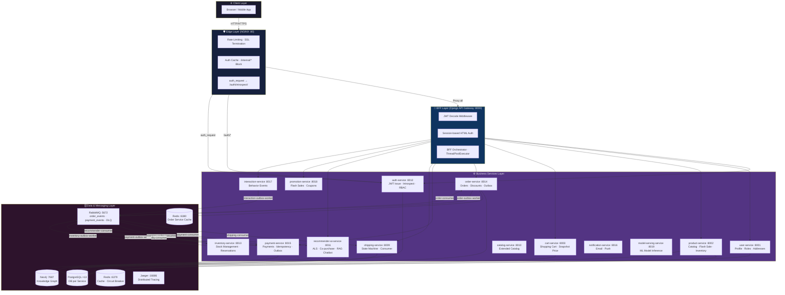
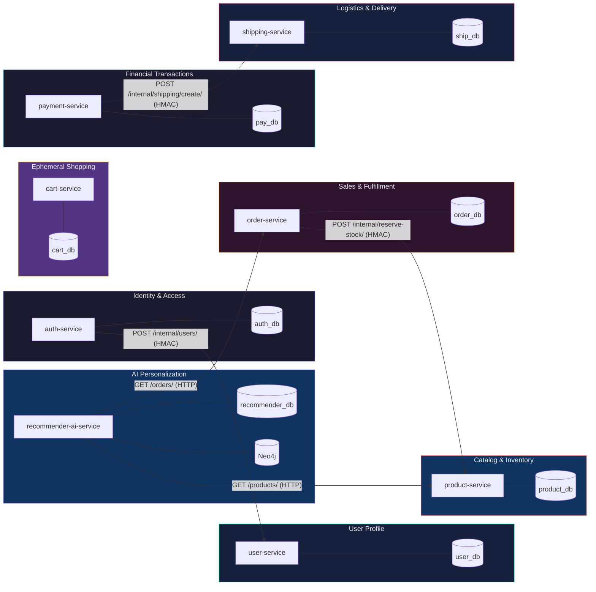
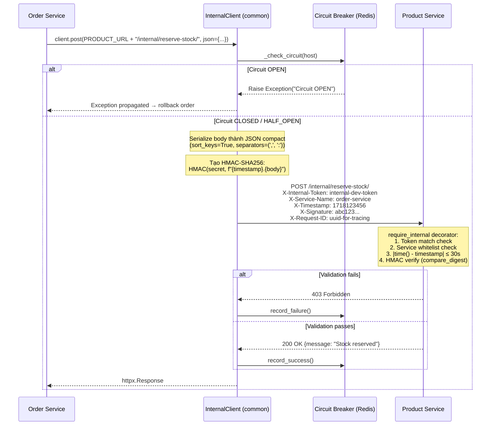
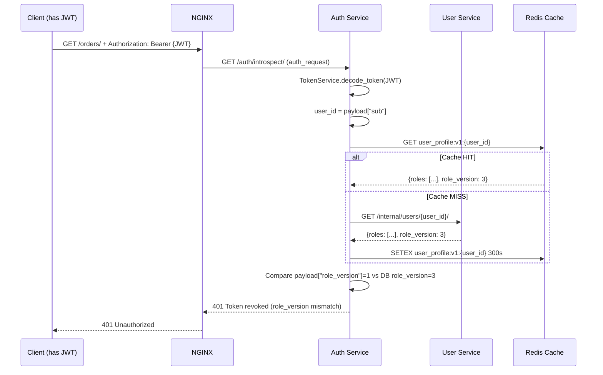
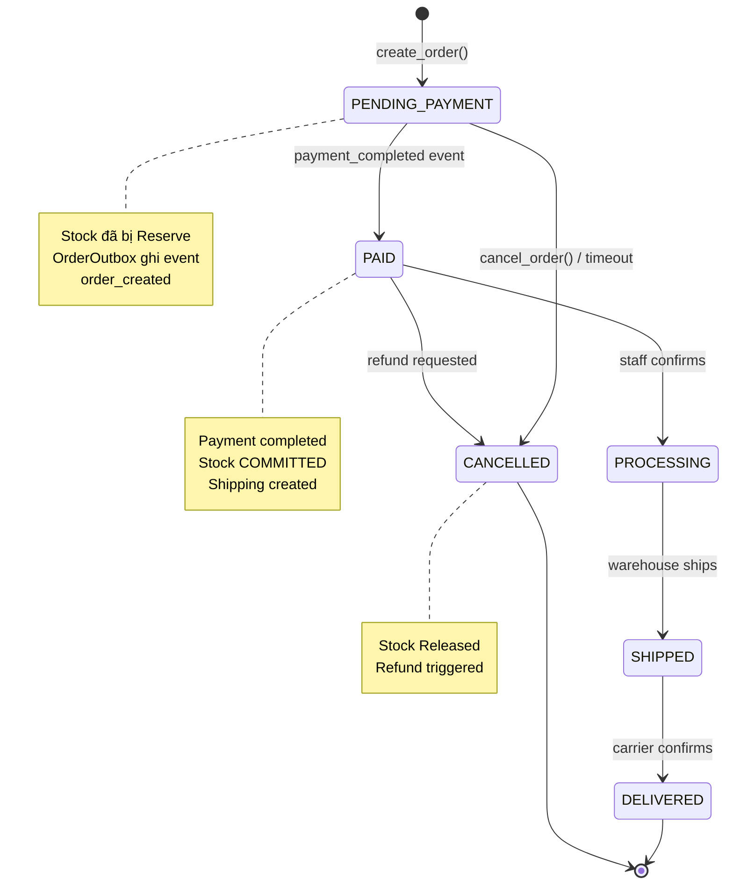
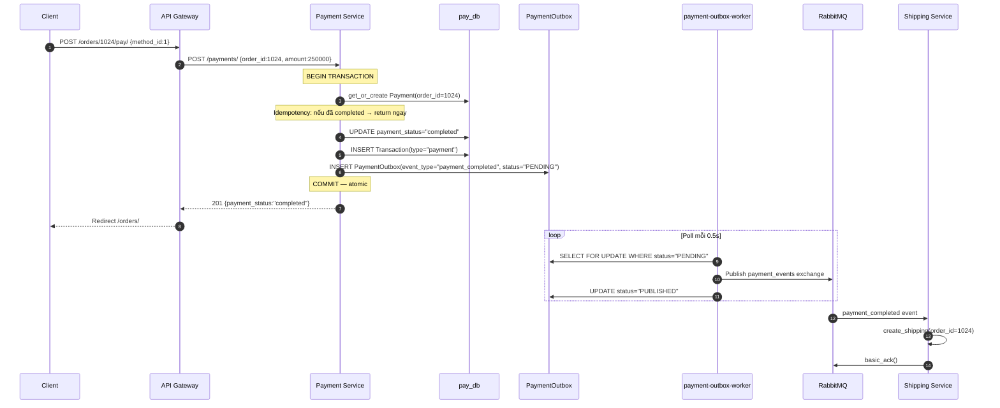
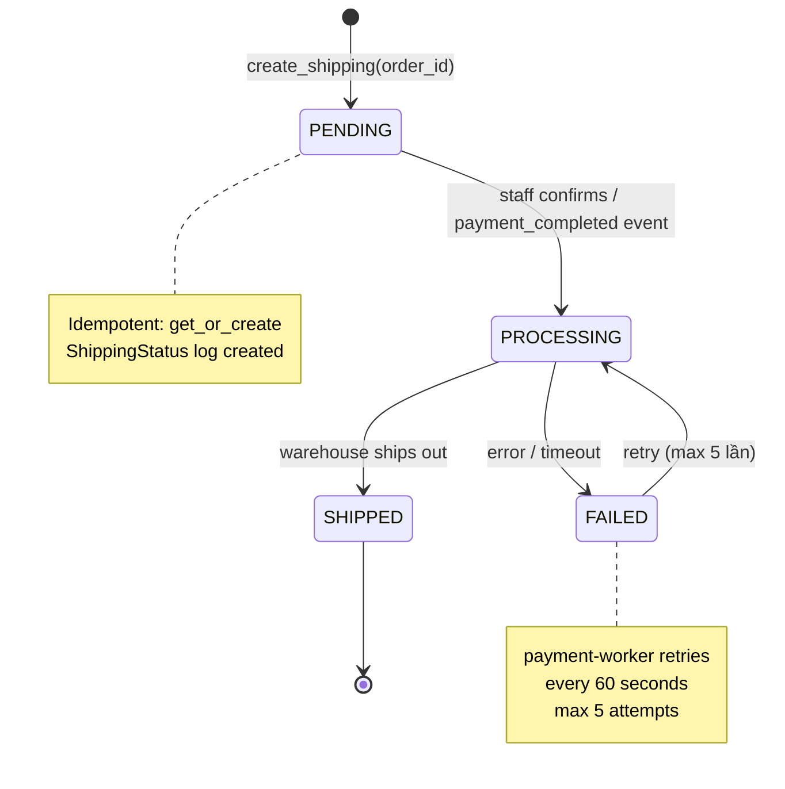
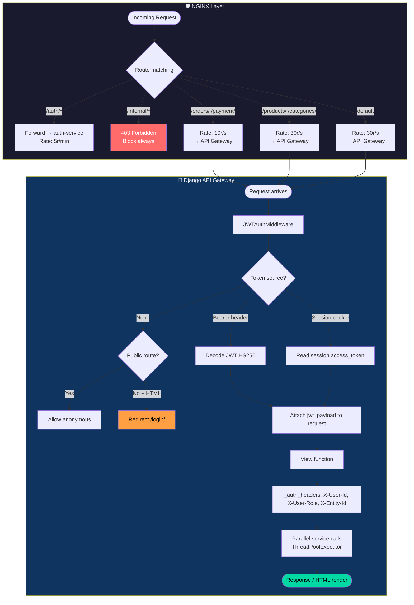

# CHƯƠNG 2: PHÁT TRIỂN HỆ THỐNG E-COMMERCE MICROSERVICES

Chương này trình bày chi tiết và chuyên sâu về thiết kế kiến trúc phần mềm (Software Architecture Design) và quá trình xây dựng nền tảng hệ thống thương mại điện tử. Cốt lõi của hệ thống là luồng dữ liệu giao dịch tài chính phải đảm bảo tính nguyên tử (Atomicity), chịu tải cao (High Throughput) và độ trễ thấp. Để giải quyết bài toán tự động thu phóng (Auto-Scalability) và Tính sẵn sàng cao (High Availability), hệ thống từ bỏ hoàn toàn mô hình Monolith cổ điển để áp dụng kiến trúc phân tán Microservices.

Toàn bộ hệ thống được triển khai bằng **Python 3.10 + Django 4.2 + Django REST Framework**, chạy hoàn toàn trong Docker container, điều phối bởi Docker Compose với hơn **30 containers** bao gồm cả services, workers, consumers, databases và middleware hỗ trợ.

## 2.1 Xác định yêu cầu hệ thống

Phân tích yêu cầu là khâu đầu tiên và sống còn để định hình ranh giới các tính năng phần mềm. Trong hệ thống phân tán, nếu yêu cầu không rõ ràng, các dịch vụ sẽ bị thiết kế chồng chéo, dính chặt vào nhau. Hậu quả là việc nâng cấp một tính năng nhỏ cũng có thể gây ra hiệu ứng domino làm sụp đổ toàn bộ dây chuyền.

### 2.1.1 Yêu cầu chức năng (Functional Requirements)

#### FR-01: Xác thực và Cấp phép Phi trạng thái (Stateless Authentication & RBAC)

Hệ thống loại bỏ hoàn toàn cơ chế Cookie/Session truyền thống lưu trên RAM máy chủ. Thay vào đó, nền tảng sử dụng JSON Web Token (JWT) với thuật toán **HS256** thông qua thư viện `djangorestframework-simplejwt`. Access token có thời hạn **1440 phút (24 giờ)**, Refresh token **7 ngày**.

JWT Payload được thiết kế đặc biệt để chứa sẵn đủ thông tin cho downstream services, tránh truy vấn CSDL ngược lại:

```json
{
  "sub": "uuid-of-auth-user",
  "user_id": "uuid-of-auth-user",
  "username": "customer1",
  "roles": ["CUSTOMER"],
  "status": "ACTIVE",
  "role_version": 1,
  "entity_id": "42"
}
```

Điểm then chốt của thiết kế này là trường `role_version` — một số nguyên tăng dần mỗi khi quyền của user thay đổi. NGINX sẽ gọi endpoint `/auth/introspect/` để xác minh token, endpoint này so sánh `role_version` trong JWT với `role_version` hiện tại trong database. Nếu không khớp, token bị từ chối ngay lập tức, giải quyết bài toán **token revocation** mà không cần blacklist.

Hệ thống định nghĩa **6 roles** phân cấp: `CUSTOMER`, `SELLER`, `STAFF`, `ADMIN`, `SUPER_ADMIN`, `SUPPORT`. Trong đó `SUPER_ADMIN` và `ADMIN` có quyền truy cập tất cả tài nguyên nội bộ mà không cần kiểm tra thêm.

#### FR-02: Quản lý Vòng đời Giỏ hàng Đa nền tảng (Omnichannel Cart)

Giỏ hàng được duy trì liên tục và đồng bộ hóa ngay lập tức trên nhiều thiết bị. Dữ liệu giỏ hàng được lưu trữ độc lập khỏi các phiên làm việc (session) trình duyệt trong CSDL PostgreSQL riêng biệt (`cart_db`), sử dụng `customer_id` (chính là `entity_id` từ JWT) làm khóa định danh duy nhất.

Giỏ hàng hỗ trợ đầy đủ các thao tác CRUD với API RESTful:
- `GET /carts/{customer_id}/` — lấy giỏ hàng hiện tại
- `POST /cart/add/` — thêm sản phẩm
- `PATCH /carts/{customer_id}/items/{item_id}/` — cập nhật số lượng
- `DELETE /carts/{customer_id}/items/{item_id}/` — xóa sản phẩm
- `DELETE /carts/{customer_id}/` — xóa toàn bộ giỏ hàng
- `GET /internal/cart/{customer_id}/` — nội bộ dành cho Order Service

Mỗi `CartItem` lưu snapshot giá (`unit_price`) tại thời điểm thêm vào giỏ, giúp tránh sai lệch khi giá sản phẩm thay đổi trước khi checkout. Model còn hỗ trợ trường `variant_id` để phục vụ sản phẩm có nhiều biến thể.

#### FR-03: Catalog sản phẩm và Quản lý Tồn kho (Product Catalog & Inventory)

Product Service cung cấp catalog sản phẩm đa tầng với **Category → Brand → Product → ProductVariant**. Mỗi sản phẩm hỗ trợ cột `attributes` kiểu JSONB cho phép lưu thuộc tính động không cố định schema (ví dụ: sách lưu `author`, `pages`; điện tử lưu `warranty`, `battery_capacity`).

Hệ thống hỗ trợ **Flash Sale** tích hợp với Promotion Service: các trường `is_flash_sale`, `flash_sale_price`, `flash_sale_ends_at` trên model `Product` cho phép hiển thị giá ưu đãi theo thời gian thực. Property `effective_price` tự động trả về đúng giá (sale hoặc gốc) sau khi kiểm tra hạn hạn flash sale.

Tồn kho được quản lý bằng hai lớp: `StockReservationLog` (ghi lại từng lần đặt hàng) và `InventoryTransaction` (audit log đầy đủ với 5 loại: `IMPORT`, `EXPORT`, `ORDER`, `RETURN`, `ADJUST`). Ngoài ra còn có worker `reconcile_stock` chạy định kỳ để phát hiện và hoàn trả tồn kho cho các đơn hàng bị rollback nhưng chưa được release.

#### FR-04: Chống Mua lố trong Đặt hàng (Overselling Prevention)

Luồng đặt hàng áp dụng cơ chế khóa bi quan (Pessimistic Locking) cấp độ dòng trong PostgreSQL:

1. `SELECT ... FOR UPDATE` trên các dòng sản phẩm bị ảnh hưởng
2. Sắp xếp `product_id` tăng dần để triệt tiêu chu trình Deadlock
3. Validate tồn kho trước khi trừ
4. Ghi `StockReservationLog` + `InventoryTransaction` trong cùng transaction

Đồng thời, có một worker `reconcile_stock` kiểm tra 5 phút/lần để phát hiện các reservation "mồ côi" (order không tồn tại hoặc bị huỷ) và tự động giải phóng tồn kho.

#### FR-05: Thanh toán và Nhất quán Phân tán (Payment & Distributed Consistency)

Payment Service xử lý vòng đời thanh toán với cơ chế **Idempotency** qua `unique=True` trên `order_id`. Mỗi lần gọi thanh toán cho cùng `order_id` đều trả về kết quả cũ nếu đã xử lý, tránh trừ tiền hai lần.

Sau khi xử lý thành công, Payment Service **không gọi trực tiếp** Shipping Service. Thay vào đó, nó ghi sự kiện `payment_completed` vào bảng `PaymentOutbox` trong cùng transaction với bản ghi thanh toán. Worker `payment-outbox-worker` sẽ relay sự kiện này lên RabbitMQ exchange `payment_events`. Shipping Consumer lắng nghe exchange này và tự động tạo vận đơn.

Nếu Shipping Service không phản hồi, worker `retry_failed_shipping` chạy mỗi 60 giây để thử lại tối đa 5 lần trước khi đánh dấu thất bại vĩnh viễn.

#### FR-06: Hệ thống Gợi ý AI Hybrid (AI Recommender)

Recommender AI Service tích hợp 3 tầng gợi ý kết hợp:
- **Tầng 1 — Implicit ALS / NMF** (weight 4.0): Matrix Factorization huấn luyện offline từ dữ liệu lịch sử mua hàng
- **Tầng 2 — Co-purchase Graph** (Neo4j): Phân tích "người mua A cũng mua B" từ đơn hàng thực tế
- **Tầng 3 — Behavior Scoring**: Tính điểm hành vi từ bảng `customer_behaviors` với trọng số phân cấp (`purchase=5.0`, `add_to_cart=3.0`, `review=2.5`, `view=1.0`, `search=0.4`, `remove_from_cart=-1.0`)

Kết quả cuối cùng là `Hybrid score = ALS×4.0 + co-purchase + behavior`, xếp hạng Top-K sản phẩm gợi ý. Nếu user chưa có lịch sử (Cold Start), hệ thống fallback về catalog đa dạng hóa (60/30/10 split theo category).

Ngoài ra, hệ thống tích hợp **RAG Chatbot** sử dụng Groq API với model `llama-3.1-8b-instant` để tư vấn mua sắm cá nhân hóa bằng ngôn ngữ tự nhiên.

#### FR-07: Vận chuyển và Theo dõi Đơn hàng (Shipping & Tracking)

Shipping Service quản lý vòng đời vận đơn bằng State Machine nghiêm ngặt: `PENDING → PROCESSING → SHIPPED`. Nhánh lỗi: `PROCESSING → FAILED → PROCESSING` (retry). Mỗi lần chuyển trạng thái đều được ghi vào bảng `ShippingStatus` làm audit log đầy đủ.

Shipping Consumer lắng nghe sự kiện `payment_completed` từ RabbitMQ để tự động tạo vận đơn, loại bỏ coupling trực tiếp với Payment Service.

### 2.1.2 Yêu cầu phi chức năng (Non-functional Requirements)

#### NFR-01: Hiệu năng và Tốc độ Đọc (Read-Heavy Performance)

Tỷ lệ Read/Write trong E-commerce thường dao động 100:1 đến 1000:1 — tức là 100 người xem sản phẩm mới có 1 người mua. Product Service triển khai **Redis Cache 2 tầng** để hấp thụ tải đọc:

| Cache Key Pattern | TTL | Mô tả |
|---|---|---|
| `product:list:v{version}:{page}:{page_size}:{keyword}:{cat_id}:{brand_id}:{min}:{max}:{sort}` | 180 giây | Cache danh sách sản phẩm với đầy đủ query params |
| `product:{pk}` | 600 giây | Cache chi tiết một sản phẩm |
| `product_list_version` | Persistent | Counter version-based invalidation |
| `user_permissions:v1:{user_id}` | 300 giây | Cache quyền user (User Service) |
| `user_profile:v1:{user_id}` | 300 giây | Cache profile user (Auth introspect) |

Cache key danh sách sản phẩm nhúng `version` từ counter `product_list_version` trong Redis. Mỗi khi có thay đổi (tạo/cập nhật sản phẩm, đặt hàng, hoàn trả), hàm `invalidate_product_cache()` gọi `INCR product_list_version`. Tất cả cache danh sách tự động stale ở request tiếp theo mà không cần enumerate và xóa từng key. Đây là kỹ thuật **Version-based Cache Invalidation**.

Phía NGINX cache kết quả `/auth/introspect/` trong **5 giây** per-token với `proxy_cache_key "$http_authorization"`, giảm tải đáng kể cho Auth Service.

Ở tầng User Service, quyền hạn user được cache và invalidate tự động qua **Django Signals** khi roles hoặc status thay đổi:

```python
# user-service/user/signals.py
@receiver(m2m_changed, sender=UserProfile.roles.through)
def on_user_roles_changed(sender, instance, action, **kwargs):
    if action in ['post_add', 'post_remove', 'post_clear']:
        # Atomic: tăng role_version + xóa 2 cache keys trong 1 thao tác
        UserProfile.objects.filter(pk=instance.auth_user_id).update(
            role_version=models.F('role_version') + 1
        )
        cache.delete(f"user_permissions:v1:{instance.auth_user_id}")
        cache.delete(f"user_profile:v1:{instance.auth_user_id}")
```

#### NFR-02: Tính Chịu lỗi (Fault Tolerance) và Khả năng Phục hồi (Resilience)

**Circuit Breaker Pattern** (Redis-backed) được triển khai trong `common/common/client.py`. State được lưu dưới key `circuit:{hostname}` với cấu trúc JSON. TTL 3600 giây đảm bảo state tự dọn sạch.

```
CLOSED  ──[3 failures liên tiếp]──►  OPEN  ──[sau 15s]──►  HALF_OPEN
   ▲                                                             │
   └───────────────────[success]──────────────────────────────────┘
```

Cơ chế retry với **Exponential Backoff**: lần 1 sau 0.5s, lần 2 sau 1.0s, lần 3 sau 2.0s.

Auth Service sử dụng `UpstreamClient` riêng với thư viện `tenacity` (retry tối đa 2 lần, backoff `min=0.2s, max=2s, multiplier=0.2`), Circuit Breaker in-memory với ngưỡng 5 lần thất bại, reset 30 giây.

**Dead Letter Queue (DLQ)**: Message thất bại trong RabbitMQ được route vào exchange `dlx` → queue `dlq` qua argument `x-dead-letter-exchange`. Worker `dlq-consumer` lưu vào bảng `DLQEvent` để phân tích và replay thủ công.

**Retry Shipping**: Worker `payment-worker` (`retry_failed_shipping`) chạy mỗi 60 giây để thử lại vận đơn thất bại, tối đa 5 lần: `while true; do python manage.py retry_failed_shipping; sleep 60; done`.

#### NFR-03: Tính Nhất quán Cuối cùng (Eventual Consistency)

Hệ thống chấp nhận độ trễ 0.5–2 giây giữa các microservices thông qua **Outbox Pattern + RabbitMQ**. Nguyên tắc cốt lõi: mọi sự kiện quan trọng phải được ghi vào bảng Outbox trong **cùng một database transaction** với dữ liệu nghiệp vụ.

Hiện tại có **4 cặp Outbox + Worker** hoạt động độc lập:

| Outbox Table | Worker Container | Exchange Target | Consumers |
|---|---|---|---|
| `order_outbox` | `order-outbox-worker` | `order_events` (fanout) | `payment-consumer`, `order-consumer`, `recommender-consumer` |
| `payment_outbox` | `payment-outbox-worker` | `payment_events` (fanout) | `shipping-consumer` |
| `interaction_outbox` | `interaction-outbox-worker` | (interaction events) | `recommender-consumer` |
| `inventory_outbox` | `inventory-outbox-worker` | (inventory events) | `inventory-order-consumer` |

`AbstractOutboxEvent` (`common/common/outbox.py`) là base class chung với các trường: `aggregate_id`, `event_type`, `payload` (JSON), `status` (PENDING/PUBLISHED/FAILED), `retry_count`, `error_message`, `created_at`, `published_at`.

#### NFR-04: Bảo mật và Zero-Trust Nội bộ (Internal Zero-Trust Security)

Decorator `@require_internal` trong `common/common/auth.py` thực hiện **4 lớp kiểm tra** theo thứ tự:

1. **Token check**: `X-Internal-Token` header phải khớp `INTERNAL_TOKEN` env var
2. **Service whitelist**: `X-Service-Name` phải nằm trong `INTERNAL_ALLOWED_SERVICES` (cấu hình per-service)
3. **Replay Attack check**: `|time.time() - X-Timestamp| ≤ INTERNAL_SIGNATURE_TOLERANCE (30s)`
4. **HMAC-SHA256**: `expected = HMAC(INTERNAL_SIGNING_SECRET, f"{timestamp}.{body}")` rồi so sánh bằng `hmac.compare_digest()` (constant-time, chống Timing Attack)

Ví dụ cấu hình whitelist của User Service (docker-compose.yml):
```
INTERNAL_ALLOWED_SERVICES=auth-service,order-service,payment-service,product-service,cart-service,shipping-service,user-service,recommender-ai-service,api-gateway
```

#### NFR-05: Khả năng Quan sát (Observability)

**Distributed Tracing**: `RequestIDMiddleware` (thread-local, `common/common/middleware.py`) gán UUID cho mỗi request, truyền qua `X-Request-ID` header. `InternalClient` forward header này. `EventPublisher` nhúng `trace_id` vào message payload. Jaeger (port 16686) thu thập traces qua OTLP (port 4317/4318).

**Structured Logging**: `JSONFormatter` (`common/common/logging.py`) xuất log JSON chuẩn với `timestamp`, `level`, `service_name`, `trace_id`, `message`, và các trường metric tùy chọn: `latency_ms`, `status_code`, `target_service`, `span` (format: `source-service→target`).

**Health Endpoints**: Auth Service expose `/health/live/` và `/health/ready/` (kiểm tra DB connection). Docker Compose dùng endpoint `live` cho healthcheck với `interval: 10s, timeout: 3s, retries: 5`.

#### NFR-06: Khả năng Khởi động Thứ tự (Ordered Bootstrap)

Worker/consumer containers cần đợi schema database. Module `common/common/wait_for_tables.py` poll PostgreSQL đến khi bảng target tồn tại:

```
WAIT_FOR_TABLE=payments          → payment-worker đợi schema
WAIT_FOR_TABLE=order_outboxevent → order-outbox-worker đợi migration
WAIT_FOR_TABLE=shippings         → shipping-consumer đợi schema
WAIT_FOR_TABLE=customer_behaviors → recommender-consumer đợi schema
```

### 2.1.3 Ràng buộc Công nghệ (Technical Constraints)

| Thành phần | Công nghệ | Phiên bản | Ghi chú |
|---|---|---|---|
| Ngôn ngữ & Framework | Python + Django + DRF | 3.10 / 4.2 / 3.14 | Tất cả services |
| HTTP Internal Client | httpx | ≥ 0.24 | Async-compatible, non-blocking |
| JWT | djangorestframework-simplejwt | ≥ 5.3 | HS256, token blacklist, rotate refresh |
| Retry library | tenacity | ≥ 8.2 | Auth Service UpstreamClient |
| CSDL giao dịch | PostgreSQL | 15 Alpine | 13 databases riêng biệt |
| Graph DB | Neo4j | 5 Community | Knowledge graph cho AI Recommender |
| Cache & Circuit Breaker | Redis | 7 Alpine | 2 instances (port 6381, 6380 host) |
| Message Broker | RabbitMQ | 3 Management | port 5672/15672, fanout + DLQ |
| Reverse Proxy | NGINX | Alpine | Rate limiting, auth caching 5s |
| Container orchestration | Docker Compose | v3 | 30+ containers |
| Distributed Tracing | Jaeger | latest | OTLP exporter port 4317/4318 |
| AI/LLM | Groq API (llama-3.1-8b-instant) | — | RAG Chatbot, env: `GROQ_API_KEY` |
| Embedding | paraphrase-multilingual-MiniLM-L12-v2 | — | Vietnamese semantic search |

**Tài khoản mặc định** (bootstrap qua `bootstrap_default_users`): `admin/Admin@12345`, `customer1/password123` → `customer3/password123`, `staff1/password123` → `staff2/password123`, `manager1/password123`.

**Thứ tự phụ thuộc startup quan trọng:** Auth Service phụ thuộc `auth-db` (healthy) + `redis` (started) + `user-service` (started). Command `bootstrap_default_users` có cơ chế `_wait_for_user_service()` polling tối đa 60 lần × 2 giây = 120 giây trước khi timeout.

## 2.2 Phân rã hệ thống theo Định hướng Miền (DDD)

Domain-Driven Design (DDD) là phương pháp luận thiết kế phần mềm đặt mô hình nghiệp vụ (domain model) làm trung tâm. Nguyên tắc cốt lõi là **Bounded Context** — mỗi miền nghiệp vụ rõ ràng có ranh giới rõ ràng, ngôn ngữ riêng và dữ liệu riêng. Thay vì có một cơ sở dữ liệu chia sẻ với hàng chục bảng JOIN phức tạp, mỗi Bounded Context sở hữu CSDL riêng biệt hoàn toàn và giao tiếp qua API hoặc Message Queue.

### 2.2.0 Sơ đồ Kiến trúc Tổng thể

Hệ thống được tổ chức theo **5 tầng** (layers):



*Hình 2.1: Kiến trúc tổng thể hệ thống E-commerce Microservices — 14 services, 13 databases, 30+ containers*

### 2.2.1 Bounded Context và Phân rã Microservices

Hệ thống được phân rã thành **14 Microservices** độc lập, mỗi service sở hữu một CSDL PostgreSQL riêng biệt hoàn toàn. Đây là triết lý **Database per Service** — không có bất kỳ cross-database JOIN nào ở tầng SQL:

| Service | Port (host) | Database | Bounded Context | Workers/Consumers |
|---|---|---|---|---|
| `auth-service` | 8012 | `auth_db` | Identity & Access Management | — |
| `user-service` | 8001 | `user_db` | User Profile & RBAC | — |
| `product-service` | 8002 | `product_db` | Catalog & Inventory | `reconcile_stock`, `sync_flash_sales` |
| `catalog-service` | 8010 | `catalog_db` | Extended Catalog | — |
| `inventory-service` | 8013 | `inventory_db` | Stock Reservations | `inventory-outbox-worker`, `inventory-order-consumer` |
| `cart-service` | 8003 | `cart_db` | Ephemeral Shopping | — |
| `order-service` | 8014 | `order_db` | Sales & Fulfillment | `order-outbox-worker`, `order-consumer` |
| `payment-service` | 8015 | `pay_db` | Financial Transactions | `payment-consumer`, `payment-outbox-worker`, `payment-worker`, `dlq-consumer` |
| `shipping-service` | 8009 | `ship_db` | Logistics & Delivery | `shipping-consumer` |
| `notification-service` | 8016 | `notification_db` | Notifications | — |
| `interaction-service` | 8017 | `interaction_db` | Behavior Events | `interaction-outbox-worker` |
| `promotion-service` | 8018 | `promotion_db` | Flash Sales & Coupons | — |
| `recommender-ai-service` | 8011 | `recommender_db` + Neo4j | AI Personalization | `recommender-consumer` |
| `model-serving-service` | 8019 | — | ML Model Inference | — |

Ngoài ra, hệ thống còn có:
- **`api-gateway`** (port 8000): Django BFF (Backend-For-Frontend) — orchestrates service calls, renders HTML
- **`nginx`** (port 80): Reverse proxy thực sự — rate limiting, SSL termination, auth caching

**Hai Redis riêng biệt:**
- Redis chính (port 6381→6379): dùng cho Product cache, Circuit Breaker state (tất cả services), User permission cache
- Redis Order (port 6380→6379): dùng riêng cho Order Service idempotency và caching

### 2.2.2 Sơ đồ Bounded Context và Database per Service



*Hình 2.2: Bounded Context và Database per Service — không có Cross-Database JOIN*

### 2.2.3 Quy tắc Giao tiếp Liên Dịch vụ (Inter-service Communication Rules)

Giao tiếp giữa các services được chia thành 2 loại chính:

**Loại 1 — Synchronous (Đồng bộ): REST API qua `InternalClient` với HMAC + Circuit Breaker**

Dùng khi cần phản hồi tức thì để tiếp tục xử lý — ví dụ: Order Service cần xác nhận tồn kho trước khi commit đơn hàng.



*Hình 2.3: Luồng giao tiếp đồng bộ nội bộ với HMAC và Circuit Breaker Redis-backed*

Code thực tế của `InternalClient` trong `common/common/client.py`:

```python
# common/common/client.py
class InternalClient:
    def __init__(self, timeout=2.0, max_retries=2):
        self.timeout = timeout
        self.max_retries = max_retries
        self.service_name = os.environ.get("SERVICE_NAME", "unknown_service")
        self.internal_token = os.environ.get("INTERNAL_TOKEN", "internal-dev-token")
        self.signing_secret = os.environ.get("INTERNAL_SIGNING_SECRET", "internal-signing-secret")
        self.fail_threshold = 3   # Mở circuit sau 3 lần thất bại liên tiếp
        self.reset_timeout = 15   # Reset circuit sau 15 giây

    def _generate_signature(self, timestamp: str, body: str) -> str:
        """HMAC-SHA256: HMAC(signing_secret, f"{timestamp}.{body}")"""
        return hmac.new(
            self.signing_secret.encode("utf-8"),
            f"{timestamp}.{body}".encode("utf-8"),
            hashlib.sha256,
        ).hexdigest()

    def _get_headers(self, request_body: str = "") -> dict:
        request_id = get_request_id() or "unknown-req-id"
        timestamp = str(int(time.time()))
        signature = self._generate_signature(timestamp, request_body)
        return {
            "X-Request-ID":    request_id,
            "X-Trace-ID":      request_id,    # Alias cho distributed tracing
            "X-Service-Name":  self.service_name,
            "X-Timestamp":     timestamp,
            "X-Signature":     signature,
            "X-Internal-Token": self.internal_token,
            "Content-Type":    "application/json"
        }

    def request(self, method: str, url: str, **kwargs) -> httpx.Response:
        host = self._get_host(url)
        cb_state = self._check_circuit(host)    # Raises nếu OPEN
        
        # Serialize JSON để tính signature chính xác (compact + sorted keys)
        if "json" in kwargs:
            request_body = json.dumps(kwargs.pop("json"),
                                      separators=(",", ":"), sort_keys=True)
            kwargs["data"] = request_body
        
        headers = kwargs.pop("headers", {})
        headers.update(self._get_headers(request_body))
        
        attempt, backoff = 0, 0.5
        with httpx.Client(timeout=self.timeout) as client:
            while attempt <= self.max_retries:
                try:
                    response = client.request(method, url, headers=headers, **kwargs)
                    if 500 <= response.status_code < 600:
                        raise httpx.HTTPStatusError(...)
                    self._record_success(host, cb_state)
                    return response
                except (httpx.TimeoutException, httpx.NetworkError,
                        httpx.HTTPStatusError):
                    self._record_failure(host, cb_state)   # Cập nhật state Redis
                    attempt += 1
                    time.sleep(backoff)
                    backoff *= 2   # Exponential backoff: 0.5 → 1.0 → 2.0s
```

**Circuit Breaker State Machine (Redis-backed):**

State được lưu trong Redis với key `circuit:{hostname}`, cấu trúc JSON: `{"status": "OPEN|CLOSED|HALF_OPEN", "failures": 3, "last_failure_time": 1718123456.789}`. TTL 3600 giây.

```
CLOSED  ──[3 failures]──►  OPEN  ──[15 seconds]──►  HALF_OPEN
   ▲                                                      │
   └──────────[success]────────────────────────────────────┘
                                  │
   ┌──────────[failure]───────────┘
   ▼
  OPEN
```

**Loại 2 — Asynchronous (Bất đồng bộ): Outbox Pattern + RabbitMQ**

Dùng cho các thao tác không yêu cầu phản hồi tức thì — ví dụ: Order Service thông báo cho Payment Service, Payment Service kích hoạt Shipping Service.

```mermaid
sequenceDiagram
    participant OS as Order Service
    participant DB as order_db
    participant OBX as order_outbox table
    participant W as order-outbox-worker container
    participant MQ as RabbitMQ (fanout: order_events)
    participant PC as payment-consumer container
    participant SC as shipping-consumer container

    rect rgb(30, 50, 80)
        Note over OS,OBX: TRONG CÙNG 1 TRANSACTION (ACID)
        OS->>DB: INSERT orders (..., status='pending_payment')
        OS->>OBX: INSERT order_outbox(event_type='order_created', status='PENDING')
        OS->>DB: COMMIT
    end

    loop Poll mỗi 0.5s
        W->>OBX: SELECT FOR UPDATE WHERE status='PENDING' LIMIT 50
        W->>MQ: basic_publish(exchange='order_events', body=JSON)
        W->>OBX: UPDATE status='PUBLISHED', published_at=now()
    end

    Note over MQ: fanout exchange → broadcast to ALL bound queues
    MQ->>PC: Deliver to 'payment_order_consumer' queue
    MQ->>SC: Deliver to 'shipping_order_consumer' queue (nếu có)

    PC->>PC: Idempotency: Payment.objects.filter(order_id=X).exists() ?
    PC->>PC: Process + ghi PaymentOutbox
    PC->>MQ: basic_ack()

    Note over W,OBX: Nếu publish thất bại → retry_count++ → sau 5 lần → FAILED
```



*Hình 2.4: Outbox Pattern đảm bảo at-least-once delivery — không mất event kể cả khi crash*

Code thực tế của `EventPublisher` trong `common/common/events.py`:

```python
# common/common/events.py
class EventPublisher:
    @classmethod
    def _setup_topology(cls):
        channel = cls._channel
        # Dead Letter Exchange — nhận message thất bại từ consumer
        channel.exchange_declare(exchange='dlx', exchange_type='direct', durable=True)
        channel.queue_declare(queue='dlq', durable=True)
        channel.queue_bind(queue='dlq', exchange='dlx', routing_key='dlq')
        # Business Exchanges — fanout: gửi tới TẤT CẢ subscribers không cần routing key
        channel.exchange_declare(exchange='order_events',   exchange_type='fanout', durable=True)
        channel.exchange_declare(exchange='payment_events', exchange_type='fanout', durable=True)

    @classmethod
    def publish(cls, exchange: str, event_type: str, data: dict, version: int = 1):
        trace_id = get_request_id() or "unknown"
        payload = {
            "event_type": event_type,
            "version":    version,         # Schema versioning cho backward compatibility
            "data":       data,
            "trace_id":   trace_id,        # Propagate request ID cho distributed tracing
            "timestamp":  datetime.now(timezone.utc).isoformat()
        }
        channel = cls.get_channel()
        channel.basic_publish(
            exchange=exchange,
            routing_key="",               # fanout: routing key không dùng
            body=json.dumps(payload),
            properties=pika.BasicProperties(
                delivery_mode=2,          # Persistent: lưu xuống disk, tồn tại qua restart
                headers={
                    "trace_id": trace_id,
                    "span": f"{SERVICE_NAME}->{exchange}"
                }
            )
        )
```

**Schema chuẩn của mỗi Event Message:**
```json
{
    "event_type": "order_created",
    "version": 1,
    "trace_id": "uuid-for-end-to-end-tracing",
    "timestamp": "2026-06-12T10:30:00.000Z",
    "data": {
        "order_id": 1024,
        "customer_id": 42,
        "total_amount": "250000",
        "items": [{"product_id": 5, "quantity": 2}]
    }
}
```

### 2.2.4 Lợi ích Phân mảnh Dữ liệu và Nguyên tắc Bất biến (Data Isolation & Immutability)

Mỗi service sở hữu CSDL độc lập — không có Cross-Database JOIN nào ở tầng SQL. Thay vì khóa ngoại vật lý, hệ thống dùng **Soft-links** (khóa mềm): `customer_id`, `product_id`, `order_id` là các số nguyên tham chiếu lẫn nhau mà không enforce foreign key constraint ở database layer. Điều này mang lại 3 lợi ích lớn:

1. **Fault Isolation**: Khi `product_db` quá tải, `order_db` vẫn hoàn toàn sẵn sàng để xử lý checkout. Không có domino effect.

2. **Independent Scaling**: Mỗi service có thể scale ngang độc lập. `product-service` chịu tải đọc 1000 req/s có thể chạy 5 replicas trong khi `auth-service` chạy 1 replica.

3. **Schema Evolution**: `product-service` thêm cột mới trong database không ảnh hưởng bất kỳ service nào khác.

**Nguyên tắc Bất biến Dữ liệu (Immutability):** Bảng `OrderItem` chốt cứng `unit_price` tại thời điểm tạo đơn hàng. Dù giá sản phẩm thay đổi sau này, hóa đơn cũ không bao giờ bị ảnh hưởng — đây là nguyên tắc bất biến của sổ cái kế toán. Tương tự, `CartItem.unit_price` lưu snapshot giá lúc thêm vào giỏ, không phải giá thời điểm checkout.

## 2.3 Thiết kế Auth Service

Auth Service là cổng vào (entry point) duy nhất cho tất cả luồng xác thực. Service này chịu trách nhiệm hoàn toàn cho Identity & Access Management: đăng ký, đăng nhập, cấp phát JWT, token introspection, và kiểm tra quyền truy cập.

### 2.3.0 Sơ đồ Luồng Đăng ký và Đăng nhập

```mermaid
flowchart TD
    A([Client POST /auth/register/]) --> B{RegisterSerializer<br/>validate}
    B -->|Invalid| C[400 Bad Request]
    B -->|Valid| D{Role in CUSTOMER,<br/>SELLER only?}
    D -->|No| E[400 Only CUSTOMER/SELLER<br/>via public registration]
    D -->|Yes| F{AuthUser.filter<br/>username/email exists?}
    F -->|Exists| G[400 Already taken/registered]
    F -->|New| H[CREATE AuthUser<br/>Django AbstractBaseUser<br/>UUID PK · PBKDF2-SHA256]

    H --> I[UpstreamClient.post<br/>POST /internal/users/<br/>HMAC signed]
    I -->|400/409| J[ValidationError from user-service]
    J --> K[user.delete · Compensating Tx]
    K --> L([400 Profile creation failed])
    I -->|5xx/timeout| M[UpstreamServiceError<br/>retryable=True]
    M --> N[tenacity retry 2x<br/>backoff 0.2→2s]
    N -->|All fail| K
    I -->|201 OK| O[_build_claims:<br/>sub, user_id, roles,<br/>status, role_version, entity_id]

    O --> P[TokenService.issue_token_pair<br/>RefreshToken + claims]
    P --> Q[AuthAudit.objects.create<br/>event_type=register, success=True]
    Q --> R([201 Created<br/>access, refresh, user payload])

    S([Client POST /auth/login/]) --> T{_rate_limit_login<br/>5 req/60s per IP?}
    T -->|Exceeded| U[429 Too Many Requests<br/>+ AuthAudit rate_limited]
    T -->|OK| V{AuthUser.filter<br/>username OR email}
    V -->|Not found| W[401 Invalid credentials]
    V -->|Found| X{user.is_active?}
    X -->|False| W
    X -->|True| Y{locked_until > now?}
    Y -->|Locked| Z[401 Account Locked<br/>HTTP 423 AccountLocked]
    Y -->|Free| AA[UpstreamClient.get<br/>GET /internal/users/{id}/<br/>Fetch profile + roles]

    AA --> AB{profile.status<br/>SUSPENDED/BANNED?}
    AB -->|Yes| AC[401 Account is SUSPENDED]
    AB -->|ACTIVE| AD{role param match<br/>actual roles?}
    AD -->|Mismatch| AE[failed_login_count++<br/>→ lock if ≥5]
    AE --> AF[401 Invalid credentials]
    AD -->|Match| AG{user.check_password<br/>PBKDF2 verify}
    AG -->|Wrong| AE
    AG -->|Correct| AH[failed_login_count=0<br/>locked_until=None<br/>last_login_at=now]

    AH --> AI[_build_claims với<br/>roles từ profile<br/>role_version từ profile]
    AI --> AJ[TokenService.issue_token_pair]
    AJ --> AK[AuthAudit success]
    AK --> AL([200 OK access, refresh, user])

    style A fill:#6c63ff,color:#fff
    style S fill:#00d9a3,color:#000
    style R fill:#6c63ff,color:#fff
    style AL fill:#00d9a3,color:#000
    style C fill:#ff6b6b,color:#fff
    style U fill:#ff9f43,color:#000
    style Z fill:#ff6b6b,color:#fff
    style W fill:#ff6b6b,color:#fff
```

*Hình 2.5: Luồng đăng ký và đăng nhập đầy đủ — Rate Limiting, Account Lockout, Compensating Transaction*

### 2.3.1 Data Model: AuthUser và AuthAudit

Auth Service sử dụng **Django's AbstractBaseUser** thay vì model user mặc định để hoàn toàn kiểm soát schema. `AuthUser` dùng **UUID làm Primary Key** — đây là điểm khác biệt quan trọng so với auto-increment integer, giúp tránh enumeration attacks và hỗ trợ distributed ID generation.

```python
# auth-service/authentication/models.py
class AuthUser(AbstractBaseUser, PermissionsMixin):
    id = models.UUIDField(primary_key=True, default=uuid.uuid4, editable=False)
    username = models.CharField(max_length=150, unique=True)
    email = models.EmailField(unique=True)
    is_active = models.BooleanField(default=True)
    is_staff = models.BooleanField(default=False)   # True cho STAFF/ADMIN
    last_login_at = models.DateTimeField(null=True, blank=True)
    created_at = models.DateTimeField(auto_now_add=True)
    updated_at = models.DateTimeField(auto_now=True)

    # Thêm cho account lockout (tuỳ chọn — không bắt buộc trong base model)
    failed_login_count = models.IntegerField(default=0)     # nếu có
    locked_until = models.DateTimeField(null=True, blank=True)

    USERNAME_FIELD = 'username'
    REQUIRED_FIELDS = ['email']
    objects = AuthUserManager()

    class Meta:
        db_table = "auth_users"
        ordering = ["username"]

class RefreshToken(models.Model):
    """Blacklist cho token rotation"""
    id = models.UUIDField(primary_key=True, default=uuid.uuid4, editable=False)
    user = models.ForeignKey('authentication.AuthUser', on_delete=models.CASCADE,
                              related_name='refresh_tokens')
    token_hash = models.CharField(max_length=255, unique=True)
    expires_at = models.DateTimeField()
    revoked_at = models.DateTimeField(null=True, blank=True)
    created_at = models.DateTimeField(auto_now_add=True)

    class Meta:
        db_table = "refresh_tokens"

class AuthAudit(models.Model):
    """Ghi lại mọi sự kiện auth — tuân thủ ISO 27001 audit trail"""
    event_type = models.CharField(max_length=50)    # "login" | "register"
    user_id = models.UUIDField(null=True, blank=True)
    role = models.CharField(max_length=20, blank=True)
    entity_id = models.UUIDField(null=True, blank=True)
    success = models.BooleanField(default=False)
    ip_address = models.CharField(max_length=45, blank=True)
    user_agent = models.CharField(max_length=255, blank=True)
    failure_reason = models.CharField(max_length=255, blank=True)
    # "rate_limited" | "invalid_credentials" | "account_locked"
    # | "invalid_role" | "suspended" | "register_failed"
    created_at = models.DateTimeField(auto_now_add=True)

    class Meta:
        db_table = "auth_audit"
        ordering = ["-created_at"]
        indexes = [
            models.Index(fields=["user_id"]),
            models.Index(fields=["created_at"]),
            models.Index(fields=["event_type"]),
        ]
```

**Tại sao UUID PK?** So sánh với integer auto-increment:

| Tiêu chí | UUID | Integer |
|---|---|---|
| Enumeration Attack | Không thể đoán | `/users/1, /users/2, ...` dễ đoán |
| Distributed ID gen | Không cần central counter | Cần sequence |
| Index performance | Lớn hơn (16 bytes vs 4 bytes) | Nhỏ hơn |
| URL exposure | Safe (opaque) | Tiết lộ business data |

### 2.3.2 JWT Design và Token Payload

Hệ thống sử dụng `djangorestframework-simplejwt` với HS256. Cấu hình trong `auth_service/settings.py`:

```python
SIMPLE_JWT = {
    "ALGORITHM": "HS256",
    "SIGNING_KEY": os.environ.get("JWT_SECRET_KEY", "ecommerce-super-secret-jwt-2026"),
    "ACCESS_TOKEN_LIFETIME":  timedelta(minutes=1440),  # 24 giờ
    "REFRESH_TOKEN_LIFETIME": timedelta(days=7),
    "ROTATE_REFRESH_TOKENS":   True,   # Mỗi lần refresh → token mới
    "BLACKLIST_AFTER_ROTATION": True,  # Token cũ vào blacklist
}
```

JWT Claims được xây dựng từ `_build_claims()` trong `AuthService`:

```python
# auth-service/authentication/services.py
def _build_claims(self, user: AuthUser, profile: dict | None) -> dict:
    roles = profile.get("roles", ["CUSTOMER"]) if profile else ["CUSTOMER"]
    status = profile.get("status", "ACTIVE") if profile else "ACTIVE"
    role_version = profile.get("role_version", 1) if profile else 1

    claims = {
        "sub":          str(user.id),          # Standard JWT subject (UUID)
        "user_id":      str(user.id),          # Redundant nhưng thuận tiện
        "username":     user.username,
        "roles":        [r.upper() for r in roles],  # ["CUSTOMER"] | ["STAFF"] | ...
        "status":       status,                 # "ACTIVE" | "SUSPENDED" | "BANNED"
        "role_version": role_version,           # ← Key cho token revocation
        "entity_id":    str(profile.get("entity_id")) if profile and profile.get("entity_id")
                        else str(user.id),      # CustomerProfile.id hoặc StaffProfile.id
    }
    if profile and profile.get("department"):
        claims["entity_role"] = profile.get("position", "")
    return claims
```

**Cơ chế Token Revocation không cần Blacklist:**

Thông thường, JWT stateless không thể bị revoke trước khi hết hạn. Hệ thống này giải quyết bằng `role_version` counter trong JWT:



*Hình 2.6: Token revocation qua role_version — không cần blacklist database*

**Khi nào role_version tăng?** Django Signal `on_user_roles_changed` trong User Service tự động tăng `role_version` khi:
- User roles thay đổi (thêm/xóa/clear)
- User status thay đổi (ACTIVE → SUSPENDED)

### 2.3.3 Endpoint Introspect và NGINX auth_request

`IntrospectTokenView` tại `/auth/introspect/` là endpoint đặc biệt được NGINX gọi bằng `auth_request` directive. Endpoint này:

1. Validate JWT signature
2. Kiểm tra Redis cache cho profile (TTL 300s)
3. Nếu cache miss → gọi User Service
4. Kiểm tra `status` (từ chối SUSPENDED/BANNED)
5. So sánh `role_version`
6. Trả về HTTP 204 kèm headers: `X-User-Id`, `X-Username`, `X-Roles`, `X-User-Status`, `X-Role-Version`

```python
# auth-service/authentication/views.py
class IntrospectTokenView(APIView):
    permission_classes = [HasValidJWT]

    def get(self, request):
        token = TokenService.extract_token(request)
        payload = TokenService.decode_token(token)
        user_id = payload.get("sub", "")

        # Redis cache để tránh gọi user-service mỗi request
        redis_url = os.environ.get("REDIS_URL", "redis://redis:6379/0")
        r = redis.StrictRedis.from_url(redis_url, decode_responses=True)

        cache_key = f"user_profile:v1:{user_id}"
        cached_data = r.get(cache_key)
        if cached_data:
            profile = json.loads(cached_data)
        else:
            # Cache miss — Fail Closed: nếu user-service down → từ chối
            profile = _auth_service._fetch_profile(
                type('obj', (object,), {'id': user_id})
            )
            if profile:
                r.setex(cache_key, 300, json.dumps(profile))

        if not profile:
            raise AuthenticationFailed("User profile not found")

        current_status = profile.get("status", "ACTIVE")
        current_role_version = profile.get("role_version", 1)

        if current_status in ("SUSPENDED", "BANNED"):
            raise AuthenticationFailed(f"Account is {current_status}")

        if str(payload.get("role_version", 1)) != str(current_role_version):
            raise AuthenticationFailed("Token revoked due to role changes")

        # Trả về 204 + headers — NGINX sẽ forward headers này vào request gốc
        response = Response(status=status.HTTP_204_NO_CONTENT)
        response["X-User-Id"]     = str(user_id)
        response["X-Username"]    = str(payload.get("username", ""))
        roles = payload.get("roles", ["CUSTOMER"])
        response["X-Roles"]       = ",".join(roles) if isinstance(roles, list) else str(roles)
        response["X-User-Status"] = str(current_status)
        response["X-Role-Version"] = str(current_role_version)
        return response
```

### 2.3.4 Bảo mật Đăng nhập: Rate Limiting và Account Lockout

Auth Service triển khai **2 lớp bảo vệ** độc lập chống brute-force:

**Lớp 1 — IP Rate Limiting (Redis-backed):**
```python
# auth-service/authentication/views.py
def _rate_limit_login(ip_address: str) -> bool:
    """5 requests / 60 giây per IP — dùng Django cache (Redis)"""
    key = f"auth-login:{ip_address}"
    try:
        count = cache.incr(key)
    except ValueError:
        # Key chưa tồn tại — tạo mới với TTL
        cache.set(key, 1, timeout=settings.AUTH_LOGIN_RATE_WINDOW)  # 60s
        count = 1
    return count > settings.AUTH_LOGIN_RATE_LIMIT  # 5
```

Cấu hình trong settings: `AUTH_LOGIN_RATE_LIMIT=5`, `AUTH_LOGIN_RATE_WINDOW=60`. Vượt ngưỡng → HTTP 429 + ghi `AuthAudit` với `failure_reason="rate_limited"`.

**Lớp 2 — Account Lockout (Database):**
```python
# auth-service/authentication/services.py
def _register_failed_login(self, user, request_ip, user_agent, reason, role):
    if hasattr(user, 'failed_login_count'):
        user.failed_login_count += 1
        if user.failed_login_count >= settings.AUTH_MAX_FAILED_LOGINS:  # 5
            user.locked_until = timezone.now() + timedelta(
                minutes=settings.AUTH_LOCK_MINUTES  # 15 phút
            )
        user.save(update_fields=["failed_login_count", "locked_until"])
    self._audit("login", False, user, role, str(user.id),
                request_ip, user_agent, failure_reason=reason)
```

Cấu hình: `AUTH_MAX_FAILED_LOGINS=5`, `AUTH_LOCK_MINUTES=15`. Sau 5 lần sai → tài khoản bị lock 15 phút. Đăng nhập thành công → reset `failed_login_count=0`, `locked_until=None`.

### 2.3.5 UpstreamClient: Circuit Breaker + Retry với Tenacity

Auth Service sử dụng `UpstreamClient` riêng biệt (khác với `InternalClient` của common) với thư viện `tenacity` cho retry policy:

```python
# auth-service/authentication/services.py
class CircuitBreaker:
    """In-memory Circuit Breaker riêng cho Auth Service"""
    def __init__(self, failure_threshold: int, recovery_timeout: int):
        self.failure_threshold = failure_threshold  # 5 (từ AUTH_CIRCUIT_FAIL_THRESHOLD)
        self.recovery_timeout = recovery_timeout    # 30s (từ AUTH_CIRCUIT_RESET_SECONDS)
        self.failure_count = 0
        self.opened_at = None

    def allow(self) -> bool:
        if self.opened_at is None:
            return True   # CLOSED
        if time.time() - self.opened_at >= self.recovery_timeout:
            self.opened_at = None
            self.failure_count = 0
            return True   # HALF_OPEN: 1 request thử
        return False      # OPEN: từ chối

    def record_success(self):
        self.failure_count = 0
        self.opened_at = None   # → CLOSED

    def record_failure(self):
        self.failure_count += 1
        if self.failure_count >= self.failure_threshold:
            self.opened_at = time.time()   # → OPEN

class UpstreamClient:
    def __init__(self, base_url: str, name: str):
        self.base_url = base_url.rstrip("/")
        self.name = name
        self.breaker = CircuitBreaker(
            settings.AUTH_CIRCUIT_FAIL_THRESHOLD,   # 5
            settings.AUTH_CIRCUIT_RESET_SECONDS,    # 30
        )
        self.client = httpx.Client(timeout=settings.AUTH_SERVICE_TIMEOUT)  # 2s default, 5s trong compose

    @retry(
        wait=wait_exponential(multiplier=0.2, min=0.2, max=2),  # 0.2→0.4→...→2s
        stop=stop_after_attempt(settings.AUTH_RETRY_ATTEMPTS),   # 2 lần
        retry=retry_if_exception(
            lambda exc: isinstance(exc, UpstreamServiceError) and exc.retryable
        ),
        reraise=True,
    )
    def post(self, path: str, payload: dict, request_id: str | None = None) -> dict:
        if not self.breaker.allow():
            raise CircuitBreakerOpen(f"{self.name} circuit breaker is open")

        body = json.dumps(payload, separators=(",", ":"), sort_keys=True)
        try:
            response = self.client.post(
                f"{self.base_url}{path}",
                content=body,
                headers=self._signed_headers(body, request_id),
            )
        except httpx.RequestError as exc:
            self.breaker.record_failure()
            raise UpstreamServiceError(..., retryable=True) from exc

        if response.status_code >= 400:
            error = self._error_from_response(response)
            if error.retryable:     # status >= 500
                self.breaker.record_failure()
            else:
                self.breaker.record_success()
            raise error

        self.breaker.record_success()
        return self._safe_json(response)
```

**Sự khác biệt giữa `UpstreamClient` (auth-service) và `InternalClient` (common):**

| Đặc điểm | `UpstreamClient` | `InternalClient` |
|---|---|---|
| Circuit Breaker storage | In-memory (per process) | Redis (shared cross-process) |
| Retry library | `tenacity` | Manual exponential backoff |
| Fail threshold | 5 | 3 |
| Reset timeout | 30s | 15s |
| Return type | `dict` (JSON parsed) | `httpx.Response` |

### 2.3.6 Serializer và Validation

```python
# auth-service/authentication/serializers.py
class RegisterSerializer(serializers.Serializer):
    username = serializers.CharField(max_length=150)
    email    = serializers.EmailField()
    password = serializers.CharField(write_only=True)
    phone    = serializers.CharField(required=False, allow_blank=True)
    role     = serializers.CharField(required=False, allow_blank=True)
    # Staff-specific fields (optional)
    storage_code = serializers.CharField(required=False, allow_blank=True)
    department   = serializers.CharField(required=False, allow_blank=True)
    position     = serializers.CharField(required=False, allow_blank=True)

    def validate(self, attrs):
        role = normalize_role(attrs.get("role") or "CUSTOMER")
        # Public API chỉ cho phép tạo CUSTOMER hoặc SELLER
        if role not in ("CUSTOMER", "SELLER"):
            raise serializers.ValidationError(
                {"role": "public registration only creates CUSTOMER or SELLER accounts"}
            )
        attrs["role"] = role
        return attrs

    def validate_password(self, value):
        # Tối thiểu 8 ký tự
        validate_password_strength(value)
        return value

class LoginSerializer(serializers.Serializer):
    username = serializers.CharField(required=False, allow_blank=True)
    email    = serializers.EmailField(required=False, allow_blank=True)
    password = serializers.CharField()
    role     = serializers.CharField(required=False, allow_blank=True)

    def validate(self, attrs):
        identifier = (attrs.get("username") or attrs.get("email") or "").strip()
        if not identifier:
            raise serializers.ValidationError("username or email is required")
        attrs["identifier"] = identifier
        # role là optional — nếu có, validate và normalize
        if attrs.get("role"):
            attrs["role"] = normalize_role(attrs["role"])
        return attrs
```

**`normalize_role()` trong validators.py:**
```python
def normalize_role(role: str) -> str:
    value = (role or "").strip().upper()
    if value == "MANAGER":
        return "ADMIN"    # Legacy mapping
    if value not in ("CUSTOMER", "SELLER", "STAFF", "ADMIN", "SUPER_ADMIN"):
        raise ValueError("role must be CUSTOMER, SELLER, STAFF, ADMIN, or SUPER_ADMIN")
    return value
```

### 2.3.7 URL Endpoints Auth Service

```
POST /auth/register/     — đăng ký tài khoản mới (CUSTOMER | SELLER)
POST /auth/login/        — đăng nhập, nhận JWT pair
POST /auth/refresh/      — refresh access token
GET  /auth/introspect/   — validate token (NGINX auth_request endpoint)
GET  /users/me/          — lấy payload của token hiện tại
GET  /health/live/       — liveness probe
GET  /health/ready/      — readiness probe (check DB connection)
```

### 2.3.8 Bootstrap Tài khoản Mặc định

Command `bootstrap_default_users` chạy trong `entrypoint.sh` khi container khởi động, tạo sẵn 7 tài khoản mẫu (idempotent — chạy nhiều lần không tạo trùng):

| Username | Role | Password |
|---|---|---|
| admin | ADMIN | Admin@12345 |
| customer1, 2, 3 | CUSTOMER | password123 |
| staff1, staff2 | STAFF | password123 |
| manager1 | STAFF (position: Quản lý) | password123 |

Command có cơ chế `_wait_for_user_service()` — polling tối đa 60 lần × 2 giây = 120 giây. Nếu user-service trả về HTTP 404 (user không tồn tại), tức là service đang sẵn sàng.

## 2.4 Thiết kế User Service

User Service là kho lưu trữ trung tâm của mọi thông tin hồ sơ người dùng. Service này **hoàn toàn không có public API** — tất cả endpoints đều yêu cầu header HMAC nội bộ (`@require_internal`). Điều này đảm bảo không có request nào từ bên ngoài có thể truy cập dữ liệu người dùng trực tiếp.

### 2.4.1 Data Model: RBAC đầy đủ với Role-Permission Matrix

User Service thiết kế RBAC (Role-Based Access Control) theo chuẩn enterprise với các model:

```python
# user-service/user/models.py

class Permission(models.Model):
    """Quyền hạn nguyên tử — ví dụ: view_orders, manage_inventory"""
    code = models.CharField(max_length=100, unique=True)
    description = models.TextField(blank=True)

    class Meta:
        db_table = "permissions"

class Role(models.Model):
    """Role có thể gán nhiều Permission"""
    name = models.CharField(max_length=50, unique=True)  # CUSTOMER, STAFF, ADMIN...
    description = models.TextField(blank=True)
    is_system = models.BooleanField(default=True)
    permissions = models.ManyToManyField(
        Permission, related_name="roles", db_table="role_permissions"
    )

    class Meta:
        db_table = "roles"

class UserProfile(SoftDeleteModel):
    """Profile chính — auth_user_id là UUID từ auth-service, dùng làm PK"""
    auth_user_id = models.UUIDField(primary_key=True)   # Liên kết với AuthUser
    roles = models.ManyToManyField(Role, related_name="users", db_table="user_roles")
    status = models.CharField(
        max_length=20, choices=UserStatus.choices, default=UserStatus.ACTIVE
    )  # ACTIVE | SUSPENDED | BANNED | PENDING
    role_version = models.IntegerField(default=1)    # Tăng khi roles/status thay đổi

    full_name  = models.CharField(max_length=255)
    phone      = models.CharField(max_length=20, blank=True)
    avatar_url = models.URLField(blank=True)
    gender     = models.CharField(max_length=10, blank=True)
    birthday   = models.DateField(null=True, blank=True)
    created_at = models.DateTimeField(auto_now_add=True)
    updated_at = models.DateTimeField(auto_now=True)

    class Meta:
        db_table = "user_profiles"

class CustomerProfile(models.Model):
    """Profile bổ sung cho khách hàng"""
    user_profile = models.OneToOneField(
        UserProfile, on_delete=models.CASCADE, related_name="customer_profile"
    )
    loyalty_points = models.IntegerField(default=0)   # Điểm tích lũy

    class Meta:
        db_table = "customer_profiles"

class SellerProfile(SoftDeleteModel):
    """Profile bổ sung cho người bán"""
    user_profile = models.OneToOneField(
        UserProfile, on_delete=models.CASCADE, related_name="seller_profile"
    )
    store_name   = models.CharField(max_length=255)
    store_slug   = models.SlugField(max_length=255, unique=True)
    description  = models.TextField(blank=True)
    verification_status = models.CharField(
        max_length=20, choices=VerificationStatus.choices,
        default=VerificationStatus.PENDING
    )  # PENDING | APPROVED | REJECTED | SUSPENDED
    approved_by  = models.UUIDField(null=True, blank=True)
    approved_at  = models.DateTimeField(null=True, blank=True)
    created_at   = models.DateTimeField(auto_now_add=True)

    class Meta:
        db_table = "seller_profiles"

class StaffProfile(models.Model):
    """Profile bổ sung cho nhân viên"""
    user_profile = models.OneToOneField(
        UserProfile, on_delete=models.CASCADE, related_name="staff_profile"
    )
    storage_code = models.CharField(max_length=50, blank=True)  # Mã kho: WH-01, WH-02
    department   = models.CharField(max_length=255, blank=True)
    position     = models.CharField(max_length=255, blank=True)  # Nhân viên kho, Quản lý

    class Meta:
        db_table = "staff_profiles"

class WebAddress(models.Model):
    """Địa chỉ giao hàng của CustomerProfile"""
    customer       = models.ForeignKey(CustomerProfile, on_delete=models.CASCADE,
                                       related_name="addresses")
    recipient_name = models.CharField(max_length=255)
    address_line   = models.CharField(max_length=500)
    city           = models.CharField(max_length=100)
    state          = models.CharField(max_length=100, blank=True)
    country        = models.CharField(max_length=100)
    postal_code    = models.CharField(max_length=20)
    phone          = models.CharField(max_length=20, blank=True)
    is_default     = models.BooleanField(default=False)

    class Meta:
        db_table = "web_addresses"

class AuditLog(models.Model):
    """Audit log cho mọi thay đổi quan trọng trong user-service"""
    actor_id      = models.UUIDField(null=True, blank=True)
    action        = models.CharField(max_length=255)
    resource_type = models.CharField(max_length=100)
    resource_id   = models.CharField(max_length=255, blank=True)
    old_value     = models.TextField(blank=True)
    new_value     = models.TextField(blank=True)
    ip_address    = models.CharField(max_length=45, blank=True)
    created_at    = models.DateTimeField(auto_now_add=True)

    class Meta:
        db_table = "audit_logs"
        indexes = [
            models.Index(fields=["actor_id"]),
            models.Index(fields=["created_at"]),
            models.Index(fields=["resource_type"]),
            models.Index(fields=["action"]),
        ]
```

**Soft Delete Pattern:** `SoftDeleteModel` (base của `UserProfile`, `SellerProfile`) override `delete()` để set `deleted_at = timezone.now()` thay vì xóa vật lý. `SoftDeleteManager` tự động filter `deleted_at__isnull=True`. Phương thức `restore()` cho phép phục hồi. `all_objects = models.Manager()` để admin có thể xem cả records đã xóa.

### 2.4.2 RBAC Seeding và Permission Matrix

Command `seed_rbac` (`user/management/commands/seed_rbac.py`) định nghĩa 6 permissions cơ bản và gán vào các roles:

```python
# Permissions
perms = [
    ("view_users",       "Can view users"),
    ("manage_users",     "Can manage users"),
    ("view_orders",      "Can view orders"),
    ("manage_orders",    "Can manage orders"),
    ("manage_inventory", "Can manage inventory"),
    ("manage_catalog",   "Can manage product catalog"),
]

# Role-Permission Mapping
role_mappings = {
    "ADMIN":    ["view_users", "manage_users", "view_orders",
                 "manage_orders", "manage_inventory", "manage_catalog"],
    "STAFF":    ["view_orders", "manage_orders",
                 "manage_inventory", "manage_catalog"],
    "SUPPORT":  ["view_users", "view_orders"],
    "SELLER":   [],    # Handled via SellerProfile specialized checks
    "CUSTOMER": [],
}
```

`SUPER_ADMIN` có quyền bypass mọi permission check — được xử lý trong `HasPermission.has_permission()`.

### 2.4.3 Permission Cache với Django Signals

User permissions được cache trong Redis (`user_permissions:v1:{user_id}`, TTL 300s). Cache được invalidate tự động:

```python
# user-service/user/signals.py
def _invalidate_and_increment(user_id):
    """Atomic: increment role_version + invalidate 2 cache keys"""
    UserProfile.objects.filter(pk=user_id).update(
        role_version=models.F('role_version') + 1  # Atomic SQL UPDATE
    )
    cache.delete(f"user_permissions:v1:{user_id}")
    cache.delete(f"user_profile:v1:{user_id}")
    logger.info(f"Invalidated RBAC cache for user {user_id}")

@receiver(m2m_changed, sender=UserProfile.roles.through)
def on_user_roles_changed(sender, instance, action, **kwargs):
    """Trigger khi roles thay đổi (add/remove/clear)"""
    if action in ['post_add', 'post_remove', 'post_clear']:
        _invalidate_and_increment(instance.auth_user_id)

@receiver(post_save, sender=UserProfile)
def on_user_profile_saved(sender, instance, created, update_fields, **kwargs):
    """Trigger khi status thay đổi hoặc user mới tạo"""
    if update_fields and 'status' in update_fields:
        _invalidate_and_increment(instance.auth_user_id)
        return
    if created:
        _invalidate_and_increment(instance.auth_user_id)
```

`models.F('role_version') + 1` tạo câu SQL `UPDATE user_profiles SET role_version = role_version + 1 WHERE auth_user_id = ?` — atomic, không bị race condition.

### 2.4.4 Internal API Endpoints

```python
# user-service/user/urls.py
urlpatterns = [
    # Internal APIs (require @require_internal)
    path("internal/users/",                                    UserProfileView.as_view()),
    path("internal/users/<uuid:user_id>/",                     UserProfileView.as_view()),
    path("internal/users/<uuid:user_id>/addresses/",           AddressListView.as_view()),
    path("internal/users/<uuid:user_id>/addresses/<int:address_id>/", AddressDetailView.as_view()),
    path("internal/customers/",                                CustomerListView.as_view()),
    path("internal/customers/<int:customer_id>/",              CustomerDetailView.as_view()),

    # Public API (require @require_auth — JWT header)
    path("users/me/",     PublicUserProfileView.as_view()),   # Customer xem profile của mình
    path("api/users/me/", UserProfileView.as_view()),         # Legacy endpoint
]
```

**Logic POST /internal/users/ (tạo profile khi đăng ký):**

```python
# user-service/user/views.py — UserProfileView.post()
def post(self, request, user_id=None):
    data = request.data
    user = UserProfile.objects.create(
        auth_user_id=data["auth_user_id"],   # UUID từ auth-service
        full_name=data.get("full_name", ""),
        phone=data.get("phone", ""),
        status=UserStatus.ACTIVE
    )

    role_names = [r.upper() for r in data.get("roles", ["CUSTOMER"])]
    for r_name in role_names:
        role, _ = Role.objects.get_or_create(name=r_name)
        user.roles.add(role)   # → trigger on_user_roles_changed signal

    entity_id = None
    if "CUSTOMER" in role_names:
        p = CustomerProfile.objects.create(user_profile=user)
        entity_id = p.id    # entity_id là CustomerProfile.id (integer)

    if "SELLER" in role_names:
        p = SellerProfile.objects.create(
            user_profile=user,
            store_name=data.get("store_name", f"Store {user.auth_user_id}"),
            store_slug=data.get("store_slug", f"store-{user.auth_user_id}")
        )
        if not entity_id: entity_id = p.id

    if "STAFF" in role_names or "ADMIN" in role_names:
        p = StaffProfile.objects.create(
            user_profile=user,
            storage_code=data.get("storage_code", ""),
            department=data.get("department", ""),
            position=data.get("position", "")
        )
        if not entity_id: entity_id = p.id

    return Response({
        "id": user.auth_user_id,
        "auth_user_id": user.auth_user_id,
        "roles": role_names,
        "entity_id": entity_id   # Auth-service dùng để set JWT claims
    }, status=201)
```

`entity_id` được trả về trong response → Auth Service nhúng vào JWT claims. Tất cả downstream services dùng `entity_id` từ JWT header `X-Entity-Id` để nhận dạng customer/staff mà không cần biết UUID của `auth_user_id`.

### 2.4.5 Address Management API

User Service quản lý địa chỉ giao hàng của khách hàng qua `AddressListView` và `AddressDetailView`. Logic đặc biệt: chỉ có một địa chỉ `is_default=True` tại một thời điểm:

```python
# user-service/user/views.py — AddressListView.post()
def post(self, request, user_id):
    # Nếu chưa có address nào → tự động set is_default=True
    if not WebAddress.objects.filter(customer=profile).exists():
        is_default = True

    if is_default:
        # Reset tất cả address cũ về is_default=False
        WebAddress.objects.filter(customer=profile).update(is_default=False)

    addr = WebAddress.objects.create(
        customer=profile,
        recipient_name=data["recipient_name"],
        address_line=data["address_line"],
        city=data["city"],
        ...
        is_default=is_default
    )
    return Response({"id": addr.id}, status=201)
```


## 2.5 Thiết kế Product Service

Product Service là service chịu tải đọc lớn nhất (Read-Heavy) trong toàn hệ thống. Ngoài chức năng catalog cơ bản, service này còn tích hợp Flash Sale từ Promotion Service, quản lý tồn kho với audit log đầy đủ, và thực hiện khóa tồn kho chống overselling.

### 2.5.0 Sơ đồ Luồng Cache và Reserve Stock

```mermaid
flowchart TD
    subgraph READ["📖 Read Path — GET /products/"]
        R1([Request với params<br/>page, category, brand, price, sort, flash_sale]) --> R2{Redis INCR<br/>product_list_version}
        R2 --> R3[Build cache_key:<br/>product:list:v{ver}:{page}:{size}:{kw}:{cat}:{brand}:{min}:{max}:{sort}]
        R3 --> R4{Redis GET<br/>cache_key}
        R4 -->|HIT| R5([Return JSON ~1ms<br/>no DB query])
        R4 -->|MISS| R6[PostgreSQL query:<br/>select_related category brand<br/>prefetch_related variants]
        R6 --> R7{flash_sale=true?}
        R7 -->|Yes| R8[list_flash_sale:<br/>filter is_flash_sale=True<br/>flash_sale_ends_at > now]
        R7 -->|No| R9[list: all active products]
        R8 --> R10[Filter + Sort + Paginate]
        R9 --> R10
        R10 --> R11[ProductSerializer:<br/>effective_price property<br/>category + brand + variants]
        R11 --> R12[Redis SET cache_key<br/>TTL=180s]
        R12 --> R13([Return paginated JSON])
    end

    subgraph DETAIL["📖 Detail Path — GET /products/{pk}/"]
        D1([Request]) --> D2{Redis GET<br/>product:{pk}}
        D2 -->|HIT| D3([Return ~1ms])
        D2 -->|MISS| D4[PostgreSQL + refresh_flash_sale_state]
        D4 --> D5[Redis SET product:{pk} TTL=600s]
        D5 --> D6([Return detail])
    end

    subgraph WRITE["✏️ Write Path — Stock Change"]
        W1([reserve_stock / release_stock]) --> W2[SELECT FOR UPDATE<br/>sorted by product_id ASC]
        W2 --> W3[Validate all items]
        W3 --> W4[UPDATE products.stock]
        W4 --> W5[INSERT StockReservationLog<br/>INSERT InventoryTransaction]
        W5 --> W6[DEL product:{id}<br/>INCR product_list_version]
        W6 --> W7([All list caches stale])
    end

    style READ fill:#0f3460,color:#e8e8f0
    style DETAIL fill:#1a1a2e,color:#e8e8f0
    style WRITE fill:#2d132c,color:#e8e8f0
    style R5 fill:#00d9a3,color:#000
    style D3 fill:#00d9a3,color:#000
```

*Hình 2.7: Luồng Cache đầy đủ — Read path, Detail path và Write path với invalidation*

### 2.5.1 Data Model: Category → Brand → Product → ProductVariant

```python
# product-service/product/models.py

class Category(models.Model):
    name = models.CharField(max_length=255)
    description = models.TextField(blank=True)

    class Meta:
        db_table = "categories"

class Brand(models.Model):
    name = models.CharField(max_length=255)
    description = models.TextField(blank=True)

    class Meta:
        db_table = "brands"

class Product(models.Model):
    name        = models.CharField(max_length=255)
    category    = models.ForeignKey(Category, on_delete=models.CASCADE, related_name="products")
    brand       = models.ForeignKey(Brand, on_delete=models.SET_NULL, null=True, blank=True,
                                    related_name="products")
    price       = models.DecimalField(max_digits=12, decimal_places=2)
    currency    = models.CharField(max_length=10, default="VND")
    sku         = models.CharField(max_length=50, unique=True, null=True, blank=True)
    image_url   = models.CharField(max_length=1000, blank=True, default="")
    attributes  = models.JSONField(default=dict)    # JSONB — thuộc tính động per category
    description = models.TextField(blank=True)
    status      = models.CharField(max_length=20, default="active")
    stock       = models.IntegerField(default=0)

    # Flash Sale fields — được sync từ Promotion Service
    is_flash_sale      = models.BooleanField(default=False)
    flash_sale_price   = models.DecimalField(max_digits=12, decimal_places=2, null=True, blank=True)
    flash_sale_name    = models.CharField(max_length=255, blank=True, default="")
    flash_sale_ends_at = models.DateTimeField(null=True, blank=True)
    flash_sale_id      = models.IntegerField(null=True, blank=True)

    created_at = models.DateTimeField(auto_now_add=True)
    updated_at = models.DateTimeField(auto_now=True)

    class Meta:
        db_table = "products"

    def refresh_flash_sale_state(self, save=True):
        """Tự động tắt flash sale khi hết hạn"""
        if not self.is_flash_sale:
            return False
        if self.flash_sale_ends_at and self.flash_sale_ends_at <= timezone.now():
            self.is_flash_sale = False
            self.flash_sale_price = None
            self.flash_sale_name = ""
            self.flash_sale_ends_at = None
            self.flash_sale_id = None
            if save:
                self.save(update_fields=[
                    "is_flash_sale", "flash_sale_price", "flash_sale_name",
                    "flash_sale_ends_at", "flash_sale_id", "updated_at",
                ])
            return True
        return False

    @property
    def effective_price(self):
        """Trả về giá hiệu lực: flash_sale_price nếu đang sale, ngược lại price"""
        self.refresh_flash_sale_state(save=True)
        if self.is_flash_sale and self.flash_sale_price is not None:
            return self.flash_sale_price
        return self.price

class ProductVariant(models.Model):
    """Biến thể sản phẩm (màu, size, ...)"""
    product        = models.ForeignKey(Product, on_delete=models.CASCADE, related_name="variants")
    color          = models.CharField(max_length=50, blank=True, null=True)
    size           = models.CharField(max_length=50, blank=True, null=True)
    price_modifier = models.DecimalField(max_digits=12, decimal_places=2, default=0)
    stock          = models.IntegerField(default=0)
    sku            = models.CharField(max_length=50, unique=True, null=True, blank=True)

    class Meta:
        db_table = "product_variants"

class StockReservationLog(models.Model):
    """Ghi lại từng lần đặt/trả tồn kho"""
    order_id   = models.IntegerField()
    product    = models.ForeignKey(Product, on_delete=models.CASCADE)
    quantity   = models.IntegerField()
    status     = models.CharField(max_length=20, default="RESERVED")
    # RESERVED → khi order tạo
    # RELEASED → khi order huỷ
    # COMMITTED → khi payment hoàn tất (reconcile)
    created_at = models.DateTimeField(auto_now_add=True)

    class Meta:
        db_table = "stock_reservation_logs"

class InventoryTransaction(models.Model):
    """Audit log đầy đủ mọi thay đổi tồn kho"""
    TRANSACTION_TYPES = [
        ('IMPORT', 'Nhập kho'),
        ('EXPORT', 'Xuất kho'),
        ('ORDER',  'Đơn hàng'),
        ('RETURN', 'Hoàn trả'),
        ('ADJUST', 'Điều chỉnh'),
    ]
    product          = models.ForeignKey(Product, on_delete=models.CASCADE, null=True, blank=True)
    variant          = models.ForeignKey(ProductVariant, on_delete=models.CASCADE, null=True, blank=True)
    transaction_type = models.CharField(max_length=20, choices=TRANSACTION_TYPES)
    quantity_changed = models.IntegerField()    # Âm = giảm, Dương = tăng
    stock_after      = models.IntegerField()    # Snapshot sau khi thay đổi
    reference_id     = models.CharField(max_length=100, blank=True, null=True)
    notes            = models.TextField(blank=True)
    created_at       = models.DateTimeField(auto_now_add=True)

    class Meta:
        db_table = "inventory_transactions"
        ordering = ['-created_at']
```

**JSONB `attributes` và ví dụ thực tế:**

Dữ liệu seed từ `seed_mock.py` minh họa cách `attributes` lưu khác nhau theo category:

```python
# Điện tử (category_id=1)
{"brand": "SoundPulse", "color": "Black",
 "features": ["Bluetooth 5.3", "Active Noise Cancelling", "30h battery"]}

# Thực phẩm (category_id=6)
{"brand": "Morning Roast", "weight": "500g",
 "origin": "Đà Lạt", "roast_level": "Medium"}

# Thể thao (category_id=5)
{"brand": "FlexMat", "thickness": "8mm",
 "material": "TPE", "features": ["Non-slip", "Lightweight"]}
```

### 2.5.2 ProductSerializer và effective_price

```python
# product-service/product/serializers.py
class ProductSerializer(serializers.ModelSerializer):
    category       = CategorySerializer(read_only=True)
    category_id    = serializers.IntegerField(write_only=True)
    brand          = BrandSerializer(read_only=True)
    brand_id       = serializers.IntegerField(write_only=True, required=False, allow_null=True)
    variants       = ProductVariantSerializer(many=True, read_only=True)
    effective_price = serializers.SerializerMethodField()
    list_price     = serializers.DecimalField(source="price", max_digits=12,
                                               decimal_places=2, read_only=True)

    class Meta:
        model = Product
        fields = "__all__"

    def get_effective_price(self, obj):
        """Gọi refresh để auto-expire flash sale rồi trả về giá hiệu lực"""
        obj.refresh_flash_sale_state(save=True)
        return obj.effective_price
```

`effective_price` được tính mỗi lần serialize — nếu `flash_sale_ends_at` đã qua, flash sale tự động tắt và trả về `price` gốc.

### 2.5.3 Redis Cache 2 Tầng — Chi tiết Kỹ thuật

```python
# product-service/product/views.py
redis_client = redis.Redis(
    host=os.environ.get("REDIS_HOST", "redis"),
    port=int(os.environ.get("REDIS_PORT", 6379)),
    db=0, decode_responses=True
)

class ProductListView(APIView):
    def get(self, request):
        # Đọc tất cả query params
        page        = _parse_positive_int(request.query_params.get("page"), 1)
        page_size   = min(_parse_positive_int(request.query_params.get("page_size"), 10), 200)
        keyword     = (request.query_params.get("search") or "").strip().lower()
        category_id = request.query_params.get("category_id")
        brand_id    = request.query_params.get("brand_id")
        min_price   = request.query_params.get("min_price")
        max_price   = request.query_params.get("max_price")
        sort_by     = request.query_params.get("sort_by")  # price_asc|price_desc|newest
        flash_sale  = request.query_params.get("flash_sale")

        # Build cache key với version — invalidation tức thì khi INCR version
        try:
            version = redis_client.get("product_list_version") or "1"
            cache_key = (
                f"product:list:v{version}:{page}:{page_size}:"
                f"{keyword or 'all'}:{category_id}:{brand_id}:"
                f"{min_price}:{max_price}:{sort_by}"
            )
            cached_data = redis_client.get(cache_key)
            if cached_data:
                return Response(json.loads(cached_data))    # ~1ms
        except Exception:
            cache_key = None   # Graceful degradation nếu Redis down

        # Query với select_related để tránh N+1
        if flash_sale in ("true", "1", "yes"):
            objs = _prod_svc.list_flash_sale()   # Chỉ sản phẩm đang sale
        else:
            objs = _prod_svc.list()              # select_related("category", "brand") + prefetch variants

        # Apply filters
        if category_id: objs = objs.filter(category_id=category_id)
        if brand_id:    objs = objs.filter(brand_id=brand_id)
        if min_price:
            try: objs = objs.filter(price__gte=float(min_price))
            except ValueError: pass
        if max_price:
            try: objs = objs.filter(price__lte=float(max_price))
            except ValueError: pass

        # Apply ordering
        if sort_by == 'price_asc':  objs = objs.order_by('price')
        elif sort_by == 'price_desc': objs = objs.order_by('-price')
        elif sort_by == 'newest':   objs = objs.order_by('-created_at')
        else:                       objs = objs.order_by("id")

        data = list(ProductSerializer(objs, many=True).data)

        # Keyword search sau serialize (flexible, không cần full-text index)
        if keyword:
            data = [item for item in data
                    if any(keyword in str(v).lower()
                           for v in item.values() if v is not None)]

        total = len(data)
        total_pages = max(1, (total + page_size - 1) // page_size)
        page = min(page, total_pages)
        start = (page - 1) * page_size

        response_data = {
            "count": total, "page": page, "page_size": page_size,
            "total_pages": total_pages,
            "results": data[start:start + page_size],
        }

        try:
            redis_client.set(cache_key, json.dumps(response_data), ex=180)
        except Exception:
            pass

        return Response(response_data)
```

**Tại sao cache key bao gồm tất cả query params?** Bởi vì mỗi combination params tạo ra response khác nhau. `product:list:v3:1:10:all:2:None:None:None:price_asc` và `product:list:v3:1:10:all:None:None:None:None:None` là 2 cache entries độc lập. Khi tồn kho thay đổi → `INCR product_list_version` → tất cả đều stale cùng lúc.

### 2.5.4 Flash Sale Sync với Promotion Service

Product Service định kỳ sync dữ liệu flash sale từ Promotion Service qua `sync_flash_sales_from_promotion()`. Management command `sync_flash_sales` có thể chạy như cron job:

```python
# product-service/product/services.py
def sync_flash_sales_from_promotion(self):
    client = InternalClient()
    try:
        r = client.get(
            f"{PROMOTION_SERVICE_URL}/api/promotions/flash-sales/",
            params={"active": "true"},
        )
    except Exception as e:
        logger.warning(f"Cannot reach promotion-service: {e}")
        return {"synced": 0, "cleared": 0}

    sales = r.json() if isinstance(r.json(), list) else r.json().get("results", [])

    with transaction.atomic():
        active_product_ids = set()
        synced = 0
        for sale in sales:
            for item in sale.get("items") or []:
                product_id = item.get("product_id")
                sale_price = item.get("discount_price")
                if not product_id or sale_price is None:
                    continue
                product = Product.objects.filter(pk=product_id).first()
                if not product:
                    continue

                # Kiểm tra còn hàng flash sale không
                remaining = int(item.get("quantity", 0)) - int(item.get("sold_count", 0))
                if remaining <= 0:
                    continue

                active_product_ids.add(product_id)
                product.is_flash_sale      = True
                product.flash_sale_price   = Decimal(str(sale_price))
                product.flash_sale_name    = sale.get("name", "")
                product.flash_sale_id      = sale.get("id")
                product.flash_sale_ends_at = parse_datetime(str(sale.get("end_date")))
                product.save(update_fields=[
                    "is_flash_sale", "flash_sale_price", "flash_sale_name",
                    "flash_sale_id", "flash_sale_ends_at", "updated_at",
                ])
                invalidate_product_cache(product_id)
                synced += 1

        # Clear stale flash sales (sản phẩm không còn trong active list)
        cleared = 0
        stale_qs = Product.objects.filter(is_flash_sale=True).exclude(id__in=active_product_ids)
        for product in stale_qs:
            product.is_flash_sale = False
            product.flash_sale_price = None
            ...
            product.save(update_fields=[...])
            invalidate_product_cache(product.id)
            cleared += 1

    invalidate_product_cache()   # Invalidate tất cả list caches
    return {"synced": synced, "cleared": cleared}
```

### 2.5.5 Khóa Tồn kho Chống Deadlock (Pessimistic Lock)

Đây là điểm nóng nhất trong hệ thống E-commerce. Khi Flash Sale bắt đầu, hàng trăm người cùng đặt mua trong 1 giây — tất cả đều cần khóa cùng rows sản phẩm trong PostgreSQL:

**Bài toán Deadlock:**
```
Transaction A (mua Sách ID=1 + Tai nghe ID=5):
  → LOCK row product_id=1
  → Chờ LOCK row product_id=5 (đang bị B giữ)

Transaction B (mua Tai nghe ID=5 + Sách ID=1):
  → LOCK row product_id=5
  → Chờ LOCK row product_id=1 (đang bị A giữ)

→ DEADLOCK: A chờ B, B chờ A
```

**Giải pháp: Global Lock Ordering**

```python
# product-service/product/services.py
def reserve_stock(self, order_id: int, items: list):
    # BƯỚC 1: Sort theo product_id TĂNG DẦN — loại bỏ chu trình chờ
    # Bây giờ cả A và B đều lock product_id=1 trước → B phải đợi A xong
    items = sorted(items, key=lambda x: x["product_id"])

    with transaction.atomic():
        product_ids = [item["product_id"] for item in items]

        # BƯỚC 2: SELECT ... FOR UPDATE — Row-level Lock
        # PostgreSQL block mọi transaction khác muốn lock cùng rows
        products = Product.objects.select_for_update().filter(id__in=product_ids)
        product_map = {p.id: p for p in products}

        # BƯỚC 3: Validate ALL items TRƯỚC KHI commit bất kỳ thứ gì
        for item in items:
            p_id = item["product_id"]
            qty  = item["quantity"]
            if p_id not in product_map:
                raise ValueError(f"Product {p_id} not found")
            if product_map[p_id].stock < qty:
                raise ValueError(
                    f"Insufficient stock for product {p_id}. "
                    f"Requested: {qty}, Available: {product_map[p_id].stock}"
                )

        # BƯỚC 4: Commit và ghi audit log
        for item in items:
            product = product_map[item["product_id"]]
            product.stock -= item["quantity"]
            product.save(update_fields=["stock"])   # Chỉ ghi cột stock

            StockReservationLog.objects.create(
                order_id=order_id,
                product=product,
                quantity=item["quantity"],
                status="RESERVED"
            )

            # InventoryTransaction: full audit trail
            InventoryTransaction.objects.create(
                product=product,
                transaction_type='ORDER',
                quantity_changed=-item["quantity"],   # Âm = giảm
                stock_after=product.stock,
                reference_id=str(order_id),
                notes="Deducted for order"
            )

            invalidate_product_cache(product.id)
```

**`release_stock()` — Tương tự nhưng cộng lại tồn kho:**

```python
def release_stock(self, order_id: int, items: list):
    """Được gọi khi order bị huỷ — trả lại tồn kho"""
    items = sorted(items, key=lambda x: x["product_id"])
    with transaction.atomic():
        products = Product.objects.select_for_update().filter(
            id__in=[item["product_id"] for item in items]
        )
        product_map = {p.id: p for p in products}
        for item in items:
            if item["product_id"] in product_map:
                product = product_map[item["product_id"]]
                product.stock += item["quantity"]
                product.save(update_fields=["stock"])
                StockReservationLog.objects.create(
                    order_id=order_id, product=product,
                    quantity=item["quantity"], status="RELEASED"
                )
                InventoryTransaction.objects.create(
                    product=product, transaction_type='RETURN',
                    quantity_changed=item["quantity"],
                    stock_after=product.stock,
                    reference_id=str(order_id),
                    notes="Released stock from cancelled order"
                )
                invalidate_product_cache(product.id)
```

### 2.5.6 Stock Reconciliation Worker

Management command `reconcile_stock` (`product/management/commands/reconcile_stock.py`) chạy định kỳ để phát hiện **orphaned reservations** — tồn kho đã bị trừ nhưng order không tồn tại hoặc đã huỷ:

```python
# product-service/product/management/commands/reconcile_stock.py
class Command(BaseCommand):
    def handle(self, *args, **options):
        # Tìm reservation cũ hơn 5 phút chưa được COMMITTED
        cutoff_time = now() - timedelta(minutes=5)
        orphans = StockReservationLog.objects.filter(
            status="RESERVED",
            created_at__lt=cutoff_time
        ).order_by("created_at")

        if not orphans.exists():
            return

        # Group theo order_id để batch check
        order_map = {}
        for log in orphans:
            order_map.setdefault(log.order_id, []).append(log)

        # Bulk check order statuses từ order-service
        r = client.post(
            f"{order_url}/internal/orders/bulk-status/",
            json={"order_ids": list(order_map.keys())}
        )
        statuses = r.json().get("statuses", {})

        for order_id, logs in order_map.items():
            status = statuses.get(str(order_id))
            if status in ["cancelled", "failed_payment"]:
                self._force_release(order_id, logs)   # Trả lại tồn kho
            elif status in ["paid", "shipped", "delivered"]:
                StockReservationLog.objects.filter(
                    id__in=[l.id for l in logs]
                ).update(status="COMMITTED")
            elif status is None:
                # Order không tồn tại → transaction rollback → trả lại tồn kho
                self._force_release(order_id, logs)
```

Worker này là lớp phòng thủ cuối cùng: nếu circuit breaker làm mất sync giữa order và inventory, `reconcile_stock` sẽ tự động phục hồi.

### 2.5.7 URL Endpoints Product Service

```
GET   /products/                          — Danh sách sản phẩm (cache, filter, sort)
POST  /products/                          — Tạo sản phẩm mới (require_staff)
GET   /products/{pk}/                     — Chi tiết sản phẩm (cache)
PUT   /products/{pk}/                     — Cập nhật (require_staff)

GET   /categories/                        — Danh sách categories
POST  /categories/                        — Tạo category (require_staff)
GET   /categories/{pk}/
PUT   /categories/{pk}/

GET   /brands/                            — Danh sách brands
POST  /brands/                            — (require_staff)
GET|PUT /brands/{pk}/

GET|PUT|DELETE /variants/{pk}/            — ProductVariant (require_staff)
POST  /variants/

GET   /inventory-transactions/            — Xem audit log tồn kho (require_staff)
POST  /inventory-transactions/            — Ghi manual adjustment (require_staff)

POST  /internal/reserve-stock/            — (require_internal) — gọi bởi order-service
POST  /internal/release-stock/            — (require_internal) — gọi khi order huỷ
POST  /internal/sync-flash-sales/         — (require_internal) — gọi bởi promotion-service
```

## 2.6 Thiết kế Cart Service

Cart Service được thiết kế theo triết lý **Thin-Service** — chỉ làm đúng 1 việc: quản lý giỏ hàng. Không chứa logic nghiệp vụ phức tạp, không tham chiếu database ngoài qua foreign key vật lý.

### 2.6.1 Kiến trúc Thin-Service

Cart Service được thiết kế mỏng nhẹ (Thin-Service) với CSDL riêng `cart_db`, không có bất kỳ tham chiếu khóa ngoại vật lý nào tới Order hay Product.

```python
# cart-service/cart/models.py
class Cart(models.Model):
    customer_id  = models.IntegerField(unique=True)   # Soft-link: entity_id từ JWT
    created_date = models.DateTimeField(auto_now_add=True)

    class Meta:
        db_table = "carts"

class CartItem(models.Model):
    cart       = models.ForeignKey(Cart, on_delete=models.CASCADE, related_name="items")
    product_id = models.IntegerField()        # Soft-link → product-service
    variant_id = models.IntegerField(null=True, blank=True)  # Optional: biến thể sản phẩm
    quantity   = models.IntegerField(default=1)
    unit_price = models.DecimalField(max_digits=10, decimal_places=2, default=0)
    # unit_price là SNAPSHOT GIÁ — không tự động sync khi giá sản phẩm thay đổi

    class Meta:
        db_table = "cart_items"
        unique_together = ("cart", "product_id")  # Mỗi product_id chỉ 1 dòng per cart
```

**Tại sao `customer_id` không phải `user_id`?** `customer_id` thực ra là `entity_id` từ JWT payload — tức là `CustomerProfile.id` trong user-service (integer), không phải `AuthUser.id` (UUID). Điều này cho phép Cart Service hoạt động hoàn toàn độc lập với auth database.

### 2.6.2 CartService: Idempotency và Race Condition

```python
# cart-service/cart/services.py
class CartService:
    def get_cart(self, customer_id: int) -> Cart:
        """get_or_create — tự động tạo giỏ nếu chưa có"""
        cart, created = Cart.objects.get_or_create(customer_id=customer_id)
        return cart

    def add_item(self, customer_id: int, product_id: int,
                 quantity: int, unit_price: float = 0) -> Cart:
        if quantity <= 0:
            raise ValueError("Quantity must be greater than 0")

        with transaction.atomic():
            cart = self.get_cart(customer_id)
            item, created = CartItem.objects.get_or_create(
                cart=cart,
                product_id=product_id,
                defaults={"quantity": quantity, "unit_price": unit_price}
            )
            if not created:
                # Sản phẩm đã có trong giỏ → cộng dồn số lượng
                item.quantity += quantity
                item.unit_price = unit_price   # Cập nhật snapshot giá mới nhất
                item.save(update_fields=["quantity", "unit_price"])

        return self.get_cart(customer_id)

    def update_item(self, customer_id: int, item_id: int, quantity: int) -> Cart:
        """Cập nhật số lượng bằng item_id (không phải product_id)"""
        if quantity <= 0:
            raise ValueError("Quantity must be greater than 0")
        with transaction.atomic():
            cart = self.get_cart(customer_id)
            item = CartItem.objects.filter(cart=cart, id=item_id).first()
            if item:
                item.quantity = quantity
                item.save(update_fields=["quantity"])
            else:
                raise ValueError("Item not found in cart")
        return self.get_cart(customer_id)

    def remove_item(self, customer_id: int, item_id: int) -> Cart:
        """Xóa item bằng item_id"""
        with transaction.atomic():
            cart = self.get_cart(customer_id)
            CartItem.objects.filter(cart=cart, id=item_id).delete()
        return self.get_cart(customer_id)

    def clear_cart(self, customer_id: int) -> Cart:
        """Xóa toàn bộ giỏ hàng"""
        with transaction.atomic():
            cart = self.get_cart(customer_id)
            CartItem.objects.filter(cart=cart).delete()
        return self.get_cart(customer_id)
```

**Phân tích Race Condition:**

`get_or_create` với `unique_together = ("cart", "product_id")` tạo 2 lớp bảo vệ:
1. Application layer: `get_or_create` dùng `SELECT + INSERT` trong 1 operation
2. Database layer: `UNIQUE` constraint ném `IntegrityError` nếu có duplicate race

Nếu 2 request đồng thời cùng thêm `product_id=5` vào giỏ của customer_id=42:
- Request 1: SELECT → không tìm thấy → INSERT → thành công
- Request 2: SELECT → không tìm thấy (chạy đồng thời) → INSERT → DATABASE UNIQUE VIOLATION → Django bắt `IntegrityError` → fallback sang GET → thành công

`update_fields=["quantity", "unit_price"]` tạo câu SQL tối giản `UPDATE cart_items SET quantity=X, unit_price=Y WHERE id=Z` thay vì UPDATE toàn bộ columns — giảm lock duration và I/O.

### 2.6.3 Views và Access Control

```python
# cart-service/cart/views.py

def _can_access_cart(request, customer_id):
    """Staff/Admin có thể xem giỏ của bất kỳ customer. Customer chỉ xem của mình."""
    ctx = getattr(request, "user_ctx", {})
    role = ctx.get("role")
    entity_id = ctx.get("entity_id") or ctx.get("user_id")
    return role in ("staff", "manager", "admin") or str(entity_id) == str(customer_id)

class CartDetailView(APIView):
    @require_auth
    def get(self, request, customer_id):
        if not _can_access_cart(request, customer_id):
            return Response({"error": "Forbidden: cannot access this cart"}, status=403)
        cart = _cart_svc.get_cart(customer_id)
        return Response(CartSerializer(cart).data)

    @require_auth
    def delete(self, request, customer_id):
        """Xóa toàn bộ giỏ — dùng sau khi checkout thành công"""
        if not _can_access_cart(request, customer_id):
            return Response({"error": "Forbidden"}, status=403)
        cart = _cart_svc.clear_cart(customer_id)
        return Response(CartSerializer(cart).data)

class CartItemsView(APIView):
    @require_auth
    def post(self, request, customer_id):
        """Thêm sản phẩm vào giỏ — route mới: POST /carts/{customer_id}/items/"""
        if not _can_access_cart(request, customer_id):
            return Response({"error": "Forbidden"}, status=403)
        product_id = int(request.data["product_id"])
        quantity   = int(request.data.get("quantity", 1))
        unit_price = float(request.data.get("unit_price", 0))
        cart = _cart_svc.add_item(customer_id, product_id, quantity, unit_price)
        return Response(CartSerializer(cart).data, status=201)

class InternalCartView(APIView):
    @require_internal
    def get(self, request, customer_id):
        """Dành cho Order Service đọc giỏ hàng trước khi tạo đơn"""
        cart = _cart_svc.get_cart(customer_id)
        return Response(CartSerializer(cart).data)

    @require_internal
    def delete(self, request, customer_id):
        """Order Service xóa giỏ hàng sau khi tạo đơn thành công"""
        cart = _cart_svc.clear_cart(customer_id)
        return Response(CartSerializer(cart).data)
```

Hệ thống hỗ trợ **2 bộ URL**: bộ cũ (`/cart/`, `/cart/add/`, `/cart/items/{item_id}/`) và bộ mới (`/carts/{customer_id}/`, `/carts/{customer_id}/items/`, `/carts/{customer_id}/items/{item_id}/`). Điều này đảm bảo backward compatibility với API Gateway cũ.

### 2.6.4 Serializer với Computed Fields

```python
# cart-service/cart/serializers.py
class CartItemSerializer(serializers.ModelSerializer):
    line_total = serializers.SerializerMethodField()

    class Meta:
        model  = CartItem
        fields = ["id", "cart", "product_id", "variant_id",
                  "quantity", "unit_price", "line_total"]
        read_only_fields = ["cart"]

    def get_line_total(self, obj):
        return float(obj.unit_price * obj.quantity)

class CartSerializer(serializers.ModelSerializer):
    items       = CartItemSerializer(many=True, read_only=True)
    total_price = serializers.SerializerMethodField()

    class Meta:
        model  = Cart
        fields = ["id", "customer_id", "created_date", "items", "total_price"]

    def get_total_price(self, obj):
        return float(sum(item.unit_price * item.quantity for item in obj.items.all()))
```

`line_total` và `total_price` là computed fields — tính toán từ `unit_price * quantity`. Không cần lưu trữ trong CSDL vì `unit_price` đã là snapshot price, có thể tính lại bất kỳ lúc nào.

### 2.6.5 URL Endpoints Cart Service

```
# Public (require @require_customer hoặc @require_auth)
GET  /cart/                               — Lấy giỏ hàng của user hiện tại
POST /cart/                               — Legacy: thêm sản phẩm
POST /cart/add/                           — Thêm sản phẩm (recommended)
PATCH|DELETE /cart/items/{item_id}/       — Sửa/xóa item theo item_id

GET    /carts/{customer_id}/              — Lấy giỏ theo customer_id
DELETE /carts/{customer_id}/              — Xóa toàn bộ giỏ
GET    /carts/{customer_id}/items/        — Lấy items
POST   /carts/{customer_id}/items/        — Thêm item
PATCH|PUT|DELETE /carts/{customer_id}/items/{item_id}/

# Internal (require @require_internal)
GET    /internal/cart/{customer_id}/      — Order Service đọc giỏ
DELETE /internal/cart/{customer_id}/      — Order Service xóa giỏ sau checkout
```


## 2.7 Thiết kế Order Service

### 2.7.0 Sơ đồ State Machine Đơn hàng



*Hình 2.8: Order State Machine — mọi transition đều có audit trail*

### 2.7.1 Máy Trạng Thái Đơn Hàng (Order State Machine)

Đơn hàng là "Sổ cái" bất khả xâm phạm của hệ thống kinh doanh. Vòng đời tuân thủ State Machine nghiêm ngặt:

```python
# order-service/order/models.py
class OrderStatus(models.TextChoices):
    PENDING = "pending", "Pending"
    CONFIRMED = "confirmed", "Confirmed"
    PROCESSING = "processing", "Processing"
    SHIPPED = "shipped", "Shipped"
    DELIVERED = "delivered", "Delivered"
    CANCELLED = "cancelled", "Cancelled"
    PENDING_PAYMENT = "pending_payment", "Pending Payment"
    PAID = "paid", "Paid"
    FAILED_PAYMENT = "failed_payment", "Failed Payment"

class Order(models.Model):
    customer_id = models.IntegerField()  # Soft-link sang user-service
    order_date = models.DateTimeField(auto_now_add=True)
    status = models.CharField(max_length=20, choices=OrderStatus.choices,
                               default=OrderStatus.PENDING_PAYMENT)
    shipping_fee = models.DecimalField(max_digits=10, decimal_places=2, default=0)
    discount_amount = models.DecimalField(max_digits=10, decimal_places=2, default=0)
    total_amount = models.DecimalField(max_digits=12, decimal_places=2, default=0)
    notes = models.TextField(blank=True)

    class Meta:
        db_table = "orders"
        ordering = ["-order_date"]

class OrderItem(models.Model):
    order = models.ForeignKey(Order, on_delete=models.CASCADE, related_name="items")
    product_id = models.IntegerField()  # Soft-link sang product-service
    quantity = models.IntegerField()
    unit_price = models.DecimalField(max_digits=10, decimal_places=2)  # Giá chốt cứng
    discount = models.DecimalField(max_digits=10, decimal_places=2, default=0)

    class Meta:
        db_table = "order_items"

    @property
    def subtotal(self):
        return (self.unit_price - self.discount) * self.quantity

class Invoice(models.Model):
    order = models.OneToOneField(Order, on_delete=models.CASCADE, related_name="invoice")
    created_date = models.DateTimeField(auto_now_add=True)
    status = models.CharField(max_length=20, choices=InvoiceStatus.choices,
                               default=InvoiceStatus.DRAFT)

    class Meta:
        db_table = "invoices"

# Outbox Pattern — đảm bảo at-least-once delivery
class OrderOutbox(AbstractOutboxEvent):
    class Meta:
        db_table = "order_outbox"
        indexes = [
            models.Index(fields=["status", "created_at"]),
        ]
```

### 2.7.2 Luồng Tạo Đơn Hàng với Outbox Pattern

```python
# order-service/order/services.py
class OrderService:
    def __init__(self):
        self.client = InternalClient()  # Circuit Breaker + HMAC

    def create_order(self, data: dict):
        items = [{"product_id": item["product_id"], "quantity": item["quantity"]}
                 for item in data.get("items", [])]
        if not items:
            raise ValueError("Order must contain items")

        try:
            with transaction.atomic():
                # Bước 1: Tạo Order và OrderItems trong DB
                order = self._create_order_db(data)

                # Bước 2: Gọi Product Service khóa tồn kho (synchronous — cần phản hồi ngay)
                r = self.client.post(
                    f"{PRODUCT_SERVICE_URL}/internal/reserve-stock/",
                    json={"order_id": order.id, "items": items}
                )
                if r.status_code not in (200, 201):
                    err = r.json().get("error", "Stock reservation failed")
                    raise ValueError(err)  # Rollback toàn bộ transaction

                # Bước 3: Ghi vào Outbox thay vì gọi Payment Service trực tiếp
                # Đảm bảo atomicity: Order + Outbox event trong cùng 1 transaction
                outbox_payload = {
                    "order_id": order.id,
                    "customer_id": order.customer_id,
                    "total_amount": str(order.total_amount),
                    "items": items
                }
                OrderOutbox.objects.create(
                    aggregate_id=str(order.id),
                    event_type="order_created",
                    payload=outbox_payload
                )
        except Exception as e:
            raise ValueError(f"Order creation failed: {e}")

        return order
```

**Phân tích Outbox Pattern:** Thay vì gọi Payment Service trực tiếp sau khi tạo Order (dễ gây Dual-Write Problem nếu mạng đứt), hệ thống ghi `OrderOutbox` trong cùng transaction với Order. Worker `relay_outbox` sẽ đọc Outbox và publish lên RabbitMQ. Nếu worker crash, Outbox vẫn còn trong DB và sẽ được xử lý khi restart.


### 2.7.3 Order Outbox Relay Worker

```python
# order-service/order/management/commands/relay_outbox.py
class Command(BaseCommand):
    help = "Relay OrderOutbox events to RabbitMQ"

    def handle(self, *args, **options):
        while True:
            # Poll 50 events PENDING mỗi 0.5 giây
            events = OrderOutbox.objects.filter(status="PENDING").order_by("created_at")[:50]

            if not events:
                time.sleep(2)
                continue

            for event in events:
                with transaction.atomic():
                    # Lock row để tránh 2 worker xử lý cùng 1 event
                    e = OrderOutbox.objects.select_for_update().get(id=event.id)

                    if e.status != "PENDING":
                        continue  # Đã được xử lý bởi worker khác

                    try:
                        EventPublisher.publish(
                            exchange="order_events",
                            event_type=e.event_type,
                            data=e.payload,
                            version=1
                        )
                        e.status = "PUBLISHED"
                        e.published_at = now()
                        e.save(update_fields=["status", "published_at"])
                    except Exception as err:
                        e.retry_count += 1
                        e.error_message = str(err)[:500]
                        if e.retry_count >= 5:
                            e.status = "FAILED"  # Sau 5 lần thất bại → đánh dấu FAILED
                        e.save(update_fields=["retry_count", "error_message", "status"])

            time.sleep(0.5)
```

### 2.7.4 Hệ thống Discount và Invoice

Order Service còn quản lý hệ thống mã giảm giá và hóa đơn:

```python
# order-service/order/models.py
class Discount(models.Model):
    discount_code = models.CharField(max_length=50, unique=True)
    discount_name = models.CharField(max_length=255)
    start_date = models.DateField()
    end_date = models.DateField()
    discount_value = models.DecimalField(max_digits=10, decimal_places=2)
    is_percentage = models.BooleanField(default=True)  # True: %, False: số tiền cố định
    is_active = models.BooleanField(default=True)

    class Meta:
        db_table = "discounts"

class Coupon(models.Model):
    customer_id = models.IntegerField()
    coupon_code = models.CharField(max_length=50, unique=True)
    discount_value = models.DecimalField(max_digits=10, decimal_places=2)
    is_percentage = models.BooleanField(default=True)
    expiry_date = models.DateField()
    status = models.CharField(max_length=20, choices=CouponStatus.choices,
                               default=CouponStatus.ACTIVE)

    class Meta:
        db_table = "coupons"
```

Logic tính giảm giá trong `_create_order_db`:
```python
def _create_order_db(self, data: dict):
    # ... tạo Order và OrderItems ...
    discount_amount = Decimal("0")
    if discount_code:
        discount = Discount.objects.filter(discount_code=discount_code, is_active=True).first()
        if discount:
            if discount.is_percentage:
                discount_amount = total * discount.discount_value / Decimal("100")
            else:
                discount_amount = discount.discount_value
            OrderDiscount.objects.create(order=order, discount_id=discount.id,
                                          applied_value=discount_amount)

    shipping_fee = Decimal(str(data.get("shipping_fee", 0)))
    final_total = total - discount_amount + shipping_fee
    order.total_amount = final_total
    order.discount_amount = discount_amount
    order.save(update_fields=["total_amount", "discount_amount"])

    Invoice.objects.create(order=order, admin_id=order.admin_id)
    return order
```


## 2.8 Thiết kế Payment Service

### 2.8.0 Sơ đồ Luồng Thanh toán và Outbox



*Hình 2.9: Luồng thanh toán với Outbox Pattern — không mất event kể cả khi crash*

### 2.8.1 Mô hình Dữ liệu và Idempotency

Payment Service quản lý toàn bộ vòng đời thanh toán với cơ chế idempotency để tránh thanh toán trùng lặp:

```python
# payment-service/payment/models.py
class Payment(models.Model):
    order_id = models.IntegerField(unique=True)  # unique=True đảm bảo idempotency
    payment_date = models.DateTimeField(auto_now_add=True)
    payment_amount = models.DecimalField(max_digits=12, decimal_places=2)
    payment_method = models.ForeignKey(PaymentMethod, null=True, on_delete=models.SET_NULL)
    payment_status = models.CharField(max_length=20, choices=PaymentStatus.choices,
                                       default=PaymentStatus.PENDING)
    transaction_ref = models.CharField(max_length=255, blank=True)

    # Shipping Resilience — theo dõi trạng thái giao hàng
    shipping_status = models.CharField(max_length=20, choices=ShippingStatus.choices,
                                        default=ShippingStatus.PENDING)
    shipping_failure_reason = models.TextField(blank=True, null=True)
    shipping_retry_count = models.IntegerField(default=0)

    class Meta:
        db_table = "payments"

class PaymentOutbox(AbstractOutboxEvent):
    class Meta:
        db_table = "payment_outbox"

class Refund(models.Model):
    payment = models.ForeignKey(Payment, on_delete=models.CASCADE, related_name="refunds")
    refund_date = models.DateTimeField(auto_now_add=True)
    refund_amount = models.DecimalField(max_digits=12, decimal_places=2)
    refund_reason = models.TextField(blank=True)

    class Meta:
        db_table = "refunds"

class Transaction(models.Model):
    order_id = models.IntegerField()
    transaction_type = models.CharField(max_length=50)  # "payment" | "refund"
    value = models.DecimalField(max_digits=12, decimal_places=2)
    status = models.CharField(max_length=50, default="success")
    created_date = models.DateTimeField(auto_now_add=True)

    class Meta:
        db_table = "transactions"

class DLQEvent(models.Model):
    """Lưu trữ các message thất bại từ Dead Letter Queue"""
    queue_name = models.CharField(max_length=255)
    exchange = models.CharField(max_length=255, blank=True)
    body = models.JSONField()
    error_message = models.TextField(blank=True)
    received_at = models.DateTimeField(auto_now_add=True)
    replayed = models.BooleanField(default=False)

    class Meta:
        db_table = "dlq_events"
```

### 2.8.2 Luồng Xử lý Thanh toán với Outbox Pattern

```python
# payment-service/payment/services.py
class PaymentService:
    def process_payment(self, order_id: int, amount: float, method_id: int = None):
        with transaction.atomic():
            # Idempotency: get_or_create đảm bảo không tạo 2 Payment cho cùng 1 Order
            payment, created = Payment.objects.get_or_create(
                order_id=order_id,
                defaults={"payment_amount": amount, "payment_status": "pending"}
            )

            if payment.payment_status == "completed":
                # Đã thanh toán rồi — trả về kết quả cũ (idempotent)
                return payment

            method = PaymentMethod.objects.filter(pk=method_id).first() \
                     or PaymentMethod.objects.first()

            payment.payment_method = method
            payment.payment_amount = amount
            payment.payment_status = "completed"
            payment.transaction_ref = str(uuid.uuid4())[:20]
            payment.save()

            # Ghi Transaction log
            Transaction.objects.create(
                order_id=order_id,
                transaction_type="payment",
                value=amount,
                status="success"
            )

            # Ghi Outbox thay vì gọi Shipping Service trực tiếp
            # Đảm bảo atomicity: Payment + Outbox trong cùng 1 transaction
            PaymentOutbox.objects.create(
                aggregate_id=str(payment.id),
                event_type="payment_completed",
                payload={
                    "payment_id": payment.id,
                    "order_id": order_id,
                    "amount": str(amount),
                    "shipping_status": "pending"
                }
            )

        return payment
```


### 2.8.3 Payment Consumer — Xử lý Sự kiện Bất đồng bộ

Payment Service chạy một consumer lắng nghe sự kiện `order_created` từ RabbitMQ exchange `order_events`. Đây là luồng tự động hóa thanh toán khi đơn hàng được tạo:

```python
# payment-service/payment/management/commands/consume_orders.py
class Command(BaseCommand):
    help = "Consume order_events to process payments"

    def handle(self, *args, **options):
        channel = EventPublisher.get_channel()

        # Khai báo queue với Dead Letter Exchange để xử lý thất bại
        queue_name = 'payment_order_consumer'
        channel.queue_declare(queue=queue_name, durable=True, arguments={
            'x-dead-letter-exchange': 'dlx',
            'x-dead-letter-routing-key': 'dlq'
        })
        channel.queue_bind(queue=queue_name, exchange='order_events', routing_key='')

        def callback(ch, method, properties, body):
            try:
                payload = json.loads(body)
                event_type = payload.get("event_type")

                if event_type == "order_created":
                    data = payload.get("data", {})
                    order_id = data.get("order_id")
                    amount = float(data.get("total_amount", 0))

                    # Idempotency Check — tránh xử lý 2 lần
                    if Payment.objects.filter(order_id=order_id).exists():
                        ch.basic_ack(delivery_tag=method.delivery_tag)
                        return

                    with transaction.atomic():
                        payment = Payment.objects.create(
                            order_id=order_id,
                            payment_amount=amount,
                            payment_status=PaymentStatus.COMPLETED,
                            shipping_status=ShippingStatus.PENDING
                        )
                        PaymentOutbox.objects.create(
                            aggregate_id=str(payment.id),
                            event_type="payment_completed",
                            payload={"payment_id": payment.id, "order_id": order_id,
                                     "amount": str(amount), "shipping_status": payment.shipping_status}
                        )

                # ACK — báo RabbitMQ đã xử lý thành công, có thể xóa message
                ch.basic_ack(delivery_tag=method.delivery_tag)

            except Exception as e:
                logger.error(f"Error processing order event: {e}")
                # NACK + requeue=False → message vào DLQ
                ch.basic_nack(delivery_tag=method.delivery_tag, requeue=False)

        channel.basic_consume(queue=queue_name, on_message_callback=callback)
        channel.start_consuming()
```

**Tầm quan trọng của ACK/NACK:** Lệnh `ch.basic_ack()` báo RabbitMQ rằng message đã được xử lý thành công và có thể xóa khỏi queue. Nếu consumer crash trước khi ACK, RabbitMQ tự động đẩy message trở lại queue để consumer khác xử lý — đảm bảo **At-least-once delivery**. Khi xử lý thất bại, `basic_nack(requeue=False)` đẩy message vào Dead Letter Queue (DLQ) để phân tích sau.

### 2.8.4 Cơ chế Retry Shipping Thất bại

Payment Service có một worker riêng `retry_failed_shipping` chạy định kỳ để thử lại các đơn hàng mà Shipping Service chưa nhận được:

```python
# payment-service/payment/management/commands/retry_failed_shipping.py
class Command(BaseCommand):
    def handle(self, *args, **options):
        client = InternalClient()
        ship_url = os.environ.get("SHIP_SERVICE_URL", "http://shipping-service:8000")

        # Lấy các payment có shipping thất bại, chưa vượt quá 5 lần retry
        payments = Payment.objects.filter(
            shipping_status=ShippingStatus.FAILED,
            shipping_retry_count__lt=5
        ).order_by('shipping_retry_count', 'payment_date')

        for payment in payments:
            with transaction.atomic():
                p = Payment.objects.select_for_update().get(id=payment.id)
                p.shipping_retry_count += 1
                p.save(update_fields=["shipping_retry_count"])

            try:
                r = client.post(f"{ship_url}/internal/shipping/create/",
                                json={"order_id": payment.order_id})
                if r.status_code in (200, 201):
                    payment.shipping_status = ShippingStatus.PROCESSING
                    payment.shipping_failure_reason = ""
                    payment.save(update_fields=["shipping_status", "shipping_failure_reason"])
                else:
                    raise Exception(f"Status {r.status_code}: {r.text}")
            except Exception as e:
                payment.shipping_failure_reason = str(e)[:500]
                payment.save(update_fields=["shipping_failure_reason"])
```

Worker này chạy trong container `payment-worker` theo vòng lặp `while true; do python manage.py retry_failed_shipping; sleep 60; done` — tức là cứ 60 giây thử lại một lần.


## 2.9 Thiết kế Shipping Service

### 2.9.0 Sơ đồ State Machine Vận chuyển



*Hình 2.10: Shipping State Machine với retry mechanism*

### 2.9.1 State Machine Vận chuyển

Shipping Service triển khai State Machine nghiêm ngặt để kiểm soát vòng đời vận đơn:

```
PENDING → PROCESSING → SHIPPED
                    ↘ FAILED → PROCESSING (retry)
```

```python
# shipping-service/shipping/models.py
class ShippingState(models.TextChoices):
    PENDING = "pending", "Pending"
    PROCESSING = "processing", "Processing"
    SHIPPED = "shipped", "Shipped"
    FAILED = "failed", "Failed"

class Shipping(models.Model):
    order_id = models.IntegerField(unique=True)  # Idempotency key
    shipping_method = models.ForeignKey(ShippingMethod, null=True, on_delete=models.SET_NULL)
    status = models.CharField(max_length=50, choices=ShippingState.choices,
                               default=ShippingState.PENDING)
    estimated_delivery_date = models.DateField(null=True, blank=True)
    created_date = models.DateTimeField(auto_now_add=True)

    class Meta:
        db_table = "shippings"

class ShippingStatus(models.Model):
    """Audit log mỗi lần thay đổi trạng thái"""
    shipping = models.ForeignKey(Shipping, on_delete=models.CASCADE, related_name="statuses")
    status = models.CharField(max_length=50)
    description = models.TextField(blank=True)
    updated_date = models.DateTimeField(auto_now_add=True)

    class Meta:
        db_table = "shipping_statuses"
        ordering = ["-updated_date"]
```

```python
# shipping-service/shipping/services.py
class ShippingService:
    def create_shipping(self, order_id: int):
        """Idempotent — gọi nhiều lần vẫn trả về cùng kết quả"""
        with transaction.atomic():
            try:
                shipping, created = Shipping.objects.get_or_create(
                    order_id=order_id,
                    defaults={"status": ShippingState.PENDING}
                )
            except IntegrityError:
                shipping = Shipping.objects.get(order_id=order_id)
                created = False

            if not created:
                return shipping  # Đã tồn tại — trả về ngay

            ShippingStatus.objects.create(
                shipping=shipping,
                status=ShippingState.PENDING,
                description="Shipping request received."
            )
        return shipping

    def update_shipping_status(self, shipping_id: int, new_status: str, description: str = ""):
        """Enforce State Machine — chỉ cho phép các transition hợp lệ"""
        with transaction.atomic():
            shipping = self.get(shipping_id)
            current_status = shipping.status

            allowed = False
            if current_status == ShippingState.PENDING and new_status == ShippingState.PROCESSING:
                allowed = True
            elif current_status == ShippingState.PROCESSING and \
                 new_status in (ShippingState.SHIPPED, ShippingState.FAILED):
                allowed = True
            elif current_status == ShippingState.FAILED and \
                 new_status == ShippingState.PROCESSING:
                allowed = True  # Cho phép retry

            if not allowed:
                raise InvalidShippingTransition(
                    f"Invalid transition from {current_status} to {new_status}"
                )

            shipping.status = new_status
            shipping.save(update_fields=["status"])

            # Ghi audit log mỗi lần thay đổi trạng thái
            ShippingStatus.objects.create(
                shipping=shipping,
                status=new_status,
                description=description
            )
        return shipping
```

### 2.9.2 Internal API và Phân quyền

Shipping Service expose cả internal API (cho Payment Service gọi) và public API (cho staff quản lý):

```python
# shipping-service/shipping/views.py
class InternalShippingCreateView(APIView):
    @require_internal  # Chỉ internal services mới gọi được
    def post(self, request):
        try:
            order_id = int(request.data["order_id"])
            shipping = _ship_svc.create_shipping(order_id)
            return Response(ShippingSerializer(shipping).data, status=201)
        except (KeyError, ValueError) as e:
            return Response({"error": str(e)}, status=400)

class ShippingDetailView(APIView):
    @require_auth
    def get(self, request, pk):
        """Khách hàng xem trạng thái vận đơn của mình"""
        try:
            return Response(ShippingSerializer(_ship_svc.get(pk)).data)
        except ValueError as e:
            return Response({"error": str(e)}, status=404)

    @require_staff
    def put(self, request, pk):
        """Staff cập nhật trạng thái vận đơn"""
        new_status = request.data.get("status")
        description = request.data.get("description", "")
        try:
            shipping = _ship_svc.update_shipping_status(pk, new_status, description)
            return Response(ShippingSerializer(shipping).data)
        except ValueError as e:
            return Response({"error": str(e)}, status=400)
```


## 2.10 Thiết kế API Gateway (BFF Layer)

### 2.10.0 Sơ đồ Luồng Request qua Gateway



*Hình 2.11: Luồng xử lý request qua NGINX và Django API Gateway*

### 2.10.1 Kiến trúc 2 Tầng Gateway

Hệ thống sử dụng kiến trúc 2 tầng gateway độc đáo:

- **Tầng 1 — NGINX (port 80):** Reverse proxy thực sự. Xử lý rate limiting, SSL termination, auth caching, và block toàn bộ `/internal/` routes từ bên ngoài.
- **Tầng 2 — Django API Gateway (port 8000):** BFF (Backend-For-Frontend) layer. Xử lý session-based auth cho HTML browser, orchestrate các service calls, render HTML templates.

```
Client Browser/App
       ↓
   NGINX :80
   ├── Rate limiting (auth: 5r/m, critical: 10r/s, public: 30r/s)
   ├── Block /internal/* → 403
   ├── auth_request /auth_verify → cache 5s
   └── Proxy → Django API Gateway :8000
                    ↓
         JWTAuthMiddleware (decode JWT)
                    ↓
         Views (BFF Orchestrator)
         ├── product-service :8002
         ├── cart-service :8003
         ├── order-service :8007
         ├── payment-service :8008
         ├── shipping-service :8009
         └── recommender-ai-service :8011
```

### 2.10.2 NGINX Configuration — Rate Limiting và Security

```nginx
# nginx/nginx.conf
http {
    # Rate limit zones
    limit_req_zone $binary_remote_addr zone=public_api:10m rate=30r/s;
    limit_req_zone $binary_remote_addr zone=auth_api:10m rate=5r/m;   # Siết chặt auth
    limit_req_zone $binary_remote_addr zone=critical_api:10m rate=10r/s;

    # Cache kết quả xác thực token 5 giây — giảm tải auth-service
    proxy_cache_path /var/cache/nginx levels=1:2 keys_zone=auth_cache:10m
                     max_size=100m inactive=60m use_temp_path=off;

    server {
        listen 80;

        # Security headers
        add_header X-Content-Type-Options nosniff;
        add_header X-Frame-Options DENY;
        add_header X-XSS-Protection "1; mode=block";

        # Chặn hoàn toàn internal routes từ bên ngoài
        location ~* /internal/ {
            return 403;
        }

        # Internal auth verification endpoint (chỉ NGINX gọi được)
        location = /auth_verify {
            internal;
            proxy_pass http://auth-service:8000/auth/introspect/;
            proxy_pass_request_body off;
            proxy_set_header Content-Length "";
            proxy_set_header Authorization $http_authorization;
            # Cache auth result 5 giây per token
            proxy_cache auth_cache;
            proxy_cache_valid 200 204 5s;
            proxy_cache_key "$http_authorization";
        }

        # Auth APIs — rate limit cực chặt
        location ~* ^/auth/ {
            limit_req zone=auth_api burst=5 nodelay;
            proxy_pass http://auth-service:8000;
            # ... proxy headers ...
        }

        # Critical APIs (orders, payment, checkout)
        location ~* ^/(orders|payment|checkout)/ {
            limit_req zone=critical_api burst=20 nodelay;
            proxy_pass http://api_gateway_upstream;
            # ... proxy headers ...
        }

        # Public APIs (products, categories)
        location ~* ^/(products|categories)/ {
            limit_req zone=public_api burst=50 nodelay;
            proxy_pass http://api_gateway_upstream;
            # ... proxy headers ...
        }
    }
}
```

### 2.10.3 JWT Auth Middleware

```python
# api-gateway/gateway/middleware.py
class JWTAuthMiddleware:
    """
    Decode JWT từ Bearer header hoặc session cookie.
    Inject jwt_payload vào request để views sử dụng.
    """
    def __call__(self, request):
        token = None
        auth_header = request.META.get("HTTP_AUTHORIZATION", "")
        if auth_header.startswith("Bearer "):
            token = auth_header[7:]
        elif "access_token" in request.session:
            token = request.session["access_token"]  # HTML browser dùng session

        payload = _decode(token) if token else None
        request.jwt_payload = payload  # None nếu chưa đăng nhập / token hết hạn

        # Guard protected routes — chỉ redirect HTML requests
        accepts_html = "text/html" in request.META.get("HTTP_ACCEPT", "")
        if not payload and not _is_public(request.path) and accepts_html:
            return redirect("login")

        return self.get_response(request)
```


### 2.10.4 BFF Orchestrator — Checkout Flow

API Gateway đóng vai trò dàn nhạc trưởng (Orchestrator) cho luồng checkout, thay vì để client gọi nhiều API riêng lẻ:

```python
# api-gateway/gateway/views.py
@require_customer_or_staff
@customer_can_only_own("customer_id")
def checkout(request, customer_id):
    """GET: xác nhận đơn từ giỏ. POST: tạo đơn → redirect thanh toán."""
    cart = _get(f"{SVC['cart']}/carts/{customer_id}/", request)
    items = (cart or {}).get("items") if isinstance(cart, dict) else []

    if not cart or not items:
        if request.method == "POST":
            return redirect("view_cart", customer_id=customer_id)
        return render(request, "checkout.html", {
            "customer_id": customer_id, "cart": cart or {},
            "cart_items": [], "error": "Giỏ hàng trống.",
        })

    if request.method == "POST":
        payload = {
            "customer_id": customer_id,
            "items": [{"product_id": it["product_id"], "quantity": it["quantity"],
                       "unit_price": float(it.get("unit_price", 0))} for it in items],
            "shipping_fee": 0,
        }
        # Bước 1: Tạo đơn hàng (bao gồm reserve stock)
        r = _post(f"{SVC['order']}/orders/", json=payload, request=request)
        if r is not None and r.status_code in (200, 201):
            data = r.json()
            order_id = data.get("id")
            # Bước 2: Xóa giỏ hàng sau khi đơn đã được tạo thành công
            _delete(f"{SVC['cart']}/carts/{customer_id}/", request)
            return redirect("order_pay", order_id=order_id)

        err_payload = _response_error(r, "order-service không phản hồi")
        err = err_payload.get("error") if isinstance(err_payload, dict) else err_payload
        return render(request, "checkout.html", {
            "customer_id": customer_id, "cart": cart, "cart_items": items, "error": err,
        })

    return render(request, "checkout.html", {
        "customer_id": customer_id, "cart": cart, "cart_items": items,
    })
```

**Phân tích Logic Orchestration:** Client chỉ thực hiện 1 HTTP POST. Gateway gánh vác toàn bộ:
- Nếu `create_order` trả về lỗi (hết hàng, lỗi mạng nội bộ), luồng dừng ngay, không xóa giỏ hàng.
- Chỉ khi Order tạo thành công mới xóa Cart — tránh tình huống đơn hàng đã tạo nhưng giỏ hàng chưa xóa do client mất kết nối.

### 2.10.5 Parallel Service Calls với ThreadPoolExecutor

API Gateway tối ưu latency bằng cách gọi song song các services không phụ thuộc nhau:

```python
# api-gateway/gateway/views.py
def _parallel_call(func_calls, max_workers=8):
    """Thực thi danh sách (func, args, kwargs) song song."""
    results = [None] * len(func_calls)
    with ThreadPoolExecutor(max_workers=max_workers) as ex:
        future_to_index = {}
        for idx, (fn, args, kwargs) in enumerate(func_calls):
            future = ex.submit(fn, *args, **(kwargs or {}))
            future_to_index[future] = idx
        for fut in as_completed(future_to_index):
            idx = future_to_index[fut]
            try:
                results[idx] = fut.result()
            except Exception:
                results[idx] = None
    return results

def product_list(request):
    # Gọi song song products và categories — giảm latency từ 2x xuống 1x
    calls = [
        (_get, (f"{SVC['product']}/products/", request),
         {"params": _list_query_params(request), "cache_ttl": 10}),
        (_get, (f"{SVC['product']}/categories/", request),
         {"params": {"page_size": 100}, "cache_ttl": 300}),
    ]
    products_payload, categories_payload = _parallel_call(calls, max_workers=2)
    # ...
```

### 2.10.6 Behavior Tracking tích hợp vào Gateway

Mỗi hành động của khách hàng (xem sản phẩm, thêm vào giỏ, mua hàng) được ghi nhận bất đồng bộ vào Recommender Service với timeout 0.5 giây để không ảnh hưởng UX:

```python
# api-gateway/gateway/views.py
def _track_behavior_event(request, customer_id, product_id, action):
    if customer_id is None:
        return
    if not request.session.session_key:
        request.session.create()
    try:
        requests.post(
            f"{SVC['recommender']}/api/recommender/events/",
            json={
                "customer_id": int(customer_id),
                "product_id": int(product_id),
                "action": action,
                "session_id": request.session.session_key,
                "device": _client_device(request),  # "mobile" | "tablet" | "desktop"
                "persona": _role(request) or "anonymous",
            },
            timeout=0.5,  # Fire-and-forget — không chờ response
        )
    except (TypeError, ValueError, requests.exceptions.RequestException):
        pass  # Không để lỗi tracking ảnh hưởng luồng chính

def product_detail(request, product_id):
    # ...
    if customer_id is not None:
        _track_behavior_event(request, customer_id, product_id, "click")
        _track_behavior_event(request, customer_id, product_id, "view")
    # ...

def order_pay(request, order_id):
    # Sau khi thanh toán thành công
    if _role(request) == "customer":
        for item in order.get("items", []):
            product_id = item.get("product_id")
            if product_id is not None:
                _track_behavior_event(request, customer_id, int(product_id), "purchase")
```


## 2.11 Thiết kế Recommender AI Service

### 2.11.0 Sơ đồ ERD Tổng hợp Toàn hệ thống


*Hình 2.12: ERD tổng hợp toàn hệ thống — 8 databases độc lập, liên kết qua soft-links*

### 2.11.1 Kiến trúc Hybrid Recommendation Engine

Recommender AI Service là module phức tạp nhất trong hệ thống, tích hợp 3 tầng gợi ý:

```
Tầng 1: Implicit ALS (NMF Matrix Factorization)
         ↓ train offline từ CSV/Kaggle data
         ↓ artifacts: factors.npz, interactions.npz, meta.json
         ↓ weight: 4.0 (configurable)

Tầng 2: Co-purchase Scoring
         ↓ phân tích đơn hàng thực tế từ order-service
         ↓ "người mua A cũng mua B"

Tầng 3: Behavior Scoring
         ↓ điểm hành vi từ BehaviorEvent table
         ↓ purchase=5.0, add_to_cart=3.0, review=2.5...

Kết quả: Hybrid score = ALS×4.0 + co-purchase + behavior
         → Top-K sản phẩm gợi ý
         → Fallback: diversified catalog (60/30/10 split by category)
```

### 2.11.2 Mô hình Dữ liệu Hành vi

```python
# recommender-ai-service/app/models/behavior_event.py
class BehaviorEvent(models.Model):
    customer_id = models.IntegerField()
    product_id = models.IntegerField()
    action = models.CharField(max_length=50)
    action_weight = models.FloatField(default=1.0)
    session_id = models.CharField(max_length=100, null=True, blank=True)
    device = models.CharField(max_length=50, null=True, blank=True)
    persona = models.CharField(max_length=50, null=True, blank=True)
    event_time = models.DateTimeField(db_index=True)

    class Meta:
        db_table = "customer_behaviors"
        ordering = ["-event_time"]

# recommender-ai-service/app/models/recommendation_log.py
class RecommendationLog(models.Model):
    customer_id = models.IntegerField()
    product_ids = models.JSONField(default=list)  # Danh sách ID được gợi ý
    created_at = models.DateTimeField(auto_now_add=True)
    strategy = models.CharField(max_length=100, default="collaborative")

    class Meta:
        db_table = "recommendation_logs"
        ordering = ["-created_at"]
```

**Action Weights — Trọng số hành vi:**

```python
# recommender-ai-service/app/services/behavior_actions.py
DEFAULT_ACTION_WEIGHTS = {
    "search":           0.4,   # Tìm kiếm — tín hiệu yếu nhất
    "view":             1.0,   # Xem sản phẩm
    "click":            1.5,   # Click vào sản phẩm
    "wishlist":         2.0,   # Thêm vào wishlist
    "add_to_cart":      3.0,   # Thêm vào giỏ — tín hiệu mua hàng mạnh
    "remove_from_cart": -1.0,  # Xóa khỏi giỏ — tín hiệu tiêu cực
    "purchase":         5.0,   # Mua hàng — tín hiệu mạnh nhất
    "review":           2.5,   # Đánh giá sản phẩm
}
```

### 2.11.3 Implicit CF Engine (NMF Matrix Factorization)

```python
# recommender-ai-service/app/services/implicit_cf_engine.py
class ImplicitCFEngine:
    """
    Matrix factorization (NMF) train offline từ CSV.
    Artifacts: factors.npz (W×H matrices), interactions.npz (CSR matrix), meta.json
    """
    def __init__(self, data_dir: Path | str):
        self.data_dir = Path(data_dir)
        self._W: np.ndarray | None = None   # User factors (users × K)
        self._H: np.ndarray | None = None   # Item factors (K × items)
        self._interactions = None            # CSR sparse matrix
        self._meta: dict | None = None       # user_id_to_idx, idx_to_product_id mappings

    def recommend(self, customer_id: int, exclude_product_ids: set,
                  limit: int) -> list[tuple[int, float]]:
        self.reload()  # Lazy load + hot reload khi file thay đổi
        if self._W is None:
            return []

        u2i = self._meta.get("user_id_to_idx") or {}
        key = str(customer_id)
        if key not in u2i:
            return []  # Cold start — user chưa có trong training data
        uidx = int(u2i[key])

        # Tính điểm: user_vector @ item_matrix
        scores = (self._W[uidx] @ self._H).ravel()

        # Loại bỏ sản phẩm đã mua và sản phẩm bị exclude
        liked = set(self._interactions[uidx].nonzero()[1].tolist())
        for j in range(len(scores)):
            if j in liked or self._local_id_for_col(j) in exclude_product_ids:
                scores[j] = -np.inf

        # Sắp xếp và trả về top-K
        order = np.argsort(-scores)
        out: list[tuple[int, float]] = []
        for j in order:
            if not np.isfinite(scores[j]):
                continue
            local_bid = self._local_id_for_col(int(j))
            if local_bid in exclude_product_ids:
                continue
            out.append((local_bid, float(scores[j])))
            if len(out) >= limit:
                break
        return out
```

