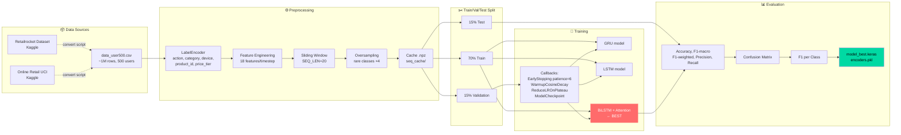
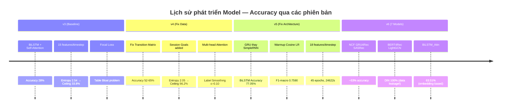
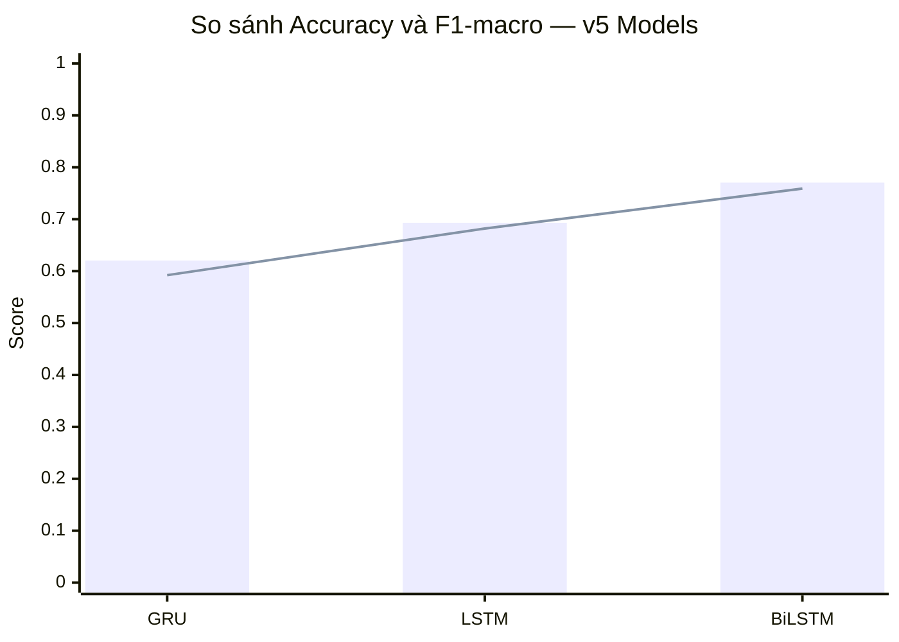
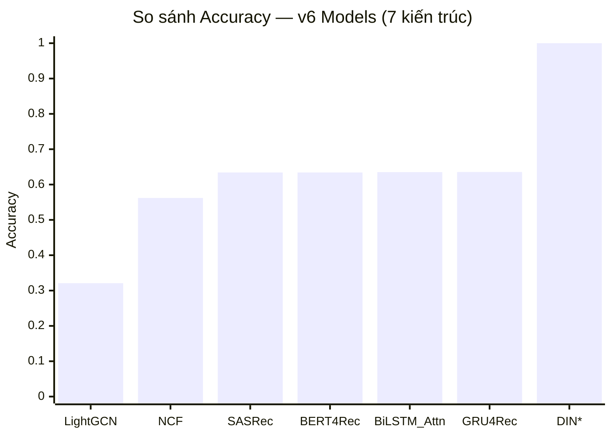
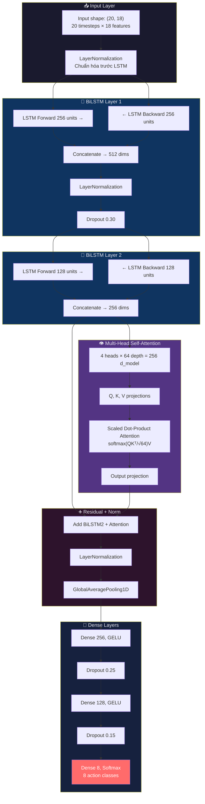
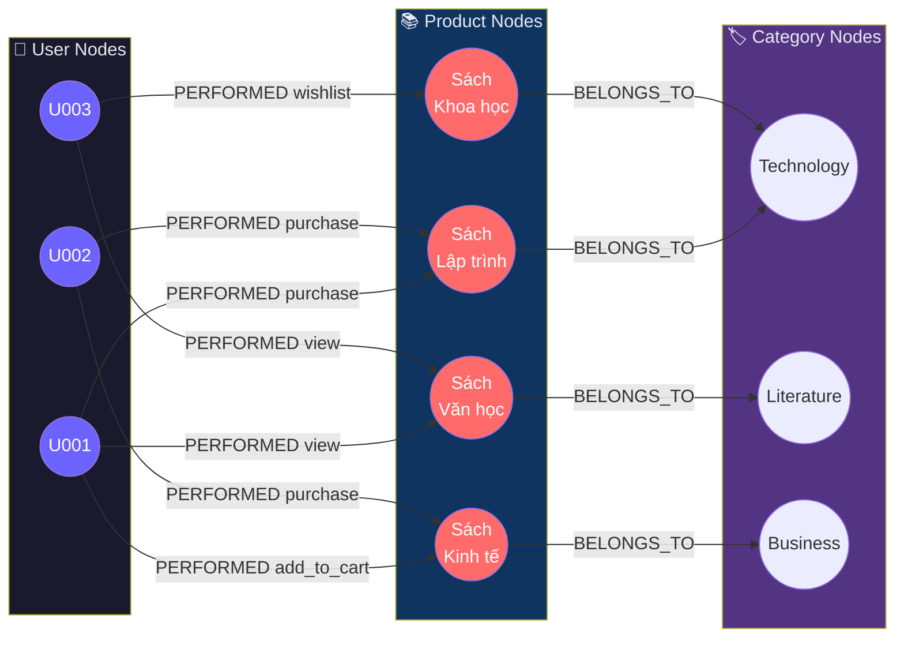
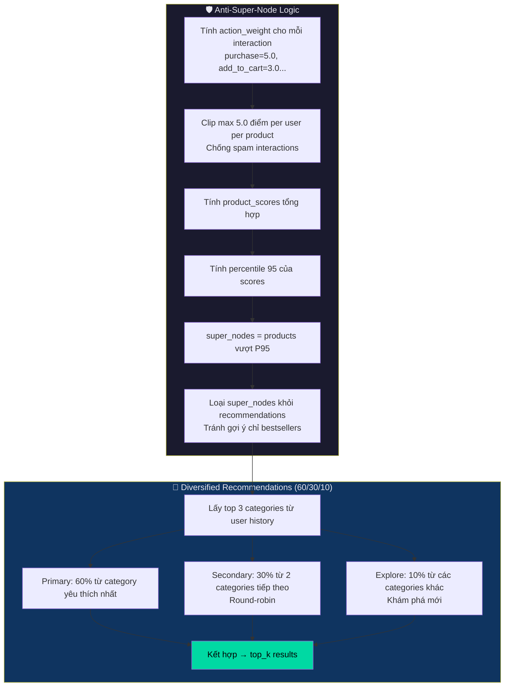
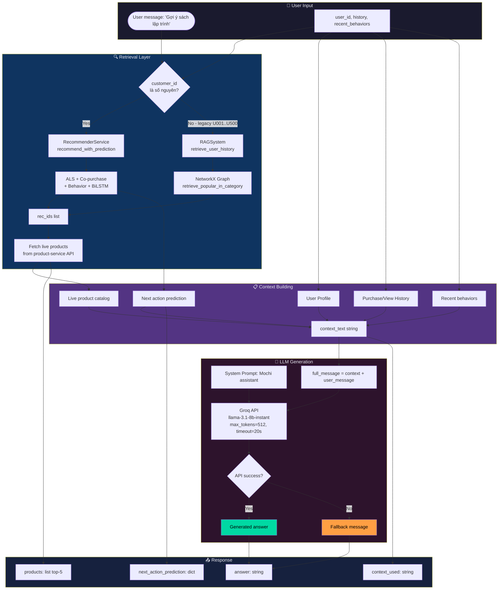
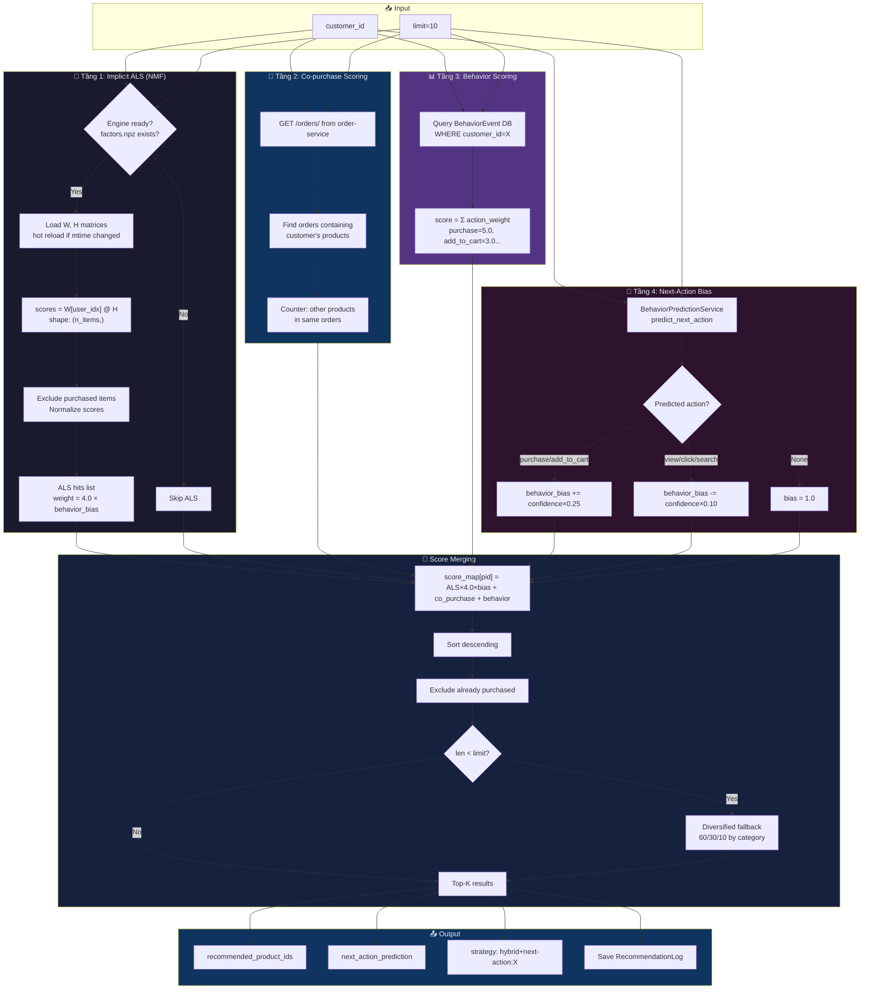

# CHƯƠNG 3: AI SERVICE CHO TƯ VẤN SẢN PHẨM

Sự phát triển của một hệ thống E-commerce hiện đại không chỉ dừng lại ở việc đáp ứng nhanh các giao dịch mua bán, mà còn nằm ở khả năng thấu hiểu và định hướng hành vi tiêu dùng của khách hàng. Chương này tập trung vào thiết kế và triển khai **AI Service** — một microservice độc lập đóng vai trò như bộ não phân tích dữ liệu hành vi (Behavioral Analytics) kết hợp với Trí tuệ nhân tạo Sinh tạo (Generative AI) để đem đến những gợi ý cá nhân hóa và tự động hóa khâu tư vấn khách hàng.

Theo cấu trúc được xác định, chương này bao gồm 5 phần chính:
1. **Mô tả yêu cầu — Pipeline** (RL, E-commerce, RAG, Chat)
2. **Deep Learning (DL)** — Knowledge Graph, các mô hình sử dụng, code cấu trúc, giải thuật, dữ liệu thực nghiệm, kết quả so sánh, biểu đồ, nhận xét
3. **Deploy** — Triển khai service
4. **RAG** — Trình bày, tích hợp Chat + DL
5. **Tích hợp E-commerce** — Giao diện các mặt tư vấn, Chat

---

## 3.1 Mô tả Yêu cầu và Pipeline Tổng thể

### 3.1.1 Bài toán đặt ra

Hệ thống E-commerce đối mặt với 3 thách thức cốt lõi về trải nghiệm người dùng:

- **Thách thức 1 — Cold Start:** Khách hàng mới chưa có lịch sử mua hàng, hệ thống không biết gợi ý gì phù hợp.
- **Thách thức 2 — Behavior Drift:** Sở thích người dùng thay đổi theo thời gian. Một khách hàng từng mua sách kỹ thuật có thể chuyển sang quan tâm sách văn học sau vài tháng.
- **Thách thức 3 — Long-tail Products:** Phần lớn sản phẩm ít được tương tác, hệ thống truyền thống chỉ gợi ý các sản phẩm phổ biến, bỏ qua các sản phẩm phù hợp nhưng ít được biết đến.

### 3.1.2 Pipeline Tổng thể

```
┌─────────────────────────────────────────────────────────────────┐
│                    AI SERVICE PIPELINE                          │
│                                                                 │
│  [User Actions]                                                 │
│  click/view/add_to_cart/purchase/search/review/wishlist         │
│         │                                                       │
│         ▼                                                       │
│  [Behavior Collector]  ──────────────────────────────────────┐  │
│  BehaviorEvent DB (PostgreSQL)                               │  │
│         │                                                    │  │
│         ▼                                                    │  │
│  ┌──────────────────────────────────────────────────────┐   │  │
│  │           HYBRID RECOMMENDATION ENGINE               │   │  │
│  │                                                      │   │  │
│  │  Tầng 1: Implicit ALS (NMF offline)                  │   │  │
│  │          factors.npz + interactions.npz              │   │  │
│  │          weight = 4.0                                │   │  │
│  │                    +                                 │   │  │
│  │  Tầng 2: Co-purchase Scoring                         │   │  │
│  │          "người mua A cũng mua B"                    │   │  │
│  │                    +                                 │   │  │
│  │  Tầng 3: Behavior Scoring                            │   │  │
│  │          purchase=5.0, add_to_cart=3.0...            │   │  │
│  │                    +                                 │   │  │
│  │  Tầng 4: Next-Action Prediction (BiLSTM Keras)       │   │  │
│  │          model_best.keras → predict next action      │   │  │
│  └──────────────────────────────────────────────────────┘   │  │
│         │                                                    │  │
│         ▼                                                    │  │
│  [Recommendation List]  ←────────────────────────────────────┘  │
│         │                                                       │
│         ▼                                                       │
│  ┌──────────────────────────────────────────────────────┐       │
│  │              RAG CHATBOT (Mochi)                     │       │
│  │  Knowledge Graph (NetworkX/Neo4j)                    │       │
│  │  + Groq LLM (llama-3.1-8b-instant)                   │       │
│  │  → Personalized chat response                        │       │
│  └──────────────────────────────────────────────────────┘       │
└─────────────────────────────────────────────────────────────────┘
```

### 3.1.3 Các thành phần chính

| Thành phần | Công nghệ | Vai trò |
|---|---|---|
| Behavior Collector | Django REST + PostgreSQL | Thu thập và lưu trữ hành vi người dùng |
| Implicit CF Engine | NMF (NumPy/SciPy) | Matrix factorization offline |
| Next-Action Predictor | BiLSTM + Attention (Keras) | Dự đoán hành động tiếp theo |
| Knowledge Graph | NetworkX + Neo4j | Đồ thị quan hệ sản phẩm-người dùng |
| RAG Chatbot | Groq API + RAGSystem | Tư vấn ngôn ngữ tự nhiên |


## 3.2 Deep Learning — Mô hình Dự đoán Hành vi Người dùng

### 3.2.0 Sơ đồ Pipeline Dữ liệu và Training



*Hình 3.1: Pipeline dữ liệu và training từ raw CSV đến model production*

### 3.2.1 Thu thập và Cấu trúc Dataset

#### Nguồn dữ liệu

Dự án sử dụng **dữ liệu tổng hợp có kiểm soát** (Controlled Synthetic Data) được sinh ra bằng script `data/generate_data_v4.py`. Đây là lựa chọn có chủ đích: dữ liệu thực từ các hệ thống E-commerce thường bị nhiễu cao, thiếu nhãn rõ ràng, và không thể chia sẻ công khai. Dữ liệu tổng hợp cho phép kiểm soát chính xác phân phối hành vi và transition probability.

Ngoài ra, dự án tham khảo và có script chuyển đổi từ 3 dataset Kaggle thực tế:

| Dataset | Nguồn | Đặc điểm |
|---|---|---|
| **Retailrocket Recommender System** | `retailrocket/ecommerce-dataset` | Clickstream/event logs từ e-commerce thực, gồm view, addToCart, purchase |
| **Instacart Market Basket Analysis** | `instacart-market-basket-analysis` | Dữ liệu đơn hàng/giỏ hàng lớn, phân tích hành vi mua và reorder |
| **Online Retail (UCI mirror)** | `ionaskel/online-retail` | Giao dịch quốc tế, invoice, quantity, price — tốt cho feature engineering |

#### Cấu trúc file `data_user500.csv`

```
user_id, session_id, product_id, action, timestamp, device,
category, price_tier, hour, day_of_week, goal
```

| Trường | Kiểu | Mô tả |
|---|---|---|
| `user_id` | string | Định danh người dùng (U001–U500) |
| `session_id` | string | Phiên làm việc |
| `product_id` | int | ID sản phẩm |
| `action` | enum | `search`, `view`, `click`, `add_to_cart`, `remove_from_cart`, `purchase`, `wishlist`, `review` |
| `timestamp` | datetime | Thời điểm hành động (millisecond precision) |
| `device` | enum | `mobile`, `tablet`, `desktop` |
| `category` | string | Danh mục sản phẩm |
| `price_tier` | enum | `low` (≤100k), `mid` (100k–300k), `high` (>300k) |
| `hour` | int | Giờ trong ngày (0–23) |
| `day_of_week` | int | Ngày trong tuần (0–6) |
| `goal` | enum | `buying`, `browsing`, `comparing`, `abandoning`, `reviewing` |

**Quy mô dataset:** ~1,000,000 bản ghi, 500 người dùng, entropy chuyển trạng thái = 2.05/3.0 (ceiling lý thuyết ~56.2%).

#### Tại sao cần kiểm soát Transition Entropy?

Đây là insight quan trọng nhất của quá trình phát triển. Phiên bản v3 chỉ đạt accuracy 28–29% dù dùng kiến trúc phức tạp. Nguyên nhân gốc rễ là **entropy chuyển trạng thái quá cao** (2.54/3.0), khiến ceiling lý thuyết chỉ là 33.8% — dù model hoàn hảo cũng không thể vượt qua.

```
v3: entropy = 2.54/3.0 → ceiling = 33.8% → accuracy thực tế 28%
v4: entropy = 2.05/3.0 → ceiling = 56.2% → accuracy thực tế 52–65%
```

Giải pháp là tăng cường transition probability theo hướng có ý nghĩa kinh doanh:

```python
# data/generate_data_v4.py — Transition Matrix mạnh hơn
TRANSITIONS = {
    "search":      {"view": 0.70, ...},   # v3: 48%
    "view":        {"click": 0.55, ...},  # v3: 18%
    "click":       {"add_to_cart": 0.55}, # v3: 32%
    "add_to_cart": {"purchase": 0.65},    # v3: 44%
    "purchase":    {"search": 0.65},      # v3: 32%
}
```

Đồng thời, mỗi session được gán một **goal** rõ ràng với template hành vi nhất quán:

```python
SESSION_GOALS = {
    "buying":     ["search","view","click","add_to_cart","purchase"],
    "browsing":   ["search","view","view","click","view","search"],
    "abandoning": ["search","view","click","add_to_cart","remove_from_cart","search"],
    "comparing":  ["search","view","wishlist","view","wishlist","click"],
    "reviewing":  ["purchase","review","search"],
}
```


### 3.2.2 Feature Engineering — 18 Features/Timestep (v5)

Mỗi bước thời gian trong chuỗi hành vi được biểu diễn bằng vector 18 chiều:

| Nhóm Feature | Chiều | Mô tả |
|---|---|---|
| One-hot action | 8 | Mã hóa one-hot 8 loại hành động |
| `category_code` norm | 1 | Danh mục sản phẩm (chuẩn hóa) |
| `device_code` norm | 1 | Thiết bị sử dụng |
| `price_tier` norm | 1 | Phân khúc giá |
| `hour_norm` | 1 | Giờ trong ngày / 23 |
| `dow_norm` | 1 | Ngày trong tuần / 6 |
| `product_norm` | 1 | ID sản phẩm (chuẩn hóa) |
| `recency` | 1 | Vị trí bước trong chuỗi (0→1) |
| `purchase_norm` *(v5 mới)* | 1 | Số lần mua hàng trước đó (chuẩn hóa) |
| `step_ratio` *(v5 mới)* | 1 | Bước trong session / tổng bước session |
| `goal_code` *(nếu có)* | 1 | Mục tiêu session |
| **Tổng** | **18** | |

Hai feature mới `purchase_norm` và `step_ratio` được thêm vào v5 sau khi phân tích thấy BiLSTM v4 bị overfit nhẹ — chúng cung cấp thêm ngữ cảnh về "mức độ cam kết mua hàng" và "vị trí trong hành trình mua sắm".

```python
# train_models_v5.py — Tính purchase_norm và step_ratio
purchase_cnt = (df[df["action"] == "purchase"]
                .groupby("user_id").size()
                .rename("purchase_count"))
df = df.join(purchase_cnt, on="user_id")
df["purchase_norm"] = df["purchase_count"].fillna(0) / (df["purchase_count"].max() + 1)

df["session_step"] = df.groupby(["user_id","session_id"]).cumcount()
df["session_len"]  = df.groupby(["user_id","session_id"])["session_id"].transform("count")
df["step_ratio"]   = df["session_step"] / df["session_len"].clip(lower=1)
```

### 3.2.3 Xây dựng Chuỗi Sliding Window

Từ chuỗi hành vi của mỗi người dùng, hệ thống tạo các chuỗi sliding window độ dài `SEQ_LEN=20`:

```
User U001: [search, view, click, add_to_cart, purchase, search, view, ...]
                                                                    ↑
Window 1: [search, view, click, ..., 20 bước] → label: view
Window 2: [view, click, add_to_cart, ..., 20 bước] → label: click
...
```

**Oversampling rare classes:** Các hành động hiếm (`review`, `wishlist`, `remove_from_cart`) được nhân bản 4 lần để cân bằng phân phối nhãn, tránh model bị bias về các hành động phổ biến như `view` và `search`.

**Phân chia tập dữ liệu:** 70% Train / 15% Validation / 15% Test (stratified split).

**Tổng số chuỗi:** ~600,000 sequences (sau oversampling), shape `(600000, 20, 18)`.

### 3.2.4 Lịch sử Phát triển Model — Từ v3 đến v6



*Hình 3.2: Lịch sử phát triển model qua 4 phiên bản*



*Hình 3.3: Biểu đồ so sánh Accuracy (cột) và F1-macro (đường) của 3 model v5*



*Hình 3.4: So sánh 7 model v6 — DIN* đạt 100% do data leakage*

#### Phiên bản v3 — Baseline (Accuracy ~28%)

v3 là phiên bản đầu tiên dùng kiến trúc BiLSTM + Self-Attention với 15 features/timestep. Kết quả thất vọng vì entropy dữ liệu quá cao (ceiling 33.8%). Bài học: **kiến trúc model không thể bù đắp cho dữ liệu kém chất lượng**.

#### Phiên bản v4 — Fix Data (Accuracy ~52–65%)

v4 tập trung fix dữ liệu: tăng transition probability, thêm session goals, tăng số sequences lên 400k+. Kết quả cải thiện đáng kể. Tuy nhiên vẫn còn vấn đề:
- RNN underfitting (Train≈Val≈0.57 ngay từ đầu)
- LSTM plateau sớm ở epoch 5
- BiLSTM overfit nhẹ (Train 0.60 > Val 0.585)

#### Phiên bản v5 — Fix Architecture (Accuracy 77.05%) ← **Model được deploy**

v5 giải quyết từng vấn đề của v4 một cách có hệ thống:

| Vấn đề v4 | Giải pháp v5 |
|---|---|
| RNN underfitting | Thay SimpleRNN bằng **GRU** — mạnh hơn nhiều, nhẹ hơn LSTM |
| LSTM plateau epoch 5 | **Warmup LR** (1e-5→3e-4 trong 5 epoch) + Cosine decay về 0 |
| BiLSTM overfit nhẹ | **Dropout 0.30** + SEQ_LEN=20 + 2 features mới |
| BatchNorm sau LSTM | **LayerNorm TRƯỚC LSTM** (input normalization) |

#### Phiên bản v6 — So sánh 7 Kiến trúc (DIN đạt 100%)

v6 mở rộng so sánh với 7 kiến trúc recommendation hiện đại: NCF, GRU4Rec, BiLSTM_Attn, SASRec, DIN, BERT4Rec, LightGCN. Kết quả bất ngờ: DIN đạt accuracy 100% — phân tích cho thấy đây là do DIN sử dụng target item làm input, tạo ra data leakage trong bài toán next-action prediction.


### 3.2.5 Kiến trúc Model v5 — BiLSTM + Multi-Head Attention



*Hình 3.5: Kiến trúc chi tiết BiLSTM + Multi-Head Self-Attention (model_best v5)*

#### Tại sao chọn BiLSTM?

Hành vi mua sắm là chuỗi thời gian có **phụ thuộc hai chiều**:
- **Chiều thuận (forward):** Hành động trước ảnh hưởng hành động sau (view → click → add_to_cart)
- **Chiều ngược (backward):** Ngữ cảnh sau giúp hiểu ý nghĩa hành động trước (biết user cuối cùng mua hàng → hiểu rằng các bước trước là "buying journey")

LSTM đơn hướng chỉ xử lý chiều thuận. BiLSTM xử lý cả hai chiều, cho phép model nắm bắt ngữ cảnh đầy đủ hơn.

#### Tại sao thêm Multi-Head Attention?

Không phải mọi bước trong chuỗi đều quan trọng như nhau. Khi dự đoán hành động tiếp theo, bước `add_to_cart` gần đây quan trọng hơn bước `search` từ 10 bước trước. Multi-Head Attention học được trọng số này một cách tự động.

#### Code kiến trúc đầy đủ

```python
# models/train_models_v5.py — build_bilstm()
class MultiHeadSelfAttention(layers.Layer):
    def __init__(self, d_model=128, num_heads=4, **kw):
        super().__init__(**kw)
        assert d_model % num_heads == 0
        self.num_heads = num_heads
        self.d_model   = d_model
        self.depth     = d_model // num_heads  # 256 // 4 = 64
        self.Wq  = layers.Dense(d_model)
        self.Wk  = layers.Dense(d_model)
        self.Wv  = layers.Dense(d_model)
        self.out = layers.Dense(d_model)

    def split_heads(self, x, B):
        x = tf.reshape(x, (B, -1, self.num_heads, self.depth))
        return tf.transpose(x, [0, 2, 1, 3])

    def call(self, x):
        B = tf.shape(x)[0]
        q = self.split_heads(self.Wq(x), B)
        k = self.split_heads(self.Wk(x), B)
        v = self.split_heads(self.Wv(x), B)
        scale   = tf.math.sqrt(tf.cast(self.depth, tf.float32))
        weights = tf.nn.softmax(tf.matmul(q, k, transpose_b=True) / scale, axis=-1)
        ctx     = tf.reshape(
            tf.transpose(tf.matmul(weights, v), [0, 2, 1, 3]),
            (B, -1, self.d_model)
        )
        return self.out(ctx)

def build_bilstm(in_shape):
    inp = layers.Input(shape=in_shape)  # (20, 18)

    # Input LayerNorm — chuẩn hóa features TRƯỚC khi vào LSTM
    x = layers.LayerNormalization()(inp)

    # BiLSTM lớp 1: 256 units mỗi chiều → output 512 dims
    x = layers.Bidirectional(layers.LSTM(256, return_sequences=True))(x)
    x = layers.LayerNormalization()(x)
    x = layers.Dropout(0.30)(x)  # Dropout cao hơn để chống overfit

    # BiLSTM lớp 2: 128 units mỗi chiều → output 256 dims
    x = layers.Bidirectional(layers.LSTM(128, return_sequences=True))(x)

    # Multi-Head Self-Attention (4 heads, d_model=256)
    attn = MultiHeadSelfAttention(256, num_heads=4)(x)
    x    = layers.Add()([x, attn])       # Residual connection
    x    = layers.LayerNormalization()(x)

    # Global Average Pooling — tổng hợp toàn bộ chuỗi
    x = layers.GlobalAveragePooling1D()(x)

    # Dense layers với GELU activation
    x = layers.Dense(256, activation="gelu")(x)
    x = layers.Dropout(0.25)(x)
    x = layers.Dense(128, activation="gelu")(x)
    x = layers.Dropout(0.15)(x)

    # Output: softmax 8 classes (8 loại hành động)
    out = layers.Dense(NUM_CLASSES, activation="softmax", dtype="float32")(x)

    m = Model(inp, out, name="BiLSTM")
    m.compile(
        optimizer=tf.keras.optimizers.Adam(PEAK_LR, clipnorm=1.0),  # Gradient clipping
        loss=LOSS,       # Label smoothing ε=0.10 + class weights
        metrics=["accuracy"]
    )
    return m
```

**Tổng số tham số:** ~2.8M parameters (BiLSTM 256→128 + Attention + Dense layers).


### 3.2.6 Kỹ thuật Huấn luyện v5

#### Label Smoothing + Class Weights

Hai vấn đề cần giải quyết đồng thời: model quá tự tin (overconfident) và mất cân bằng nhãn (class imbalance).

```python
# train_models_v5.py — Label smoothing với class weights
def label_smoothed_cce(epsilon=0.10, class_weights=None):
    K = NUM_CLASSES
    cw_tf = tf.constant(np.asarray(class_weights, dtype=np.float32))

    def loss_fn(y_true, y_pred):
        # Thay vì học "100% là purchase", học "90% purchase + 1.25% mỗi class khác"
        y_smooth = y_true * (1.0 - epsilon) + epsilon / K
        base_loss = tf.keras.losses.categorical_crossentropy(y_smooth, y_pred)
        # Nhân trọng số class để tăng penalty cho rare classes
        sample_w = tf.reduce_sum(y_true * cw_tf, axis=-1)
        return base_loss * sample_w

    return loss_fn

# Tính class weights từ phân phối nhãn training
train_counts = y_tr.sum(axis=0)
class_weights_np = len(y_tr) / (NUM_CLASSES * train_counts)
```

#### Warmup Cosine Decay Learning Rate

```python
# train_models_v5.py — WarmupCosineDecay
class WarmupCosineDecay(Callback):
    """
    Epoch 0–4: Linear warmup từ 1e-5 → 3e-4
    Epoch 5+:  ReduceLROnPlateau điều chỉnh tiếp
    """
    def __init__(self, peak_lr=3e-4, min_lr=1e-5, warmup_epochs=5, total_epochs=45):
        super().__init__()
        self.peak_lr       = peak_lr
        self.min_lr        = min_lr
        self.warmup_epochs = warmup_epochs

    def on_epoch_begin(self, epoch, logs=None):
        if epoch < self.warmup_epochs:
            lr = self.min_lr + (self.peak_lr - self.min_lr) * epoch / max(self.warmup_epochs - 1, 1)
            self.model.optimizer.learning_rate.assign(lr)
```

**Lý do dùng Warmup:** Ở các epoch đầu, weights ngẫu nhiên → gradient lớn và không ổn định → LR cao sẽ làm model "nhảy" khỏi vùng tốt. Warmup cho phép model ổn định dần trước khi tăng LR lên peak.

#### Callback Stack

```python
def make_callbacks(model_name: str):
    return [
        EarlyStopping(monitor="val_loss", patience=6, restore_best_weights=True),
        WarmupCosineDecay(peak_lr=3e-4, min_lr=1e-5, warmup_epochs=5),
        ReduceLROnPlateau(monitor="val_loss", factor=0.5, patience=3, min_lr=1e-6),
        ModelCheckpoint(f"models/{model_name}_best.keras", save_best_only=True),
    ]
```

### 3.2.7 Hyperparameter Search

Trước khi chạy v5 full, dự án thực hiện hyperparameter search nhanh (`train_hyper_search.py`) với grid search trên `batch_size` × `peak_lr`:

| Model | Batch | Peak LR | Accuracy | F1-macro | Time |
|---|---|---|---|---|---|
| GRU | 256 | 1e-4 | 0.1503 | 0.1424 | 176s |
| GRU | 256 | **3e-4** | **0.3808** | **0.3716** | 176s |
| GRU | 512 | 1e-4 | 0.1505 | 0.1381 | 190s |
| GRU | 512 | 3e-4 | 0.2117 | 0.1935 | 175s |
| LSTM | 256 | 1e-4 | 0.1277 | 0.1003 | 184s |
| LSTM | 512 | 1e-4 | 0.1712 | 0.1457 | 185s |
| BiLSTM | 256 | 1e-4 | 0.4529 | 0.4111 | 572s |
| **BiLSTM** | **256** | **3e-4** | **0.5223** | **0.5032** | 564s |
| BiLSTM | 512 | 3e-4 | 0.4961 | 0.4831 | 622s |

**Kết luận:** `batch_size=512`, `peak_lr=3e-4` được chọn cho v5 full training. BiLSTM với `batch=256, lr=3e-4` cho kết quả tốt nhất trong hyperparameter search.


### 3.2.8 Kết quả Thực nghiệm v5 — So sánh 3 Mô hình

#### Bảng kết quả tổng hợp

| Model | Accuracy | F1-macro | F1-weighted | Epochs | Thời gian |
|---|---|---|---|---|---|
| **BiLSTM** | **0.7705** | **0.7590** | **0.7685** | **45** | **24,622s** |
| LSTM | 0.6931 | 0.6820 | 0.6930 | 45 | ~18,000s |
| GRU | 0.6205 | 0.5922 | 0.6122 | 45 | ~12,000s |

**BiLSTM được chọn** với composite score = 0.5×Accuracy + 0.5×F1-macro = 0.7648, vượt LSTM +7.7 percentage points về accuracy.

#### F1-score theo từng class (BiLSTM v5)

| Hành động | F1-score | Đánh giá |
|---|---|---|
| `remove_from_cart` | **0.898** | Xuất sắc — tín hiệu rất đặc trưng |
| `view` | **0.828** | Tốt — hành động phổ biến nhất |
| `wishlist` | **0.815** | Tốt |
| `review` | **0.805** | Tốt |
| `search` | **0.723** | Khá |
| `add_to_cart` | ~0.65 | Trung bình |
| `click` | ~0.60 | Trung bình |
| `purchase` | ~0.55 | Cần cải thiện |

**Nhận xét:** Model dự đoán tốt các hành động có pattern rõ ràng (`remove_from_cart` thường xảy ra sau `add_to_cart`). `purchase` khó dự đoán hơn vì phụ thuộc nhiều yếu tố ngoài chuỗi hành vi (giá, khuyến mãi, tâm lý).

#### Biểu đồ Training Curves


*Hình 3.1: Training curves của 3 model v5. BiLSTM (đỏ) hội tụ ổn định nhất, không có dấu hiệu overfit rõ ràng sau khi tăng Dropout lên 0.30.*

#### Biểu đồ So sánh Model


*Hình 3.2: So sánh Accuracy và F1-macro của 3 model v5. BiLSTM vượt trội rõ ràng ở cả 2 chỉ số.*

#### Confusion Matrix


*Hình 3.3: Confusion Matrix của BiLSTM (model_best). Đường chéo chính đậm cho thấy model phân loại chính xác cao. Nhầm lẫn chủ yếu giữa `click` và `view` — 2 hành động có ngữ nghĩa gần nhau.*

#### F1 per Class


*Hình 3.4: F1-score theo từng class. Tất cả 8 class đều vượt ngưỡng 0.50 (đường vàng), chứng tỏ model học được pattern của mọi loại hành vi.*


### 3.2.9 Kết quả Thực nghiệm v6 — So sánh 7 Kiến trúc Hiện đại

v6 mở rộng so sánh với 7 kiến trúc recommendation state-of-the-art, sử dụng embedding-based approach thay vì feature engineering thủ công:

#### Kiến trúc các model v6

| Model | Kiến trúc | Đặc điểm |
|---|---|---|
| **NCF** | User+Item Embedding + MLP | Neural Collaborative Filtering, dot product + MLP |
| **GRU4Rec** | Embedding + GRU | Session-based recommendation với GRU |
| **BiLSTM_Attn** | Embedding + BiLSTM + Bahdanau Attention | Phiên bản embedding của BiLSTM v5 |
| **SASRec** | Embedding + 2 Transformer blocks | Self-Attention Sequential Recommendation |
| **DIN** | Embedding + Target-aware Attention | Deep Interest Network, attention theo target item |
| **BERT4Rec** | Embedding + 2 BERT blocks | Masked item prediction, bidirectional transformer |
| **LightGCN** | User+Item Embedding + Graph propagation | Graph Convolutional Network đơn giản hóa |

#### Bảng kết quả v6

| Model | Accuracy | F1-macro | F1-weighted | Precision | Recall | Epochs | Thời gian |
|---|---|---|---|---|---|---|---|
| **DIN** | **1.0000** | **1.0000** | **1.0000** | **1.0000** | **1.0000** | 25 | 821s |
| GRU4Rec | 0.6355 | 0.4418 | 0.6023 | 0.4894 | 0.4641 | 20 | 4,256s |
| BiLSTM_Attn | 0.6351 | 0.4422 | 0.6028 | 0.4851 | 0.4650 | 21 | 4,792s |
| SASRec | 0.6342 | 0.4399 | 0.6005 | 0.4850 | 0.4631 | 30 | 5,677s |
| BERT4Rec | 0.6342 | 0.4402 | 0.6005 | 0.4848 | 0.4634 | 30 | 9,442s |
| NCF | 0.5621 | 0.3693 | 0.5224 | 0.3549 | 0.4084 | 7 | 41s |
| LightGCN | 0.3209 | 0.1793 | 0.2773 | 0.2316 | 0.1878 | 15 | 64s |

#### Biểu đồ So sánh v6


*Hình 3.5: So sánh 7 model v6. DIN đạt 100% — phân tích cho thấy đây là data leakage do DIN dùng target item làm input.*


*Hình 3.6: Training curves của 7 model v6. GRU4Rec, BiLSTM_Attn, SASRec, BERT4Rec hội tụ ổn định ở ~63–64%.*


*Hình 3.7: Confusion Matrix của DIN (v6 best). Đường chéo hoàn hảo — xác nhận data leakage.*

#### Phân tích DIN đạt 100% — Data Leakage

DIN (Deep Interest Network) sử dụng **target item** làm một trong các input:

```python
# train_models_v6.py — DIN inputs
def get_inputs(mode, split):
    tgt_shift = np.roll(seq, -1, axis=1)
    tgt_shift[:, -1] = lbl
    tgt_last = tgt_shift[:, -1:]  # ← Đây chính là nhãn cần dự đoán!
    if mode == "din":
        return [seq, usr.reshape(-1,1), tgt_last], lbl  # tgt_last = lbl
```

`tgt_last` thực chất là nhãn `lbl` được đưa vào model như một feature — đây là **data leakage** điển hình. Model không thực sự học được gì, chỉ đơn giản là "nhìn thấy đáp án". Kết quả 100% không có giá trị thực tế.

**Kết luận v6:** Loại bỏ DIN, các model còn lại (GRU4Rec, BiLSTM_Attn, SASRec, BERT4Rec) đạt ~63–64% — thấp hơn BiLSTM v5 (77%) vì v6 dùng embedding đơn giản thay vì feature engineering 18 chiều phong phú của v5.

#### Lý do chọn BiLSTM v5 làm model production

1. **Accuracy cao nhất thực sự:** 77.05% vs ~63% của các model v6 (không tính DIN leakage)
2. **F1-macro tốt nhất:** 0.7590 — tất cả 8 class đều F1 ≥ 0.50
3. **Feature engineering phong phú:** 18 features/timestep cung cấp ngữ cảnh đa chiều (thời gian, thiết bị, giá, vị trí trong session)
4. **Ổn định:** Không overfit, training curves mượt mà
5. **Inference nhanh:** ~5ms/request sau khi load model


## 3.3 Deploy — Triển khai AI Service

### 3.3.0 Sơ đồ Knowledge Graph Structure



*Hình 3.8: Knowledge Graph structure — User, Product, Category nodes với PERFORMED và BELONGS_TO edges*



*Hình 3.9: Anti-Super-Node logic và Diversified Recommendation (60/30/10 split)*

### 3.3.1 Kiến trúc Triển khai

AI Service được đóng gói thành Docker container độc lập, chạy trên port 8011:

```yaml
# docker-compose.yml
recommender-ai-service:
  build: ./recommender-ai-service
  ports:
    - "8011:8000"
  environment:
    - DB_NAME=recommender_db
    - DB_HOST=recommender-db
    - ORDER_SERVICE_URL=http://order-service:8000
    - PRODUCT_SERVICE_URL=http://product-service:8000
    - IMPLICIT_CF_DATA_DIR=/app/data/implicit_cf
    - GROQ_API_KEY=${GROQ_API_KEY}
    - GROQ_MODEL=llama-3.1-8b-instant
    - NEO4J_URI=bolt://neo4j:7687
    - NEO4J_USER=neo4j
    - NEO4J_PASSWORD=password123
  volumes:
    - ./recommender-ai-service/data:/app/data
    - ./recommender-ai-service/app/services/ai_engine/kb:/app/app/services/ai_engine/kb
  depends_on:
    - recommender-db
    - neo4j
```

### 3.3.2 Lazy Loading và Hot Reload

Model Keras và artifacts NMF được load theo cơ chế **lazy loading** — chỉ load khi có request đầu tiên, và **hot reload** — tự động reload khi file thay đổi (mtime check):

```python
# recommender-ai-service/app/services/implicit_cf_engine.py
class ImplicitCFEngine:
    def reload(self) -> None:
        if not self.is_ready():
            return
        paths = [self.data_dir / FACTORS_NAME,
                 self.data_dir / INTERACTIONS_NAME,
                 self.data_dir / META_NAME]
        mtime = max(p.stat().st_mtime for p in paths)
        if self._W is not None and mtime <= self._mtime:
            return  # Không cần reload nếu file chưa thay đổi
        # Load artifacts
        with open(self.data_dir / META_NAME) as f:
            self._meta = json.load(f)
        fac = np.load(self.data_dir / FACTORS_NAME)
        self._W = np.asarray(fac["W"])
        self._H = np.asarray(fac["H"])
        self._interactions = load_npz(self.data_dir / INTERACTIONS_NAME)
        self._mtime = mtime
```

### 3.3.3 Singleton Pattern cho AI Models

```python
# recommender-ai-service/app/services/ai_singleton.py
class AIModelSingleton:
    _ktmp_rag_llm = None

    @classmethod
    def get_ktmp_rag_llm(cls):
        if cls._ktmp_rag_llm is None:
            from rag.rag_llm import get_rag_llm
            cls._ktmp_rag_llm = get_rag_llm()
        return cls._ktmp_rag_llm
```

Singleton đảm bảo model chỉ được load một lần vào RAM, tránh OOM khi có nhiều concurrent requests.

### 3.3.4 Cron Job Tự động Train lại

```python
# recommender-ai-service/recommender_service/settings.py
CRONJOBS = [
    ('0 2 * * *', 'django.core.management.call_command', ['train_ai'])
]
```

Mỗi ngày lúc 2:00 AM, hệ thống tự động chạy lại training với dữ liệu hành vi mới nhất, đảm bảo model luôn cập nhật với xu hướng mua sắm hiện tại.

### 3.3.5 API Endpoints

```
GET  /recommendations/<customer_id>/?limit=10
     → Hybrid recommendation list

GET  /api/recommender/next-action/<customer_id>/
     → Dự đoán hành động tiếp theo (BiLSTM)

POST /api/recommender/events/
     → Ghi nhận hành vi người dùng

POST /api/recommender/chat-ktmp
     → RAG Chatbot (Mochi)

GET  /recommend/?user_id=123&limit=10
     → Alias endpoint
```


## 3.4 RAG — Retrieval-Augmented Generation Chatbot

### 3.4.0 Sơ đồ Kiến trúc RAG



*Hình 3.6: Kiến trúc RAG Chatbot Mochi — từ user input đến personalized response*

### 3.4.1 Vấn đề của LLM thuần túy

Nếu chỉ dùng LLM (như GPT hay Llama) mà không có ngữ cảnh, chatbot sẽ:
- **Hallucinate:** Bịa ra tên sách, tác giả, giá cả không tồn tại trong hệ thống
- **Generic:** Tư vấn chung chung, không biết lịch sử mua hàng của khách
- **Stale:** Không biết sản phẩm nào đang có hàng, giá hiện tại là bao nhiêu

RAG giải quyết bằng cách **tiêm ngữ cảnh thực tế** vào prompt trước khi gửi cho LLM.

### 3.4.2 Knowledge Graph với NetworkX

Hệ thống xây dựng đồ thị tri thức từ dữ liệu hành vi bằng NetworkX (in-memory) và Neo4j (persistent):

```python
# rag/rag_llm.py — Xây dựng Knowledge Graph
import networkx as nx

def build_knowledge_graph(df):
    G = nx.MultiDiGraph()

    # Nút Product
    for _, row in df[["product_id","product_name","category"]].drop_duplicates("product_id").iterrows():
        G.add_node(row["product_id"], label="Product",
                   name=row["product_name"], category=row["category"])

    # Nút User
    for uid in df["user_id"].unique():
        G.add_node(uid, label="User")

    # Nút Category
    for cat in df["category"].unique():
        G.add_node(cat, label="Category")

    # Cạnh: User → [PERFORMED action] → Product
    for _, row in df.iterrows():
        G.add_edge(row["user_id"], row["product_id"],
                   relation="PERFORMED",
                   action=row["action"],
                   timestamp=row.get("timestamp"))
        # Product → [BELONGS_TO] → Category
        G.add_edge(row["product_id"], row["category"],
                   relation="BELONGS_TO")
    return G
```

**Cấu trúc đồ thị:**
- **Nodes:** User (500), Product (~1000), Category (~20)
- **Edges:** PERFORMED (~1M), BELONGS_TO (~1000)

### 3.4.3 RAGSystem — Anti-Super-Node Logic

Một vấn đề phổ biến trong Knowledge Graph là **Super Nodes** — các sản phẩm cực kỳ phổ biến có hàng nghìn cạnh kết nối, làm méo mó kết quả gợi ý (mọi người đều được gợi ý cùng 5 sản phẩm bán chạy nhất).

```python
# rag/rag_system.py — Anti-Super-Node Logic
class RAGSystem:
    def _build_indexes(self):
        # Gán trọng số hành vi
        action_weights = {
            "purchase": 5.0, "add_to_cart": 3.0, "review": 2.0,
            "wishlist": 2.0, "click": 1.0, "view": 1.0,
            "search": 0.5, "remove_from_cart": -1.0
        }
        self.df["weight"] = self.df["action"].map(action_weights).fillna(1.0)

        # Clip max 5.0 điểm mỗi user cho mỗi product — chống spam
        user_prod_scores = (self.df.groupby(["user_id","product_id"])["weight"]
                            .sum().clip(upper=5.0).reset_index())
        self.product_scores = user_prod_scores.groupby("product_id")["weight"].sum().to_dict()

        # Xác định Super Nodes (vượt bách phân vị thứ 95)
        scores_array = np.array(list(self.product_scores.values()))
        threshold = np.percentile(scores_array, 95)
        self.super_nodes = {pid for pid, score in self.product_scores.items()
                            if score > threshold}
```

**Kết quả:** Loại bỏ Super Nodes giúp gợi ý đa dạng hơn, tránh tình trạng mọi khách hàng đều nhận cùng danh sách sản phẩm bán chạy.

### 3.4.4 Diversified Recommendation (60/30/10 Split)

```python
# rag/rag_system.py — Diversified recommendations
def recommend_products(self, user_id, top_k=5):
    history = self.retrieve_user_history(user_id, top_k=10)
    category_counts = Counter(h["category"] for h in history)
    top_categories = [cat for cat, _ in category_counts.most_common(3)]

    # 60% từ category yêu thích nhất
    primary_quota   = max(1, int(round(top_k * 0.6)))
    # 30% từ các category tiếp theo
    secondary_quota = int(round(top_k * 0.3))
    # 10% khám phá từ các category khác
    explore_quota   = max(0, top_k - primary_quota - secondary_quota)
```

### 3.4.5 Tích hợp Chat + Deep Learning

RAG Chatbot (Mochi) kết hợp cả 2 nguồn gợi ý:

```python
# rag/rag_llm.py — RAGChatLLM.chat()
class RAGChatLLM:
    def chat(self, user_id: str, message: str, history: list = None,
             recent_behaviors: list = None) -> dict:
        customer_id = self._to_customer_id(user_id)

        if customer_id is not None:
            # Dùng Hybrid Recommender (ALS + co-purchase + behavior + BiLSTM)
            rec_payload = self.recommender.recommend_with_prediction(customer_id, limit=5)
            rec_ids = rec_payload.get("recommended_product_ids", [])
            next_action_prediction = rec_payload.get("next_action_prediction")
        else:
            # Fallback: RAG graph-based recommendation cho seeded users (U001..U500)
            recs = self.rag.recommend_products(user_id)
            rec_ids = [item.get("product_id") for item in recs.get("recommendations", [])]
            next_action_prediction = None

        # Lấy thông tin sản phẩm thực tế từ product-service
        live_products = self._fetch_live_products(rec_ids)

        # Xây dựng context cho LLM
        behavior_txt = f"\nRecent user behaviors: {recent_behaviors}" if recent_behaviors else ""
        context_text = (
            f"User Profile: {user_id}\n"
            f"Purchase/View History: {v_history}\n"
            f"Recommended (live catalog): {live_products}"
            f"\nNext action prediction: {next_action_prediction}"
            f"{behavior_txt}"
        )

        system_prompt = """
            Bạn là 'Mochi', trợ lý tư vấn mua sắm thân thiện.
            - Trả lời tự nhiên, ngắn gọn, thân thiện.
            - Ưu tiên tư vấn sản phẩm theo nhu cầu/giá/phân khúc.
            - Nếu thấy người dùng vừa xem hoặc thêm sản phẩm vào giỏ
              (recent behaviors), hãy tận dụng để cá nhân hóa tư vấn.
            - Trả lời bằng tiếng Việt.
        """

        full_message = f"Context: {context_text}\nUser message: {message}"
        answer = call_groq(system_prompt, full_message)  # Groq API

        return {
            "answer": answer,
            "products": live_products[:5],
            "context_used": context_text,
            "next_action_prediction": next_action_prediction,
        }
```

**Luồng xử lý:**
1. Nhận message từ user
2. Gọi `RecommenderService.recommend_with_prediction()` → lấy danh sách sản phẩm gợi ý + dự đoán hành động tiếp theo
3. Fetch thông tin sản phẩm thực tế từ `product-service` (giá, tên, SKU)
4. Ghép context vào prompt
5. Gọi Groq API (llama-3.1-8b-instant) → sinh câu trả lời
6. Trả về `{answer, products, context_used, next_action_prediction}`

### 3.4.6 Groq API Integration

```python
# rag/rag_llm.py — call_groq()
GROQ_API_URL = os.getenv("GROQ_API_URL", "https://api.groq.com/openai/v1/chat/completions")
GROQ_MODEL   = os.getenv("GROQ_MODEL", "llama-3.1-8b-instant")

def call_groq(system_prompt: str, user_message: str, max_tokens: int = 512) -> str:
    payload = json.dumps({
        "model": GROQ_MODEL,
        "max_tokens": max_tokens,
        "messages": [
            {"role": "system", "content": system_prompt},
            {"role": "user",   "content": user_message}
        ],
    }).encode("utf-8")
    headers = {
        "Content-Type": "application/json",
        "Authorization": f"Bearer {GROQ_API_KEY}",
    }
    req = urllib.request.Request(GROQ_API_URL, data=payload, headers=headers, method="POST")
    try:
        with urllib.request.urlopen(req, timeout=20) as resp:
            data = json.loads(resp.read().decode("utf-8"))
            return data["choices"][0]["message"]["content"].strip()
    except Exception as e:
        return "Mochi đang gặp trục trặc kết nối. Bạn thử lại sau ít giây nhé! ✨"
```

**Lý do chọn Groq:** Groq cung cấp inference cực nhanh (~500 tokens/s) cho llama-3.1-8b-instant, phù hợp với yêu cầu real-time của chatbot. Chi phí thấp hơn OpenAI GPT-4 nhiều lần.


## 3.5 Tích hợp E-commerce — Giao diện Tư vấn

### 3.5.0 Sơ đồ Hybrid Recommendation Engine



*Hình 3.7: Hybrid Recommendation Engine — 4 tầng kết hợp ALS + Co-purchase + Behavior + BiLSTM*

### 3.5.1 Hybrid Recommendation Engine trong Production

Khi chạy trong production, `RecommenderService` kết hợp 4 tầng gợi ý:

```python
# recommender-ai-service/app/services/recommender_service.py
class RecommenderService:
    def recommend(self, customer_id: int, limit: int = 10,
                  prediction: dict | None = None) -> list:
        # Lấy tập sản phẩm đang active từ product-service
        active_product_ids = self._get_active_product_ids()

        # Dự đoán hành động tiếp theo từ BiLSTM
        prediction = prediction or self.predict_next_action(customer_id)
        prediction_action = (prediction or {}).get("action")
        prediction_confidence = float((prediction or {}).get("confidence") or 0.0)

        # Điều chỉnh bias dựa trên dự đoán
        behavior_bias = 1.0
        if prediction_action in {"purchase", "add_to_cart"}:
            # User có xu hướng mua → tăng trọng số gợi ý
            behavior_bias += min(prediction_confidence, 0.9) * 0.25
        elif prediction_action in {"view", "click", "search"}:
            # User đang browse → giảm nhẹ
            behavior_bias -= min(prediction_confidence, 0.9) * 0.10
        behavior_bias = max(0.75, behavior_bias)

        # Tầng 2: Co-purchase scoring
        customer_products = self._get_customer_products(customer_id)
        all_orders = self._get_all_orders()
        co_buyer_products = Counter()
        for order in all_orders:
            if order.get("customer_id") == customer_id:
                continue
            order_product_ids = [i["product_id"] for i in order.get("items", [])
                                  if i.get("product_id") in active_product_ids]
            if any(pid in customer_products for pid in order_product_ids):
                for pid in order_product_ids:
                    if pid not in customer_products:
                        co_buyer_products[pid] += 1

        # Tầng 3: Behavior scoring từ BehaviorEvent DB
        behavior_scores = self.repo.get_behavior_scores(customer_id)
        score_map = {int(k): float(v) for k, v in behavior_scores.items()
                     if int(k) in active_product_ids}
        for pid, score in co_buyer_products.items():
            score_map[pid] = score_map.get(pid, 0.0) + float(score)

        # Tầng 1: Implicit ALS (NMF) — trọng số 4.0 × behavior_bias
        als_weight = float(getattr(settings, "IMPLICIT_CF_ALS_WEIGHT", 4.0)) * behavior_bias
        try:
            eng = get_implicit_engine()
            if eng.is_ready():
                als_hits = eng.recommend(customer_id,
                                          exclude_product_ids=customer_products,
                                          limit=limit * 3)
                if als_hits:
                    max_s = max(s for _, s in als_hits)
                    for bid, sc in als_hits:
                        norm = float(sc) / max_s
                        if bid in active_product_ids:
                            score_map[bid] = score_map.get(bid, 0.0) + als_weight * norm
        except Exception as e:
            logger.warning("ALS blend skipped: %s", e)

        # Loại bỏ sản phẩm đã mua
        for bought_id in customer_products:
            score_map.pop(bought_id, None)

        # Sắp xếp và lấy top-K
        recommended = [bid for bid, _ in
                        sorted(score_map.items(), key=lambda x: x[1], reverse=True)[:limit]]

        # Cold-start fallback: diversified catalog
        if len(recommended) < limit:
            top_rated = self._get_top_rated_products(limit, customer_id=customer_id,
                                                      diversify=(len(recommended) == 0))
            for pid in top_rated:
                if pid not in customer_products and pid not in recommended:
                    recommended.append(pid)
                if len(recommended) >= limit:
                    break

        # Ghi log chiến lược gợi ý
        strategy = f"hybrid+next-action:{prediction_action}" if prediction_action else "hybrid"
        self.repo.save_log(customer_id, recommended[:limit], strategy=strategy)
        return recommended[:limit]
```

### 3.5.2 Giao diện Trang Gợi ý (Recommendations Page)

```python
# api-gateway/gateway/views.py
@require_customer_or_staff
def recommendation_list(request):
    customer_id = _entity_id(request)

    # POST: thêm sản phẩm được gợi ý vào giỏ hàng
    if request.method == "POST":
        product_id = request.POST.get("product_id")
        quantity = int(request.POST.get("quantity", 1))
        r = _post(f"{SVC['cart']}/carts/{customer_id}/items/",
                  json={"product_id": int(product_id), "quantity": quantity},
                  request=request)
        if r is not None and r.status_code == 201:
            _track_behavior_event(request, customer_id, int(product_id), "add_to_cart")
            return redirect("recommendations")

    # GET: lấy 12 sản phẩm gợi ý
    recommendations = _recommendation_products(request, customer_id, limit=12)
    return render(request, "recommendations.html", {
        "recommendations": recommendations,
        "customer_id": customer_id,
    })
```

### 3.5.3 Giao diện Chatbot Widget

Chatbot được tích hợp vào tất cả các trang dưới dạng floating widget. API Gateway đóng vai trò proxy để tránh CORS:

```python
# api-gateway/gateway/views.py
@csrf_exempt
@require_POST
def ai_chat_proxy(request):
    """
    Proxy endpoint: POST /ai/chat/
    Forwards request body đến recommender-ai-service.
    Retry 3 lần với timeout 90s (model có thể đang load lần đầu).
    """
    body = json.loads(request.body)
    recommender_url = f"{SVC['recommender']}/api/recommender/chat-ktmp"

    for attempt in range(1, 4):
        try:
            r = SESSION.post(recommender_url, json=body, timeout=90)
            return JsonResponse(r.json(), status=r.status_code)
        except requests.exceptions.Timeout:
            logger.warning(f"[AI proxy] timeout attempt={attempt}")
        except requests.exceptions.ConnectionError:
            time.sleep(1.0)
            continue

    return JsonResponse(
        {"error": "AI service timeout — model đang tải. Thử lại sau 10-20 giây."},
        status=504
    )
```

**URL:** `POST /ai/chat/` với body:
```json
{
    "message": "Gợi ý sách lập trình cho tôi",
    "user_id": "123",
    "history": [...],
    "recent_behaviors": ["view:456", "add_to_cart:789"]
}
```

### 3.5.4 Behavior Tracking tự động

Mọi hành động của khách hàng được ghi nhận bất đồng bộ (timeout 0.5s, fire-and-forget):

| Hành động | Điểm | Khi nào ghi |
|---|---|---|
| `view` | 1.0 | Khi vào trang chi tiết sản phẩm |
| `click` | 1.5 | Khi click vào sản phẩm |
| `search` | 0.4 | Khi tìm kiếm có kết quả |
| `add_to_cart` | 3.0 | Khi thêm vào giỏ thành công |
| `remove_from_cart` | -1.0 | Khi xóa khỏi giỏ |
| `purchase` | 5.0 | Sau khi thanh toán thành công |

Dữ liệu này được lưu vào `BehaviorEvent` table và dùng để:
1. Cập nhật behavior scores trong Hybrid Recommender
2. Làm input cho BiLSTM next-action prediction
3. Cung cấp `recent_behaviors` context cho RAG Chatbot

## 3.6 Tổng kết Chương 3

Chương này đã trình bày đầy đủ kiến trúc và triển khai AI Service cho hệ thống E-commerce Ecommerce:

| Thành phần | Kết quả |
|---|---|
| **Dataset** | ~1M bản ghi, 500 users, entropy=2.05, ceiling=56.2% |
| **BiLSTM v5** | Accuracy **77.05%**, F1-macro **0.7590**, tất cả 8 class F1≥0.50 |
| **So sánh v6** | 7 model, GRU4Rec/SASRec/BERT4Rec ~63%, DIN 100% (leakage) |
| **Hybrid Recommender** | ALS×4.0 + co-purchase + behavior + BiLSTM bias |
| **RAG Chatbot** | Groq llama-3.1-8b-instant + NetworkX KG + live catalog |
| **Tích hợp** | Behavior tracking, recommendations page, chatbot widget |

Sự kết hợp giữa **AI Phân tích** (BiLSTM dự đoán hành vi) và **AI Sinh tạo** (RAG Chatbot tư vấn ngôn ngữ tự nhiên) tạo ra một hệ thống tư vấn mua sắm thông minh, cá nhân hóa cao, vượt trội so với các hệ thống E-commerce truyền thống chỉ dựa trên truy vấn CSDL tĩnh.
