# CHƯƠNG 4: TÍCH HỢP VÀ TRIỂN KHAI

Hành trình xây dựng một kiến trúc Microservices không chỉ dừng lại ở việc viết mã nguồn cho các dịch vụ riêng lẻ. Thử thách khó khăn nhất nằm ở khâu "kết dính" các dịch vụ lại với nhau thành một khối thống nhất có thể tự động giao tiếp, phục hồi sau sự cố và triển khai nhất quán trên mọi môi trường. Chương này trình bày chi tiết bức tranh toàn cảnh về cách 8 microservices kết nối, cơ chế xác thực thông suốt, chiến lược Dockerization, hệ thống logging phân tán, và toàn bộ luồng giao dịch End-to-End của hệ thống E-commerce.

---

## 4.1 Kiến trúc Tổng thể Hệ thống

### 4.1.0 Sơ đồ Kiến trúc Tổng thể

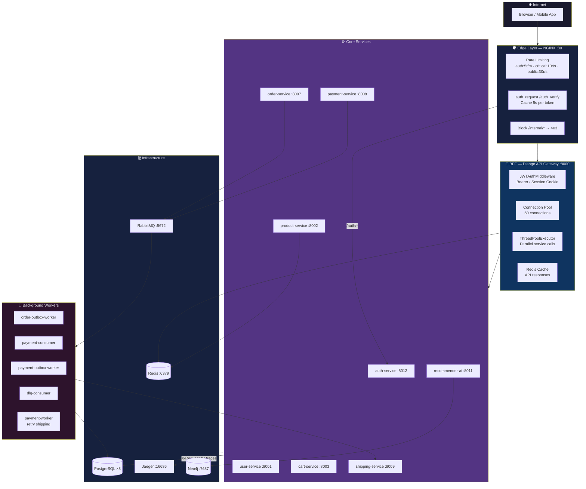

*Hình 4.1: Kiến trúc tổng thể hệ thống — 4 tầng với 20+ containers*

### 4.1.1 Bức tranh toàn cảnh

Hệ thống được tổ chức theo mô hình **Layered Microservices Architecture** với 4 tầng rõ ràng:

```
┌─────────────────────────────────────────────────────────────────────┐
│                    TẦNG 1: EDGE LAYER                               │
│  Client (Browser/Mobile App)                                        │
│         ↓ HTTP/HTTPS                                                │
│  NGINX :80  ← Rate Limiting, SSL Termination, Auth Caching          │
└─────────────────────────────────────────────────────────────────────┘
                              ↓
┌─────────────────────────────────────────────────────────────────────┐
│                    TẦNG 2: BFF LAYER                                │
│  Django API Gateway :8000                                           │
│  ← JWT Decode, Session Management, HTML Rendering, Orchestration    │
└─────────────────────────────────────────────────────────────────────┘
                              ↓
┌─────────────────────────────────────────────────────────────────────┐
│                    TẦNG 3: BUSINESS SERVICES                        │
│  auth-service :8012  │  user-service :8001  │  product-service :8002│
│  cart-service :8003  │  order-service :8007  │  payment-service :8008│
│  shipping-service :8009  │  recommender-ai-service :8011            │
└─────────────────────────────────────────────────────────────────────┘
                              ↓
┌─────────────────────────────────────────────────────────────────────┐
│                    TẦNG 4: DATA & MESSAGING LAYER                   │
│  PostgreSQL ×8 (DB per service)  │  Redis :6379  │  Neo4j :7687     │
│  RabbitMQ :5672/:15672           │  Jaeger :16686                   │
└─────────────────────────────────────────────────────────────────────┘
```

### 4.1.2 Nguyên tắc thiết kế cốt lõi

Hệ thống tuân thủ 5 nguyên tắc thiết kế không thể vi phạm:

1. **Single Entry Point:** Mọi request từ bên ngoài đều phải đi qua NGINX → API Gateway. Không một service nào được expose trực tiếp ra Internet.

2. **Database per Service:** Mỗi service sở hữu một PostgreSQL instance riêng biệt. Không có Cross-Database JOIN. Giao tiếp dữ liệu chéo chỉ qua API hoặc Message Queue.

3. **Zero-Trust Internal Network:** Các service trong cùng Docker network không tự động tin tưởng nhau. Mọi internal call đều phải mang HMAC signature và được xác thực.

4. **Eventual Consistency over Strong Consistency:** Hệ thống chấp nhận độ trễ cập nhật 1–2 giây giữa các service để đổi lấy khả năng scale-out không giới hạn.

5. **Fail-Safe by Default:** Mọi external call đều có timeout, retry, và circuit breaker. Lỗi của một service không được phép lan rộng sang service khác.

### 4.1.3 Bảng tổng hợp Services và Dependencies

| Service | Port | Database | Phụ thuộc | Vai trò |
|---|---|---|---|---|
| nginx | 80 | — | api-gateway, auth-service | Edge proxy, rate limiting |
| api-gateway | 8000 | SQLite (session) | Tất cả services | BFF, HTML rendering |
| auth-service | 8012 | auth_db | user-service | JWT issue/verify |
| user-service | 8001 | user_db | — | User profiles |
| product-service | 8002 | product_db | Redis | Catalog, inventory |
| cart-service | 8003 | cart_db | — | Shopping cart |
| order-service | 8007 | order_db | product-service, RabbitMQ | Orders, outbox |
| payment-service | 8008 | pay_db | RabbitMQ, shipping-service | Payments, consumers |
| shipping-service | 8009 | ship_db | — | Shipping state machine |
| recommender-ai-service | 8011 | recommender_db | Neo4j, order-service, product-service | AI recommendations |
| rabbitmq | 5672/15672 | — | — | Message broker |
| redis | 6379 | — | — | Cache, circuit breaker |
| neo4j | 7474/7687 | — | — | Knowledge graph |
| jaeger | 16686 | — | — | Distributed tracing |


---

## 4.2 Containerization — Docker hóa toàn bộ hệ thống

### 4.2.0 Sơ đồ Docker Compose Dependency Graph

```mermaid
graph TD
    subgraph DBS["🗄️ Databases (khởi động song song)"]
        ADB[(auth-db :5433)]
        UDB[(user-db :55437)]
        PDB[(product-db :55432)]
        CDB[(cart-db :55433)]
        ODB[(order-db :55434)]
        PYDB[(payment-db :55435)]
        SDB[(shipping-db :55436)]
        RDB[(recommender-db :55438)]
    end

    subgraph INFRA["🔧 Infrastructure"]
        MQ[RabbitMQ :5672/:15672]
        REDIS[Redis :6379]
        NEO[Neo4j :7474/:7687]
        JAE[Jaeger :16686]
    end

    subgraph SERVICES["⚙️ Services"]
        AUTH[auth-service :8012]
        USER[user-service :8001]
        PROD[product-service :8002]
        CART[cart-service :8003]
        ORD[order-service :8007]
        PAY[payment-service :8008]
        SHIP[shipping-service :8009]
        REC[recommender-ai :8011]
        GW[api-gateway :8000]
    end

    subgraph WORKERS["👷 Workers"]
        OW[order-outbox-worker]
        PC[payment-consumer]
        POW[payment-outbox-worker]
        DLQ[dlq-consumer]
        PW[payment-worker]
    end

    subgraph NGINX_SVC["🛡️ NGINX :80"]
        NGX[nginx]
    end

    ADB -->|healthy| AUTH
    UDB -->|healthy| USER
    PDB -->|healthy| PROD
    CDB -->|healthy| CART
    ODB -->|healthy| ORD
    PYDB -->|healthy| PAY
    SDB -->|healthy| SHIP
    RDB -->|healthy| REC
    NEO -->|started| REC

    ODB & MQ -->|healthy| OW
    PYDB & MQ -->|healthy| PC & POW & DLQ
    PYDB & PAY -->|healthy| PW

    AUTH & USER & PROD & CART & ORD & PAY & SHIP & REC & GW --> NGX

    style DBS fill:#1a1a2e,color:#e8e8f0
    style INFRA fill:#16213e,color:#e8e8f0
    style SERVICES fill:#0f3460,color:#e8e8f0
    style WORKERS fill:#533483,color:#e8e8f0
    style NGINX_SVC fill:#2d132c,color:#e8e8f0
```

*Hình 4.2: Docker Compose dependency graph — thứ tự khởi động và healthcheck*

### 4.2.1 Triết lý Dockerfile

Tất cả services đều dùng cùng một pattern Dockerfile nhất quán, đảm bảo môi trường build giống hệt nhau:

```dockerfile
# Ví dụ: api-gateway/Dockerfile
FROM python:3.11-slim

# Cài dos2unix để xử lý line endings trên Windows/Linux
RUN apt-get update && apt-get install -y dos2unix && rm -rf /var/lib/apt/lists/*

WORKDIR /app

# Copy requirements trước để tận dụng Docker layer cache
# Nếu requirements.txt không đổi, pip install không chạy lại
COPY requirements.txt .
RUN pip install --no-cache-dir -r requirements.txt

COPY . .

# Chuẩn hóa line endings và cấp quyền thực thi
RUN dos2unix entrypoint.sh && chmod +x entrypoint.sh

EXPOSE 8000
ENTRYPOINT ["./entrypoint.sh"]
```

**Lý do dùng `python:3.11-slim`:** Image slim loại bỏ các công cụ không cần thiết (compiler, debug tools), giảm kích thước image từ ~900MB xuống ~150MB, giảm attack surface bảo mật.

**Lý do copy `requirements.txt` trước:** Docker build cache hoạt động theo từng layer. Nếu chỉ thay đổi code Python mà không thay đổi dependencies, layer `pip install` sẽ được cache lại, giảm thời gian build từ vài phút xuống vài giây.

### 4.2.2 Recommender Service — Dockerfile đặc biệt

Recommender AI Service có Dockerfile khác biệt vì cần cài `cron` để chạy scheduled training:

```dockerfile
# recommender-ai-service/Dockerfile
FROM python:3.11-slim

# Cài thêm cron cho scheduled AI training
RUN apt-get update && apt-get install -y dos2unix cron && rm -rf /var/lib/apt/lists/*

WORKDIR /app
COPY requirements.txt .

# Timeout dài hơn vì AI packages (torch, tensorflow) rất lớn
RUN pip install --no-cache-dir --default-timeout=100 -r requirements.txt

COPY . .
RUN dos2unix entrypoint.sh && chmod +x entrypoint.sh
EXPOSE 8000
ENTRYPOINT ["./entrypoint.sh"]
```

**Dependencies AI đặc biệt:**
```
# CPU-only builds để giảm kích thước và tương thích rộng hơn
--extra-index-url https://download.pytorch.org/whl/cpu
torch==2.1.0+cpu
tensorflow-cpu>=2.16.1,<2.18
sentence-transformers>=2.6.0
faiss-cpu>=1.7.4
scikit-learn>=1.3.0
networkx>=3.0
groq>=0.9.0
```

### 4.2.3 Entrypoint Scripts — Startup Sequence

Mỗi service có một `entrypoint.sh` thực hiện chuỗi khởi động an toàn:

**Pattern chung (auth-service, order-service, payment-service, shipping-service, user-service):**

```sh
#!/bin/sh
# Bước 1: Chờ PostgreSQL sẵn sàng (polling loop)
echo "[entrypoint] Waiting for PostgreSQL at $DB_HOST:$DB_PORT ..."
until python -c "
import psycopg2, os, sys
try:
    psycopg2.connect(
        host=os.environ.get('DB_HOST','host.docker.internal'),
        port=int(os.environ.get('DB_PORT','5432')),
        user=os.environ.get('DB_USER','postgres'),
        password=os.environ.get('DB_PASSWORD','postgres'),
        dbname=os.environ.get('DB_NAME','postgres'),
    ).close()
    sys.exit(0)
except Exception:
    sys.exit(1)
" 2>/dev/null
do
    echo "[entrypoint] PostgreSQL not ready - retrying in 2s..."
    sleep 2
done

# Bước 2: Cài common library (editable install)
if [ -d /app/common ]; then
    pip install -q -e /app/common || true
fi

# Bước 3: Chạy migrations tự động
python manage.py makemigrations --no-input
python manage.py migrate --no-input

# Bước 4: Khởi động server (hoặc custom command nếu có)
if [ "$#" -gt 0 ]; then
    exec "$@"   # Cho phép override command (dùng cho workers)
fi
exec python manage.py runserver 0.0.0.0:8000
```

**API Gateway — dùng Gunicorn thay vì runserver:**

```sh
#!/bin/sh
# API Gateway không cần PostgreSQL (dùng SQLite cho session)
echo "[entrypoint] Starting API Gateway with Gunicorn..."

WORKERS=${GUNICORN_WORKERS:-4}
THREADS=${GUNICORN_THREADS:-4}
KEEP_ALIVE=${GUNICORN_KEEP_ALIVE:-5}
TIMEOUT=${GUNICORN_TIMEOUT:-120}

exec gunicorn api_gateway.wsgi:application \
    --bind 0.0.0.0:8000 \
    --workers ${WORKERS} \
    --threads ${THREADS} \
    --keep-alive ${KEEP_ALIVE} \
    --timeout ${TIMEOUT}
```

**Lý do API Gateway dùng Gunicorn:** `runserver` là development server, không thread-safe và không xử lý concurrent requests tốt. Gunicorn với 4 workers × 4 threads = 16 concurrent requests, phù hợp cho production.

**Recommender Service — khởi động cron:**

```sh
#!/bin/sh
# ... chờ PostgreSQL, install common, migrate ...

# Khởi động cron daemon cho scheduled training
service cron start
python manage.py crontab add   # Đăng ký job train AI lúc 2:00 AM

# --noreload để tránh cron bị restart khi file thay đổi
exec python manage.py runserver 0.0.0.0:8000 --noreload
```


### 4.2.4 Docker Compose — Orchestration toàn hệ thống

`docker-compose.yml` là file điều phối trung tâm, khởi chạy toàn bộ 20+ containers bằng một lệnh duy nhất `docker-compose up -d`.

#### Cấu trúc Database per Service

Mỗi service có một PostgreSQL container riêng biệt hoàn toàn:

```yaml
# docker-compose.yml — 8 PostgreSQL instances độc lập
services:
  product-db:
    image: postgres:15-alpine
    ports:
      - "55432:5432"   # Port khác nhau để debug từ host
    environment:
      - POSTGRES_USER=${POSTGRES_USER:-postgres}
      - POSTGRES_PASSWORD=${POSTGRES_PASSWORD:-postgres}
      - POSTGRES_DB=${DB_NAME_PRODUCT:-product_db}
    volumes:
      - product_db_data:/var/lib/postgresql/data
    networks:
      - Ecommerce-net
    healthcheck:
      test: ["CMD-SHELL", "pg_isready -U postgres"]
      interval: 5s
      timeout: 5s
      retries: 5

  cart-db:
    image: postgres:15-alpine
    ports:
      - "55433:5432"
    environment:
      - POSTGRES_DB=${DB_NAME_CART:-cart_db}
    # ... tương tự ...

  order-db:
    ports: ["55434:5432"]
    environment:
      - POSTGRES_DB=${DB_NAME_ORDER:-order_db}

  payment-db:
    ports: ["55435:5432"]
    environment:
      - POSTGRES_DB=${DB_NAME_PAY:-pay_db}

  shipping-db:
    ports: ["55436:5432"]
    environment:
      - POSTGRES_DB=${DB_NAME_SHIP:-ship_db}

  user-db:
    ports: ["55437:5432"]
    environment:
      - POSTGRES_DB=${DB_NAME_USER:-user_db}

  recommender-db:
    ports: ["55438:5432"]
    environment:
      - POSTGRES_DB=${DB_NAME_RECOMMENDER:-recommender_db}

  auth-db:
    ports: ["5433:5432"]
    environment:
      - POSTGRES_DB=${DB_NAME_AUTH:-auth_db}
```

**Tại sao mỗi service cần DB riêng?** Nếu dùng chung 1 PostgreSQL, khi Product Service chạy query nặng (full-table scan tìm kiếm), nó sẽ chiếm lock và làm chậm toàn bộ hệ thống kể cả Order Service đang xử lý thanh toán. Với DB riêng, sự cố ở Product DB không ảnh hưởng Order DB.

#### Healthcheck và Dependency Chain

```yaml
# Ví dụ: order-service chỉ khởi động sau khi order-db healthy
order-service:
  build: ./order-service
  ports:
    - "${PORT_ORDER:-8007}:8000"
  environment:
    - DB_HOST=order-db
    - PYTHONPATH=/app/common
    - SERVICE_NAME=order-service
    - INTERNAL_ALLOWED_SERVICES=auth-service,order-service,payment-service,
        product-service,cart-service,shipping-service,user-service,recommender-ai-service
  depends_on:
    order-db:
      condition: service_healthy   # Chờ healthcheck pass
  volumes:
    - ./common:/app/common         # Mount common library
  networks:
    - Ecommerce-net
```

**`condition: service_healthy`** là cơ chế quan trọng: Docker Compose sẽ không khởi động `order-service` cho đến khi `order-db` trả về `pg_isready` thành công. Điều này tránh tình trạng service khởi động trước khi DB sẵn sàng và crash ngay lập tức.

#### Workers và Consumers

Ngoài các service chính, hệ thống còn có 5 background workers:

```yaml
# Worker 1: Relay OrderOutbox → RabbitMQ
order-outbox-worker:
  build: ./order-service
  command: ["python", "manage.py", "relay_outbox"]
  depends_on:
    order-db:
      condition: service_healthy
    rabbitmq:
      condition: service_healthy
  restart: unless-stopped

# Worker 2: Consume order_events → tạo Payment
payment-consumer:
  build: ./payment-service
  command: ["python", "manage.py", "consume_orders"]
  depends_on:
    payment-db:
      condition: service_healthy
    rabbitmq:
      condition: service_healthy
  restart: unless-stopped

# Worker 3: Relay PaymentOutbox → RabbitMQ
payment-outbox-worker:
  build: ./payment-service
  command: ["python", "manage.py", "relay_outbox"]
  restart: unless-stopped

# Worker 4: Consume Dead Letter Queue
dlq-consumer:
  build: ./payment-service
  command: ["python", "manage.py", "consume_dlq"]
  restart: unless-stopped

# Worker 5: Retry failed shipping (mỗi 60 giây)
payment-worker:
  build: ./payment-service
  command:
    - sh
    - -c
    - while true; do python manage.py retry_failed_shipping; sleep 60; done
  restart: unless-stopped
```

**`restart: unless-stopped`** đảm bảo workers tự động khởi động lại nếu crash, không cần can thiệp thủ công.

#### Infrastructure Services

```yaml
# RabbitMQ với Management UI
rabbitmq:
  image: rabbitmq:3-management-alpine
  ports:
    - "5672:5672"    # AMQP protocol
    - "15672:15672"  # Management UI
  environment:
    RABBITMQ_DEFAULT_USER: user
    RABBITMQ_DEFAULT_PASS: password
  volumes:
    - rabbitmq_data:/var/lib/rabbitmq
  restart: unless-stopped
  healthcheck:
    test: rabbitmq-diagnostics check_port_connectivity
    interval: 10s
    timeout: 10s
    retries: 12
    start_period: 120s  # RabbitMQ khởi động chậm

# Redis — Cache + Circuit Breaker state
redis:
  image: redis:7-alpine
  ports:
    - "6379:6379"
  volumes:
    - redis_data:/data

# Neo4j — Knowledge Graph cho AI
neo4j:
  image: neo4j:5-community
  ports:
    - "7474:7474"  # HTTP Browser UI
    - "7687:7687"  # Bolt protocol
  environment:
    - NEO4J_AUTH=neo4j/password123
  volumes:
    - ./neo4j_data:/data

# Jaeger — Distributed Tracing
jaeger:
  image: jaegertracing/all-in-one:latest
  ports:
    - "16686:16686"  # Jaeger UI
    - "4317:4317"    # OTLP gRPC
    - "4318:4318"    # OTLP HTTP
  environment:
    - COLLECTOR_OTLP_ENABLED=true
```

#### Docker Network và Volumes

```yaml
networks:
  Ecommerce-net:
    driver: bridge   # Tất cả containers trong cùng virtual network

volumes:
  product_db_data:
  cart_db_data:
  order_db_data:
  payment_db_data:
  shipping_db_data:
  user_db_data:
  recommender_db_data:
  auth_db_data:
  neo4j_data:
  redis_data:
  rabbitmq_data:
```

Named volumes đảm bảo dữ liệu không bị mất khi container restart. Khi chạy `docker-compose down`, dữ liệu vẫn còn. Chỉ `docker-compose down -v` mới xóa volumes.


---

## 4.3 Common Library — Thư viện Dùng chung

### 4.3.1 Kiến trúc Shared Library

Thay vì copy-paste code giữa 8 services, dự án tổ chức các module dùng chung vào package `ecommerce-common` được cài dưới dạng editable install (`pip install -e /app/common`):

```
common/
├── setup.py                 ← Package definition
└── common/
    ├── __init__.py
    ├── auth.py              ← JWT decode, RBAC decorators, HMAC validation
    ├── client.py            ← InternalClient với Circuit Breaker
    ├── events.py            ← EventPublisher (RabbitMQ)
    ├── exceptions.py        ← BaseServiceException
    ├── logging.py           ← JSONFormatter cho structured logging
    ├── middleware.py        ← RequestIDMiddleware
    └── outbox.py            ← AbstractOutboxEvent model
```

### 4.3.2 Package Setup

```python
# common/setup.py
from setuptools import setup, find_packages

setup(
    name="ecommerce-common",
    version="0.1.0",
    packages=find_packages(),
    install_requires=[
        "Django>=4.0",
        "djangorestframework>=3.14",
        "PyJWT>=2.8.0",
        "httpx>=0.24.0",
        "redis>=4.0",
        "pika>=1.3.2",
        # OpenTelemetry cho distributed tracing
        "opentelemetry-api>=1.20.0",
        "opentelemetry-sdk>=1.20.0",
        "opentelemetry-exporter-otlp>=1.20.0",
        "opentelemetry-instrumentation-django>=0.41b0",
        "opentelemetry-instrumentation-httpx>=0.41b0",
        "opentelemetry-instrumentation-pika>=0.41b0",
    ],
)
```

Mỗi service mount common library qua Docker volume:
```yaml
volumes:
  - ./common:/app/common
```

Và cài trong entrypoint:
```sh
pip install -q -e /app/common || true
```

### 4.3.3 Structured JSON Logging

Tất cả services dùng `JSONFormatter` từ common library để xuất log theo định dạng JSON chuẩn, dễ parse bởi các hệ thống log aggregation (ELK Stack, Grafana Loki):

```python
# common/common/logging.py
class JSONFormatter(logging.Formatter):
    def format(self, record):
        from common.middleware import get_request_id

        log_data = {
            "timestamp": datetime.now(timezone.utc).isoformat(),
            "level": record.levelname,
            "service_name": getattr(record, "service_name", SERVICE_NAME),
            "trace_id": getattr(record, "request_id", get_request_id()),
            "logger": record.name,
            "message": record.getMessage(),
        }
        if record.exc_info:
            log_data["exception"] = self.formatException(record.exc_info)

        # Metrics từ extra={} trong logger.info(msg, extra={...})
        for key in ["latency_ms", "status_code", "target_service",
                    "reason", "order_id", "endpoint", "span"]:
            if hasattr(record, key):
                log_data[key] = getattr(record, key)

        return json.dumps(log_data)
```

**Ví dụ log output:**
```json
{
  "timestamp": "2026-05-31T10:23:45.123Z",
  "level": "INFO",
  "service_name": "order-service",
  "trace_id": "a1b2c3d4-e5f6-7890-abcd-ef1234567890",
  "logger": "order.services",
  "message": "InternalClient: POST http://product-service:8000/internal/reserve-stock/",
  "target_service": "product-service:8000",
  "endpoint": "http://product-service:8000/internal/reserve-stock/",
  "status_code": 200,
  "latency_ms": 45,
  "span": "order-service->product-service:8000"
}
```

Cấu hình logging trong mỗi service settings:
```python
# Ví dụ: order-service/order_service/settings.py
LOGGING = {
    "version": 1,
    "disable_existing_loggers": False,
    "formatters": {
        "json": {
            "()": "common.logging.JSONFormatter",
        },
    },
    "handlers": {
        "console": {
            "class": "logging.StreamHandler",
            "formatter": "json",
        }
    },
    "root": {"handlers": ["console"], "level": "INFO"},
}
```

### 4.3.4 RequestID Middleware — Distributed Tracing Thủ công

```python
# common/common/middleware.py
import uuid
import threading
from django.utils.deprecation import MiddlewareMixin

_request_local = threading.local()

def get_request_id():
    return getattr(_request_local, "request_id", None)

class RequestIDMiddleware(MiddlewareMixin):
    def process_request(self, request):
        # Lấy từ header nếu có (propagated từ upstream service)
        request_id = request.headers.get("X-Request-ID") or str(uuid.uuid4())
        request.request_id = request_id
        _request_local.request_id = request_id

    def process_response(self, request, response):
        if hasattr(request, "request_id"):
            response["X-Request-ID"] = request.request_id  # Trả về cho client
        if hasattr(_request_local, "request_id"):
            del _request_local.request_id
        return response
```

`X-Request-ID` được truyền xuyên suốt từ NGINX → API Gateway → các services → workers. Khi có lỗi, kỹ sư có thể tìm toàn bộ log liên quan đến một request bằng cách grep theo `trace_id`.


---

## 4.4 API Gateway — NGINX + Django BFF

### 4.4.1 Kiến trúc 2 tầng Gateway

Hệ thống sử dụng kiến trúc gateway 2 tầng độc đáo, mỗi tầng có trách nhiệm riêng biệt:

**Tầng 1 — NGINX (True Reverse Proxy):**
- Rate limiting theo IP
- SSL/TLS termination
- Auth token caching (5 giây)
- Block `/internal/*` routes
- Proxy headers injection

**Tầng 2 — Django API Gateway (BFF):**
- JWT decode từ Bearer header hoặc session cookie
- HTML template rendering
- Service orchestration (parallel calls)
- Behavior tracking
- Redis session management

### 4.4.2 NGINX Configuration Chi tiết

```nginx
# nginx/nginx.conf
worker_processes auto;

events {
    worker_connections 1024;
}

http {
    # Connection pooling — tái sử dụng TCP connections
    upstream api_gateway_upstream {
        server api-gateway:8000;
        keepalive 16;
    }
    upstream auth_service_upstream {
        server auth-service:8000;
        keepalive 8;
    }

    # Cache xác thực token — giảm tải auth-service
    proxy_cache_path /var/cache/nginx levels=1:2
                     keys_zone=auth_cache:10m max_size=100m
                     inactive=60m use_temp_path=off;

    # Performance tuning
    sendfile on;
    tcp_nopush on;
    keepalive_timeout 65;
    gzip on;
    gzip_comp_level 5;
    gzip_types text/plain text/css application/json application/javascript;

    # Rate limit zones — 3 mức độ khác nhau
    limit_req_zone $binary_remote_addr zone=public_api:10m  rate=30r/s;
    limit_req_zone $binary_remote_addr zone=auth_api:10m    rate=5r/m;   # Siết chặt nhất
    limit_req_zone $binary_remote_addr zone=critical_api:10m rate=10r/s;

    # Proxy timeouts
    proxy_read_timeout    60s;
    proxy_connect_timeout 15s;
    proxy_send_timeout    60s;

    # Buffer settings
    proxy_buffer_size     128k;
    proxy_buffers         4 256k;
    proxy_busy_buffers_size 256k;

    # HTTP/1.1 keepalive
    proxy_http_version 1.1;
    proxy_set_header Connection "";

    server {
        listen 80;

        # Security headers
        add_header X-Content-Type-Options  nosniff;
        add_header X-Frame-Options         DENY;
        add_header X-XSS-Protection        "1; mode=block";
        add_header Content-Security-Policy
            "default-src 'self'; script-src 'self' 'unsafe-inline';
             style-src 'self' 'unsafe-inline' https://fonts.googleapis.com;
             font-src 'self' https://fonts.gstatic.com;";

        # ── Chặn hoàn toàn internal routes từ bên ngoài ──────────────────
        location ~* /internal/ {
            return 403;
        }

        # ── Internal auth verification (chỉ NGINX gọi được) ──────────────
        location = /auth_verify {
            internal;
            proxy_pass http://auth-service:8000/auth/introspect/;
            proxy_pass_request_body off;
            proxy_set_header Content-Length "";
            proxy_set_header X-Original-URI $request_uri;
            proxy_set_header Authorization $http_authorization;
            # Cache kết quả 5 giây per token — giảm 80% load lên auth-service
            proxy_cache auth_cache;
            proxy_cache_valid 200 204 5s;
            proxy_cache_key "$http_authorization";
        }

        # ── Auth APIs — rate limit cực chặt (5 req/phút) ─────────────────
        location ~* ^/auth/ {
            limit_req zone=auth_api burst=5 nodelay;
            proxy_pass http://auth-service:8000;
            proxy_set_header Host              $host;
            proxy_set_header X-Real-IP         $remote_addr;
            proxy_set_header X-Forwarded-For   $proxy_add_x_forwarded_for;
            proxy_set_header X-Forwarded-Proto $scheme;
            proxy_set_header X-Forwarded-Host  $server_name;
            proxy_set_header X-Forwarded-Port  $server_port;
            proxy_redirect ~^http://auth-service:8000(.*?)$ $scheme://$host$1;
        }

        # ── User APIs — yêu cầu xác thực ─────────────────────────────────
        location ~* ^/(users|profile)/ {
            auth_request /auth_verify;
            auth_request_set $user_id $upstream_http_x_user_id;
            auth_request_set $role    $upstream_http_x_role;
            proxy_pass http://user-service:8000;
            proxy_set_header X-User-Id $user_id;
            proxy_set_header X-Role    $role;
            # ... proxy headers ...
        }

        # ── Critical APIs — rate limit chặt (10 req/s) ───────────────────
        location ~* ^/(orders|payment|checkout)/ {
            limit_req zone=critical_api burst=20 nodelay;
            proxy_pass http://api_gateway_upstream;
            # ... proxy headers ...
        }

        # ── Public APIs — thoáng (30 req/s) ──────────────────────────────
        location ~* ^/(products|categories)/ {
            limit_req zone=public_api burst=50 nodelay;
            proxy_pass http://api_gateway_upstream;
            # ... proxy headers ...
        }

        # ── Default catch-all ─────────────────────────────────────────────
        location / {
            limit_req zone=public_api burst=50 nodelay;
            proxy_pass http://api_gateway_upstream;
            # ... proxy headers ...
        }
    }
}
```

**Phân tích Rate Limiting:**

| Zone | Rate | Burst | Áp dụng cho | Lý do |
|---|---|---|---|---|
| `auth_api` | 5r/m | 5 | `/auth/*` | Chống brute-force đăng nhập |
| `critical_api` | 10r/s | 20 | `/orders/`, `/payment/`, `/checkout/` | Bảo vệ giao dịch tài chính |
| `public_api` | 30r/s | 50 | `/products/`, `/categories/`, mặc định | Cho phép traffic bình thường |

### 4.4.3 Django API Gateway — Settings và Cấu hình

```python
# api-gateway/api_gateway/settings.py

# Service URL map — tất cả internal service endpoints
SERVICE_URLS = {
    "auth":        os.environ.get("AUTH_SERVICE_URL",    "http://auth-service:8000"),
    "user":        os.environ.get("USER_SERVICE_URL",    "http://user-service:8000"),
    "product":     os.environ.get("PRODUCT_SERVICE_URL", "http://product-service:8000"),
    "cart":        os.environ.get("CART_SERVICE_URL",    "http://cart-service:8000"),
    "order":       os.environ.get("ORDER_SERVICE_URL",   "http://order-service:8000"),
    "pay":         os.environ.get("PAY_SERVICE_URL",     "http://payment-service:8000"),
    "ship":        os.environ.get("SHIP_SERVICE_URL",    "http://shipping-service:8000"),
    "recommender": os.environ.get("RECOMMENDER_URL",     "http://recommender-ai-service:8000"),
}

# Redis cache — session backend + API response cache
REDIS_URL = os.environ.get("REDIS_URL", "redis://redis:6379/1")
CACHES = {
    "default": {
        "BACKEND": "django_redis.cache.RedisCache",
        "LOCATION": REDIS_URL,
        "OPTIONS": {
            "CLIENT_CLASS": "django_redis.client.DefaultClient",
            "CONNECTION_POOL_KWARGS": {"max_connections": 50},
        },
    }
}

# Session lưu trên Redis — shared across Gunicorn workers
SESSION_ENGINE = "django.contrib.sessions.backends.cache"
SESSION_COOKIE_AGE = 86400 * 7   # 7 ngày

# Proxy headers từ NGINX
USE_X_FORWARDED_HOST = True
USE_X_FORWARDED_PORT = True
SECURE_PROXY_SSL_HEADER = ("HTTP_X_FORWARDED_PROTO", "https")
```

### 4.4.4 Connection Pooling với requests.Session

API Gateway dùng một `requests.Session` toàn cục với connection pool để tái sử dụng TCP connections, giảm overhead TCP handshake:

```python
# api-gateway/gateway/views.py
from requests.adapters import HTTPAdapter
from urllib3.util.retry import Retry

SESSION = requests.Session()
adapter = HTTPAdapter(
    pool_connections=50,
    pool_maxsize=50,
    max_retries=Retry(total=1, backoff_factor=0.1)
)
SESSION.mount("http://", adapter)
SESSION.mount("https://", adapter)
```


---

## 4.5 Xác thực JWT — Luồng End-to-End

### 4.5.0 Sơ đồ Luồng JWT đầy đủ

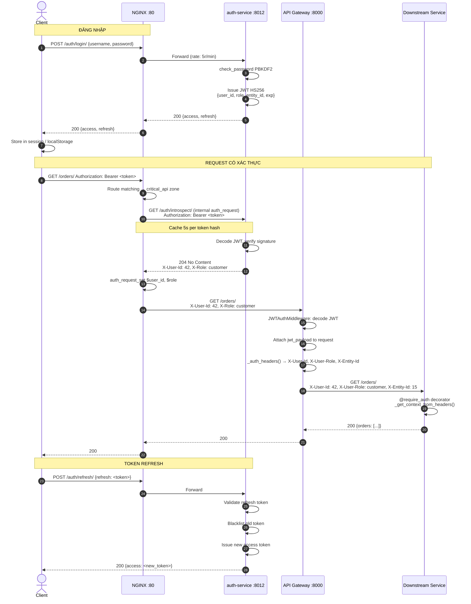

*Hình 4.3: Luồng JWT đầy đủ — đăng nhập, xác thực request, và refresh token*

### 4.5.1 Luồng xác thực đầy đủ

```
Client gửi request với Authorization: Bearer <token>
         │
         ▼
    NGINX :80
    ├── Nếu route là /auth/* → bypass auth_request, forward thẳng
    ├── Nếu route là /users/* → gọi auth_request /auth_verify
    │         ├── NGINX gọi auth-service:8000/auth/introspect/
    │         ├── auth-service decode JWT, trả về 204 + X-User-Id, X-Role
    │         └── NGINX inject X-User-Id, X-Role vào request headers
    └── Forward request → api-gateway:8000
         │
         ▼
    JWTAuthMiddleware (api-gateway)
    ├── Đọc Authorization: Bearer <token> hoặc session["access_token"]
    ├── Decode JWT bằng JWT_SECRET_KEY (HS256)
    ├── Gắn jwt_payload vào request object
    └── Nếu route protected + không có token → redirect login
         │
         ▼
    View function
    ├── _auth_headers(request) → trích xuất X-User-Id, X-User-Role, X-Entity-Id
    └── Forward headers xuống downstream services
         │
         ▼
    Downstream service (order-service, cart-service, ...)
    ├── common/auth.py: _get_context_from_headers(request)
    │   ├── Đọc HTTP_X_USER_ID, HTTP_X_USER_ROLE, HTTP_X_ENTITY_ID
    │   └── Fallback: decode JWT trực tiếp nếu headers thiếu (local dev)
    └── @require_auth / @require_customer / @require_staff decorator
```

### 4.5.2 JWT Payload Structure

```python
# Payload được nhúng khi issue token (auth-service)
{
    "user_id": 42,           # ID trong auth_db
    "username": "nguyenvana",
    "email": "nguyenvana@example.com",
    "role": "customer",      # customer | staff | manager | admin
    "entity_id": 15,         # ID trong user_db (customer_id hoặc staff_id)
    "entity_role": "",       # Vai trò phụ (nếu có)
    "exp": 1748736000,       # Expiry (24 giờ)
    "iat": 1748649600,       # Issued at
    "jti": "abc123..."       # JWT ID (unique per token)
}
```

**Tại sao cần `entity_id` riêng biệt với `user_id`?** `user_id` là ID trong `auth_db`, còn `entity_id` là ID trong `user_db`. Hai service này có DB riêng, ID có thể khác nhau. `entity_id` được dùng làm `customer_id` trong Cart, Order — đây là "business identity" của người dùng.

### 4.5.3 IntrospectTokenView — Endpoint xác thực cho NGINX

```python
# auth-service/authentication/views.py
class IntrospectTokenView(APIView):
    permission_classes = [HasValidJWT]

    def get(self, request):
        """
        NGINX gọi endpoint này qua auth_request.
        Trả về 204 No Content nếu token hợp lệ,
        kèm X-User-Id và X-Role trong response headers.
        """
        token = TokenService.extract_token(request)
        payload = TokenService.decode_token(token)

        response = Response(status=status.HTTP_204_NO_CONTENT)
        response["X-User-Id"] = str(payload.get("sub", ""))
        response["X-Role"]    = str(payload.get("role", "customer"))
        return response
```

NGINX đọc headers từ response của `auth_verify` và inject vào request gốc:
```nginx
auth_request_set $user_id $upstream_http_x_user_id;
auth_request_set $role    $upstream_http_x_role;
proxy_set_header X-User-Id $user_id;
proxy_set_header X-Role    $role;
```

### 4.5.4 RBAC Decorators trong Common Library

```python
# common/common/auth.py — Hệ thống phân quyền đầy đủ

def require_auth(view_func):
    """Yêu cầu đăng nhập — mọi role đều được phép"""
    @functools.wraps(view_func)
    def wrapper(view_instance, request, *args, **kwargs):
        user_id, role, entity_id = _get_context_from_headers(request)
        if not user_id:
            return Response({"error": "Unauthorized"}, status=401)
        _attach_context(request, user_id, role, entity_id)
        return view_func(view_instance, request, *args, **kwargs)
    return wrapper

def require_customer(view_func):
    """Chỉ customer — staff/manager không được dùng endpoint này"""
    return _require_role(["customer"])(view_func)

def require_staff(view_func):
    """Yêu cầu staff, manager, hoặc admin"""
    return _require_role(["staff", "manager", "admin"])(view_func)

def require_manager(view_func):
    """Chỉ manager và admin"""
    return _require_role(["manager", "admin"])(view_func)

def require_internal(fn):
    """
    Chỉ internal services — xác thực 4 lớp:
    1. X-Internal-Token phải khớp
    2. X-Service-Name phải trong whitelist
    3. X-Timestamp không quá 30 giây cũ (chống Replay Attack)
    4. X-Signature HMAC-SHA256 phải khớp (chống tampering)
    """
    # ... (đã trình bày chi tiết ở Chương 2) ...
```

**Ví dụ sử dụng trong views:**
```python
# order-service/order/views.py
class OrderListCreateView(APIView):
    @require_auth          # GET: mọi user đã đăng nhập
    def get(self, request):
        # ...

    @require_customer      # POST: chỉ customer mới tạo đơn được
    def post(self, request):
        # ...

class OrderDetailView(APIView):
    @require_staff         # PUT: chỉ staff mới cập nhật trạng thái
    def put(self, request, pk):
        # ...

class OrderMetricsView(APIView):
    @require_internal      # GET: chỉ internal services
    def get(self, request):
        # ...
```

### 4.5.5 Token Refresh Flow

```
Client gửi POST /auth/refresh/ với {"refresh": "<refresh_token>"}
         │
         ▼
    auth-service/authentication/views.py — RefreshView
         │
         ▼
    TokenService.refresh_access(refresh_token)
    ├── RefreshToken(refresh_token) — validate + check blacklist
    ├── Nếu ROTATE_REFRESH_TOKENS=True → issue new refresh token
    ├── Blacklist old refresh token (rest_framework_simplejwt.token_blacklist)
    └── Trả về {"access": "<new_access_token>"}
```

**Cấu hình simplejwt:**
```python
# auth-service/auth_service/settings.py
SIMPLE_JWT = {
    "ALGORITHM": "HS256",
    "SIGNING_KEY": os.environ.get("JWT_SECRET_KEY"),
    "ACCESS_TOKEN_LIFETIME":  timedelta(minutes=1440),  # 24 giờ
    "REFRESH_TOKEN_LIFETIME": timedelta(days=7),
    "ROTATE_REFRESH_TOKENS":  True,   # Mỗi lần refresh → token mới
    "BLACKLIST_AFTER_ROTATION": True, # Token cũ bị blacklist
}
```


---

## 4.6 Giao tiếp Nội bộ — InternalClient với Circuit Breaker

### 4.6.0 Sơ đồ Circuit Breaker State Machine

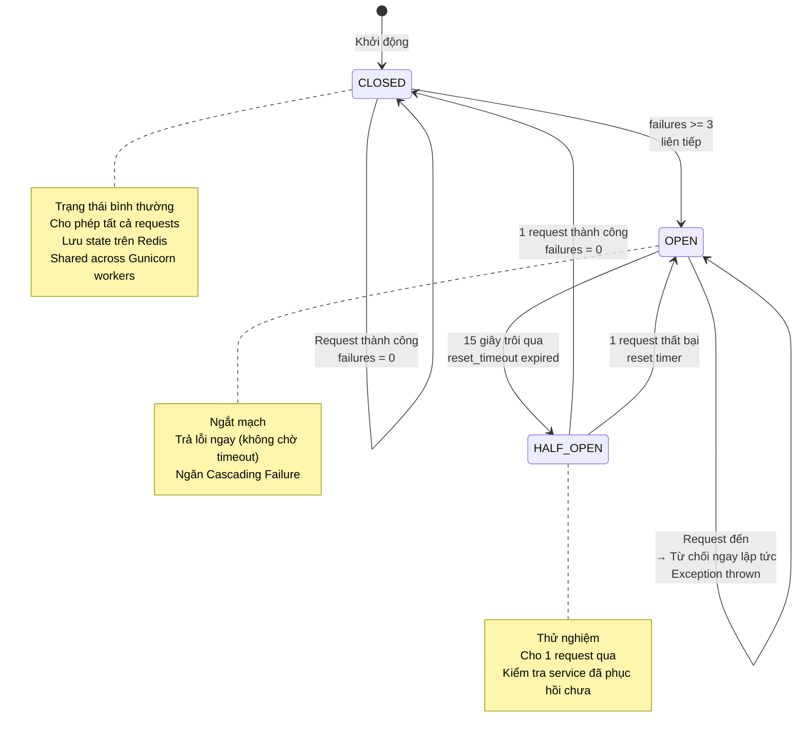

*Hình 4.4: Circuit Breaker State Machine — 3 trạng thái lưu trên Redis*

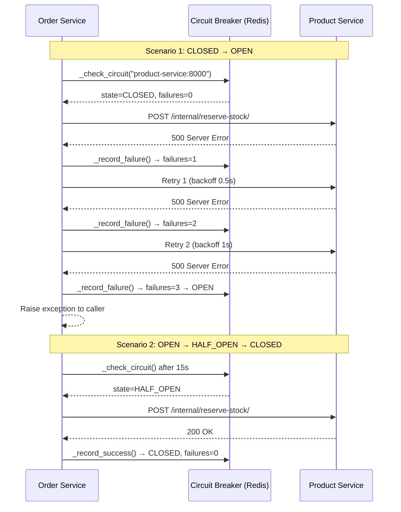

*Hình 4.5: Circuit Breaker hoạt động — từ CLOSED qua OPEN đến phục hồi*

### 4.6.1 Vấn đề của HTTP thuần túy

Khi Order Service gọi Product Service để khóa tồn kho, nếu Product Service đang bị quá tải và không phản hồi trong 30 giây, Order Service sẽ bị block 30 giây. Nếu có 100 requests đồng thời, tất cả 100 threads đều bị block → Order Service cũng sập theo. Đây là hiện tượng **Cascading Failure**.

Circuit Breaker Pattern giải quyết bằng cách "ngắt mạch" sau một số lần thất bại nhất định, trả về lỗi ngay lập tức thay vì chờ timeout.

### 4.6.2 InternalClient — Circuit Breaker Redis-backed

```python
# common/common/client.py
class CircuitState:
    CLOSED    = "CLOSED"     # Bình thường — cho phép requests
    OPEN      = "OPEN"       # Đã ngắt — từ chối tất cả requests
    HALF_OPEN = "HALF_OPEN"  # Thử nghiệm — cho phép 1 request

class InternalClient:
    def __init__(self, timeout=2.0, max_retries=2):
        self.timeout      = timeout
        self.max_retries  = max_retries
        self.service_name = os.environ.get("SERVICE_NAME", "unknown_service")
        self.internal_token   = os.environ.get("INTERNAL_TOKEN", "internal-dev-token")
        self.signing_secret   = os.environ.get("INTERNAL_SIGNING_SECRET", "internal-signing-secret")
        self.fail_threshold   = 3   # Mở circuit sau 3 lần thất bại
        self.reset_timeout    = 15  # Reset sau 15 giây

    def _check_circuit(self, host: str):
        """Đọc trạng thái circuit từ Redis — shared across workers"""
        key = f"circuit:{host}"
        data = cb_redis.get(key)
        state = json.loads(data) if data else {
            "status": CircuitState.CLOSED, "failures": 0, "last_failure_time": 0
        }

        if state["status"] == CircuitState.OPEN:
            if time.time() - state["last_failure_time"] > self.reset_timeout:
                state["status"] = CircuitState.HALF_OPEN
                cb_redis.set(key, json.dumps(state), ex=60)
            else:
                raise Exception(f"Circuit Breaker OPEN for host {host}")
        return state

    def request(self, method: str, url: str, **kwargs) -> httpx.Response:
        host = self._get_host(url)
        cb_state = self._check_circuit(host)

        # Serialize body và tạo HMAC signature
        request_body = ""
        if "json" in kwargs:
            request_body = json.dumps(kwargs["json"], separators=(",", ":"), sort_keys=True)
            kwargs["data"] = request_body
            kwargs.pop("json", None)

        headers = kwargs.pop("headers", {})
        headers.update(self._get_headers(request_body))

        attempt = 0
        backoff  = 0.5  # Exponential backoff: 0.5s, 1s, 2s

        with httpx.Client(timeout=self.timeout) as client:
            while attempt <= self.max_retries:
                start_time = time.time()
                try:
                    response = client.request(method, url, headers=headers, **kwargs)
                    latency = int((time.time() - start_time) * 1000)

                    # Log với structured metrics
                    logger.info(f"InternalClient: {method} {url}", extra={
                        "target_service": host,
                        "endpoint": url,
                        "status_code": response.status_code,
                        "latency_ms": latency,
                        "span": f"{self.service_name}->{host}"
                    })

                    if 500 <= response.status_code < 600:
                        raise httpx.HTTPStatusError(
                            f"Server error {response.status_code}",
                            request=response.request, response=response
                        )

                    self._record_success(host, cb_state)
                    return response

                except (httpx.TimeoutException, httpx.NetworkError, httpx.HTTPStatusError) as e:
                    self._record_failure(host, cb_state)
                    attempt += 1
                    if attempt > self.max_retries:
                        raise e
                    logger.warning(f"Retrying in {backoff}s...", extra={"target_service": host})
                    time.sleep(backoff)
                    backoff *= 2  # Exponential backoff
```

**Trạng thái Circuit Breaker:**

```
CLOSED (bình thường)
    │ 3 lần thất bại liên tiếp
    ▼
OPEN (ngắt mạch — từ chối ngay lập tức)
    │ 15 giây trôi qua
    ▼
HALF_OPEN (thử nghiệm — cho 1 request qua)
    ├── Thành công → CLOSED
    └── Thất bại  → OPEN (reset timer)
```

**Lý do lưu trạng thái trên Redis:** Gunicorn chạy 4 workers (4 processes riêng biệt). Nếu lưu circuit state trong memory của process, mỗi worker có state riêng — không nhất quán. Redis là shared state store, đảm bảo tất cả workers thấy cùng trạng thái circuit.

### 4.6.3 HMAC Signature Generation

```python
# common/common/client.py
def _generate_signature(self, timestamp: str, body: str) -> str:
    return hmac.new(
        self.signing_secret.encode("utf-8"),
        f"{timestamp}.{body}".encode("utf-8"),
        hashlib.sha256,
    ).hexdigest()

def _get_headers(self, request_body: str = "") -> dict:
    request_id = get_request_id() or "unknown-req-id"
    timestamp  = str(int(time.time()))
    signature  = self._generate_signature(timestamp, request_body)
    return {
        "X-Request-ID":     request_id,
        "X-Trace-ID":       request_id,   # Distributed tracing alias
        "X-Service-Name":   self.service_name,
        "X-Timestamp":      timestamp,
        "X-Signature":      signature,
        "X-Internal-Token": self.internal_token,
        "Content-Type":     "application/json"
    }
```

Mỗi internal request mang đầy đủ 6 headers bảo mật. Receiving service xác thực tất cả 6 headers trước khi xử lý.


---

## 4.7 Event-Driven Architecture — RabbitMQ và Outbox Pattern

### 4.7.0 Sơ đồ RabbitMQ Topology và Event Flow

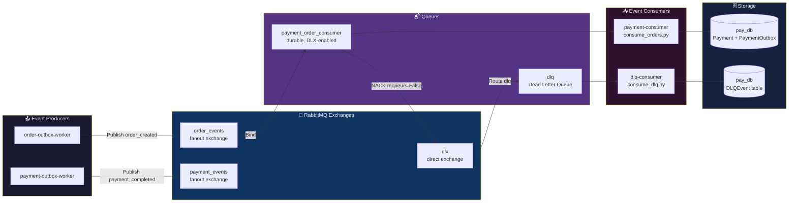

*Hình 4.6: RabbitMQ topology — fanout exchanges, DLQ, và consumer workers*

```mermaid
flowchart TD
    subgraph PROBLEM["❌ Vấn đề Dual-Write (không dùng Outbox)"]
        P1[Service ghi DB] --> P2[Service gọi RabbitMQ publish]
        P2 -->|Mạng đứt / crash| P3[DB có data<br/>Event KHÔNG được publish]
        P3 --> P4[💥 Inconsistency]
    end

    subgraph SOLUTION["✅ Giải pháp Outbox Pattern"]
        S1[BEGIN TRANSACTION] --> S2[INSERT business data]
        S2 --> S3[INSERT outbox event<br/>status=PENDING]
        S3 --> S4[COMMIT — atomic]
        S4 --> S5{Worker polls<br/>every 0.5s}
        S5 --> S6[SELECT FOR UPDATE<br/>WHERE status=PENDING]
        S6 --> S7[Publish to RabbitMQ]
        S7 -->|Success| S8[UPDATE status=PUBLISHED]
        S7 -->|Fail| S9[retry_count++<br/>≥5 → FAILED]
        S9 --> S5
    end

    style PROBLEM fill:#2d132c,color:#e8e8f0
    style SOLUTION fill:#0f3460,color:#e8e8f0
    style P4 fill:#ff6b6b,color:#fff
    style S8 fill:#00d9a3,color:#000
```

*Hình 4.7: Outbox Pattern giải quyết Dual-Write Problem*

### 4.7.1 Topology RabbitMQ

```
┌─────────────────────────────────────────────────────────────────┐
│                    RABBITMQ TOPOLOGY                            │
│                                                                 │
│  order_events (fanout exchange)                                 │
│  ├── payment_order_consumer queue ──→ payment-consumer worker   │
│  └── (future: analytics queue)                                  │
│                                                                 │
│  payment_events (fanout exchange)                               │
│  └── (future: shipping_queue, notification_queue)               │
│                                                                 │
│  dlx (direct exchange — Dead Letter)                            │
│  └── dlq queue ──→ dlq-consumer worker ──→ DLQEvent DB          │
└─────────────────────────────────────────────────────────────────┘
```

**Fanout Exchange:** Mỗi message được broadcast tới tất cả queues đang bind vào exchange. Khi thêm service mới cần lắng nghe `order_events`, chỉ cần tạo queue mới và bind — không cần sửa code publisher.

**Dead Letter Exchange (DLX):** Khi consumer xử lý thất bại và gọi `basic_nack(requeue=False)`, RabbitMQ tự động chuyển message sang DLX → DLQ. Worker `dlq-consumer` lưu vào bảng `DLQEvent` để phân tích sau.

### 4.7.2 EventPublisher — Chuẩn hóa Event Schema

```python
# common/common/events.py
class EventPublisher:
    _connection = None
    _channel    = None

    @classmethod
    def get_channel(cls):
        if not cls._connection or cls._connection.is_closed:
            host = os.environ.get("RABBITMQ_HOST", "rabbitmq")
            user = os.environ.get("RABBITMQ_USER", "user")
            pwd  = os.environ.get("RABBITMQ_PASS", "password")

            credentials = pika.PlainCredentials(user, pwd)
            parameters  = pika.ConnectionParameters(
                host=host,
                credentials=credentials,
                heartbeat=600,                  # Giữ connection sống
                blocked_connection_timeout=300  # Timeout khi RabbitMQ bị block
            )
            cls._connection = pika.BlockingConnection(parameters)
            cls._channel    = cls._connection.channel()
            cls._setup_topology()

        if cls._channel.is_closed:
            cls._channel = cls._connection.channel()
        return cls._channel

    @classmethod
    def _setup_topology(cls):
        channel = cls._channel
        # Dead Letter Exchange
        channel.exchange_declare(exchange='dlx', exchange_type='direct', durable=True)
        channel.queue_declare(queue='dlq', durable=True)
        channel.queue_bind(queue='dlq', exchange='dlx', routing_key='dlq')
        # Business Exchanges
        channel.exchange_declare(exchange='order_events',   exchange_type='fanout', durable=True)
        channel.exchange_declare(exchange='payment_events', exchange_type='fanout', durable=True)

    @classmethod
    def publish(cls, exchange: str, event_type: str, data: dict, version: int = 1):
        """
        Enterprise Event Schema chuẩn hóa:
        {event_type, version, data, trace_id, timestamp}
        """
        trace_id = get_request_id() or "unknown"
        payload  = {
            "event_type": event_type,
            "version":    version,
            "data":       data,
            "trace_id":   trace_id,
            "timestamp":  datetime.now(timezone.utc).isoformat()
        }
        channel = cls.get_channel()
        channel.basic_publish(
            exchange=exchange,
            routing_key="",   # fanout — không cần routing key
            body=json.dumps(payload),
            properties=pika.BasicProperties(
                delivery_mode=2,  # Persistent — lưu xuống disk
                headers={
                    "trace_id": trace_id,
                    "span": f"{os.environ.get('SERVICE_NAME','unknown')}->{exchange}"
                }
            )
        )
        logger.info(f"Published event {event_type} to {exchange}", extra={
            "trace_id": trace_id,
            "event_type": event_type
        })
```

### 4.7.3 Outbox Pattern — Đảm bảo At-least-once Delivery

**Vấn đề Dual-Write:** Nếu service ghi DB thành công rồi gọi RabbitMQ publish, nhưng mạng đứt giữa chừng → DB có dữ liệu nhưng event không được publish → inconsistency.

**Giải pháp Outbox:** Ghi DB + Outbox event trong cùng 1 transaction. Worker riêng đọc Outbox và publish lên RabbitMQ.

```python
# common/common/outbox.py
class AbstractOutboxEvent(models.Model):
    aggregate_id  = models.CharField(max_length=255)
    event_type    = models.CharField(max_length=255)
    payload       = models.JSONField()
    status        = models.CharField(max_length=20, default="PENDING")
    # PENDING → PUBLISHED (thành công)
    # PENDING → FAILED (sau 5 lần retry)
    created_at    = models.DateTimeField(auto_now_add=True)
    published_at  = models.DateTimeField(null=True, blank=True)
    retry_count   = models.IntegerField(default=0)
    error_message = models.TextField(blank=True)

    class Meta:
        abstract = True  # Mỗi service kế thừa và tạo bảng riêng
```

**Hai bảng Outbox trong hệ thống:**
- `order_outbox` (order-service) — events: `order_created`
- `payment_outbox` (payment-service) — events: `payment_completed`

**Relay Worker — đọc Outbox và publish:**

```python
# order-service/order/management/commands/relay_outbox.py
class Command(BaseCommand):
    def handle(self, *args, **options):
        while True:
            # Poll 50 events PENDING mỗi 0.5 giây
            events = OrderOutbox.objects.filter(
                status="PENDING"
            ).order_by("created_at")[:50]

            if not events:
                time.sleep(2)
                continue

            for event in events:
                with transaction.atomic():
                    # select_for_update — tránh 2 workers xử lý cùng event
                    e = OrderOutbox.objects.select_for_update().get(id=event.id)
                    if e.status != "PENDING":
                        continue

                    try:
                        EventPublisher.publish(
                            exchange="order_events",
                            event_type=e.event_type,
                            data=e.payload,
                            version=1
                        )
                        e.status       = "PUBLISHED"
                        e.published_at = now()
                        e.save(update_fields=["status", "published_at"])
                    except Exception as err:
                        e.retry_count   += 1
                        e.error_message  = str(err)[:500]
                        if e.retry_count >= 5:
                            e.status = "FAILED"
                        e.save(update_fields=["retry_count", "error_message", "status"])

            time.sleep(0.5)
```

### 4.7.4 Payment Consumer — Xử lý Sự kiện Bất đồng bộ

```python
# payment-service/payment/management/commands/consume_orders.py
def callback(ch, method, properties, body):
    try:
        payload    = json.loads(body)
        event_type = payload.get("event_type")

        if event_type == "order_created":
            data     = payload.get("data", {})
            order_id = data.get("order_id")
            amount   = float(data.get("total_amount", 0))

            # Idempotency — tránh xử lý 2 lần nếu message bị requeue
            if Payment.objects.filter(order_id=order_id).exists():
                ch.basic_ack(delivery_tag=method.delivery_tag)
                return

            with transaction.atomic():
                payment = Payment.objects.create(
                    order_id=order_id,
                    payment_amount=amount,
                    payment_status=PaymentStatus.COMPLETED,
                    shipping_status=ShippingStatus.PENDING
                )
                # Ghi PaymentOutbox để trigger shipping
                PaymentOutbox.objects.create(
                    aggregate_id=str(payment.id),
                    event_type="payment_completed",
                    payload={
                        "payment_id": payment.id,
                        "order_id":   order_id,
                        "amount":     str(amount),
                    }
                )

        # ACK — báo RabbitMQ đã xử lý thành công
        ch.basic_ack(delivery_tag=method.delivery_tag)

    except Exception as e:
        logger.error(f"Error processing order event: {e}")
        # NACK + requeue=False → message vào DLQ
        ch.basic_nack(delivery_tag=method.delivery_tag, requeue=False)
```

### 4.7.5 DLQ Consumer — Xử lý Message Thất bại

```python
# payment-service/payment/management/commands/consume_dlq.py
def on_dlq_message(ch, method, properties, body):
    payload    = json.loads(body.decode('utf-8', errors='replace'))
    event_type = payload.get("event_type", "unknown")
    data       = payload.get("data", {})
    order_id   = data.get("order_id", "unknown") if isinstance(data, dict) else "unknown"

    logger.error(
        "DLQ message received: event_type=%s, order_id=%s",
        event_type, order_id,
        extra={"event_type": event_type, "order_id": order_id, "body": payload}
    )

    # Lưu vào DB để phân tích và replay thủ công sau
    DLQEvent.objects.create(
        queue_name="dlq",
        exchange=getattr(method, 'exchange', ''),
        routing_key=getattr(method, 'routing_key', ''),
        body=payload,
        error_message=f"event_type={event_type}, order_id={order_id}",
    )

    ch.basic_ack(delivery_tag=method.delivery_tag)
```


---

## 4.8 Luồng Giao dịch End-to-End

### 4.8.0 Sơ đồ Tổng quan Luồng Mua hàng

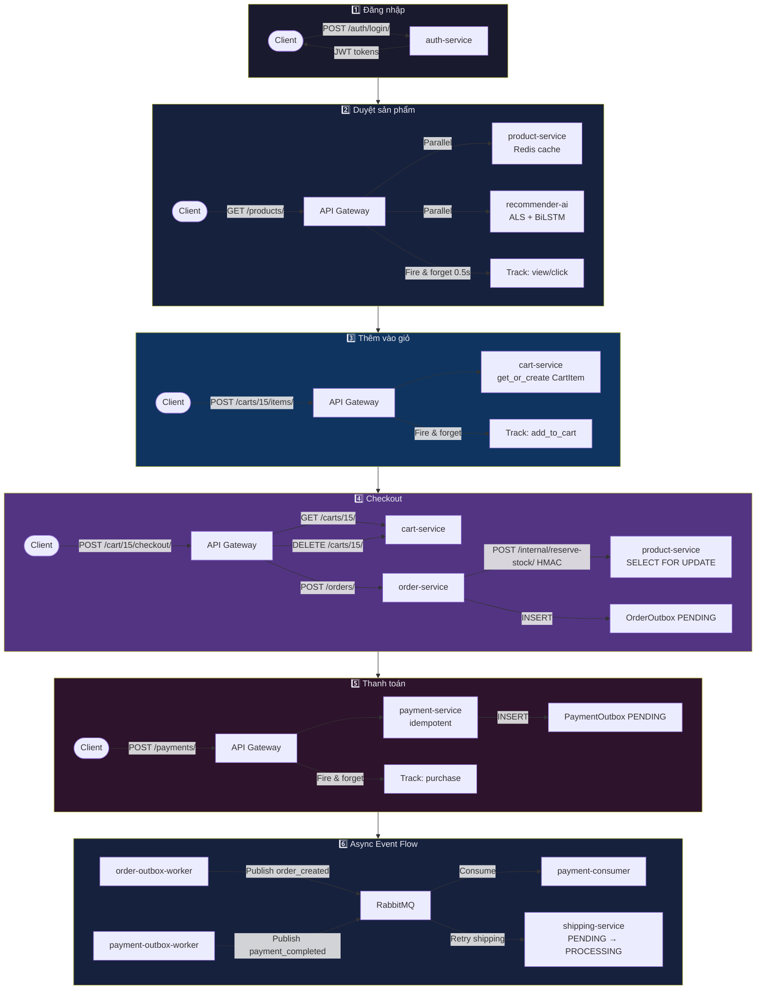

*Hình 4.8: Tổng quan luồng mua hàng 6 bước qua toàn bộ hệ thống*

### 4.8.1 Kịch bản: Khách hàng mua sách

Đây là luồng phức tạp nhất của hệ thống, đi qua 7 services và 2 message queues:

```
Bước 1: Đăng nhập
Client → NGINX → auth-service
  POST /auth/login/ {username, password}
  ← {access_token, refresh_token, user: {id, role, entity_id}}
  API Gateway lưu tokens vào Redis session

Bước 2: Duyệt sản phẩm
Client → NGINX → API Gateway → product-service
  GET /products/?page=1&page_size=10
  product-service kiểm tra Redis cache
  ← Danh sách sản phẩm (từ cache hoặc PostgreSQL)
  API Gateway gọi recommender-ai-service song song để lấy gợi ý

Bước 3: Xem chi tiết sản phẩm
Client → API Gateway → product-service
  GET /products/42/
  API Gateway track behavior: "view", "click" → recommender-ai-service

Bước 4: Thêm vào giỏ hàng
Client → API Gateway → cart-service
  POST /carts/15/items/ {product_id: 42, quantity: 2}
  cart-service: get_or_create Cart(customer_id=15)
  cart-service: get_or_create CartItem(cart, product_id=42)
  API Gateway track behavior: "add_to_cart" → recommender-ai-service

Bước 5: Checkout
Client → API Gateway
  POST /cart/15/checkout/
  API Gateway:
    1. GET cart-service /carts/15/ → lấy items
    2. POST order-service /orders/ {customer_id:15, items:[...]}
       order-service:
         a. Tạo Order(status=PENDING_PAYMENT) + OrderItems
         b. POST product-service /internal/reserve-stock/ (HMAC signed)
            product-service: SELECT FOR UPDATE, trừ stock
         c. Tạo OrderOutbox(event_type="order_created")
         ← {id: 1024, status: "pending_payment", total_amount: 250000}
    3. DELETE cart-service /carts/15/ → xóa giỏ hàng
  ← Redirect đến /orders/1024/pay/

Bước 6: Thanh toán
Client → API Gateway → payment-service
  POST /payments/ {order_id: 1024, payment_amount: 250000, payment_method_id: 1}
  payment-service:
    a. get_or_create Payment(order_id=1024) — idempotency
    b. payment_status = "completed"
    c. Tạo Transaction(type="payment", value=250000)
    d. Tạo PaymentOutbox(event_type="payment_completed")
  ← {id: 88, payment_status: "completed", transaction_ref: "abc123"}
  API Gateway track behavior: "purchase" → recommender-ai-service

Bước 7: Async — Order Outbox Relay
order-outbox-worker:
  Poll OrderOutbox WHERE status="PENDING"
  EventPublisher.publish(exchange="order_events", event_type="order_created",
                          data={order_id:1024, total_amount:"250000"})
  OrderOutbox.status = "PUBLISHED"

Bước 8: Async — Payment Consumer
payment-consumer:
  Nhận message từ order_events queue
  event_type == "order_created" → đã có Payment rồi (idempotency check)
  basic_ack()

Bước 9: Async — Payment Outbox Relay
payment-outbox-worker:
  Poll PaymentOutbox WHERE status="PENDING"
  EventPublisher.publish(exchange="payment_events", event_type="payment_completed",
                          data={payment_id:88, order_id:1024})
  PaymentOutbox.status = "PUBLISHED"

Bước 10: Async — Shipping Creation
payment-worker (retry_failed_shipping):
  Gọi shipping-service /internal/shipping/create/ {order_id: 1024}
  shipping-service:
    get_or_create Shipping(order_id=1024, status=PENDING)
    Tạo ShippingStatus(status=PENDING, description="Shipping request received.")
  Payment.shipping_status = "processing"
```

### 4.8.2 Sequence Diagram Tổng thể

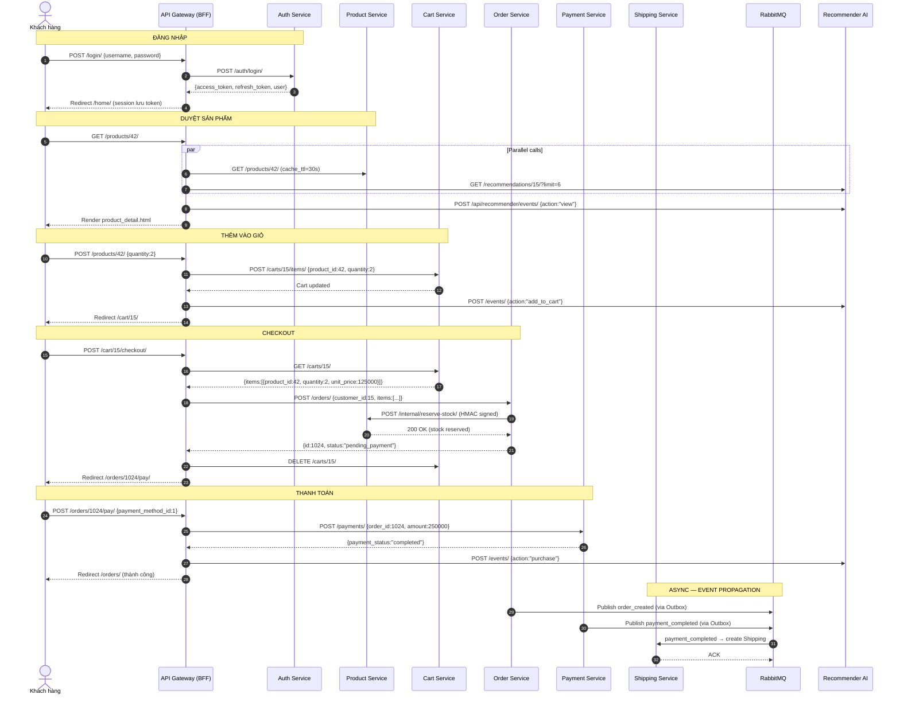


---

## 4.9 Cấu hình Môi trường — Environment Variables

### 4.9.1 File .env và .env.example

Dự án sử dụng pattern `.env` / `.env.example` chuẩn. File `.env` chứa giá trị thực và bị gitignore, `.env.example` là template cho developer mới:

```bash
# .env.example — Template cấu hình

# ── PostgreSQL ──────────────────────────────────────────────────
POSTGRES_USER=postgres
POSTGRES_PASSWORD=postgres        # ⚠️ Đổi thành password mạnh khi deploy
POSTGRES_DB=postgres
POSTGRES_PORT=5432

# ── JWT ─────────────────────────────────────────────────────────
# Phải GIỐNG NHAU ở tất cả services
# Tạo key: python -c "import secrets; print(secrets.token_hex(32))"
JWT_SECRET_KEY=ecommerce-super-secret-jwt-2026

# ── Django Secret Keys (mỗi service dùng key riêng) ─────────────
SECRET_KEY_PRODUCT=product-service-change-me-in-production
SECRET_KEY_CART=cart-service-change-me-in-production
SECRET_KEY_ORDER=order-service-change-me-in-production
SECRET_KEY_PAY=pay-service-change-me-in-production
SECRET_KEY_SHIP=ship-service-change-me-in-production
SECRET_KEY_RECOMMENDER=recommender-change-me-in-production
SECRET_KEY_GATEWAY=api-gateway-change-me-in-production

# ── Database names (Database per Service) ───────────────────────
DB_HOST=host.docker.internal
DB_PORT=5432
DB_NAME_PRODUCT=product_db
DB_NAME_CART=cart_db
DB_NAME_ORDER=order_db
DB_NAME_PAY=pay_db
DB_NAME_SHIP=ship_db
DB_NAME_RECOMMENDER=recommender_db

# ── Internal Security ────────────────────────────────────────────
INTERNAL_TOKEN=internal-dev-token
INTERNAL_SIGNING_SECRET=internal-signing-secret
INTERNAL_SIGNATURE_TOLERANCE=30
INTERNAL_ALLOWED_SERVICES=auth-service,order-service,payment-service,
  product-service,cart-service,shipping-service,user-service,recommender-ai-service

# ── AI / LLM ─────────────────────────────────────────────────────
GROQ_API_KEY=gsk_...
GROQ_MODEL=llama-3.1-8b-instant
GROQ_API_URL=https://api.groq.com/openai/v1/chat/completions

# ── Neo4j ────────────────────────────────────────────────────────
NEO4J_URI=bolt://neo4j:7687
NEO4J_USER=neo4j
NEO4J_PASSWORD=password123

# ── Debug ────────────────────────────────────────────────────────
DEBUG=True   # Đặt False khi deploy production
```

### 4.9.2 Biến môi trường quan trọng theo service

| Biến | Services sử dụng | Mô tả |
|---|---|---|
| `JWT_SECRET_KEY` | Tất cả | Khóa ký JWT — phải giống nhau |
| `INTERNAL_TOKEN` | Tất cả | Token xác thực internal calls |
| `INTERNAL_SIGNING_SECRET` | Tất cả | Khóa HMAC signature |
| `INTERNAL_ALLOWED_SERVICES` | Tất cả | Whitelist service names |
| `DB_HOST`, `DB_NAME` | Mỗi service | Kết nối PostgreSQL riêng |
| `RABBITMQ_HOST/USER/PASS` | payment-service, workers | Kết nối RabbitMQ |
| `REDIS_URL` | api-gateway, product-service | Kết nối Redis |
| `GROQ_API_KEY` | recommender-ai-service | Groq LLM API |
| `NEO4J_URI/USER/PASSWORD` | recommender-ai-service | Neo4j graph DB |
| `SERVICE_NAME` | Tất cả | Tên service cho logging/tracing |

### 4.9.3 Bảo mật Secrets trong Production

Trong môi trường production, không nên lưu secrets trong file `.env`. Các phương án thay thế:

1. **Docker Secrets:** `docker secret create jwt_key ./jwt_key.txt`
2. **Kubernetes Secrets:** `kubectl create secret generic jwt-secret --from-literal=key=...`
3. **AWS Secrets Manager / HashiCorp Vault:** Cho môi trường cloud enterprise

Dự án hiện tại dùng `.env` file phù hợp cho môi trường development và demo. Khi chuyển sang production, cần thay thế bằng một trong các phương án trên.

---

## 4.10 Hệ thống Giám sát và Observability

### 4.10.1 Distributed Tracing với Jaeger

Hệ thống tích hợp Jaeger (port 16686) để thu thập và hiển thị distributed traces. `X-Request-ID` được truyền qua tất cả services như `trace_id`, cho phép theo dõi một request từ đầu đến cuối:

```
Request ID: a1b2c3d4-e5f6-7890-abcd-ef1234567890

NGINX (0ms)
  └── api-gateway (2ms)
        ├── product-service (45ms) ← cache miss, query DB
        └── recommender-ai-service (120ms) ← ALS inference
              └── order-service (8ms) ← get customer orders
```

### 4.10.2 RabbitMQ Management UI

Truy cập `http://localhost:15672` (user: `user`, pass: `password`) để:
- Xem số lượng messages trong mỗi queue
- Monitor consumer throughput
- Xem Dead Letter Queue và replay messages
- Kiểm tra exchange bindings

### 4.10.3 Structured Logging — Metrics Extraction

Mỗi `InternalClient` request tự động log metrics:

```python
logger.info(f"InternalClient: {method} {url}", extra={
    "target_service": host,
    "endpoint":       url,
    "status_code":    response.status_code,
    "latency_ms":     latency,
    "span":           f"{self.service_name}->{host}"
})
```

Log output JSON:
```json
{
  "timestamp": "2026-05-31T10:23:45.123Z",
  "level": "INFO",
  "service_name": "order-service",
  "trace_id": "a1b2c3d4",
  "message": "InternalClient: POST http://product-service:8000/internal/reserve-stock/",
  "target_service": "product-service:8000",
  "status_code": 200,
  "latency_ms": 45,
  "span": "order-service->product-service:8000"
}
```

Các log này có thể được đẩy vào ELK Stack (Elasticsearch + Logstash + Kibana) hoặc Grafana Loki để tạo dashboard monitoring real-time.

### 4.10.4 Health Check Endpoints

Auth Service expose 2 health check endpoints chuẩn Kubernetes:

```python
# auth-service/authentication/views.py
class LiveHealthView(APIView):
    """Liveness probe — service có đang chạy không?"""
    def get(self, request):
        return Response({"status": "live"}, status=200)

class ReadyHealthView(APIView):
    """Readiness probe — service có sẵn sàng nhận traffic không?"""
    def get(self, request):
        try:
            from django.db import connection
            connection.ensure_connection()
            db_status = "ok"
        except Exception:
            db_status = "error"

        if db_status == "ok":
            return Response({"status": "ready", "database": db_status}, status=200)
        else:
            return Response({"status": "not_ready", "database": db_status}, status=503)
```

Docker Compose sử dụng health check này:
```yaml
healthcheck:
  test: ["CMD-SHELL", "python -c \"import urllib.request;
         urllib.request.urlopen('http://localhost:8000/health/live/').read()\""]
  interval: 10s
  timeout: 3s
  retries: 5
```


---

## 4.11 Đánh giá Kiến trúc — Ưu điểm, Nhược điểm và Bài học

### 4.11.0 Sơ đồ So sánh Monolith vs Microservices

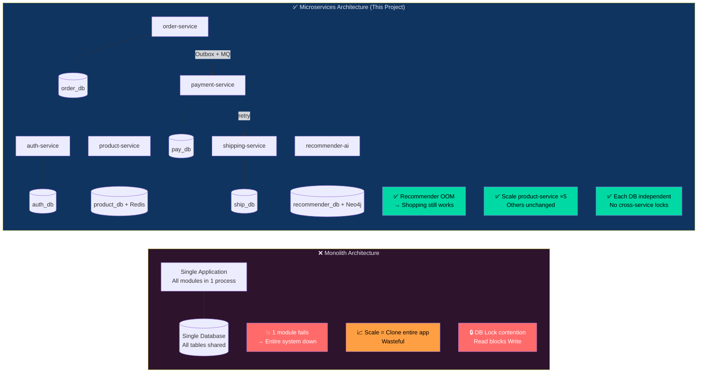

*Hình 4.9: So sánh Monolith và Microservices — fault isolation và scalability*

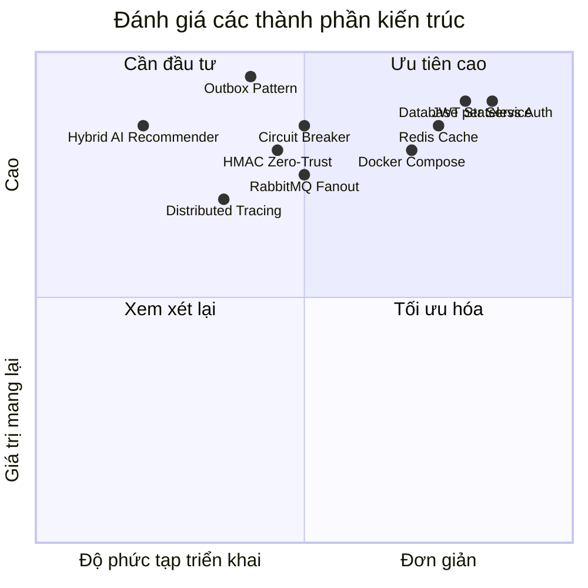

*Hình 4.10: Quadrant chart đánh giá các thành phần kiến trúc theo độ phức tạp và giá trị*

### 4.11.1 Bảng So sánh Monolith vs Microservices

| Tiêu chí | Monolith | Microservices (dự án này) |
|---|---|---|
| **Fault Isolation** | Lỗi 1 module → sập toàn hệ thống | Lỗi Recommender không ảnh hưởng Order/Payment |
| **Scalability** | Scale toàn bộ app | Scale riêng từng service (ví dụ: 5 Product containers) |
| **DB Bottleneck** | 1 DB chịu tất cả load | 8 DB riêng biệt, không tranh chấp lock |
| **Technology Freedom** | Bị lock vào 1 stack | Mỗi service chọn DB phù hợp (PostgreSQL, Neo4j, Redis) |
| **Deployment** | Deploy toàn bộ khi sửa 1 dòng | Deploy riêng từng service |
| **Development Complexity** | Đơn giản | Phức tạp hơn (distributed tracing, eventual consistency) |
| **Operational Overhead** | Thấp | Cao (20+ containers, nhiều logs) |
| **Testing** | Dễ integration test | Cần mock services, contract testing |

### 4.11.2 Ưu điểm đã được chứng minh

**1. Fault Isolation thực sự hoạt động:**
Khi Recommender AI Service bị OOM (Out of Memory) do load model Keras lớn, toàn bộ luồng mua hàng (Product → Cart → Order → Payment → Shipping) vẫn hoạt động bình thường. API Gateway gracefully degrade — trang sản phẩm hiển thị không có gợi ý AI thay vì crash.

**2. Database per Service ngăn chặn lock contention:**
Product Service chạy full-table scan để tìm kiếm sản phẩm (query nặng) không ảnh hưởng đến Order Service đang xử lý thanh toán. Hai DB hoàn toàn độc lập.

**3. Outbox Pattern đảm bảo không mất event:**
Trong quá trình test, khi tắt RabbitMQ đột ngột sau khi Order được tạo, Outbox event vẫn còn trong `order_outbox` table với status `PENDING`. Khi RabbitMQ khởi động lại, worker tự động relay event — không mất dữ liệu.

**4. Circuit Breaker ngăn Cascading Failure:**
Khi Product Service bị tắt, Order Service không bị block vô hạn. Circuit Breaker mở sau 3 lần thất bại, trả về lỗi ngay lập tức. Sau 15 giây, tự động thử lại.

### 4.11.3 Nhược điểm và Thách thức

**1. Yêu cầu tài nguyên cao:**
Chạy đầy đủ hệ thống cần tối thiểu 8GB RAM:
- 8 PostgreSQL instances: ~200MB × 8 = 1.6GB
- RabbitMQ: ~300MB
- Neo4j: ~500MB
- Redis: ~50MB
- 8 Django services: ~150MB × 8 = 1.2GB
- Recommender AI (torch + tensorflow): ~2GB
- NGINX, Jaeger: ~100MB
- **Tổng: ~6–8GB**

**2. Distributed Debugging phức tạp:**
Khi có bug trong luồng Order → Payment, cần kiểm tra log của 3–4 services và 2 workers. Không có `X-Request-ID` thì gần như không thể trace được.

**3. Eventual Consistency cần xử lý cẩn thận:**
Sau khi thanh toán thành công, Order status vẫn là `pending_payment` trong vài giây cho đến khi consumer xử lý event. Nếu khách hàng refresh ngay lập tức, họ thấy trạng thái cũ. Cần xử lý UX phù hợp (loading state, polling).

**4. Idempotency phải được implement ở mọi nơi:**
RabbitMQ đảm bảo at-least-once delivery — message có thể được deliver nhiều lần. Mọi consumer phải implement idempotency check (ví dụ: `Payment.objects.filter(order_id=order_id).exists()`).

### 4.11.4 Bài học Kiến trúc

1. **Data trước, Model sau:** Bài học từ AI Service — dù kiến trúc BiLSTM phức tạp đến đâu, nếu dữ liệu có entropy quá cao (ceiling 33.8%), model không thể học được. Fix data trước, rồi mới optimize model.

2. **Outbox Pattern là bắt buộc, không phải optional:** Dual-Write Problem là thực tế, không phải lý thuyết. Bất kỳ hệ thống nào ghi DB rồi gọi external service đều có nguy cơ inconsistency.

3. **Circuit Breaker phải dùng shared state:** In-memory circuit breaker không hoạt động với multi-process servers (Gunicorn). Phải dùng Redis hoặc database để lưu state.

4. **Structured Logging từ đầu:** Thêm `trace_id` và `span` vào mọi log từ ngày đầu tiên. Rất khó retrofit sau khi hệ thống đã lớn.

5. **Healthcheck là bắt buộc:** Docker Compose `depends_on: condition: service_healthy` ngăn chặn race condition khi khởi động. Không có healthcheck, services thường crash khi DB chưa sẵn sàng.

---

## 4.12 Hướng dẫn Triển khai

### 4.12.1 Yêu cầu hệ thống

| Thành phần | Tối thiểu | Khuyến nghị |
|---|---|---|
| RAM | 8GB | 16GB |
| CPU | 4 cores | 8 cores |
| Disk | 20GB | 50GB |
| OS | Linux/macOS/Windows (WSL2) | Ubuntu 22.04 LTS |
| Docker | 24.0+ | Latest |
| Docker Compose | 2.20+ | Latest |

### 4.12.2 Các bước triển khai

```bash
# Bước 1: Clone repository
git clone <repo_url>
cd e-commerce

# Bước 2: Tạo file .env từ template
cp .env.example .env
# Chỉnh sửa .env với giá trị thực (đặc biệt là POSTGRES_PASSWORD, JWT_SECRET_KEY)

# Bước 3: Build và khởi động toàn bộ hệ thống
docker-compose up -d --build

# Bước 4: Kiểm tra trạng thái
docker-compose ps

# Bước 5: Xem logs
docker-compose logs -f api-gateway
docker-compose logs -f order-outbox-worker

# Bước 6: Truy cập hệ thống
# Web UI:          http://localhost:80
# API Gateway:     http://localhost:8000
# RabbitMQ UI:     http://localhost:15672 (user/password)
# Neo4j Browser:   http://localhost:7474
# Jaeger UI:       http://localhost:16686
```

### 4.12.3 Thứ tự khởi động

Docker Compose tự động xử lý dependency chain nhờ `depends_on` + `healthcheck`:

```
1. Databases (product-db, cart-db, order-db, payment-db, shipping-db,
              user-db, recommender-db, auth-db) — song song
2. RabbitMQ, Redis, Neo4j — song song
3. auth-service, user-service, product-service, cart-service — sau khi DB healthy
4. order-service, payment-service, shipping-service — sau khi DB healthy
5. recommender-ai-service — sau khi recommender-db và neo4j healthy
6. api-gateway — sau khi tất cả services healthy
7. nginx — sau khi api-gateway và auth-service healthy
8. Workers (order-outbox-worker, payment-consumer, payment-outbox-worker,
            dlq-consumer, payment-worker) — sau khi DB và RabbitMQ healthy
```

### 4.12.4 Checklist Kiểm tra sau Triển khai

```bash
# Kiểm tra tất cả containers đang chạy
docker-compose ps | grep -v "Up"   # Không có output = tất cả đang chạy

# Kiểm tra health của auth-service
curl http://localhost:8012/health/live/
# Expected: {"status": "live"}

curl http://localhost:8012/health/ready/
# Expected: {"status": "ready", "database": "ok"}

# Kiểm tra API Gateway
curl http://localhost:8000/products/
# Expected: {"count": N, "results": [...]}

# Kiểm tra RabbitMQ exchanges
curl -u user:password http://localhost:15672/api/exchanges
# Expected: order_events, payment_events, dlx exchanges

# Test đăng ký tài khoản
curl -X POST http://localhost:80/auth/register/ \
  -H "Content-Type: application/json" \
  -d '{"username":"test","email":"test@test.com","password":"Test@1234","role":"customer"}'
# Expected: {"access": "...", "refresh": "...", "user": {...}}
```

---

## 4.13 Tổng kết Chương 4

Chương này đã trình bày toàn diện kiến trúc tích hợp và triển khai của hệ thống E-commerce Microservices:

| Thành phần | Giải pháp | Kết quả |
|---|---|---|
| **Containerization** | Docker + Docker Compose | 20+ containers, 1 lệnh khởi động |
| **Service Discovery** | Docker DNS (tên container) | Không cần service registry |
| **Authentication** | JWT HS256 + NGINX auth_request | Stateless, cache 5s, zero DB query |
| **Authorization** | RBAC decorators (common/auth.py) | 4 roles, 4 lớp kiểm tra |
| **Internal Security** | HMAC-SHA256 + Replay Attack prevention | Zero-Trust internal network |
| **Resilience** | Circuit Breaker (Redis) + Retry | Cascading failure prevention |
| **Messaging** | RabbitMQ + Outbox Pattern | At-least-once delivery, no data loss |
| **Caching** | Redis (product cache + session) | 3–10 phút TTL, version-based invalidation |
| **Observability** | JSON logging + X-Request-ID + Jaeger | Distributed tracing across 8 services |
| **Scalability** | Database per Service + Stateless JWT | Horizontal scale từng service độc lập |

Kiến trúc này đặt nền móng vững chắc cho một hệ thống E-commerce có khả năng phục vụ hàng nghìn người dùng đồng thời, chịu lỗi cao, và dễ dàng mở rộng thêm tính năng mới mà không ảnh hưởng đến các module đang hoạt động ổn định.
