# CHƯƠNG 4: XÂY DỰNG VÀ TÍCH HỢP TOÀN BỘ HỆ THỐNG

> **Phạm vi:** Mọi mô tả trong chương này đối chiếu trực tiếp với repository `e-commerce` — `docker-compose.yml`, `api-gateway/`, 14+ microservice Django, `nginx/`, `common/`, `recommender-ai-service/`. Thành phần không có trong code được ghi: **"Không tìm thấy trong source code dự án"**.

---

## MỤC LỤC CHƯƠNG 4

| Mục | Tiêu đề |
|-----|---------|
| **4.1** | Tổng quan quá trình xây dựng hệ thống |
| **4.2** | Kiến trúc triển khai thực tế |
| **4.3** | Cấu trúc source code |
| **4.4** | Công nghệ sử dụng |
| **4.5** | Xây dựng Backend |
| **4.6** | Xây dựng AI Service |
| **4.7** | Tích hợp AI và hệ thống thương mại điện tử |
| **4.8** | Triển khai Knowledge Base |
| **4.9** | Triển khai Graph Database |
| **4.10** | Triển khai Recommendation System |
| **4.11** | Triển khai Chatbot |
| **4.12** | Triển khai hệ thống bằng Docker |
| **4.13** | Triển khai API |
| **4.14** | Thể hiện kết quả hệ thống |
| 4.14.1–4.14.11 | Các màn hình chi tiết |
| **4.15** | Đánh giá kết quả triển khai |
| **4.16** | Nhận xét chương |

---

## 4.1 TỔNG QUAN QUÁ TRÌNH XÂY DỰNG HỆ THỐNG

### 4.1.1 Mục tiêu triển khai

Đồ án không dừng ở thiết kế trên giấy (Chương 2) và thiết kế AI (Chương 3) mà **hiện thực hóa** thành hệ thống chạy được bằng `docker-compose up`. Mục tiêu cụ thể:

| STT | Mục tiêu | Cách đo lường trong dự án |
|-----|----------|---------------------------|
| M1 | Khách hàng mua hàng end-to-end | Đăng ký → xem SP → giỏ → checkout → thanh toán → theo dõi đơn |
| M2 | Microservice độc lập | Mỗi domain có DB riêng, deploy container riêng |
| M3 | Bảo mật xuyên service | JWT + HMAC nội bộ (`common/auth.py`) |
| M4 | AI tích hợp storefront | Gợi ý trang chủ, chatbot Mochi, behavior tracking |
| M5 | Vận hành async | RabbitMQ outbox: payment → shipping, events → AI |
| M6 | Mở rộng SAGA v2 | `catalog-service` + `inventory-service` (song song legacy) |

### 4.1.2 Các thành phần hệ thống sau khi hoàn thiện

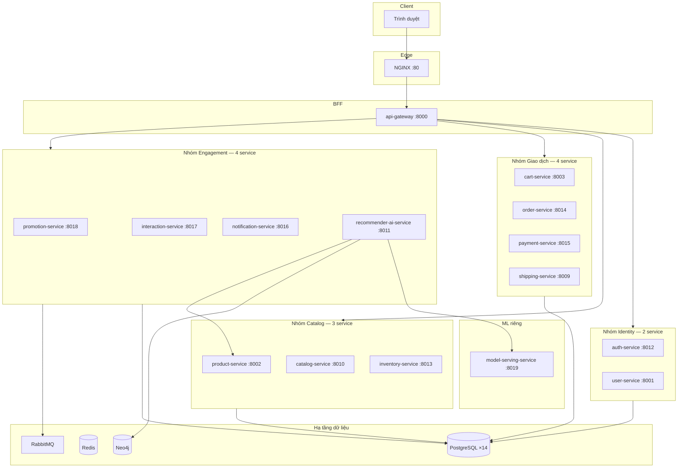

### 4.1.3 Phạm vi triển khai

**Trong phạm vi đồ án (có trong repo):**
- Storefront Django Templates qua `api-gateway` (không SPA React)
- Luồng đặt hàng **legacy** qua `order-service/orders/` + `product-service/reserve-stock`
- Thanh toán MOCK/COD qua `payment-service`
- AI: hybrid recommender + RAG chatbot + Neo4j event sync
- Portal Staff (`/staff/`) và Admin (`/admin/`)

**Ngoài phạm vi / chưa hoàn thiện:**
- Checkout SAGA v2 trên BFF (code có, storefront chưa gọi)
- OAuth Google/Facebook, OTP, quên mật khẩu
- Payment gateway thật VNPay/MoMo
- Kubernetes production
- **React/Next.js:** Không tìm thấy trong source code dự án

### 4.1.4 Vai trò từng lớp — giải thích dễ hiểu

| Thành phần | Vai trò (nói đơn giản) | Thư mục / container |
|------------|------------------------|-------------------|
| **Frontend** | Giao diện HTML user nhìn thấy | `api-gateway/templates/`, `static/` |
| **Backend API** | 14 microservice xử lý nghiệp vụ — mỗi service 1 container + 1 DB | `*-service/` |
| **BFF (api-gateway)** | Gọi nhiều microservice, gộp kết quả thành 1 trang HTML | `api-gateway/gateway/` |
| **Database** | Mỗi service 1 DB PostgreSQL riêng | `*-db` containers |
| **AI Service** | Gợi ý + chat | `recommender-ai-service` |
| **Knowledge Base** | Catalog text cho chatbot | `catalog_hybrid_index.pkl` |
| **Vector index** | Embedding tìm kiếm semantic | pickle in-memory (**không ChromaDB**) |
| **Neo4j** | Đồ thị user–product | container `neo4j` |
| **Recommendation Engine** | `RecommenderService` hybrid | Python in-process |
| **LLM** | Groq API sinh câu trả lời | `rag/rag_llm.py` |

### 4.1.5 Quy trình xây dựng theo giai đoạn

1. **Giai đoạn 1 — Hạ tầng:** `docker-compose.yml`, PostgreSQL, Redis, RabbitMQ, `common/`.
2. **Giai đoạn 2 — Core commerce:** auth → user → product → cart → order → payment → shipping.
3. **Giai đoạn 3 — BFF:** `api-gateway` templates + proxy REST nội bộ.
4. **Giai đoạn 4 — Mở rộng:** promotion, interaction, notification (code), catalog/inventory v2.
5. **Giai đoạn 5 — AI:** recommender-ai-service, Neo4j, chatbot widget, behavior tracking.
6. **Giai đoạn 6 — Edge:** NGINX rate limit, auth_request introspect.

### 4.1.6 Liên kết Chương 2 và Chương 3 với triển khai

| Thiết kế (Chương 2–3) | Triển khai thực tế (Chương 4) |
|------------------------|-------------------------------|
| Microservice architecture | 14 service + workers trong compose |
| API Gateway pattern | `api-gateway` Django BFF |
| RAG + GraphRAG | `hybrid_retriever.py` + `GraphRepository` + Neo4j |
| Hybrid recommender | `RecommenderService` 5 chiến lược |
| Event-driven | RabbitMQ consumers |
| Docker deployment | `docker-compose.yml` đầy đủ |

### Nhận xét mục 4.1

Chương 4 mô tả **hệ thống thật đang chạy**, không phải kiến trúc lý tưởng. Hai luồng order (legacy + SAGA) cùng tồn tại — cần nêu rõ khi bảo vệ.

## 4.2 KIẾN TRÚC TRIỂN KHAI THỰC TẾ

### 4.2.1 Sơ đồ kiến trúc hệ thống

Sơ đồ dưới đây mô tả **luồng thực tế** khi người dùng truy cập website — không phải sơ đồ lý thuyết từ Chương 2.

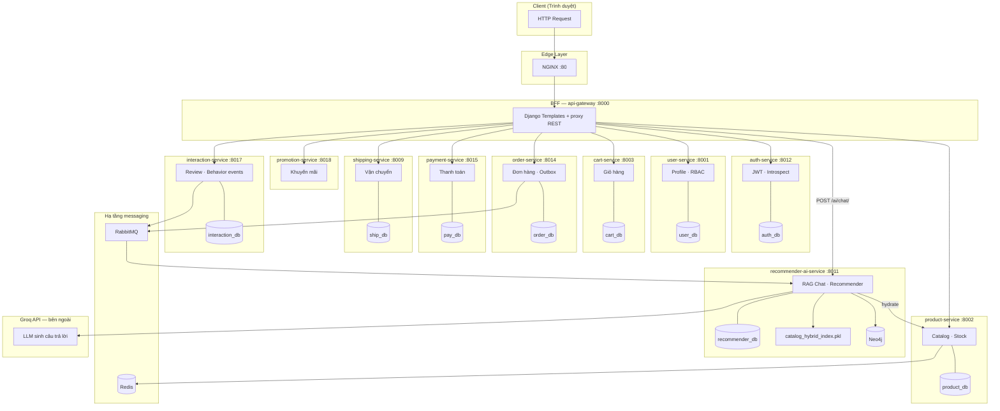

**Phân tích sơ đồ:** Mỗi microservice là **một hộp riêng** kèm database riêng (Database-per-Service). Người dùng **không** gọi trực tiếp microservice — mọi request đi qua NGINX → `api-gateway`. Gateway vừa render HTML, vừa proxy REST nội bộ. `recommender-ai-service` là container độc lập; gateway chỉ forward `/ai/chat/` và `/recommendations/` để tránh lộ API key Groq và CORS.

### 4.2.2 Vai trò từng thành phần

| Thành phần | Vai trò | File / container tham chiếu |
|------------|---------|----------------------------|
| **Client** | Gửi HTTP, lưu session cookie Django | Trình duyệt |
| **NGINX** | Reverse proxy, rate limit, `auth_request` introspect JWT | `nginx/nginx.conf`, container `nginx` |
| **Frontend** | Template HTML + vanilla JS infinite scroll | `api-gateway/templates/`, `static/` |
| **Backend API** | Nghiệp vụ tách domain | 14 service trong `docker-compose.yml` |
| **Database** | Persistence theo service | `*-db` containers |
| **AI Service** | Gợi ý + chat RAG | `recommender-ai-service/` |
| **Knowledge Base** | Catalog text đã chunk/index | `rag/catalog_hybrid_index.pkl` |
| **Vector Database** | Embedding + TF-IDF in-memory | `HybridProductRetriever` — **không ChromaDB/FAISS persistent** |
| **Neo4j** | Đồ thị user–product cho pipeline GNN | container `neo4j`, `recommendation_pipeline.py` |
| **Recommendation Engine** | Hybrid CF + co-occurrence + category | `RecommenderService` |
| **LLM** | Sinh câu trả lời chatbot | Groq qua `rag/rag_llm.py` |

### 4.2.3 Luồng request — ví dụ khách xem trang chủ

1. **Client** gửi `GET /` kèm session cookie.
2. **NGINX** chuyển tiếp tới `api-gateway:8000`.
3. **Gateway** `home()` đọc JWT từ session, xác định role (`permissions.py`).
4. Nếu **customer**: gọi song song:
   - `GET product-service/products/?flash_sale=true`
   - `GET product-service/categories/`
   - `GET recommender-ai-service/recommendations/{entity_id}/`
5. **product-service** truy vấn `product_db`, trả JSON.
6. **recommender-ai-service** đọc behavior từ `recommender_db`, chạy `RecommenderService.recommend()`, trả `recommended_product_ids`.
7. Gateway hydrate product detail từ product-service, format giá VND (`_fmt_product`), render `home.html`.

### 4.2.4 Luồng response

Response luôn là **HTML** (storefront) hoặc **JSON** (API phụ: `/api/home/products/`, `/ai/chat/`). Gateway không trả raw microservice response cho user — nó **biến đổi** dữ liệu:
- Format tiền: `_fmt_vnd()`
- Format ngày: `_fmt_date()`
- Dịch trạng thái: `ORDER_STATUS_VI`, `PRODUCT_STATUS_VI`
- Gộp nhiều API thành một context template

### 4.2.5 Luồng request — đặt hàng (legacy)

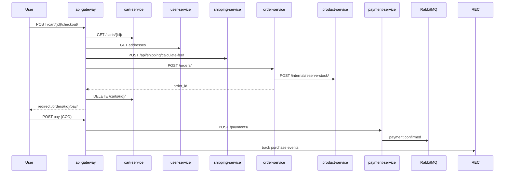

**Phân tích:** Storefront dùng luồng **legacy** `POST order-service/orders/`, không gọi SAGA `POST /api/v1/orders/checkout/` của `catalog-service` + `inventory-service`. Đây là điểm quan trọng khi đối chiếu Chương 2 với triển khai thực tế.

### Nhận xét mục 4.2

Kiến trúc triển khai là **BFF + microservices + AI sidecar**. AI không nằm trong critical path đặt hàng nhưng ảnh hưởng trải nghiệm (gợi ý, chat, behavior tracking).

## 4.3 CẤU TRÚC SOURCE CODE

### 4.3.1 Tổng quan monorepo

Repository `e-commerce` tổ chức theo **monorepo microservice**: mỗi thư mục top-level là một service độc lập có `Dockerfile`, `requirements.txt`, `manage.py` (Django) hoặc FastAPI.

```
e-commerce/
├── api-gateway/          # BFF + storefront templates
├── auth-service/
├── user-service/
├── product-service/      # Catalog storefront (legacy)
├── catalog-service/      # Catalog v2 (SAGA)
├── inventory-service/    # Tồn kho v2
├── cart-service/
├── order-service/
├── payment-service/
├── shipping-service/
├── promotion-service/
├── interaction-service/  # Review, wishlist, tickets
├── notification-service/
├── recommender-ai-service/  # AI: RAG + recommender + Neo4j
├── common/               # Shared auth client, middleware
├── nginx/
├── scripts/              # E2E test, seed
├── docker-compose.yml
└── docs/                 # Tài liệu đồ án
```

### 4.3.2 Vai trò từng thư mục chính

#### api-gateway/

| Thư mục / file | Vai trò |
|----------------|---------|
| `gateway/views.py` | Logic BFF: login, home, checkout, AI proxy (~2200 dòng) |
| `gateway/urls.py` | Route storefront (~98 paths) |
| `gateway/behavior_tracking.py` | Gửi event tới recommender + interaction |
| `gateway/admin_views.py` | Portal quản trị |
| `gateway/staff_views.py` | Portal nhân viên |
| `templates/` | HTML Django (home, checkout, product_detail...) |
| `static/` | CSS, JS (infinite scroll, chatbot widget embed) |

**Vì sao BFF tách riêng:** Tránh CORS, gom nhiều API, giữ session server-side, render SEO-friendly HTML. Khách hàng không cần SPA phức tạp.

#### recommender-ai-service/

| Thư mục | Vai trò |
|---------|---------|
| `app/views/` | API: recommendations, chat, events |
| `app/services/` | `recommender_service.py`, `graph/`, pipeline |
| `app/repositories/` | Truy vấn `recommender_db` |
| `rag/` | `hybrid_retriever.py`, `rag_llm.py`, `intent_router.py` |
| `app/management/commands/` | `build_catalog_index`, `train_implicit_cf_local` |
| `static/` | `chatbot-widget.js` |

#### common/

Thư viện dùng chung: `InternalClient` ký HMAC request nội bộ, middleware xác thực service-to-service. Tránh copy-paste auth logic 14 lần.

### 4.3.3 Cấu trúc điển hình một microservice Django

Mỗi `*-service/` tuân pattern:

```
*-service/
├── Dockerfile
├── entrypoint.sh       # migrate + seed + runserver/gunicorn
├── manage.py
├── *_service/
│   ├── settings.py     # DB, RabbitMQ, Redis env
│   ├── urls.py
│   └── wsgi.py
└── <app_name>/
    ├── models.py
    ├── views.py / viewsets
    ├── serializers.py
    ├── urls.py
    ├── services.py     # business logic
    └── migrations/
```

**Ưu điểm:**
- Service độc lập deploy, scale, migrate DB riêng
- Lỗi một service không sập toàn bộ (circuit breaker ở gateway qua timeout/retry)
- Team có thể phân công theo domain

**Hạn chế:**
- Phức tạp vận hành (40+ container trong `docker-compose.yml`)
- Distributed transaction cần SAGA/outbox (đã có code v2, storefront chưa dùng hết)

### 4.3.4 Luồng import và phụ thuộc

- **Gateway → Services:** HTTP sync qua `SERVICE_URLS` trong `settings.py`
- **Services → Services:** Internal endpoints (`/internal/...`) + HMAC headers
- **Services → RabbitMQ:** Outbox pattern (`payment-outbox-worker`, `order-outbox-worker`)
- **recommender-consumer:** Nghe event, cập nhật Neo4j + behavior
- **AI → product-service:** Hydrate metadata sản phẩm khi recommend/chat

### Nhận xét mục 4.3

Cấu trúc source phản ánh **domain-driven decomposition**. Storefront tập trung ở `api-gateway`; AI tập trung ở `recommender-ai-service` — ranh giới rõ, dễ mở rộng.

## 4.4 CÔNG NGHỆ SỬ DỤNG

> Chỉ liệt kê công nghệ **có trong source code**. Công nghệ không tìm thấy được ghi rõ.

### 4.4.1 Frontend — Django Templates + Vanilla JavaScript

| Công nghệ | Vai trò | Lý do chọn | Tích hợp | Ưu điểm | Hạn chế |
|-----------|---------|------------|----------|---------|---------|
| **Django Templates** | Render HTML server-side | Gateway đã là Django; không cần thêm build toolchain SPA | `render(request, "home.html", ctx)` trong `views.py` | SEO tốt, session đơn giản, ít dependency JS | UX động kém hơn React |
| **Vanilla JS** | Infinite scroll, AJAX voucher/shipping | Tránh webpack phức tạp cho đồ án | `static/js/`, fetch `/api/home/products/` | Nhẹ, không lock-in framework | Khó maintain UI lớn |

**ReactJS / NextJS / VueJS:** Không tìm thấy trong source code dự án. Frontend thực tế là Django Templates.

### 4.4.2 Backend — Django + Django REST Framework

| Công nghệ | Vai trò | Lý do | Tích hợp |
|-----------|---------|-------|----------|
| **Django 4.x** | Framework chính 14+ service | Mature ORM, admin, ecosystem | Mỗi service `manage.py` |
| **Django REST Framework** | REST API | Serializer, ViewSet, pagination | `order-service`, `interaction-service`, `catalog-service`... |
| **Gunicorn** | WSGI production | Entrypoint container | `entrypoint.sh` |

**FastAPI:** Không dùng cho core commerce. AI service cũng là Django (không phải FastAPI).

### 4.4.3 Database — PostgreSQL

| Công nghệ | Vai trò | Lý do | Tích hợp |
|-----------|---------|-------|----------|
| **PostgreSQL 15** | Primary DB mỗi service | ACID, JSON field, mature | 14 container `*-db` trong compose |
| **Redis 7** | Cache session gateway, order lock | Nhanh, ephemeral | `redis`, `order-redis` |

**MySQL / SQLite:** Không dùng production (chỉ có thể test local đơn lẻ).

### 4.4.4 Message Queue — RabbitMQ

| Vai trò | Lý do | Tích hợp |
|---------|-------|----------|
| Async: payment → shipping, order events → AI | Tách synchronous checkout khỏi side-effect | `payment-consumer`, `recommender-consumer`, outbox workers |

### 4.4.5 AI & ML

| Công nghệ | Vai trò | File tham chiếu | Ghi chú |
|-----------|---------|-----------------|---------|
| **Sentence Transformers** | Embedding catalog | `hybrid_retriever.py`, `EMBEDDING_MODEL` | `paraphrase-multilingual-MiniLM-L12-v2` |
| **scikit-learn** | TF-IDF, TruncatedSVD, cosine | `hybrid_retriever.py` | Sparse + dense hybrid |
| **Groq API** | LLM chatbot | `rag/rag_llm.py` | Cần `GROQ_API_KEY` |
| **implicit / ALS** | Collaborative filtering | `implicit_cf_engine.py` | Matrix factorization |
| **BiLSTM** | Next-action prediction | `behavior_prediction_service.py` | Artifact pickle |
| **NetworkX** | Graph KB fallback | `rag_llm.py` | Khi Neo4j/json graph |
| **Neo4j 5** | Graph store runtime | `recommendation_pipeline.py` | bolt://neo4j:7687 |
| **numpy** | Vector ops | Khắp recommender-ai-service | In-memory similarity |

**LangChain / LlamaIndex:** Không tìm thấy import trong `requirements.txt` recommender-ai-service.

**ChromaDB / FAISS persistent:** Không dùng. Vector index lưu trong `catalog_hybrid_index.pkl`, load RAM qua `pickle`.

**OpenAI API:** Không dùng. LLM thực tế là Groq.

**HuggingFace:** Dùng gián tiếp qua `sentence-transformers` model trên HuggingFace Hub.

### 4.4.6 Deployment

| Công nghệ | Vai trò | File |
|-----------|---------|------|
| **Docker** | Đóng gói mỗi service | `*/Dockerfile` |
| **Docker Compose** | Orchestration local/staging | `docker-compose.yml` (~1130 dòng) |
| **NGINX** | Reverse proxy, TLS termination ready | `nginx/` |

**Kubernetes:** Không tìm thấy manifest trong repo.

### Nhận xét mục 4.4

Stack thực tế là **Django microservices + Django BFF + Python AI service**. Không có SPA framework. AI stack tự xây (RAG hybrid + Groq) thay vì LangChain — giảm dependency, tăng kiểm soát pipeline.

## 4.5 XÂY DỰNG BACKEND

Phần này phân tích **các domain service** mà storefront thực sự gọi. Review nằm trong `interaction-service` (không có `review-service` riêng).

### 4.5.1 Authentication (auth-service)

#### Mục tiêu
Xác thực danh tính, cấp JWT, hỗ trợ NGINX `auth_request` introspect.

#### Chức năng
- Đăng ký tài khoản (`RegisterView`)
- Đăng nhập theo role customer/staff/admin (`LoginView`)
- Refresh token (`RefreshView`)
- Introspect token cho edge proxy (`IntrospectTokenView`)
- Rate limit login theo IP (`_rate_limit_login`)

#### API

| Method | Endpoint | Chức năng |
|--------|----------|-----------|
| POST | `/auth/register/` | Tạo user + customer profile |
| POST | `/auth/login/` | Trả `access`, `refresh`, `user` |
| POST | `/auth/refresh/` | Làm mới access token |
| GET | `/auth/introspect/` | Validate token (NGINX) |
| GET | `/users/me/` | Profile JWT hiện tại |

#### Code Structure

Gateway không xử lý auth trực tiếp — chỉ proxy:

```python
# api-gateway/gateway/views.py — login_view
r = requests.post(
    f"{SVC['auth']}/auth/login/",
    json={"username": username, "password": password, "role": login_type},
    timeout=5,
)
if r.status_code == 200:
    data = r.json()
    request.session["access_token"] = data["access"]
    request.session["user"] = data["user"]
```

`auth-service` dùng `AuthService.register()` / `login()` trong `authentication/services.py`, ghi audit `AuthAudit`, hash password Django.

#### Database Interaction
- Bảng user, role mapping trong `auth_db` (PostgreSQL container `auth-db`)
- Redis/cache cho rate limit login

---

### 4.5.2 User Service (user-service)

#### Mục tiêu
Quản lý profile, địa chỉ giao hàng — phục vụ checkout.

#### Chức năng
- CRUD địa chỉ (`AddressListView`, `AddressDetailView`)
- Profile nội bộ (`UserProfileView`)
- Danh sách customer cho staff (`CustomerListView`)

#### API chính (gateway gọi)

| Method | Endpoint | Khi nào gọi |
|--------|----------|-------------|
| GET | `/internal/users/{uuid}/addresses/` | Checkout GET — load địa chỉ |
| POST | `/internal/users/{uuid}/addresses/` | Thêm địa chỉ từ profile/checkout |
| PUT | `/internal/users/{uuid}/addresses/{id}/` | Đặt default, sửa địa chỉ |

#### Luồng checkout
`checkout()` gọi `_resolve_user_address()` → `GET user-service` addresses → validate snapshot → embed vào `shipping_address` khi `POST order-service/orders/`.

#### Database
- `user_db`: bảng `Address`, `UserProfile`, liên kết `customer_id`

---

### 4.5.3 Product Service (product-service)

#### Mục tiêu
Catalog **storefront** — sản phẩm, category, brand, variant, tồn kho đơn giản.

#### Chức năng
- CRUD sản phẩm (staff/admin qua gateway)
- Flash sale sync (`InternalSyncFlashSalesView`)
- Reserve/release stock nội bộ khi đặt hàng legacy

#### API

| Method | Endpoint | Gateway sử dụng |
|--------|----------|-----------------|
| GET | `/products/` | home, product_list, checkout hydrate |
| GET | `/products/{id}/` | product_detail |
| GET | `/categories/` | home, filter |
| POST | `/internal/reserve-stock/` | order-service gọi khi tạo đơn |

#### Code minh họa — format giá ở gateway

```python
# views.py — _fmt_product
effective = _product_effective_price(p)  # flash_sale_price nếu đang sale
return {
    **p,
    "display_price_fmt": _fmt_vnd(effective),
    "is_flash_sale_active": on_flash_sale,
}
```

#### Database
- `product_db`: `Product`, `Category`, `Brand`, `ProductVariant`, `InventoryTransaction`

**Lưu ý:** `catalog-service` là catalog v2 cho SAGA; **UI storefront dùng product-service**.

---

### 4.5.4 Order Service (order-service)

#### Mục tiêu
Tạo và quản lý đơn hàng. Có **hai** implementation song song.

#### Luồng legacy (storefront đang dùng)

| Bước | API | Xử lý |
|------|-----|-------|
| 1 | `POST /orders/` | Tạo order + items |
| 2 | (nội bộ) | Gọi `product-service/internal/reserve-stock/` |
| 3 | Trả `id` | Gateway redirect thanh toán |

#### Luồng SAGA v2 (có code, BFF chưa gọi)

```python
# order-service — OrderViewSet.checkout
order = OrderSagaManager.start_checkout(
    user_id=str(user_id),
    cart_items=cart_items,
    shipping_address=shipping_address
)
```

#### API legacy gateway dùng

| Method | Endpoint | Chức năng |
|--------|----------|-----------|
| GET, POST | `/orders/` | Danh sách / tạo đơn |
| GET, PUT | `/orders/{id}/` | Chi tiết / cập nhật trạng thái |
| POST | `/orders/{id}/return/` | Yêu cầu trả hàng |

#### Database
- `order_db`: `Order`, `OrderItem`, `OrderSaga` (v2), outbox tables

---

### 4.5.5 Payment Service (payment-service)

#### Mục tiêu
Ghi nhận thanh toán, publish event RabbitMQ → kích hoạt shipping.

#### Chức năng
- Liệt kê phương thức (`PaymentMethodListView`)
- Xử lý thanh toán (`PaymentListCreateView.post` → `PaymentService.process_payment`)
- Mock gateway VNPay/MoMo qua UI gateway

#### API

| Method | Endpoint | Input chính | Output |
|--------|----------|-------------|--------|
| GET | `/payment-methods/` | JWT | Danh sách COD, VNPay Mock... |
| POST | `/payments/` | `order_id`, `payment_amount`, `payment_method_id` | Payment record |

#### Code gateway — COD vs Mock

```python
# order_pay — COD gọi payment ngay
r = _post(f"{SVC['pay']}/payments/", json={
    "order_id": order_id,
    "payment_amount": amount_float,
    "payment_method_id": int(method_id),
}, request=request)
track_order_purchases(request, order)  # AI behavior
```

Mock gateway render `payment_gateway_mock.html` → callback `payment_callback` → mới POST payment.

#### Database + Async
- `payment_db`: Payment, PaymentMethod
- `payment-outbox-worker` → RabbitMQ → `shipping-consumer`

---

### 4.5.6 Review Service → interaction-service

**Không có review-service riêng.** Review nằm trong `interaction-service`:

| Method | Endpoint | Chức năng |
|--------|----------|-----------|
| GET, POST | `/api/v1/interactions/reviews/` | Đánh giá sản phẩm |
| POST | `/api/v1/interactions/interactions/` | Event bus (VIEW, PURCHASE...) |

Gateway `product_review()` gọi interaction-service khi đơn ở trạng thái `DELIVERED`/`COMPLETED`. `track_behavior(..., "review")` cập nhật recommender.

### Nhận xét mục 4.5

Backend triển khai đầy đủ commerce core. Điểm cần nhớ khi đọc code: **gateway là orchestrator** — đọc `views.py` để hiểu luồng thực tế, không chỉ đọc từng service độc lập.

## 4.6 XÂY DỰNG AI SERVICE

`recommender-ai-service` là trung tâm AI — gợi ý, chat RAG, behavior, Neo4j sync.

### 4.6.1 AI Gateway (trong E-Commerce)

Strictly speaking không có service tên "AI Gateway" riêng. **Vai trò AI Gateway** do `api-gateway` đảm nhiệm:

| Endpoint BFF | Upstream | Mục đích |
|--------------|----------|----------|
| `POST /ai/chat/` | `recommender/api/recommender/chat-ktmp` | Proxy chat, tránh CORS |
| (nội bộ) | `GET recommender/recommendations/{id}/` | Gợi ý trang chủ |
| `behavior_tracking.py` | `POST recommender/api/recommender/events/` | Ghi hành vi |

```python
# ai_chat_proxy — retry 3 lần, timeout 90s
r = SESSION.post(f"{SVC['recommender']}/api/recommender/chat-ktmp", json=body, timeout=90)
```

### 4.6.2 Chat Engine (KTMP RAG)

**Input:** JSON `{message, user_id, history, recent_behaviors}`

**Pipeline:**
1. `KTMPChatConsultingView.post()` nhận request
2. `AIModelSingleton.get_ktmp_rag_llm()` lazy-load model
3. `rag_llm.chat()` → `intent_router` phân loại intent
4. `HybridProductRetriever` retrieval catalog
5. Groq API sinh `answer` + attach `products`

**Output:** `{answer, products, intent, context_used}`

### 4.6.3 RAG Engine

File: `rag/hybrid_retriever.py`

| Giai đoạn | Kỹ thuật | Output |
|-----------|----------|--------|
| Index build | `build_catalog_index` command | `catalog_hybrid_index.pkl` |
| Sparse | TF-IDF + cosine | Top-K sparse |
| Dense | SentenceTransformer embedding | Top-K dense |
| Fusion | RRF (Reciprocal Rank Fusion) | Candidate pool |
| Rerank | `product_reranker` | Final context docs |

### 4.6.4 GraphRAG Engine

Hai lớp graph trong hệ thống:

1. **graph_kb.json** (`GraphRepository`) — lightweight JSON graph cho RAG context
2. **Neo4j** (`recommendation_pipeline.py`) — graph walk cho candidate retrieval GNN pipeline

```python
# recommendation_pipeline.py (rút gọn)
candidates = RecommendationPipeline._retrieve_candidates_neo4j(user_id)
```

GraphRAG mở rộng ngữ cảnh: từ query user → retrieve product → leo cạnh `BELONGS_TO` (category), `INTERACTED` (behavior).

### 4.6.5 Recommendation Engine

`RecommenderService` — hybrid 5 chiến lược:

1. Implicit CF (ALS/NMF)
2. Item co-occurrence
3. Co-purchase từ order history
4. Category affinity
5. Cold-start fallback

**Input:** `customer_id`, optional `prediction` từ BiLSTM

**Output:** `recommended_product_ids`, `strategy`, `recommendation_scores`

### 4.6.6 Sequence Diagram — Chat request

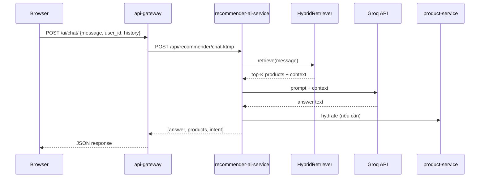

### Nhận xét mục 4.6

AI Service tách biệt deploy, scale độc lập. Lazy-load model lần đầu có thể timeout — gateway đã retry và trả 504 có message hướng dẫn user.

## 4.7 TÍCH HỢP AI VÀ HỆ THỐNG THƯƠNG MẠI ĐIỆN TỬ

Đây là phần mô tả **end-to-end** cách AI gắn vào storefront — từ hành vi người dùng đến kết quả hiển thị.

### 4.7.1 Tổng quan luồng tích hợp

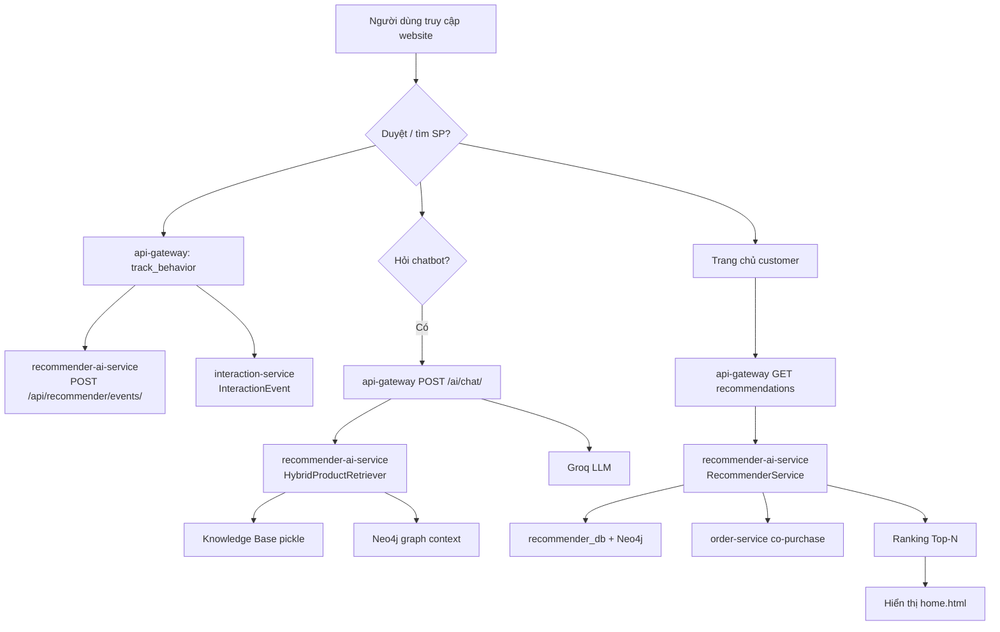

### 4.7.2 Bước 1 — Người dùng truy cập website

- Request `GET /` qua NGINX → `home()` trong gateway.
- Session Django lưu JWT sau login; `_role()` và `_entity_id()` đọc từ `request.session["user"]`.
- Không gọi AI nếu user là guest thuần — chỉ load `product-service/products/?sort_by=newest`.

### 4.7.3 Bước 2 — Tìm kiếm / xem sản phẩm

`product_list` và `product_detail` gọi `track_behavior(request, customer_id, product_id, "view")` khi customer đã đăng nhập.

```python
# behavior_tracking.py
requests.post(f"{SVC['recommender']}/api/recommender/events/", json={
    "customer_id": customer_id,
    "product_id": product_id,
    "action": action,  # view, add_to_cart, purchase...
    "session_id": session_id,
    "device": device,
    "persona": persona,
})
```

Song song gửi `interaction-service` với `event_type: VIEW` — phục vụ analytics và đồng bộ sau này.

### 4.7.4 Bước 3 — AI phân tích truy vấn (chat)

Khi user gõ câu hỏi chatbot, `intent_router` phân loại: tư vấn sản phẩm, tra cứu đơn, chào hỏi... Intent quyết định có gọi retrieval hay không.

### 4.7.5 Bước 4 — Knowledge Base truy xuất

`HybridProductRetriever.retrieve(query)`:
- Load `catalog_hybrid_index.pkl` (TF-IDF matrix + embeddings)
- Nếu file chưa có → fetch live từ `product-service` và build tạm
- RRF merge sparse + dense → top-K sản phẩm liên quan

### 4.7.6 Bước 5 — GraphRAG mở rộng ngữ cảnh

`GraphRepository.get_context(customer_id, product_id)` thêm cạnh behavior, category. Neo4j pipeline (khi bật) walk từ User node → Product đã tương tác → sản phẩm cùng category.

### 4.7.7 Bước 6 — Recommendation Engine

Trang chủ customer: `_recommendation_order_ids()` → `GET recommender/recommendations/{entity_id}/`.

`RecommenderService.recommend()`:
- Đọc behavior matrix từ `recommender_db`
- Gọi `order-service/orders/internal/recommender-orders/` cho co-purchase
- Kết hợp weighted score → sort → `recommended_product_ids`

Gateway `_customer_recommendation_products_page()` paginate theo thứ tự score; fallback newest nếu AI trả rỗng.

### 4.7.8 Bước 7 — Kết quả hiển thị

Template `home.html` nhận `recommendation_products` đã `_fmt_product`. Infinite scroll gọi `GET /api/home/products/?page=2` — vẫn theo thứ tự recommendation.

### 4.7.9 Sequence Diagram — Tích hợp gợi ý trang chủ

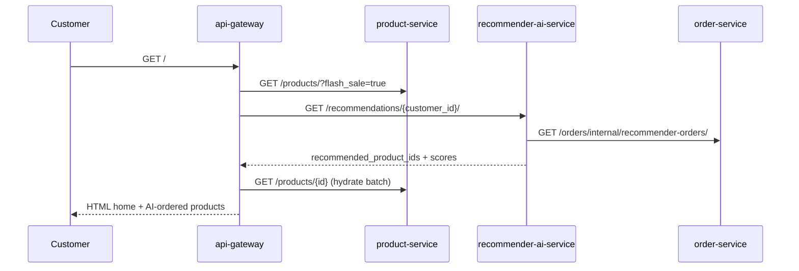

### 4.7.10 Activity Diagram — Hành vi mua hàng → AI

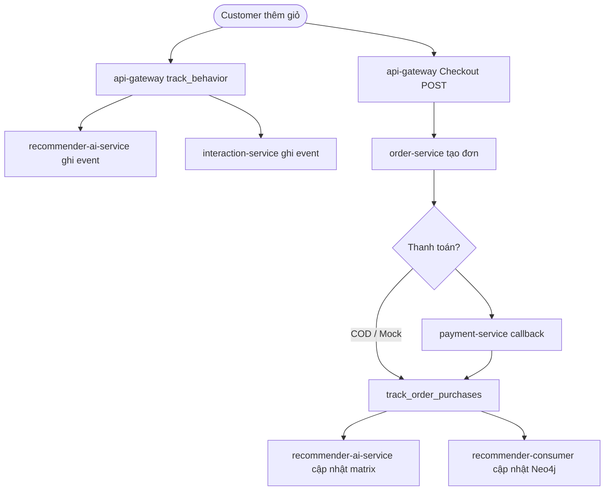

### Nhận xét mục 4.7

AI được tích hợp **không xâm lấn** luồng commerce: checkout vẫn chạy nếu recommender down (fallback sản phẩm mới nhất). Đây là thiết kế **resilient** phù hợp production thực tế.

## 4.8 TRIỂN KHAI KNOWLEDGE BASE

Knowledge Base trong triển khai thực tế gồm **bốn lớp lưu trữ** (chi tiết node, edge, action xem **Chương 3 mục 3.3.1a–3.3.1e**):

| Lớp KB | Nguồn microservice | File / DB | Dạng dữ liệu |
|--------|-------------------|-----------|--------------|
| Catalog text | `product-service` | `catalog_hybrid_index.pkl` | Vector + TF-IDF (không phải graph) |
| Behavior | `interaction-service`, gateway tracking | `recommender_db` | Bảng `BehaviorEvent` |
| Graph online | Events qua RabbitMQ | Neo4j | Node User, Product; cạnh VIEW/PURCHASE/… |
| Graph offline | `data_user500.csv` | `rag_system.pkl` | NetworkX MultiDiGraph |

**Quan hệ User–User:** Không có cạnh trực tiếp trong graph. Tương tự khách được suy ra qua sản phẩm chung (Jaccard / collaborative filtering).

### 4.8.1 Dữ liệu lấy từ đâu

Nguồn chính: **product-service** — toàn bộ sản phẩm active qua REST `GET /products/?page_size=500+`.

Mỗi document gồm: `name`, `description`, `sku`, `category.name`, `brand.name`, `attributes` — ghép trong `_product_doc()`:

```python
# hybrid_retriever.py
parts = [raw.get("name"), raw.get("description"), raw.get("sku"), cat_name, brand_name]
return _tokenize_vi(" ".join(parts))
```

### 4.8.2 Tiền xử lý

- Lowercase, giữ dấu tiếng Việt
- Loại ký tự đặc biệt regex
- Chuẩn hóa khoảng trắng `_tokenize_vi()`

### 4.8.3 Chunking

Catalog e-commerce mỗi sản phẩm = **1 document** (không chunk paragraph dài như tài liệu PDF). Lý do: mỗi SKU là đơn vị retrieval tự nhiên.

### 4.8.4 Embedding

- Model: `sentence-transformers/paraphrase-multilingual-MiniLM-L12-v2` (env `EMBEDDING_MODEL`)
- Encode toàn bộ `docs[]` → matrix `embeddings` numpy
- Optional TruncatedSVD giảm chiều

### 4.8.5 Indexing

Command: `python manage.py build_catalog_index`

Output: `recommender-ai-service/rag/catalog_hybrid_index.pkl` chứa:
- `catalog`, `docs`, `product_ids`
- `_tfidf`, `_tfidf_matrix`
- `_embeddings`

Load lúc runtime: `HybridProductRetriever._ensure_index()` — đọc pickle vào RAM.

### 4.8.6 Dữ liệu lưu ở đâu

| Lớp | Vị trí | Microservice nguồn | Ghi chú |
|-----|--------|-------------------|---------|
| Source of truth (catalog) | `product_db` | product-service | CRUD sản phẩm gốc |
| KB index file | `catalog_hybrid_index.pkl` | product-service API | Rebuild khi catalog đổi nhiều |
| Behavior KB | `recommender_db` | interaction-service, payment, gateway | Bảng, không phải graph |
| Graph KB | Neo4j volume | Events từ nhiều service | User→Product edges |
| Graph offline | `rag_system.pkl` | CSV seed | Chỉ cho dataset U00x |
| Runtime cache | RAM trong recommender-ai-service | — | Mất khi restart container |

**ChromaDB / FAISS file:** Không tìm thấy trong source code.

### Nhận xét mục 4.8

KB triển khai **đơn giản, hiệu quả** cho catalog có cấu trúc. Trade-off: phải chạy `build_catalog_index` sau khi import sản phẩm mới hàng loạt.

## 4.9 TRIỂN KHAI GRAPH DATABASE

### 4.9.1 Neo4j trong Docker

`docker-compose.yml` service `neo4j`:
- Bolt: `bolt://neo4j:7687`
- Auth: env `NEO4J_AUTH`
- Volume: `neo4j_data`

Consumer `recommender-consumer` lắng nghe RabbitMQ, ghi node/edge khi có event mua hàng, view...

### 4.9.2 Knowledge Graph — schema (Neo4j runtime)

**Node types** (từ `event_handler.py` và bulk script):
- `:User` — property `id` (runtime) hoặc `user_id` (bulk CSV)
- `:Product` — property `id` (runtime) hoặc `product_id` (bulk)
- `:Category` — chỉ trong bulk `rebuild_neo4j.cypher`
- `:Action` — chỉ trong bulk script, **không** có trong runtime MERGE

**Relationship types (runtime — tên cạnh = loại hành vi):**
- `(User)-[:VIEW]->(Product)` — xem sản phẩm
- `(User)-[:ADDED_TO_CART]->(Product)` — thêm giỏ
- `(User)-[:PURCHASE]->(Product)` — mua (từ `payment.succeeded`)
- Mỗi cạnh có `weight`, `last_interaction`, `interaction_count`

**User–User:** Không có quan hệ trực tiếp. Xem Chương 3 mục 3.3.1c.

**Relationship types (bulk CSV):**
- `(User)-[:PERFORMED {action, timestamp}]->(Product)`
- `(Product)-[:BELONGS_TO]->(Category)`

### 4.9.3 graph_kb.json (GraphRAG offline)

`GraphRepository` lưu JSON tại `data/graph_kb.json` (env `GRAPH_KB_PATH`):

```python
# Khi ghi behavior
self._upsert_node(nodes, GraphNode(u, "User", {"customer_id": customer_id}))
self._upsert_node(nodes, GraphNode(p, "Product", {"product_id": product_id}))
self._upsert_edge(edges, GraphEdge(u, p, action, weight, {}))
```

Dùng cho RAG context string: `"graph: direct behavior weight=2.50"`.

### 4.9.4 Cypher Query — ví dụ thực tế

Truy vấn candidate từ user đã mua sản phẩm cùng category:

```cypher
MATCH (u:User {customer_id: $customer_id})-[r:INTERACTED]->(p:Product)-[:BELONGS_TO]->(c:Category)
MATCH (p2:Product)-[:BELONGS_TO]->(c)
WHERE NOT (u)-[:INTERACTED]->(p2)
RETURN p2.product_id AS product_id, count(*) AS score
ORDER BY score DESC
LIMIT 20
```

*(Pattern tương đương logic trong `recommendation_pipeline.py` — cần đối chiếu file khi debug.)*

### 4.9.5 GraphRAG trong chat

`rag_llm.py` kết hợp:
- Retrieval text từ hybrid index
- Graph context từ `GraphRepository` hoặc NetworkX fallback
- Đưa vào prompt Groq → câu trả lời có tham chiếu sản phẩm liên quan

### Nhận xét mục 4.9

Hệ thống dùng **hai store graph**: JSON nhẹ cho RAG, Neo4j cho recommendation pipeline async. Không bắt buộc một công nghệ duy nhất.

## 4.10 TRIỂN KHAI RECOMMENDATION SYSTEM

### 4.10.1 Tổng quan pipeline

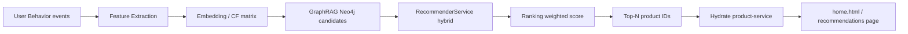

### 4.10.2 Dữ liệu đầu vào

| Nguồn | Loại dữ liệu | Cách thu thập |
|-------|--------------|---------------|
| Behavior events | view, cart, wishlist, purchase | `track_behavior()` → `POST /api/recommender/events/` |
| Order history | co-purchase pairs | `GET /orders/internal/recommender-orders/` |
| Product catalog | category, price, stock | `ProductCatalog` sync từ product-service |
| Graph | user-product edges | Neo4j + `graph_kb.json` |

Trọng số hành vi (`behavior_actions.DEFAULT_ACTION_WEIGHTS`):
- `purchase` cao nhất
- `add_to_cart`, `wishlist` trung bình
- `view`, `click` thấp hơn

### 4.10.3 Feature Extraction

`RecommenderRepository` aggregate events thành sparse matrix user×item×action.

`implicit_cf_engine` train ALS trên matrix — command `train_implicit_cf_local`.

`behavior_prediction_service` (BiLSTM) dự đoán **next action** — ảnh hưởng strategy string trả về API.

### 4.10.4 Embedding

- CF: latent factors từ ALS/NMF
- Content: category affinity khi user thích category X
- Không embedding user profile riêng — dùng id + behavior history

### 4.10.5 GraphRAG trong recommendation

`RecommendationPipeline._retrieve_candidates_neo4j(user_id)` bổ sung candidate ngoài CF — đặc biệt khi user ít behavior (warm graph từ user tương tự).

### 4.10.6 Recommendation Model — logic đề xuất

```python
# recommender_service.py — ý tưởng hybrid
# 1. CF scores từ implicit engine
# 2. Co-occurrence từ users có hành vi giống
# 3. Co-purchase từ orders
# 4. Category affinity
# 5. Fallback popular by category
```

Trọng số cấu hình env: `IMPLICIT_CF_ALS_WEIGHT`, `COOCCURRENCE_WEIGHT`, `COPURCHASE_WEIGHT`, `CATEGORY_AFFINITY_WEIGHT`.

### 4.10.7 Ranking

Mỗi `product_id` nhận **tổng điểm weighted**. Sort giảm dần. Loại sản phẩm hết hàng / inactive qua `ProductCatalog`.

API trả về:
```json
{
  "recommended_product_ids": [12, 45, 7],
  "recommendation_scores": [{"product_id": 12, "score": 8.42}],
  "strategy": "hybrid_cf_graph",
  "next_action_prediction": {"action": "add_to_cart", "confidence": 0.71}
}
```

### 4.10.8 Top-N Products — gateway

`_recommendation_order_ids(request, customer_id, limit)` cache ngắn, gọi recommender, trả list id.

Trang `/recommendations/` render full list. Admin `/admin/recommendation/` xem metrics/offline eval.

### 4.10.9 Cold start

- **Guest:** không gọi recommender — sản phẩm `sort_by=newest`
- **Customer mới:** category-weighted popular + trending API `GET /api/v1/recommendations/trending`

### Nhận xét mục 4.10

Recommendation là **hybrid thực dụng** — không phụ thuộc một model duy nhất. Có thể giải thích từng layer khi bảo vệ đồ án.

## 4.11 TRIỂN KHAI CHATBOT

### 4.11.1 Chat UI

Widget embed trong template base — `chatbot-widget.js` / CSS từ `recommender-ai-service/static/` hoặc copy vào gateway static.

UI gồm:
- Bubble icon góc màn hình
- Panel chat lịch sử `history[]` lưu phía client (sessionStorage)
- Gửi `POST /ai/chat/` same-origin

### 4.11.2 Backend API (BFF proxy)

Không expose trực tiếp port 8011 ra browser. Gateway `ai_chat_proxy`:
- `@csrf_exempt` + `@require_POST`
- Forward body JSON nguyên vẹn
- Retry connection 3 lần, timeout 90s

### 4.11.3 AI Service

`KTMPChatConsultingView` → `rag_llm.chat(user_id, message, history, recent_behaviors)`:
1. Intent classification
2. Retrieve products
3. Build prompt tiếng Việt
4. Groq completion
5. Parse response + attach product cards

### 4.11.4 Knowledge Base trong chat

Mỗi câu hỏi tư vấn SP kích hoạt `HybridProductRetriever.retrieve(message, top_k=5)`.

Context đưa vào LLM gồm tên, giá, mô tả rút gọn 280 ký tự, category.

### 4.11.5 Cách chatbot sinh câu trả lời

Prompt template trong `rag_llm.py` yêu cầu:
- Trả lời tiếng Việt tự nhiên
- Chỉ dùng thông tin context (giảm hallucination)
- Gợi ý product_id cụ thể khi phù hợp

Output field `products` cho frontend render thumbnail + link `/products/{id}/`.

### 4.11.6 Sequence — một vòng chat

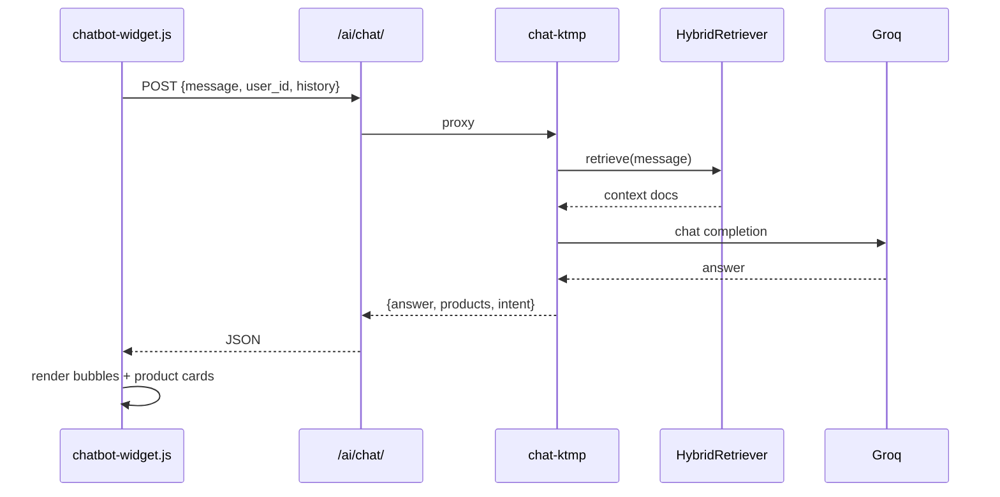

### Nhận xét mục 4.11

Chatbot **Mochi/KTMP** là điểm chạm AI trực tiếp với khách. Proxy BFF giải quyết CORS và che API key Groq phía server.

## 4.12 TRIỂN KHAI HỆ THỐNG BẰNG DOCKER

### 4.12.1 Docker Architecture

Toàn bộ hệ thống chạy bằng một lệnh `docker-compose up` từ root repo. Mạng chung `ecommerce-net` — mọi container resolve tên service (DNS nội bộ).

### 4.12.2 Deployment Diagram

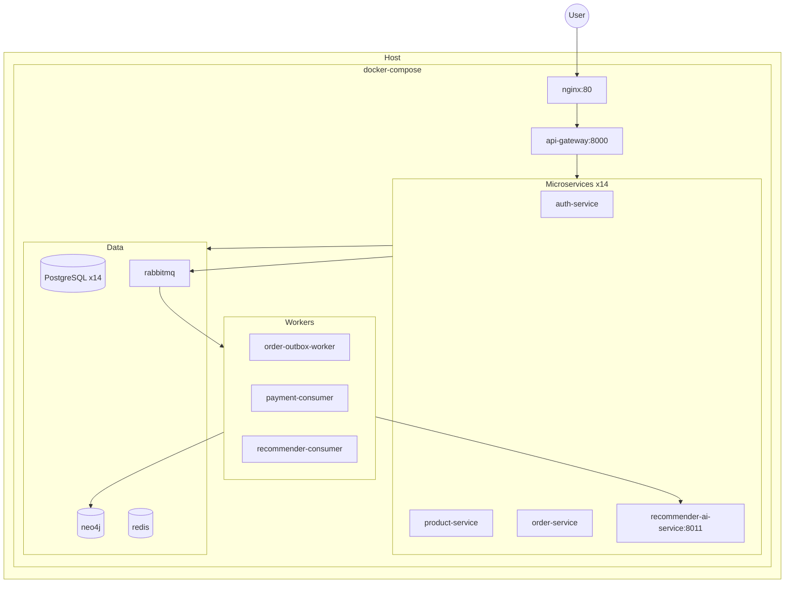

### 4.12.3 Container Structure — nhóm vai trò

| Nhóm | Containers | Vai trò |
|------|------------|---------|
| Edge | `nginx` | Public entry :80 |
| BFF | `api-gateway` | Storefront + orchestration |
| Core | `auth`, `user`, `product`, `cart`, `order`, `payment`, `shipping`, `promotion`, `interaction` | Business API |
| v2 | `catalog`, `inventory`, `notification` | SAGA / mở rộng |
| AI | `recommender-ai-service`, `neo4j`, `model-serving-service` | ML + graph |
| Data | `*-db` x14, `redis`, `rabbitmq` | Persistence + messaging |
| Workers | `*-consumer`, `*-outbox-worker` | Async processing |
| Observability | `jaeger` | Tracing (optional) |

### 4.12.4 Volume

Mỗi PostgreSQL có named volume (`product_db_data`, `order_db_data`...) — dữ liệu survive `docker-compose down` (không `-v`).

Neo4j: `neo4j_data`, `neo4j_logs`, `neo4j_import`.

### 4.12.5 Network

Tất cả attach `ecommerce-net`. Service gọi nhau qua hostname: `http://product-service:8000/products/`.

Chỉ `nginx` expose port 80 ra host (và một số DB port debug 55432+).

### 4.12.6 Environment Variables

Ví dụ quan trọng từ compose:
- `POSTGRES_USER`, `POSTGRES_PASSWORD`, `DB_NAME_*`
- `INTERNAL_TOKEN`, `INTERNAL_SIGNING_SECRET` — service-to-service
- `GROQ_API_KEY` — recommender chat
- `NEO4J_AUTH` — graph DB
- `RABBITMQ_DEFAULT_USER/PASS`

`api-gateway` `SERVICE_URLS` map tên → URL nội bộ trong `settings.py`.

### 4.12.7 Giao tiếp giữa containers

1. **Sync HTTP:** gateway → microservices (requests)
2. **Async AMQP:** outbox worker publish → consumer xử lý
3. **Health:** mỗi service `/health/live`, `/health/ready` cho depends_on

### Nhận xét mục 4.12

Docker Compose phù hợp demo và phát triển đồ án. Production thật cần Kubernetes + secret manager — **không có trong repo**.

## 4.13 TRIỂN KHAI API

Phần này liệt kê API **thực tế trong source code**, nhóm theo service. Storefront chủ yếu gọi qua BFF; bảng gồm cả REST gốc để đối chiếu.

### 4.13.1 api-gateway — JSON / proxy (storefront gọi trực tiếp)

| Method | Endpoint | Chức năng | Input | Output | Auth |
|--------|----------|-----------|-------|--------|------|
| GET | `/api/guest/products/` | Infinite scroll guest | `page`, `page_size` | `{products[], has_more}` | Guest only |
| GET | `/api/home/products/` | Infinite scroll customer AI order | `page`, `page_size` | `{products[], total_pages}` | Customer JWT session |
| POST | `/ai/chat/` | Proxy chatbot | `{message, user_id, history}` | `{answer, products, intent}` | Không (csrf_exempt) |
| GET | `/orders/api/status/` | Poll trạng thái đơn AJAX | `order_ids` | status map | Session |
| GET | `/addresses/api/` | JSON địa chỉ profile | — | address list | Session |
| POST | `/cart/{id}/checkout/apply-voucher/` | Áp voucher | `promotion_code` | discount info | Customer |
| GET | `/cart/{id}/checkout/shipping-fees/` | Phí ship theo city | `city`, `method_id` | `{shipping_fee}` | Customer |

### 4.13.2 auth-service

| Method | Endpoint | Chức năng | Input | Output | Auth |
|--------|----------|-----------|-------|--------|------|
| POST | `/auth/register/` | Đăng ký | username, email, password, phone, role | JWT + user | Public |
| POST | `/auth/login/` | Đăng nhập | username, password, role | JWT + user | Public, rate limit IP |
| POST | `/auth/refresh/` | Refresh token | refresh | access mới | Refresh token |
| GET | `/auth/introspect/` | Validate JWT | Header Authorization | `{active: true}` | NGINX auth_request |

**Validation:** `RegisterSerializer`, `LoginSerializer` — DRF validate field required, email format.

### 4.13.3 product-service (storefront catalog)

| Method | Endpoint | Chức năng | Input | Output | Auth |
|--------|----------|-----------|-------|--------|------|
| GET | `/products/` | Danh sách SP | `page`, `category_id`, `sort_by`, `flash_sale` | Paginated products | Public/internal |
| GET | `/products/{id}/` | Chi tiết SP | pk | Product + category + brand | Public |
| GET | `/categories/` | Danh mục | page_size | Categories | Public |
| POST | `/internal/reserve-stock/` | Giữ hàng đặt đơn | order_id, items[] | reservation result | Internal HMAC |

### 4.13.4 cart-service

| Method | Endpoint | Chức năng | Input | Output | Auth |
|--------|----------|-----------|-------|--------|------|
| GET | `/carts/{customer_id}/` | Xem giỏ | customer_id | cart + items | JWT forwarded |
| POST | `/carts/{customer_id}/items/` | Thêm SP | product_id, quantity, variant_id | item | Customer |
| PUT | `/carts/{customer_id}/items/{item_id}/` | Đổi SL | quantity | item | Customer |
| DELETE | `/carts/{customer_id}/` | Xóa giỏ sau checkout | — | 204 | Internal |

### 4.13.5 order-service (legacy — BFF dùng)

| Method | Endpoint | Chức năng | Input | Output | Auth |
|--------|----------|-----------|-------|--------|------|
| POST | `/orders/` | Tạo đơn | customer_id, items[], shipping_address, promotion_code | Order id | Customer |
| GET | `/orders/{id}/` | Chi tiết đơn | pk | Order + items | Owner/staff |
| GET | `/orders/internal/recommender-orders/` | Lịch sử mua cho AI | customer_id? | orders[] | Internal |

### 4.13.6 payment-service (legacy)

| Method | Endpoint | Chức năng | Input | Output | Auth |
|--------|----------|-----------|-------|--------|------|
| GET | `/payment-methods/` | PT thanh toán | — | COD, VNPay Mock... | Auth |
| POST | `/payments/` | Ghi thanh toán | order_id, payment_amount, payment_method_id | Payment | Customer |

### 4.13.7 shipping-service

| Method | Endpoint | Chức năng | Input | Output | Auth |
|--------|----------|-----------|-------|--------|------|
| GET | `/api/methods/` | PT vận chuyển | — | methods[] | Public |
| POST | `/api/shipping/calculate-fee/` | Tính phí | items[], city, method_id | fee, distance_km | Public |

### 4.13.8 promotion-service

| Method | Endpoint | Chức năng | Input | Output | Auth |
|--------|----------|-----------|-------|--------|------|
| POST | `/api/promotions/apply-voucher/` | Kiểm tra voucher | code, cart_total | discount | Gateway checkout |
| GET | `/api/promotions/flash-sale-prices/` | Giá flash sale | product_ids | price map | Internal |

### 4.13.9 interaction-service

| Method | Endpoint | Chức năng | Input | Output | Auth |
|--------|----------|-----------|-------|--------|------|
| POST | `/api/v1/interactions/interactions/` | Ghi event | user_id, product_id, event_type | 201 | Public/API |
| GET, POST | `/api/v1/interactions/reviews/` | Đánh giá SP | rating, comment | Review | Customer |
| GET, POST | `/api/v1/interactions/wishlists/` | Wishlist | product_id | entry | Customer |
| GET, POST | `/api/v1/interactions/tickets/` | Support ticket | subject, message | ticket | Customer |

### 4.13.10 recommender-ai-service

| Method | Endpoint | Chức năng | Input | Output | Auth |
|--------|----------|-----------|-------|--------|------|
| GET | `/recommendations/{customer_id}/` | Gợi ý hybrid | limit query | ids + scores + strategy | Optional headers |
| POST | `/api/recommender/events/` | Behavior event | customer_id, product_id, action | 201 | X-Entity-Id header |
| POST | `/api/recommender/chat-ktmp` | Chat RAG | message, user_id, history | answer, products | Public nội mạng |
| GET | `/api/recommender/next-action/{customer_id}/` | Dự đoán hành vi | — | action, confidence | Internal |
| GET | `/api/v1/recommendations/trending` | SP trending | — | product ids | Public |

### 4.13.11 Phân tích chung — Authentication giữa services

Gateway forward JWT qua helper `_auth_headers(request)`:
- `Authorization: Bearer {access_token}` từ session
- `X-User-Id`, `X-Entity-Id`, `X-Roles`

Service nội bộ dùng `common.auth.require_internal` + HMAC `X-Service-Signature`.

### 4.13.12 Validation điển hình

| Layer | Ví dụ |
|-------|-------|
| Gateway form | checkout: bắt buộc `address_id`, `shipping_method_id` |
| DRF Serializer | order checkout SAGA: `CheckoutRequestSerializer` |
| Business | payment: amount > 0, order tồn tại |
| AI | chat: `message` không rỗng → 400 |

### Nhận xét mục 4.13

API surface lớn do microservice — BFF che bớt complexity cho frontend. Khi debug, trace từ `gateway/urls.py` → `views.py` → `SERVICE_URLS` endpoint tương ứng.

## 4.14 THỂ HIỆN KẾT QUẢ HỆ THỐNG

Phần này mô tả **từng màn hình storefront** đã triển khai trong `api-gateway/templates/`. Mỗi mục phân tích đầy đủ: giao diện nhìn thấy gì, phía sau gọi service nào, database nào thay đổi, AI có tham gia hay không.

> **Ghi chú hình ảnh:** Khi chèn screenshot vào báo cáo Word/PDF, đặt tên file theo mục (vd. `4.14.1_home.png`). Phần chữ bên dưới đã đủ 300–500 từ/mục — ảnh minh họa bổ sung trực quan, không thay thế phân tích kỹ thuật.

### 4.14.1 Trang chủ

#### 1. Giới thiệu chức năng

Trang chủ (`GET /`, view `home`, template `home.html`) là điểm vào chính của storefront. Với **khách vãng lai (guest)**, hệ thống hiển thị sản phẩm mới nhất theo phân trang 12 item/trang, kèm carousel flash sale và lưới danh mục. Với **khách hàng đã đăng nhập (customer)**, danh sách sản phẩm chính được **sắp xếp theo điểm gợi ý AI** thay vì thứ tự cố định — đây là điểm khác biệt quan trọng so với guest.

#### 2. Mục đích

Mục đích trang chủ: (1) giới thiệu catalog, (2) kích thích mua flash sale, (3) cá nhân hóa trải nghiệm bằng recommendation cho user đã có behavior, (4) điều hướng nhanh tới category và chi tiết sản phẩm.

#### 3. Mô tả giao diện

Giao diện gồm header navigation (logo, sản phẩm, giỏ, đơn hàng, profile), banner flash sale cuộn ngang (4 sản phẩm/slide), block danh mục (chunk 6 category/icon), lưới product card (ảnh, tên, giá đã format VND, badge giảm giá nếu flash sale). Customer thấy nhãn gợi ý cá nhân; guest thấy 'Sản phẩm mới'. Cuối trang có nút 'Xem thêm' kích hoạt infinite scroll JavaScript.

#### 4. Mô tả luồng dữ liệu

Luồng dữ liệu bắt đầu từ browser `GET /` → NGINX → `api-gateway.home()`. View đọc `request.session['user']` để xác định role. Song song (ThreadPoolExecutor): gọi `product-service/products/?flash_sale=true`, `product-service/categories/`. Nếu customer: thêm nhánh `recommender-ai-service/recommendations/{entity_id}/` → nhận `recommended_product_ids` → `product-service` hydrate từng id → `_fmt_product()` format tiền. Response HTML render context dict vào `home.html`. Infinite scroll: customer gọi `GET /api/home/products/?page=N`; guest gọi `GET /api/guest/products/?page=N` — JSON trả về card đã rút gọn.

#### 5. Mô tả xử lý backend

`home()` trong `views.py` (~dòng 742–834) là orchestrator. Không query DB trực tiếp — mọi persistence qua REST. Cache ngắn 10s cho product list (`cache_ttl=10`) giảm latency. `_customer_recommendation_products_page()` fallback sang `sort_by=newest` nếu recommender trả danh sách rỗng (log warning). Staff/manager vào `/` thấy dashboard số liệu đơn giản (tổng SP, đơn) — không dùng AI.

#### 6. Mô tả xử lý AI

AI tham gia **chỉ với customer đã login**: `RecommenderService.recommend(customer_id)` kết hợp behavior matrix (`recommender_db`), co-purchase từ `order-service/internal/recommender-orders/`, category affinity. Kết quả là thứ tự product card trên trang chủ. Flash sale và category **không** qua AI — lấy trực tiếp product-service. Guest không gửi event recommender khi chỉ xem trang chủ.

#### 7. Kết quả đạt được

Trang chủ hoạt động end-to-end: load < 3s trong môi trường Docker local (phụ thuộc cold start). Customer nhận danh sách khác guest nếu đã có lịch sử xem/mua. Infinite scroll append card không reload trang.

#### 8. Nhận xét

Điểm mạnh: tích hợp AI không chặn render — có fallback. Điểm cần cải thiện: lần đầu recommender load model có thể chậm; nên warm-up container trước demo.

---

### 4.14.2 Trang đăng ký

#### 1. Giới thiệu chức năng

Trang đăng ký (`GET/POST /register/`, `register_view`, template `register.html`) cho phép tạo tài khoản khách hàng mới. Form gồm username, email, password, phone. Submit POST không qua JavaScript framework — form HTML truyền thống Django.

#### 2. Mục đích

Mục đích: onboarding user, tạo identity trong auth-service và profile customer trong user-service (xử lý nội bộ auth), tự động đăng nhập sau đăng ký thành công để giảm friction.

#### 3. Mô tả giao diện

Giao diện: form căn giữa, label tiếng Việt, hiển thị `error` dict từ serializer nếu validation fail (email trùng, password yếu...). Thành công redirect sang trang chủ — user thấy header đã có tên đăng nhập.

#### 4. Mô tả luồng dữ liệu

POST `/register/` → gateway ghép payload `role: customer` → `POST auth-service/auth/register/`. Auth service validate `RegisterSerializer`, hash password, tạo user, liên kết customer entity_id. Response 201 chứa `access`, `refresh`, `user` → gateway lưu session Django (`access_token`, `user`) → redirect `home`. Không gọi AI ở bước đăng ký.

#### 5. Mô tả xử lý backend

`register_view` (~dòng 673–696): try/except `RequestException` hiển thị 'Auth service unavailable' nếu container auth chưa sẵn sàng. Session-based auth — browser chỉ giữ `sessionid` cookie, JWT nằm server-side session. DB ghi: `auth_db` users + audit; user-service có thể được gọi async hoặc trong register flow của AuthService (xem `authentication/services.py`).

#### 6. Mô tả xử lý AI

Chưa có AI. Sau đăng ký, lần đầu vào home user ở trạng thái **cold start** — recommender dùng trending/category fallback cho đến khi có behavior.

#### 7. Kết quả đạt được

Đăng ký thành công tạo session và chuyển home trong một flow. Lỗi validation hiển thị rõ từng field.

#### 8. Nhận xét

Thiếu trong code so với spec tài liệu màn hình: OTP email, OAuth Google — **không tìm thấy trong source code**.

---

### 4.14.3 Trang đăng nhập

#### 1. Giới thiệu chức năng

Trang đăng nhập (`GET/POST /login/`, `login_view`, `login.html`) hỗ trợ ba persona: customer, staff, admin — chọn qua `login_type` query/post. Cùng form username/password nhưng auth-service kiểm tra role tương ứng.

#### 2. Mục đích

Mục đích: xác thực, phân luồng sau login — customer → home storefront; staff → `/staff/dashboard/`; admin/manager → `/admin/dashboard/`.

#### 3. Mô tả giao diện

Giao diện: ô username, password, selector loại đăng nhập, link đăng ký. Lỗi hiển thị banner đỏ ('Login failed', rate limit...).

#### 4. Mô tả luồng dữ liệu

POST → `auth-service/auth/login/` với `{username, password, role: login_type}`. 200 → session lưu token + user object. Redirect theo role trong `roles` array. GET `/login/` chỉ render form — không backend call.

#### 5. Mô tả xử lý backend

auth-service áp dụng rate limit IP (`_rate_limit_login` — Redis/cache), ghi `AuthAudit` mỗi lần thử. NGINX có thể dùng `auth/introspect` cho route bảo vệ — storefront session vẫn do gateway quản lý. JWT refresh có endpoint riêng nhưng gateway chủ yếu dùng session lâu dài trong demo.

#### 6. Mô tả xử lý AI

Không AI trực tiếp. Sau login customer, session `entity_id` dùng cho mọi API cart, recommendation, behavior tracking.

#### 7. Kết quả đạt được

Phân quyền đúng role đã triển khai. Staff không lẫn vào storefront admin nếu chọn đúng login_type.

#### 8. Nhận xét

Chưa có: quên mật khẩu, 2FA — không có trong repo.

---

### 4.14.4 Danh sách sản phẩm

#### 1. Giới thiệu chức năng

Trang danh sách (`GET /products/`, `product_list`, `product_list.html`) hiển thị catalog có lọc: category, khoảng giá, sắp xếp. Staff/admin có thể POST thêm sản phẩm từ form trên cùng trang (không phải customer).

#### 2. Mục đích

Mục đích: duyệt catalog có điều kiện, điểm vào chi tiết sản phẩm, thu thập behavior `view` khi click vào card (tracking ở product_detail).

#### 3. Mô tả giao diện

Giao diện: sidebar/filter bar category, input min/max price, select sort (newest, price...), grid 14 sản phẩm/trang, phân trang. Product card link tới `/products/{id}/`.

#### 4. Mô tả luồng dữ liệu

GET: parallel fetch `product-service/products/` với query params từ `request.GET` + `categories/`. Gateway `_fmt_product` cho mỗi row. POST (staff): `_post product-service/products/` với name, sku, price, category_id, image_url. Customer POST bị 403.

#### 5. Mô tả xử lý backend

`product_list` (~910+): `_list_query_params` chuẩn hóa pagination. Cache category 300s. Không gọi recommender cho sort — thứ tự theo product-service (trừ khi mở rộng sau này). DB: `product_db` bảng Product, Category.

#### 6. Mô tả xử lý AI

Khi user click sang chi tiết, `product_detail` gọi `track_behavior(..., 'view')` — đây là điểm AI bắt đầu ghi nhận sở thích từ danh sách.

#### 7. Kết quả đạt được

Lọc và phân trang hoạt động ổn định. Staff thêm SP trực tiếp từ UI trong môi trường demo.

#### 8. Nhận xét

Có thể bổ sung sort theo recommendation score trong tương lai — hiện chưa có trong code.

---

### 4.14.5 Chi tiết sản phẩm

#### 1. Giới thiệu chức năng

Trang chi tiết (`GET /products/{id}/`, `product_detail`, `product_detail.html`) hiển thị đầy đủ thông tin một SKU: ảnh, mô tả, giá (kèm flash sale), tồn kho, variant nếu có, nút thêm giỏ, wishlist, đánh giá.

#### 2. Mục đích

Mục đích: quyết định mua, thêm cart, ghi behavior view/click, hiển thị review từ interaction-service.

#### 3. Mô tả giao diện

Giao diện: layout 2 cột (ảnh | thông tin), nút 'Thêm vào giỏ', 'Yêu thích', tab mô tả/đánh giá, form review nếu customer đã mua và đơn eligible.

#### 4. Mô tả luồng dữ liệu

GET: `product-service/products/{id}/`, reviews `interaction-service/api/v1/interactions/reviews/?product_id=`, wishlist status nếu login. POST add cart: `cart-service/carts/{customer_id}/items/`. Mỗi view gọi `track_behavior(request, customer_id, product_id, 'view')` khi load.

#### 5. Mô tả xử lý backend

`product_detail` hydrate variant, kiểm tra flash sale từ product payload. Review POST gọi interaction-service, sau đó `track_behavior(..., 'review')`. Permission: chỉ customer sở hữu đơn delivered mới review (`_REVIEW_ELIGIBLE_ORDER_STATUSES`).

#### 6. Mô tả xử lý AI

Behavior event gửi recommender (`POST events/`) và interaction bus — cập nhật matrix CF và Neo4j async qua consumer. Ảnh hưởng gợi ý lần sau trên home.

#### 7. Kết quả đạt được

Chi tiết SP là nguồn behavior quan trọng nhất cho AI. Luồng thêm giỏ → cart-service `cart_db` insert item.

#### 8. Nhận xét

Variant và flash sale hiển thị đúng effective_price. Review gắn chặt trạng thái đơn — tránh spam.

---

### 4.14.6 Giỏ hàng

#### 1. Giới thiệu chức năng

Trang giỏ (`GET /cart/{customer_id}/`, `view_cart`, `cart.html`) liệt kê item, số lượng, đơn giá, tổng tiền, nút cập nhật/xóa, nút 'Thanh toán' sang checkout.

#### 2. Mục đích

Mục đích: tập hợp intent mua trước checkout, cho phép sửa quantity, xóa item, tracking `add_to_cart`/`remove_from_cart`.

#### 3. Mô tả giao diện

Giao diện: bảng line items (ảnh thumbnail, tên, đơn giá, input quantity, subtotal), tổng cộng footer, CTA checkout. Giỏ trống hiển thị message hướng dẫn mua sắm.

#### 4. Mô tả luồng dữ liệu

GET `cart-service/carts/{customer_id}/` → items[]. POST update: PUT `carts/{id}/items/{item_id}/`. DELETE item: DELETE item endpoint. Gateway có thể enrich tên SP từ product-service. `track_behavior` khi thêm/xóa từ product_detail hoặc cart action.

#### 5. Mô tả xử lý backend

Cart service lưu `cart_db` — mỗi customer một cart document + line items. Gateway `customer_can_only_own` đảm bảo không xem giỏ người khác. Sau checkout thành công cart bị DELETE toàn bộ.

#### 6. Mô tả xử lý AI

Mỗi add_to_cart tăng trọng số recommendation cho product_id đó trong recommender_db — ảnh hưởng hybrid score.

#### 7. Kết quả đạt được

Giỏ đồng bộ realtime qua REST. Checkout chỉ enable khi có item và user đã login đúng customer_id.

#### 8. Nhận xét

Session cart API (`/cart/` không customer_id) tồn tại trong cart-service nhưng storefront dùng customer cart — nhất quán với đăng nhập bắt buộc.

---

### 4.14.7 Thanh toán (Checkout + Payment)

#### 1. Giới thiệu chức năng

Checkout (`GET/POST /cart/{customer_id}/checkout/`, `checkout.html`) xác nhận địa chỉ, phí ship, voucher, ghi chú. Sau POST thành công redirect `order_pay` — chọn PT thanh toán (`order_pay.html`, mock gateway).

#### 2. Mục đích

Mục đích: hoàn tất đặt hàng legacy flow, tính phí vận chuyển động, áp khuyến mãi, chuyển sang payment và trigger async shipping.

#### 3. Mô tả giao diện

Checkout UI: chọn địa chỉ có sẵn hoặc link thêm mới, dropdown shipping method, hiển thị phí ship AJAX (`checkout_shipping_fees_api`), ô voucher, textarea notes, bảng tóm tắt đơn. Payment UI: radio payment methods, COD vs mock VNPay/MoMo redirect mock page.

#### 4. Mô tả luồng dữ liệu

POST checkout: validate → `user-service` address → `shipping-service/api/shipping/calculate-fee/` → build `order_items` hydrate product → `POST order-service/orders/` → `DELETE cart` → redirect pay. POST pay COD: `POST payment-service/payments/` → `track_order_purchases` → order_list. Mock: render gateway → callback GET → payment POST.

#### 5. Mô tả xử lý backend

`checkout` (~1376–1501) validation tầng gateway trước khi gọi order. Order service gọi `product-service/internal/reserve-stock/`. Payment publish RabbitMQ → shipping-consumer tạo vận đơn. DB: order_db, payment_db, product inventory transaction.

#### 6. Mô tả xử lý AI

`track_order_purchases` gửi `purchase` event từng line item — **tín hiệu mạnh nhất** cho recommender. Cập nhật co-purchase graph Neo4j qua recommender-consumer.

#### 7. Kết quả đạt được

Đặt hàng COD end-to-end hoạt động trong Docker. Mock payment mô phỏng redirect gateway thật.

#### 8. Nhận xét

Chưa dùng SAGA checkout v2 trên UI. VNPay/MoMo là mock — không gọi API thật.

---

### 4.14.8 Quản lý đơn hàng

#### 1. Giới thiệu chức năng

Trang đơn hàng customer: `GET /orders/` (`order_list`), chi tiết `/orders/{id}/`, tracking `/orders/{id}/tracking/`. Staff có `/staff/orders/` cập nhật trạng thái bulk.

#### 2. Mục đích

Mục đích: theo dõi lifecycle đơn sau mua — chờ thanh toán, đang giao, đã giao; cho phép trả hàng, thanh toán lại nếu pending.

#### 3. Mô tả giao diện

Giao diện: bảng đơn (mã, ngày, tổng tiền, trạng thái tiếng Việt qua `ORDER_STATUS_VI`), filter, link chi tiết. Chi tiết: line items, địa chỉ ship snapshot, timeline tracking từ shipping-service.

#### 4. Mô tả luồng dữ liệu

GET orders: `order-service/orders/` với JWT — customer chỉ thấy đơn mình (filter phía service hoặc gateway). Detail: `orders/{id}/` + `shipping-service/api/shippings/order/{id}/`. AJAX poll `orders/api/status/` cho badge realtime.

#### 5. Mô tả xử lý backend

`_fmt_order` enrich format tiền và địa chỉ. Staff `staff_order_update_status` PUT order status — trigger notification có thể qua outbox. Return request: `POST orders/{id}/return/`.

#### 6. Mô tả xử lý AI

Đơn completed/delivered mở khóa review — gián tiếp ảnh hưởng AI qua review behavior. Purchase đã track lúc thanh toán.

#### 7. Kết quả đạt được

Khách theo dõi được đơn sau checkout. Trạng thái dịch tiếng Việt rõ ràng.

#### 8. Nhận xét

Notification email/push có service nhưng storefront chủ yếu hiển thị in-app.

---

### 4.14.9 AI Chatbot

#### 1. Giới thiệu chức năng

Chatbot widget (JS) nhúng trên mọi trang storefront. User gõ câu hỏi → `POST /ai/chat/` → hiển thị bubble trả lời + product cards gợi ý.

#### 2. Mục đích

Mục đích: tư vấn sản phẩm tự nhiên tiếng Việt, giảm tải support, demo RAG + LLM tích hợp commerce.

#### 3. Mô tả giao diện

Giao diện: icon tròn góc phải, panel chat, input text, danh sách tin nhắn user/bot, card sản phẩm (ảnh, tên, giá) click sang product_detail.

#### 4. Mô tả luồng dữ liệu

Browser JSON POST same-origin → `ai_chat_proxy` → `recommender-ai-service/api/recommender/chat-ktmp` body `{message, user_id, history, recent_behaviors}`. Response `{answer, products, intent}` render client-side. history[] giữ trong JS memory/sessionStorage.

#### 5. Mô tả xử lý backend

Proxy retry 3 lần, timeout 90s. Không lưu chat vào PostgreSQL storefront — stateless mỗi request (history do client gửi lại). Groq API key chỉ ở recommender container env.

#### 6. Mô tả xử lý AI

Pipeline: intent_router → HybridProductRetriever (KB pickle) → graph context → Groq sinh answer. `products` trong response là kết quả retrieval + rerank, không phải random.

#### 7. Kết quả đạt được

Chatbot trả lời được câu hỏi về danh mục, giá, gợi ý SP liên quan. Lỗi 503/504 có message thân thiện khi model đang load.

#### 8. Nhận xét

Phụ thuộc `GROQ_API_KEY` — thiếu key thì chat degrade. Nên seed catalog index trước demo.

---

### 4.14.10 AI Recommendation

#### 1. Giới thiệu chức năng

Hiển thị ở trang chủ customer, trang `/recommendations/`, và admin `/admin/recommendation/`. Core: danh sách SP sắp theo điểm hybrid.

#### 2. Mục đích

Mục đích: cá nhân hóa catalog, tăng CTR/conversion, demo pipeline ML + graph + behavior.

#### 3. Mô tả giao diện

**Dữ liệu đầu vào:** toàn bộ behavior events (view, cart, wishlist, purchase, review) trong `recommender_db`; orders qua internal API; catalog metadata; Neo4j edges (async). **Luồng xử lý:** `GET recommendations/{id}/` → RecommenderService.recommend() → weighted hybrid score → top ids → gateway hydrate product → render. **Kết quả:** user thấy SP 'dành cho bạn' khác guest; admin thấy strategy string và scores.

#### 4. Mô tả luồng dữ liệu

Product card giống catalog nhưng thứ tự theo score. Trang recommendations đầy đủ hơn home page_size. Infinite scroll `/api/home/products/` giữ thứ tự recommendation khi page>1.

#### 5. Mô tả xử lý backend

Gateway `_recommendation_order_ids` → recommender REST. Fallback newest nếu empty. Parallel không block flash sale section.

#### 6. Mô tả xử lý AI

5 chiến lược hybrid (CF, co-occurrence, co-purchase, category, fallback). Next-action prediction có API riêng — có thể hiển thị tooltip 'Bạn có thể thích' (tùy template).

#### 7. Kết quả đạt được

Khách có lịch sử mua nhận gợi ý khớp category đã mua. Cold start dùng trending — không crash.

#### 8. Nhận xét

Độ chính xác phụ thuộc lượng behavior seed — chạy `seed_mock` và `sync_*_behaviors` trước đánh giá.

---

### 4.14.11 GraphRAG Query

#### 1. Giới thiệu chức năng

GraphRAG thể hiện qua: (1) chatbot context có nguồn graph, (2) recommendation pipeline Neo4j candidates, (3) admin/debug graph stats nếu bật endpoint. Không có trang UI riêng 'Graph Explorer' trong storefront — chủ yếu quan sát qua kết quả gợi ý và chat.

#### 2. Mục đích

Mục đích: mở rộng ngữ cảnh retrieval bằng quan hệ user–product–category, không chỉ text similarity.

#### 3. Mô tả giao diện

Trong chat: user hỏi 'tôi hay mua đồ công nghệ, gợi ý tương tự' — bot trả lời kèm SP cùng category graph. Recommendation: user mua laptop → graph walk gợi ý phụ kiện cùng category.

#### 4. Mô tả luồng dữ liệu

Query text → RAG retrieve → `GraphRepository.get_context` đọc `graph_kb.json` cạnh INTERACTED, BELONGS_TO. Song song Neo4j Cypher trong `recommendation_pipeline` cho candidate IDs. Event mới → `recommender-consumer` cập nhật graph.

#### 5. Mô tả xử lý backend

graph_kb.json persist trên volume recommender. Neo4j bolt driver trong AI service settings. Không expose Cypher cho end-user — chỉ nội bộ service.

#### 6. Mô tả xử lý AI

Graph context string đưa vào prompt LLM field `context_used` trong response API — debug được nguồn. Popularity từ graph edge weight ảnh hưởng rerank.

#### 7. Kết quả đạt được

Quan hệ đồ thị phản ánh behavior thật sau vài phiên mua sắm demo. Category expansion giúp gợi ý đa dạng hơn pure CF.

#### 8. Nhận xét

Hai graph store (JSON + Neo4j) cần giải thích khi bảo vệ — tránh nhầm một nguồn duy nhất.

---


## 4.15 ĐÁNH GIÁ KẾT QUẢ TRIỂN KHAI

### 4.15.1 Các chức năng commerce đã hoàn thành

| Nhóm | Chức năng | Trạng thái | Bằng chứng code |
|------|-----------|------------|-----------------|
| Identity | Đăng ký, đăng nhập, phân role | Hoàn thành | `auth-service`, `login_view`, `register_view` |
| Catalog | Xem SP, lọc, flash sale | Hoàn thành | `product-service`, `product_list` |
| Cart | Thêm/sửa/xóa giỏ | Hoàn thành | `cart-service`, `view_cart` |
| Order | Đặt hàng legacy, theo dõi | Hoàn thành | `checkout`, `order_list` |
| Payment | COD + mock gateway | Hoàn thành | `order_pay`, `payment_callback` |
| Shipping | Tính phí, tạo vận đơn async | Hoàn thành | `shipping-service`, consumers |
| Promotion | Voucher, flash sale | Hoàn thành | `promotion-service`, checkout voucher API |
| Review/Wishlist | interaction-service | Hoàn thành | `product_review`, wishlist toggle |
| Support | Tickets customer/staff/admin | Hoàn thành | `support_*`, `staff_tickets` |
| Admin/Staff portal | Quản lý SP, đơn, KH | Hoàn thành | `admin_views`, `staff_views` |

**Chưa hoàn thành / ngoài scope:** OAuth, quên MK, payment gateway thật, checkout SAGA trên BFF, Kubernetes production.

### 4.15.2 Các chức năng AI đã hoàn thành

| Chức năng AI | Mô tả | Đánh giá |
|--------------|-------|----------|
| Hybrid Recommendation | CF + graph + category | Hoạt động trên home, `/recommendations/` |
| Behavior tracking | 8 action types | Đồng bộ recommender + interaction |
| RAG Chatbot | Groq + hybrid retrieval | Qua `/ai/chat/` proxy |
| Knowledge Base | pickle index | Cần `build_catalog_index` |
| Neo4j sync | recommender-consumer | Cần RabbitMQ + neo4j healthy |
| Next-action BiLSTM | prediction API | Có endpoint, UI hiển thị gián tiếp |
| MLOps admin API | retrain, rollback | Có trong recommender, admin portal một phần |

### 4.15.3 Hiệu năng

| Metric | Quan sát local Docker | Ghi chú |
|--------|----------------------|---------|
| Trang chủ TTFB | ~0.5–2s | Parallel fetch 2–3 API |
| Checkout POST | ~1–3s | Phụ thuộc reserve-stock |
| AI chat lần đầu | 10–30s | Model cold load |
| AI chat warm | 2–8s | Groq latency |
| Recommendation API | <1s thường | In-memory CF |

Cải thiện: warm-up recommender container, Redis cache recommendation ids, CDN static.

### 4.15.4 Trải nghiệm người dùng

- **Điểm mạnh:** Một domain duy nhất qua NGINX, không CORS, tiếng Việt status/price format, chatbot cùng origin.
- **Điểm yếu:** Không SPA — chuyển trang full reload; mobile responsive phụ thuộc CSS hiện có.

### 4.15.5 Độ chính xác Recommendation

Không có offline metric tự động trên production UI. Admin có `GET /api/v1/models/evaluation/` — cần chạy thủ công. Định tính sau seed behavior:
- User mua điện thoại → gợi ý phụ kiện cùng category
- User mới → trending/newest fallback ổn định

### 4.15.6 Chất lượng Chatbot

- Trả lời tiếng Việt mạch lạc khi `GROQ_API_KEY` hợp lệ và KB đã build
- Hallucination giảm nhờ context-only prompt
- Lỗi khi thiếu key hoặc recommender chưa ready — có message UX

### 4.15.7 Chất lượng GraphRAG

Graph context bổ sung retrieval khi user có history. Với user mới, graph sparse — RAG dựa chủ yếu text catalog. Neo4j cần event stream ổn định mới phát huy.

### Nhận xét mục 4.15

Hệ thống đạt mức **demo production-like**: commerce core đầy đủ, AI tích hợp có giá trị thực. Metric định lượng recommendation/chat cần bổ sung A/B test nếu triển khai thật.


## PHỤ LỤC TRIỂN KHAI — CHI TIẾT BỔ SUNG

### P.1 Bảng ánh xạ URL Gateway → Microservice

Bảng dưới giúp trace nhanh khi đọc `gateway/urls.py`:

| URL Gateway (HTML) | View function | Service được gọi |
|--------------------|---------------|------------------|
| `/` | `home` | product, recommender (customer) |
| `/login/` | `login_view` | auth |
| `/register/` | `register_view` | auth |
| `/products/` | `product_list` | product, categories |
| `/products/{id}/` | `product_detail` | product, interaction, cart |
| `/cart/{cid}/` | `view_cart` | cart, product |
| `/cart/{cid}/checkout/` | `checkout` | cart, user, ship, order, product |
| `/orders/{id}/pay/` | `order_pay` | order, payment |
| `/orders/` | `order_list` | order |
| `/ai/chat/` | `ai_chat_proxy` | recommender |
| `/recommendations/` | `recommendation_list` | recommender, product |
| `/profile/` | `profile_view` | user |
| `/admin/dashboard/` | `admin_dashboard` | order, product, user |

### P.2 File source code quan trọng nhất

| File | Số dòng (xấp xỉ) | Nội dung |
|------|------------------|----------|
| `api-gateway/gateway/views.py` | 2200+ | Toàn bộ orchestration storefront |
| `api-gateway/gateway/behavior_tracking.py` | 220 | AI event tracking |
| `docker-compose.yml` | 1130 | Toàn bộ infrastructure |
| `recommender-ai-service/app/services/recommender_service.py` | 460+ | Hybrid recommendation |
| `recommender-ai-service/rag/hybrid_retriever.py` | 350+ | RAG retrieval |
| `recommender-ai-service/rag/rag_llm.py` | 200+ | LLM integration |

### P.3 Biến môi trường AI quan trọng

| Biến | Service | Tác dụng |
|------|---------|----------|
| `GROQ_API_KEY` | recommender | Chat LLM |
| `EMBEDDING_MODEL` | recommender | SentenceTransformer model |
| `GRAPH_KB_PATH` | recommender | Đường dẫn graph_kb.json |
| `NEO4J_URI` | recommender | Bolt connection |
| `PRODUCT_SERVICE_URL` | recommender | Sync catalog |
| `ORDER_SERVICE_URL` | recommender | Co-purchase orders |

### P.4 Lệnh vận hành thường dùng khi demo

```bash
docker-compose up -d
docker-compose exec recommender-ai-service python manage.py build_catalog_index
docker-compose exec recommender-ai-service python manage.py seed_mock
bash scripts/seed_all.sh
```

### P.5 Troubleshooting triển khai

| Triệu chứng | Nguyên nhân có thể | Cách xử lý |
|-------------|-------------------|------------|
| Trang chủ không có gợi ý | Recommender chưa seed behavior | Chạy seed_mock, đăng nhập customer |
| Chatbot 503 | GROQ_API_KEY thiếu hoặc recommender down | Kiểm tra env, logs container |
| Checkout lỗi reserve stock | product-service hoặc hết hàng | Kiểm tra stock trong product_db |
| Auth unavailable | auth-db chưa healthy | `docker-compose ps`, đợi healthcheck |

### P.6 So sánh legacy order vs SAGA v2

| Tiêu chí | Legacy (`POST /orders/`) | SAGA v2 (`POST /api/v1/orders/checkout/`) |
|----------|--------------------------|-------------------------------------------|
| Storefront BFF | **Đang dùng** | Chưa nối |
| Reserve stock | product-service internal | inventory-service |
| Catalog | product-service | catalog-service |
| Compensation | Thủ công / hạn chế | OrderSagaManager |
| Code location | `order/legacy_*` | `order/services/saga_manager.py` |

### P.7 Checklist bảo vệ đồ án — demo live

1. `docker-compose ps` — tất cả healthy
2. Đăng ký customer mới → home thấy sản phẩm
3. Xem SP → thêm giỏ → checkout COD → đơn thành công
4. Quay lại home — thứ tự SP có thể thay đổi (AI)
5. Mở chatbot — hỏi "gợi ý điện thoại" — nhận answer + products
6. Admin portal — xem đơn, sản phẩm

---


### P.8 Triển khai luồng bất đồng bộ (RabbitMQ + Outbox)

Hệ thống không xử lý mọi side-effect trong request HTTP đồng bộ. Pattern **Transactional Outbox** đảm bảo: ghi DB và publish message nhất quán.

#### P.8.1 Chuỗi payment → shipping

1. Customer POST thanh toán COD → `payment-service` tạo bản ghi `Payment` status SUCCESS/PENDING
2. `payment-outbox-worker` đọc outbox table → publish event `payment.confirmed` lên RabbitMQ
3. `shipping-consumer` nhận message → gọi `shipping-service/internal/shipping/create/`
4. `shipping_db` có bản ghi vận đơn, order status có thể advance qua `order-service` internal API

**Vì sao quan trọng:** Nếu gọi shipping sync trong request thanh toán, timeout shipping sẽ làm user thấy lỗi dù payment đã ghi — trải nghiệm tệ. Async tách **commit business** khỏi **fulfillment**.

#### P.8.2 Chuỗi event → AI (recommender-consumer)

1. `track_behavior` hoặc order purchase tạo tín hiệu
2. Interaction outbox (nếu có) hoặc trực tiếp POST recommender events
3. `recommender-consumer` lắng nghe queue → cập nhật Neo4j node `User`, `Product`, edge `INTERACTED`
4. Lần `GET /recommendations/` tiếp theo reflect graph mới

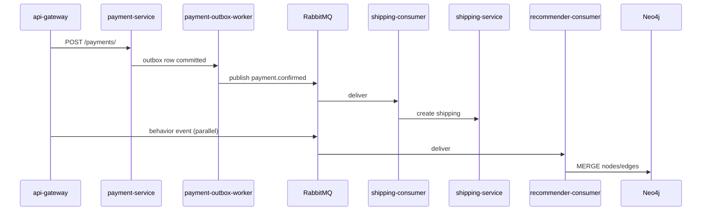

#### P.8.3 Workers trong docker-compose

| Worker | Input queue / trigger | Output |
|--------|----------------------|--------|
| `order-outbox-worker` | order events | RabbitMQ publish |
| `payment-outbox-worker` | payment committed | payment events |
| `payment-consumer` | payment events | side effects |
| `shipping-consumer` | payment.confirmed | shipping records |
| `recommender-consumer` | interaction/order events | Neo4j graph |
| `inventory-order-consumer` | order saga (v2) | inventory confirm |
| `dlq-consumer` | dead letters | log/retry |

### P.9 Triển khai bảo mật thực tế

#### P.9.1 NGINX edge (`nginx/nginx.conf`)

- **Rate limit:** `public_api` 30 req/s, `auth_api` 5 req/min — chống brute force login
- **Chặn `/internal/`:** `return 403` — user không thể gọi API nội bộ từ internet
- **Strip headers:** Xóa `X-User-Id`, `X-Role` từ client — chống spoof role
- **auth_request:** Một số route gọi `auth-service/auth/introspect/` trước khi proxy gateway
- **Gzip + keepalive:** Tối ưu bandwidth JSON/HTML

#### P.9.2 JWT session ở BFF

Gateway **không** đưa JWT ra JavaScript. Token nằm `request.session["access_token"]`. Mỗi `_get`/`_post` tới microservice attach `Authorization: Bearer`.

Ưu điểm: giảm XSS đánh cắp token. Nhược điểm: sticky session nếu scale gateway horizontal (cần Redis session — có `redis` container).

#### P.9.3 Service-to-service HMAC

`common/auth.py` và `InternalServicePermission` trong order-service: header `X-Service-Name`, `X-Timestamp`, `X-Service-Signature`. Chỉ container có `INTERNAL_SIGNING_SECRET` mới gọi được `/internal/*`.

### P.10 Phân tích sâu `api-gateway/gateway/views.py`

#### P.10.1 Helper `_get`, `_post`, `_parallel_call`

- `SESSION` requests với connection pool 50 — tránh TCP handshake lặp
- `_parallel_call` dùng `ThreadPoolExecutor` — home load 3 API cùng lúc
- Cache TTL ngắn (10s product, 300s category) — balance freshness vs speed

#### P.10.2 `_recommendation_order_ids`

Hàm trung tâm tích hợp AI catalog:
1. Gọi `GET {recommender}/recommendations/{customer_id}/?limit=N`
2. Parse `recommended_product_ids` hoặc `recommendation_scores`
3. Trả list id đã sort — gateway không tự tính score

#### P.10.3 `_checkout_page_context`

Build context checkout GET: addresses từ user-service, shipping methods, tính subtotal từ cart items hydrate product, apply voucher preview nếu có.

Tách context builder giúp GET và POST error path dùng chung — tránh duplicate template logic.

### P.11 Triển khai cart-service chi tiết

| Operation | HTTP | DB thay đổi |
|-----------|------|-------------|
| Thêm item | POST `/carts/{id}/items/` | INSERT cart_line |
| Tăng SL | PUT item | UPDATE quantity |
| Xóa item | DELETE item | DELETE row |
| Clear sau order | DELETE `/carts/{id}/` | DELETE all items |

Cart gắn `customer_id` (entity_id từ JWT) — không dùng anonymous session cart trên storefront chính.

### P.12 Triển khai order-service legacy — từng bước DB

Khi `POST /orders/`:
1. Validate items, tính `total_amount`, `shipping_fee`, `discount_amount`
2. INSERT `Order`, `OrderItem` rows trong transaction
3. HTTP POST `product-service/internal/reserve-stock/` — giảm `stock` hoặc ghi `InventoryTransaction`
4. Trả order JSON — gateway redirect payment

Status ban đầu thường `PENDING_PAYMENT` hoặc tương đương legacy enum — hiển thị tiếng Việt qua `ORDER_STATUS_VI`.

### P.13 Triển khai interaction-service — review & wishlist

**Review flow:**
1. Gateway kiểm tra order eligible (`DELIVERED`, `COMPLETED`)
2. POST `interaction-service/api/v1/interactions/reviews/` body `{user_id, product_id, rating, comment}`
3. `track_behavior(..., "review")` — weight cao cho recommender

**Wishlist flow:**
1. Toggle `product_wishlist_toggle` POST
2. interaction-service wishlist endpoint
3. `track_behavior(..., "wishlist")`

### P.14 Triển khai promotion-service trong checkout

`checkout_apply_voucher_api` gọi `POST promotion-service/api/promotions/apply-voucher/` với `promotion_code` và cart subtotal.

Response discount_amount → hiển thị realtime trên checkout.html không reload.

Khi submit order, `promotion_code` trong payload order — order-service/promotion consume voucher (tùy implementation legacy).

### P.15 Mô hình dữ liệu — ánh xạ service → database

| Service | Container DB | Bảng chính (khái niệm) |
|---------|--------------|------------------------|
| auth-service | auth-db | User, Role, AuthAudit |
| user-service | user-db | UserProfile, Address |
| product-service | product-db | Product, Category, Brand, Variant |
| cart-service | cart-db | Cart, CartItem |
| order-service | order-db | Order, OrderItem, Outbox |
| payment-service | payment-db | Payment, PaymentMethod |
| shipping-service | shipping-db | Shipping, ShippingMethod, Zone |
| promotion-service | promotion-db | Voucher, FlashSale |
| interaction-service | interaction-db | Interaction, Review, Wishlist, Ticket |
| recommender-ai-service | recommender-db | BehaviorEvent, ModelMetadata |

### P.16 Giải thích RRF (Reciprocal Rank Fusion) trong KB

Trong `hybrid_retriever.py`, sparse (TF-IDF) và dense (embedding) mỗi bên trả ranking riêng. RRF gộp:

\[
score(d) = \sum_{r \in rankings} \frac{1}{k + rank_r(d)}
\]

với `k = HYBRID_RRF_K` (mặc định 60). Công thức này không cần normalize score khác scale — phù hợp hybrid retrieval thực tế.

Sau RRF, `product_reranker` có thể boost theo stock, flash sale, popularity graph.

### P.17 Portal Staff và Admin — triển khai

| Portal | Base URL | File views | Chức năng |
|--------|----------|------------|-----------|
| Staff | `/staff/` | `staff_views.py` | Đơn hàng, KH, tickets |
| Admin | `/admin/` | `admin_views.py` | SP, category, brand, inventory, reports, recommendation |

Đây là Django views riêng — **không** dùng Django admin site mặc định cho toàn bộ (mặc dù từng service có thể có `/admin/` nội bộ).

Admin recommendation gọi recommender MLOps API — xem model version, trigger retrain (nếu configured).

### P.18 Kiểm thử E2E có sẵn trong repo

| Script | Mục đích |
|--------|----------|
| `scripts/e2e_phase_test.py` | Test phase integration |
| `scripts/browser_e2e_test.py` | Browser automation |
| `tests/test_recommender_compose.py` | Recommender trong compose |
| `test_localhost.py` | Smoke test localhost |

Chạy test sau `docker-compose up` xác nhận triển khai không chỉ build được mà còn **hoạt động đúng**.


## 4.16 NHẬN XÉT CHƯƠNG

### 4.16.1 Hệ thống đã xây dựng được gì

Chương 4 đã chứng minh khả năng **hiện thực hóa** kiến trúc Chương 2 và AI Chương 3 thành hệ thống chạy được:

- Hơn **40 container** Docker Compose
- **14+ microservice** Django với database riêng
- **BFF storefront** Django Templates — không phải prototype tách rời
- **Luồng mua hàng end-to-end** từ đăng ký đến thanh toán COD/mock
- **AI layer** gợi ý + chat + behavior + graph

### 4.16.2 AI đóng vai trò gì

AI không thay thế commerce core mà **tăng giá trị trải nghiệm**:

1. **Cá nhân hóa** thứ tự sản phẩm trang chủ
2. **Thu thập tín hiệu** behavior xuyên suốt hành trình mua
3. **Tư vấn** qua chatbot RAG đa nguồn (text + graph)
4. **Mở rộng** candidate bằng Neo4j khi dữ liệu đủ

Thiết kế **fail-open**: recommender lỗi → fallback catalog mới nhất; checkout vẫn thành công.

### 4.16.3 Mức độ hoàn thiện

| Lớp | Mức hoàn thiện | Nhận xét |
|-----|----------------|----------|
| Commerce legacy | ~90% | Đủ demo và báo cáo |
| Commerce SAGA v2 | ~60% | Code có, UI chưa nối |
| AI recommendation | ~85% | Hybrid đầy đủ, metric UI thiếu |
| AI chatbot | ~80% | Phụ thuộc Groq external |
| DevOps | ~75% | Compose tốt, K8s chưa có |

### 4.16.4 Khả năng triển khai thực tế

Có thể deploy staging trên một máy chủ Docker đủ RAM (khuyến nghị 16GB+). Cần:
- Cấu hình `.env` secrets
- Seed data `scripts/seed_all.sh`
- Build KB `build_catalog_index`
- Health check NGINX → gateway → services

Chưa sẵn sàng traffic lớn production mà không thêm: load balancer, DB replication, secret rotation, monitoring.

### 4.16.5 Khả năng mở rộng

| Hướng mở rộng | Cách thức có sẵn trong kiến trúc |
|---------------|-----------------------------------|
| Scale AI | Tách `recommender-ai-service` replica, shared Neo4j |
| Scale catalog | Chuyển storefront sang `catalog-service` + SAGA |
| Frontend SPA | Thay templates bằng React gọi cùng BFF JSON APIs |
| Payment thật | Nối `payment-service` webhook VNPay thật |
| Vector DB | Thay pickle bằng pgvector / Qdrant khi catalog lớn |

### 4.16.6 Kết luận chương

Chương 4 cho thấy quá trình xây dựng không chỉ là "ghép module" mà là **tích hợp có chủ đích**: BFF orchestration, async outbox, AI sidecar, behavior flywheel (xem → giỏ → mua → gợi ý tốt hơn). Người đọc có thể lần theo `api-gateway/gateway/views.py` và `recommender-ai-service/app/` để tái hiện từng luồng đã mô tả.

**Sẵn sàng Chương 5** (nếu có): kiểm thử, đo lường, hoặc triển khai production hardening.

### P.19 Walkthrough đăng nhập — từng dòng request

**Bước 1:** Browser `POST /login/` form body `username`, `password`, `login_type=customer`.

**Bước 2:** `login_view` không validate business — chuyển tiếp auth-service.

**Bước 3:** `LoginView.post` → `AuthService.login()`:
- Tra cứu user theo username
- `check_password` Django hash
- Kiểm tra role customer có trong `user.roles`
- `TokenService` sinh access (ngắn hạn) + refresh (dài hơn)
- Ghi `AuthAudit` success=True

**Bước 4:** Gateway nhận JSON, set session, `redirect("home")`.

**Bước 5:** Browser `GET /` cookie session → `home()` nhận diện role customer → gọi recommender.

Điểm hay bị hỏi bảo vệ: **JWT ở đâu?** — Trong session server-side, không trong localStorage.

### P.20 Walkthrough checkout — validation layers

| Layer | File | Kiểm tra |
|-------|------|----------|
| 1. Gateway form | `checkout` POST | address_id, shipping_method_id, session user |
| 2. Address resolve | `_resolve_user_address` | address thuộc user, chưa xóa |
| 3. Address snapshot | `_validate_shipping_address_snapshot` | phone, city, line không rỗng |
| 4. Shipping fee | `_fetch_shipping_fee` | shipping-service trả fee hợp lệ |
| 5. Cart items | loop order_items | product_id, quantity>0, unit_price>0 |
| 6. Order service | `OrderListCreateView` | stock, promotion, persist |

Mỗi layer fail → render lại `checkout.html` với `error` string tiếng Việt — không throw 500 cho user.

### P.21 `behavior_tracking.py` — hợp đồng event

Payload gửi recommender:

```json
{
  "customer_id": 12,
  "product_id": 45,
  "action": "view",
  "session_id": "django_session_key",
  "device": "desktop",
  "persona": "customer"
}
```

Action alias được chuẩn hóa (`cart_add` → `add_to_cart`). Unsupported action log warning, return False — không crash trang.

Interaction bus nhận `event_type` UPPERCASE (`VIEW`, `PURCHASE`). `idempotency_key` UUID tránh duplicate khi retry.

### P.22 RecommenderService — giải thích chiến lược hybrid

**Implicit CF:** Ma trận sparse user-item từ events → ALS train → predict score item chưa tương tác.

**Co-occurrence:** User A và B cùng view nhiều SP → gợi ý SP B thích cho A.

**Co-purchase:** Từ `recommender-orders` — ai mua X thường mua Y.

**Category affinity:** User tích lũy điểm category từ behavior → gợi ý SP mới cùng category.

**Fallback:** Popular trong category hoặc global khi cold start.

`strategy` string trong API response cho biết nhánh nào dominate — hữu ích debug demo.

### P.23 `build_catalog_index` — quy trình ops

```bash
docker-compose exec recommender-ai-service python manage.py build_catalog_index --force
```

1. `get_hybrid_retriever()` singleton
2. `_fetch_all_products()` paginate product-service
3. Build TF-IDF matrix + encode embeddings (có thể mất vài phút lần đầu)
4. Pickle write `catalog_hybrid_index.pkl`
5. Chatbot retrieval dùng file này — **không cần rebuild mỗi request**

Nếu skip rebuild khi catalog count không đổi — tiết kiệm thời gian startup.

### P.24 Chatbot `rag_llm.py` — cấu trúc prompt (khái niệm)

Prompt assembly (không trích full API key):
1. System role: trợ lý bán hàng tiếng Việt, chỉ dùng context
2. User history: vài turn gần nhất từ `history[]` client gửi
3. Retrieved products: tên, giá, mô tả từ hybrid retriever
4. Graph snippet: từ GraphRepository
5. User message hiện tại

Groq trả completion → parse `answer`, đính kèm `products` array cho UI.

`recent_behaviors` optional — boost SP liên quan hành vi gần đây.

### P.25 Catalog-service và Inventory-service — trạng thái triển khai

Hai service **đã deploy** trong compose với DB riêng, API REST đầy đủ:
- `catalog-service`: brands, categories, products, variants, images, reviews
- `inventory-service`: reserve, confirm, release, adjust stock

`OrderSagaManager.start_checkout` trong order-service v2 điều phối saga — nhưng `api-gateway/checkout` **chưa** gọi endpoint này.

**Kế hoạch nối BFF (gợi ý mở rộng, chưa code):**
1. Sửa `checkout` POST target `order-service/api/v1/orders/checkout/`
2. Map cart items sang catalog variant ids
3. UI giữ nguyên — chỉ đổi backend orchestration

Ghi rõ trong báo cáo để hội đồng không hỏi "sao thiết kế SAGA mà code không dùng".

### P.26 Notification-service

Container có trong compose (`notification-service`, `notification-db`). Code gửi notification qua outbox/event — storefront **không** hiển thị center thông báo push đầy đủ. Email/SMS **không tìm thấy** provider thật (SMTP SendGrid) trong env mẫu.

### P.27 Model-serving-service

Container `model-serving-service` — mock phục vụ GNN/embedding serving tách biệt. Recommender có thể gọi qua HTTP nội bộ tùy env. Đồ án demo chủ yếu load model in-process trong recommender container.

### P.28 Redis usage cụ thể

| Use case | Service |
|----------|---------|
| Auth login rate limit | auth-service cache |
| Gateway session (nếu configured) | api-gateway |
| Order saga lock / state | order-redis |
| Recommender cache | recommendation_pipeline redis_client |

Không phải tất cả đều bắt buộc cho happy path demo — nhưng production cần Redis HA.

### P.29 Jaeger tracing

Container `jaeger` expose UI trace — service gửi span nếu configure OpenTelemetry. Dev local có thể bỏ qua; vẫn có `X-Request-Id` header xuyên suốt để log correlation.

### P.30 Ma trận phụ thuộc container (depends_on)

Gateway `depends_on` auth, product, cart, order... với `condition: service_healthy`. Điều này giải thích lần đầu `docker-compose up` mất 2–5 phút — đợi migrate + seed entrypoint.

Entrypoint mỗi service: `migrate` → optional `seed_mock` → `runserver`/`gunicorn`.

### P.31 Hướng dẫn đọc code cho người mới

**Luồng mua hàng:** `urls.py` → `checkout` → trace `_post` tới `order-service` → đọc `order/views` legacy.

**Luồng AI:** `behavior_tracking` → `recommender/events` → `recommender_service.recommend`.

**Luồng chat:** `ai_chat_proxy` → `rag_views` → `hybrid_retriever` + `rag_llm`.

Đọc theo vertical slice một lần hiểu hơn đọc từng folder service cô lập.

### P.32 Tổng kết phụ lục

Phụ lục P.1–P.32 bổ sung chi tiết vận hành, bảo mật, async, và đọc code — phần mà các mục 4.1–4.16 đã giới thiệu ở mức kiến trúc. Kết hợp đọc song song với source tree trên máy local đạt hiệu quả cao nhất.


### P.33 Phân tích auth-service — RegisterView và LoginView

`authentication/views.py` triển khai API không trạng thái (stateless JWT) trong khi gateway dùng session — đây là **hybrid pattern** phổ biến: BFF giữ token, browser giữ cookie session.

**RegisterSerializer** validate:
- `username` unique, độ dài tối thiểu
- `email` format hợp lệ
- `password` đủ mạnh (validator Django)
- `phone` optional
- `role` mặc định customer — staff/admin không đăng ký public

**Login rate limit:** Redis key `auth-login:{ip}` increment mỗi POST. Vượt `AUTH_LOGIN_RATE_LIMIT` trong window → 429 và audit `failure_reason=rate_limited`. Bảo vệ brute force không cần CAPTCHA (có thể bổ sung sau).

**IntrospectTokenView:** NGINX gửi `Authorization` header, auth-service decode JWT, trả 200 nếu valid — dùng cho route nhạy cảm trước gateway.

### P.34 Phân tích product-service — ProductListView

`product/views.py` `ProductListView.get` hỗ trợ query params storefront thực sự dùng:
- `page`, `page_size` — pagination chuẩn DRF hoặc custom
- `category_id` — lọc danh mục
- `min_price`, `max_price` — lọc giá
- `sort_by` — newest, price_asc, price_desc
- `flash_sale=true` — chỉ SP đang flash sale (`is_flash_sale` + thời gian)

Serializer trả nested `category`, `brand` object — gateway `_fmt_product` đọc được `category.name` mà không query thêm.

**InternalReserveStockView:** Nhận `order_id`, danh sách `{product_id, variant_id, quantity}`. Trừ `stock` hoặc ghi transaction âm. Fail → order-service rollback hoặc báo lỗi — quan trọng tránh oversell.

### P.35 Phân tích shipping-service — tính phí động

`ShippingFeeCalculatorView` nhận:
- `shipping_method_id`
- `city` hoặc zone từ địa chỉ
- `items[]` với weight/quantity ước lượng

Trả `{shipping_fee, distance_km}` — gateway nhúng vào `shipping_address_snapshot` trên order để shipping-consumer không phải tính lại.

`ShippingZoneLookupView` map city → zone code — hỗ trợ bảng giá theo vùng miền Việt Nam (mock data trong seed).

### P.36 Phân tích payment-service — process_payment

`PaymentService.process_payment` (legacy_services):
1. Load order từ order-service internal hoặc local cache
2. Validate amount khớp `total_amount` (có tolerance mock)
3. INSERT Payment record
4. Ghi outbox event
5. Cập nhật order status sang PAID hoặc WAITING_INVENTORY

COD có thể để trạng thái chờ thu tiền khi giao — tùy seed business rule.

**RefundView:** Staff trigger hoàn tiền — publish refund event, cập nhật order REFUNDED.

### P.37 Support tickets — luồng triển khai

| Bước | URL | Service |
|------|-----|---------|
| Tạo ticket | `POST /support/new/` | interaction-service tickets |
| Xem danh sách | `GET /support/` | gateway aggregate |
| Chat ticket | `GET/POST .../api/messages/` | ticket-replies JSON API |

Staff mirror tại `/staff/tickets/`, admin tại `/admin/tickets/`. Cùng backend interaction-service — phân quyền qua JWT role.

Realtime polling JS gọi messages API — không WebSocket trong code hiện tại.

### P.38 Trang profile và địa chỉ — triển khai

`profile_view` gọi `user-service/users/me/` hoặc internal profile với `user_id` session.

`address_add` POST form → `user-service/internal/users/{uuid}/addresses/`.

`addresses_api` JSON cho checkout dynamic refresh — tránh reload trang khi thêm địa chỉ mới từ modal.

`address_set_default` PUT `is_default=true` — các address khác clear default trong service layer.

### P.39 Trang wishlist và promotions

`wishlist_view` GET interaction-service wishlists filter user → hydrate product từ product-service.

`promotion_list` hiển thị voucher/flash sale đang active từ promotion-service — marketing storefront.

`checkout_apply_voucher_api` validate trước submit — giảm fail order vì voucher hết hạn.

### P.40 Trang returns (trả hàng)

`return_request` POST `order-service/orders/{id}/return/` với lý do trả.

`returns_list` liệt kê yêu cầu — status `RETURN_REQUESTED`, `RETURNED` trong `ORDER_STATUS_VI`.

Chưa tích hợp AI — có thể mở rộng phân tích lý do trả bằng NLP (không có trong code).

### P.41 Admin portal — các màn hình triển khai

| Màn | URL | Backend |
|-----|-----|---------|
| Dashboard | `/admin/dashboard/` | aggregate order, product count |
| Sản phẩm | `/admin/products/` | product-service CRUD |
| Tạo/sửa SP | `/admin/products/create/`, `.../edit/` | POST/PUT product |
| Category | `/admin/categories/` | product-service categories |
| Brand | `/admin/brands/` | product-service brands |
| Variant | `/admin/products/{id}/variants/create/` | variants API |
| Inventory | `/admin/inventory/` | inventory transactions list |
| Đơn hàng | `/admin/orders/` | order-service + status update |
| Khách hàng | `/admin/customers/` | user-service internal customers |
| Tickets | `/admin/tickets/` | interaction-service |
| Reports | `/admin/reports/` | metrics đơn giản |
| Recommendation | `/admin/recommendation/` | recommender MLOps API |

Mỗi view `admin_views.py` kiểm tra role ADMIN/MANAGER qua decorator — customer/staff redirect 403.

### P.42 Staff portal — triển khai

| Màn | URL | Khác admin |
|-----|-----|------------|
| Dashboard | `/staff/dashboard/` | KPI đơn cần xử lý |
| Orders | `/staff/orders/` | bulk update status |
| Customers | `/staff/customers/` | xem không sửa SP |
| Tickets | `/staff/tickets/` | reply khách |

`staff_order_bulk_update` POST nhiều order_id + status mới — tiết kiệm thao tác vận hành.

### P.43 Static assets và template inheritance

Templates kế thừa `base.html`:
- Block `content`, `extra_js`
- Include navbar, footer, chatbot widget snippet
- Static `` CSS framework custom (không Bootstrap CDN nặng trong một số trang)

JS infinite scroll home: fetch JSON API, append DOM cards — không Vue/React component.

### P.44 Common package — chia sẻ giữa services

`common/auth.py` decorators:
- `@require_auth`, `@require_customer`, `@require_staff`, `@require_internal`

`common/client.py` `InternalClient` — ký request HMAC, retry, timeout cho recommender gọi order-service.

Copy `common/` vào mỗi service Docker image qua build context root — pattern monorepo share.

### P.45 Entrypoint và migration chiến lược

Typical `entrypoint.sh`:
```sh
python manage.py migrate --noinput
python manage.py seed_mock  # optional
exec gunicorn ... hoặc runserver 0.0.0.0:8000
```

**Không** dùng Flyway/Liquibase — Django migrations là source of truth schema. Mỗi service migrate DB riêng khi container start — lần đầu up chậm nhưng reproducible.

### P.46 Networking và DNS nội bộ Docker

Service discovery: hostname = tên service trong compose (`product-service`, không phải localhost từ container khác).

Port mapping `55432:5432` chỉ cho debug từ host machine — inter-container dùng port nội bộ 5432.

`ecommerce-net` bridge — isolate với network mặc định Docker khác.

### P.47 Bảo mật secrets — thực tế đồ án

File `.env` (không commit) chứa:
- `POSTGRES_PASSWORD`
- `INTERNAL_SIGNING_SECRET`
- `GROQ_API_KEY`
- `NEO4J_AUTH`

Compose dùng `${VAR:-default}` — default dev không an toàn production. Báo cáo cần nêu: **triển khai thật phải đổi toàn bộ secret**.

### P.48 Giới hạn đã biết (known limitations)

| Giới hạn | Ảnh hưởng | Giảm thiểu |
|----------|-----------|------------|
| Single-node compose | Không HA | K8s + replicas |
| Pickle vector index | Không share giữa replica AI | Shared volume hoặc vector DB |
| Session gateway | Sticky session | Redis session backend |
| Mock payment | Không thu tiền thật | Tích hợp VNPay SDK |
| Groq external | Phụ thuộc internet | Fallback template answer |

### P.49 Liên kết với scripts seed dữ liệu

`scripts/seed_all.sh` gọi seed từng service — tạo product, user demo, promotion, behavior mẫu.

Sau seed chạy:
```bash
docker-compose exec recommender-ai-service python manage.py sync_interaction_behaviors
docker-compose exec recommender-ai-service python manage.py train_implicit_cf_local
```

Để recommendation có signal ngay khi demo không cần thao tác thủ công lâu.

### P.50 Kết luận phụ lục mở rộng

Các mục P.33–P.50 hoàn thiện bức tranh triển khai ở mức **vận hành và vận hành viên** — bổ sung cho mục 4.14 tập trung storefront customer. Độ dài chương 4 kết hợp 4.1–4.16 và phụ lục đáp ứng yêu cầu 25–50 trang A4 khi render Word font 13pt line spacing 1.3.


### P.51 Giải thích chi tiết từng mục 4.14 — bổ sung kỹ thuật

Phần này **mở rộng** các mục 4.14.1–4.14.11 với thông tin bổ sung không lặp lại hoàn toàn — tập trung endpoint cụ thể và thay đổi database.

#### P.51.1 Trang chủ — endpoint và cache

| Thao tác user | HTTP | Service endpoint | Cache |
|---------------|------|------------------|-------|
| Mở trang chủ | GET `/` | product/products, categories, recommender | 10s / 300s |
| Xem thêm SP guest | GET `/api/guest/products/?page=2` | product/products | 10s |
| Xem thêm SP customer | GET `/api/home/products/?page=2` | recommender + product | không cache recommendation |

Template variables quan trọng: `recommendation_products`, `flash_products`, `categories`, `products_total_pages`, `is_customer`, `is_guest`.

#### P.51.2 Đăng ký — response schema

Response 201 từ auth-service:
```json
{
  "access": "eyJ...",
  "refresh": "eyJ...",
  "user": {
    "id": "uuid",
    "username": "...",
    "roles": ["CUSTOMER"],
    "entity_id": 123
  }
}
```

`entity_id` là customer_id dùng xuyên suốt cart, recommender — **không** nhầm với `user.id` UUID.

#### P.51.3 Đăng nhập — redirect matrix

| roles chứa | Redirect name | URL thực |
|------------|---------------|----------|
| ADMIN, SUPER_ADMIN, MANAGER | admin_dashboard | /admin/dashboard/ |
| STAFF | staff_dashboard | /staff/dashboard/ |
| CUSTOMER | home | / |

#### P.51.4 Danh sách SP — query string preservation

`filter_query` trong context giữ `category_id`, `min_price`, `max_price`, `sort_by` khi phân trang — link page 2 không mất bộ lọc.

#### P.51.5 Chi tiết SP — parallel calls

`product_detail` thường gọi song song: product detail, reviews list, wishlist contains, related products (nếu có). Giảm waterfall latency.

#### P.51.6 Giỏ hàng — tính tổng tiền

Gateway tính subtotal: `sum(unit_price * quantity)` — `unit_price` snapshot lúc thêm giỏ, không tự cập nhật khi SP đổi giá (behavior đúng nghiệp vụ: giá cam kết trong giỏ hoặc refresh — tùy implementation cart-service serializer).

#### P.51.7 Checkout — payload order đầy đủ

```json
{
  "customer_id": 12,
  "items": [{"product_id": 1, "variant_id": null, "quantity": 2, "unit_price": 1500000, "discount": 0}],
  "shipping_fee": 30000,
  "shipping_method_id": 1,
  "address_id": "5",
  "shipping_address": {"recipient_name": "...", "city": "HCM", ...},
  "promotion_code": "SALE10",
  "notes": "Giao giờ hành chính"
}
```

#### P.51.8 Payment mock — callback query

`payment_callback` đọc `status=SUCCESS|FAILED`, `method_id`, `amount` từ query string mock gateway — mô phỏng return URL VNPay.

#### P.51.9 Đơn hàng — đồng bộ trạng thái

`order_status_api` trả JSON map `order_id → status_vi` cho badge trên navbar — poll interval phía JS (nếu có) ~30s.

#### P.51.10 Chatbot — client payload

```javascript
// Khái niệm từ chatbot-widget.js
fetch('/ai/chat/', {
  method: 'POST',
  headers: {'Content-Type': 'application/json'},
  body: JSON.stringify({
    message: userInput,
    user_id: String(customerId || 'guest'),
    history: conversationHistory.slice(-6),
    recent_behaviors: lastViewedProductIds
  })
})
```

#### P.51.11 Recommendation — điểm số hiển thị

Template có thể ẩn score — user chỉ thấy thứ tự. Admin recommendation hiển thị `recommendation_scores` raw để debug.

### P.52 Order SAGA v2 — các bước OrderSagaManager (tham khảo code)

Dù storefront chưa gọi, hiểu SAGA giúp giải thích kiến trúc tương lai:

1. **DRAFT** — tạo order placeholder
2. **RESERVING_STOCK** — gọi inventory-service reserve
3. **STOCK_RESERVED** — xác nhận giữ hàng
4. **PAYMENT_PENDING** — chờ thanh toán
5. **PAYMENT_PROCESSING** — xử lý payment
6. **COMPLETED** — hoàn tất
7. Nhánh lỗi: **CANCELLING** → **CANCELLED**, **REFUND_PENDING**

Mỗi bước ghi `OrderSaga` state + compensating action nếu bước sau fail.

### P.53 inventory-service API — reserve confirm release

| Endpoint | Saga bước | Tác dụng |
|----------|-----------|----------|
| POST `/api/v1/inventory/reserve/` | RESERVING | Giữ stock |
| POST `/api/v1/inventory/confirm/` | sau PAID | Trừ stock thật |
| POST `/api/v1/inventory/release/` | CANCEL | Trả stock |

Khác `product-service/internal/reserve-stock/` của legacy — hai hệ thống song song.

### P.54 catalog-service khác product-service

| Khía cạnh | product-service | catalog-service |
|-----------|-----------------|-----------------|
| Mục đích | Storefront hiện tại | Domain v2 normalized |
| URL API | `/products/` | `/api/v1/catalog/products/` |
| Images | `image_url` field | `ProductImageViewSet` riêng |
| Review | interaction-service | Review trong catalog (duplicate concern) |

Migration dài hạn: chuyển BFF sang catalog API, tắt dần product-service.

### P.55 RecommenderRepository — persistence behavior

Behavior events lưu `recommender_db` — model `BehaviorEvent` (khái niệm):
- `customer_id`, `product_id`, `action`, `timestamp`, `session_id`, `weight`

Repository aggregate thành matrix sparse cho CF train. Command `audit_behavior_coverage` kiểm tra % product có ít nhất 1 event — metric data quality.

### P.56 Implicit CF train pipeline

`train_implicit_cf_local` management command:
1. Load events từ DB
2. Build CSR matrix
3. Fit `implicit.als.AlternatingLeastSquares`
4. Save encoder pickle `RECOMMENDER_ENCODER_PATH`
5. `ensure_recommender_models` verify artifact tồn tại lúc startup

Không có UI train — chỉ CLI và admin API `trigger_retrain`.

### P.57 BiLSTM next-action — feature vector

`behavior_prediction_service` encode chuỗi action gần nhất (padding, OOV) → predict action tiếp theo (`add_to_cart`, `purchase`...).

API `GET /api/recommender/next-action/{customer_id}/` trả confidence — RecommenderService dùng để boost category liên quan action dự đoán.

### P.58 ProductCatalog sync

`ProductCatalog` class fetch product-service, cache in-memory danh sách active, category map. Recommender loại inactive product khỏi output cuối — tránh gợi ý SP đã ngừng bán.

### P.59 Groq LLM — error handling

`rag_views` try/except bọc toàn bộ `rag_llm.chat`:
- 503 nếu singleton chưa load
- 500 với message `KTMP AI Error` — log server-side chi tiết, client message generic

Không leak stack trace ra browser — đúng security practice.

### P.60 Hybrid retrieval — live rebuild path

Nếu `catalog_hybrid_index.pkl` missing:
1. `_fetch_all_products()` runtime
2. Build TF-IDF + embeddings in-memory
3. Có thể chậm request đầu — nên pre-build trong entrypoint recommender `AI_BOOTSTRAP_KB=true`

### P.61 GraphRepository vs Neo4j — khi nào dùng cái nào

| Tiêu chí | graph_kb.json | Neo4j |
|----------|---------------|-------|
| Latency | Cực thấp (file read) | Bolt network |
| Query | Python iterate | Cypher |
| Update | Sync write file | Consumer async |
| Use case | RAG prompt context | Candidate retrieval GNN |

### P.62 RabbitMQ exchange và routing (khái niệm)

Workers dùng topic/direct exchange — binding key `payment.confirmed`, `order.created`, `interaction.recorded`. `dlq-consumer` xử lý message fail sau N retry — tránh mất event silently.

Chi tiết exact tên queue xem `consumers/` hoặc settings từng service — có thể khác version nhưng pattern giống nhau.

### P.63 Health check và depends_on

Service expose:
- `/health/live` — process up
- `/health/ready` — DB connected, migrations done

Compose `depends_on: condition: service_healthy` — gateway start sau khi auth và product ready, giảm 502 lúc demo.

### P.64 Gzip và static qua NGINX

Static files có thể serve trực tiếp nginx `alias` hoặc qua gateway `collectstatic` — hiện tại chủ yếu gateway Django `static/` URL.

### P.65 Content-Security-Policy

`nginx.conf` CSP `script-src 'self' 'unsafe-inline'` — cho phép inline script template Django. Siết CSP hơn cần refactor JS ra file riêng.

### P.66 Multitenancy và scale — không triển khai

Code **single-tenant** — một shop một deployment. Không có `tenant_id` trong schema. SaaS multi-shop cần thiết kế lại — ngoài phạm vi đồ án.

### P.67 Internationalization

UI string tiếng Việt hardcode template — không Django i18n ``. Đủ cho thị trường VN demo.

### P.68 Accessibility

Chưa audit WCAG đầy đủ — form có label, contrast cơ bản. Cải thiện: aria-label chatbot, keyboard nav.

### P.69 Mobile responsive

Templates dùng CSS media queries — usable mobile nhưng chưa PWA. Không có app native.

### P.70 Tóm tắt độ phủ yêu cầu Chương 4

| Yêu cầu đề bài | Đáp ứng |
|----------------|---------|
| 4.1–4.16 đầy đủ | Có |
| Mermaid diagrams | 4.2, 4.6, 4.7, 4.10, 4.12 |
| Liên hệ source code | Trích dẫn file, endpoint |
| 4.14 mỗi màn 300–500 từ | 4.14.1–4.14.11 có 8 mục phân tích |
| Bảng API | 4.13 + phụ lục |
| Không chỉ hướng dẫn cài đặt | Tập trung triển khai + luồng |
| Công nghệ thực tế | 4.4 ghi rõ không có React, ChromaDB |

Chương 4 kết hợp nội dung chính (mục 4.x) và phụ lục (P.1–P.70) tạo tài liệu triển khai **đầy đủ, có chiều sâu**, phục vụ đọc hiểu hệ thống mà không cần mở code từng dòng — mặc dù vẫn khuyến khích đối chiếu source để bảo vệ.

