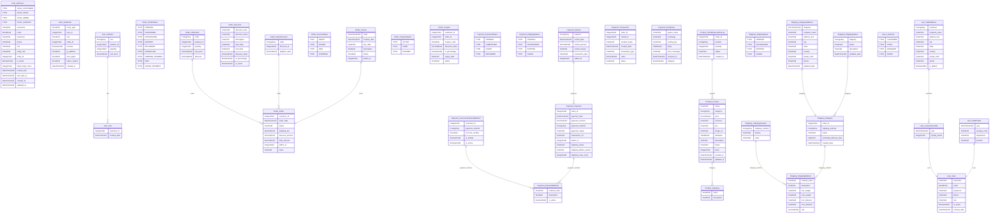

# System Database ERD

```mermaid
erDiagram
    %% ========================
    %% Service: auth-service
    %% ========================
    Auth_AuthUser {
        TYPE ROLE_CUSTOMER
        TYPE ROLE_STAFF
        TYPE ROLE_ADMIN
        TYPE ROLE_CHOICES
        CharField username
        EmailField email
        CharField password
        CharField phone
        CharField role
        CharField entity_role
        IntegerField entity_id
        BooleanField is_active
        IntegerField failed_login_count
        DateTimeField locked_until
        DateTimeField last_login_at
        DateTimeField created_at
        DateTimeField updated_at
    }
    Auth_AuthAudit {
        CharField event_type
        IntegerField user_id
        CharField role
        IntegerField entity_id
        BooleanField success
        CharField ip_address
        CharField user_agent
        CharField failure_reason
        DateTimeField created_at
    }
    %% ========================
    %% Service: cart-service
    %% ========================
    Cart_Cart {
        IntegerField customer_id
        DateTimeField created_date
    }
    Cart_CartItem {
        ForeignKey cart
        IntegerField product_id
        IntegerField quantity
        DecimalField unit_price
    }
    Cart_CartItem ||--o{ Cart_Cart : cart
    %% ========================
    %% Service: order-service
    %% ========================
    Order_OrderStatus {
        TYPE PENDING
        TYPE CONFIRMED
        TYPE PROCESSING
        TYPE SHIPPED
        TYPE DELIVERED
        TYPE CANCELLED
        TYPE PENDING_PAYMENT
        TYPE PAID
        TYPE FAILED_PAYMENT
    }
    Order_Order {
        IntegerField customer_id
        DateTimeField order_date
        CharField status
        DecimalField shipping_fee
        DecimalField discount_amount
        DecimalField total_amount
        IntegerField admin_id
        TextField notes
    }
    Order_OrderItem {
        ForeignKey order
        IntegerField product_id
        IntegerField quantity
        DecimalField unit_price
        DecimalField discount
    }
    Order_Discount {
        CharField discount_code
        CharField discount_name
        TextField description
        DateField start_date
        DateField end_date
        DecimalField discount_value
        BooleanField is_percentage
        BooleanField is_active
    }
    Order_OrderDiscount {
        ForeignKey order
        IntegerField discount_id
        DecimalField applied_value
    }
    Order_InvoiceStatus {
        TYPE DRAFT
        TYPE ISSUED
        TYPE PAID
        TYPE OVERDUE
    }
    Order_Invoice {
        OneToOneField order
        DateTimeField created_date
        DateField due_date
        TextField description
        CharField status
        IntegerField admin_id
    }
    Order_CouponStatus {
        TYPE ACTIVE
        TYPE USED
        TYPE EXPIRED
    }
    Order_Coupon {
        IntegerField customer_id
        IntegerField order_id
        CharField coupon_code
        DecimalField discount_value
        BooleanField is_percentage
        DateField expiry_date
        CharField status
    }
    Order_OrderItem ||--o{ Order_Order : order
    Order_OrderDiscount ||--o{ Order_Order : order
    Order_Invoice ||--|| Order_Order : order
    %% ========================
    %% Service: payment-service
    %% ========================
    Payment_PaymentMethod {
        CharField method_name
        TextField description
        BooleanField is_active
    }
    Payment_CustomerPaymentMethod {
        IntegerField customer_id
        ForeignKey payment_method
        CharField account_number
        BooleanField is_default
        BooleanField is_active
    }
    Payment_PaymentStatus {
        TYPE PENDING
        TYPE COMPLETED
        TYPE FAILED
        TYPE REFUNDED
    }
    Payment_ShippingStatus {
        TYPE PENDING
        TYPE PROCESSING
        TYPE SHIPPED
        TYPE FAILED
    }
    Payment_Payment {
        IntegerField order_id
        DateTimeField payment_date
        DecimalField payment_amount
        ForeignKey payment_method
        CharField payment_status
        CharField transaction_ref
        IntegerField admin_id
        CharField shipping_status
        TextField shipping_failure_reason
        IntegerField shipping_retry_count
    }
    Payment_Refund {
        ForeignKey payment
        DateTimeField refund_date
        DecimalField refund_amount
        TextField refund_reason
        CharField transaction_type
        IntegerField admin_id
    }
    Payment_Transaction {
        IntegerField order_id
        IntegerField refund_id
        CharField created_name
        DateTimeField created_date
        CharField transaction_type
        DecimalField value
        CharField status
    }
    Payment_DLQEvent {
        CharField queue_name
        CharField exchange
        CharField routing_key
        JSONField body
        TextField error_message
        DateTimeField received_at
        BooleanField replayed
    }
    Payment_CustomerPaymentMethod ||--o{ Payment_PaymentMethod : payment_method
    Payment_Payment ||--o{ Payment_PaymentMethod : payment_method
    Payment_Refund ||--o{ Payment_Payment : payment
    %% ========================
    %% Service: product-service
    %% ========================
    Product_Category {
        CharField name
        TextField description
    }
    Product_Product {
        CharField name
        ForeignKey category
        DecimalField price
        CharField currency
        CharField sku
        CharField image_url
        JSONField attributes
        TextField description
        CharField status
        IntegerField stock
        DateTimeField created_at
        DateTimeField updated_at
    }
    Product_StockReservationLog {
        IntegerField order_id
        ForeignKey product
        IntegerField quantity
        CharField status
        DateTimeField created_at
    }
    Product_Product ||--o{ Product_Category : category
    Product_StockReservationLog ||--o{ Product_Product : product
    %% ========================
    %% Service: shipping-service
    %% ========================
    Shipping_ShippingMethod {
        CharField method_name
        TextField description
        FloatField min_weight
        FloatField max_weight
        FloatField min_distance
        FloatField max_distance
        DecimalField rate
    }
    Shipping_ShippingFeature {
        ForeignKey shipping_method
        CharField feature
        CharField value
    }
    Shipping_ShippingState {
        TYPE PENDING
        TYPE PROCESSING
        TYPE SHIPPED
        TYPE FAILED
    }
    Shipping_Shipping {
        IntegerField order_id
        ForeignKey shipping_method
        CharField status
        DateField estimated_delivery_date
        DateTimeField created_date
    }
    Shipping_ShippingAddress {
        OneToOneField shipping
        CharField recipient_name
        CharField address_line
        CharField city
        CharField state
        CharField country
        CharField postal_code
        CharField phone
        DateTimeField updated_date
    }
    Shipping_ShippingStatus {
        ForeignKey shipping
        CharField status
        TextField description
        DateTimeField updated_date
    }
    Shipping_ShippingFeature ||--o{ Shipping_ShippingMethod : shipping_method
    Shipping_Shipping ||--o{ Shipping_ShippingMethod : shipping_method
    Shipping_ShippingAddress ||--|| Shipping_Shipping : shipping
    Shipping_ShippingStatus ||--o{ Shipping_Shipping : shipping
    %% ========================
    %% Service: user-service
    %% ========================
    User_UserRole {
        TYPE CUSTOMER
        TYPE STAFF
        TYPE MANAGER
        TYPE ADMIN
    }
    User_User {
        CharField username
        EmailField email
        CharField password
        CharField phone
        CharField role
        BooleanField is_active
        DateTimeField created_date
    }
    User_CustomerProfile {
        OneToOneField user
        IntegerField loyalty_points
    }
    User_StaffProfile {
        OneToOneField user
        CharField storage_code
        CharField department
        CharField position
    }
    User_WebAddress {
        ForeignKey customer
        CharField recipient_name
        CharField address_line
        CharField city
        CharField state
        CharField country
        CharField postal_code
        CharField phone
        BooleanField is_default
    }
    User_CustomerProfile ||--|| User_User : user
    User_StaffProfile ||--|| User_User : user
    User_WebAddress ||--o{ User_CustomerProfile : customer
```
